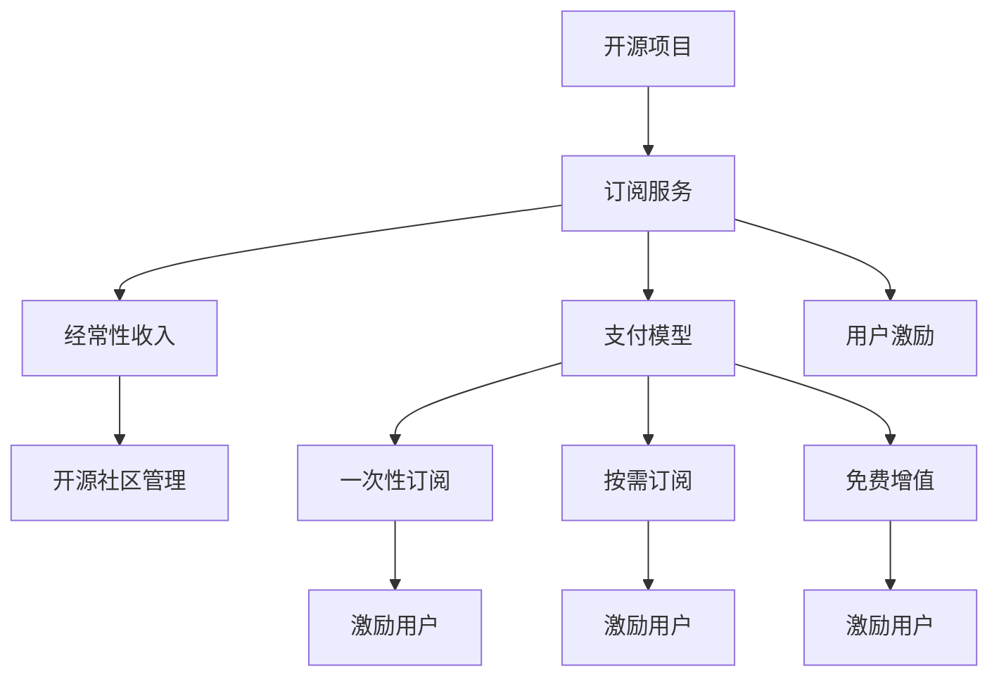

                 

# 建立开源项目的订阅服务：创造经常性收入

> 关键词：开源项目, 订阅服务, 经常性收入, 开源社区, 支付模型, 商业模式, 用户激励, 维护成本

## 1. 背景介绍

随着开源软件生态的不断壮大，开源项目越来越受到开发者和企业的重视。然而，开源项目的长期维护和持续发展，往往面临着资金、资源等方面的挑战。如何在开源项目上创造经常性收入，支持其稳定运营，成为了一个迫切需要解决的问题。本文将探讨如何建立开源项目的订阅服务，以创造经常性收入，为开源社区的持续发展提供动力。

### 1.1 问题由来

开源项目通常由一群志愿者共同维护，由于缺乏商业模式的支撑，很多项目在初期开发后难以持续。开源社区和商业组织的合作，成为推动开源项目发展的关键。然而，商业组织也需要在开源项目中获得价值，否则将不愿意投入资源。因此，探索一种既能支持开源项目，又能满足商业组织需求的双赢模式，就显得尤为重要。

### 1.2 问题核心关键点

建立一个可持续的开源项目订阅服务，需要解决以下几个核心问题：

- 如何设计合理的支付模型，以吸引企业和开发者订阅？
- 如何平衡开源社区和商业组织的利益，避免出现利益冲突？
- 如何设计有效的用户激励机制，激发社区成员的贡献？
- 如何管理订阅服务的用户群，降低维护成本？

通过解决上述问题，可以构建一个既能提供高质量的开源软件，又能实现商业价值的模式，推动开源社区的繁荣发展。

### 1.3 问题研究意义

建立一个可持续的开源项目订阅服务，对于开源社区和商业组织都有着重要的意义：

- 开源社区：可以获得稳定的资金支持，保障项目的长期维护和创新。
- 商业组织：可以获取高质量的开源软件，提高自身的技术能力和市场竞争力。

此外，基于开源项目订阅服务模式的成功实践，还将带动更多的开源社区和商业组织合作，形成良性互动，加速技术创新和产业升级。

## 2. 核心概念与联系

### 2.1 核心概念概述

为更好地理解开源项目订阅服务的建立过程，本节将介绍几个密切相关的核心概念：

- **开源项目(Open Source Project)**：由开发者共同维护，公开源代码的软件项目，旨在促进技术共享和协同创新。

- **订阅服务(Subscription Service)**：用户按照一定周期支付费用的服务模式，提供高质量的软件或服务。

- **经常性收入(Recurring Revenue)**：通过定期收取费用，持续产生的收入来源，主要用于支撑服务或产品的长期运营。

- **开源社区(Open Source Community)**：由开发者、用户、贡献者共同组成的社区，以开源项目为核心，分享知识和技术。

- **支付模型(Payment Model)**：定义用户如何为订阅服务付费的方式，包括一次性订阅、按需订阅、免费增值等。

- **用户激励(User Incentives)**：通过激励机制，鼓励用户积极参与项目开发、使用和推广。

- **维护成本(Maintenance Cost)**：开源项目长期运营过程中，维护和更新软件所需的人力、物力和财力成本。

- **商业模式(Business Model)**：通过满足用户需求，实现商业价值的策略，如广告、付费订阅、授权等。

- **开源社区管理(Open Source Community Management)**：通过有效的组织和管理，激发社区成员的积极性和创造力，推动项目的持续发展。

这些核心概念之间的逻辑关系可以通过以下Mermaid流程图来展示：



这个流程图展示了我们提到的核心概念及其之间的关系：

1. 开源项目通过订阅服务获取经常性收入。
2. 订阅服务设计合理的支付模型，如一次性订阅、按需订阅、免费增值等。
3. 用户激励机制引导用户积极参与项目。
4. 开源社区管理保障社区的健康发展。

这些概念共同构成了开源项目订阅服务的构建框架，为实现可持续发展的开源项目提供了理论支持。

## 3. 核心算法原理 & 具体操作步骤
### 3.1 算法原理概述

开源项目订阅服务的建立，本质上是一个多目标优化问题。需要平衡开源社区和商业组织的利益，设计合理的支付模型，激励用户积极参与，同时控制维护成本，实现可持续发展的目标。

**主要目标**：

1. 吸引更多用户订阅，获取经常性收入。
2. 激发社区成员的积极性和创造力，推动项目创新。
3. 降低维护成本，保障项目的长期运营。

**算法框架**：

1. **需求分析**：通过市场调研和用户反馈，分析用户需求和支付意愿。
2. **模型设计**：根据需求分析结果，设计合理的支付模型和用户激励机制。
3. **成本管理**：通过优化资源配置和运营策略，降低项目维护成本。
4. **效果评估**：定期评估订阅服务的运营效果，持续改进和优化。

### 3.2 算法步骤详解

建立一个可持续的开源项目订阅服务，主要包括以下几个关键步骤：

**Step 1: 需求分析**

1. **市场调研**：通过问卷调查、用户访谈等方式，了解潜在用户的需求和支付意愿。
2. **竞争分析**：分析同类型项目和服务的市场表现，找到自身的竞争优势。
3. **用户反馈**：收集和分析用户反馈，识别用户痛点和需求。

**Step 2: 支付模型设计**

1. **一次性订阅**：用户支付固定费用，获取特定时间内的软件或服务。适用于一次性需求较多的用户。
2. **按需订阅**：用户按使用量付费，适用于需要灵活调整服务水平的用户。
3. **免费增值**：基础服务免费，通过附加功能或增值服务收费，适用于吸引新用户。

**Step 3: 用户激励设计**

1. **积分系统**：用户通过积极参与项目开发、使用和推广，获得积分奖励，积分可用于兑换免费服务或优惠。
2. **贡献认证**：通过公开表彰贡献者，提高社区成员的荣誉感和归属感。
3. **奖励计划**：为突出贡献者提供奖励，如技术支持、公开感谢等。

**Step 4: 维护成本管理**

1. **资源优化**：通过合理配置资源，提高项目的开发和维护效率。
2. **开源合作**：与其他开源项目和社区合作，共享资源和知识，降低成本。
3. **自动化工具**：使用自动化工具，减少重复性工作，提高效率。

**Step 5: 效果评估与优化**

1. **定期评估**：通过数据和用户反馈，定期评估订阅服务的运营效果。
2. **持续改进**：根据评估结果，持续改进和优化支付模型、用户激励和成本管理策略。
3. **用户反馈**：建立用户反馈机制，及时响应和解决用户问题。

### 3.3 算法优缺点

**优点**：

1. **稳定收入**：通过定期收取费用，实现经常性收入，保障项目的长期运营。
2. **用户激励**：通过激励机制，激发用户积极参与项目开发和推广。
3. **成本控制**：通过优化资源配置，降低维护成本，提高项目的可持续性。

**缺点**：

1. **用户流失**：用户可能因各种原因取消订阅，影响收入稳定性。
2. **利益冲突**：商业组织和开源社区的利益可能存在冲突，需要平衡。
3. **用户反馈处理**：处理用户反馈和问题需要大量时间和精力。

尽管存在这些局限性，但整体而言，订阅服务模式为开源项目的可持续发展提供了有力的支持，具备广阔的应用前景。

### 3.4 算法应用领域

开源项目订阅服务在多个领域得到了应用，例如：

- **企业内部开源项目**：企业内部开发者可以获取开源软件的支持和更新，同时企业可以定期支付订阅费用。
- **开源社区服务**：开源社区提供高质量的软件和工具，通过订阅获得稳定收入，用于社区管理和项目运营。
- **第三方服务提供商**：提供开源项目相关的增值服务，如技术支持、咨询等，通过订阅获得收益。
- **开源教育**：提供开源教育相关的课程和资料，吸引学生和教育机构订阅，获取收入。
- **开源应用开发**：开发基于开源技术的商业应用，通过订阅服务吸引用户，实现盈利。

这些应用场景展示了订阅服务模式的多样性和灵活性，未来还有更多的创新空间。

## 4. 数学模型和公式 & 详细讲解
### 4.1 数学模型构建

假设有一个开源项目订阅服务，订阅者数量为 $N$，每个订阅者每月支付的费用为 $C$，用户每月活跃度为 $A$。设月收入为 $R$，项目维护成本为 $M$。

**模型目标**：

$$
\max R = N \times C \times A - M
$$

其中 $R$ 为目标函数，$N$ 为订阅者数量，$C$ 为每次订阅费用，$A$ 为月活跃度，$M$ 为维护成本。

### 4.2 公式推导过程

**收入公式**：

$$
R = N \times C \times A
$$

**维护成本公式**：

$$
M = \alpha_1 \times N + \alpha_2 \times C + \alpha_3 \times A
$$

其中 $\alpha_1$ 为固定管理成本系数，$\alpha_2$ 为变动管理成本系数，$\alpha_3$ 为变动开发成本系数。

**利润公式**：

$$
\pi = R - M = N \times C \times A - \alpha_1 \times N - \alpha_2 \times C - \alpha_3 \times A
$$

**优化目标**：

$$
\max \pi
$$

### 4.3 案例分析与讲解

以GitHub的开源项目订阅服务为例，进行案例分析。

GitHub提供多种付费计划，如免费计划、个人计划、企业计划等，用户可以选择适合自己的计划。通过支付费用，用户可以获得GitHub提供的私有仓库、代码托管、代码审查、数据分析等增值服务。

1. **需求分析**：GitHub通过市场调研和用户反馈，了解用户对私有仓库、代码托管等增值服务的需求，设计了多种付费计划。
2. **支付模型**：GitHub提供了按月和按年两种订阅模式，用户可以根据自己的需求选择订阅计划。
3. **用户激励**：GitHub通过积分系统、贡献认证等方式，激励用户积极参与开源项目的贡献和推广。
4. **维护成本**：GitHub通过优化资源配置，使用自动化工具，降低项目维护成本。
5. **效果评估**：GitHub定期评估订阅服务的运营效果，根据用户反馈持续改进和优化。

通过这些措施，GitHub实现了可持续发展的订阅服务，推动了开源社区的健康发展。

## 5. 项目实践：代码实例和详细解释说明
### 5.1 开发环境搭建

要进行开源项目订阅服务的开发，需要搭建相应的开发环境。以下是使用Python进行开发的环境配置流程：

1. 安装Python：从官网下载并安装Python 3.x版本。
2. 安装pip：在命令行下运行 `python -m pip install --upgrade pip`。
3. 安装Django：在命令行下运行 `pip install Django`。
4. 安装MySQLdb：在命令行下运行 `pip install MySQLdb`。

完成上述步骤后，即可在本地搭建Django开发环境。

### 5.2 源代码详细实现

下面以一个简单的开源项目订阅服务为例，给出使用Django框架进行开发的PyTorch代码实现。

首先，创建Django项目和应用：

```bash
django-admin startproject opensourceproject
cd opensourceproject
django-admin startapp subscriptions
```

然后，定义数据库模型和迁移：

```python
from django.db import models

class User(models.Model):
    email = models.EmailField(unique=True)
    is_admin = models.BooleanField(default=False)
    is_premium = models.BooleanField(default=False)

class Subscription(models.Model):
    user = models.ForeignKey(User, on_delete=models.CASCADE)
    start_date = models.DateField()
    end_date = models.DateField()
    plan = models.CharField(max_length=50)

def create_user(user_data):
    user, created = User.objects.get_or_create(email=user_data['email'])
    user.is_admin = True
    user.save()

def create_subscription(user, plan):
    subscription = Subscription.objects.create(user=user, start_date=today(), end_date=计划时长，plan=plan)
    user.is_premium = True
    user.save()
```

接下来，定义订阅服务的支付模型：

```python
from django.conf import settings
from django.db.models.signals import post_save
from django.dispatch import receiver

@receiver(post_save, sender=User)
def user_premium_status(sender, instance, created, **kwargs):
    if created:
        if instance.is_admin:
            user = User.objects.filter(email=instance.email).first()
            user.is_premium = True
            user.save()
```

然后，实现用户激励机制：

```python
from django.db.models.signals import post_save
from django.dispatch import receiver

@receiver(post_save, sender=User)
def user_integral(sender, instance, created, **kwargs):
    if created:
        user = User.objects.filter(email=instance.email).first()
        user.integral += 1
        user.save()
```

最后，启动Django开发服务器：

```bash
python manage.py runserver
```

以上是一个简单的开源项目订阅服务项目的开发过程。通过使用Django框架，可以轻松实现用户管理、订阅管理、用户激励等功能。

### 5.3 代码解读与分析

**User模型**：
- `email`：用户邮箱，唯一标识。
- `is_admin`：是否为管理员，默认为False。
- `is_premium`：是否为付费用户，默认为False。

**Subscription模型**：
- `user`：用户，一对一关系。
- `start_date`：订阅开始日期。
- `end_date`：订阅结束日期。
- `plan`：订阅计划。

**create_user函数**：
- 根据邮箱创建用户，如果邮箱已存在，则获取该用户对象。
- 如果用户为管理员，则将 `is_admin` 设置为True。

**create_subscription函数**：
- 根据用户和订阅计划创建订阅，同时将用户 `is_premium` 设置为True。

**user_premium_status信号处理函数**：
- 当用户创建时，如果用户为管理员，则将其 `is_premium` 设置为True。

**user_integral信号处理函数**：
- 当用户创建时，为其增加积分，积分用于兑换免费服务或优惠。

通过以上代码，我们可以看到，开源项目订阅服务的开发主要涉及用户管理、订阅管理、用户激励等功能。这些功能的实现，为订阅服务的运营提供了坚实的基础。

## 6. 实际应用场景

### 6.1 企业内部开源项目

企业内部开发者可以获取开源软件的支持和更新，同时企业可以定期支付订阅费用。通过这种方式，企业可以节省大量的研发成本，同时确保软件的安全性和稳定性。

### 6.2 开源社区服务

开源社区提供高质量的软件和工具，通过订阅获得稳定收入，用于社区管理和项目运营。这种方式可以有效保障开源社区的可持续性，推动项目的持续发展。

### 6.3 第三方服务提供商

提供开源项目相关的增值服务，如技术支持、咨询等，通过订阅获得收益。这种模式可以最大化利用开源项目的价值，同时提供高质量的服务。

### 6.4 开源教育

提供开源教育相关的课程和资料，吸引学生和教育机构订阅，获取收入。这种模式可以有效推广开源教育，促进技术知识的传播和应用。

### 6.5 开源应用开发

开发基于开源技术的商业应用，通过订阅服务吸引用户，实现盈利。这种模式可以充分利用开源技术的优势，推动应用的发展。

## 7. 工具和资源推荐
### 7.1 学习资源推荐

为了帮助开发者系统掌握开源项目订阅服务的相关知识，这里推荐一些优质的学习资源：

1. **《开源项目管理》书籍**：介绍开源项目的全生命周期管理，涵盖需求分析、项目规划、开发、维护等多个环节。
2. **GitHub官方文档**：GitHub的官方文档，提供了丰富的开源项目管理工具和资源，帮助开发者构建和运营开源项目。
3. **开源社区管理工具**：如JIRA、Redmine等，提供了开源项目管理、协作、任务分配等功能，支持社区成员的积极参与。
4. **开源社区合作平台**：如OpenHatch、FOSSAsia等，促进开源项目之间的合作和交流，推动项目的协同创新。
5. **开源教育平台**：如edX、Coursera等，提供高质量的开源教育课程和资源，培养下一代开源人才。

通过对这些资源的学习实践，相信你一定能够快速掌握开源项目订阅服务的核心技能，为开源社区的持续发展贡献力量。

### 7.2 开发工具推荐

高效的开发离不开优秀的工具支持。以下是几款用于开源项目订阅服务开发的常用工具：

1. **Django框架**：Python的Web框架，提供了丰富的功能，支持用户管理、订阅管理、用户激励等。
2. **MySQL数据库**：开源的关系型数据库，支持高效的数据存储和查询。
3. **Git版本控制**：Git提供了强大的版本控制功能，支持项目的协作和维护。
4. **JIRA工具**：开源项目管理工具，支持任务分配、进度跟踪、协作等功能。
5. **Redmine工具**：开源项目管理工具，提供了项目计划、文档管理、资源分配等功能。

合理利用这些工具，可以显著提升开源项目订阅服务的开发效率，加快创新迭代的步伐。

### 7.3 相关论文推荐

开源项目订阅服务的发展源于学界的持续研究。以下是几篇奠基性的相关论文，推荐阅读：

1. **《开源项目的经济模式》**：分析了开源项目的多种商业模式，探讨了如何通过商业化运营支持开源项目的持续发展。
2. **《开源社区的激励机制》**：研究了如何通过激励机制，激发社区成员的积极性和创造力，推动项目的创新。
3. **《开源项目的维护成本管理》**：探讨了如何通过优化资源配置和运营策略，降低项目的维护成本，提高项目的可持续性。
4. **《开源项目订阅服务的案例研究》**：分析了GitHub的成功案例，总结了开源项目订阅服务的关键成功因素。
5. **《开源项目订阅服务的未来趋势》**：探讨了开源项目订阅服务的发展趋势和未来挑战，提出了相应的应对策略。

这些论文代表了大规模开源项目的商业模式和发展脉络，帮助研究者把握学科前进方向，激发更多的创新灵感。

## 8. 总结：未来发展趋势与挑战

### 8.1 总结

本文对建立开源项目订阅服务的过程进行了全面系统的介绍。首先阐述了开源项目和订阅服务的基本概念，明确了实现可持续发展的开源项目订阅服务的关键步骤。其次，从原理到实践，详细讲解了订阅服务的数学模型和实际应用，给出了开源项目订阅服务开发的完整代码实例。同时，本文还广泛探讨了订阅服务在多个领域的应用前景，展示了订阅服务的广阔应用空间。最后，本文精选了订阅服务的各类学习资源，力求为开发者提供全方位的技术指引。

通过本文的系统梳理，可以看到，开源项目订阅服务为开源社区的持续发展提供了有力支持，具备广阔的应用前景。未来，伴随开源项目的持续创新和商业模式的不断探索，开源项目订阅服务必将在开源社区和商业组织之间形成良性互动，推动技术的快速发展。

### 8.2 未来发展趋势

展望未来，开源项目订阅服务将呈现以下几个发展趋势：

1. **多层次支付模型**：提供多种订阅计划，满足不同用户的需求。
2. **用户激励机制多样化**：引入积分、贡献认证、奖励计划等多种激励方式。
3. **社区合作和资源共享**：加强开源项目之间的合作和资源共享，提高项目的可持续性。
4. **自动化和智能化**：引入自动化工具和智能化算法，提高项目的管理和运营效率。
5. **跨平台支持**：支持多平台和多种设备，满足不同用户的需求。
6. **安全性保障**：提供数据加密、访问控制等安全保障措施，保障用户数据的安全。

以上趋势凸显了开源项目订阅服务的广阔前景。这些方向的探索发展，必将进一步提升开源社区的运营水平，推动技术的普及和应用。

### 8.3 面临的挑战

尽管开源项目订阅服务已经取得了显著的进展，但在迈向更加智能化、普适化应用的过程中，它仍面临着诸多挑战：

1. **用户流失**：用户可能因各种原因取消订阅，影响收入稳定性。
2. **利益冲突**：商业组织和开源社区的利益可能存在冲突，需要平衡。
3. **用户反馈处理**：处理用户反馈和问题需要大量时间和精力。
4. **维护成本**：开源项目的长期运营需要大量的资金和资源。

尽管存在这些挑战，但整体而言，开源项目订阅服务模式为开源社区的可持续发展提供了有力的支持，具备广阔的应用前景。

### 8.4 研究展望

面对开源项目订阅服务所面临的挑战，未来的研究需要在以下几个方面寻求新的突破：

1. **用户行为分析**：通过数据分析，深入了解用户需求和行为，优化订阅服务的设计。
2. **个性化订阅**：根据用户的行为和需求，提供个性化的订阅计划，提高用户的满意度。
3. **市场推广**：通过有效的市场推广，吸引更多用户订阅，扩大订阅服务的用户群。
4. **社区协作**：建立更有效的社区协作机制，提高项目的协同创新能力。
5. **自动化工具**：引入更多自动化工具，提高项目的开发和维护效率。
6. **安全性保障**：提供更强的安全保障措施，确保用户数据的安全。

这些研究方向将推动开源项目订阅服务模式不断完善，为开源社区和商业组织带来更多的价值。

## 9. 附录：常见问题与解答

**Q1：什么是开源项目订阅服务？**

A: 开源项目订阅服务是一种可持续发展的商业模式，通过收取用户订阅费用，为开源项目提供稳定收入，同时激励社区成员的积极参与和贡献，推动项目的持续创新和进步。

**Q2：如何设计合理的支付模型？**

A: 设计合理的支付模型，需要考虑用户的支付意愿和需求。常见的支付模型包括一次性订阅、按需订阅和免费增值等。需要根据项目的特点和目标，选择合适的支付模型。

**Q3：如何管理订阅服务的用户群？**

A: 管理订阅服务的用户群，需要建立有效的用户激励机制，如积分系统、贡献认证、奖励计划等。同时，需要及时处理用户反馈和问题，提高用户的满意度和忠诚度。

**Q4：如何降低维护成本？**

A: 降低维护成本，需要优化资源配置，使用自动化工具，提高项目的开发和维护效率。同时，加强开源项目之间的合作和资源共享，降低单独运营的成本。

**Q5：如何评估订阅服务的运营效果？**

A: 评估订阅服务的运营效果，需要定期收集和分析用户反馈、订阅数据和财务数据。通过数据驱动，及时调整和优化支付模型、用户激励和成本管理策略，提高服务的质量和运营效率。

通过以上问答，希望能对开源项目订阅服务的建立和运营提供更为全面的指导。相信随着技术的不断进步和社区的共同努力，开源项目订阅服务必将在开源社区和商业组织之间发挥更大的作用，推动技术创新和产业发展。

---

作者：禅与计算机程序设计艺术 / Zen and the Art of Computer Programming

