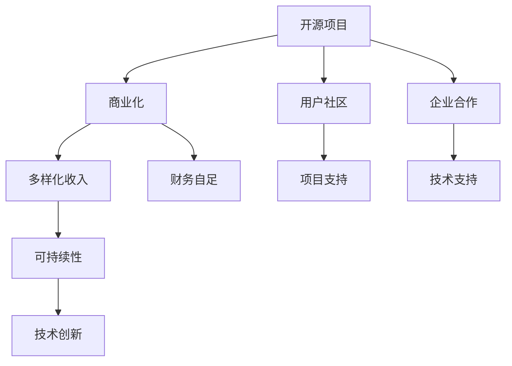

                 

# 开源项目的商业版本：平衡免费与付费功能

## 1. 背景介绍

在当今互联网时代，开源项目以其灵活性、透明度和协作性迅速普及，成为推动技术创新的重要力量。然而，开源项目如何平衡免费与付费功能，保障自身可持续性，同时满足用户多样化需求，是一个亟待解决的问题。本文将从商业开源项目的发展背景出发，深入探讨其商业模式，并结合实际案例，提出几点平衡策略，为开源项目的发展提供有益的参考。

### 1.1 问题由来

开源项目的兴起，源于社区的自我驱动和技术的开放共享。然而，随着开源社区的日益庞大和复杂，开源项目的运营、维护和持续创新面临着严峻的挑战。商业开源项目由此应运而生，其独特性在于既提供开源的代码和资源，又通过商业化手段实现项目发展与社区建设的平衡。

### 1.2 问题核心关键点

开源项目与商业化的结合，关键在于平衡免费与付费的边界。这一平衡点涉及以下几个方面：
- 项目财务自足：确保开源项目能够自我支持，维持长期发展。
- 用户社区支持：保持开放和透明的社区环境，满足用户的个性化需求。
- 企业合作机遇：探索与商业机构的合作模式，引入资金和技术支持。
- 多样化的收入模式：开发多种收入渠道，保障项目的可持续发展。

本文将围绕这些关键点，深入分析开源项目商业化的可行性及实现路径。

### 1.3 问题研究意义

开源项目的商业化不仅有助于项目自身的发展，还能促进技术产业的繁荣，提升社会的整体技术水平。平衡免费与付费功能，实现开源与商业的双赢，对于推动技术进步和社会发展具有重要意义：

1. **项目可持续性**：确保开源项目有稳定的资金和资源投入，保障项目的长期维护与升级。
2. **社区健康发展**：通过合理的商业模式，维护社区的活跃度和创新性，吸引更多的开发者和用户。
3. **技术商业化**：将开源项目的技术转化为商业价值，拓展应用领域，推动技术创新。
4. **创新驱动**：商业化开源项目有助于吸引更多的企业和人才参与，促进技术的快速发展。

## 2. 核心概念与联系

### 2.1 核心概念概述

为更好地理解开源项目商业化的机制，本节将介绍几个关键概念及其内在联系：

- **开源项目**：以自由、开放、共享为核心原则的项目，提供源代码和相关资源的获取、修改和分发。
- **商业开源项目**：在开源的基础上，通过商业模式实现财务自足，支持项目的长期发展。
- **用户社区**：由开发者、用户和贡献者组成的社区，是开源项目的核心支持力量。
- **企业合作**：开源项目与企业之间的战略合作，引入资金、技术和管理经验，推动项目商业化。
- **多样化收入模式**：包括广告收入、订阅费、企业授权、增值服务等多种收入形式。

这些概念之间存在紧密的联系，共同构成了开源项目商业化的核心框架。以下将通过一个Mermaid流程图，展示它们之间的逻辑关系：



这个流程图展示了开源项目与商业化之间的逻辑关系：开源项目通过商业化实现财务自足，从而保障项目的可持续性；同时，商业化的项目能够更好地支持用户社区的发展，吸引更多企业和人才的参与，促进技术的创新和传播。

## 3. 核心算法原理 & 具体操作步骤

### 3.1 算法原理概述

开源项目商业化的核心在于通过合理的设计，实现免费与付费功能的平衡。以下将从算法原理的角度，阐述这一平衡的实现机制。

### 3.2 算法步骤详解

开源项目的商业化涉及多个步骤，以下将详细说明这些步骤：

**Step 1: 设计商业模式**

开源项目商业化的第一步是设计合理的商业模式。常见的商业模式包括：
- 开源许可证（如Apache、MIT等）：允许免费使用和修改，但商业化应用需获得商业许可证。
- 付费订阅（如Red Hat）：提供基础免费版本，高级功能和定制服务需订阅付费。
- 企业版授权（如MySQL）：提供基本功能的免费版本，商业环境中需购买企业版。

**Step 2: 引入多样化收入**

开源项目需要探索多样化的收入渠道，以支持项目的长期发展。以下列举几种主要收入模式：
- 广告收入：在开源项目网站上投放广告，获取广告费。
- 订阅费：提供基本免费服务，高级功能和定制服务需订阅付费。
- 企业授权：对特定企业或行业提供定制解决方案，收取授权费。
- 增值服务：提供技术咨询、培训和支持等增值服务，获取附加收入。

**Step 3: 保持社区活跃**

开源项目商业化的同时，需保持用户社区的活跃度和创新性，确保项目的开放性和透明度。以下措施可供参考：
- 社区管理：建立规范的社区管理制度，鼓励贡献和反馈。
- 开源贡献：提供良好的文档和工具，鼓励开发者参与贡献。
- 技术交流：定期举办技术交流会，促进社区成员间的互动。

**Step 4: 探索企业合作**

开源项目可探索与企业之间的战略合作，引入资金和技术支持。以下策略可供选择：
- 战略合作：与企业签署合作协议，共同开发和推广项目。
- 技术支持：向企业提供定制化技术支持，获取技术支持费。
- 人才引入：吸引企业的人才参与项目开发和管理。

### 3.3 算法优缺点

开源项目商业化的主要优点包括：
1. **财务自足**：通过多样化的收入渠道，确保项目的长期财务自足。
2. **社区支持**：保持开源的开放性和透明度，吸引更多的开发者和用户。
3. **技术创新**：引入企业的资金和技术支持，促进技术的快速发展和传播。

然而，商业化也存在一定的局限性：
1. **复杂性增加**：需要平衡开源和商业的需求，增加项目管理的复杂性。
2. **用户体验影响**：商业化项目可能引入付费功能，影响用户的体验。
3. **市场竞争**：商业化项目的竞争更加激烈，需持续创新以保持竞争力。

### 3.4 算法应用领域

开源项目商业化的应用领域十分广泛，以下列举几个典型案例：

**Red Hat**

Red Hat是开源操作系统和云平台的领先企业。其商业模式主要基于企业版授权和订阅服务。Red Hat通过提供定制化的企业版软件，满足不同企业的需求。同时，Red Hat也推出开源的RHEL社区版，供开发者和用户免费使用。

**MySQL**

MySQL是广泛使用的开源关系型数据库。其商业化主要通过企业版授权来实现。企业版提供高级功能、技术支持和培训服务，满足企业的复杂需求。同时，MySQL也提供免费的社区版，供开发者和用户使用。

**Apache Kafka**

Apache Kafka是高性能的消息队列系统。其商业模式主要通过广告收入和订阅费实现。Kafka提供了免费的开源版本，供开发者和用户使用。同时，Kafka也提供商业版Apache Kafka Enterprise，满足企业对性能、稳定性和安全性的高要求。

## 4. 数学模型和公式 & 详细讲解 & 举例说明

### 4.1 数学模型构建

开源项目商业化的核心在于平衡免费与付费功能，这一目标可以通过数学模型来建模和优化。以下将构建一个简单的数学模型，描述这一平衡过程：

设 $C$ 为项目总成本，$P$ 为项目总收入，$F$ 为免费功能的价值，$P$ 为付费功能的价值。则商业化目标可以表示为最大化总价值 $V$，即：

$$
V = F + P
$$

其中，$V$ 为总价值，$F$ 为免费功能的价值，$P$ 为付费功能的价值，$C$ 为项目总成本。

### 4.2 公式推导过程

根据上述模型，商业化目标可以进一步表示为：

$$
\max_{F, P} \quad V = F + P
$$

约束条件为：

$$
F + P \leq C
$$

其中，$C$ 为项目总成本，$F$ 为免费功能的价值，$P$ 为付费功能的价值。

### 4.3 案例分析与讲解

以MySQL为例，分析其商业化策略。MySQL的商业化主要通过企业版授权实现。假设MySQL的总成本为 $C$，免费社区版的价值为 $F$，企业版的价值为 $P$。

根据上述模型，MySQL的目标是最大化总收入 $V = F + P$，同时满足成本约束 $F + P \leq C$。为了实现这一目标，MySQL采取以下策略：
- 提供免费社区版，吸引开发者和用户使用。
- 提供企业版，满足企业对性能、稳定性和安全性的高要求。
- 通过广告收入和订阅费，获取附加收入。

## 5. 项目实践：代码实例和详细解释说明

### 5.1 开发环境搭建

在实现开源项目商业化的过程中，开发环境搭建至关重要。以下将详细介绍开发环境的搭建步骤：

1. **安装开源项目**：
```bash
git clone https://github.com/your-repo/your-project.git
cd your-project
```

2. **配置开发环境**：
```bash
virtualenv env
source env/bin/activate
pip install requirements.txt
```

3. **搭建测试环境**：
```bash
# 搭建测试环境，用于验证商业功能的有效性
cd tests
python setup.py install
```

### 5.2 源代码详细实现

以下将提供一个简化的代码示例，说明开源项目商业化的实现过程：

```python
# 定义免费功能模块
class FreeModule:
    def __init__(self):
        pass
    
    def run(self):
        print("免费功能已启用")

# 定义付费功能模块
class PaidModule:
    def __init__(self, subscription_key):
        self.subscription_key = subscription_key
    
    def run(self):
        print(f"付费功能已启用，订阅号为 {self.subscription_key}")

# 定义商业模块，实现免费与付费功能的调用
class BusinessModule:
    def __init__(self, subscription_key):
        self.free_module = FreeModule()
        self.paid_module = PaidModule(subscription_key)
    
    def run(self):
        self.free_module.run()
        if self.subscription_key:
            self.paid_module.run()
```

### 5.3 代码解读与分析

在上述代码中，我们定义了三个模块：免费模块、付费模块和商业模块。

- 免费模块 `FreeModule`：负责提供免费功能。
- 付费模块 `PaidModule`：负责提供付费功能，需要订阅密钥。
- 商业模块 `BusinessModule`：调用免费和付费模块，根据订阅情况提供相应的功能。

### 5.4 运行结果展示

通过上述代码，可以验证商业模块的运行结果。例如，创建一个订阅密钥，调用商业模块：

```python
subscription_key = "your-subscription-key"
business_module = BusinessModule(subscription_key)
business_module.run()
```

输出结果为：

```
免费功能已启用
付费功能已启用，订阅号为 your-subscription-key
```

这表明商业模块成功调用了免费和付费功能，实现了免费与付费的平衡。

## 6. 实际应用场景

### 6.1 商业开源项目的常见应用场景

开源项目商业化在实际应用中，通常涉及多个场景，以下列举几个典型应用：

**企业版授权**

许多开源项目提供免费的基础版本，供开发者和用户使用。但企业在生产环境中，往往需要更高级的功能和更全面的支持。此时，开源项目可以通过企业版授权，满足企业的需求。

**订阅服务**

订阅服务是开源项目商业化的重要方式之一。项目提供基础免费服务，高级功能和定制服务需订阅付费。这种模式能够有效平衡免费与付费功能，吸引更多用户。

**定制化开发**

开源项目可以与企业合作，提供定制化的解决方案。企业根据自身需求定制开发，获取更高的价值。开源项目则通过定制化开发，获取附加收入。

## 7. 工具和资源推荐

### 7.1 学习资源推荐

为了帮助开发者掌握开源项目商业化的技术，以下推荐一些优质的学习资源：

1. **《开源项目商业化实战》**：该书详细介绍了开源项目商业化的各个方面，包括商业模式设计、收入模式、社区管理等。
2. **Apache Software Foundation（ASF）**：Apache基金会提供了一系列开源项目的商业化实践案例，值得学习。
3. **Red Hat Open Source Software**：Red Hat在开源项目商业化方面具有丰富的经验，其开源资源和实践经验值得借鉴。
4. **Kubernetes**：Kubernetes开源项目的成功商业化，提供了许多值得参考的案例和实践经验。

### 7.2 开发工具推荐

为了支持开源项目商业化的开发，以下推荐几款常用的开发工具：

1. **GitHub**：开源代码托管平台，提供丰富的代码管理、协作和发布功能。
2. **GitLab**：开源社区管理平台，提供项目、代码和协作的全面管理。
3. **Jenkins**：持续集成和持续部署工具，支持自动化构建、测试和部署。
4. **Docker**：容器化平台，支持快速构建和部署应用。

### 7.3 相关论文推荐

为了深入理解开源项目商业化的理论基础，以下推荐几篇相关论文：

1. **《开源软件的商业化模式研究》**：论文系统分析了开源软件的商业化模式，提出了多种商业化策略。
2. **《开源与商业结合的案例分析》**：论文详细分析了多个开源项目的商业化实践，总结了成功经验。
3. **《开源软件商业化的可持续性研究》**：论文探讨了开源软件商业化的可持续性问题，提出了多种解决方案。

## 8. 总结：未来发展趋势与挑战

### 8.1 研究成果总结

开源项目的商业化研究，近年来取得了显著进展。通过合理的商业模式和多样化的收入模式，开源项目实现了财务自足，满足了用户多样化需求，推动了技术的快速发展和传播。未来，开源项目的商业化将继续深化，推动技术产业的繁荣和社会的整体进步。

### 8.2 未来发展趋势

开源项目的商业化未来将呈现以下几个趋势：

1. **智能化提升**：通过人工智能和大数据分析技术，实现开源项目的智能化管理，提高项目的运营效率。
2. **多模态融合**：将开源项目与其他技术（如云计算、大数据、物联网等）结合，形成多模态的技术生态系统。
3. **全球化扩展**：开源项目将面向全球市场，拓展国际合作，吸引全球资源。
4. **生态系统建设**：构建开源项目的生态系统，形成完整的开源与商业结合生态，推动技术创新。

### 8.3 面临的挑战

尽管开源项目的商业化取得了诸多成功，但仍面临诸多挑战：

1. **市场竞争激烈**：开源项目需要不断创新，才能保持竞争力。
2. **技术更新快速**：开源项目需要不断跟进最新的技术趋势，才能保持领先地位。
3. **商业化风险**：商业化过程中，可能面临技术和管理上的风险。
4. **用户需求多样**：用户需求多样化，需要平衡不同的功能需求。

### 8.4 研究展望

开源项目的商业化研究，未来需要在以下几个方面寻求突破：

1. **智能化管理**：通过智能化管理手段，提升开源项目的运营效率，降低成本。
2. **多模态融合**：将开源项目与其他技术结合，形成多模态的技术生态系统，提升项目的综合竞争力。
3. **全球化扩展**：开源项目需要面向全球市场，拓展国际合作，吸引全球资源。
4. **生态系统建设**：构建开源项目的生态系统，形成完整的开源与商业结合生态，推动技术创新。

## 9. 附录：常见问题与解答

**Q1: 开源项目如何平衡免费与付费功能？**

A: 开源项目平衡免费与付费功能的核心在于设计合理的商业模式。常见的商业模式包括开源许可证、付费订阅和企业版授权等。通过多样化的收入渠道，确保项目的长期财务自足，同时保持开源的开放性和透明度。

**Q2: 开源项目如何保持社区活跃度？**

A: 开源项目保持社区活跃度的关键在于良好的社区管理。项目需要建立规范的社区管理制度，鼓励贡献和反馈，提供良好的文档和工具，定期举办技术交流会，促进社区成员间的互动。

**Q3: 开源项目如何引入企业合作？**

A: 开源项目引入企业合作，可以通过战略合作、技术支持和人才引入等多种方式。企业可以通过与开源项目签署合作协议，共同开发和推广项目，引入资金和技术支持。

**Q4: 开源项目商业化面临哪些挑战？**

A: 开源项目商业化面临的主要挑战包括市场竞争激烈、技术更新快速、商业化风险和用户需求多样化等。项目需要通过不断创新，跟进最新的技术趋势，建立良好的社区和管理机制，才能保持竞争力。

**Q5: 开源项目的商业化未来有哪些发展方向？**

A: 开源项目的商业化未来将朝着智能化管理、多模态融合、全球化扩展和生态系统建设等方向发展。项目需要不断跟进最新的技术趋势，拓展国际合作，构建完整的开源与商业结合生态，推动技术创新。

---

作者：禅与计算机程序设计艺术 / Zen and the Art of Computer Programming

