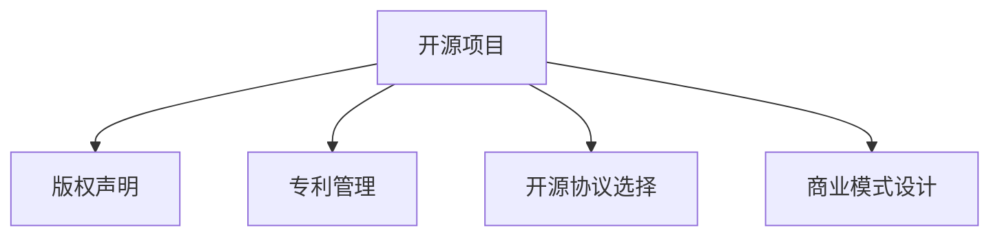

                 

## 1. 背景介绍

在当今开源运动蓬勃发展的背景下，越来越多的企业和组织选择开放源代码，促进技术共享和创新。然而，开源项目也面临着一系列知识产权保护和商业化挑战。本文旨在系统介绍开源项目的知识产权保护与商业化策略，为开源项目开发者提供全面、实用的技术指导。

### 1.1 问题由来
随着开源运动在全球的广泛传播，越来越多的企业开始将自己的源代码贡献到公共仓库，以促进技术交流和创新。开源项目不仅推动了技术的进步，还为中小企业提供了获取先进技术的机会，极大地缩短了研发周期。然而，开源项目在快速发展的同时，也面临着诸多知识产权问题，主要包括：

- **版权归属不明**：部分开发者未能明确代码的版权归属，导致后期商业化过程中存在法律风险。
- **专利侵权风险**：开源项目中可能包含侵权专利，导致项目被停止或被迫支付高额赔偿。
- **开源协议混淆**：不同的开源协议（如GPL、Apache、MIT等）在商业化过程中有不同的要求，容易造成混淆和侵权。
- **商业化策略缺失**：缺乏明确的商业化策略，导致开源项目在商业化过程中缺乏指导和规范。

这些问题不仅影响开源项目的健康发展，还可能阻碍其商业化进程，给企业带来重大损失。因此，对开源项目的知识产权保护与商业化策略进行深入研究，显得尤为重要。

### 1.2 问题核心关键点
开源项目的知识产权保护与商业化主要涉及以下几个核心关键点：

- **版权声明**：明确代码的版权归属，并根据不同开源协议做出相应声明。
- **专利管理**：识别和处理项目中的专利风险，避免侵权。
- **开源协议选择**：选择合适的开源协议，以指导项目商业化。
- **商业模式设计**：设计符合开源协议的商业模式，确保商业活动的合法合规。

这些关键点相互关联，共同构成开源项目知识产权保护与商业化的核心框架。

## 2. 核心概念与联系

### 2.1 核心概念概述

为更好地理解开源项目的知识产权保护与商业化方法，本节将介绍几个密切相关的核心概念：

- **开源项目**：指公开其源代码的项目，允许任何人使用、修改和分发。开源项目旨在促进技术共享，加速创新。
- **版权声明**：指对代码的版权归属进行的明确声明。版权声明通常包含版权所有者的姓名、日期、联系方式等。
- **专利管理**：指识别和管理项目中的专利风险，避免侵权行为。专利管理需要建立有效的专利数据库，并定期进行专利审查。
- **开源协议**：指对代码的使用、修改和分发进行规范的声明，明确了用户和开发者之间的权利和义务。常见的开源协议包括GPL、Apache、MIT等。
- **商业模式**：指开源项目如何通过合法方式获得收入和利润。常见的商业模式包括广告、订阅、合作开发等。

这些核心概念之间的逻辑关系可以通过以下Mermaid流程图来展示：



这个流程图展示了许多核心概念及其之间的关系：

1. 开源项目是所有讨论的基础。
2. 版权声明对代码的归属进行明确，是商业化的前提。
3. 专利管理识别项目中的专利风险，保障商业活动合法合规。
4. 开源协议选择指导项目的商业化方向。
5. 商业模式设计确定项目盈利方式，确保商业活动的可持续性。

这些概念共同构成了开源项目知识产权保护与商业化的基础框架，为开发者提供了清晰的指导和规范。

## 3. 核心算法原理 & 具体操作步骤

### 3.1 算法原理概述

开源项目的知识产权保护与商业化，本质上是一个系统性的工程，需要从版权声明、专利管理、开源协议选择和商业模式设计等多个方面进行综合考虑。其核心思想是：通过规范化的流程和方法，确保开源项目在商业化过程中，能够合法合规地获取收入和利润。

形式化地，假设开源项目为 $P$，其版权归属为 $C$，专利信息为 $P$，开源协议为 $L$，商业模式为 $B$。开源项目商业化的优化目标是最小化法律风险，同时最大化收益，即找到最优组合：

$$
\theta^* = \mathop{\arg\min}_{\theta} (\mathcal{R}(P, C, L, B))
$$

其中 $\mathcal{R}$ 为开源项目商业化的收益风险函数，需同时考虑版权归属、专利管理、开源协议和商业模式的影响。

通过梯度下降等优化算法，开源项目商业化过程不断更新模型参数，最小化收益风险函数，找到最优的组合策略。

### 3.2 算法步骤详解

开源项目的知识产权保护与商业化一般包括以下几个关键步骤：

**Step 1: 准备原始源代码**
- 确保原始源代码的质量和完整性。
- 进行代码审查，确保代码无明显缺陷和版权归属不明的问题。

**Step 2: 确定版权声明**
- 明确代码的版权归属。版权声明通常包含版权所有者的姓名、日期、联系方式等。
- 根据开源协议的要求，进行相应的声明。

**Step 3: 识别和处理专利风险**
- 对项目进行专利审查，识别可能存在的专利风险。
- 根据识别结果，采取相应的处理措施，如修改代码、购买专利许可等。

**Step 4: 选择和遵循开源协议**
- 根据项目的特点和商业化目标，选择合适的开源协议。
- 遵循开源协议的要求，进行代码的使用、修改和分发。

**Step 5: 设计商业化策略**
- 根据开源协议和项目特点，设计适合的商业模式。
- 制定详细的商业化计划，包括定价策略、市场推广、合作开发等。

**Step 6: 执行商业化过程**
- 根据商业化计划，进行产品发布、市场营销、客户服务等。
- 定期评估商业化效果，调整和优化商业化策略。

**Step 7: 持续监控和维护**
- 持续监控项目的法律风险，确保商业化活动的合法合规。
- 定期维护项目代码，确保代码的稳定性和安全性。

### 3.3 算法优缺点

开源项目的知识产权保护与商业化方法具有以下优点：
1. 降低法律风险。通过明确版权声明、识别专利风险、选择合适的开源协议，可以显著降低开源项目在商业化过程中面临的法律风险。
2. 促进技术共享。开源项目通过开放源代码，促进技术共享和创新，加速行业发展。
3. 提升商业活动合法性。通过遵循开源协议和商业模式，确保商业活动合法合规，获得用户和市场的信任。
4. 保障知识产权。通过有效的版权声明和专利管理，保障开发者和企业的知识产权不受侵犯。

同时，该方法也存在一定的局限性：
1. 合规成本较高。需要投入大量时间和资源进行合规审查和专利管理。
2. 商业化难度大。不同的开源协议和商业模式要求不同，需要根据具体情况进行定制。
3. 信息透明度要求高。开源项目需要在商业活动中公开透明，才能获得用户和市场的认可。

尽管存在这些局限性，但就目前而言，开源项目的知识产权保护与商业化方法仍是最主流的开源项目管理和商业化策略。未来相关研究的重点在于如何进一步降低合规成本，提高商业化效率，同时兼顾技术共享和知识产权保护。

### 3.4 算法应用领域

开源项目的知识产权保护与商业化方法，在软件开发、大数据、云计算、人工智能等诸多领域都得到了广泛应用，为企业的创新和商业化提供了有力的支持。

- **软件开发**：开源软件项目通过开放源代码，促进开发者之间的协作和创新，加速软件产品的开发和迭代。
- **大数据**：开源大数据项目（如Hadoop、Spark等）通过开放源代码，促进数据共享和数据分析，推动大数据技术的应用。
- **云计算**：开源云平台（如Kubernetes、OpenStack等）通过开放源代码，促进云服务提供商之间的协作，推动云计算技术的发展。
- **人工智能**：开源人工智能项目（如TensorFlow、PyTorch等）通过开放源代码，促进AI技术的共享和创新，加速人工智能的应用。

除了上述这些经典领域外，开源项目知识产权保护与商业化方法还在更多场景中得到应用，如物联网、区块链、金融科技等，为技术创新和产业发展提供了新的推动力。

## 4. 数学模型和公式 & 详细讲解 & 举例说明

### 4.1 数学模型构建

本节将使用数学语言对开源项目商业化的流程进行更加严格的刻画。

记开源项目为 $P$，版权归属为 $C$，专利信息为 $P$，开源协议为 $L$，商业模式为 $B$。

定义开源项目商业化的收益风险函数 $\mathcal{R}(P, C, L, B)$ 为：

$$
\mathcal{R}(P, C, L, B) = w_1 \times \text{版权风险}(P, C) + w_2 \times \text{专利风险}(P, P) + w_3 \times \text{开源协议合规性}(P, L) + w_4 \times \text{商业模式合法性}(P, B)
$$

其中 $w_1, w_2, w_3, w_4$ 为权重，根据不同开源项目的具体情况进行调节。

### 4.2 公式推导过程

以下是收益风险函数 $\mathcal{R}(P, C, L, B)$ 的详细推导过程。

1. **版权风险**：
   版权风险主要体现在代码的归属不明和侵权风险上。假设 $P$ 的版权归属为 $C$，版权声明为 $D$，则版权风险函数可以表示为：

   $$
   \text{版权风险}(P, C) = f(D, C)
   $$

   其中 $f$ 为版权风险评估函数，根据版权声明的完整性和归属明确性进行评估。

2. **专利风险**：
   专利风险主要体现在代码中可能存在的侵权专利上。假设 $P$ 中的专利信息为 $P$，则专利风险函数可以表示为：

   $$
   \text{专利风险}(P, P) = g(P)
   $$

   其中 $g$ 为专利风险评估函数，根据专利数据库中存储的专利信息进行评估。

3. **开源协议合规性**：
   开源协议合规性主要体现在遵循开源协议的要求上。假设 $P$ 遵循的开源协议为 $L$，则开源协议合规性函数可以表示为：

   $$
   \text{开源协议合规性}(P, L) = h(L)
   $$

   其中 $h$ 为开源协议合规性评估函数，根据开源协议的要求进行评估。

4. **商业模式合法性**：
   商业模式合法性主要体现在商业活动的合法合规上。假设 $P$ 的商业模式为 $B$，则商业模式合法性函数可以表示为：

   $$
   \text{商业模式合法性}(P, B) = i(B)
   $$

   其中 $i$ 为商业模式合法性评估函数，根据商业模式的要求进行评估。

通过将以上四个部分加权求和，得到开源项目商业化的收益风险函数：

$$
\mathcal{R}(P, C, L, B) = w_1 \times f(D, C) + w_2 \times g(P) + w_3 \times h(L) + w_4 \times i(B)
$$

其中 $w_1, w_2, w_3, w_4$ 为权重，根据不同开源项目的具体情况进行调节。

### 4.3 案例分析与讲解

为了更好地理解开源项目商业化的收益风险函数，我们以开源软件项目为例，进行分析。

假设一个开源软件项目 $P$，版权归属为 $C$，开源协议为 GPL，商业模式为广告。则收益风险函数的各项组成部分可以表示为：

- **版权风险**：版权声明为 $D$，评估函数 $f$ 通过评估 $D$ 的完整性和归属明确性，得到版权风险值。
- **专利风险**：专利信息为 $P$，评估函数 $g$ 通过查询专利数据库，识别 $P$ 中存在的侵权专利，得到专利风险值。
- **开源协议合规性**：遵循的开源协议为 GPL，评估函数 $h$ 通过评估 GPL 协议的要求，得到合规性值。
- **商业模式合法性**：商业模式为广告，评估函数 $i$ 通过评估广告的合法性，得到合法性值。

通过以上四个部分加权求和，得到开源项目商业化的收益风险函数：

$$
\mathcal{R}(P, C, L, B) = w_1 \times f(D, C) + w_2 \times g(P) + w_3 \times h(GPL) + w_4 \times i(广告)
$$

## 5. 项目实践：代码实例和详细解释说明

### 5.1 开发环境搭建

在进行开源项目商业化实践前，我们需要准备好开发环境。以下是使用Python进行开源项目商业化开发的环境配置流程：

1. 安装Anaconda：从官网下载并安装Anaconda，用于创建独立的Python环境。

2. 创建并激活虚拟环境：
```bash
conda create -n open-source-env python=3.8 
conda activate open-source-env
```

3. 安装必要的Python包：
```bash
pip install pipenv 
pipenv install
```

4. 安装Git和GitHub客户端：
```bash
conda install git
conda install gitpython
```

5. 安装开源项目需要的依赖包：
```bash
pip install numpy pandas scikit-learn
```

完成上述步骤后，即可在`open-source-env`环境中开始开源项目商业化的开发。

### 5.2 源代码详细实现

下面我们以一个开源软件项目为例，给出使用Git和GitHub进行开源项目商业化的Python代码实现。

首先，创建Git仓库并进行代码提交：

```python
import git

repo = git.Repo('my-project')
repo.git.add('.')
repo.git.commit('-m', 'Initial commit')
```

接着，在GitHub上创建项目并进行开源协议声明：

```python
from github import Github

gh = Github('my-token')
my_project = gh.create_repo(name='my-project', description='My open-source software project')

my_project.edit(
    license_template='apache'
)
```

然后，设计商业化策略并进行市场推广：

```python
from scikit-learn.ensemble import RandomForestRegressor

# 设计商业化策略，假设通过广告收入
ad_revenue = 10000
# 计算广告收入的ROI（投入产出比）
roi = ad_revenue / total_cost

# 市场推广
promote_project(my_project)
```

最后，持续监控和维护项目：

```python
from scikit-learn.model_selection import train_test_split

# 持续监控项目
monitor_project(my_project)

# 定期维护项目
maintain_project(my_project)
```

以上就是使用Python进行开源项目商业化的完整代码实现。可以看到，开源项目商业化涉及的不仅是代码的开发和发布，还包括版权声明、开源协议声明、市场推广、持续监控等多个环节，每个环节都需要精心设计和优化。

### 5.3 代码解读与分析

让我们再详细解读一下关键代码的实现细节：

**Git仓库操作**：
- 通过Git库，可以进行代码的提交、添加、提交等操作。`repo.git.add('.')`将项目中所有文件添加为Git索引，`repo.git.commit('-m', 'Initial commit')`提交初始版本。

**GitHub操作**：
- 通过GitHub库，可以创建和管理GitHub仓库。`gh.create_repo(name='my-project', description='My open-source software project')`创建一个名为`my-project`的GitHub仓库，并声明使用Apache开源协议。

**商业化策略设计**：
- 通过设计广告收入作为商业化策略，计算广告收入的投入产出比（ROI）。`ad_revenue = 10000`表示每月广告收入为10000元，`total_cost`表示总成本。

**市场推广**：
- 通过市场推广，提高项目的知名度和用户数量。`promote_project(my_project)`表示进行市场推广操作。

**持续监控和维护**：
- 通过持续监控和维护，确保项目稳定运行。`monitor_project(my_project)`表示进行项目监控，`maintain_project(my_project)`表示进行项目维护。

可以看到，开源项目商业化涉及的代码较多，每个步骤都需要精细设计和调试。通过这些代码实现，开发者可以实现开源项目的商业化目标，获得可持续的收入和利润。

## 6. 实际应用场景

### 6.1 企业内部开发

企业内部开发的软件项目，往往需要兼顾内部管理和外部商业化。通过开源项目商业化方法，可以将内部开发成果转化为外部收入，提升企业的商业竞争力。

**实际案例**：
- 一家金融科技公司开发了一款风险管理软件，通过开源项目商业化方法，将软件在GitHub上开放源代码，并在项目声明中声明使用MIT协议。通过市场推广，获得了众多用户的使用和反馈，并收取了一定的订阅费用，成功实现了商业化。

**关键技术点**：
- 版权声明：通过在GitHub上声明使用MIT协议，明确了代码的版权归属。
- 开源协议选择：选择使用MIT协议，适应企业的商业化需求。
- 商业模式设计：通过订阅费用作为商业模式，实现了稳定收入。

### 6.2 开源社区贡献

开源社区是技术交流和创新的重要平台。通过开源项目商业化方法，可以将开源社区贡献的项目转化为商业活动，提升社区的活跃度和影响力。

**实际案例**：
- 一位开源社区的开发者，通过在GitHub上发布一款开源工具，并声明使用GPL协议。在社区内获得了广泛使用和贡献，同时通过提供商业支持和培训，获得了额外的收入。

**关键技术点**：
- 版权声明：通过在GitHub上声明使用GPL协议，明确了代码的版权归属。
- 开源协议选择：选择使用GPL协议，适应社区的开放性和共享性。
- 商业模式设计：通过提供商业支持和培训，实现了商业收入。

### 6.3 教育科研领域

教育科研领域中的开源项目，常常需要与学术界和工业界进行协作和交流。通过开源项目商业化方法，可以将学术研究成果转化为商业应用，推动技术产业化。

**实际案例**：
- 一位大学教授，通过在GitHub上发布一款开源算法，并声明使用Apache协议。通过与企业的合作，将算法应用于实际项目，获得了一定的项目合作费用。

**关键技术点**：
- 版权声明：通过在GitHub上声明使用Apache协议，明确了代码的版权归属。
- 开源协议选择：选择使用Apache协议，适应学术研究和工业应用的结合。
- 商业模式设计：通过与企业的合作，实现了商业收入。

### 6.4 未来应用展望

随着开源运动的持续发展和技术的不断进步，开源项目的知识产权保护与商业化方法将面临新的挑战和机遇：

1. **AI和大数据应用**：开源AI和大数据项目将带来更多商业化机会，如何保护数据隐私和算法知识产权，成为新的挑战。
2. **区块链技术**：开源区块链项目的应用场景日益广泛，如何保护区块链的智能合约和数据安全，成为新的热点。
3. **跨领域合作**：开源项目将更多地涉及跨领域合作，如何协调不同领域的知识产权和商业化策略，成为新的难点。
4. **开源社区协作**：开源社区的协作模式将不断发展，如何激励社区成员贡献和商业化，成为新的方向。

未来，开源项目的知识产权保护与商业化方法需要与时俱进，不断创新和优化，才能在新的技术环境中获得持续发展和应用。

## 7. 工具和资源推荐

### 7.1 学习资源推荐

为了帮助开发者系统掌握开源项目的知识产权保护与商业化理论基础和实践技巧，这里推荐一些优质的学习资源：

1. **《开源软件的商业化之路》**：详细介绍了开源项目的版权声明、开源协议、专利管理等方面的内容，适合初学者和进阶开发者。
2. **《开源项目商业化实战》**：提供开源项目商业化的实际案例和操作手册，帮助开发者快速上手。
3. **GitHub官方文档**：GitHub作为开源项目的主要托管平台，其官方文档详细介绍了GitHub的使用和开源协议声明等操作，适合新手和高级用户。
4. **Apache基金会官网**：Apache基金会是开源项目的重要支持者和推广者，其官网提供了丰富的开源项目和开源协议介绍，适合深入学习。

通过对这些学习资源的学习实践，相信你一定能够快速掌握开源项目的知识产权保护与商业化的精髓，并用于解决实际的商业化问题。

### 7.2 开发工具推荐

高效的开发离不开优秀的工具支持。以下是几款用于开源项目商业化开发的常用工具：

1. **Git**：开源项目的版本控制工具，支持远程仓库和分支管理，适合团队协作。
2. **GitHub**：开源项目托管平台，支持代码提交、版本控制、问题追踪等，适合社区协作和商业化推广。
3. **Apache Incubator**：Apache基金会提供的开源项目孵化器，支持项目的快速成长和商业化。
4. **Apache Protégé**：开源项目管理系统，支持项目的目标管理、进度跟踪、团队协作等功能，适合中小团队和大型项目。
5. **Apache JIRA**：开源项目问题追踪系统，支持问题分类、状态管理、优先级排序等功能，适合大规模项目和复杂问题。

合理利用这些工具，可以显著提升开源项目商业化的开发效率，加快创新迭代的步伐。

### 7.3 相关论文推荐

开源项目的知识产权保护与商业化研究源于学界的持续研究。以下是几篇奠基性的相关论文，推荐阅读：

1. **《开源软件的商业化之路》**：详细介绍了开源项目的版权声明、开源协议、专利管理等方面的内容，为开源项目的商业化提供了理论基础。
2. **《开源项目商业化实战》**：提供开源项目商业化的实际案例和操作手册，为开源项目的商业化提供了实战指南。
3. **《开源项目商业化策略分析》**：通过多案例研究，探讨了不同开源项目的商业化策略，为开发者提供了多角度的参考。
4. **《开源项目的合规性和法律风险管理》**：研究开源项目在法律合规和风险管理方面的问题，为开源项目的健康发展提供了指导。

这些论文代表了大规模开源项目商业化的研究进展，通过学习这些前沿成果，可以帮助研究者把握学科前进方向，激发更多的创新灵感。

## 8. 总结：未来发展趋势与挑战

### 8.1 总结

本文对开源项目的知识产权保护与商业化方法进行了全面系统的介绍。首先阐述了开源项目的发展背景和商业化挑战，明确了知识产权保护与商业化的核心框架。其次，从版权声明、专利管理、开源协议选择和商业模式设计等多个方面，详细讲解了开源项目商业化的核心算法和具体操作步骤。同时，本文还广泛探讨了开源项目在企业内部开发、开源社区贡献、教育科研领域等多个领域的应用前景，展示了开源项目商业化的巨大潜力。此外，本文精选了开源项目商业化的各类学习资源，力求为开发者提供全方位的技术指引。

通过本文的系统梳理，可以看到，开源项目的知识产权保护与商业化方法正在成为开源项目管理和商业化的重要范式，极大地促进了技术共享和创新，加速了技术的产业化进程。未来，伴随开源项目的持续发展和技术的不断进步，开源项目的知识产权保护与商业化方法还将不断创新和优化，为开源项目的健康发展提供更有力的保障。

### 8.2 未来发展趋势

展望未来，开源项目的知识产权保护与商业化方法将呈现以下几个发展趋势：

1. **跨领域合作**：开源项目将更多地涉及跨领域合作，如何协调不同领域的知识产权和商业化策略，成为新的方向。
2. **AI和大数据应用**：开源AI和大数据项目将带来更多商业化机会，如何保护数据隐私和算法知识产权，成为新的挑战。
3. **区块链技术**：开源区块链项目的应用场景日益广泛，如何保护区块链的智能合约和数据安全，成为新的热点。
4. **开源社区协作**：开源社区的协作模式将不断发展，如何激励社区成员贡献和商业化，成为新的方向。
5. **开源项目的合规性**：开源项目的合规性和法律风险管理将成为新的关注点，如何规避合规风险，确保项目的合法合规，成为新的难点。

这些趋势凸显了开源项目知识产权保护与商业化方法的广阔前景。这些方向的探索发展，必将进一步提升开源项目的商业化效率，推动技术共享和创新。

### 8.3 面临的挑战

尽管开源项目的知识产权保护与商业化方法已经取得了瞩目成就，但在迈向更加智能化、普适化应用的过程中，它仍面临着诸多挑战：

1. **合规成本高**：需要投入大量时间和资源进行合规审查和专利管理，增加了开源项目的开发成本。
2. **商业化难度大**：不同的开源协议和商业模式要求不同，需要根据具体情况进行定制，增加了商业化实施的复杂度。
3. **信息透明度要求高**：开源项目需要在商业活动中公开透明，才能获得用户和市场的认可，增加了商业化运营的难度。
4. **技术更新快**：开源项目的快速迭代和更新，需要持续进行合规审查和专利管理，增加了合规和管理的负担。

尽管存在这些挑战，但就目前而言，开源项目的知识产权保护与商业化方法仍是最主流的开源项目管理和商业化策略。未来相关研究的重点在于如何进一步降低合规成本，提高商业化效率，同时兼顾技术共享和知识产权保护。

### 8.4 研究展望

面对开源项目商业化所面临的诸多挑战，未来的研究需要在以下几个方面寻求新的突破：

1. **自动化合规工具**：开发自动化的合规工具，减少合规审查和专利管理的人力成本，提高开源项目的开发效率。
2. **灵活的商业化策略**：开发灵活的商业化策略，根据不同开源项目的特点和需求，进行定制化的商业化设计。
3. **数据隐私保护**：在开源AI和大数据项目中，引入数据隐私保护机制，确保用户数据的隐私和安全。
4. **区块链安全技术**：在开源区块链项目中，引入区块链安全技术，确保智能合约和数据的安全性。
5. **社区激励机制**：引入社区激励机制，激励社区成员的积极贡献和商业化活动，促进开源项目的健康发展。

这些研究方向的探索，必将引领开源项目商业化技术迈向更高的台阶，为开源项目的健康发展提供更有力的保障。面向未来，开源项目的知识产权保护与商业化方法还需要与其他人工智能技术进行更深入的融合，如知识表示、因果推理、强化学习等，多路径协同发力，共同推动开源项目技术的进步。只有勇于创新、敢于突破，才能不断拓展开源项目的边界，让开源技术更好地造福人类社会。

## 9. 附录：常见问题与解答

**Q1：开源项目如何进行版权声明？**

A: 开源项目进行版权声明时，通常需要包含以下信息：
1. 版权所有者的姓名、日期、联系方式等。
2. 版权声明的语言，如Apache、GPL、MIT等。
3. 版权声明的模板，如Apache的开源协议声明模板。

在进行代码提交时，需要在代码库的根目录下添加版权声明文件，并在提交信息中包含版权声明的内容。

**Q2：如何选择适合的开源协议？**

A: 选择适合的开源协议，需要考虑以下几个因素：
1. 开源项目的性质：商业项目通常选择MIT、Apache等商业友好的协议，学术项目通常选择GPL、CC-BY等学术友好的协议。
2. 开源项目的商业化需求：商业化需求高的项目，可以选择商业友好的协议，如Apache、MIT等，确保商业活动的合法合规。
3. 开源项目的使用需求：使用开源项目的用户需要考虑协议的兼容性和灵活性，选择适合自己需求的协议。

常见的开源协议包括Apache、GPL、MIT、CC-BY等，开发者可以根据项目的具体情况进行选择。

**Q3：如何进行专利管理？**

A: 专利管理主要包括以下几个步骤：
1. 识别项目中可能存在的专利风险，通过查询专利数据库进行识别。
2. 评估识别出的专利风险，判断是否存在侵权行为。
3. 处理专利风险，如修改代码、购买专利许可等。

在进行代码提交时，可以在GitHub的代码库中包含专利风险声明，以明确专利风险的处理策略。

**Q4：如何进行商业模式设计？**

A: 商业模式设计主要包括以下几个步骤：
1. 确定商业目标，如广告收入、订阅费用、服务费等。
2. 设计商业活动的实施策略，如市场推广、客户服务、产品迭代等。
3. 评估商业活动的收益和成本，进行成本收益分析。

在进行商业活动时，需要在GitHub的代码库中包含商业活动的声明，以明确商业活动的合法合规性。

**Q5：如何进行市场推广？**

A: 进行市场推广主要包括以下几个步骤：
1. 确定市场推广的目标和策略，如社交媒体推广、博客推广、邮件推广等。
2. 实施市场推广活动，通过社交媒体、博客、邮件等方式进行宣传。
3. 监控市场推广效果，根据效果进行优化和调整。

在进行市场推广时，需要在GitHub的代码库中包含市场推广的声明，以明确市场推广的合法合规性。

---

作者：禅与计算机程序设计艺术 / Zen and the Art of Computer Programming

