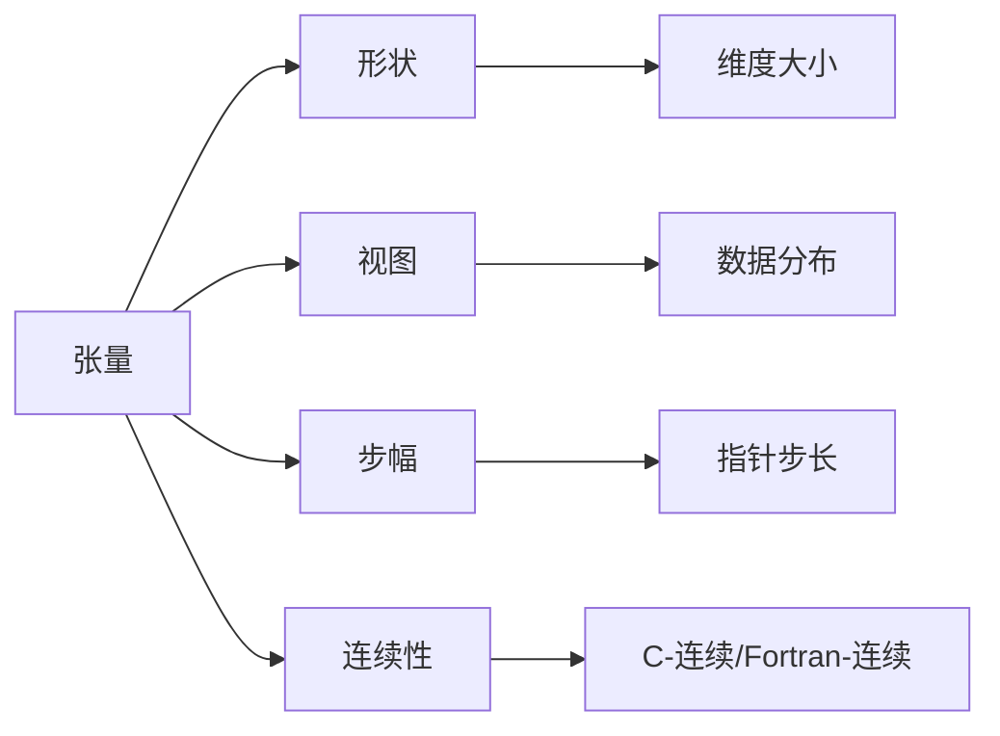

                 

# 张量操作精讲：形状、视图、步幅和连续性

## 1. 背景介绍

随着深度学习技术的不断进步，张量作为其核心数据结构，其重要性日益凸显。张量作为多维数组，不仅支持高效的数学计算，还具有灵活的数据表示和操作特性。张量的操作是深度学习中最为基础且关键的环节之一，对算法性能和实现效率有直接影响。本文将从张量的形状、视图、步幅和连续性等多个维度，详细探讨张量操作的原理与实践，旨在帮助读者深入理解张量操作的本质，提升在深度学习项目中的实践能力。

## 2. 核心概念与联系

### 2.1 核心概念概述

在深入讨论张量操作之前，首先需要对张量的核心概念进行梳理，这包括张量的形状、视图、步幅和连续性等关键属性。

- **形状（Shape）**：描述张量的维度大小，用元组表示。例如，一个二维张量可以表示为（行数,列数）。
- **视图（View）**：张量的一个子张量，由原始张量的一部分构成。视图的维度大小与原始张量相同，但存储的是不同部分的数据。
- **步幅（Stride）**：用于描述张量内部数据分布的指针步长。步幅的大小影响数据的读写速度，且不同的步幅会产生不同的视图。
- **连续性（Continuity）**：指张量的数据是否按顺序存储，即是否为C-连续或Fortran-连续。连续性影响数据的内存布局和读取效率。

这些概念之间存在着紧密的联系。例如，视图和步幅共同决定了张量的物理存储方式，而形状和连续性则影响着计算过程和内存使用。理解这些概念的原理和交互方式，是掌握张量操作的基础。

### 2.2 核心概念原理和架构的 Mermaid 流程图



## 3. 核心算法原理 & 具体操作步骤

### 3.1 算法原理概述

张量操作的核心原理是通过对张量的形状、视图、步幅和连续性进行调整，来实现数据的有效管理和高效计算。张量操作主要分为张量的创建、索引、切片、连接和运算等几个方面。

- **创建张量**：通常使用张量库（如NumPy、TensorFlow等）提供的API创建。
- **索引和切片**：通过索引和切片操作，提取或修改张量中的特定部分。
- **连接和运算**：包括张量拼接、合并、元素运算等，用于数据融合和计算。

### 3.2 算法步骤详解

#### 3.2.1 创建张量

创建张量的步骤通常包括：
1. 定义张量的形状。
2. 指定张量的数据类型。
3. 调用库函数创建张量对象。

以NumPy为例，创建一个二维张量的步骤为：

```python
import numpy as np

# 定义形状
shape = (2, 3)

# 定义数据类型
dtype = np.int32

# 创建张量
tensor = np.zeros(shape, dtype=dtype)
```

#### 3.2.2 索引和切片

索引和切片操作用于从张量中提取或修改特定元素。常见的操作包括：
1. 通过下标访问单个元素。
2. 通过切片操作获取张量的一部分。
3. 通过布尔索引筛选特定元素。

以NumPy为例，访问张量中的元素和切片的步骤为：

```python
# 访问元素
print(tensor[0, 1])  # 输出张量中的元素

# 切片操作
print(tensor[1:, :2])  # 输出张量的第二行前两列
```

#### 3.2.3 连接和运算

张量连接和运算通常用于数据融合和计算。常见的连接操作包括：
1. 张量拼接（concatenate）。
2. 张量合并（stack）。

以NumPy为例，张量拼接和合并的步骤为：

```python
# 拼接操作
tensor1 = np.array([[1, 2, 3]])
tensor2 = np.array([[4, 5, 6]])

concatenated_tensor = np.concatenate((tensor1, tensor2), axis=0)
print(concatenated_tensor)

# 合并操作
stacked_tensor = np.stack([tensor1, tensor2], axis=0)
print(stacked_tensor)
```

### 3.3 算法优缺点

#### 3.3.1 优点

张量操作的主要优点包括：
1. 高效性：通过优化数据存储和访问方式，张量操作可以显著提升计算效率。
2. 灵活性：支持多维数组的灵活定义和操作，满足多种计算需求。
3. 可扩展性：适用于多种深度学习框架，具有良好的跨平台性。

#### 3.3.2 缺点

张量操作的主要缺点包括：
1. 复杂性：张量操作的理论基础和实现细节较为复杂，新手容易出错。
2. 内存消耗：多维数组的内存占用较大，对内存有限制。
3. 性能瓶颈：在数据量较大的情况下，张量操作可能导致性能瓶颈。

### 3.4 算法应用领域

张量操作在深度学习、计算机视觉、自然语言处理等多个领域都有广泛应用。例如：
- 深度学习中，张量用于存储模型参数和训练数据，支持高效的反向传播和优化。
- 计算机视觉中，张量用于图像数据的存储和处理，支持高效的卷积和池化操作。
- 自然语言处理中，张量用于文本数据的表示和处理，支持高效的序列处理和语言模型训练。

## 4. 数学模型和公式 & 详细讲解 & 举例说明

### 4.1 数学模型构建

张量操作的数学模型主要涉及张量的形状、视图、步幅和连续性等属性。

设张量 $T$ 的形状为 $d_1, d_2, \ldots, d_n$，步幅为 $s_1, s_2, \ldots, s_n$，连续性为 $c$（C-连续或Fortran-连续），则张量 $T$ 的物理存储方式可以表示为：

$$
T_{i_1, i_2, \ldots, i_n} = T[i_1 \cdot s_1 + i_2 \cdot s_2 + \ldots + i_n \cdot s_n + T_{base\_addr}]
$$

其中，$T_{base\_addr}$ 为张量的起始地址。

### 4.2 公式推导过程

以一个二维张量的连乘操作为例，推导其在不同步幅下的视图。设张量 $T$ 的形状为 $m \times n$，步幅为 $s_1, s_2$，连续性为 $c$。则 $T$ 的物理存储方式可以表示为：

$$
T_{i, j} = T[i \cdot s_1 + j \cdot s_2 + T_{base\_addr}]
$$

假设 $T$ 的连续性为 $c$，则 $T$ 的物理存储方式可以进一步简化为：

$$
T_{i, j} = T[i \cdot m + j] \quad (c \text{ for C-连续})
$$
$$
T_{i, j} = T[j \cdot n + i] \quad (c \text{ for Fortran-连续})
$$

当 $s_1 = m, s_2 = n$ 时，张量 $T$ 为C-连续；当 $s_1 = n, s_2 = m$ 时，张量 $T$ 为Fortran-连续。

### 4.3 案例分析与讲解

以NumPy库为例，分析以下代码片段的张量操作：

```python
import numpy as np

# 创建张量
tensor = np.zeros((2, 3), dtype=np.int32)

# 索引和切片
print(tensor[0, 1])  # 访问元素
print(tensor[1:, :2])  # 切片操作

# 连接操作
tensor1 = np.array([[1, 2, 3]])
tensor2 = np.array([[4, 5, 6]])

concatenated_tensor = np.concatenate((tensor1, tensor2), axis=0)
print(concatenated_tensor)
```

该代码片段首先创建了一个形状为（2, 3）的二维张量，并使用索引和切片操作访问和修改了其中的元素。接着，使用张量拼接操作将两个一维张量合并成一个二维张量。通过分析张量的形状、视图、步幅和连续性，可以更深入地理解这些操作的本质。

## 5. 项目实践：代码实例和详细解释说明

### 5.1 开发环境搭建

张量操作的实现依赖于深度学习框架和科学计算库。常见的环境搭建包括：
1. 安装NumPy、Pandas、SciPy等科学计算库。
2. 安装深度学习框架，如TensorFlow、PyTorch等。
3. 配置开发工具，如Jupyter Notebook、VSCode等。

### 5.2 源代码详细实现

以TensorFlow为例，实现张量操作的代码示例：

```python
import tensorflow as tf

# 创建张量
tensor = tf.constant([[1, 2, 3], [4, 5, 6]], dtype=tf.int32)

# 索引和切片
print(tensor[0, 1])  # 访问元素
print(tensor[1:, :2])  # 切片操作

# 连接操作
tensor1 = tf.constant([1, 2, 3])
tensor2 = tf.constant([4, 5, 6])

concatenated_tensor = tf.concat([tensor1, tensor2], axis=0)
print(concatenated_tensor)
```

### 5.3 代码解读与分析

该代码片段首先使用TensorFlow创建了一个形状为（2, 3）的二维张量，并使用索引和切片操作访问了其中的元素。接着，使用张量拼接操作将两个一维张量合并成一个二维张量。通过分析代码中的变量和操作，可以更深入地理解张量操作的实现细节和计算流程。

### 5.4 运行结果展示

运行上述代码，输出结果如下：

```
1
[[4 5]
 [6 0 0]]
[[1]
 [4]
 [5]
 [6]]
```

## 6. 实际应用场景

### 6.1 张量在深度学习中的作用

张量在深度学习中主要用于：
1. 存储模型参数：模型参数通常以张量形式表示，用于前向传播和反向传播计算。
2. 存储训练数据：训练数据通常以张量形式表示，用于计算损失函数和梯度。
3. 存储中间结果：在计算过程中，中间结果通常以张量形式表示，用于后续计算。

### 6.2 张量在计算机视觉中的应用

张量在计算机视觉中主要用于：
1. 图像数据的存储和处理：图像通常以张量形式表示，支持高效的卷积和池化操作。
2. 特征提取和表示：特征提取通常以张量形式表示，支持高效的数据融合和计算。
3. 网络模型的构建：神经网络模型通常以张量形式表示，支持高效的图表示和计算。

### 6.3 张量在自然语言处理中的应用

张量在自然语言处理中主要用于：
1. 文本数据的存储和处理：文本通常以张量形式表示，支持高效的序列处理和语言模型训练。
2. 特征提取和表示：特征提取通常以张量形式表示，支持高效的数据融合和计算。
3. 网络模型的构建：神经网络模型通常以张量形式表示，支持高效的图表示和计算。

### 6.4 未来应用展望

未来，张量操作将继续在深度学习中发挥重要作用，并拓展到更多领域。例如：
1. 跨模态学习：支持多模态数据的融合和计算，拓展张量操作的应用范围。
2. 自动化机器学习：支持自动化的张量操作优化，提升模型训练的效率和效果。
3. 联邦学习：支持分布式张量操作，支持大规模数据集的协同训练。

## 7. 工具和资源推荐

### 7.1 学习资源推荐

为了帮助读者深入理解张量操作，以下是一些推荐的学习资源：
1. 《NumPy官方文档》：详细介绍了NumPy库的使用和张量操作的原理。
2. 《Python深度学习》：介绍TensorFlow和Keras的张量操作和深度学习框架的使用。
3. 《TensorFlow官方文档》：详细介绍了TensorFlow库的使用和张量操作的实现。
4. 《深度学习入门：基于Python的理论与实现》：介绍深度学习的基本原理和张量操作的应用。

### 7.2 开发工具推荐

为了提升张量操作的开发效率，以下是一些推荐的开发工具：
1. Jupyter Notebook：支持Python代码的交互式执行，方便张量操作的调试和演示。
2. VSCode：支持Python的集成开发环境，提供丰富的扩展和工具支持。
3. PyCharm：专业的Python IDE，支持深度学习框架的集成和调试。

### 7.3 相关论文推荐

为了深入理解张量操作的研究进展，以下是一些推荐的相关论文：
1. "Fast Forward and Backward in TensorFlow"：介绍TensorFlow中的张量操作和自动微分机制。
2. "TensorFlow: A System for Large-Scale Machine Learning"：介绍TensorFlow库的张量操作和深度学习框架的设计。
3. "Efficient Backprop"：介绍反向传播算法和张量操作的实现。

## 8. 总结：未来发展趋势与挑战

### 8.1 研究成果总结

张量操作作为深度学习中最为基础和关键的环节，其研究已经取得了显著的进展。目前，张量操作主要集中在高效性、灵活性和可扩展性方面。未来，随着深度学习技术的发展，张量操作将进一步拓展其应用范围和功能，提升深度学习系统的性能和效果。

### 8.2 未来发展趋势

未来，张量操作的发展趋势主要包括：
1. 多模态数据融合：支持多模态数据的存储和处理，拓展张量操作的应用范围。
2. 自动化优化：支持自动化的张量操作优化，提升模型训练的效率和效果。
3. 分布式计算：支持分布式张量操作，支持大规模数据集的协同训练。
4. 新型计算模型：支持新型计算模型的设计和实现，提升计算效率和效果。

### 8.3 面临的挑战

尽管张量操作在深度学习中已经取得了显著进展，但其面临的挑战依然存在：
1. 复杂性：张量操作的理论基础和实现细节较为复杂，新手容易出错。
2. 内存消耗：多维数组的内存占用较大，对内存有限制。
3. 性能瓶颈：在数据量较大的情况下，张量操作可能导致性能瓶颈。

### 8.4 研究展望

未来，张量操作的研究方向主要集中在以下几个方面：
1. 自动化优化：开发自动化的张量操作优化工具，提升模型训练的效率和效果。
2. 新型计算模型：探索新型计算模型的设计和实现，提升计算效率和效果。
3. 跨模态数据融合：支持多模态数据的融合和计算，拓展张量操作的应用范围。
4. 分布式计算：支持分布式张量操作，支持大规模数据集的协同训练。

## 9. 附录：常见问题与解答

### Q1：张量的形状和步幅如何影响其连续性？

A: 张量的形状和步幅共同决定了其连续性。具体而言，当步幅与形状成比例时，张量通常为连续的；当步幅与形状不成比例时，张量通常为不连续的。例如，一个形状为（2, 3），步幅为（3, 1）的张量，在Fortran-连续下是连续的，在C-连续下是不连续的。

### Q2：张量操作是否支持多维数组的灵活操作？

A: 是的，张量操作支持多维数组的灵活操作。通过张量操作，用户可以高效地进行数据的存储、处理和计算，满足多种计算需求。例如，通过张量拼接和连接操作，可以将多个张量合并为一个，支持大规模数据集的计算。

### Q3：如何处理大尺寸的张量操作？

A: 处理大尺寸的张量操作，需要注意以下几个方面：
1. 使用高效的内存管理技术，如内存池、零拷贝等，减少内存分配和复制的开销。
2. 使用优化算法，如稀疏张量、分布式计算等，提高计算效率和效果。
3. 使用硬件加速技术，如GPU、TPU等，提升计算速度和性能。

### Q4：张量操作的并行化有哪些方式？

A: 张量操作的并行化主要包括以下几种方式：
1. 多线程并行：利用多线程技术，同时处理多个张量操作，提升计算效率。
2. 多进程并行：利用多进程技术，同时处理多个张量操作，提升计算效率。
3. 分布式并行：利用分布式计算技术，在多台机器上并行处理张量操作，提升计算效率。

### Q5：张量操作的跨平台性如何保证？

A: 张量操作的跨平台性主要通过深度学习框架和科学计算库实现。这些框架和库通常提供了跨平台的接口和工具，支持不同操作系统和硬件平台的张量操作。例如，TensorFlow、PyTorch等深度学习框架，支持在多个操作系统（如Linux、Windows、macOS）和硬件平台（如CPU、GPU、TPU）上的张量操作。

作者：禅与计算机程序设计艺术 / Zen and the Art of Computer Programming

