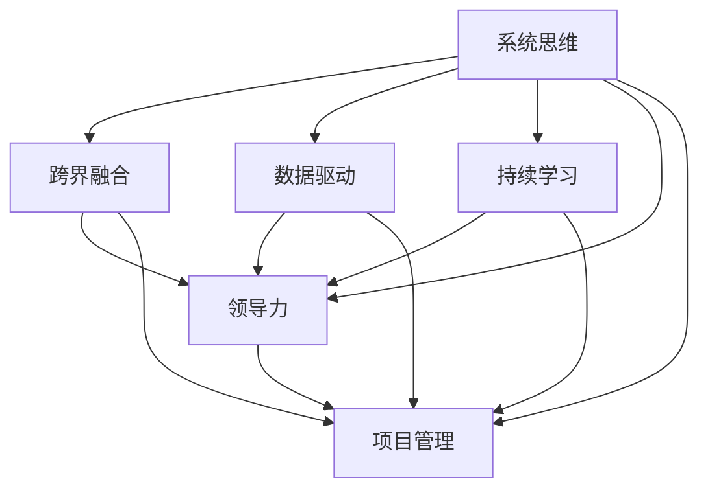

                 

# 思维体系：决定管理者的起跑线

> 关键词：思维体系,管理者,决策能力,创新能力,领导力,项目管理,系统思维,跨界融合,组织文化,知识管理

## 1. 背景介绍

### 1.1 问题由来

在当前快速变化的市场环境中，管理者面临着前所未有的挑战。信息爆炸、技术迭代、竞争加剧等因素，要求管理者必须具备更加灵活的思维体系，以应对复杂多变的环境。但是，许多管理者缺乏系统性、战略性的思维框架，导致在决策、执行、创新等方面遇到瓶颈，难以充分发挥其领导作用。

如何构建一个全面、高效、可持续的思维体系，成为管理者提升核心能力的关键。本文将详细探讨构建管理者思维体系的核心理论和方法，帮助读者构建属于自己的思维框架，加速个人和组织的成长。

### 1.2 问题核心关键点

构建管理者思维体系的核心在于以下关键点：
- **系统思维**：将问题看作系统的一部分，全面考虑其关联性和复杂性，避免孤立思考。
- **跨界融合**：从不同领域汲取知识和智慧，将各种创新理念和实践融入管理实践中。
- **数据驱动**：基于实证数据分析和决策，减少直觉和主观判断，提高决策的科学性和准确性。
- **持续学习**：不断更新和扩充知识库，保持与时代同步，提升个人和组织的核心竞争力。

## 2. 核心概念与联系

### 2.1 核心概念概述

管理者思维体系主要由以下几个核心概念组成：

- **系统思维(Systemic Thinking)**：将问题看作一个系统的一部分，综合考虑其内部和外部的关联性，以系统性的方式进行分析和决策。
- **跨界融合(Cross-Disciplinary Fusion)**：从不同学科、行业和实践中汲取智慧和灵感，将创新理念和实践融入管理工作中。
- **数据驱动(Data-Driven)**：基于实证数据分析和决策，减少直觉和主观判断，提高决策的科学性和准确性。
- **持续学习(Continuous Learning)**：不断更新和扩充知识库，保持与时代同步，提升个人和组织的核心竞争力。
- **领导力(Leadership)**：通过愿景、激励和协调，引导和管理团队实现共同目标。
- **项目管理(Project Management)**：高效规划、执行和监控项目，确保项目按计划完成。

这些核心概念相互关联，共同构成管理者思维体系的基石。

### 2.2 核心概念原理和架构的 Mermaid 流程图



这个流程图展示了各个核心概念之间的联系和相互作用：

1. 系统思维将问题系统化，为跨界融合、数据驱动、领导力和项目管理提供了分析框架。
2. 跨界融合借鉴不同领域的知识，丰富了数据驱动和领导力决策的基础。
3. 数据驱动基于实证数据分析，支持系统思维和持续学习，增强决策的科学性。
4. 持续学习更新知识库，为系统思维、跨界融合、数据驱动和领导力提供支持。
5. 领导力在跨界融合、数据驱动和系统思维的指导下，实现高效的团队管理和项目执行。

## 3. 核心算法原理 & 具体操作步骤

### 3.1 算法原理概述

管理者思维体系的构建，本质上是一个综合运用多个核心概念进行全面分析和决策的过程。其核心算法原理包括以下几个方面：

1. **系统建模(System Modeling)**：将复杂问题建模为系统，分析其内部和外部的关联性。
2. **跨界借鉴(Cross-Disciplinary Learning)**：从不同领域汲取智慧和灵感，丰富决策的依据。
3. **数据分析(Data Analysis)**：利用统计学、机器学习等方法，从数据中提取有价值的洞察。
4. **仿真模拟(Simulation and Modeling)**：通过仿真模拟，验证和优化决策方案。
5. **知识管理(Knowledge Management)**：建立和维护知识库，支持持续学习和创新。
6. **领导激励(Leadership Motivation)**：通过愿景、激励和协调，激发团队潜力。
7. **项目管理(Project Management)**：高效规划、执行和监控项目，确保目标实现。

### 3.2 算法步骤详解

构建管理者思维体系的步骤如下：

**Step 1: 问题定义和系统建模**
- 明确问题的定义，分析问题的内部和外部关联性，建立系统模型。
- 使用系统思维方法，全面考虑问题的影响因素和潜在的关联性。

**Step 2: 跨界借鉴和数据收集**
- 从不同领域和学科中汲取智慧和灵感，了解相关的最佳实践。
- 收集相关的数据，包括历史数据、市场数据、用户反馈等，进行数据分析和处理。

**Step 3: 数据分析和仿真模拟**
- 利用统计学、机器学习等方法，从数据中提取有价值的洞察。
- 使用仿真模拟工具，验证和优化决策方案，确保其可行性和有效性。

**Step 4: 知识管理和持续学习**
- 建立和维护知识库，存储和分享相关知识和经验。
- 持续更新和扩充知识库，保持与时代同步，提升个人和组织的核心竞争力。

**Step 5: 领导激励和项目管理**
- 通过愿景、激励和协调，引导和管理团队实现共同目标。
- 使用项目管理工具和方法，高效规划、执行和监控项目，确保项目按计划完成。

### 3.3 算法优缺点

构建管理者思维体系的方法具有以下优点：
- **系统性**：全面考虑问题的关联性和复杂性，避免孤立思考。
- **科学性**：基于实证数据分析和决策，减少直觉和主观判断。
- **灵活性**：借鉴不同领域和学科的知识，增强决策的多样性和创新性。
- **持续改进**：不断更新和扩充知识库，保持与时代同步，提升核心竞争力。

同时，该方法也存在一定的局限性：
- **复杂度高**：系统建模和跨界借鉴需要较高的专业知识和实践经验。
- **数据依赖**：数据分析和决策依赖于高质量的数据，数据获取和处理难度较大。
- **资源消耗**：仿真模拟和项目管理需要较高的计算资源和人力资源。

尽管存在这些局限性，但就目前而言，构建管理者思维体系的方法仍然是最主流和有效的方式，有助于管理者全面提升决策和执行能力。

### 3.4 算法应用领域

管理者思维体系在多个领域都有广泛的应用，例如：

- **企业战略规划**：通过系统思维和跨界借鉴，制定全面的企业战略规划，确保目标实现。
- **项目管理**：高效规划、执行和监控项目，确保项目按计划完成。
- **产品创新**：利用数据分析和仿真模拟，发现和验证产品创新机会，提升产品竞争力。
- **市场分析**：基于实证数据分析，洞察市场趋势和机会，制定有效的市场策略。
- **组织变革**：通过系统思维和领导激励，引导和管理组织变革，提升组织效能。
- **人力资源管理**：通过持续学习和跨界借鉴，提升人才招聘和培养的效率和效果。

## 4. 数学模型和公式 & 详细讲解 & 举例说明

### 4.1 数学模型构建

构建管理者思维体系，可以从以下几个数学模型入手：

- **线性回归模型**：用于数据分析，预测变量之间的线性关系。
- **优化模型**：用于决策优化，通过求解目标函数的最优解，寻找最佳方案。
- **蒙特卡洛模拟**：用于仿真模拟，评估决策方案的风险和可行性。
- **图论模型**：用于系统建模，分析问题的关联性和复杂性。

### 4.2 公式推导过程

以下我们以线性回归模型为例，推导其基本公式。

假设有一个简单的线性回归问题，已知数据集 $(x_i, y_i)$，其中 $x_i$ 是自变量，$y_i$ 是因变量。线性回归模型的目标是找到一个线性函数 $y=\theta_0 + \theta_1x$，使得预测值与实际值之间的误差最小化。

线性回归模型的误差函数为：

$$
\mathcal{L}(\theta) = \frac{1}{2n} \sum_{i=1}^n (y_i - \theta_0 - \theta_1x_i)^2
$$

其中，$n$ 是样本数量。

对误差函数求导，得到：

$$
\frac{\partial \mathcal{L}(\theta)}{\partial \theta_0} = -\frac{1}{n}\sum_{i=1}^n (y_i - \theta_0 - \theta_1x_i)
$$

$$
\frac{\partial \mathcal{L}(\theta)}{\partial \theta_1} = -\frac{1}{n}\sum_{i=1}^n (y_i - \theta_0 - \theta_1x_i)x_i
$$

解以上方程组，即可得到最优的 $\theta_0$ 和 $\theta_1$ 的值。

### 4.3 案例分析与讲解

假设某企业希望预测销售额与广告投入之间的关系。已知历史数据 $(x_i, y_i)$，其中 $x_i$ 表示广告投入，$y_i$ 表示销售额。企业希望找到最优的广告投入策略，最大化销售额。

**Step 1: 问题定义和系统建模**
- 定义问题为线性回归，预测销售额与广告投入之间的关系。
- 建立系统模型，分析广告投入和销售额之间的关联性。

**Step 2: 数据分析和仿真模拟**
- 使用线性回归模型进行数据分析，找出广告投入和销售额之间的线性关系。
- 使用蒙特卡洛模拟，评估不同广告投入策略的风险和收益。

**Step 3: 知识管理和持续学习**
- 将线性回归模型和蒙特卡洛模拟的结果，存储到知识库中。
- 持续更新知识库，跟踪市场变化，优化广告投入策略。

## 5. 项目实践：代码实例和详细解释说明

### 5.1 开发环境搭建

在进行管理者思维体系构建的实践前，我们需要准备好开发环境。以下是使用Python进行Pandas、Numpy、Scikit-learn等库进行数据分析的Python环境配置流程：

1. 安装Anaconda：从官网下载并安装Anaconda，用于创建独立的Python环境。

2. 创建并激活虚拟环境：
```bash
conda create -n analytics-env python=3.8 
conda activate analytics-env
```

3. 安装必要库：
```bash
conda install pandas numpy scikit-learn matplotlib tqdm jupyter notebook ipython
```

4. 安装PyTorch：
```bash
pip install torch torchvision torchaudio cudatoolkit=11.1 -c pytorch -c conda-forge
```

完成上述步骤后，即可在`analytics-env`环境中开始实践。

### 5.2 源代码详细实现

我们以线性回归模型的实现为例，展示如何用Python代码进行数据分析。

```python
import pandas as pd
import numpy as np
from sklearn.linear_model import LinearRegression
from sklearn.model_selection import train_test_split
from sklearn.metrics import mean_squared_error

# 加载数据
data = pd.read_csv('sales_data.csv')

# 分割数据集
X = data[['ad_spending']]
y = data['sales']
X_train, X_test, y_train, y_test = train_test_split(X, y, test_size=0.2, random_state=42)

# 创建模型
model = LinearRegression()

# 训练模型
model.fit(X_train, y_train)

# 预测
y_pred = model.predict(X_test)

# 评估
mse = mean_squared_error(y_test, y_pred)
print(f"MSE: {mse:.2f}")
```

### 5.3 代码解读与分析

让我们再详细解读一下关键代码的实现细节：

**数据加载和分割**：
- 使用Pandas库加载CSV数据，定义自变量和因变量。
- 使用Scikit-learn库的`train_test_split`函数，将数据集分为训练集和测试集。

**模型创建和训练**：
- 使用Scikit-learn库的`LinearRegression`类创建线性回归模型。
- 调用模型的`fit`方法，训练模型。

**预测和评估**：
- 使用模型的`predict`方法，对测试集进行预测。
- 使用Scikit-learn库的`mean_squared_error`函数，计算预测值与真实值之间的均方误差。

**结果输出**：
- 输出均方误差，评估模型的预测性能。

可以看到，通过Python和Scikit-learn库，可以简洁高效地进行线性回归模型的构建和评估。开发者可以将更多精力放在数据处理、模型改进等高层逻辑上，而不必过多关注底层的实现细节。

## 6. 实际应用场景

### 6.1 企业战略规划

基于管理者思维体系的战略规划，可以提升企业的整体竞争力和市场响应能力。企业可以通过系统思维和跨界借鉴，制定全面的战略规划，涵盖市场定位、产品创新、组织结构调整等多个方面。

在技术实现上，可以收集历史数据和市场信息，建立系统模型，进行数据分析和仿真模拟，找出最优的战略方案。同时，利用持续学习机制，跟踪市场变化，动态调整战略计划，确保企业在市场竞争中保持领先地位。

### 6.2 项目管理

项目管理是管理者思维体系的重要应用领域，可以帮助企业高效规划、执行和监控项目，确保项目按计划完成。

在实践中，可以运用系统思维，将项目拆分为多个子任务，分析各任务之间的关联性和优先级，制定详细的项目计划。通过跨界借鉴，学习其他行业的最佳实践，优化项目管理的流程和工具。使用数据分析和仿真模拟，评估项目的风险和收益，调整项目策略。最后，利用持续学习机制，跟踪项目进展，及时调整策略，确保项目顺利实施。

### 6.3 产品创新

产品创新是企业持续发展的关键。基于管理者思维体系的产品创新，可以结合系统思维和跨界借鉴，发现和验证新的产品创新机会，提升产品的竞争力。

在技术实现上，可以收集用户反馈和市场数据，建立系统模型，进行数据分析和仿真模拟，找出最优的产品创新方案。同时，利用持续学习机制，跟踪市场变化，动态调整产品创新策略，确保产品创新方向符合市场需求。

### 6.4 未来应用展望

随着管理者思维体系的不断演进，其在更多领域的应用前景将更加广阔。

在智慧城市治理中，管理者思维体系可以为城市规划、公共服务、应急管理等多个环节提供决策支持，提升城市治理的智能化水平。

在智慧医疗领域，管理者思维体系可以帮助医疗机构制定全面的医疗战略，提升医疗服务的质量和效率，促进医疗创新的发展。

在智慧教育领域，管理者思维体系可以提升教育资源的优化配置，推动教育公平，提高教育质量。

此外，在金融、制造、能源等多个行业，管理者思维体系的应用也将不断拓展，推动各行各业的数字化转型和智能化升级。相信随着技术的日益成熟，管理者思维体系必将在更多领域大放异彩，为社会进步和经济发展注入新的动力。

## 7. 工具和资源推荐

### 7.1 学习资源推荐

为了帮助管理者系统掌握思维体系的理论基础和实践技巧，这里推荐一些优质的学习资源：

1. **《系统思维导论》**：介绍系统思维的基本概念和方法，帮助管理者构建系统性思考框架。
2. **《跨界创新：突破常规的创新之路》**：探讨跨界借鉴和融合的方法，提升创新能力。
3. **《数据科学实战》**：讲解数据分析和机器学习的基本技能，帮助管理者掌握数据分析工具和方法。
4. **《管理者思维：从概念到实践》**：结合实际案例，介绍管理者思维体系的构建和应用。
5. **Coursera的《数据科学与机器学习》课程**：提供系统性的数据分析和机器学习课程，适合提升管理者的技术能力。
6. **Udacity的《项目管理》课程**：涵盖项目管理的全面知识，帮助管理者高效规划和执行项目。

通过对这些资源的学习实践，相信你一定能够系统掌握管理者思维体系的精髓，并用于解决实际的决策和执行问题。

### 7.2 开发工具推荐

高效的开发离不开优秀的工具支持。以下是几款用于管理者思维体系构建的常用工具：

1. **Jupyter Notebook**：Python的交互式开发环境，适合进行数据分析和模型实现。
2. **Excel**：强大的数据分析工具，支持复杂的数据处理和图表展示。
3. **Tableau**：数据可视化工具，可以高效地进行数据分析和报表制作。
4. **Microsoft Project**：项目管理工具，帮助管理者高效规划和管理项目。
5. **GitHub**：代码版本控制和协作平台，支持团队成员的代码共享和协作。
6. **Slack**：即时通讯工具，支持团队协作和沟通。

合理利用这些工具，可以显著提升管理者思维体系构建的效率，加快创新迭代的步伐。

### 7.3 相关论文推荐

管理者思维体系的发展源于学界的持续研究。以下是几篇奠基性的相关论文，推荐阅读：

1. **《系统思维：从系统论到管理实践》**：介绍系统思维的基本理论和方法，对系统建模和系统分析进行了深入探讨。
2. **《跨界借鉴：创新型组织的关键》**：探讨跨界借鉴的策略和方法，提升组织创新的能力。
3. **《数据驱动决策：基于实证分析的决策框架》**：讲解数据分析和决策优化的基本方法，提升决策的科学性和准确性。
4. **《持续学习：组织知识管理的框架》**：探讨知识管理的方法和工具，提升组织的学习能力和知识共享。
5. **《领导力：管理者不可或缺的素养》**：探讨领导力的基本理论和实践技巧，提升管理者的领导能力。
6. **《项目管理：实现目标的科学方法》**：讲解项目管理的基本方法和工具，提升项目的执行效率和效果。

这些论文代表了大语言模型微调技术的发展脉络。通过学习这些前沿成果，可以帮助管理者把握学科前进方向，激发更多的创新灵感。

## 8. 总结：未来发展趋势与挑战

### 8.1 总结

本文对管理者思维体系的构建进行了全面系统的介绍。首先阐述了管理者思维体系的核心概念和理论基础，明确了系统思维、跨界借鉴、数据驱动、持续学习在决策和执行中的重要性。其次，从原理到实践，详细讲解了管理者思维体系的构建步骤和方法，给出了具体的代码实现示例。同时，本文还广泛探讨了管理者思维体系在企业战略规划、项目管理、产品创新等多个行业领域的应用前景，展示了其巨大的潜力。

通过本文的系统梳理，可以看到，管理者思维体系的构建对于提升管理者的决策和执行能力具有重要意义。管理者通过系统思维、跨界借鉴、数据驱动和持续学习，可以在复杂多变的环境中保持竞争优势，引领团队实现共同目标。

### 8.2 未来发展趋势

展望未来，管理者思维体系将呈现以下几个发展趋势：

1. **系统性增强**：随着技术的发展，系统建模和仿真模拟的复杂度和精度将进一步提高，为管理者提供更强大的决策支持。
2. **跨界融合深化**：跨界借鉴将更加广泛和深入，涵盖更多领域和学科的知识，提升创新的多样性和深度。
3. **数据驱动普及**：数据分析和决策优化将成为管理者的必备技能，提升决策的科学性和准确性。
4. **持续学习加速**：知识管理和持续学习机制将更加成熟和普及，提升组织的知识共享和学习效率。
5. **技术融合加速**：管理者思维体系将与人工智能、大数据等前沿技术深度融合，提升决策和执行的智能化水平。

以上趋势凸显了管理者思维体系的广阔前景。这些方向的探索发展，必将进一步提升管理者的决策和执行能力，推动组织和社会的进步。

### 8.3 面临的挑战

尽管管理者思维体系已经取得了一定的进展，但在迈向更加智能化、普适化应用的过程中，仍面临诸多挑战：

1. **复杂度提升**：系统建模和跨界借鉴的复杂度增加，对管理者的专业知识和实践经验提出了更高的要求。
2. **数据依赖加剧**：数据分析和决策优化依赖于高质量的数据，数据获取和处理难度较大。
3. **技术门槛高**：仿真模拟和项目管理工具的使用，需要较高的技术门槛和实践经验。
4. **组织阻力**：跨界借鉴和数据驱动的实施，可能会遇到组织内部的阻力和抵触。

尽管存在这些挑战，但通过持续改进和创新，管理者思维体系仍将继续发展，为管理者的决策和执行提供更加全面的支持。

### 8.4 研究展望

未来，管理者思维体系的研究将从以下几个方向进行探索：

1. **多学科融合**：结合系统思维、跨界借鉴、数据驱动和持续学习，构建更加全面和高效的管理者思维框架。
2. **技术融合**：与人工智能、大数据、区块链等前沿技术深度融合，提升管理决策的智能化和自动化水平。
3. **实践创新**：在实际管理场景中，不断总结和推广最佳实践，提升管理者的实际操作能力。
4. **知识共享**：建立和维护知识库，促进知识的共享和传播，提升组织的整体知识水平。

这些方向的研究和探索，将进一步提升管理者思维体系的实用性和可操作性，为管理者的决策和执行提供更加科学和高效的支持。

## 9. 附录：常见问题与解答

**Q1：管理者思维体系是否适用于所有管理场景？**

A: 管理者思维体系在大多数管理场景中都有广泛的应用，特别是在复杂多变的管理环境中。但某些简单的、标准化的管理场景，可能不需要过于复杂的决策和执行方法。因此，管理者需要根据具体的管理场景，灵活选择和应用不同的思维体系。

**Q2：如何平衡系统思维和跨界借鉴？**

A: 平衡系统思维和跨界借鉴，需要管理者在具体问题上灵活选择。对于复杂多变的问题，系统思维可以帮助管理者全面考虑问题的关联性和复杂性；对于创新型问题，跨界借鉴可以提供新的思路和灵感。因此，管理者需要根据问题的特点，综合运用系统思维和跨界借鉴，找到最优的解决方案。

**Q3：数据驱动决策是否适用于所有管理决策？**

A: 数据驱动决策在大多数管理决策中都适用，特别是在数据获取和处理较为便捷的情况下。但某些决策需要更多的直觉和经验，无法完全依赖数据驱动。因此，管理者需要根据决策的特点，综合运用数据驱动和经验驱动的方法，找到最佳的决策方式。

**Q4：如何应对管理者思维体系的复杂度？**

A: 应对管理者思维体系的复杂度，需要管理者不断学习和积累。可以通过系统化的学习和实践，逐步掌握系统思维、跨界借鉴、数据驱动和持续学习的方法。同时，可以通过建立学习小组和知识库，促进团队成员的共同学习和经验分享，提升整个团队的知识水平。

**Q5：如何在组织中推广管理者思维体系？**

A: 在组织中推广管理者思维体系，需要从以下几个方面入手：
1. 建立知识库和共享平台，促进知识的传播和积累。
2. 培训和引导管理者掌握系统思维、跨界借鉴、数据驱动和持续学习的方法。
3. 设立跨部门协作机制，促进不同部门之间的知识共享和创新。
4. 通过实际案例的分享和推广，树立典型示范，提升整个组织的知识水平。

通过这些措施，管理者思维体系将在组织中得到广泛应用，提升整个组织的决策和执行能力。

---

作者：禅与计算机程序设计艺术 / Zen and the Art of Computer Programming

