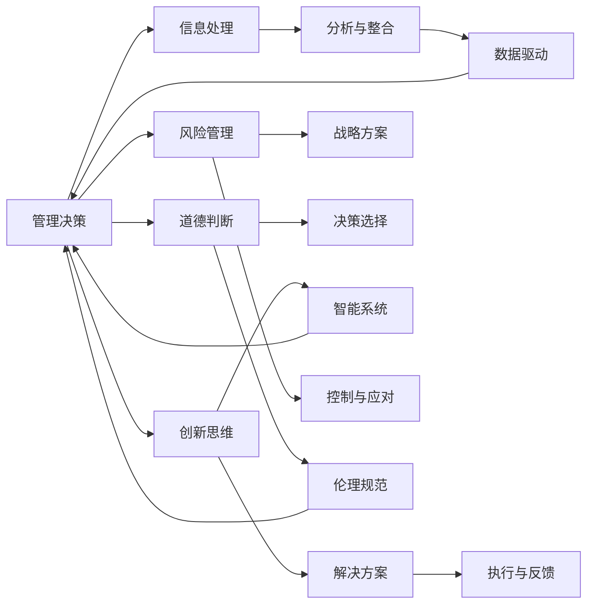

                 

## 1. 背景介绍

管理决策是企业运营的核心环节，直接影响组织的生存与发展。在当前复杂多变的商业环境中，决策者面对的信息量庞大且变化迅速，传统决策模式已难以满足需求。因此，如何提升管理决策的科学性和效率，成为企业关注的焦点。

### 1.1 问题由来

在过去，决策者往往依赖经验、直觉进行决策。然而，随着大数据和人工智能技术的发展，决策过程逐渐向数据驱动、科学决策转变。研究表明，思维能力（包括分析能力、判断力、决策力等）在管理决策中具有重要影响。

### 1.2 问题核心关键点

思维能力对管理决策的影响主要体现在以下几个方面：

- **信息处理能力**：决策者对信息的处理、分析与整合能力，直接影响决策的准确性和及时性。
- **创新思维**：决策者在复杂问题面前的创新思维，有助于寻找最优解决方案。
- **风险管理**：决策者的风险评估与应对能力，有助于制定稳健的战略方案。
- **道德判断**：决策者的伦理道德标准，影响其在利益冲突中的决策选择。

### 1.3 问题研究意义

研究思维能力对管理决策的影响，具有重要理论和实践意义：

- **提升决策科学性**：通过系统分析决策者的思维能力，优化决策过程，提升决策准确性和效率。
- **促进企业发展**：基于对思维能力的理解，制定合理的人力资源策略，提升员工整体素质。
- **推动技术创新**：开发辅助决策的智能系统，通过技术手段辅助决策者克服认知偏见，提升决策质量。

## 2. 核心概念与联系

### 2.1 核心概念概述

- **管理决策**：指企业在日常运营、战略规划中，对各种问题进行识别、分析与选择的管理活动。
- **思维能力**：指决策者处理信息、推理判断、制定决策的综合能力。
- **大数据与人工智能**：通过数据挖掘、机器学习等技术，辅助决策者分析问题、预测未来，提升决策科学性。
- **风险管理**：指通过识别、评估、控制风险，以保障决策过程的稳健性。
- **道德判断**：指在利益冲突中，决策者基于伦理道德标准进行判断与选择。

### 2.2 核心概念原理和架构的 Mermaid 流程图



## 3. 核心算法原理 & 具体操作步骤

### 3.1 算法原理概述

基于大数据与人工智能的管理决策模型，通过分析决策者的思维能力，优化决策过程。具体算法原理如下：

- **数据预处理**：收集决策者的历史行为数据，进行清洗、归一化处理，构建决策模型输入。
- **特征提取**：提取决策者信息处理、分析、创新思维、风险管理、道德判断等关键特征。
- **模型训练**：使用机器学习算法（如决策树、随机森林、神经网络等）训练决策模型，预测决策结果。
- **结果评估**：使用评估指标（如准确率、召回率、F1值等）评估模型性能，进行模型优化。
- **辅助决策**：通过智能系统辅助决策者进行决策，提升决策效率与质量。

### 3.2 算法步骤详解

1. **数据收集与预处理**
   - 收集决策者的行为数据，如销售业绩、项目进度、客户反馈等。
   - 数据清洗，去除噪声、缺失值，确保数据质量。
   - 数据归一化，使不同特征具有相同量纲，便于后续分析。

2. **特征提取**
   - 分析决策者的信息处理能力，如数据分析、数据整合、数据可视化能力。
   - 评估决策者的创新思维，如提出新想法、解决复杂问题的能力。
   - 衡量决策者的风险管理能力，如风险识别、风险评估、风险应对能力。
   - 评估决策者的道德判断能力，如遵循伦理规范、处理利益冲突的能力。

3. **模型训练**
   - 选择合适的机器学习算法，构建决策模型。
   - 划分训练集、验证集、测试集，使用交叉验证技术优化模型参数。
   - 对模型进行评估，使用各项评估指标衡量模型性能。

4. **结果评估与优化**
   - 根据评估结果，调整模型参数，优化模型性能。
   - 使用A/B测试等方法，比较不同决策策略的效果，选择最佳方案。

5. **辅助决策**
   - 开发智能决策系统，根据输入数据，输出决策建议。
   - 决策者结合系统建议，综合考虑多方面因素，进行最终决策。

### 3.3 算法优缺点

**优点**：

- **数据驱动**：通过大数据与人工智能技术，提升决策的科学性和准确性。
- **多维度分析**：综合考虑决策者的思维能力，提供全面的决策支持。
- **系统辅助**：智能系统辅助决策，减轻决策者的负担，提升决策效率。

**缺点**：

- **数据隐私**：决策者行为数据涉及隐私问题，数据收集需遵守相关法律法规。
- **算法复杂性**：算法复杂，模型训练与优化需高水平技术支持。
- **决策透明度**：智能系统决策过程可能不透明，决策者需结合系统建议进行综合判断。

### 3.4 算法应用领域

该算法模型在以下领域具有广泛应用：

- **企业战略规划**：通过分析管理层决策，优化战略规划过程。
- **市场分析与预测**：基于历史数据，预测市场变化趋势，辅助决策者制定应对策略。
- **风险管理**：识别潜在风险，评估风险影响，制定风险应对措施。
- **产品开发与创新**：分析研发团队思维能力，优化产品开发过程，提升创新能力。
- **人力资源管理**：评估员工思维能力，优化招聘、培训策略，提升整体素质。

## 4. 数学模型和公式 & 详细讲解 & 举例说明

### 4.1 数学模型构建

假设决策问题为分类问题，记输入数据为 $x$，决策者思维能力特征为 $f(x)$，决策结果为 $y$。构建决策模型 $M(x)$，通过训练数据 $D=\{(x_i,y_i)\}_{i=1}^N$ 训练模型，最小化预测误差。

### 4.2 公式推导过程

$$
M(x) = \mathop{\arg\min}_{\theta} \sum_{i=1}^N \mathcal{L}(f(x_i),y_i)
$$

其中，$\mathcal{L}$ 为损失函数，常用的损失函数包括交叉熵损失、均方误差损失等。

### 4.3 案例分析与讲解

假设某企业的销售决策问题，已知决策者的历史行为数据 $D$，提取信息处理能力、创新思维、风险管理、道德判断等特征 $f(x)$，构建决策模型 $M(x)$。使用随机森林算法进行训练，评估模型性能，并开发智能决策系统辅助销售决策。

## 5. 项目实践：代码实例和详细解释说明

### 5.1 开发环境搭建

**环境准备**：

1. **安装Python**：确保系统安装了Python 3.x。
2. **安装相关库**：使用pip安装Scikit-Learn、Pandas、Numpy等库，如：
   ```bash
   pip install scikit-learn pandas numpy
   ```
3. **数据准备**：收集决策者的历史行为数据，并进行预处理。

### 5.2 源代码详细实现

以下是一个简化的决策模型训练代码：

```python
from sklearn.ensemble import RandomForestClassifier
from sklearn.metrics import accuracy_score, precision_score, recall_score
from sklearn.model_selection import train_test_split
import pandas as pd

# 数据准备
data = pd.read_csv('decision_data.csv')
features = ['feature1', 'feature2', 'feature3', 'feature4']
labels = 'decision_result'
X = data[features]
y = data[labels]

# 数据拆分
X_train, X_test, y_train, y_test = train_test_split(X, y, test_size=0.2, random_state=42)

# 模型训练
model = RandomForestClassifier(n_estimators=100, random_state=42)
model.fit(X_train, y_train)

# 预测与评估
y_pred = model.predict(X_test)
accuracy = accuracy_score(y_test, y_pred)
precision = precision_score(y_test, y_pred)
recall = recall_score(y_test, y_pred)

print('Accuracy:', accuracy)
print('Precision:', precision)
print('Recall:', recall)
```

### 5.3 代码解读与分析

**数据准备**：
- 读取决策数据，提取特征和标签。
- 数据拆分，划分训练集和测试集。

**模型训练**：
- 使用随机森林算法，训练决策模型。
- 在测试集上评估模型性能，计算准确率、精确率和召回率。

**结果展示**：
- 输出模型在测试集上的各项评估指标，分析模型性能。

## 6. 实际应用场景

### 6.1 企业管理决策

在企业战略规划、市场分析、风险管理等方面，决策模型可以帮助管理层提升决策科学性。例如，通过分析销售数据，预测市场变化趋势，优化营销策略。

### 6.2 创新产品开发

在产品开发与创新过程中，决策模型可以帮助研发团队识别关键技术难点，评估创新方案的可行性，优化产品开发流程。

### 6.3 人力资源管理

通过评估员工思维能力，决策模型可以帮助人力资源部门制定合理的招聘、培训策略，提升整体团队素质。

### 6.4 未来应用展望

未来，随着大数据与人工智能技术的发展，决策模型将进一步优化，具备更强的自适应能力和智能辅助决策功能。

## 7. 工具和资源推荐

### 7.1 学习资源推荐

1. **《大数据与人工智能应用》**：介绍大数据与人工智能技术在企业管理中的应用，涵盖决策模型构建、评估与优化等内容。
2. **《机器学习实战》**：通过具体案例，讲解机器学习算法在实际问题中的应用，适合初学者学习。
3. **Coursera《数据科学导论》课程**：由斯坦福大学教授主讲，涵盖数据预处理、特征工程、模型训练等重要内容。
4. **Kaggle**：提供大量真实数据集和竞赛项目，实践机器学习算法，提升实战能力。

### 7.2 开发工具推荐

1. **Jupyter Notebook**：免费在线Jupyter Notebook环境，支持多种编程语言和库。
2. **Python**：编程语言，具备丰富的第三方库和工具支持。
3. **TensorFlow**：深度学习框架，支持大规模模型训练和部署。
4. **PyTorch**：深度学习框架，具备灵活的动态图计算功能。

### 7.3 相关论文推荐

1. **《大数据与企业决策支持系统》**：介绍大数据技术在企业决策中的应用，探讨数据驱动决策的重要性。
2. **《基于机器学习的决策辅助系统》**：研究机器学习算法在辅助决策中的应用，评估决策模型性能。
3. **《人工智能在企业管理中的应用》**：介绍人工智能技术在企业运营中的应用，涵盖决策模型、风险管理等内容。

## 8. 总结：未来发展趋势与挑战

### 8.1 研究成果总结

本文系统分析了思维能力对管理决策的影响，探讨了数据驱动决策模型的构建与优化。研究结果表明，大数据与人工智能技术可以有效提升决策的科学性和效率，帮助企业制定更加合理的战略和方案。

### 8.2 未来发展趋势

未来，决策模型将进一步优化，具备更高的智能辅助决策能力。主要发展趋势包括：

- **多模态融合**：融合不同数据类型（如文本、图像、视频等），提供更全面的决策支持。
- **实时决策**：利用流数据处理技术，实现实时决策支持，提升决策效率。
- **分布式计算**：利用分布式计算技术，提高决策模型的训练与推理速度。
- **自适应学习**：通过在线学习技术，不断优化决策模型，提升模型性能。

### 8.3 面临的挑战

决策模型在实际应用中仍面临一些挑战，主要包括以下几点：

- **数据隐私**：数据收集需遵守相关法律法规，确保数据隐私。
- **模型复杂性**：算法复杂，模型训练与优化需高水平技术支持。
- **系统透明度**：智能系统决策过程可能不透明，决策者需结合系统建议进行综合判断。
- **伦理道德**：模型决策需遵循伦理道德标准，避免偏见与歧视。

### 8.4 研究展望

未来，决策模型需要进一步研究解决以上挑战，提升模型的实用性和可扩展性。主要研究方向包括：

- **隐私保护技术**：研究数据隐私保护方法，确保数据安全和合规。
- **模型简化技术**：研究模型简化方法，提高模型训练与推理效率。
- **系统透明度技术**：研究系统透明度技术，提升决策过程的透明性和可解释性。
- **伦理道德标准**：制定伦理道德标准，确保模型决策符合伦理道德要求。

## 9. 附录：常见问题与解答

**Q1: 数据预处理包括哪些步骤？**

A: 数据预处理主要包括以下步骤：
1. 数据清洗：去除噪声、缺失值，确保数据质量。
2. 数据归一化：使不同特征具有相同量纲，便于后续分析。
3. 数据划分：将数据划分为训练集、验证集、测试集，确保模型评估的公正性。

**Q2: 特征提取如何考虑多维度思维能力？**

A: 特征提取需要综合考虑决策者的信息处理能力、创新思维、风险管理、道德判断等多维度思维能力，可以通过以下方法：
1. 分析决策者的行为数据，提取关键特征。
2. 使用机器学习算法，识别关键特征与决策结果的关系。
3. 根据特征重要性，综合评估决策者的思维能力。

**Q3: 模型训练过程中如何选择合适的评估指标？**

A: 模型训练过程中，应根据具体问题选择合适的评估指标，如准确率、召回率、F1值等。常用的评估指标包括：
1. 准确率（Accuracy）：表示模型预测正确的样本比例。
2. 召回率（Recall）：表示模型正确预测的正样本比例。
3. F1值（F1 Score）：综合考虑准确率和召回率，反映模型的综合性能。
4. ROC曲线：展示模型在不同阈值下的真正率与假正率，用于评估模型性能。

**Q4: 智能系统辅助决策需要注意哪些问题？**

A: 智能系统辅助决策需要注意以下问题：
1. 系统透明性：确保系统决策过程透明，决策者能理解系统建议。
2. 用户接口设计：设计友好的用户接口，便于决策者输入数据和查看结果。
3. 系统鲁棒性：确保系统具备高鲁棒性，能够应对多种数据类型和异常情况。
4. 模型更新：定期更新模型，确保模型与最新数据保持一致。

通过系统化地分析思维能力对管理决策的影响，本文为决策者提供了科学决策的指导，帮助企业在复杂多变的商业环境中做出更加准确和高效的决策。

