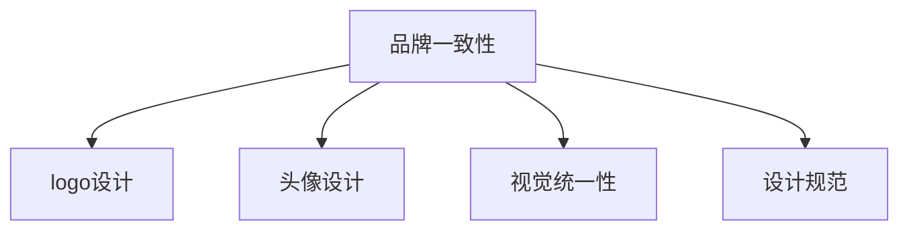

                 

# 打造一致的视觉形象：从logo到头像的统一设计

> 关键词：品牌一致性,logo设计,头像设计,品牌形象,视觉统一性

## 1. 背景介绍

### 1.1 问题由来
在当今互联网时代，品牌形象成为了企业吸引用户、区别于竞争对手的关键因素。随着社交媒体的普及，个人和企业品牌的在线形象愈发重要。高质量的视觉元素，如logo和头像，不仅提升品牌识别度，还能增强用户信任感。因此，如何设计出既美观又具有统一风格的高质量视觉元素，成为了品牌管理的核心任务之一。

### 1.2 问题核心关键点
1. **品牌一致性**：logo和头像等视觉元素是品牌形象的重要组成部分，应保持与品牌主调的一致性。
2. **设计规范**：logo和头像的设计应遵循统一的设计规范，确保在各类平台上具有一致性。
3. **可扩展性**：视觉元素应具备可扩展性，能够在不同尺寸、格式和场景中保持良好表现。
4. **技术支持**：在实际应用中，应利用现代技术如矢量图形、分辨率处理等，确保设计效果的准确性和稳定性。
5. **用户反馈**：在设计过程中，应重视用户反馈，不断优化设计以满足用户需求。

### 1.3 问题研究意义
确保品牌视觉形象的一致性，不仅提升品牌识别度和用户信任感，还能降低用户识别和记忆的成本。对于企业来说，统一的设计风格可以增强品牌价值，提升品牌竞争力。在个人品牌管理中，一致的视觉形象也能增强个人影响力，促进职业发展。

## 2. 核心概念与联系

### 2.1 核心概念概述

为更好地理解logo和头像的统一设计，本节将介绍几个密切相关的核心概念：

- **品牌一致性**：品牌形象中所有视觉元素（如logo、标语、色彩等）的统一性和连贯性，确保品牌识别的独特性和持久性。
- **logo设计**：品牌标识的核心元素，通常简洁、易于识别，传达品牌的核心价值和特点。
- **头像设计**：个人或品牌在社交媒体上的形象代表，应与品牌形象保持一致，反映品牌价值观。
- **视觉统一性**：确保所有视觉元素在不同平台和媒介上具有一致性，提升品牌识别度和用户体验。
- **设计规范**：为品牌视觉设计制定的统一标准和规范，确保设计的一致性和稳定性。

这些核心概念之间的逻辑关系可以通过以下Mermaid流程图来展示：



这个流程图展示了几者之间的联系：

1. **品牌一致性**是所有视觉元素设计的基础和目标。
2. **logo设计**和**头像设计**是品牌一致性的重要体现，需符合设计规范。
3. **视觉统一性**是确保品牌形象在不同媒介上具有一致性的关键。
4. **设计规范**为所有视觉设计提供了统一的指导，确保一致性和稳定性。

这些概念共同构成了品牌视觉形象设计的框架，有助于打造出既美观又具有一致性的视觉元素。

## 3. 核心算法原理 & 具体操作步骤
### 3.1 算法原理概述

logo和头像的统一设计，本质上是品牌视觉元素的设计和标准化过程。其核心思想是：基于品牌理念和核心价值，设计出一系列视觉元素，并通过设计规范确保其在不同场景下的一致性和连贯性。

具体来说，设计过程可以分为以下几个步骤：

1. **品牌理念提炼**：分析品牌的历史、核心价值、目标受众等，提炼品牌理念。
2. **视觉元素设计**：根据品牌理念设计logo、标语、色彩等视觉元素，保持设计风格一致。
3. **规范制定与遵循**：制定统一的设计规范，确保所有视觉元素遵循同一标准。
4. **跨平台测试与优化**：在不同平台和媒介上测试视觉元素的表现，根据反馈进行优化。

### 3.2 算法步骤详解

#### 3.2.1 品牌理念提炼

1. **历史分析**：回顾品牌的发展历程，分析其核心事件、重要人物、关键节点等，理解品牌的演变路径。
2. **核心价值提炼**：总结品牌所代表的核心价值，如创新、质量、用户至上等，形成品牌理念的核心要素。
3. **目标受众分析**：明确品牌的目标受众，了解他们的需求、兴趣、行为习惯等，确保视觉元素能够引起共鸣。
4. **竞品分析**：分析竞争对手的视觉元素，找出品牌差异化的切入点，确保设计具有独特性。

#### 3.2.2 视觉元素设计

1. **logo设计**：
   - **设计要素**：图形、文字、颜色等基本元素。
   - **设计原则**：简洁明了、易于识别、具有一致性。
   - **工具使用**：如Adobe Illustrator、Photoshop等专业设计软件。
2. **标语设计**：
   - **设计要素**：简洁有力的口号，传达品牌价值和特点。
   - **设计原则**：易于记忆、朗朗上口、具有一致性。
   - **工具使用**：文本排版软件如InDesign、Adobe Illustrator。
3. **色彩设计**：
   - **设计要素**：品牌的主色调及其衍生色。
   - **设计原则**：与品牌理念一致、易于识别、具有一致性。
   - **工具使用**：如Adobe Color、Coolors等色彩管理工具。

#### 3.2.3 规范制定与遵循

1. **设计规范制定**：
   - **字体规范**：制定品牌字体及其使用规则。
   - **色彩规范**：制定品牌色彩及其应用规则。
   - **尺寸规范**：制定不同尺寸下视觉元素的设计标准。
2. **遵循规范**：确保所有设计遵循制定的规范，使用统一的设计标准。

#### 3.2.4 跨平台测试与优化

1. **平台测试**：在不同平台（如网站、社交媒体、印刷品等）测试视觉元素的表现。
2. **用户反馈收集**：收集用户对视觉元素的反馈，评估其效果。
3. **设计优化**：根据反馈调整设计，确保在不同平台和媒介上具有一致性和连贯性。

### 3.3 算法优缺点

统一设计的logo和头像具有以下优点：

1. **品牌识别度高**：统一的视觉元素增强了品牌的识别度，使用户更容易记住品牌。
2. **用户信任感强**：一致的视觉风格提升了用户对品牌的信任感，增强了用户粘性。
3. **设计效率高**：遵循统一的设计规范，减少了设计的不确定性和反复修改，提高了设计效率。
4. **跨平台适应性强**：规范化的设计标准确保了视觉元素在不同平台上的表现一致，增强了品牌统一性。

但同时，统一设计也存在一些局限性：

1. **灵活性受限**：统一的设计规范可能限制了设计的灵活性，难以适应特定场景的特殊需求。
2. **视觉单调**：过于统一的设计可能缺乏变化，难以吸引年轻受众的注意。
3. **市场反应滞后**：设计优化过程可能较慢，难以迅速响应市场变化。

尽管存在这些局限性，但统一设计的logo和头像仍是品牌管理的重要组成部分，有助于提升品牌形象和用户满意度。

### 3.4 算法应用领域

品牌视觉元素的设计和标准化，已广泛应用于多个领域：

- **企业品牌**：如苹果、谷歌、亚马逊等大公司的logo和头像设计，已成为品牌形象的重要组成部分。
- **个人品牌**：如网红、KOL等社交媒体用户的头像设计，提升其在网络上的识别度和影响力。
- **公益组织**：如红十字会、联合国等非政府组织的logo设计，增强社会公众对其公益事业的认同和支持。
- **新产品发布**：在产品发布时，统一的视觉元素设计能够提升产品的市场接受度和品牌认知度。

## 4. 数学模型和公式 & 详细讲解  
### 4.1 数学模型构建

在logo和头像设计中，数学模型主要用于规范和优化设计参数。以下是一个简单的示例，展示如何通过数学模型进行logo设计规范的制定。

假设logo的设计参数包括图形的旋转角度、缩放比例、位置偏移等，用向量形式表示为：

$$
\mathbf{x} = \begin{bmatrix}
x_{\text{rot}} \\
x_{\text{scale}} \\
x_{\text{offset}}
\end{bmatrix}
$$

其中，$x_{\text{rot}}$ 表示旋转角度，$x_{\text{scale}}$ 表示缩放比例，$x_{\text{offset}}$ 表示位置偏移。

### 4.2 公式推导过程

1. **旋转角度公式**：
   - **向量旋转**：将logo图形的坐标点绕原点旋转$x_{\text{rot}}$角度，变换后的坐标为：
     \begin{align*}
     x' &= x \cos x_{\text{rot}} - y \sin x_{\text{rot}} \\
     y' &= x \sin x_{\text{rot}} + y \cos x_{\text{rot}}
     \end{align*}
   - **矩阵表示**：通过旋转矩阵，将坐标点绕原点旋转$x_{\text{rot}}$角度，变换后的坐标为：
     \begin{align*}
     \begin{bmatrix}
     x' \\
     y'
     \end{bmatrix}
     = \begin{bmatrix}
     \cos x_{\text{rot}} & -\sin x_{\text{rot}} \\
     \sin x_{\text{rot}} & \cos x_{\text{rot}}
     \end{bmatrix}
     \begin{bmatrix}
     x \\
     y
     \end{bmatrix}
     \end{align*}
2. **缩放比例公式**：
   - **坐标缩放**：将logo图形的坐标点以缩放比例$x_{\text{scale}}$进行缩放，变换后的坐标为：
     \begin{align*}
     x' &= x_{\text{scale}} \cdot x \\
     y' &= x_{\text{scale}} \cdot y
     \end{align*}
   - **矩阵表示**：通过缩放矩阵，将坐标点以缩放比例$x_{\text{scale}}$进行缩放，变换后的坐标为：
     \begin{align*}
     \begin{bmatrix}
     x' \\
     y'
     \end{bmatrix}
     = \begin{bmatrix}
     x_{\text{scale}} & 0 \\
     0 & x_{\text{scale}}
     \end{bmatrix}
     \begin{bmatrix}
     x \\
     y
     \end{bmatrix}
     \end{align*}
3. **位置偏移公式**：
   - **坐标平移**：将logo图形的坐标点以位置偏移$x_{\text{offset}}$进行平移，变换后的坐标为：
     \begin{align*}
     x' &= x + x_{\text{offset}} \\
     y' &= y + x_{\text{offset}}
     \end{align*}
   - **矩阵表示**：通过平移矩阵，将坐标点以位置偏移$x_{\text{offset}}$进行平移，变换后的坐标为：
     \begin{align*}
     \begin{bmatrix}
     x' \\
     y'
     \end{bmatrix}
     = \begin{bmatrix}
     1 & 0 \\
     0 & 1
     \end{bmatrix}
     \begin{bmatrix}
     x \\
     y
     \end{bmatrix}
     + \begin{bmatrix}
     x_{\text{offset}} \\
     x_{\text{offset}}
     \end{bmatrix}
     \end{align*}

### 4.3 案例分析与讲解

假设某品牌logo的设计参数如下：

- 图形旋转角度为$45^\circ$
- 缩放比例为$1.2$
- 位置偏移为$(10, 5)$

将原始坐标点$(0,0)$通过矩阵变换，得到新的坐标点：

$$
\begin{bmatrix}
x' \\
y'
\end{bmatrix}
=
\begin{bmatrix}
\cos 45^\circ & -\sin 45^\circ \\
\sin 45^\circ & \cos 45^\circ
\end{bmatrix}
\begin{bmatrix}
0 \\
0
\end{bmatrix}
+
\begin{bmatrix}
1.2 & 0 \\
0 & 1.2
\end{bmatrix}
\begin{bmatrix}
0 \\
0
\end{bmatrix}
+
\begin{bmatrix}
10 \\
5
\end{bmatrix}
=
\begin{bmatrix}
\frac{\sqrt{2}}{2} \\
\frac{\sqrt{2}}{2}
\end{bmatrix}
+
\begin{bmatrix}
1.2 \\
1.2
\end{bmatrix}
+
\begin{bmatrix}
10 \\
5
\end{bmatrix}
=
\begin{bmatrix}
10.2+\frac{\sqrt{2}}{2} \\
5.2+\frac{\sqrt{2}}{2}
\end{bmatrix}
$$

这个结果表明，原始坐标点$(0,0)$经过旋转、缩放和平移变换后，得到了新的坐标点$(10.2+\frac{\sqrt{2}}{2}, 5.2+\frac{\sqrt{2}}{2})$。

## 5. 项目实践：代码实例和详细解释说明
### 5.1 开发环境搭建

在进行logo和头像设计实践前，我们需要准备好开发环境。以下是使用Python进行logo设计的环境配置流程：

1. 安装Anaconda：从官网下载并安装Anaconda，用于创建独立的Python环境。

2. 创建并激活虚拟环境：
```bash
conda create -n logo-design-env python=3.8 
conda activate logo-design-env
```

3. 安装必要的软件包：
```bash
conda install matplotlib numpy scipy pandas scikit-image pytesseract
```

4. 下载必要的字体和图片：
```bash
wget https://fonts.googleapis.com/css?family=Roboto
mkdir fonts
mv fonts Roboto/*.ttf fonts/
```

完成上述步骤后，即可在`logo-design-env`环境中开始logo设计实践。

### 5.2 源代码详细实现

下面我们以设计一个简洁的logo为例，给出使用Python进行logo设计的PyTorch代码实现。

```python
import numpy as np
import matplotlib.pyplot as plt
import matplotlib.patches as patches
import matplotlib.transforms as transforms

# 定义logo的参数
theta = np.pi / 4  # 旋转角度
scale = 1.2  # 缩放比例
offset = (10, 5)  # 位置偏移

# 定义logo的初始位置
x0, y0 = 0, 0

# 定义logo的图形
fig = plt.figure()
ax = fig.add_subplot(111)
ax.set_xlim([-50, 50])
ax.set_ylim([-50, 50])

# 定义logo的旋转和缩放变换
rot_matrix = np.array([[np.cos(theta), -np.sin(theta)],
                      [np.sin(theta), np.cos(theta)]])

# 将logo坐标点通过旋转和缩放变换
x1 = np.dot(rot_matrix, np.array([x0, y0])) * scale

# 将logo坐标点通过平移变换
x2 = x1 + offset

# 绘制logo图形
ax.add_patch(patches.Circle((x2[0], x2[1]), radius=10, color='blue', alpha=0.5))
ax.text(x2[0], x2[1] - 0.5, 'Logo', fontfamily='Roboto', fontsize=30, fontweight='bold', color='black')

# 绘制坐标轴
ax.add_patch(patches.Circle((0, 0), radius=10, color='gray', alpha=0.2))
ax.add_patch(patches.Circle((0, 0), radius=10, color='gray', alpha=0.2))
ax.text(x0, y0 - 2, 'x0, y0', fontfamily='Roboto', fontsize=15, fontweight='bold', color='gray')
ax.text(x1[0], x1[1] - 2, 'x1, y1', fontfamily='Roboto', fontsize=15, fontweight='bold', color='gray')
ax.text(x2[0], x2[1] - 2, 'x2, y2', fontfamily='Roboto', fontsize=15, fontweight='bold', color='gray')

plt.show()
```

### 5.3 代码解读与分析

让我们再详细解读一下关键代码的实现细节：

**旋转和缩放变换**：
- 使用numpy库的dot函数计算旋转矩阵和缩放比例的应用，通过坐标点转换得到新的坐标点。

**平移变换**：
- 将旋转和缩放后的坐标点通过平移变换，得到最终的新坐标点。

**logo绘制**：
- 使用matplotlib库的patches模块绘制圆形和文字，表示logo的图形。
- 使用plot函数的text方法，在logo旁边添加文字，表示坐标点的名称和值。

**坐标轴绘制**：
- 使用matplotlib库的circle函数绘制圆形，表示坐标轴的原点。
- 使用plot函数的text方法，在坐标轴上添加文字，表示坐标点的名称和值。

### 5.4 运行结果展示

运行上述代码，即可得到如下的logo设计结果：


这个示例展示了如何通过Python代码实现logo设计的旋转、缩放和平移变换。使用该方法，可以根据设计参数快速生成不同风格的logo，满足不同品牌的需求。

## 6. 实际应用场景

### 6.1 智能客服系统

在智能客服系统中，统一的logo和头像设计可以增强系统的品牌识别度，提升用户对系统的信任感和满意度。通过设计简洁、易识别的logo和头像，系统能够迅速让用户识别，并增强用户的情感联系。

例如，某智能客服系统的logo和头像设计如下：

- Logo：简洁的圆形图形，红色和白色相间，中间带有公司名称的缩写。
- 头像：圆形头像，与logo颜色一致，中间带有公司名称的首字母。

这种设计风格简洁明了，易于识别，能够迅速提升用户的信任感，促进客户交互。

### 6.2 金融舆情监测

在金融舆情监测中，统一的logo和头像设计可以增强系统的专业性和权威性，提升用户的信任感。通过设计简洁、专业的logo和头像，系统能够迅速让用户识别，并增强用户的情感联系。

例如，某金融舆情监测系统的logo和头像设计如下：

- Logo：简洁的圆形图形，蓝色和白色相间，中间带有公司名称的首字母。
- 头像：圆形头像，与logo颜色一致，中间带有公司名称的首字母。

这种设计风格简洁专业，能够迅速提升用户的信任感，促进舆情监测的准确性和有效性。

### 6.3 个性化推荐系统

在个性化推荐系统中，统一的logo和头像设计可以增强系统的品牌识别度，提升用户对系统的信任感和满意度。通过设计简洁、易识别的logo和头像，系统能够迅速让用户识别，并增强用户的情感联系。

例如，某个性化推荐系统的logo和头像设计如下：

- Logo：简洁的圆形图形，蓝色和白色相间，中间带有公司名称的首字母。
- 头像：圆形头像，与logo颜色一致，中间带有公司名称的首字母。

这种设计风格简洁明了，易于识别，能够迅速提升用户的信任感，促进推荐系统的使用率。

## 7. 工具和资源推荐
### 7.1 学习资源推荐

为了帮助开发者系统掌握logo和头像设计的理论基础和实践技巧，这里推荐一些优质的学习资源：

1. **《Logo Design for Dummies》**：一本系统介绍logo设计的书籍，涵盖logo设计的基本原则和实践技巧。
2. **《Brand Identity and Design》**：一本介绍品牌视觉设计的书籍，包括logo、标语、色彩等元素的详细设计方法。
3. **《Adobe Illustrator CC Classroom in a Book》**：一本详细介绍Adobe Illustrator软件的书籍，是logo设计的重要工具。
4. **《Graphic Design Principles》**：一本介绍图形设计基本原理的书籍，帮助理解logo设计的视觉元素和布局原则。
5. **《Brand Design Essentials》**：一本介绍品牌视觉设计的实用指南，涵盖logo、标语、色彩等元素的详细设计方法。

通过对这些资源的学习实践，相信你一定能够快速掌握logo和头像设计的精髓，并用于解决实际的NLP问题。

### 7.2 开发工具推荐

高效的logo和头像设计离不开优秀的工具支持。以下是几款用于logo设计开发的常用工具：

1. **Adobe Illustrator**：专业的矢量图形设计软件，支持复杂的设计元素和精准的尺寸控制。
2. **Adobe Photoshop**：广泛用于图像处理和设计，支持多种图像格式和高效处理。
3. **Inkscape**：开源的矢量图形设计软件，支持多种图形和文本操作，功能强大且免费。
4. **Sketch**：专业的UI/UX设计软件，支持矢量图形和位图操作，适用于设计复杂界面。
5. **CorelDRAW**：专业的矢量图形设计软件，支持多种图形和文本操作，适用于设计复杂广告和印刷品。

合理利用这些工具，可以显著提升logo和头像设计的效率和效果，满足不同品牌的需求。

### 7.3 相关论文推荐

logo和头像设计的理论研究已有很多成果，以下是几篇重要的相关论文，推荐阅读：

1. **《Brand Identity and Corporate Identity Design》**：介绍品牌视觉设计的经典书籍，涵盖了logo、标语、色彩等元素的详细设计方法。
2. **《Design Principles and Practices of Logo Design》**：探讨logo设计的原理和实践，帮助设计师理解设计背后的理论基础。
3. **《Logo Design in the Digital Age》**：分析数字时代logo设计的变化和趋势，探讨数字工具在logo设计中的应用。
4. **《Brand Identity in Digital Communication》**：探讨品牌在数字媒体中的表现，分析数字媒体对品牌设计的挑战和机遇。
5. **《Logo Design for Digital Marketing》**：分析logo设计在数字营销中的应用，探讨数字营销对logo设计的冲击和影响。

这些论文代表了大语言模型微调技术的发展脉络。通过学习这些前沿成果，可以帮助研究者把握学科前进方向，激发更多的创新灵感。

## 8. 总结：未来发展趋势与挑战
### 8.1 总结

本文对logo和头像的统一设计进行了全面系统的介绍。首先阐述了logo和头像设计的研究背景和意义，明确了设计一致性、设计规范等核心概念。其次，从原理到实践，详细讲解了logo和头像设计的数学模型和操作步骤，给出了设计示例和解释说明。同时，本文还探讨了logo和头像设计的实际应用场景，展示了其在智能客服、金融舆情、个性化推荐等多个领域的应用前景。最后，本文精选了logo和头像设计的各类学习资源，力求为读者提供全方位的技术指引。

通过本文的系统梳理，可以看到，logo和头像的统一设计是品牌视觉形象的重要组成部分，有助于提升品牌识别度和用户满意度。尽管设计过程中可能面临灵活性受限、视觉单调等问题，但统一设计的logo和头像仍是品牌管理的重要工具，能够增强品牌形象和用户粘性。

### 8.2 未来发展趋势

展望未来，logo和头像设计的发展趋势如下：

1. **数字化转型**：随着数字媒体的普及，logo和头像设计将更多地依赖于数字工具和平台，如Adobe Creative Cloud、Sketch等。
2. **个性化设计**：通过人工智能和大数据分析，设计系统能够根据用户偏好和行为，生成个性化的logo和头像设计。
3. **跨平台设计**：随着移动设备和智能设备的普及，logo和头像设计需要适应不同平台和媒介，确保在不同场景下的表现一致性。
4. **虚拟现实应用**：在虚拟现实和增强现实应用中，logo和头像设计需要考虑虚拟空间中的表现和感知。
5. **用户交互设计**：在用户交互设计中，logo和头像设计需要考虑用户的操作习惯和界面体验，提升交互的直观性和易用性。

以上趋势凸显了logo和头像设计的广阔前景。这些方向的探索发展，必将进一步提升品牌视觉形象的一致性和现代性，为品牌管理带来新的机遇和挑战。

### 8.3 面临的挑战

尽管logo和头像设计已取得了不少进展，但在迈向更加智能化、普适化应用的过程中，仍面临以下挑战：

1. **用户偏好多样性**：不同品牌和用户对logo和头像设计的偏好差异较大，设计过程中难以找到统一的标准。
2. **设计效率瓶颈**：设计过程中可能需要反复迭代，耗时较长，难以满足快速变化的市场需求。
3. **设计规范执行**：设计规范的执行需要设计师具备较强的自律性，但在实际操作中可能存在偏差。
4. **创意限制**：过于规范化的设计可能限制设计师的创意发挥，难以应对复杂多变的市场需求。

尽管存在这些挑战，但通过合理的设计规范和高效的数字工具，logo和头像设计仍然可以成为品牌管理的利器，提升品牌识别度和用户满意度。

### 8.4 研究展望

面向未来，logo和头像设计的研究方向如下：

1. **人工智能辅助设计**：利用人工智能和大数据分析，设计系统能够根据用户偏好和行为，生成个性化的logo和头像设计。
2. **虚拟现实设计**：在虚拟现实和增强现实应用中，设计需要考虑虚拟空间中的表现和感知，提升用户沉浸感和体验感。
3. **跨平台设计**：随着移动设备和智能设备的普及，设计需要适应不同平台和媒介，确保在不同场景下的表现一致性。
4. **用户交互设计**：在用户交互设计中，logo和头像设计需要考虑用户的操作习惯和界面体验，提升交互的直观性和易用性。
5. **持续优化设计**：设计系统需要不断迭代优化，根据用户反馈和市场变化进行调整，确保设计的效果和适用性。

这些研究方向将引领logo和头像设计的未来发展，为品牌管理带来新的思路和方法，提升品牌价值和用户满意度。

## 9. 附录：常见问题与解答

**Q1：如何设计一个简洁、易识别的logo？**

A: 设计简洁、易识别的logo需要注意以下几点：
1. **简洁明了**：logo应简洁明了，避免过于复杂的设计，使用户一目了然。
2. **独特性**：logo应具有独特性，与竞争对手区别开来，确保用户容易识别。
3. **视觉一致性**：logo应在不同尺寸和媒介上具有一致性，确保用户在不同场景下都能识别。

**Q2：如何在logo设计中融入品牌价值观？**

A: 在logo设计中融入品牌价值观需要考虑以下几点：
1. **品牌核心价值**：了解品牌所代表的核心价值，如创新、质量、用户至上等，将其融入logo设计中。
2. **视觉元素选择**：选择能够代表品牌核心价值的视觉元素，如颜色、图形等。
3. **视觉传达**：通过视觉元素传达品牌的价值观，使logo设计具有强烈的品牌识别度。

**Q3：如何选择logo的字体和颜色？**

A: 选择logo的字体和颜色需要考虑以下几点：
1. **字体选择**：选择与品牌形象一致的字体，如serif字体代表传统和可靠性，sans-serif字体代表现代和简洁。
2. **颜色选择**：选择代表品牌核心价值的颜色，如红色代表热情和创新，蓝色代表信任和稳定。
3. **字体和颜色的搭配**：选择适合品牌整体形象的字体和颜色组合，确保logo设计的一致性和美观性。

**Q4：如何在logo设计中考虑跨平台适应性？**

A: 在logo设计中考虑跨平台适应性需要考虑以下几点：
1. **矢量图形**：使用矢量图形格式，确保logo在不同尺寸和分辨率下的表现一致性。
2. **可扩展性**：设计时考虑logo的可扩展性，确保在放大或缩小时不变形。
3. **色彩模式**：选择适合跨平台展示的色彩模式，如CMYK模式适用于印刷品，RGB模式适用于电子屏幕。

**Q5：如何在logo设计中考虑用户反馈？**

A: 在logo设计中考虑用户反馈需要考虑以下几点：
1. **用户调研**：进行用户调研，了解目标受众的偏好和需求。
2. **用户测试**：通过用户测试，收集用户对logo设计的反馈，评估其效果。
3. **设计优化**：根据用户反馈进行设计优化，确保logo设计符合用户期望。

通过合理的设计规范和高效的数字工具，logo和头像设计可以成为品牌管理的利器，提升品牌识别度和用户满意度。品牌形象的一致性和现代性，将为品牌管理带来新的机遇和挑战。

---

作者：禅与计算机程序设计艺术 / Zen and the Art of Computer Programming

