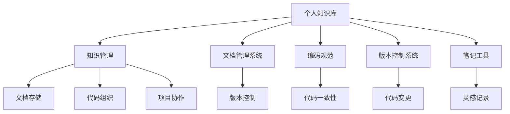

                 

## 1. 背景介绍

在当今快速发展的科技领域，个人知识库的建立与管理变得至关重要。对于程序员而言，面对日益增长的技术栈和不断更新的编程语言、框架和工具，如何高效地整理和检索知识，是提升工作效率和保持竞争力的关键。本文将围绕个人知识库的构建与管理，探索程序员的效率提升之道。

### 1.1 问题由来

随着软件开发的复杂性不断增加，程序员需要管理的内容越来越多。从编程语言和框架到中间件和云服务，再到算法和设计模式，知识面广且不断更新。传统的笔记和文档方式难以满足现代需求，因此，构建一个结构化的个人知识库显得尤为必要。

### 1.2 问题核心关键点

构建个人知识库的核心关键点在于选择合适的工具、制定有效的管理策略和坚持日常的更新维护。其中，选择适合的工具能够极大地提高知识库的管理效率，而制定合理的策略可以确保知识库的持续更新和有效利用，日常维护则保证了知识库的内容始终保持最新和相关性。

## 2. 核心概念与联系

### 2.1 核心概念概述

为更好地理解个人知识库的构建和管理，本节将介绍几个密切相关的核心概念：

- **个人知识库(Individual Knowledge Base)**：指个人收集、整理和存储知识的数字化系统，可以是笔记、代码片段、文档、书籍、链接等形式的集合。
- **知识管理(Knowledge Management)**：指对个人或组织内的知识进行系统化收集、存储、整理、检索和共享的过程。
- **文档管理系统(Document Management System)**：一种自动化管理文档的软件系统，通常包括文档创建、存储、检索和版本控制等功能。
- **编码规范(Code Style Guide)**：指为保持代码一致性和可读性而制定的编码标准和规范。
- **版本控制系统(Version Control System)**：如Git，用于管理代码的版本，记录变更历史，支持团队协作和问题追踪。
- **笔记工具(Note-taking Tools)**：如Evernote、OneNote，用于记录日常思考、灵感和重要信息。

这些核心概念之间的逻辑关系可以通过以下Mermaid流程图来展示：



这个流程图展示了一些核心概念及其之间的关系：

1. 个人知识库是知识管理的容器，包含文档管理系统、编码规范、版本控制系统、笔记工具等组件。
2. 文档管理系统帮助存储和组织文档，支持版本控制。
3. 编码规范保持代码一致性和可读性。
4. 版本控制系统记录代码变更，支持团队协作和问题追踪。
5. 笔记工具用于记录灵感和重要信息。

## 3. 核心算法原理 & 具体操作步骤
### 3.1 算法原理概述

构建个人知识库的核心算法原理基于知识管理理论，结合技术实现的具体场景，旨在实现知识的系统化存储、高效检索和及时更新。这一过程通常包括以下几个步骤：

1. **知识采集**：收集并整理与工作相关的各类信息，包括技术文档、编程代码、学习笔记等。
2. **知识存储**：将采集到的知识进行分类存储，确保结构化且易于查找。
3. **知识组织**：通过标签、目录、分类等手段对存储的知识进行结构化组织，以便快速检索和展示。
4. **知识检索**：实现高效的知识检索功能，支持关键词搜索、全文搜索、分类检索等。
5. **知识更新**：定期更新知识库内容，确保信息的时效性和准确性。

### 3.2 算法步骤详解

构建个人知识库的具体步骤如下：

**Step 1: 选择合适的工具**
- 根据需求选择合适的文档管理系统（如Confluence、Google Drive）。
- 选择合适的笔记工具（如Evernote、Notion）。
- 选择合适的版本控制系统（如Git、SVN）。

**Step 2: 设置知识库结构**
- 定义知识库的基本结构，如分类、标签、文件夹等。
- 创建文档模板，定义标准文档格式和内容结构。
- 配置版本控制系统，记录代码变更和文档更新。

**Step 3: 数据导入和组织**
- 将现有的笔记、文档和代码导入知识库。
- 对文档进行分类和标签设置，确保结构化。
- 使用版本控制系统记录代码变更，保持历史版本。

**Step 4: 实现知识检索功能**
- 开发关键词搜索、全文搜索功能。
- 实现分类检索，便于快速定位特定类型的信息。
- 配置权限控制，保护敏感信息。

**Step 5: 维护和更新**
- 定期整理和更新知识库内容，删除过时信息。
- 进行备份和版本管理，确保数据安全。
- 进行审计和监控，保证系统运行稳定。

### 3.3 算法优缺点

构建个人知识库的优势包括：
- 高效管理知识。结构化存储和检索功能大大提升了知识查找和应用效率。
- 促进知识共享。方便团队成员协作和知识传承。
- 保障数据安全。版本控制和权限管理保障数据安全。

缺点包括：
- 初始投入较大。选择合适的工具和配置合理的知识库结构需要一定的时间和精力。
- 更新维护工作量大。保持知识库内容的时效性和相关性需要持续的努力。
- 学习曲线较陡。对于不熟悉特定工具和技术的用户，可能需要一定时间的学习和适应。

### 3.4 算法应用领域

个人知识库的应用领域非常广泛，覆盖了软件开发、项目管理、技术学习等多个方面：

- **软件开发**：组织和管理项目代码、文档、设计图等，支持团队协作。
- **项目管理**：记录项目计划、进度、问题和决策，进行任务分配和跟踪。
- **技术学习**：收集和整理各类技术文档、课程资料、学习笔记，加速技术积累。
- **知识共享**：方便团队成员进行信息共享，促进知识传递和技能提升。
- **个人记录**：记录工作日志、灵感、想法等，便于回顾和反思。

## 4. 数学模型和公式 & 详细讲解 & 举例说明

### 4.1 数学模型构建

为了更好地进行个人知识库的构建和管理，我们可以从知识检索的角度构建数学模型。假设个人知识库中有 $N$ 个文档，每个文档有 $M$ 个标签，每个标签有 $K$ 种取值。知识检索的目标是找到一个文档集合 $D \subseteq \{1,2,...,N\}$，使得所有查询词在文档集合 $D$ 中的出现次数最大化。

设查询词为 $q$，文档 $d$ 中查询词的出现次数为 $count_q(d)$。则知识检索的目标可以表示为：

$$
\max_{D} \sum_{d \in D} count_q(d)
$$

### 4.2 公式推导过程

通过构建倒排索引，我们可以快速计算查询词在每个文档中的出现次数。倒排索引是一种数据结构，将每个标签和其出现次数映射到对应的文档，形式化表示为：

$$
Index = \{ (label, doc\_set)\ |\ label \in \{1,2,...,K\}, doc\_set \subseteq \{1,2,...,N\} \}
$$

对于每个查询词 $q$，我们可以快速找到包含该词的文档集合 $D_q = \{d | d \in Index[q]\}$。知识检索的目标转化为最大化查询词 $q$ 在文档集合 $D_q$ 中的出现次数，即：

$$
\max_{D_q} \sum_{d \in D_q} count_q(d)
$$

### 4.3 案例分析与讲解

以一个简单的示例来说明上述过程。假设知识库中有三个文档 $d_1, d_2, d_3$，它们分别有 $count_q(d_1)=2, count_q(d_2)=3, count_q(d_3)=1$ 和标签 $label_1=q, label_2=q, label_3=\bar{q}$。当查询词为 $q$ 时，倒排索引为：

$$
Index = \{ (q, \{d_1, d_2\}), (\bar{q}, \{d_3\}) \}
$$

此时，$D_q = \{d_1, d_2\}$，知识检索的目标转化为最大化 $count_q(d_1)+count_q(d_2)$，即：

$$
\max_{d_1, d_2} (count_q(d_1)+count_q(d_2))
$$

通过计算，可以找到最优解 $D_q = \{d_1, d_2\}$，即文档集合 $D$ 应该包含 $d_1$ 和 $d_2$，以最大化查询词 $q$ 的出现次数。

## 5. 项目实践：代码实例和详细解释说明
### 5.1 开发环境搭建

在开始个人知识库的开发之前，需要先准备好开发环境。以下是使用Python进行知识库开发的常用工具：

1. **版本控制系统**：安装Git，使用命令行或图形界面工具管理代码版本。
2. **文档管理系统**：选择Confluence或Google Drive等工具，存储和管理文档。
3. **笔记工具**：安装Evernote或Notion，记录日常灵感和重要信息。
4. **开发环境**：安装Python和相关开发工具，如PyCharm、Jupyter Notebook等。
5. **数据管理**：使用SQLite或MySQL等数据库，管理知识库元数据。

完成上述步骤后，即可开始知识库的开发和维护。

### 5.2 源代码详细实现

以下是一个简单的Python脚本，用于从Git仓库中下载文档并保存到本地知识库。

```python
import os
import subprocess
import pandas as pd

# 定义Git仓库地址和本地路径
repo_url = 'https://github.com/user/repo.git'
local_path = '~/KnowledgeBase'

# 创建本地路径
os.makedirs(local_path, exist_ok=True)

# 克隆Git仓库
subprocess.run(['git', 'clone', repo_url, local_path])

# 遍历本地文档，保存到知识库
for root, dirs, files in os.walk(local_path):
    for file in files:
        if file.endswith('.md'):
            file_path = os.path.join(root, file)
            with open(file_path, 'r') as f:
                content = f.read()
                # 处理文档内容，保存到知识库数据库
                db = pd.DataFrame({'title': file, 'content': content})
                db.to_csv(os.path.join(local_path, 'knowledge_base.csv'), index=False)
```

这个脚本的作用是：

- 从Git仓库中克隆文档到本地路径。
- 遍历本地文档，只处理Markdown格式的文件。
- 读取文件内容，处理后保存到知识库数据库。

### 5.3 代码解读与分析

让我们再详细解读一下关键代码的实现细节：

1. **克隆Git仓库**：使用 `subprocess.run` 函数调用 `git clone` 命令，将Git仓库内容克隆到本地路径。

2. **遍历文档**：使用 `os.walk` 函数遍历本地路径，获取所有文档文件。

3. **处理文档内容**：使用 `open` 函数读取文档内容，将其存储在变量 `content` 中。

4. **保存到知识库数据库**：使用 Pandas 库创建数据框 `db`，包含文档标题和内容，并使用 `to_csv` 方法保存到本地知识库数据库中。

通过这个简单的示例，可以看到知识库的构建过程包括文档的下载、处理和存储。实际开发中，还需要实现更多的功能，如版本控制、标签管理、搜索功能等。

### 5.4 运行结果展示

完成脚本的编写和执行后，可以在本地路径下查看克隆的文档和知识库数据库。知识库数据库的格式可以是CSV、Excel等，用于方便地检索和展示文档内容。

## 6. 实际应用场景
### 6.1 软件开发

在软件开发中，个人知识库可以用于管理项目代码、文档和设计图。通过版本控制和权限管理，团队成员可以协同工作，快速定位问题，记录变更历史。

### 6.2 项目管理

在项目管理中，个人知识库可以记录项目计划、进度、问题和决策，支持任务分配和跟踪。通过版本控制和权限管理，确保信息的安全性和完整性。

### 6.3 技术学习

在技术学习中，个人知识库可以收集和整理各类技术文档、课程资料、学习笔记，加速技术积累和知识传递。通过标签和分类，可以快速找到相关资料。

### 6.4 个人记录

在个人记录中，个人知识库可以记录工作日志、灵感、想法等，便于回顾和反思。通过标签和分类，可以快速定位特定类型的信息。

### 6.5 未来应用展望

未来，随着人工智能和大数据技术的发展，个人知识库将更加智能和高效。通过自然语言处理和机器学习技术，实现自动分类、自动摘要、自动推荐等功能，提升知识库的使用体验。

## 7. 工具和资源推荐
### 7.1 学习资源推荐

为了帮助开发者系统掌握个人知识库的构建和管理，这里推荐一些优质的学习资源：

1. **《软件工程实践》系列书籍**：介绍了软件开发中的项目管理、需求分析、设计、编码、测试等环节，包括知识库构建和管理的相关章节。

2. **《编程规范与编程技巧》**：介绍常见的编程规范和技巧，帮助开发者保持代码一致性和可读性。

3. **《敏捷项目管理》**：介绍了敏捷项目管理的方法和工具，包括知识库的应用和管理。

4. **《数据结构与算法》**：介绍常见数据结构和算法，提升数据处理和优化能力。

5. **《编码最佳实践》**：介绍编程最佳实践，包括编码规范、代码审查等，帮助开发者提升编码水平。

通过对这些资源的学习实践，相信你一定能够快速掌握个人知识库的构建和管理技巧，提升工作效率。

### 7.2 开发工具推荐

高效的开发离不开优秀的工具支持。以下是几款用于个人知识库开发和维护的常用工具：

1. **版本控制系统**：如Git，用于管理代码的版本，记录变更历史，支持团队协作和问题追踪。

2. **文档管理系统**：如Confluence、Google Drive，存储和管理文档，支持权限控制和版本管理。

3. **笔记工具**：如Evernote、Notion，记录日常灵感和重要信息，支持标签、分类等功能。

4. **搜索工具**：如Elasticsearch、Solr，实现高效的知识检索和搜索功能。

5. **数据管理工具**：如SQLite、MySQL，管理知识库元数据，支持数据存储和检索。

6. **可视化工具**：如Tableau、Power BI，对知识库数据进行可视化展示，提升信息利用效率。

合理利用这些工具，可以显著提升个人知识库的开发效率，加速知识积累和应用。

### 7.3 相关论文推荐

个人知识库和知识管理的理论研究不断发展，以下是几篇奠基性的相关论文，推荐阅读：

1. **《构建和维护知识库：一种基于案例的方法》**：介绍了知识库构建和管理的基本流程和方法，强调了用户参与的重要性。

2. **《基于语义的文档管理：模型、方法和实践》**：探讨了语义技术在文档管理中的应用，提升了文档的检索和组织能力。

3. **《代码重构的自动推断和分类》**：介绍了如何利用机器学习技术进行代码重构推断和分类，提升代码管理效率。

4. **《版本控制系统的革命性变化：从SVN到Git》**：介绍了Git的版本控制系统和其革命性变化，讨论了Git在代码管理和团队协作中的应用。

5. **《语义搜索与信息检索》**：探讨了语义技术在信息检索中的应用，提升了知识库的搜索能力和信息利用效率。

这些论文代表了个人知识库和知识管理的理论研究前沿，通过学习这些前沿成果，可以帮助研究者把握学科前进方向，激发更多的创新灵感。

## 8. 总结：未来发展趋势与挑战

### 8.1 研究成果总结

本文对个人知识库的构建和管理进行了系统介绍。首先阐述了个人知识库在软件开发、项目管理、技术学习等方面的重要性，明确了构建知识库的关键步骤和核心概念。其次，从算法原理和操作步骤的角度，详细讲解了知识库构建的实现方法和优化策略。最后，讨论了知识库的未来发展趋势和面临的挑战，提出了相应的研究方向和突破方向。

通过本文的系统梳理，可以看到，个人知识库的构建和管理对于提升程序员的工作效率和保持技术竞争力具有重要意义。合理利用知识库，可以有效整理和利用知识，提升个人和团队的工作效率。

### 8.2 未来发展趋势

展望未来，个人知识库的发展趋势包括：

1. **智能化管理**：引入人工智能和大数据技术，实现知识库的自动分类、自动摘要、自动推荐等功能，提升知识库的使用体验。

2. **语义化处理**：利用语义技术和自然语言处理技术，提升文档和代码的检索和理解能力，实现更智能的知识库。

3. **跨平台集成**：通过API接口和插件，实现个人知识库与多种工具和平台的集成，提升数据流通和应用效率。

4. **云服务支持**：利用云服务实现知识库的存储和部署，支持多用户协作和数据备份，保障数据安全。

5. **多设备同步**：支持多设备同步和访问，提升知识库的使用便捷性，支持随时随地的信息获取。

6. **个性化推荐**：通过机器学习技术，实现个性化知识推荐，提升知识库的使用效率和效果。

这些发展趋势展示了个人知识库的巨大潜力和应用前景，预示着未来知识库将更加智能、高效、易用。

### 8.3 面临的挑战

尽管个人知识库的发展前景广阔，但在构建和应用过程中仍面临诸多挑战：

1. **数据隐私和安全**：个人知识库通常包含敏感信息，需要严格的权限控制和数据加密，保障数据隐私和安全。

2. **系统复杂性**：随着知识库规模的增大，系统复杂度也会增加，需要高效的设计和维护手段。

3. **标准化和互操作性**：知识库系统需要与多种工具和平台进行集成，标准化和互操作性问题亟需解决。

4. **知识库的维护成本**：知识库的持续更新和维护需要大量的时间和精力，需要高效的管理策略和自动化工具。

5. **用户接受度**：知识库的引入和使用需要改变现有的工作习惯，部分用户可能存在接受度问题。

6. **技术成熟度**：部分新兴技术，如语义搜索、智能推荐等，尚需进一步完善和成熟。

这些挑战需要开发者和研究者共同努力，不断优化和改进知识库系统，以实现其最大的应用价值。

### 8.4 研究展望

未来，个人知识库的研究方向包括：

1. **跨领域知识融合**：将不同领域的知识进行融合和整合，提升知识库的广度和深度。

2. **自适应知识管理**：根据用户行为和偏好，自适应调整知识库的组织结构和推荐算法，提升知识库的使用效果。

3. **多模态数据管理**：将文本、代码、图片、视频等多种数据类型进行统一管理，提升知识库的应用范围和价值。

4. **知识图谱应用**：引入知识图谱技术，构建知识库中的实体关系图，提升知识的关联和推理能力。

5. **机器学习与知识库结合**：将机器学习技术引入知识库，提升文档分类、自动摘要、知识推荐等功能，提升知识库的智能化水平。

6. **用户体验优化**：从用户体验角度出发，优化知识库的界面设计、交互方式和操作流程，提升知识库的使用便捷性和体验感。

这些研究方向将推动个人知识库向更智能、更高效、更便捷的方向发展，为程序员和其他专业技术人员提供更加智能化的知识管理工具。

## 9. 附录：常见问题与解答

**Q1: 构建个人知识库需要哪些工具？**

A: 构建个人知识库通常需要以下工具：

- 版本控制系统（如Git）
- 文档管理系统（如Confluence、Google Drive）
- 笔记工具（如Evernote、Notion）
- 数据管理工具（如SQLite、MySQL）
- 搜索工具（如Elasticsearch、Solr）

合理选择和配置这些工具，可以提升知识库的管理效率和应用效果。

**Q2: 如何设计知识库的分类和标签体系？**

A: 知识库的分类和标签体系设计应基于业务需求和使用场景，常见的设计原则包括：

- 分类应具有层级性，便于从宏观到微观的浏览和检索。
- 标签应具有细粒度，便于精确匹配和检索。
- 分类和标签应相互关联，形成层次结构。
- 分类和标签应具有扩展性，便于未来的扩展和调整。

设计合理的分类和标签体系，可以提升知识库的使用效率和效果。

**Q3: 如何进行知识库的备份和恢复？**

A: 知识库的备份和恢复可以通过版本控制系统和数据管理工具实现。具体步骤包括：

- 定期备份知识库数据库和文档存储。
- 使用版本控制系统记录备份日志和变更历史。
- 定期检查备份文件的完整性和可用性。
- 使用数据管理工具进行恢复操作，确保数据的安全性和完整性。

合理进行知识库的备份和恢复，可以保障数据的安全和完整，避免数据丢失和损坏。

**Q4: 如何优化知识库的检索效率？**

A: 知识库的检索效率可以通过以下方法优化：

- 使用倒排索引和全文搜索技术，快速定位文档内容。
- 使用关键词过滤和分类检索，提升检索的准确性和相关性。
- 引入人工智能和大数据技术，实现智能推荐和个性化检索。
- 优化知识库的数据结构和检索算法，提升检索效率。

合理优化知识库的检索效率，可以提升信息获取的速度和准确性，提升知识库的使用效果。

**Q5: 如何保障知识库的安全性和隐私性？**

A: 知识库的安全性和隐私性保障可以通过以下方法实现：

- 使用数据加密和访问控制技术，保护敏感信息的安全性。
- 定期进行安全审计和漏洞扫描，及时发现和修复安全漏洞。
- 制定严格的知识库使用和管理规则，确保合规性。
- 建立知识库的应急响应机制，应对安全事件。

合理保障知识库的安全性和隐私性，可以避免数据泄露和滥用，保障知识库的信息安全和用户隐私。

---

作者：禅与计算机程序设计艺术 / Zen and the Art of Computer Programming

