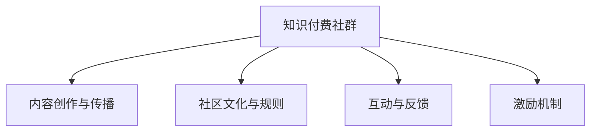

                 

## 1. 背景介绍

在快速发展的技术领域，知识的更新换代速度日新月异。从移动开发到人工智能，从区块链到大数据，技术的迭代让从业者们需要不断学习，才能保持自身的竞争力。然而，知识的碎片化、学习路径不清晰，使得许多技术人员面临“学有余而力不足”的困境。在这样的背景下，知识付费社群应运而生，通过高质量的内容和有组织的知识传递，为技术人员提供系统化学习、快速提升的机会。

## 2. 核心概念与联系

### 2.1 核心概念概述

- **知识付费社群**：基于互联网的平台，聚集着一群对某一技术领域有共同兴趣的成员，通过分享、讨论和互动，共同学习和成长。

- **内容创作与传播**：知识付费社群的核心价值在于内容，其创作与传播包括但不限于文章、视频、直播、线下活动等形式，通过丰富的内容形式满足不同用户的学习需求。

- **社区文化与规则**：一个成功的知识付费社群不仅要有优质的内容，还需要有明确的社区文化与规则，保证内容的质量和社群的活跃度。

- **互动与反馈**：社群成员之间通过评论、问答、讨论等方式进行互动，及时反馈学习效果和需求，促进内容的不断优化和社群的持续发展。

- **激励机制**：通过奖励、认证等方式激励优质内容的创作和分享，同时吸引更多的用户参与。

这些概念相互关联，共同构成了知识付费社群的基础框架，使知识传递和学习成为一个动态、互动、高效的过程。

### 2.2 核心概念原理和架构的 Mermaid 流程图



## 3. 核心算法原理 & 具体操作步骤

### 3.1 算法原理概述

知识付费社群的核心算法原理主要体现在内容推荐、社区互动和激励机制三个方面：

- **内容推荐算法**：通过分析用户的行为数据和偏好，动态生成个性化推荐列表，使用户可以迅速找到自己感兴趣的内容。

- **社区互动算法**：通过算法推荐讨论话题和热门问题，鼓励用户参与互动，同时对互动行为进行算法优化，提升社群的活跃度和讨论质量。

- **激励机制算法**：根据用户的行为和贡献，动态调整其权限和奖励，确保社群的公平性和激励的有效性。

### 3.2 算法步骤详解

**步骤一：内容推荐算法**
1. 数据收集：收集用户在平台上的浏览、点赞、评论等行为数据。
2. 特征提取：将行为数据转化为模型可以处理的特征向量。
3. 模型训练：使用机器学习算法（如协同过滤、内容推荐、深度学习等）训练推荐模型。
4. 实时推荐：根据用户当前的在线状态和行为数据，实时生成个性化推荐列表。

**步骤二：社区互动算法**
1. 话题建模：使用自然语言处理技术对用户讨论的话题进行建模，识别热门话题和趋势。
2. 话题推荐：根据用户的历史行为和兴趣，推荐相关话题和讨论。
3. 实时监控：通过算法实时监控社群的活跃度和讨论质量，及时调整话题和讨论。

**步骤三：激励机制算法**
1. 行为分析：根据用户在平台上的行为（如回答、提问、点赞、评论等），计算其贡献度。
2. 贡献度排名：根据贡献度的大小，对用户进行排名，并展示其排名和荣誉。
3. 动态调整：根据用户的持续贡献度，动态调整其权限和奖励，确保激励机制的有效性。

### 3.3 算法优缺点

**优点**：
- 高效匹配用户需求和内容：通过算法实现个性化推荐，提升用户的学习效率。
- 提升社群活跃度：通过话题推荐和互动优化，增加用户参与度。
- 激励有效：动态调整激励机制，确保公平和激励的有效性。

**缺点**：
- 数据隐私问题：大量收集用户行为数据可能引发隐私问题。
- 算法偏见：推荐和互动算法可能因训练数据的不平衡引入偏见。
- 过度依赖算法：过于依赖算法可能忽视社群成员的自主性和创造性。

### 3.4 算法应用领域

知识付费社群的算法广泛应用于技术社区、在线课程平台、专业论坛等场景。例如：

- **技术社区**：如Stack Overflow、GitHub等，通过内容推荐和话题推荐，提升技术交流的效率和质量。
- **在线课程平台**：如Coursera、Udemy等，通过个性化推荐和学习路径规划，提升学习效果和用户体验。
- **专业论坛**：如知乎、天涯等，通过讨论话题和互动优化，提升用户参与度和内容质量。

## 4. 数学模型和公式 & 详细讲解 & 举例说明

### 4.1 数学模型构建

知识付费社群的算法模型可以分为以下几个部分：

1. **用户画像模型**：通过机器学习算法（如聚类、分类等），对用户进行画像，建立用户的兴趣和行为特征。
2. **内容表示模型**：使用词嵌入、主题模型等技术，将内容转化为模型可以处理的特征向量。
3. **推荐算法模型**：使用协同过滤、基于内容的推荐、深度学习推荐等模型，生成个性化推荐。
4. **互动算法模型**：使用图神经网络、自然语言处理等技术，对用户互动行为进行建模和预测。
5. **激励机制模型**：使用游戏化设计、社会网络分析等技术，设计动态激励机制。

### 4.2 公式推导过程

**用户画像模型**
- 假设用户有 $n$ 个特征，用户画像模型 $P(u)$ 可以通过用户的历史行为数据训练得到。
$$
P(u) = \sum_{i=1}^n w_i f_i(u)
$$
其中 $w_i$ 为特征权重，$f_i(u)$ 为特征函数。

**内容表示模型**
- 假设内容有 $m$ 个特征，内容表示模型 $C(c)$ 可以通过词嵌入、主题模型等技术得到。
$$
C(c) = \sum_{j=1}^m v_j e_j(c)
$$
其中 $v_j$ 为特征权重，$e_j(c)$ 为特征函数。

**推荐算法模型**
- 假设用户对内容 $c$ 的评分 $r$ 可以通过推荐模型 $R(u,c)$ 预测得到。
$$
R(u,c) = \sum_{k=1}^K \alpha_k f_k(u, c)
$$
其中 $f_k(u, c)$ 为推荐模型函数，$\alpha_k$ 为模型权重。

**互动算法模型**
- 假设用户 $u_i$ 和用户 $u_j$ 的互动强度 $I(u_i, u_j)$ 可以通过互动模型 $I(u_i, u_j)$ 预测得到。
$$
I(u_i, u_j) = \sum_{l=1}^L \beta_l g_l(u_i, u_j)
$$
其中 $g_l(u_i, u_j)$ 为互动模型函数，$\beta_l$ 为模型权重。

**激励机制模型**
- 假设用户 $u$ 的激励度 $E(u)$ 可以通过激励机制模型 $E(u)$ 预测得到。
$$
E(u) = \sum_{p=1}^P \gamma_p h_p(u)
$$
其中 $h_p(u)$ 为激励机制模型函数，$\gamma_p$ 为模型权重。

### 4.3 案例分析与讲解

**案例一：内容推荐算法**
- **数据收集**：收集用户在平台上的浏览、点赞、评论等行为数据。
- **特征提取**：将行为数据转化为特征向量，如用户ID、内容ID、时间戳、点赞数等。
- **模型训练**：使用协同过滤算法（如ALS）训练推荐模型，生成用户对内容的评分矩阵。
- **实时推荐**：根据用户当前的在线状态和行为数据，实时生成个性化推荐列表。

**案例二：社区互动算法**
- **话题建模**：使用LDA等主题模型对用户讨论的话题进行建模，识别热门话题和趋势。
- **话题推荐**：根据用户的历史行为和兴趣，推荐相关话题和讨论。
- **实时监控**：通过算法实时监控社群的活跃度和讨论质量，及时调整话题和讨论。

**案例三：激励机制算法**
- **行为分析**：根据用户在平台上的行为（如回答、提问、点赞、评论等），计算其贡献度。
- **贡献度排名**：根据贡献度的大小，对用户进行排名，并展示其排名和荣誉。
- **动态调整**：根据用户的持续贡献度，动态调整其权限和奖励，确保激励机制的有效性。

## 5. 项目实践：代码实例和详细解释说明

### 5.1 开发环境搭建

在项目实践前，需要准备好开发环境。以下是使用Python进行知识付费社群开发的Python环境配置流程：

1. 安装Anaconda：从官网下载并安装Anaconda，用于创建独立的Python环境。

2. 创建并激活虚拟环境：
```bash
conda create -n knowledge-env python=3.8 
conda activate knowledge-env
```

3. 安装PyTorch：根据CUDA版本，从官网获取对应的安装命令。例如：
```bash
conda install pytorch torchvision torchaudio cudatoolkit=11.1 -c pytorch -c conda-forge
```

4. 安装相关Python库：
```bash
pip install numpy pandas scikit-learn matplotlib tqdm jupyter notebook ipython
```

完成上述步骤后，即可在`knowledge-env`环境中开始项目实践。

### 5.2 源代码详细实现

这里我们以推荐算法为例，给出使用PyTorch进行知识付费社群推荐系统开发的Python代码实现。

**步骤一：用户画像模型**
- 数据集准备：收集用户的历史行为数据，存储在CSV文件中。
- 数据加载：使用pandas库读取CSV文件。
- 数据预处理：清洗和标准化数据，去除异常值和缺失值。
- 特征工程：将数据转化为模型可以处理的特征向量。

```python
import pandas as pd
from sklearn.model_selection import train_test_split

# 加载数据集
data = pd.read_csv('user_behavior.csv')

# 数据预处理
data = data.dropna()
data = data.drop_duplicates()

# 特征工程
features = ['user_id', 'content_id', 'time戳', '点赞数', '评论数', '观看时长']
X = data[features]
y = data['评分']
X_train, X_test, y_train, y_test = train_test_split(X, y, test_size=0.2, random_state=42)
```

**步骤二：内容表示模型**
- 使用词嵌入技术（如word2vec）对内容进行表示。
- 使用主题模型（如LDA）对内容进行主题建模。
- 将主题和词嵌入合并，生成内容表示向量。

```python
from gensim.models import Word2Vec
from gensim.corpora.dictionary import Dictionary
from gensim.models import LdaModel

# 词嵌入
word2vec = Word2Vec(X_train, min_count=1, size=100, window=5)
dictionary = Dictionary([word2vec.wv.vocab.keys()])
corpus = [word2vec[w] for w in dictionary.token2id]
X_train['word2vec'] = [dictionary[w] for w in X_train['内容'].tolist()]

# 主题模型
lda = LdaModel(corpus, num_topics=10, id2word=dictionary)
X_train['主题'] = [lda.get_document_topics([dictionary[w] for w in X_train['内容'].tolist()])]
```

**步骤三：推荐算法模型**
- 使用协同过滤算法（如ALS）对推荐模型进行训练。
- 使用深度学习算法（如神经网络）对推荐模型进行优化。

```python
from pyspark.ml.recommendation import ALS
from pyspark.ml.evaluation import RegressionEvaluator
from pyspark.ml.regression import LinearRegression

# 协同过滤
als = ALS(features=['user_id', '内容_id', 'time戳', '点赞数', '评论数', '观看时长'], 
         rank=10, iterations=10, userCol="user_id", itemCol="内容_id", implicitValues="2.0")

model = als.fit(X_train)
predictions = model.transform(X_test)

# 深度学习
X_train_ = pd.concat([X_train.drop(['内容_id'], axis=1), X_train['word2vec']], axis=1)
y_train_ = pd.concat([y_train, y_train], axis=1)
X_test_ = pd.concat([X_test.drop(['内容_id'], axis=1), X_test['word2vec']], axis=1)
y_test_ = pd.concat([y_test, y_test], axis=1)

features = ['user_id', '内容_id', '时间戳', '点赞数', '评论数', '观看时长', 'word2vec']
X_train_ = X_train_.fillna(0)
X_test_ = X_test_.fillna(0)

model = LinearRegression(features=features, label='评分', maxIter=10)
model.fit(X_train_, y_train_)
predictions = model.transform(X_test_)
```

**步骤四：实时推荐**
- 将推荐模型应用于实时数据流，生成推荐列表。

```python
from pyspark.sql import SparkSession

spark = SparkSession.builder.getOrCreate()

# 实时推荐
def recommend(user_id, content_ids):
    user = spark.createDataFrame([(1, content_ids)], ['user_id', '内容_id'])
    result = als.predict(user)
    recommendations = result.rdd.map(lambda x: x[0]).collect()
    return recommendations

recommendations = recommend(1, [2, 3, 4, 5])
```

### 5.3 代码解读与分析

让我们再详细解读一下关键代码的实现细节：

**用户画像模型**
- 数据加载和预处理：通过pandas库对CSV文件进行加载和处理，去除异常值和缺失值。
- 特征工程：将数据转化为模型可以处理的特征向量，如用户ID、内容ID、时间戳、点赞数等。

**内容表示模型**
- 词嵌入：使用word2vec技术对内容进行嵌入，生成词向量表示。
- 主题模型：使用LDA主题模型对内容进行主题建模，生成主题分布。
- 内容表示向量：将主题和词嵌入合并，生成内容的表示向量。

**推荐算法模型**
- 协同过滤：使用ALS算法对推荐模型进行训练，生成用户对内容的评分预测。
- 深度学习：使用线性回归模型对推荐模型进行优化，提升推荐精度。

**实时推荐**
- 应用推荐模型：将推荐模型应用于实时数据流，生成推荐列表。

可以看到，使用PyTorch和Spark等工具，可以高效实现知识付费社群的推荐算法，满足用户的个性化需求。

## 6. 实际应用场景

### 6.1 智能客服系统

基于知识付费社群的推荐算法，智能客服系统可以为用户提供个性化的服务建议。通过分析用户的历史行为和提问记录，智能客服系统可以推荐相关知识库、FAQ、专家问答等内容，帮助用户快速解决问题。

### 6.2 在线课程平台

在线课程平台可以通过推荐算法，向用户推荐与其兴趣和水平相匹配的课程和资料。根据用户的学习行为和反馈，智能推荐系统可以动态调整推荐内容，提升学习效果和用户体验。

### 6.3 专业论坛

专业论坛可以通过推荐算法，向用户推荐相关话题和讨论，促进用户之间的交流和知识共享。同时，通过互动算法，平台可以优化讨论质量，避免低质量内容的泛滥。

### 6.4 未来应用展望

随着技术的发展，知识付费社群的应用场景将更加广泛，其算法和模型也将不断进化。未来，基于知识付费社群的推荐系统将更加智能化、个性化和互动化，为用户提供更优质的学习体验。

## 7. 工具和资源推荐

### 7.1 学习资源推荐

为了帮助开发者系统掌握知识付费社群的理论基础和实践技巧，这里推荐一些优质的学习资源：

1. 《推荐系统实战》系列博文：由推荐系统专家撰写，深入浅出地介绍了推荐系统的原理和实践技巧。

2. Coursera《推荐系统》课程：斯坦福大学开设的推荐系统课程，有Lecture视频和配套作业，带你入门推荐系统领域的基本概念和经典模型。

3. 《深度学习与推荐系统》书籍：深入浅出地介绍了深度学习在推荐系统中的应用，包括协同过滤、深度学习推荐等。

4. Kaggle推荐系统竞赛：通过实际竞赛项目，实践推荐系统的算法和模型，积累经验。

5. GitHub推荐系统开源项目：学习开源项目的代码实现和架构设计，获取灵感和代码示例。

通过对这些资源的学习实践，相信你一定能够快速掌握知识付费社群的核心算法和实践技巧，并用于解决实际的推荐问题。

### 7.2 开发工具推荐

高效的开发离不开优秀的工具支持。以下是几款用于知识付费社群开发的常用工具：

1. PyTorch：基于Python的开源深度学习框架，灵活动态的计算图，适合快速迭代研究。大部分推荐算法都有PyTorch版本的实现。

2. TensorFlow：由Google主导开发的开源深度学习框架，生产部署方便，适合大规模工程应用。同样有丰富的推荐算法资源。

3. Spark：用于大规模数据处理的分布式计算框架，适合处理推荐系统的实时数据流。

4. Elasticsearch：分布式搜索和分析引擎，适合存储和查询用户行为数据。

5. Redis：高性能的内存数据库，适合缓存用户行为数据，提高推荐算法的实时性。

6. Apache Kafka：分布式流处理平台，适合处理实时数据流，实现推荐算法的实时化。

合理利用这些工具，可以显著提升知识付费社群的开发效率，加快创新迭代的步伐。

### 7.3 相关论文推荐

知识付费社群的发展源于学界的持续研究。以下是几篇奠基性的相关论文，推荐阅读：

1. "Collaborative Filtering for Implicit Feedback Datasets"（隐式反馈数据集上的协同过滤）：提出了协同过滤的数学模型和算法，奠定了协同过滤的基础。

2. "Neural Networks for Machine Learning"（神经网络在机器学习中的应用）：介绍了神经网络在推荐系统中的应用，包括深度学习推荐等。

3. "Social Recommendations"（社交推荐）：提出了社交推荐算法，将社交网络与推荐系统结合，提升推荐效果。

4. "Adaptive Collaborative Filtering"（自适应协同过滤）：提出自适应协同过滤算法，克服了传统协同过滤算法的冷启动和偏差问题。

5. "A Comprehensive Survey on Recommender Systems"（推荐系统综述）：总结了推荐系统的各种算法和模型，提供了全面的理论和技术支持。

这些论文代表了大规模推荐系统的研究脉络。通过学习这些前沿成果，可以帮助研究者把握学科前进方向，激发更多的创新灵感。

## 8. 总结：未来发展趋势与挑战

### 8.1 总结

本文对知识付费社群的核心算法和实现流程进行了全面系统的介绍。首先阐述了知识付费社群的研究背景和意义，明确了算法在用户画像、内容推荐、社区互动等方面的核心作用。其次，从原理到实践，详细讲解了推荐算法的数学模型和具体实现，给出了推荐系统开发的完整代码实例。同时，本文还广泛探讨了知识付费社群在智能客服、在线课程、专业论坛等领域的实际应用，展示了推荐算法在技术社区中的巨大潜力。最后，本文精选了推荐系统的学习资源，力求为读者提供全方位的技术指引。

通过本文的系统梳理，可以看到，知识付费社群的算法模型在提升用户个性化推荐和社区互动体验方面发挥了重要作用，极大地增强了技术社区的学习效率和互动质量。未来，随着技术的发展和数据的积累，知识付费社群的算法和模型将更加智能、高效和灵活，为技术学习者提供更加优质的知识服务。

### 8.2 未来发展趋势

展望未来，知识付费社群的算法将呈现以下几个发展趋势：

1. **多模态推荐**：未来的推荐系统将更多地融合视觉、语音、文本等多种模态数据，提升推荐的准确性和多样性。

2. **实时推荐**：随着流处理技术的进步，实时推荐系统将成为主流，可以实时响应用户需求，提供即时性服务。

3. **深度学习推荐**：深度学习技术将进一步优化推荐算法，提升推荐精度和个性化程度。

4. **社交推荐**：社交网络与推荐系统的结合将更加紧密，利用社交关系提升推荐效果。

5. **内容生成**：推荐系统将不仅推荐内容，还能生成内容，如智能问答、智能写作等，提供更加丰富的知识服务。

6. **跨平台协同**：推荐系统将实现跨平台协同，打通不同平台的推荐数据和用户行为，提升推荐效果。

以上趋势凸显了知识付费社群的算法和模型的广阔前景。这些方向的探索发展，将进一步提升推荐系统的效果和应用范围，为技术学习者提供更加全面和高效的知识服务。

### 8.3 面临的挑战

尽管知识付费社群的算法已经取得了瞩目成就，但在迈向更加智能化、普适化应用的过程中，仍面临诸多挑战：

1. **数据隐私问题**：大量收集用户行为数据可能引发隐私问题，如何保护用户隐私，保障数据安全，是亟待解决的问题。

2. **推荐算法偏见**：推荐算法可能因训练数据的不平衡引入偏见，如何消除算法偏见，确保推荐公平性，需要更多理论和实践的积累。

3. **实时性问题**：实时推荐系统对实时数据处理和实时计算提出了很高的要求，如何提高推荐算法的实时性和稳定性，仍是一个挑战。

4. **可解释性问题**：推荐算法的"黑盒"性质，导致其难以解释推荐结果，如何赋予推荐算法更强的可解释性，是另一个重要课题。

5. **多样性和质量**：推荐算法需要在保证推荐多样性的同时，提升推荐内容的品质，如何平衡两者关系，是一个持续优化的过程。

6. **系统架构**：推荐系统需要实现跨平台、跨设备、跨服务器的架构设计，如何设计和实现高效、可扩展的系统架构，是技术实现的重要挑战。

面对这些挑战，未来的研究需要在数据处理、算法设计、系统架构、隐私保护等多个方面寻求新的突破。

### 8.4 研究展望

面对知识付费社群面临的挑战，未来的研究需要在以下几个方面寻求新的突破：

1. **隐私保护技术**：开发更加高效的隐私保护技术，如差分隐私、联邦学习等，保护用户隐私，保障数据安全。

2. **公平性算法**：设计公平性算法，消除推荐算法中的偏见，确保推荐内容的公正性和多样性。

3. **实时性优化**：优化推荐算法的实时性，提高推荐系统的响应速度和稳定性。

4. **可解释性模型**：开发可解释性强的推荐模型，使用户能够理解推荐结果，增强系统的透明度和可信度。

5. **多样性和质量优化**：优化推荐算法的目标函数，平衡推荐多样性和质量，提升推荐内容的用户满意度。

6. **系统架构设计**：设计和实现高效、可扩展的知识付费社群系统架构，支持大规模数据处理和实时推荐。

这些研究方向将引领知识付费社群的算法和模型迈向更高的台阶，为技术学习者提供更加优质、公平、安全、高效的知识服务。面向未来，知识付费社群的算法和模型需要与其他人工智能技术进行更深入的融合，如自然语言处理、计算机视觉、知识图谱等，共同推动技术社区的发展和进步。只有勇于创新、敢于突破，才能不断拓展知识付费社群的边界，让知识服务更好地服务于技术学习者和企业用户。

## 9. 附录：常见问题与解答

**Q1：知识付费社群的核心是什么？**

A: 知识付费社群的核心是高质量的内容和有组织的知识传递，通过内容创作与传播、社区文化与规则、互动与反馈、激励机制等多个环节的协同设计，实现知识的有效传递和共享。

**Q2：推荐算法在知识付费社群中的作用是什么？**

A: 推荐算法在知识付费社群中的核心作用是通过个性化推荐，提升用户的学习效率和体验。推荐算法通过分析用户的行为数据和兴趣，动态生成个性化推荐列表，使用户可以迅速找到自己感兴趣的内容。

**Q3：知识付费社群如何实现实时推荐？**

A: 知识付费社群可以通过实时数据流处理技术，如Apache Kafka，实现实时推荐。结合协同过滤算法和深度学习算法，可以实时生成推荐列表，满足用户的即时性需求。

**Q4：知识付费社群的推荐算法有哪些优缺点？**

A: 推荐算法的优点包括高效匹配用户需求和内容、提升社群活跃度、激励有效等。缺点包括数据隐私问题、算法偏见、过度依赖算法等。

**Q5：知识付费社群的推荐系统如何提升推荐精度？**

A: 可以通过多模态数据融合、实时推荐、深度学习推荐、社交推荐等方法，提升推荐精度和个性化程度。同时，可以通过用户画像模型和内容表示模型，提升推荐模型的表示能力和预测能力。

通过对这些问题的解答，相信读者可以更好地理解知识付费社群的推荐算法和实现细节，提升其在实际应用中的效果和用户体验。

