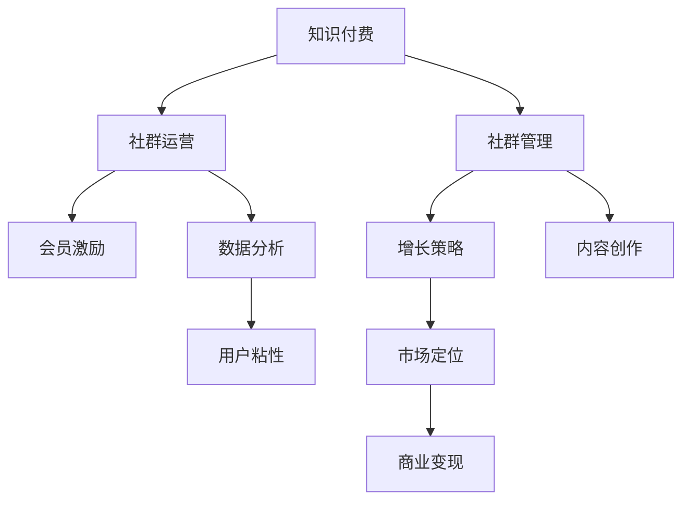

                 

# 打造知识付费社群:运营与管理技巧

> 关键词：知识付费,社群运营,社群管理,会员激励,数据分析,增长策略,内容创作,用户粘性,市场定位,商业变现

## 1. 背景介绍

### 1.1 问题由来

随着互联网的普及和数字技术的发展，知识付费已逐渐成为一种全新的商业模式。用户可以通过订阅、购买等方式，获取各类专业知识和技能，满足个人成长和职业发展的需求。同时，知识付费也推动了内容创作者与用户之间关系的重新构建，为知识传播和付费社群的运营提供了更多可能性。

知识付费社群的运营与管理，涉及到用户增长、内容生产、社区互动等多个方面，是决定知识付费平台能否持续发展、创造商业价值的关键。本文将系统介绍知识付费社群的运营与管理技巧，帮助社群运营者构建和维护一个稳定、高效、有价值的知识付费生态系统。

### 1.2 问题核心关键点

本文聚焦于知识付费社群的运营与管理技巧，旨在解决以下几个核心问题：

- 如何有效吸引和留存用户，构建并扩大社群规模？
- 如何快速提高内容质量和创作效率，确保社群内容的高价值输出？
- 如何通过数据分析，精准把握用户需求，提升社群的活跃度和互动性？
- 如何构建商业变现模式，实现社群的自我造血和持续发展？

## 2. 核心概念与联系

### 2.1 核心概念概述

为了更好地理解知识付费社群的运营与管理技巧，本节将介绍几个关键的概念和它们之间的关系：

- 知识付费（Knowledge-Based Subscription）：通过订阅、付费等形式，向用户提供有价值的知识内容，满足其知识需求和职业发展。

- 社群运营（Community Operations）：通过组织、管理社群活动，提升社群的活跃度和用户满意度，增强用户粘性。

- 社群管理（Community Management）：通过维护社群秩序、处理用户投诉、管理社群资源等手段，保障社群的健康发展。

- 会员激励（Membership Incentives）：通过积分系统、会员特权等方式，激励用户积极参与社群活动，增强其归属感和忠诚度。

- 数据分析（Data Analytics）：通过收集和分析社群数据，发现用户行为和需求的变化趋势，为运营决策提供科学依据。

- 增长策略（Growth Strategy）：通过用户获取、留存、转化等手段，持续扩大社群规模和用户基数。

- 内容创作（Content Creation）：通过吸引和培养优秀内容创作者，持续输出高质量内容，满足用户需求。

- 用户粘性（User Engagement）：通过互动、奖励等方式，提升用户对社群的参与度和粘性，延长用户生命周期。

- 市场定位（Market Segmentation）：通过市场调研和用户画像分析，明确社群的目标用户群体和市场定位，实现精准营销。

- 商业变现（Monetization）：通过广告、付费订阅、知识付费等多种方式，实现社群的盈利和可持续发展。

这些核心概念之间的联系可以通过以下Mermaid流程图来展示：



这个流程图展示了知识付费社群运营的关键环节及其相互关系：

1. 知识付费是社群运营和管理的背景和目的，核心在于通过内容创造和传播实现商业价值。
2. 社群运营通过组织社群活动，提升用户参与度和满意度，是知识付费平台的重要支撑。
3. 社群管理通过维护社群秩序和资源管理，保障社群的健康和可持续运营。
4. 会员激励通过积分系统、特权等方式，增强用户粘性，促进社群的长期发展。
5. 数据分析通过用户行为分析，提供决策依据，优化运营策略。
6. 增长策略通过多渠道获取用户，提升社群规模和用户基数。
7. 内容创作通过吸引和培养内容创作者，输出高质量内容。
8. 用户粘性通过互动和奖励，提升用户参与度和满意度，延长用户生命周期。
9. 市场定位通过用户画像分析，明确目标用户群体，实现精准营销。
10. 商业变现通过多元化盈利模式，实现社群的自我造血和可持续发展。

这些概念共同构成了知识付费社群运营与管理的基本框架，对其深入理解有助于设计科学的运营策略，实现社群的长期发展和商业变现。

## 3. 核心算法原理 & 具体操作步骤

### 3.1 算法原理概述

知识付费社群的运营与管理，本质上是多学科知识的应用和融合。以下将介绍几个关键的技术原理和操作步骤：

- 社交网络分析（Social Network Analysis, SNA）：通过分析社群中用户之间的关系和互动，识别核心用户和意见领袖，指导社群管理和运营策略。
- 推荐系统（Recommendation System）：通过个性化推荐，提升用户对社群内容的满意度和粘性。
- 用户画像（User Persona）：通过用户行为和特征分析，构建用户画像，实现精准营销和内容推送。
- 用户反馈分析（User Feedback Analysis）：通过收集和分析用户反馈，发现社群问题和改进方向。
- 数据挖掘（Data Mining）：通过挖掘社群数据中的隐藏模式和关系，发现用户行为和需求的变化趋势。
- 机器学习（Machine Learning）：通过训练模型，预测用户行为和内容效果，优化运营决策。

### 3.2 算法步骤详解

以下是知识付费社群运营与管理的具体操作步骤：

**Step 1: 市场调研与用户画像构建**

- 通过问卷调查、访谈等方式，收集目标用户的基本信息和需求。
- 使用数据挖掘和机器学习技术，分析用户行为数据，构建用户画像，识别不同用户群体的特点和需求。

**Step 2: 内容策略制定**

- 根据用户画像和市场需求，制定内容策略，确定重点领域和主题。
- 引入优秀内容创作者，并通过培训和激励机制提升其创作效率和质量。

**Step 3: 社群活动策划与执行**

- 根据内容策略和用户需求，策划社群活动，如直播讲座、用户互动等。
- 通过社交网络分析，识别核心用户和意见领袖，邀请其参与活动。

**Step 4: 数据分析与运营优化**

- 收集和分析社群数据，如用户活跃度、内容阅读量等，发现问题和改进方向。
- 使用推荐系统和机器学习算法，优化内容推荐和运营策略。

**Step 5: 会员激励与用户粘性提升**

- 通过积分系统、会员特权等方式，激励用户积极参与社群活动。
- 建立社区互动机制，如问答、讨论、打卡等，提升用户粘性和活跃度。

**Step 6: 市场定位与商业变现**

- 通过市场调研，明确社群的目标用户群体和市场定位，实现精准营销。
- 引入广告、付费订阅、知识付费等多种盈利模式，实现社群的自我造血和可持续发展。

### 3.3 算法优缺点

知识付费社群运营与管理的优势在于：

- 通过数据分析和用户画像，实现精准营销和内容推送，提高用户满意度和粘性。
- 引入优秀内容创作者和多样化的内容形式，满足不同用户的需求。
- 通过多渠道获取用户和多种盈利模式，实现社群的自我造血和可持续发展。

但同时也存在以下不足：

- 用户多样性和需求变化较大，个性化推荐和运营策略设计复杂。
- 内容质量和创作者管理难度较大，需投入较多资源进行培训和激励。
- 数据收集和分析过程中可能涉及用户隐私和数据安全问题。

### 3.4 算法应用领域

知识付费社群运营与管理技术在多个领域都有广泛应用，如：

- 教育培训：通过线上课程和知识付费社群，提供专业知识和技能培训，满足职业发展和继续教育需求。
- 金融理财：通过财经资讯、投资策略等知识付费社群，提供个性化的投资和理财建议。
- 健康管理：通过健康知识分享、健康咨询等社群，提升用户健康意识和水平。
- 技术开发：通过技术分享、开源社区等社群，推动技术交流和创新。

此外，知识付费社群在企业培训、市场营销、职业发展等多个领域也具有重要应用价值，能够提升用户技能和业务水平，推动行业发展。

## 4. 数学模型和公式 & 详细讲解 & 举例说明

### 4.1 数学模型构建

在知识付费社群的运营与管理中，数学模型和数据分析技术扮演着重要角色。以下将介绍几个常见的数学模型和其构建过程：

- 用户满意度模型：通过问卷调查和反馈分析，构建用户满意度的评分模型，用于评估社群活动效果和改进方向。
- 用户流失模型：通过用户行为数据，构建用户流失的预测模型，提前预警和采取措施。
- 内容效果模型：通过用户阅读量和互动数据，构建内容效果的评分模型，指导内容优化和策略调整。

### 4.2 公式推导过程

以用户满意度模型为例，假设用户对社群活动的满意度可以用以下公式表示：

$$
\text{满意度} = \alpha \times \text{用户评分} + \beta \times \text{反馈数量} + \gamma \times \text{互动频率}
$$

其中 $\alpha$、$\beta$、$\gamma$ 为模型参数，需要通过实际数据进行训练和优化。

通过对用户评分、反馈数量和互动频率进行归一化处理，得到标准化向量 $\vec{x}$，并通过回归分析方法，求解模型参数 $\alpha$、$\beta$、$\gamma$，得到用户满意度的预测模型。

### 4.3 案例分析与讲解

假设某知识付费平台收集了10000名用户的满意度数据，包括用户评分、反馈数量和互动频率等特征。通过构建用户满意度模型，对未来的社群活动效果进行预测和优化。

首先，将用户评分、反馈数量和互动频率进行归一化处理，得到标准化向量 $\vec{x}$。然后，使用线性回归算法，训练用户满意度模型，得到模型参数 $\alpha$、$\beta$、$\gamma$。

通过模型预测，发现某次社群活动的用户满意度为0.8，反馈数量为200，互动频率为100。根据模型预测结果，建议优化该次社群活动，提升用户满意度。

## 5. 项目实践：代码实例和详细解释说明

### 5.1 开发环境搭建

在进行知识付费社群运营与管理的项目实践前，需要准备好开发环境。以下是使用Python进行项目开发的流程：

1. 安装Python：从官网下载并安装Python，确保版本支持。
2. 安装相关库：安装Pandas、NumPy、Scikit-Learn、TensorFlow等库，用于数据处理和模型训练。
3. 搭建开发环境：使用虚拟环境工具（如virtualenv）搭建项目环境，避免库冲突和版本问题。

完成上述步骤后，即可在开发环境中开始项目实践。

### 5.2 源代码详细实现

以下是一个基于用户满意度模型的知识付费社群运营与管理项目代码实现：

```python
import pandas as pd
import numpy as np
from sklearn.linear_model import LinearRegression

# 加载数据
data = pd.read_csv('user_feedback.csv')

# 数据预处理
data['满意度评分'] = data['评分'] / 5.0
data['反馈数量'] = data['反馈数量'] / 10000.0
data['互动频率'] = data['互动频率'] / 100.0

# 构建模型
X = data[['满意度评分', '反馈数量', '互动频率']]
y = data['满意度评分']
model = LinearRegression()
model.fit(X, y)

# 预测和评估
test_data = pd.read_csv('test_data.csv')
test_data['满意度评分'] = test_data['评分'] / 5.0
test_data['反馈数量'] = test_data['反馈数量'] / 10000.0
test_data['互动频率'] = test_data['互动频率'] / 100.0

X_test = test_data[['满意度评分', '反馈数量', '互动频率']]
y_pred = model.predict(X_test)

print('预测用户满意度：', y_pred)
```

以上代码实现了用户满意度模型的构建和预测。具体步骤如下：

1. 加载和预处理数据，构建特征向量 X 和目标变量 y。
2. 使用线性回归算法训练用户满意度模型，得到模型参数。
3. 对测试数据进行预处理，并使用训练好的模型进行预测。

### 5.3 代码解读与分析

以下是代码的关键步骤和解释：

1. 数据加载：使用Pandas库读取CSV格式的数据文件，并按列进行处理。

2. 数据预处理：对用户评分、反馈数量和互动频率进行归一化处理，使其成为标准化的向量。

3. 模型构建：使用Scikit-Learn库的LinearRegression算法，构建用户满意度模型。

4. 模型预测：对测试数据进行预处理，并使用训练好的模型进行预测。

## 6. 实际应用场景

### 6.1 教育培训社群

教育培训是知识付费社群的重要应用领域。通过构建教育培训社群，平台可以为教师和学生提供互动和学习的平台，提升教育质量和学习效果。

在教育培训社群中，平台可以组织在线课程、直播讲座、讨论互动等活动，吸引优秀教师和学生参与。通过用户满意度模型和数据分析，平台可以优化活动内容，提升用户满意度和互动频率。

### 6.2 金融理财社群

金融理财社群通过提供财经资讯、投资策略等知识内容，满足用户对金融知识的渴求。平台可以通过个性化推荐和会员激励，提升用户粘性和活跃度。

在金融理财社群中，平台可以定期发布市场分析报告、投资策略等，通过用户反馈和满意度模型，优化内容推荐，提升用户满意度和信任度。同时，平台可以通过广告、付费订阅等盈利模式，实现自我造血。

### 6.3 健康管理社群

健康管理社群通过分享健康知识、提供健康咨询等，提升用户健康意识和水平。平台可以通过个性化推荐和会员激励，提高用户粘性和参与度。

在健康管理社群中，平台可以组织在线健康讲座、营养咨询等活动，通过用户反馈和满意度模型，优化活动内容和推荐，提升用户满意度和互动频率。同时，平台可以通过健康产品推广、会员特权等方式，实现商业变现。

## 7. 工具和资源推荐

### 7.1 学习资源推荐

为了帮助知识付费社群的运营者全面掌握相关知识和技能，推荐以下学习资源：

1. 《社群运营秘籍》系列书籍：介绍社群运营的全面知识和技巧，涵盖用户管理、活动策划、数据分析等多个方面。

2. 《数据分析基础》课程：通过在线课程和实践项目，学习数据分析的基本概念和技巧。

3. 《内容创作指南》书籍：介绍内容创作的方法和技巧，提升内容质量和吸引力。

4. 《知识付费商业模式》课程：通过在线课程，学习知识付费商业模式的设计和运营。

5. 《社群管理实战》课程：通过在线课程和实践项目，学习社群管理的方法和技巧。

### 7.2 开发工具推荐

为了提升知识付费社群运营与管理的效率和效果，推荐以下开发工具：

1. Jupyter Notebook：用于编写和运行Python代码，支持交互式数据处理和模型训练。

2. TensorBoard：用于可视化模型训练和性能评估，帮助调整模型参数和优化算法。

3. GitHub：用于版本控制和代码协作，方便团队管理和代码共享。

4. Trello：用于任务管理和项目进度跟踪，提高团队协作效率。

5. Slack：用于实时沟通和协作，提高社群运营和管理的效率。

### 7.3 相关论文推荐

知识付费社群的运营与管理技术涉及多个学科领域，以下是几篇相关领域的经典论文：

1. Social Network Analysis in Online Communities（社交网络分析）：探讨社交网络在在线社群中的应用和影响。

2. Recommender Systems for Learning Platforms（推荐系统）：介绍推荐系统在在线学习平台中的应用和优化方法。

3. User Profiling for Knowledge Management Systems（用户画像）：研究用户画像在知识管理中的应用和效果。

4. User Feedback Analysis in Social Media（用户反馈分析）：探讨用户反馈在社交媒体中的应用和优化方法。

5. Data Mining and Statistical Learning（数据挖掘和统计学习）：介绍数据挖掘和统计学习在知识管理中的应用和优化方法。

## 8. 总结：未来发展趋势与挑战

### 8.1 研究成果总结

本文系统介绍了知识付费社群的运营与管理技巧，涵盖用户画像、内容策略、社群活动、数据分析等多个方面。通过对核心概念和操作步骤的详细讲解，帮助知识付费社群的运营者构建和维护一个稳定、高效、有价值的知识付费生态系统。

### 8.2 未来发展趋势

展望未来，知识付费社群的发展趋势包括以下几个方面：

1. 个性化推荐技术的提升：通过大数据分析和机器学习，提升个性化推荐的质量和效率，满足用户多样化需求。

2. 社交网络分析的应用：通过社交网络分析，发现社群中的核心用户和意见领袖，提升社群的互动和粘性。

3. 用户行为预测模型的改进：通过更先进的机器学习算法，提升用户行为预测的准确性和时效性，优化社群运营策略。

4. 多渠道获取和留存用户的策略：通过多渠道营销和精准营销，扩大社群规模，提升用户留存率和忠诚度。

5. 跨平台和跨领域的合作：通过与其他平台和领域的合作，扩大知识付费社群的影响力和覆盖面。

6. 数据隐私和安全技术的加强：通过数据隐私保护和安全技术，保障用户数据和隐私安全。

### 8.3 面临的挑战

尽管知识付费社群的发展前景广阔，但在运营过程中也面临诸多挑战：

1. 用户多样性和需求变化：用户背景和需求多样，难以统一管理和内容推送。

2. 内容质量和创作者管理：内容质量提升和创作者管理需要投入大量资源。

3. 数据分析和隐私保护：数据收集和分析过程中涉及用户隐私和数据安全问题。

4. 运营效率和成本控制：社群运营和管理需要高效协同和成本控制。

### 8.4 研究展望

面对知识付费社群运营与管理所面临的挑战，未来的研究需要在以下几个方面寻求新的突破：

1. 提升个性化推荐和用户画像的精准度：通过更先进的算法和技术，提升推荐和画像的精准度，满足用户多样化需求。

2. 加强社交网络分析和用户行为预测：通过更复杂的模型和算法，提升社交网络分析和用户行为预测的准确性，优化社群运营策略。

3. 引入跨平台和跨领域的合作机制：通过与其他平台和领域的合作，扩大社群的影响力和覆盖面，实现资源共享和协同创新。

4. 加强数据隐私保护和安全性：通过数据隐私保护和安全技术，保障用户数据和隐私安全，增强用户信任。

5. 优化运营效率和成本控制：通过流程优化和自动化工具，提升社群运营和管理效率，降低运营成本。

综上所述，知识付费社群的运营与管理技术在多个领域具有广泛应用前景。通过不断优化运营策略和提升技术水平，可以推动知识付费平台的持续发展，实现商业价值和用户价值的双重提升。

## 9. 附录：常见问题与解答

**Q1: 知识付费社群的运营策略有哪些？**

A: 知识付费社群的运营策略主要包括以下几个方面：

1. 市场调研与用户画像构建：通过问卷调查、访谈等方式，收集目标用户的基本信息和需求，构建用户画像，识别不同用户群体的特点和需求。

2. 内容策略制定：根据用户画像和市场需求，制定内容策略，确定重点领域和主题，引入优秀内容创作者，并通过培训和激励机制提升其创作效率和质量。

3. 社群活动策划与执行：根据内容策略和用户需求，策划社群活动，如直播讲座、用户互动等，通过社交网络分析，识别核心用户和意见领袖，邀请其参与活动。

4. 数据分析与运营优化：收集和分析社群数据，如用户活跃度、内容阅读量等，发现问题和改进方向，使用推荐系统和机器学习算法，优化内容推荐和运营策略。

5. 会员激励与用户粘性提升：通过积分系统、会员特权等方式，激励用户积极参与社群活动，建立社区互动机制，如问答、讨论、打卡等，提升用户粘性和活跃度。

6. 市场定位与商业变现：通过市场调研，明确社群的目标用户群体和市场定位，实现精准营销，引入广告、付费订阅、知识付费等多种盈利模式，实现社群的自我造血和可持续发展。

**Q2: 如何进行用户画像构建？**

A: 用户画像的构建包括以下几个步骤：

1. 数据收集：通过问卷调查、访谈、行为数据等方式，收集目标用户的基本信息和需求。

2. 数据处理：对收集到的数据进行清洗、归一化、特征提取等处理，形成标准化数据集。

3. 数据建模：使用聚类算法、分类算法、关联规则算法等，构建用户画像，识别不同用户群体的特点和需求。

4. 模型评估：通过交叉验证、ROC曲线、AUC等指标，评估模型的准确性和可靠性。

**Q3: 如何进行个性化推荐？**

A: 个性化推荐的实现过程包括以下几个步骤：

1. 数据收集：收集用户行为数据，如阅读记录、购买记录、互动记录等。

2. 数据处理：对数据进行清洗、归一化、特征提取等处理，形成标准化数据集。

3. 模型构建：使用协同过滤、矩阵分解、深度学习等算法，构建个性化推荐模型。

4. 模型训练：使用训练集对模型进行训练，调整模型参数，优化模型效果。

5. 推荐实现：根据用户画像和推荐模型，生成个性化的内容推荐列表。

**Q4: 如何进行数据隐私保护？**

A: 数据隐私保护主要包括以下几个方面：

1. 数据匿名化：对用户数据进行匿名化处理，防止用户隐私泄露。

2. 数据加密：对敏感数据进行加密处理，保障数据安全。

3. 访问控制：通过权限管理和访问控制技术，防止未经授权的数据访问。

4. 数据审计：定期对数据使用情况进行审计，发现和处理违规行为。

5. 法律合规：遵守相关法律法规，确保数据隐私保护符合法律要求。

**Q5: 如何进行用户满意度评估？**

A: 用户满意度评估主要包括以下几个步骤：

1. 数据收集：通过问卷调查、用户反馈等方式，收集用户对社群活动的满意度数据。

2. 数据处理：对数据进行清洗、归一化、特征提取等处理，形成标准化数据集。

3. 模型构建：使用回归分析、决策树、神经网络等算法，构建用户满意度模型。

4. 模型训练：使用训练集对模型进行训练，调整模型参数，优化模型效果。

5. 结果评估：通过模型预测和实际数据对比，评估模型预测结果的准确性和可靠性。

综上所述，知识付费社群的运营与管理技术在多个领域具有广泛应用前景。通过不断优化运营策略和提升技术水平，可以推动知识付费平台的持续发展，实现商业价值和用户价值的双重提升。

