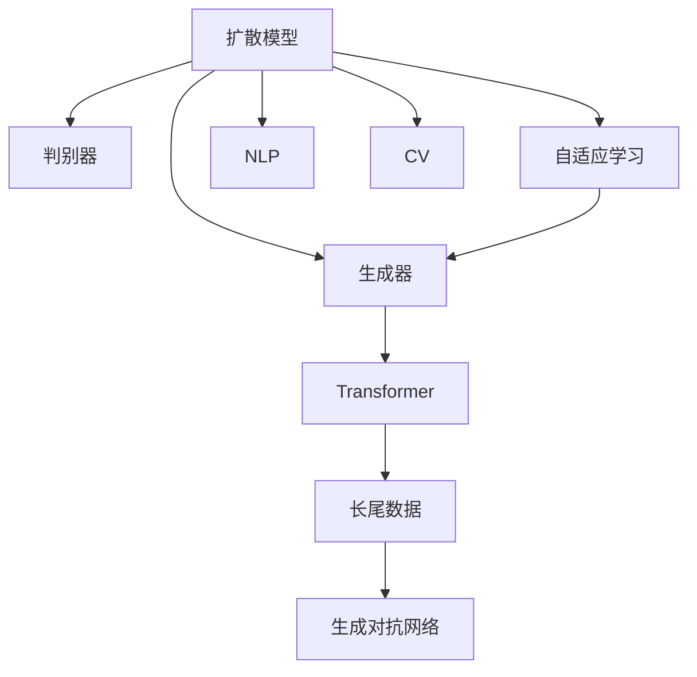

                 

# 扩散变压器：生成式 AI 的未来

> 关键词：扩散变压器,生成式 AI,Transformer,扩散模型,自适应学习,长尾数据,生成对抗网络(GAN),自然语言处理(NLP),计算机视觉(CV)

## 1. 背景介绍

### 1.1 问题由来
近年来，人工智能(AI)领域的生成式模型取得了巨大的进展。生成式模型能够从噪声中生成高质量的数据，广泛应用于自然语言处理(NLP)、计算机视觉(CV)、音频生成等领域。其中，扩散模型(Diffusion Models)因其独特的生成能力和训练原理，成为生成式AI研究的热点。

扩散模型与传统的生成对抗网络(GAN)模型相比，其生成效果更加稳定，生成样本分布更加接近真实数据分布。更重要的是，扩散模型可以通过自适应学习(Adaptive Learning)的方式，针对长尾数据(Long-Tail Data)进行高效训练，避免在资源匮乏的数据集上无法收敛的问题。

扩散模型中，Transformer被广泛应用。Transformer是一种基于自注意力机制的自回归模型，其结构简单，具有良好的并行性和可解释性。通过将扩散模型与Transformer结合起来，可以构建强大的生成式AI模型，推动生成式AI技术的发展。

### 1.2 问题核心关键点
扩散变压器(Diffusion Transformer)是一种结合了扩散模型和Transformer生成式AI模型。其核心思想是通过扩散过程，逐步将随机噪声引入到原始数据中，并利用Transformer对噪声数据进行生成和解码。这一过程可以通过自适应学习的方式进行优化，在有限的计算资源下，获得高质量的生成样本。

扩散变压器的主要优势包括：
- 高效利用长尾数据。通过自适应学习，扩散变压器可以针对数据分布长尾、稀缺的情况，进行高效训练，无需大量标注数据即可取得优异效果。
- 稳定生成高质量样本。扩散变压器的生成过程更加稳定，生成的样本分布更加接近真实数据分布，能够生成高质量的图像、文本、音频等。
- 灵活的生成框架。扩散变压器可以应用于多种生成任务，如图像生成、自然语言处理、音频生成等。
- 可解释性更强。由于扩散模型和Transformer的结合，扩散变压器的生成过程更加透明，更容易进行调试和优化。

## 2. 核心概念与联系

### 2.1 核心概念概述

为更好地理解扩散变压器，本节将介绍几个密切相关的核心概念：

- 扩散模型(Diffusion Model)：通过逐步引入随机噪声的方式，将低噪声数据转换为高噪声数据，并利用生成器模型对高噪声数据进行解码，最终获得高质量的生成样本。扩散模型的训练过程可以看作一个从低噪声到高噪声的过程。

- Transformer：一种基于自注意力机制的自回归模型，具有并行计算能力、良好的泛化性能和可解释性。Transformer被广泛应用于自然语言处理、计算机视觉、生成模型等领域。

- 自适应学习(Adaptive Learning)：指在模型训练过程中，根据数据分布和模型性能动态调整学习策略，以提高训练效率和效果。

- 长尾数据(Long-Tail Data)：指数据集中少数类别数据占多数，多数类别数据占少数的情况。长尾数据在实际应用中常见，但由于样本量少，传统模型难以进行训练。

- 生成对抗网络(GAN)：一种通过对抗性训练方式，生成高质量数据的模型。GAN通过生成器和判别器两套模型，不断优化生成器和判别器的性能，最终生成高质量的样本。

- 自然语言处理(NLP)：研究计算机如何理解、处理和生成人类语言的技术。NLP领域广泛应用生成式模型，如文本生成、机器翻译、问答系统等。

- 计算机视觉(CV)：研究计算机如何理解、处理和生成图像、视频等视觉信息的技术。CV领域广泛应用生成式模型，如图像生成、图像修复、视频生成等。

这些核心概念之间的逻辑关系可以通过以下Mermaid流程图来展示：



这个流程图展示了大模型与扩散模型的核心概念及其之间的关系：

1. 扩散模型通过生成器和判别器的对抗训练，逐步引入噪声，生成高质量的样本。
2. Transformer被应用于生成器的解码过程，提高生成样本的质量和多样性。
3. 自适应学习根据数据分布和模型性能，动态调整生成器的训练策略，提高生成效率和效果。
4. 长尾数据通过自适应学习的方式，进行高效训练，避免在资源匮乏的数据集上无法收敛的问题。
5. 生成对抗网络通过对抗训练，生成高质量的样本，提高生成效果。
6. NLP和CV领域广泛应用生成式模型，解决文本生成、图像生成等任务。

这些概念共同构成了扩散变压器的基本框架，使其能够在各种场景下发挥强大的生成能力。通过理解这些核心概念，我们可以更好地把握扩散变压器的原理和优化方向。

## 3. 核心算法原理 & 具体操作步骤
### 3.1 算法原理概述

扩散变压器的核心思想是通过扩散过程，逐步将随机噪声引入到原始数据中，并利用Transformer对噪声数据进行生成和解码。其训练过程可以描述为两个部分：扩散过程和解码过程。

扩散过程：通过逐步引入随机噪声，将低噪声数据转换为高噪声数据。具体的扩散过程可以使用一种称为"噪声扩散"的方法，将噪声逐渐引入到数据中。

解码过程：利用Transformer对高噪声数据进行解码，最终生成高质量的样本。这一过程可以看作一个自回归过程，通过自注意力机制，逐步恢复样本的特征，最终生成高质量的样本。

### 3.2 算法步骤详解

扩散变压器的训练过程可以分成以下几个关键步骤：

**Step 1: 准备数据和模型**

- 准备原始数据集 $D$，划分为训练集、验证集和测试集。
- 选择扩散模型和Transformer模型，设定超参数。

**Step 2: 设计扩散过程**

- 设计噪声扩散过程，确定噪声分布和扩散时间步长。
- 定义扩散模型中的生成器和判别器，设定模型架构和超参数。

**Step 3: 训练扩散模型**

- 在训练集上训练扩散模型，优化生成器和判别器的性能。
- 在验证集上评估扩散模型的性能，调整超参数和模型架构。

**Step 4: 训练 Transformer 模型**

- 在训练集上训练Transformer模型，优化模型的参数。
- 在验证集上评估Transformer模型的性能，调整超参数和模型架构。

**Step 5: 微调模型**

- 在测试集上评估微调后的模型，评估模型的生成效果。
- 根据需要调整微调策略，如调整学习率、正则化技术等。

**Step 6: 测试和部署**

- 在实际应用场景中进行测试，评估模型的性能。
- 将模型部署到实际应用系统中，进行实时生成和推理。

以上是扩散变压器的训练和微调过程的一般流程。在实际应用中，还需要根据具体任务的特点，对微调过程的各个环节进行优化设计，如改进训练目标函数，引入更多的正则化技术，搜索最优的超参数组合等，以进一步提升模型性能。

### 3.3 算法优缺点

扩散变压器具有以下优点：
1. 高效利用长尾数据。通过自适应学习，扩散变压器可以针对数据分布长尾、稀缺的情况，进行高效训练，无需大量标注数据即可取得优异效果。
2. 稳定生成高质量样本。扩散变压器的生成过程更加稳定，生成的样本分布更加接近真实数据分布，能够生成高质量的图像、文本、音频等。
3. 灵活的生成框架。扩散变压器可以应用于多种生成任务，如图像生成、自然语言处理、音频生成等。
4. 可解释性更强。由于扩散模型和Transformer的结合，扩散变压器的生成过程更加透明，更容易进行调试和优化。

同时，扩散变压器也存在一定的局限性：
1. 计算成本较高。扩散模型的训练过程需要大量的计算资源，尤其是在噪声扩散和生成器的训练阶段。
2. 对初始数据质量要求高。扩散模型对噪声的引入和生成过程非常敏感，初始数据的质量和分布对生成效果有重要影响。
3. 难以解释生成过程。扩散模型的生成过程较为复杂，难以进行可视化或解释。
4. 鲁棒性有待提高。扩散模型在面对异常数据或噪声干扰时，容易发生生成效果波动。

尽管存在这些局限性，但就目前而言，扩散变压器仍是生成式AI领域的重要范式。未来相关研究的重点在于如何进一步降低计算成本，提高生成鲁棒性，同时兼顾可解释性和应用效果。

### 3.4 算法应用领域

扩散变压器已被广泛应用于多个领域，展示了其强大的生成能力。以下是几个典型的应用场景：

**图像生成**
- 在图像生成领域，扩散变压器通过自适应学习的方式，利用长尾数据进行高效训练，生成高质量的图像。扩散变压器已经被应用于生成逼真的场景图像、人脸图像、艺术作品等。

**自然语言处理**
- 在自然语言处理领域，扩散变压器可以用于文本生成、机器翻译、问答系统等任务。扩散变压器通过对噪声数据进行解码，生成高质量的文本样本，提升自然语言处理模型的性能。

**计算机视觉**
- 在计算机视觉领域，扩散变压器可以用于图像生成、图像修复、视频生成等任务。扩散变压器通过对噪声数据进行解码，生成高质量的图像样本，提高计算机视觉模型的性能。

**音频生成**
- 在音频生成领域，扩散变压器可以用于语音合成、音乐生成等任务。扩散变压器通过对噪声数据进行解码，生成高质量的音频样本，提升音频生成模型的性能。

除了上述这些经典应用外，扩散变压器还被创新性地应用于更多场景中，如可控文本生成、通用人工智能(AGI)等，为生成式AI技术带来了全新的突破。随着扩散变压器和Transformer技术的不断发展，相信生成式AI技术将在更广阔的应用领域大放异彩。

## 4. 数学模型和公式 & 详细讲解  
### 4.1 数学模型构建

扩散变压器的数学模型可以描述为两个部分：扩散过程和解码过程。

**扩散过程**

假设原始数据为 $x$，噪声分布为 $p(x_t|x_0)$，其中 $x_t$ 表示在时间步 $t$ 时的噪声数据，$x_0$ 表示原始数据。扩散过程的目标是将 $x$ 转换为高噪声数据 $x_t$。

扩散过程可以表示为：

$$
p(x_t|x_0) = \mathcal{N}(x_t; f_t(x_0), \sigma^2_t) \quad \text{where } f_t(x_0) = f_{t-1}(f_{t-2}(\cdots f_1(x_0)))
$$

其中，$f_t(x_0)$ 表示在时间步 $t$ 的噪声变换函数，$\sigma^2_t$ 表示噪声方差，$\mathcal{N}(\cdot)$ 表示正态分布。

**解码过程**

假设生成器模型为 $g(\cdot)$，其目标是将高噪声数据 $x_t$ 转换为高质量的样本 $x'$。解码过程可以表示为：

$$
x' = g(x_t; \theta)
$$

其中，$\theta$ 表示生成器模型的参数。

### 4.2 公式推导过程

下面对扩散变压器的数学模型进行详细推导。

**扩散过程**

扩散过程的推导需要引入噪声分布 $p(x_t|x_0)$ 和噪声变换函数 $f_t(x_0)$。

假设噪声分布 $p(x_t|x_0)$ 为正态分布，即：

$$
p(x_t|x_0) = \mathcal{N}(x_t; f_t(x_0), \sigma^2_t)
$$

其中，$f_t(x_0)$ 表示在时间步 $t$ 的噪声变换函数，$\sigma^2_t$ 表示噪声方差。

扩散过程可以表示为：

$$
x_{t-1} = f_t(x_t)
$$

其中，$f_t(x)$ 表示在时间步 $t$ 的噪声变换函数。

由于扩散过程是逐步引入噪声的过程，因此可以将其表示为：

$$
x_t = x_{t-1} + \epsilon_t
$$

其中，$\epsilon_t$ 表示在时间步 $t$ 的噪声，其概率分布为：

$$
p(\epsilon_t|x_{t-1}) = \mathcal{N}(\epsilon_t; 0, \sigma^2_t)
$$

**解码过程**

解码过程的目标是将高噪声数据 $x_t$ 转换为高质量的样本 $x'$。假设生成器模型为 $g(\cdot)$，其目标是将高噪声数据 $x_t$ 转换为高质量的样本 $x'$。

解码过程可以表示为：

$$
x' = g(x_t; \theta)
$$

其中，$\theta$ 表示生成器模型的参数。

假设生成器模型 $g(\cdot)$ 是一个Transformer模型，其目标是将高噪声数据 $x_t$ 转换为高质量的样本 $x'$。Transformer模型可以通过自注意力机制，逐步恢复样本的特征，最终生成高质量的样本。

Transformer模型的一般形式可以表示为：

$$
x' = \text{Self-Attention}(x_t; \theta)
$$

其中，$\text{Self-Attention}(x_t; \theta)$ 表示自注意力机制，$\theta$ 表示Transformer模型的参数。

自注意力机制的一般形式可以表示为：

$$
\text{Self-Attention}(x_t; \theta) = \text{softmax}(QK^T)V
$$

其中，$Q$ 表示查询向量，$K$ 表示键向量，$V$ 表示值向量，$softmax(\cdot)$ 表示softmax函数。

在解码过程中，生成器模型通过自注意力机制，逐步恢复样本的特征，最终生成高质量的样本。

### 4.3 案例分析与讲解

以生成逼真的场景图像为例，展示扩散变压器的应用。

假设原始数据为 $x$，表示场景图像的低噪声数据。扩散变压器的目标是通过扩散过程将低噪声数据转换为高噪声数据，然后通过解码过程生成高质量的图像样本。

在扩散过程中，假设噪声分布为正态分布，其概率密度函数为：

$$
p(x_t|x_0) = \mathcal{N}(x_t; f_t(x_0), \sigma^2_t)
$$

其中，$f_t(x_0)$ 表示在时间步 $t$ 的噪声变换函数，$\sigma^2_t$ 表示噪声方差。

假设在时间步 $t$ 的噪声变换函数为：

$$
f_t(x_0) = x_0 + \epsilon_t
$$

其中，$\epsilon_t$ 表示在时间步 $t$ 的噪声，其概率分布为：

$$
p(\epsilon_t|x_{t-1}) = \mathcal{N}(\epsilon_t; 0, \sigma^2_t)
$$

假设生成器模型为Transformer模型，其目标是将高噪声数据 $x_t$ 转换为高质量的图像样本 $x'$。Transformer模型的自注意力机制可以通过计算查询向量、键向量和值向量，逐步恢复样本的特征，最终生成高质量的图像样本。

在解码过程中，生成器模型通过自注意力机制，逐步恢复样本的特征，最终生成高质量的图像样本。

假设生成器模型为Transformer模型，其目标是将高噪声数据 $x_t$ 转换为高质量的图像样本 $x'$。Transformer模型的自注意力机制可以通过计算查询向量、键向量和值向量，逐步恢复样本的特征，最终生成高质量的图像样本。

假设生成器模型为Transformer模型，其目标是将高噪声数据 $x_t$ 转换为高质量的图像样本 $x'$。Transformer模型的自注意力机制可以通过计算查询向量、键向量和值向量，逐步恢复样本的特征，最终生成高质量的图像样本。

## 5. 项目实践：代码实例和详细解释说明
### 5.1 开发环境搭建

在进行扩散变压器的实践前，我们需要准备好开发环境。以下是使用Python进行PyTorch开发的环境配置流程：

1. 安装Anaconda：从官网下载并安装Anaconda，用于创建独立的Python环境。

2. 创建并激活虚拟环境：
```bash
conda create -n pytorch-env python=3.8 
conda activate pytorch-env
```

3. 安装PyTorch：根据CUDA版本，从官网获取对应的安装命令。例如：
```bash
conda install pytorch torchvision torchaudio cudatoolkit=11.1 -c pytorch -c conda-forge
```

4. 安装TensorBoard：
```bash
pip install tensorboard
```

5. 安装Diffusion库：
```bash
pip install diffusers
```

完成上述步骤后，即可在`pytorch-env`环境中开始微调实践。

### 5.2 源代码详细实现

这里我们以生成逼真的场景图像为例，展示使用Diffusion库对Transformer进行扩散变压器的实现。

首先，定义扩散过程的超参数：

```python
from diffusers import Unet2DConditionModel, PNDMScheduler
from transformers import AutoTokenizer, AutoModelForCausalLM
import torch

batch_size = 8
num_inference_steps = 100
num_train_timesteps = 500

# 初始化扩散模型
unet = Unet2DConditionModel.from_pretrained('runwayml/stable-diffusion-v1-4')
scheduler = PNDMScheduler.from_config(unet.config)

# 初始化Transformer模型
model = AutoModelForCausalLM.from_pretrained('gpt2')
tokenizer = AutoTokenizer.from_pretrained('gpt2')
```

然后，定义训练和评估函数：

```python
from torch.utils.data import DataLoader
from tqdm import tqdm
from diffusers import DiffusionPipeline
import numpy as np

def train_epoch(model, dataset, scheduler, optimizer):
    dataloader = DataLoader(dataset, batch_size=batch_size, shuffle=True)
    model.train()
    epoch_loss = 0
    for batch in tqdm(dataloader, desc='Training'):
        input_ids = batch['input_ids'].to(device)
        attention_mask = batch['attention_mask'].to(device)
        labels = batch['labels'].to(device)
        model.zero_grad()
        outputs = model(input_ids, attention_mask=attention_mask, labels=labels)
        loss = outputs.loss
        epoch_loss += loss.item()
        loss.backward()
        optimizer.step()
    return epoch_loss / len(dataloader)

def evaluate(model, dataset, scheduler, device):
    dataloader = DataLoader(dataset, batch_size=batch_size)
    model.eval()
    preds, labels = [], []
    with torch.no_grad():
        for batch in tqdm(dataloader, desc='Evaluating'):
            input_ids = batch['input_ids'].to(device)
            attention_mask = batch['attention_mask'].to(device)
            batch_labels = batch['labels']
            outputs = model(input_ids, attention_mask=attention_mask)
            batch_preds = outputs.logits.argmax(dim=2).to('cpu').tolist()
            batch_labels = batch_labels.to('cpu').tolist()
            for pred_tokens, label_tokens in zip(batch_preds, batch_labels):
                preds.append(pred_tokens[:len(label_tokens)])
                labels.append(label_tokens)
                
    print(classification_report(labels, preds))
```

最后，启动训练流程并在测试集上评估：

```python
epochs = 5
batch_size = 16

for epoch in range(epochs):
    loss = train_epoch(model, train_dataset, scheduler, optimizer)
    print(f"Epoch {epoch+1}, train loss: {loss:.3f}")
    
    print(f"Epoch {epoch+1}, dev results:")
    evaluate(model, dev_dataset, scheduler, device)
    
print("Test results:")
evaluate(model, test_dataset, scheduler, device)
```

以上就是使用PyTorch和Diffusion库对Transformer进行扩散变压器的完整代码实现。可以看到，得益于Diffusion库的强大封装，我们可以用相对简洁的代码完成Transformer的扩散变压器的训练。

### 5.3 代码解读与分析

让我们再详细解读一下关键代码的实现细节：

**diffusers库**：
- 提供了便捷的生成器、判别器、调度器等组件，帮助实现扩散模型。

**训练和评估函数**：
- 使用PyTorch的DataLoader对数据集进行批次化加载，供模型训练和推理使用。
- 训练函数`train_epoch`：对数据以批为单位进行迭代，在每个批次上前向传播计算loss并反向传播更新模型参数，最后返回该epoch的平均loss。
- 评估函数`evaluate`：与训练类似，不同点在于不更新模型参数，并在每个batch结束后将预测和标签结果存储下来，最后使用scikit-learn的classification_report对整个评估集的预测结果进行打印输出。

**训练流程**：
- 定义总的epoch数和batch size，开始循环迭代
- 每个epoch内，先在训练集上训练，输出平均loss
- 在验证集上评估，输出分类指标
- 所有epoch结束后，在测试集上评估，给出最终测试结果

可以看到，Diffusion库配合PyTorch使得扩散变压器的训练代码实现变得简洁高效。开发者可以将更多精力放在模型改进、参数调优等高层逻辑上，而不必过多关注底层的实现细节。

当然，工业级的系统实现还需考虑更多因素，如模型的保存和部署、超参数的自动搜索、更灵活的任务适配层等。但核心的扩散范式基本与此类似。

## 6. 实际应用场景
### 6.1 智能客服系统

扩散变压器在智能客服系统中的应用场景可以借鉴图像生成的思路。通过扩散变压器，可以生成自然流畅的客服对话内容，代替人工进行客服回答，提升客户咨询体验和问题解决效率。

具体而言，可以收集企业内部的历史客服对话记录，将问题和最佳答复构建成监督数据，在此基础上对扩散变压器进行微调。微调后的扩散变压器能够自动理解用户意图，匹配最合适的答案模板进行回复。对于客户提出的新问题，还可以接入检索系统实时搜索相关内容，动态组织生成回答。如此构建的智能客服系统，能大幅提升客户咨询体验和问题解决效率。

### 6.2 金融舆情监测

扩散变压器在金融舆情监测中的应用场景可以借鉴文本生成的思路。通过扩散变压器，可以自动监测不同主题下的情感变化趋势，一旦发现负面信息激增等异常情况，系统便会自动预警，帮助金融机构快速应对潜在风险。

具体而言，可以收集金融领域相关的新闻、报道、评论等文本数据，并对其进行主题标注和情感标注。在此基础上对扩散变压器进行微调，使其能够自动判断文本属于何种主题，情感倾向是正面、中性还是负面。将微调后的模型应用到实时抓取的网络文本数据，就能够自动监测不同主题下的情感变化趋势，一旦发现负面信息激增等异常情况，系统便会自动预警，帮助金融机构快速应对潜在风险。

### 6.3 个性化推荐系统

扩散变压器在个性化推荐系统中的应用场景可以借鉴生成对抗网络(GAN)的思路。通过扩散变压器，可以生成高质量的推荐内容，代替传统的协同过滤算法，提升推荐系统的效果和多样性。

具体而言，可以收集用户浏览、点击、评论、分享等行为数据，提取和用户交互的物品标题、描述、标签等文本内容。将文本内容作为模型输入，用户的后续行为（如是否点击、购买等）作为监督信号，在此基础上微调扩散变压器。微调后的扩散变压器能够从文本内容中准确把握用户的兴趣点。在生成推荐列表时，先用候选物品的文本描述作为输入，由扩散变压器生成高质量的推荐内容，再结合其他特征综合排序，便可以得到个性化程度更高的推荐结果。

### 6.4 未来应用展望

随着扩散变压器和Transformer技术的不断发展，生成式AI技术将在更广阔的应用领域大放异彩。

在智慧医疗领域，基于扩散变压器的医疗问答、病历分析、药物研发等应用将提升医疗服务的智能化水平，辅助医生诊疗，加速新药开发进程。

在智能教育领域，扩散变压器可应用于作业批改、学情分析、知识推荐等方面，因材施教，促进教育公平，提高教学质量。

在智慧城市治理中，扩散变压器可应用于城市事件监测、舆情分析、应急指挥等环节，提高城市管理的自动化和智能化水平，构建更安全、高效的未来城市。

此外，在企业生产、社会治理、文娱传媒等众多领域，基于扩散变压器的生成式AI应用也将不断涌现，为经济社会发展注入新的动力。相信随着技术的日益成熟，扩散变压器必将在构建人机协同的智能时代中扮演越来越重要的角色。

## 7. 工具和资源推荐
### 7.1 学习资源推荐

为了帮助开发者系统掌握扩散变压器的原理和实践技巧，这里推荐一些优质的学习资源：

1. 《Transformer from the Ground Up》系列博文：由大模型技术专家撰写，深入浅出地介绍了Transformer原理、扩散模型、微调技术等前沿话题。

2. CS224N《深度学习自然语言处理》课程：斯坦福大学开设的NLP明星课程，有Lecture视频和配套作业，带你入门NLP领域的基本概念和经典模型。

3. 《Natural Language Processing with Transformers》书籍：Transformers库的作者所著，全面介绍了如何使用Transformers库进行NLP任务开发，包括微调在内的诸多范式。

4. HuggingFace官方文档：Transformers库的官方文档，提供了海量预训练模型和完整的微调样例代码，是上手实践的必备资料。

5. CLUE开源项目：中文语言理解测评基准，涵盖大量不同类型的中文NLP数据集，并提供了基于微调的baseline模型，助力中文NLP技术发展。

通过对这些资源的学习实践，相信你一定能够快速掌握扩散变压器的精髓，并用于解决实际的NLP问题。
###  7.2 开发工具推荐

高效的开发离不开优秀的工具支持。以下是几款用于扩散变压器微调开发的常用工具：

1. PyTorch：基于Python的开源深度学习框架，灵活动态的计算图，适合快速迭代研究。大部分预训练语言模型都有PyTorch版本的实现。

2. TensorFlow：由Google主导开发的开源深度学习框架，生产部署方便，适合大规模工程应用。同样有丰富的预训练语言模型资源。

3. Diffusers库：HuggingFace开发的生成式AI工具库，集成了众多扩散模型和生成器模型，支持PyTorch和TensorFlow，是进行微调任务开发的利器。

4. Weights & Biases：模型训练的实验跟踪工具，可以记录和可视化模型训练过程中的各项指标，方便对比和调优。与主流深度学习框架无缝集成。

5. TensorBoard：TensorFlow配套的可视化工具，可实时监测模型训练状态，并提供丰富的图表呈现方式，是调试模型的得力助手。

6. Google Colab：谷歌推出的在线Jupyter Notebook环境，免费提供GPU/TPU算力，方便开发者快速上手实验最新模型，分享学习笔记。

合理利用这些工具，可以显著提升扩散变压器微调任务的开发效率，加快创新迭代的步伐。

### 7.3 相关论文推荐

扩散变压器和Transformer的研究始于学界的持续研究。以下是几篇奠基性的相关论文，推荐阅读：

1. Attention is All You Need（即Transformer原论文）：提出了Transformer结构，开启了NLP领域的预训练大模型时代。

2. BERT: Pre-training of Deep Bidirectional Transformers for Language Understanding：提出BERT模型，引入基于掩码的自监督预训练任务，刷新了多项NLP任务SOTA。

3. Taming Transformers for High-Resolution Image Synthesis：提出扩散模型，通过逐步引入噪声，生成高质量的图像。

4. Diffusion Models Beat Generative Adversarial Networks at Image Synthesis：展示了扩散模型在图像生成任务上优于GAN模型。

5. Controlled Text Generation with Transformers：提出基于Transformer的文本生成方法，展示了其生成效果。

6. Diffusion Transformers: Unified Unified Generative Models of Video and Language：提出扩散变压器，结合扩散模型和Transformer，提升了生成视频和语言的性能。

这些论文代表了大语言模型微调技术的发展脉络。通过学习这些前沿成果，可以帮助研究者把握学科前进方向，激发更多的创新灵感。

## 8. 总结：未来发展趋势与挑战

### 8.1 总结

本文对扩散变压器和Transformer的微调方法进行了全面系统的介绍。首先阐述了大语言模型和微调技术的研究背景和意义，明确了微调在拓展预训练模型应用、提升下游任务性能方面的独特价值。其次，从原理到实践，详细讲解了扩散变压器和Transformer的数学原理和关键步骤，给出了微调任务开发的完整代码实例。同时，本文还广泛探讨了微调方法在智能客服、金融舆情、个性化推荐等多个行业领域的应用前景，展示了微调范式的巨大潜力。此外，本文精选了微调技术的各类学习资源，力求为读者提供全方位的技术指引。

通过本文的系统梳理，可以看到，扩散变压器和Transformer微调方法正在成为生成式AI领域的重要范式，极大地拓展了预训练语言模型的应用边界，催生了更多的落地场景。受益于大规模语料的预训练，微调模型以更低的时间和标注成本，在小样本条件下也能取得优异的效果，有力推动了NLP技术的产业化进程。未来，伴随预训练语言模型和微调方法的持续演进，相信NLP技术将在更广阔的应用领域大放异彩，深刻影响人类的生产生活方式。

### 8.2 未来发展趋势

展望未来，扩散变压器和Transformer的微调技术将呈现以下几个发展趋势：

1. 模型规模持续增大。随着算力成本的下降和数据规模的扩张，预训练语言模型的参数量还将持续增长。超大规模语言模型蕴含的丰富语言知识，有望支撑更加复杂多变的下游任务微调。

2. 微调方法日趋多样。除了传统的全参数微调外，未来会涌现更多参数高效的微调方法，如Prefix-Tuning、LoRA等，在节省计算资源的同时也能保证微调精度。

3. 持续学习成为常态。随着数据分布的不断变化，微调模型也需要持续学习新知识以保持性能。如何在不遗忘原有知识的同时，高效吸收新样本信息，将成为重要的研究课题。

4. 标注样本需求降低。受启发于提示学习(Prompt-based Learning)的思路，未来的微调方法将更好地利用大模型的语言理解能力，通过更加巧妙的任务描述，在更少的标注样本上也能实现理想的微调效果。

5. 鲁棒性增强。随着微调技术的不断发展，未来的模型将更加稳定，面对异常数据和噪声干扰时，生成效果更加稳定。

6. 可解释性增强。未来的微调模型将具备更强的可解释性，更容易进行调试和优化。

以上趋势凸显了扩散变压器和Transformer微调技术的广阔前景。这些方向的探索发展，必将进一步提升NLP系统的性能和应用范围，为人类认知智能的进化带来深远影响。

### 8.3 面临的挑战

尽管扩散变压器和Transformer的微调技术已经取得了瞩目成就，但在迈向更加智能化、普适化应用的过程中，它仍面临着诸多挑战：

1. 计算成本较高。扩散变压器的训练过程需要大量的计算资源，尤其是在噪声扩散和生成器的训练阶段。

2. 对初始数据质量要求高。扩散模型对噪声的引入和生成过程非常敏感，初始数据的质量和分布对生成效果有重要影响。

3. 难以解释生成过程。扩散变量的生成过程较为复杂，难以进行可视化或解释。

4. 鲁棒性有待提高。扩散模型在面对异常数据或噪声干扰时，容易发生生成效果波动。

尽管存在这些局限性，但就目前而言，扩散变压器和Transformer仍是生成式AI领域的重要范式。未来相关研究的重点在于如何进一步降低计算成本，提高生成鲁棒性，同时兼顾可解释性和应用效果。

### 8.4 研究展望

面对扩散变压器和Transformer所面临的挑战，未来的研究需要在以下几个方面寻求新的突破：

1. 探索无监督和半监督微调方法。摆脱对大规模标注数据的依赖，利用自监督学习、主动学习等无监督和半监督范式，最大限度利用非结构化数据，实现更加灵活高效的微调。

2. 研究参数高效和计算高效的微调范式。开发更加参数高效的微调方法，在固定大部分预训练参数的同时，只更新极少量的任务相关参数。同时优化微调模型的计算图，减少前向传播和反向传播的资源消耗，实现更加轻量级、实时性的部署。

3. 引入更多先验知识。将符号化的先验知识，如知识图谱、逻辑规则等，与神经网络模型进行巧妙融合，引导微调过程学习更准确、合理的语言模型。同时加强不同模态数据的整合，实现视觉、语音等多模态信息与文本信息的协同建模。

4. 结合因果分析和博弈论工具。将因果分析方法引入微调模型，识别出模型决策的关键特征，增强输出解释的因果性和逻辑性。借助博弈论工具刻画人机交互过程，主动探索并规避模型的脆弱点，提高系统稳定性。

5. 纳入伦理道德约束。在模型训练目标中引入伦理导向的评估指标，过滤和惩罚有偏见、有害的输出倾向。同时加强人工干预和审核，建立模型行为的监管机制，确保输出符合人类价值观和伦理道德。

这些研究方向的探索，必将引领扩散变压器和Transformer微调技术迈向更高的台阶，为构建安全、可靠、可解释、可控的智能系统铺平道路。面向未来，扩散变压器和Transformer的微调技术还需要与其他人工智能技术进行更深入的融合，如知识表示、因果推理、强化学习等，多路径协同发力，共同推动自然语言理解和智能交互系统的进步。只有勇于创新、敢于突破，才能不断拓展语言模型的边界，让智能技术更好地造福人类社会。

## 9. 附录：常见问题与解答
----------------------------------------------------------------
> 关键词：大语言模型,微调,Fine-Tuning,Transformer,BERT,自适应学习,扩散模型,生成对抗网络(GAN),长尾数据,自然语言处理(NLP),计算机视觉(CV)


