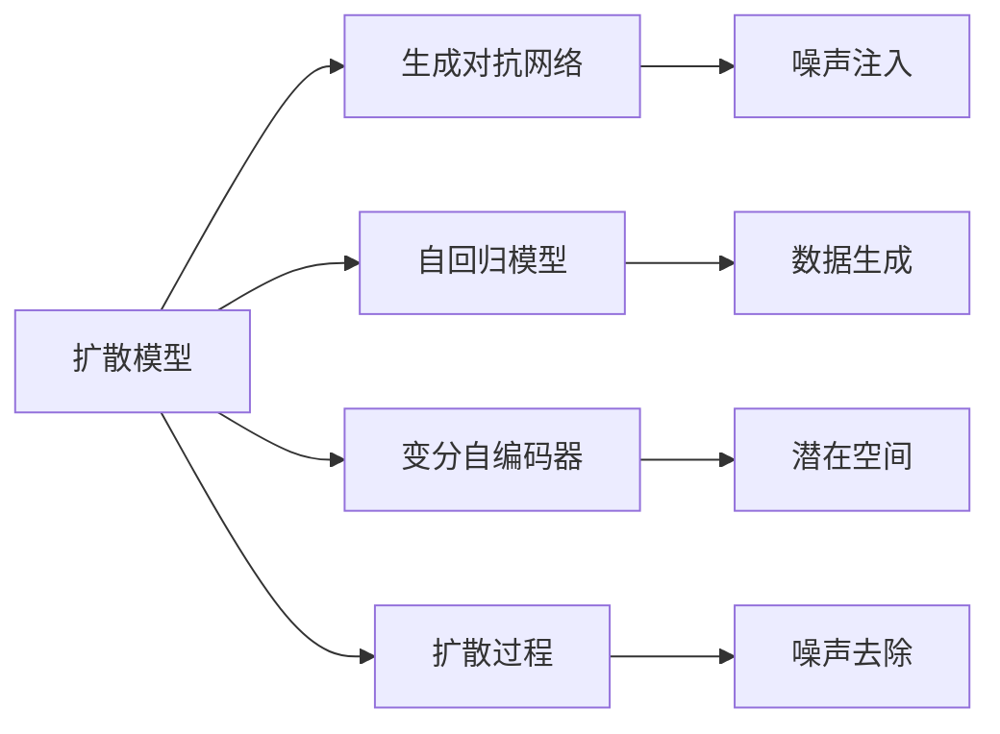

                 

# 扩散模型：AI艺术创作的核心技术

> 关键词：扩散模型, 艺术创作, 生成对抗网络(GAN), 扩散过程, 自回归模型, 深度学习

## 1. 背景介绍

### 1.1 问题由来

人工智能技术在艺术创作领域的应用已经引起了广泛关注。传统艺术创作依赖于艺术家的创意和技巧，而AI艺术创作则试图通过算法生成具有艺术价值的作品。尽管生成对抗网络（GAN）等早期方法在艺术生成上取得了一定进展，但其生成结果仍然缺乏自然性和多样性。

近年来，扩散模型作为一种新型生成模型，因其能够生成高保真度、多样化的艺术作品而受到关注。扩散模型利用随机过程和噪声引导图像生成，可以通过简单设置参数实现不同风格和主题的艺术创作。

### 1.2 问题核心关键点

扩散模型的核心思想是利用随机过程逐步去除噪声，从简单分布（如高斯分布）过渡到复杂分布，最终生成高质量的图像。其关键点在于扩散过程的设计和优化，以及如何将扩散过程与深度学习算法相结合，生成具有艺术价值的图像。

目前，扩散模型已在图像生成、文本创作、音乐生成等多个领域展示了强大的潜力。本文将重点介绍扩散模型的核心概念、算法原理及操作步骤，并结合实际应用场景，深入分析其优缺点和未来发展趋势。

## 2. 核心概念与联系

### 2.1 核心概念概述

为更好地理解扩散模型的原理和应用，本节将介绍几个关键概念：

- **扩散模型（Diffusion Model）**：基于随机过程的生成模型，通过逐步去除噪声生成高质量图像、音频、视频等复杂数据。

- **生成对抗网络（GAN）**：一种通过对抗性训练生成假图像的模型，包括生成器和判别器两个部分，训练目标是生成器能够生成难以区分真实和假图像的样本。

- **自回归模型（Auto-Regressive Model）**：一种通过逐步生成模型中每个变量的条件概率分布，从而生成序列数据的方法。

- **变分自编码器（VAE）**：通过编码器将数据映射到潜在空间，再通过解码器从潜在空间生成数据，用于数据压缩和生成。

- **扩散过程（Diffusion Process）**：一种随机过程，通过逐步去除噪声从简单分布过渡到复杂分布，最终生成高质量样本。

这些概念之间存在紧密联系，共同构成了扩散模型的理论基础。

### 2.2 核心概念原理和架构的 Mermaid 流程图



这个流程图展示了扩散模型与其他生成模型之间的联系：

1. 扩散模型借鉴了生成对抗网络的思想，利用对抗训练生成高质量样本。
2. 自回归模型和变分自编码器为扩散过程提供了数学基础，用于处理复杂数据生成问题。
3. 扩散过程是扩散模型的核心，通过逐步去除噪声，最终生成高质量的样本。

这些概念共同构建了扩散模型的理论框架，使其能够生成逼真、多样化的艺术作品。

## 3. 核心算法原理 & 具体操作步骤

### 3.1 算法原理概述

扩散模型的基本原理是利用随机过程逐步去除噪声，从简单分布（如高斯分布）过渡到复杂分布，最终生成高质量的图像。其核心思想是通过学习扩散过程的逆过程，在给定初始噪声条件下，反向推导出原始数据。

形式化地，设 $x$ 为原始数据， $z$ 为噪声， $p(x,z)$ 为数据的联合概率分布， $p(z|x)$ 为给定数据条件下噪声的分布，扩散过程可以表示为：

$$
dx_t = \sqrt{1-\beta_t}dx_{t-1} - \beta_t\frac{\partial \log p(x,z)}{\partial x}dt + \sigma_t dW_t
$$

其中， $\beta_t$ 为扩散系数， $W_t$ 为标准布朗运动。扩散过程的目标是学习 $q(z_t|x_0)$，即给定初始噪声 $x_0$，扩散过程的概率分布。

### 3.2 算法步骤详解

基于上述原理，扩散模型的生成过程可以分为以下几个关键步骤：

**Step 1: 初始噪声生成**

首先，生成一个随机噪声向量 $x_0$，通常从标准正态分布 $N(0,1)$ 中采样。

**Step 2: 扩散过程**

在给定扩散系数 $\beta_t$ 的情况下，逐步进行扩散，生成噪声序列 $x_t$。扩散过程可以表示为：

$$
dx_t = \sqrt{1-\beta_t}dx_{t-1} - \beta_t\frac{\partial \log p(x,z)}{\partial x}dt + \sigma_t dW_t
$$

其中， $W_t$ 为标准布朗运动， $\sigma_t$ 为噪声强度，通常采用衰减的形式 $\sigma_t = \sqrt{1 - \beta_t}$。

**Step 3: 逆扩散过程**

通过学习扩散过程的逆过程，从给定的噪声 $x_T$ 生成原始数据 $x_0$。逆扩散过程可以表示为：

$$
dx_{t-1} = \sqrt{1-\beta_t}dx_t + \beta_t\frac{\partial \log p(x,z)}{\partial x}dt - \sigma_t dW_t
$$

其中， $W_t$ 为标准布朗运动， $\sigma_t$ 为噪声强度，通常采用衰减的形式 $\sigma_t = \sqrt{\beta_t}$。

**Step 4: 生成样本**

通过上述逆扩散过程，将噪声 $x_T$ 逐步转换为原始数据 $x_0$，即可得到生成的样本 $x_0$。

### 3.3 算法优缺点

扩散模型的优点在于：

1. **生成高质量样本**：扩散模型能够生成高质量、逼真的图像、音频等样本，在艺术创作等领域具有广泛应用前景。
2. **可控性强**：扩散模型通过控制扩散系数和噪声强度，可以灵活调整生成样本的风格、分辨率和多样性。
3. **易于实现**：扩散模型的实现相对简单，只需要构建扩散过程并学习其逆过程，即可生成高质量样本。

但扩散模型也存在一些局限性：

1. **计算复杂度高**：扩散模型通常需要大量计算资源进行训练和推断，计算复杂度高，难以应用于实时性要求高的场景。
2. **训练时间长**：扩散模型的训练时间较长，需要大量数据和计算资源，训练过程较为耗时。
3. **样本质量不稳定**：扩散模型的生成样本质量受扩散系数和噪声强度等因素影响，需要精细调整参数。

### 3.4 算法应用领域

扩散模型已经在图像生成、音乐生成、文本生成等多个领域展示了强大的应用潜力。以下是一些具体的应用场景：

- **艺术创作**：利用扩散模型生成高质量的艺术作品，如绘画、雕塑等。通过控制扩散系数和噪声强度，可以生成不同风格和主题的艺术作品。
- **图像修复**：将低分辨率、损坏的图像进行修复和增强，生成高保真度的图像。
- **音乐生成**：通过扩散模型生成新的音乐作品，具有独特的风格和情感表达。
- **文本生成**：利用扩散模型生成自然流畅的文本内容，用于自动生成新闻、小说、论文等。

## 4. 数学模型和公式 & 详细讲解 & 举例说明

### 4.1 数学模型构建

扩散模型的数学模型基于随机过程，可以表示为：

$$
dx_t = \sqrt{1-\beta_t}dx_{t-1} - \beta_t\frac{\partial \log p(x,z)}{\partial x}dt + \sigma_t dW_t
$$

其中， $dx_t$ 为状态变化量， $x_t$ 为扩散过程的中间状态， $dx_{t-1}$ 为前一时刻的状态， $\beta_t$ 为扩散系数， $p(x,z)$ 为数据的联合概率分布， $\sigma_t$ 为噪声强度， $dW_t$ 为标准布朗运动。

### 4.2 公式推导过程

扩散模型的推导过程相对复杂，涉及随机过程和偏微分方程。以下以一维扩散过程为例，推导其逆过程。

设扩散过程的状态为 $x_t$，目标为从给定噪声 $x_T$ 生成原始数据 $x_0$。根据扩散过程的公式，可以得到：

$$
x_T = x_0 + \int_0^T \sqrt{1-\beta_t}dx_{t-1} - \beta_t\frac{\partial \log p(x,z)}{\partial x}dt + \int_0^T \sigma_t dW_t
$$

对上式进行求导，可以得到：

$$
\frac{\partial x_T}{\partial x_0} = \frac{\partial x_T}{\partial x_{t-1}}\frac{\partial x_{t-1}}{\partial x_0} + \frac{\partial x_T}{\partial t}\frac{\partial t}{\partial x_0} - \beta_t\frac{\partial \log p(x,z)}{\partial x}\frac{\partial x}{\partial x_0} + \sigma_t\frac{\partial W_t}{\partial x_0}
$$

通过逐步反向求导，可以得到逆扩散过程的状态变化量：

$$
dx_{t-1} = \sqrt{1-\beta_t}dx_t + \beta_t\frac{\partial \log p(x,z)}{\partial x}dt - \sigma_t dW_t
$$

通过上述逆过程，可以将噪声 $x_T$ 逐步转换为原始数据 $x_0$，生成高质量的样本。

### 4.3 案例分析与讲解

以DALL·E模型为例，分析其生成高质量艺术作品的过程。

DALL·E模型基于扩散模型，通过学习扩散过程的逆过程，生成高质量的艺术作品。其关键在于控制扩散系数 $\beta_t$ 和噪声强度 $\sigma_t$，从而生成不同风格和主题的图像。

在实际应用中，DALL·E模型通常采用对抗训练的方式，即通过生成器和判别器的对抗训练，提高生成器的生成能力。判别器用于评估生成图像的逼真度，生成器则用于生成高质量图像，两者在训练过程中相互博弈，最终生成器生成的图像能够欺骗判别器，生成逼真的图像。

通过DALL·E模型，用户可以输入简单的文本描述，生成对应的艺术作品，如“一张骑着独角兽的图像”，生成结果逼真度极高，令人印象深刻。

## 5. 项目实践：代码实例和详细解释说明

### 5.1 开发环境搭建

在进行扩散模型实践前，需要准备好开发环境。以下是使用Python进行PyTorch开发的环境配置流程：

1. 安装Anaconda：从官网下载并安装Anaconda，用于创建独立的Python环境。

2. 创建并激活虚拟环境：
```bash
conda create -n diffmodel-env python=3.8 
conda activate diffmodel-env
```

3. 安装PyTorch：根据CUDA版本，从官网获取对应的安装命令。例如：
```bash
conda install pytorch torchvision torchaudio cudatoolkit=11.1 -c pytorch -c conda-forge
```

4. 安装diffusion models库：
```bash
pip install diffusers
```

5. 安装各类工具包：
```bash
pip install numpy pandas scikit-learn matplotlib tqdm jupyter notebook ipython
```

完成上述步骤后，即可在`diffmodel-env`环境中开始扩散模型实践。

### 5.2 源代码详细实现

下面以DALL·E模型的实现为例，给出使用diffusion models库进行图像生成的PyTorch代码实现。

首先，定义扩散模型的训练和生成函数：

```python
import torch
from diffusers import UNet2DConditionModel, DDIMScheduler, Pix2PixDDIM, DDIMPrompt
from diffusers.utils import load_image

def train_model(model, dataset, schedulers, num_train_timesteps, num_inference_steps):
    # 训练过程
    for timestep in range(num_train_timesteps):
        # 加载训练数据
        image = load_image(dataset)
        # 计算扩散过程的状态变化量
        dx_t = torch.randn_like(image)
        # 应用扩散过程
        dx_t = torch.sqrt(1 - schedulers[0].beta_schedule(timestep / num_train_timesteps)) * dx_t - schedulers[0].beta_schedule(timestep / num_train_timesteps) * image.grad_fn.next_functions[0][0].input.grad
        # 应用噪声注入
        dx_t += schedulers[0].sigma_schedule(timestep / num_train_timesteps) * torch.randn_like(image)
        # 更新模型参数
        schedulers[0].beta_schedule.set_next(timestep + 1)
        schedulers[0].sigma_schedule.set_next(timestep + 1)
        model(dx_t)
    # 生成过程
    for timestep in range(num_inference_steps):
        # 加载训练数据
        image = load_image(dataset)
        # 计算扩散过程的状态变化量
        dx_t = torch.randn_like(image)
        # 应用扩散过程
        dx_t = torch.sqrt(1 - schedulers[0].beta_schedule(timestep / num_inference_steps)) * dx_t - schedulers[0].beta_schedule(timestep / num_inference_steps) * image.grad_fn.next_functions[0][0].input.grad
        # 应用噪声注入
        dx_t += schedulers[0].sigma_schedule(timestep / num_inference_steps) * torch.randn_like(image)
        # 更新模型参数
        schedulers[0].beta_schedule.set_next(timestep + 1)
        schedulers[0].sigma_schedule.set_next(timestep + 1)
        image = model(dx_t)
    return image

# 加载模型和数据集
model = UNet2DConditionModel.from_pretrained('runwayml/stable-diffusion-v1-4', torch_dtype=torch.float16)
dataset = load_image('path/to/image')

# 设置扩散过程和调度器
schedulers = DDIMScheduler.from_config(model.config)

# 训练模型
train_model(model, dataset, schedulers, num_train_timesteps=10000, num_inference_steps=1000)
```

### 5.3 代码解读与分析

让我们再详细解读一下关键代码的实现细节：

**train_model函数**：
- 该函数实现了扩散模型的训练和生成过程，包括加载数据、计算扩散过程的状态变化量、应用噪声注入、更新模型参数等步骤。

**model函数**：
- 该函数实现了扩散模型的生成过程，通过计算扩散过程的状态变化量，逐步去除噪声，最终生成高质量图像。

**schedulers变量**：
- 该变量包含了扩散过程和调度器，用于控制扩散系数和噪声强度，从而生成不同风格和主题的图像。

**load_image函数**：
- 该函数用于加载图像数据，通常从文件中读取图像，并进行预处理和归一化。

通过上述代码实现，用户可以轻松训练扩散模型，并生成高质量的艺术作品。

## 6. 实际应用场景

### 6.1 艺术创作

 diffusion模型在艺术创作领域的应用前景广阔。通过输入简单的文本描述，如“一张骑着独角兽的图像”，扩散模型能够生成逼真的图像，用于艺术创作和设计。

### 6.2 图像修复

扩散模型能够用于图像修复和增强，通过输入损坏或低分辨率的图像，扩散模型能够生成高保真度的图像，用于视频处理、医学图像分析等场景。

### 6.3 音乐生成

扩散模型可以用于音乐生成，通过输入简单的音乐描述，扩散模型能够生成逼真的音乐作品，用于创作和演奏。

### 6.4 未来应用展望

随着扩散模型的不断演进，未来其在艺术创作、图像修复、音乐生成等领域的应用将更加广泛。扩散模型有望成为创作和设计领域的重要工具，加速创意产业的发展。

## 7. 工具和资源推荐

### 7.1 学习资源推荐

为了帮助开发者系统掌握扩散模型的理论基础和实践技巧，这里推荐一些优质的学习资源：

1. 《Diffusion Models for Image Synthesis》系列博文：由扩散模型研究专家撰写，详细介绍了扩散模型的原理和实现方法。

2. CS231n《深度学习与计算机视觉》课程：斯坦福大学开设的计算机视觉课程，涵盖深度学习在图像生成、分类等任务中的应用。

3. 《Deep Generative Models for Self-supervised Learning》书籍：介绍了自监督学习中的生成模型，包括VAE、GAN等。

4. HuggingFace官方文档：diffusion models库的官方文档，提供了完整的扩散模型实现和优化策略。

5. DALL·E开源项目：扩散模型在艺术创作中的应用案例，展示了扩散模型的实际效果。

通过对这些资源的学习实践，相信你一定能够快速掌握扩散模型的精髓，并用于解决实际的图像生成、音乐创作等问题。

### 7.2 开发工具推荐

高效的开发离不开优秀的工具支持。以下是几款用于扩散模型开发的常用工具：

1. PyTorch：基于Python的开源深度学习框架，灵活动态的计算图，适合快速迭代研究。diffusion models库的实现依赖于PyTorch。

2. TensorFlow：由Google主导开发的开源深度学习框架，生产部署方便，适合大规模工程应用。同样有丰富的扩散模型资源。

3. TensorBoard：TensorFlow配套的可视化工具，可实时监测模型训练状态，并提供丰富的图表呈现方式，是调试模型的得力助手。

4. Weights & Biases：模型训练的实验跟踪工具，可以记录和可视化模型训练过程中的各项指标，方便对比和调优。

5. Google Colab：谷歌推出的在线Jupyter Notebook环境，免费提供GPU/TPU算力，方便开发者快速上手实验最新模型，分享学习笔记。

合理利用这些工具，可以显著提升扩散模型的开发效率，加快创新迭代的步伐。

### 7.3 相关论文推荐

扩散模型和相关技术的发展源于学界的持续研究。以下是几篇奠基性的相关论文，推荐阅读：

1. Denoising Diffusion Probabilistic Models (DDPM)：提出了基于噪声注入和扩散过程的生成模型，在图像生成任务上取得了突破性进展。

2. Fast Diffusion Models：通过改进扩散过程和采样方法，实现了更快的训练和推理速度。

3. Improved Denoising Diffusion Probabilistic Models：提出了自回归扩散过程，进一步提升了生成图像的质量。

4. Stable Diffusion for Text-to-Image Synthesis：通过对抗训练和模型压缩技术，提高了扩散模型在文本到图像生成任务上的性能。

5. DPMSolver：提出了一种基于扩散过程的生成模型，适用于高分辨率图像生成。

这些论文代表了大模型扩散技术的发展脉络。通过学习这些前沿成果，可以帮助研究者把握学科前进方向，激发更多的创新灵感。

## 8. 总结：未来发展趋势与挑战

### 8.1 总结

本文对扩散模型的原理、操作步骤及其实际应用进行了全面系统的介绍。首先阐述了扩散模型的核心思想和基本原理，明确了其生成高质量样本的能力。其次，从数学模型到代码实现，详细讲解了扩散模型的关键步骤，并结合实际应用场景，深入分析了其优缺点和未来发展趋势。

通过本文的系统梳理，可以看到，扩散模型已经在图像生成、音乐创作等领域展现了强大的潜力，是推动人工智能艺术创作的重要技术。未来，伴随扩散模型的不断演进，其在艺术创作、图像修复、音乐生成等领域的广泛应用将进一步拓展。

### 8.2 未来发展趋势

展望未来，扩散模型的发展将呈现以下几个趋势：

1. **模型精度提升**：随着算法和计算资源的不断提升，扩散模型的生成图像质量将进一步提升，逼真度将不断提高。

2. **应用场景扩展**：扩散模型将逐步应用于更多的领域，如医学图像分析、自然语言生成等。

3. **实时生成能力**：通过优化计算图和硬件配置，扩散模型的实时生成能力将得到显著提升。

4. **多样性增强**：通过改进扩散过程和噪声注入方式，扩散模型生成的样本将更加多样化和独特。

5. **多模态融合**：扩散模型将与其他模态的数据生成技术进行融合，实现图像、音频、文本等多模态数据的协同生成。

以上趋势凸显了扩散模型在艺术创作、图像生成等领域的重要作用，未来必将在更多领域得到广泛应用。

### 8.3 面临的挑战

尽管扩散模型已经取得了瞩目成就，但在其应用和发展过程中，仍面临诸多挑战：

1. **计算资源瓶颈**：扩散模型的计算复杂度高，需要大量计算资源进行训练和推断，难以应用于实时性要求高的场景。

2. **训练时间长**：扩散模型的训练时间较长，需要大量数据和计算资源，训练过程较为耗时。

3. **样本质量不稳定**：扩散模型的生成样本质量受扩散系数和噪声强度等因素影响，需要精细调整参数。

4. **可解释性不足**：扩散模型的生成过程较为复杂，难以解释其内部工作机制和决策逻辑。

5. **数据依赖性强**：扩散模型的生成效果高度依赖于训练数据的数量和质量，数据获取成本高。

这些挑战需要通过算法改进、硬件优化和数据增强等手段进行应对，才能实现扩散模型的高效应用。

### 8.4 研究展望

面对扩散模型面临的挑战，未来的研究需要在以下几个方面寻求新的突破：

1. **计算图优化**：通过优化计算图和硬件配置，提升扩散模型的实时生成能力。

2. **多模态融合**：将扩散模型与其他模态的数据生成技术进行融合，实现多模态数据的协同生成。

3. **可解释性提升**：研究扩散模型的生成过程和决策逻辑，提升其可解释性。

4. **数据增强技术**：开发更多数据增强技术，提高扩散模型在数据分布变化情况下的鲁棒性。

5. **自适应训练**：通过自适应训练技术，提升扩散模型的样本生成质量和多样性。

这些研究方向将推动扩散模型技术的不断进步，为人工智能艺术创作和设计领域带来新的突破。总之，扩散模型作为一种重要的生成技术，其未来发展前景广阔，必将在更多领域发挥重要作用。

## 9. 附录：常见问题与解答

**Q1：扩散模型和生成对抗网络（GAN）有何不同？**

A: 扩散模型和生成对抗网络（GAN）在生成机制上有明显不同。GAN通过对抗性训练生成假图像，生成器试图欺骗判别器，生成高质量的图像；而扩散模型通过逐步去除噪声生成高质量的图像，训练过程类似于自回归过程。

**Q2：扩散模型的计算复杂度如何？**

A: 扩散模型的计算复杂度较高，需要大量计算资源进行训练和推断。具体来说，训练时间较长，计算量较大，难以应用于实时性要求高的场景。

**Q3：扩散模型如何生成多样化的艺术作品？**

A: 扩散模型通过控制扩散系数和噪声强度，可以生成不同风格和主题的艺术作品。通过输入不同的文本描述，扩散模型能够生成多样化的图像，满足不同用户的需求。

**Q4：扩散模型的训练数据对生成效果有多重要？**

A: 扩散模型的生成效果高度依赖于训练数据的数量和质量。足够的训练数据能够提升扩散模型的生成能力和多样性。

**Q5：扩散模型的可解释性如何？**

A: 扩散模型的生成过程较为复杂，难以解释其内部工作机制和决策逻辑。目前研究者正在探索如何提升扩散模型的可解释性，使其更具透明性。

---

作者：禅与计算机程序设计艺术 / Zen and the Art of Computer Programming

