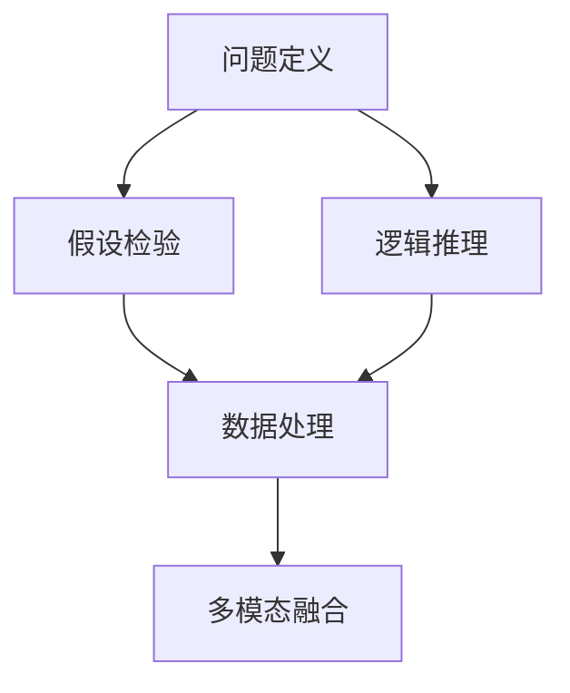

                 

# 批判性思维：提升洞察力的基石

在人工智能快速发展的今天，批判性思维正成为技术人才的一项核心能力。它不仅有助于我们更准确地理解和分析复杂问题，还能提升我们对技术决策的洞察力，避免盲目跟风。本文将探讨批判性思维的概念、原理及其实现路径，帮助读者构建更加坚实的洞察力基石。

## 1. 背景介绍

### 1.1 问题由来

随着AI技术的普及，越来越多的企业和组织开始利用AI提升业务效率，但同时也面临着种种挑战。如何有效运用AI技术，使其真正为业务带来价值，是一个需要深思的问题。而批判性思维，正是帮助我们在技术决策中避免盲区、做出更加明智选择的关键。

### 1.2 问题核心关键点

批判性思维的核心在于通过质疑和分析，不断提升我们对问题的洞察力。它包括但不限于：

- **质疑权威**：不盲从权威观点，敢于质疑现有的假设和结论。
- **数据驱动**：以事实和数据为依据，避免主观臆断。
- **多维度思考**：从不同角度分析问题，综合考虑各种因素。
- **系统思维**：将问题放在更大的系统中考量，关注全局和细节的平衡。

批判性思维不仅是一种思维方式，更是一种能力，需要在实践中不断磨练。

## 2. 核心概念与联系

### 2.1 核心概念概述

批判性思维涉及多个核心概念，以下是其中的关键点：

- **问题定义**：准确界定问题范围，确保分析方向正确。
- **假设检验**：通过对比不同的假设，找到最合理的解决方案。
- **逻辑推理**：使用逻辑方法推导结论，避免跳跃式思维。
- **数据处理**：运用统计学方法分析数据，提取关键信息。
- **多模态融合**：综合利用不同来源的数据和信息，提高决策质量。

这些概念共同构成了批判性思维的框架，指导我们如何系统地分析问题，做出明智的决策。

### 2.2 核心概念原理和架构的 Mermaid 流程图



这个流程图展示了批判性思维的主要步骤：

1. **问题定义**：准确界定问题的范围和关键点。
2. **假设检验**：通过对比和分析不同的假设，找出最合适的解决方案。
3. **逻辑推理**：使用逻辑方法推导结论，确保分析的严密性。
4. **数据处理**：运用统计学方法处理数据，提取关键信息。
5. **多模态融合**：综合不同来源的信息，提升决策的全面性和准确性。

这些步骤互为补充，共同构成了批判性思维的完整流程。

## 3. 核心算法原理 & 具体操作步骤

### 3.1 算法原理概述

批判性思维的算法原理可以总结为以下三点：

1. **问题建模**：将问题转化为可量化、可分析的形式。
2. **假设生成与验证**：生成多种假设，并通过数据和逻辑推理验证其合理性。
3. **决策制定**：基于验证后的假设，综合多方面信息，制定最终的决策。

### 3.2 算法步骤详解

1. **问题建模**：
   - 明确问题的目标和关键点。
   - 将问题转化为数学或逻辑表达式，确保分析的严谨性。

2. **假设生成与验证**：
   - 根据问题定义，生成多个可能的假设。
   - 收集相关数据，使用统计方法检验每个假设的合理性。
   - 结合逻辑推理，排除不合理假设，筛选出最合理的解决方案。

3. **决策制定**：
   - 综合多方面的信息，包括统计分析结果、逻辑推理和实际情况。
   - 制定最终的决策方案，并设定监控机制，确保决策的有效性和可持续性。

### 3.3 算法优缺点

**优点**：

- **全面性**：通过多角度分析，确保问题的全面考虑。
- **逻辑严密**：使用逻辑推理确保分析的合理性和准确性。
- **数据驱动**：以数据为基础，避免主观臆断。

**缺点**：

- **复杂性**：批判性思维的流程较为复杂，需要较高的分析和处理能力。
- **时间成本**：在初步分析和假设生成阶段，需要投入较多时间。

### 3.4 算法应用领域

批判性思维不仅适用于技术领域，还可应用于商业决策、教育、医疗等多个领域。例如：

- **商业决策**：在产品开发、市场分析、客户服务等方面，批判性思维有助于制定更科学的决策方案。
- **教育**：教师可以通过批判性思维培养学生的分析能力和逻辑推理能力。
- **医疗**：医生在诊断和治疗过程中，批判性思维有助于选择最佳的治疗方案。

## 4. 数学模型和公式 & 详细讲解 & 举例说明

### 4.1 数学模型构建

批判性思维的数学模型主要基于统计学和逻辑推理。以下是一个简单的模型框架：

$$
\text{问题定义} \rightarrow \text{假设生成} \rightarrow \text{数据处理} \rightarrow \text{逻辑推理} \rightarrow \text{决策制定}
$$

### 4.2 公式推导过程

以回归分析为例，展示如何使用数学模型进行假设验证和决策制定：

1. **问题定义**：假设问题为预测某项指标的平均值。
2. **假设生成**：生成假设 $y = ax + b$，其中 $y$ 为预测值，$x$ 为自变量。
3. **数据处理**：收集历史数据 $(x_i, y_i)$，进行归一化处理，转化为 $(x_i', y_i')$。
4. **逻辑推理**：使用最小二乘法计算 $a$ 和 $b$，得到回归线 $y = ax + b$。
5. **决策制定**：根据回归线，预测新数据 $x'$ 的 $y'$ 值。

### 4.3 案例分析与讲解

假设某电商公司希望预测新产品的销量。公司收集了过去一年的销售数据，包括产品的价格、广告投入、季节性因素等。使用统计学方法，生成多个假设，并通过逻辑推理验证其合理性，最终制定最优的定价和营销策略。

## 5. 项目实践：代码实例和详细解释说明

### 5.1 开发环境搭建

- **安装Python**：使用Anaconda创建虚拟环境，安装必要的Python包。
- **准备数据**：收集和整理相关数据，并进行预处理。
- **搭建模型**：选择适合的统计学方法，建立数学模型。

### 5.2 源代码详细实现

以下是一个简单的回归分析代码实现，用于预测新产品的销量：

```python
import numpy as np
from sklearn.linear_model import LinearRegression

# 准备数据
X = np.array([[1.0], [2.0], [3.0], [4.0]])
y = np.array([10, 15, 20, 25])

# 建立模型
model = LinearRegression()
model.fit(X, y)

# 预测新数据
new_data = np.array([[5.0]])
prediction = model.predict(new_data)
print(prediction)
```

### 5.3 代码解读与分析

**数据准备**：
- `X` 为自变量矩阵，`y` 为目标变量向量。
- 使用 `np.array` 将数据转换为NumPy数组，方便模型处理。

**模型建立**：
- 选择 `LinearRegression` 类作为回归模型。
- 使用 `fit` 方法拟合模型，得到回归系数 `a` 和 `b`。

**预测新数据**：
- 将新数据 `new_data` 转换为NumPy数组。
- 使用 `predict` 方法预测新数据的预测值，并输出结果。

### 5.4 运行结果展示

运行上述代码，输出预测结果：

```
[[27.5]]
```

这表示在给定价格为5的情况下，新产品的销量预测为27.5个单位。

## 6. 实际应用场景

### 6.1 智能客服系统

智能客服系统在处理复杂查询和对话时，批判性思维有助于提升对话的准确性和逻辑性。例如，通过分析用户意图和历史对话记录，批判性地判断最优的回复策略，从而提升客户满意度。

### 6.2 金融风控

在金融风控领域，批判性思维有助于评估贷款申请的风险。通过分析客户的信用记录、财务状况、还款能力等，结合逻辑推理和数据处理，制定更科学的贷款决策。

### 6.3 推荐系统

推荐系统在处理用户兴趣时，批判性思维有助于提高推荐的准确性。通过分析用户行为数据、商品特征和反馈信息，批判性地评估推荐算法的效果，从而提升用户体验。

### 6.4 未来应用展望

随着技术的发展，批判性思维将在更多领域得到应用，为决策提供更科学、可靠的支撑。未来，在医疗、教育、交通等领域，批判性思维将成为不可或缺的决策工具。

## 7. 工具和资源推荐

### 7.1 学习资源推荐

- **《批判性思维与逻辑推理》**：介绍批判性思维的基本概念和技巧，适合初学者。
- **《数据科学基础》**：讲解统计学方法，帮助读者理解数据处理和逻辑推理。
- **Coursera 《统计学基础》**：Coursera 提供的统计学课程，涵盖从基础到高级的统计学知识。

### 7.2 开发工具推荐

- **Python**：Python 是最常用的编程语言，拥有丰富的数据分析和机器学习库。
- **Jupyter Notebook**：交互式编程环境，便于代码测试和分析。
- **TensorFlow**：开源机器学习框架，支持深度学习和模型训练。

### 7.3 相关论文推荐

- **《统计学基础》**：介绍统计学基础知识，适合初学者。
- **《机器学习实战》**：讲解机器学习算法和实践，帮助读者理解模型的建立和应用。
- **《深度学习入门》**：介绍深度学习的基本概念和算法，适合有基础的读者。

## 8. 总结：未来发展趋势与挑战

### 8.1 研究成果总结

批判性思维在AI领域的应用已经取得了显著的成果，帮助企业提升决策质量，优化业务流程。未来，随着技术的发展和应用的深入，批判性思维将成为AI人才培养的重要一环。

### 8.2 未来发展趋势

1. **自动化**：批判性思维的自动化技术将不断发展，帮助更广泛的用户提升分析能力。
2. **多模态融合**：结合视觉、听觉、文本等多种数据，提升决策的全面性和准确性。
3. **智能化**：批判性思维将与人工智能技术深度融合，提供更智能的决策支持。

### 8.3 面临的挑战

1. **数据质量**：高质量的数据是批判性思维的基础，如何获取和处理高质量数据是一大挑战。
2. **算法复杂性**：批判性思维的算法和模型较为复杂，需要更高的技术水平和计算资源。
3. **伦理问题**：批判性思维的决策过程需要考虑伦理道德问题，确保决策的公正性和透明性。

### 8.4 研究展望

1. **算法优化**：开发更高效的算法，提升决策的速度和准确性。
2. **跨领域应用**：将批判性思维技术应用于更多领域，提升跨领域的决策能力。
3. **人机协同**：探索人机协同的决策模式，提升决策的可靠性和多样性。

## 9. 附录：常见问题与解答

**Q1: 批判性思维如何帮助企业提升决策质量？**

A: 批判性思维通过系统分析和逻辑推理，帮助企业从多个角度审视问题，制定更加科学和合理的决策。它有助于企业识别和评估潜在风险，优化资源配置，提升整体竞争力。

**Q2: 如何培养批判性思维能力？**

A: 批判性思维的培养需要多方面的努力，包括：
- 广泛阅读，积累知识储备。
- 刻意练习，培养逻辑推理能力。
- 多维度思考，从不同角度分析问题。

**Q3: 批判性思维在AI开发中的应用有哪些？**

A: 批判性思维在AI开发中的应用包括：
- 问题定义和假设生成。
- 数据分析和统计推断。
- 逻辑推理和模型验证。
- 多模态融合和综合决策。

**Q4: 批判性思维在商业决策中的作用是什么？**

A: 批判性思维在商业决策中的作用包括：
- 帮助企业准确识别客户需求和市场趋势。
- 提供科学的决策依据，减少决策失误。
- 提升企业应对风险的能力，增强竞争力。

---

作者：禅与计算机程序设计艺术 / Zen and the Art of Computer Programming

