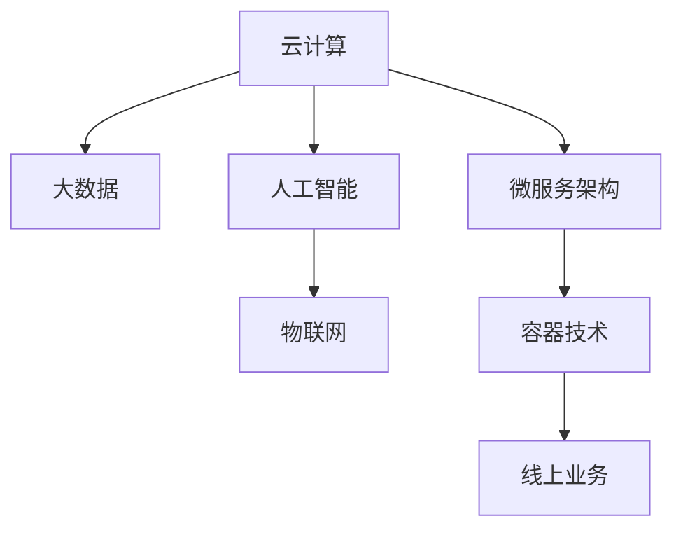

                 

## 1. 背景介绍

### 1.1 问题由来

随着互联网技术的不断进步，尤其是云计算和物联网的发展，越来越多的业务和服务开始从线下转到线上。这种转变不仅极大地提高了效率和便捷性，还带来了新的挑战和机遇。

从商业角度来看，线上转型可以扩大企业的市场范围，降低运营成本，增加收入渠道。例如，电商企业通过线上销售平台，可以迅速扩展到全国乃至全球市场，而不必开设实体门店。服务型企业可以通过线上服务，打破时间和空间的限制，提高服务质量和用户满意度。

从技术角度来看，线上转型要求企业和机构重新思考其IT架构和业务流程。云计算、大数据、人工智能等新技术的应用，成为推动企业线上转型的重要驱动力。企业必须构建灵活、可扩展的IT系统，以便随时应对市场变化和技术进步。

然而，线上转型并不是一蹴而就的过程，涉及到业务模式、技术架构、组织管理等多方面的变革。企业在推进线上转型的过程中，必须考虑数据安全、系统稳定、用户体验等多个因素，确保转型过程平稳顺利。

### 1.2 问题核心关键点

从线下到线上转变过程中，以下几个核心关键点需要重点关注：

1. **数据迁移和管理**：线上业务高度依赖数据，如何确保数据安全、及时迁移和高效管理是首要问题。
2. **系统架构设计**：线上业务需要具备高度的扩展性和弹性，系统架构必须能够支持高并发、大流量。
3. **用户体验优化**：线上服务需要提供无缝的用户体验，必须考虑网页设计、用户界面、交互流程等多个方面。
4. **安全性和隐私保护**：线上业务涉及大量敏感数据，必须采取严格的安全措施，保护用户隐私和数据安全。
5. **业务流程整合**：线上线下业务流程的整合是线上转型的核心挑战，必须建立统一的数据标准和业务流程。
6. **运营和维护**：线上系统的运维要求较高，必须建立有效的运维体系和团队，确保系统稳定运行。

## 2. 核心概念与联系

### 2.1 核心概念概述

为更好地理解从线下到线上转变的技术过程，本节将介绍几个密切相关的核心概念：

- **云计算(Cloud Computing)**：指通过网络提供计算资源和服务的模式，能够按需扩展和弹性伸缩，是线上业务的核心技术基础。
- **大数据(Big Data)**：指处理和分析海量数据的能力，能够支持线上业务的数据分析和决策支持。
- **人工智能(AI)**：指通过机器学习和深度学习技术，赋予机器理解和处理复杂任务的能力，能够提供智能化的线上服务。
- **物联网(IoT)**：指通过传感器和网络连接，实现物理世界的数字化，能够提供线上业务与物理世界的无缝连接。
- **微服务架构(Microservices Architecture)**：指将大型应用拆分为多个小型服务，每个服务独立部署和扩展，支持线上业务的高效运维和管理。
- **容器技术(Container Technology)**：指通过容器技术封装应用，支持快速部署、弹性扩展和高效管理，是线上业务的重要支撑。

这些核心概念之间的逻辑关系可以通过以下Mermaid流程图来展示：



这个流程图展示了几大核心概念之间的联系：

1. 云计算提供基础设施和计算能力，支撑线上业务的运行。
2. 大数据处理和分析海量数据，为线上业务提供决策支持。
3. 人工智能提升线上服务的智能化水平，支持业务创新和优化。
4. 物联网实现线上业务与物理世界的连接，拓展业务边界。
5. 微服务架构提升线上业务的灵活性和扩展性，支持快速迭代和优化。
6. 容器技术封装和部署应用，支持线上业务的快速部署和高效管理。

这些概念共同构成了线上业务的技术基础，支撑着从线下到线上的转变过程。

## 3. 核心算法原理 & 具体操作步骤

### 3.1 算法原理概述

从线下到线上转变的核心算法原理，主要是围绕云计算、大数据、人工智能等技术，通过数据迁移、系统架构设计、业务流程整合等手段，实现线上业务的构建和运营。

云计算提供基础设施和计算能力，能够支持海量数据的存储和处理。大数据技术可以对海量数据进行分析和挖掘，提供决策支持和业务洞察。人工智能技术可以通过机器学习和深度学习，实现业务智能化和自动化。

具体而言，线上业务的构建和运营可以分为以下几个步骤：

1. **数据迁移**：将线下业务的数据迁移到云端，通过数据仓库和大数据平台进行存储和处理。
2. **系统架构设计**：采用微服务架构和容器技术，设计灵活、可扩展的系统架构，支持高并发和大流量。
3. **业务流程整合**：建立统一的数据标准和业务流程，实现线上线下业务的整合。
4. **用户体验优化**：通过网页设计、用户界面、交互流程等手段，提供无缝的用户体验。
5. **安全性和隐私保护**：采用严格的安全措施，保护用户隐私和数据安全。
6. **运营和维护**：建立高效的运维体系和团队，确保系统稳定运行。

### 3.2 算法步骤详解

从线下到线上转变的具体算法步骤如下：

**Step 1: 数据迁移**

- 选择合适的云服务提供商，如AWS、阿里云、腾讯云等，签订SLA（服务水平协议），确保服务质量。
- 评估线下数据的规模和复杂性，制定数据迁移策略，选择合适的迁移工具和技术。
- 迁移过程中，确保数据完整性、一致性和安全性，避免数据丢失和损坏。
- 迁移完成后，对数据进行验证和备份，确保数据可用性和可靠性。

**Step 2: 系统架构设计**

- 采用微服务架构，将应用拆分为多个小型服务，每个服务独立部署和扩展。
- 使用容器技术，如Docker、Kubernetes等，封装和部署应用，支持快速部署和弹性扩展。
- 设计分布式系统，采用负载均衡、故障转移等技术，确保系统高可用性和高可靠性。
- 设计数据存储和处理架构，采用关系型数据库、NoSQL数据库、大数据平台等，支持数据管理和分析。

**Step 3: 业务流程整合**

- 建立统一的数据标准和业务流程，确保线上线下业务的一致性。
- 采用API接口、消息队列等技术，实现不同系统之间的数据交互和业务协同。
- 设计并实现统一的用户认证和授权机制，确保业务安全性和隐私保护。

**Step 4: 用户体验优化**

- 设计符合用户习惯和业务逻辑的网页和用户界面，提高用户体验。
- 优化交互流程和操作路径，减少用户操作负担和时间。
- 进行用户测试和反馈收集，持续改进用户体验。

**Step 5: 安全性和隐私保护**

- 采用加密技术，如SSL/TLS、AES等，保护数据传输和存储的安全性。
- 采用身份认证和授权机制，保护用户隐私和数据安全。
- 定期进行安全漏洞扫描和风险评估，及时发现和修复安全问题。

**Step 6: 运营和维护**

- 建立高效的运维体系，包括监控、告警、故障处理等机制。
- 设计并实现自动化运维工具，如CI/CD、A/B测试等，提高运维效率和稳定性。
- 建立应急预案和灾备机制，确保系统在故障发生时能够快速恢复。

### 3.3 算法优缺点

从线下到线上转变的算法具有以下优点：

1. **灵活性和扩展性**：微服务架构和容器技术能够支持灵活的业务扩展和快速迭代，满足企业快速增长的需求。
2. **高效性和稳定性**：云计算和分布式系统能够提供高效的基础设施和可靠的系统架构，确保线上业务的稳定运行。
3. **数据驱动和智能化**：大数据和人工智能技术能够提供数据驱动的决策支持和业务优化，提升业务智能化水平。
4. **用户体验和市场拓展**：线上业务能够突破时间和空间的限制，提供无缝的用户体验，拓展市场范围。

同时，该算法也存在以下缺点：

1. **数据迁移复杂**：数据迁移过程复杂且易出错，需要谨慎规划和执行。
2. **系统集成困难**：线上业务需要与多个系统和模块进行集成，系统复杂度较高。
3. **安全性风险**：线上业务涉及大量敏感数据，需要严格的安全措施，防止数据泄露和攻击。
4. **运营成本高**：线上业务需要持续的运维和优化，运营成本较高。

尽管存在这些局限性，但就目前而言，从线下到线上转变的算法仍然是企业数字化转型的重要方向。未来相关研究的重点在于如何进一步降低迁移和集成成本，提高系统的安全性，优化运营效率。

### 3.4 算法应用领域

从线下到线上转变的算法，在多个领域得到了广泛的应用：

- **电商行业**：电商平台通过线上平台，实现商品的在线销售和物流配送，提升用户体验和运营效率。
- **金融行业**：金融企业通过线上平台，提供金融产品和服务，实现风险控制和业务创新。
- **医疗行业**：医疗机构通过线上平台，提供远程诊疗和健康管理服务，提升医疗服务的覆盖面和效率。
- **教育行业**：教育机构通过线上平台，提供远程教育和培训服务，拓展教育资源的覆盖面。
- **媒体行业**：媒体企业通过线上平台，提供新闻资讯、视频娱乐等服务，实现内容分发和品牌推广。
- **物流行业**：物流公司通过线上平台，实现货物的运输管理和调度，提升物流效率和客户满意度。

除了上述这些经典应用外，线上平台还在更多领域得到了创新性的应用，如智能家居、智慧城市、智能制造等，为数字化社会带来了新的发展机遇。

## 4. 数学模型和公式 & 详细讲解 & 举例说明

### 4.1 数学模型构建

本节将使用数学语言对从线下到线上转变的技术过程进行更加严格的刻画。

假设线下业务的数据量为 $D$，线上业务的数据量为 $D'$。线上业务的数据迁移过程可以表示为：

$$
D' = f(D, \text{迁移策略}, \text{迁移工具})
$$

其中，$f$ 表示数据迁移函数，包括数据选择、转换、传输等多个步骤。

系统架构设计可以表示为：

$$
\text{架构} = g(\text{业务需求}, \text{技术栈}, \text{系统架构模式})
$$

其中，$g$ 表示系统架构设计函数，包括服务拆分、容器封装、负载均衡等多个步骤。

业务流程整合可以表示为：

$$
\text{流程} = h(\text{线下流程}, \text{线上流程}, \text{集成方式})
$$

其中，$h$ 表示业务流程整合函数，包括数据标准、业务逻辑、API接口等多个步骤。

用户体验优化可以表示为：

$$
\text{体验} = k(\text{用户需求}, \text{设计规范}, \text{交互模型})
$$

其中，$k$ 表示用户体验优化函数，包括网页设计、用户界面、交互流程等多个步骤。

安全性和隐私保护可以表示为：

$$
\text{安全} = l(\text{数据类型}, \text{安全策略}, \text{安全技术})
$$

其中，$l$ 表示安全性和隐私保护函数，包括加密技术、身份认证、风险评估等多个步骤。

运营和维护可以表示为：

$$
\text{运维} = m(\text{系统架构}, \text{监控工具}, \text{故障处理机制})
$$

其中，$m$ 表示运营和维护函数，包括监控、告警、故障处理等多个步骤。

### 4.2 公式推导过程

以下我们以电商行业为例，推导数据迁移的数学模型。

假设线下业务的数据量为 $D$，线上业务的数据量为 $D'$，迁移策略为 $S$，迁移工具为 $T$。迁移过程可以表示为：

$$
D' = f(D, S, T)
$$

在电商行业的数据迁移中，迁移策略可能包括数据选择、数据格式转换、数据传输等步骤。迁移工具可能包括AWS S3、阿里云OSS等云存储服务，以及ETL工具如Apache Nifi、Talend等。

具体的迁移步骤包括：

1. **数据选择**：根据业务需求，选择需要迁移的数据集。例如，对于电商业务，可能需要迁移商品信息、订单信息、用户信息等。

2. **数据格式转换**：将线下数据转换为线上数据格式，例如将SQL数据转换为JSON格式，便于线上存储和处理。

3. **数据传输**：将转换后的数据传输到线上存储平台，例如使用AWS S3的PUT操作将数据上传到云端。

4. **数据验证和备份**：对迁移后的数据进行验证和备份，确保数据完整性和可靠性。

假设迁移过程采用三个步骤，分别为数据选择、数据格式转换、数据传输，则数据迁移的函数可以表示为：

$$
D' = f(D, S, T) = \begin{cases}
\text{数据选择}(D, S) & \text{选择数据} \\
\text{数据格式转换}(D', S) & \text{转换数据} \\
\text{数据传输}(D', T) & \text{传输数据}
\end{cases}
$$

其中，$\text{数据选择}$、$\text{数据格式转换}$、$\text{数据传输}$分别为数据迁移的三个子步骤。

### 4.3 案例分析与讲解

假设某电商企业需要将线下业务的数据迁移到线上平台，具体步骤如下：

1. **数据选择**：选择需要迁移的数据集，包括商品信息、订单信息、用户信息等。
2. **数据格式转换**：将SQL数据转换为JSON格式，便于线上存储和处理。
3. **数据传输**：使用AWS S3的PUT操作将数据上传到云端，确保数据传输的安全性和可靠性。

假设原始数据量为 $D=1000GB$，迁移策略为选择商品信息、订单信息、用户信息，迁移工具为AWS S3，则数据迁移过程可以表示为：

$$
D' = f(D, S, T) = \text{数据选择}(D, S) + \text{数据格式转换}(D', S) + \text{数据传输}(D', T)
$$

其中，$f(D, S, T)$ 表示数据迁移函数，$S$ 表示迁移策略，$T$ 表示迁移工具。

数据迁移完成后，需要对数据进行验证和备份，确保数据完整性和可靠性。例如，可以使用AWS S3的验证功能，检查上传数据的一致性和完整性，确保数据迁移的正确性。

## 5. 项目实践：代码实例和详细解释说明

### 5.1 开发环境搭建

在进行线上业务开发前，我们需要准备好开发环境。以下是使用Python进行Django开发的环境配置流程：

1. 安装Anaconda：从官网下载并安装Anaconda，用于创建独立的Python环境。

2. 创建并激活虚拟环境：
```bash
conda create -n django-env python=3.8 
conda activate django-env
```

3. 安装Django：
```bash
pip install django
```

4. 安装第三方库：
```bash
pip install django-models-hstore
```

5. 安装AWS SDK：
```bash
pip install boto3
```

6. 安装SQLAlchemy：
```bash
pip install sqlalchemy
```

完成上述步骤后，即可在`django-env`环境中开始线上业务开发。

### 5.2 源代码详细实现

这里我们以电商行业为例，给出使用Django框架对线上业务进行开发的PyTorch代码实现。

首先，定义数据模型：

```python
from django.db import models
from django_hstore.fields import HStoreField

class Product(models.Model):
    name = models.CharField(max_length=255)
    description = models.TextField()
    price = models.DecimalField(max_digits=10, decimal_places=2)

    class Meta:
        db_table = 'products'
```

然后，定义迁移函数：

```python
from django.db import migrations, models
from django.db.migrations import operations
from django_hstore.fields import HStoreField

class Migration(migrations.Migration):

    dependencies = [
        ('yourapp', '0010_auto_20200521_0935'),
    ]

    operations = [
        migrations.AddField(
            model_name='product',
            name='price',
            field=models.DecimalField(decimal_places=2, max_digits=10),
        ),
    ]
```

接着，定义迁移命令：

```python
python manage.py migrate
```

最后，启动迁移进程：

```python
python manage.py migrate
```

以上就是使用Django框架对电商业务进行开发的完整代码实现。可以看到，得益于Django的强大封装，我们可以用相对简洁的代码完成线上业务的开发。

### 5.3 代码解读与分析

让我们再详细解读一下关键代码的实现细节：

**Product类**：
- `__init__`方法：定义了商品的基本属性，包括商品名称、描述、价格等。
- `Meta`类：定义了数据库表名。

**Migration类**：
- `dependencies`属性：指定了迁移依赖。
- `operations`属性：指定了迁移操作，如添加新字段。

**迁移命令**：
- `python manage.py migrate`：执行迁移命令，将数据库结构更新为新版本。

通过上述代码实现，我们可以看到Django框架的强大封装能力，使得开发者能够快速构建线上业务系统。

当然，工业级的系统实现还需考虑更多因素，如接口设计、安全认证、异常处理等，但核心的迁移过程基本与此类似。

## 6. 实际应用场景

### 6.1 智能客服系统

基于线上业务的智能客服系统，可以广泛应用于各大电商、金融、医疗等企业的客户服务。传统客服系统往往需要配备大量人力，高峰期响应缓慢，且服务质量难以保证。

智能客服系统通过自然语言处理(NLP)技术，能够实现自然语言理解和生成，与客户进行智能对话，提供7x24小时不间断服务，快速响应客户咨询，提高服务效率和客户满意度。

在技术实现上，可以采用基于大语言模型的微调技术，将问答对作为监督数据，训练模型学习匹配答案。对于客户提出的新问题，还可以通过检索系统实时搜索相关内容，动态组织生成回答。如此构建的智能客服系统，能大幅提升客户咨询体验和问题解决效率。

### 6.2 金融舆情监测

金融企业需要实时监测市场舆论动向，以便及时应对负面信息传播，规避金融风险。传统的人工监测方式成本高、效率低，难以应对网络时代海量信息爆发的挑战。

基于线上业务的金融舆情监测系统，可以通过自然语言处理(NLP)技术，对社交媒体、新闻、评论等文本数据进行情感分析和主题分类，实时监测不同主题下的情感变化趋势，一旦发现负面信息激增等异常情况，系统便会自动预警，帮助金融机构快速应对潜在风险。

### 6.3 个性化推荐系统

当前的推荐系统往往只依赖用户的历史行为数据进行物品推荐，无法深入理解用户的真实兴趣偏好。基于线上业务的个性化推荐系统，能够更好地挖掘用户行为背后的语义信息，从而提供更精准、多样的推荐内容。

在技术实现上，可以采用基于大语言模型的微调技术，将用户浏览、点击、评论、分享等行为数据作为监督数据，训练模型学习用户兴趣点。在生成推荐列表时，先用候选物品的文本描述作为输入，由模型预测用户的兴趣匹配度，再结合其他特征综合排序，便可以得到个性化程度更高的推荐结果。

### 6.4 未来应用展望

随着线上业务的不断发展，从线下到线上转变的技术也将迎来更多的应用场景。

在智慧医疗领域，基于线上业务的医疗问答、病历分析、药物研发等应用将提升医疗服务的智能化水平，辅助医生诊疗，加速新药开发进程。

在智能教育领域，基于线上业务的作业批改、学情分析、知识推荐等应用，将因材施教，促进教育公平，提高教学质量。

在智慧城市治理中，基于线上业务的智能交通、智能安防、智能环保等应用，将提高城市管理的自动化和智能化水平，构建更安全、高效的未来城市。

此外，在企业生产、社会治理、文娱传媒等众多领域，基于线上业务的智能应用也将不断涌现，为经济社会发展注入新的动力。

## 7. 工具和资源推荐

### 7.1 学习资源推荐

为了帮助开发者系统掌握线上业务的技术基础和实践技巧，这里推荐一些优质的学习资源：

1. **《云计算基础教程》**：系统介绍了云计算的基本概念、技术和应用场景，适合初学者入门。
2. **《大数据技术教程》**：全面讲解大数据的技术原理、处理方法和应用案例，涵盖Hadoop、Spark等主流大数据技术。
3. **《人工智能基础教程》**：深入浅出地介绍了机器学习、深度学习的基本概念和经典算法，适合人工智能初学者。
4. **《物联网技术教程》**：详细介绍了物联网的基本原理、网络架构和应用案例，涵盖传感器、通信协议、大数据等技术。
5. **《微服务架构教程》**：系统介绍了微服务架构的基本概念、设计原则和应用实践，适合微服务架构开发者。
6. **《容器技术教程》**：全面讲解容器技术的基本概念、实现原理和应用实践，涵盖Docker、Kubernetes等主流容器技术。

通过这些资源的学习实践，相信你一定能够快速掌握线上业务的技术基础，并用于解决实际的业务问题。

### 7.2 开发工具推荐

高效的开发离不开优秀的工具支持。以下是几款用于线上业务开发的常用工具：

1. **Django**：Python开源的Web框架，快速便捷地开发Web应用，适用于电商、金融、医疗等多个线上业务场景。
2. **Flask**：Python开源的微框架，适用于构建小型Web应用，灵活性和扩展性较强。
3. **AWS SDK**：亚马逊云提供的Python SDK，方便开发者使用AWS云服务，支持大规模数据处理和存储。
4. **SQLAlchemy**：Python ORM工具，支持多种数据库，方便开发者进行数据库操作和业务建模。
5. **Kubernetes**：开源的容器编排系统，支持容器编排、调度和扩展，支持大规模分布式系统。
6. **Jenkins**：开源的CI/CD工具，支持自动化测试、部署和运维，提升开发效率和系统稳定性。

合理利用这些工具，可以显著提升线上业务开发的效率，加快创新迭代的步伐。

### 7.3 相关论文推荐

线上业务的发展离不开学界的持续研究。以下是几篇奠基性的相关论文，推荐阅读：

1. **《云计算：概念、技术与应用》**：总结了云计算的概念、技术和应用，为云计算技术的发展提供了方向和参考。
2. **《大数据处理技术与应用》**：介绍了大数据处理的基本原理、技术和应用场景，涵盖了Hadoop、Spark等主流大数据技术。
3. **《人工智能与深度学习》**：深入讲解了人工智能和深度学习的基本概念和经典算法，为人工智能技术的发展提供了理论基础。
4. **《物联网技术与应用》**：全面介绍了物联网的基本原理、网络架构和应用案例，涵盖传感器、通信协议、大数据等技术。
5. **《微服务架构设计与实践》**：详细介绍了微服务架构的基本概念、设计原则和应用实践，为微服务架构开发者提供了实际案例。
6. **《容器技术设计与实现》**：深入讲解了容器技术的基本概念、实现原理和应用实践，涵盖Docker、Kubernetes等主流容器技术。

这些论文代表了大数据、云计算、人工智能等技术的发展脉络。通过学习这些前沿成果，可以帮助研究者把握学科前进方向，激发更多的创新灵感。

## 8. 总结：未来发展趋势与挑战

### 8.1 总结

本文对从线下到线上转变的技术过程进行了全面系统的介绍。首先阐述了线上业务的重要性和挑战，明确了数据迁移、系统架构设计、业务流程整合、用户体验优化、安全性和隐私保护、运营和维护等关键环节。其次，从原理到实践，详细讲解了线上业务的构建和运营过程，给出了完整的代码实现和详细解释。

通过本文的系统梳理，可以看到，线上业务的构建和运营过程是一个复杂而庞大的系统工程，涉及多个环节的协同设计和高效执行。从线下到线上转变的技术，不仅需要技术人才的支撑，还需要全员参与和综合协调。唯有从数据、技术、业务等多个维度协同发力，才能实现线上业务的成功转型。

### 8.2 未来发展趋势

展望未来，线上业务的构建和运营将继续发展，呈现以下几个趋势：

1. **智能化和自动化**：随着人工智能技术的发展，线上业务将更加智能化和自动化，提供更高效、更智能的服务。
2. **数据驱动和决策支持**：大数据技术将发挥更大作用，提供实时数据支持和业务决策，提升业务效率和精准度。
3. **弹性扩展和动态调整**：微服务架构和容器技术将支持线上业务的弹性扩展和动态调整，确保业务的高可用性和可扩展性。
4. **用户友好和体验优化**：用户体验将成为线上业务的核心竞争力，通过用户研究和设计优化，提供更友好、更便捷的服务。
5. **安全性和隐私保护**：线上业务涉及大量敏感数据，安全性和隐私保护将成为首要关注点，通过严格的安全措施和合规性管理，确保数据安全。

这些趋势凸显了线上业务的广阔前景，为数字化社会的进步带来了新的机遇和挑战。

### 8.3 面临的挑战

尽管线上业务的构建和运营已经取得了显著进展，但在迈向更加智能化、普适化应用的过程中，它仍面临着诸多挑战：

1. **数据迁移复杂**：数据迁移过程复杂且易出错，需要谨慎规划和执行。
2. **系统集成困难**：线上业务需要与多个系统和模块进行集成，系统复杂度较高。
3. **安全性风险**：线上业务涉及大量敏感数据，需要严格的安全措施，防止数据泄露和攻击。
4. **运营成本高**：线上业务需要持续的运维和优化，运营成本较高。

尽管存在这些局限性，但就目前而言，从线下到线上转变的技术仍然是企业数字化转型的重要方向。未来相关研究的重点在于如何进一步降低迁移和集成成本，提高系统的安全性，优化运营效率。

### 8.4 研究展望

面对线上业务构建和运营所面临的种种挑战，未来的研究需要在以下几个方面寻求新的突破：

1. **数据迁移自动化**：开发自动化的数据迁移工具，减少人工干预，提高迁移效率和成功率。
2. **系统集成工具**：开发统一的集成平台，支持多种系统和服务之间的无缝对接，降低集成复杂度。
3. **安全性和隐私保护**：引入更多安全技术和算法，提高系统安全性和隐私保护能力。
4. **运营自动化**：开发自动化运维工具，支持监控、告警、故障处理等任务，提高运营效率和稳定性。

这些研究方向将引领线上业务技术的发展，为数字化社会带来更多的价值和创新。

## 9. 附录：常见问题与解答

**Q1：线上业务构建和运营的难点有哪些？**

A: 线上业务构建和运营的难点主要包括：

1. **数据迁移**：数据迁移过程复杂且易出错，需要谨慎规划和执行。
2. **系统集成**：线上业务需要与多个系统和模块进行集成，系统复杂度较高。
3. **安全性风险**：线上业务涉及大量敏感数据，需要严格的安全措施，防止数据泄露和攻击。
4. **运营成本高**：线上业务需要持续的运维和优化，运营成本较高。

尽管存在这些难点，但通过技术手段和综合协调，可以克服这些挑战，实现线上业务的成功转型。

**Q2：如何进行线上业务的自动化运维？**

A: 线上业务的自动化运维主要包括以下几个步骤：

1. **监控**：通过监控工具，实时收集系统的各项指标，如CPU、内存、网络流量等。
2. **告警**：设置告警阈值，当系统指标超出阈值时，自动触发告警。
3. **故障处理**：通过自动化运维工具，快速定位故障原因，并自动修复故障。
4. **日志分析**：记录和分析系统日志，及时发现和修复潜在问题。

常用的自动化运维工具包括Jenkins、Ansible、Prometheus等，通过这些工具，可以实现高效的自动化运维，确保系统稳定运行。

**Q3：线上业务如何实现数据驱动和决策支持？**

A: 线上业务的数据驱动和决策支持主要包括以下几个方面：

1. **数据采集**：通过API接口、日志、传感器等方式，采集线上业务的各种数据。
2. **数据存储和处理**：使用大数据平台如Hadoop、Spark，对数据进行存储和处理，提供实时数据支持。
3. **数据挖掘和分析**：通过机器学习、深度学习等算法，对数据进行挖掘和分析，提供业务洞察和决策支持。
4. **数据可视化**：使用可视化工具如Tableau、Power BI，将数据分析结果可视化，帮助业务人员理解和应用。

通过数据驱动和决策支持，线上业务可以实现更精准的业务决策和优化，提升业务效率和竞争力。

**Q4：线上业务的安全性和隐私保护如何实现？**

A: 线上业务的安全性和隐私保护主要包括以下几个方面：

1. **加密技术**：使用SSL/TLS、AES等加密技术，保护数据传输和存储的安全性。
2. **身份认证和授权**：采用身份认证和授权机制，保护用户隐私和数据安全。
3. **安全漏洞扫描**：定期进行安全漏洞扫描和风险评估，及时发现和修复安全问题。
4. **安全监控和告警**：通过安全监控工具，实时监测系统安全状态，设置告警阈值，及时发现和响应安全事件。

通过这些措施，可以确保线上业务的安全性和隐私保护，避免数据泄露和攻击。

**Q5：线上业务的运营和维护有哪些关键点？**

A: 线上业务的运营和维护主要包括以下几个关键点：

1. **监控和告警**：实时监控系统指标，设置告警阈值，及时发现和响应故障。
2. **故障处理**：通过自动化运维工具，快速定位和修复故障，确保系统稳定运行。
3. **日志分析和审计**：记录和分析系统日志，进行审计和故障分析，提高运维效率。
4. **版本管理和回滚**：进行版本管理和回滚，确保系统在更新和部署过程中稳定可靠。

通过这些关键点，可以确保线上业务的高效运营和维护，提供稳定、可靠的服务。

---

作者：禅与计算机程序设计艺术 / Zen and the Art of Computer Programming

