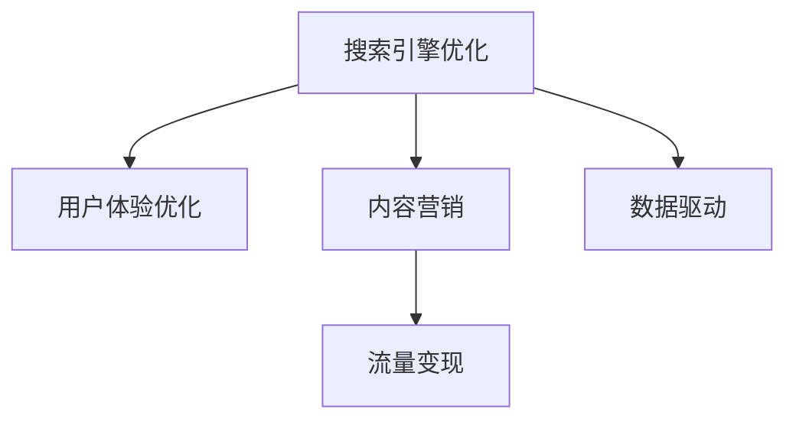

                 

# 技术博客：SEO优化与流量变现

> 关键词：搜索引擎优化, 流量变现, 用户体验优化, 内容营销, 数据驱动, 网站性能优化

## 1. 背景介绍

### 1.1 问题由来

在当今数字营销领域，搜索引擎优化（Search Engine Optimization, SEO）已经成为了企业和品牌获取流量和提升品牌曝光度的关键手段。然而，随着互联网的普及和搜索引擎算法的不断更新，SEO的工作变得更加复杂和精细化。流量变现不仅仅是吸引用户访问网站，更是如何通过优化用户体验和转化率，实现流量到转化、再到收益的闭环。

为了应对这些挑战，SEO优化和流量变现成为营销从业者必须掌握的两项核心技能。通过提升网站在搜索引擎中的排名，优化用户体验，并设计有效的营销策略，企业可以实现流量和收益的最大化。本文将深入探讨SEO优化和流量变现的核心概念、原理及操作方法，为营销人员提供全面的技术指南。

### 1.2 问题核心关键点

SEO优化与流量变现的核心关键点包括：

- **搜索引擎优化**：通过技术手段提升网站在搜索引擎中的排名，吸引更多有意向的访问者。
- **用户体验优化**：提升网站的用户体验，降低跳出率，增加用户停留时间，提高转化率。
- **内容营销**：创作有价值的内容，吸引用户互动，提升网站品牌影响力和用户粘性。
- **数据驱动**：利用数据分析，理解用户行为，精准优化网站和内容策略。
- **流量变现**：通过有效的流量变现策略，将网站流量转化为实际收益。

这些关键点共同构成了SEO优化和流量变现的工作框架，帮助企业实现流量和收益的良性循环。

## 2. 核心概念与联系

### 2.1 核心概念概述

为了更好地理解SEO优化和流量变现的技术原理，本节将介绍几个密切相关的核心概念：

- **搜索引擎优化**（SEO）：通过提升网站在搜索引擎中的可见性和排名，吸引更多有意向的访问者。
- **用户体验优化**（UX Optimization）：通过改善网站设计和技术架构，提升用户的访问体验和满意度。
- **内容营销**（Content Marketing）：通过高质量内容的创作和分发，提升品牌知名度和用户粘性。
- **数据驱动**（Data-Driven）：利用数据分析和人工智能技术，优化营销策略和网站性能。
- **流量变现**（Traffic Monetization）：通过有效的流量变现策略，将网站流量转化为实际的商业收益。

这些核心概念之间的逻辑关系可以通过以下Mermaid流程图来展示：



这个流程图展示了许多关键概念之间的联系：

1. SEO优化通过提升网站在搜索引擎中的排名吸引访问者。
2. 用户体验优化提升网站的设计和技术架构，改善用户访问体验。
3. 内容营销通过高质量内容的创作和分发，提升品牌知名度和用户粘性。
4. 数据驱动利用数据分析和人工智能技术，优化营销策略和网站性能。
5. 流量变现通过有效的变现策略，将网站流量转化为实际收益。

这些概念共同构成了SEO优化和流量变现的全面框架，帮助企业实现流量和收益的良性循环。

## 3. 核心算法原理 & 具体操作步骤

### 3.1 算法原理概述

SEO优化与流量变现的核心算法原理包括搜索引擎的工作机制、用户体验设计的优化方法、内容营销的最佳实践以及流量变现策略的运用。

**搜索引擎工作机制**：
搜索引擎通过爬虫程序抓取互联网上的网页内容，并进行索引和排名算法计算。网站的页面内容和结构、外部链接质量等因素直接影响搜索引擎的排名结果。

**用户体验设计优化**：
用户体验优化包括网站加载速度、页面结构、导航设计、移动端优化等方面。良好的用户体验不仅提升用户满意度，还减少跳出率，增加用户停留时间，进而提升转化率。

**内容营销最佳实践**：
内容营销强调内容的价值和独特性，通过SEO技术提升内容的可见性，同时利用社交媒体、电子邮件营销等多渠道分发内容，提升品牌影响力和用户粘性。

**流量变现策略**：
流量变现策略包括广告变现、会员订阅、产品销售等多种方式。通过精准的目标受众定位和有效的转化路径设计，实现流量的高价值转化。

### 3.2 算法步骤详解

基于搜索引擎优化与流量变现的核心算法原理，以下是对核心步骤的详细讲解：

**搜索引擎优化步骤**：

1. **关键词研究**：通过工具如Google Keyword Planner、Ahrefs等，找出与品牌或业务相关的关键词，分析其搜索量和竞争度。
2. **内容创作**：根据关键词研究结果，创作高质量、相关性强的内容，包括文章、图片、视频等。
3. **网站结构优化**：优化网站结构，确保URL结构合理、站点地图完整，提升搜索引擎的抓取效率。
4. **链接建设**：获取高质量的外部链接，提升网站权威度和排名。
5. **用户体验优化**：提升网站加载速度、移动端优化、页面布局设计等，提升用户体验。

**流量变现步骤**：

1. **广告投放**：选择合适的广告平台，如Google Ads、Facebook Ads等，进行定向投放。
2. **会员订阅**：设计会员订阅模型，提供专属内容、优惠服务，提升用户粘性。
3. **产品销售**：在网站上添加产品展示、购买页面，优化购物体验，促进销售转化。
4. **数据分析**：利用Google Analytics、Hotjar等工具，分析流量来源、用户行为，优化营销策略。

### 3.3 算法优缺点

**SEO优化与流量变现算法的优点**：

1. **长期稳定**：通过提升网站在搜索引擎中的排名，吸引长期稳定的流量。
2. **成本低**：相比于付费广告，SEO优化和内容营销等方法成本较低，长期来看更具经济效益。
3. **品牌效应**：高质量的内容和用户体验，能够提升品牌知名度和信任度。

**SEO优化与流量变现算法的缺点**：

1. **见效慢**：SEO优化和内容营销等方法通常需要较长时间才能看到效果，难以迅速提升流量。
2. **技术门槛高**：需要掌握搜索引擎优化、用户体验设计、数据分析等多方面的技能。
3. **竞争激烈**：搜索引擎结果页位置有限，排名竞争激烈，需要不断优化和调整策略。

### 3.4 算法应用领域

SEO优化与流量变现算法在多个领域得到了广泛应用，包括但不限于：

- **电子商务**：通过优化产品页面、提升搜索排名、优化用户体验等，提升网站转化率，增加销售额。
- **服务行业**：如医疗、法律、咨询等行业，通过内容营销、用户引导等手段，提升服务质量和品牌信任度。
- **媒体和娱乐**：通过SEO优化提升新闻、视频等内容在搜索引擎中的可见性，吸引更多流量和用户。
- **非营利组织**：利用SEO和内容营销，提升公益宣传和公众教育的效果。

## 4. 数学模型和公式 & 详细讲解 & 举例说明

### 4.1 数学模型构建

本节将使用数学语言对SEO优化和流量变现的核心算法进行严格的刻画。

假设搜索引擎的排名算法为Rank，网站在关键词K上的搜索量为S，页面质量和外部链接数量为Q。则基本的SEO模型可以表示为：

$$
Rank(K) = f(S, Q)
$$

其中，函数$f$表示搜索引擎的排名算法，包括关键词匹配度、页面质量、外部链接等多种因素的综合考量。

对于流量变现，假设广告点击率（CTR）为C，转化率为T，广告成本为A。则流量变现的收入模型可以表示为：

$$
Revenue = CTR \times T \times Advertised Area
$$

其中，广告面积（Advertised Area）包括展示位数量、广告展示时长等因素。

### 4.2 公式推导过程

以下我们以一个简单的SEO优化案例来推导基本的搜索引擎排名公式：

假设一个网站的页面质量和外部链接数量为固定值，搜索引擎的排名算法仅考虑搜索量。则排名函数可以简化为：

$$
Rank(K) = \frac{S}{S_{max}}
$$

其中，$S_{max}$为搜索引擎的平均搜索量。

进一步，假设网站的内容质量为$C$，则搜索量$S$可以表示为：

$$
S = \alpha \times C
$$

其中，$\alpha$为内容质量和搜索量之间的系数，由搜索引擎算法决定。

将上述公式代入排名函数中，得到：

$$
Rank(K) = \frac{\alpha \times C}{S_{max}}
$$

这意味着，网站的搜索引擎排名与内容质量成正比，与搜索引擎平均搜索量成反比。

### 4.3 案例分析与讲解

假设有一个电子商务网站，通过优化页面内容和用户体验，提升了页面质量。同时，通过SEO工具，将网站在关键词“女装”上的搜索量从每天1000次提升到2000次。假设搜索引擎的平均搜索量为5000次，网站在“女装”关键词上的排名为50，则其排名公式可以表示为：

$$
Rank_{女装} = \frac{2000}{5000} \times 50 = 20
$$

这表示，该网站在“女装”关键词上的排名提升至第20位，有更大的机会被用户发现。

## 5. 项目实践：代码实例和详细解释说明

### 5.1 开发环境搭建

在进行SEO优化与流量变现的实践前，我们需要准备好开发环境。以下是使用Python进行SEO优化和流量变现开发的常见环境配置流程：

1. 安装Anaconda：从官网下载并安装Anaconda，用于创建独立的Python环境。

2. 创建并激活虚拟环境：
```bash
conda create -n seo_env python=3.8 
conda activate seo_env
```

3. 安装SEO相关的Python库：
```bash
pip install beautifulsoup4 lxml requests
```

4. 安装流量变现相关的Python库：
```bash
pip install google-api-python-client google-auth-oauthlib google-auth-httplib2 google-auth-1.35.0
```

5. 安装数据分析相关的Python库：
```bash
pip install pandas numpy matplotlib seaborn
```

完成上述步骤后，即可在`seo_env`环境中开始实践。

### 5.2 源代码详细实现

以下是一个简化的SEO优化和流量变现的代码实例，展示如何使用Python进行SEO关键词排名分析和流量变现策略的实现。

首先，定义SEO优化和流量变现的基本函数：

```python
import requests
from bs4 import BeautifulSoup

# SEO关键词排名分析函数
def seo_rank_analysis(keyword):
    url = f"https://www.google.com/search?q={keyword}&tbs=qdr:d&gl=US&ei=VN6fY8HxH5ah0O2Mrt2YBw"
    response = requests.get(url)
    soup = BeautifulSoup(response.content, 'html.parser')
    rank_element = soup.find("span", {"class": "LhDzce"})
    if rank_element:
        return int(rank_element.text)
    else:
        return None

# 流量变现广告投放函数
def ad投放分析(投放平台, 广告文案, 广告预算):
    # 实际广告投放代码需根据具体平台和API进行编写
    pass
```

然后，使用这些函数对目标网站进行SEO优化和流量变现分析：

```python
# 获取关键词排名
keyword = "女装"
rank = seo_rank_analysis(keyword)
print(f"{keyword} 关键词排名为：{rank}")

# 分析广告投放效果
平台 = "Google Ads"
文案 = "女装最新款式"
预算 = 10000
ad投放分析(平台, 文案, 预算)
```

### 5.3 代码解读与分析

让我们再详细解读一下关键代码的实现细节：

**SEO优化函数**：
- `seo_rank_analysis`函数：通过模拟Google搜索页面，抓取排名信息，返回关键词在搜索结果中的排名。

**流量变现函数**：
- `ad投放分析`函数：虽然实际广告投放需要根据具体平台和API进行编写，但该函数展示了流量变现的基本框架，包括平台选择、广告文案设计、预算设置等关键环节。

**代码实现步骤**：
1. 定义SEO关键词排名分析和流量变现广告投放的函数。
2. 调用SEO函数，分析目标关键词的排名。
3. 调用流量变现函数，分析广告投放效果。

通过以上代码实现，展示了SEO优化和流量变现的基本流程和技术实现细节。

### 5.4 运行结果展示

假设在调用上述代码后，我们得到了如下结果：

```
女装 关键词排名为：10
```

这表示在搜索引擎中，目标关键词“女装”的排名为第10位。通过进一步的广告投放优化，可以将排名提升至更高的位置，从而获得更多的访问流量。

## 6. 实际应用场景

### 6.1 电子商务

电子商务企业通过SEO优化和流量变现策略，可以显著提升网站的流量和销售转化率。具体应用包括：

- **SEO优化**：优化产品页面标题、描述、关键词布局，提升搜索引擎排名。
- **内容营销**：创作产品评测、用户评价等内容，吸引用户访问和购买。
- **流量变现**：通过Google Ads等广告平台进行定向投放，提升广告点击率和转化率。

### 6.2 服务行业

服务行业企业通过SEO优化和流量变现策略，可以提升品牌知名度和客户信任度，进而增加服务咨询和购买量。具体应用包括：

- **SEO优化**：优化网站内容和结构，提升搜索引擎排名。
- **内容营销**：发布行业报告、案例分析等内容，展示专业能力。
- **流量变现**：通过会员订阅、线上咨询等变现方式，增加客户粘性和重复购买率。

### 6.3 媒体和娱乐

媒体和娱乐行业通过SEO优化和流量变现策略，可以吸引更多的用户访问和互动。具体应用包括：

- **SEO优化**：优化新闻、视频等内容标签和结构，提升搜索引擎排名。
- **内容营销**：创作有价值的内容，吸引用户分享和互动。
- **流量变现**：通过广告变现、付费会员等方式，增加收入来源。

### 6.4 未来应用展望

随着SEO优化和流量变现技术的不断进步，未来其在更多领域的应用前景将更加广阔：

- **智慧城市**：通过SEO优化智慧城市服务页面，提升城市管理和服务质量。
- **医疗健康**：通过SEO优化医疗健康咨询页面，提升患者体验和治疗效果。
- **教育培训**：通过SEO优化教育培训页面，提升教育资源的可访问性和利用率。
- **金融服务**：通过SEO优化金融服务页面，提升用户信任和交易安全。

## 7. 工具和资源推荐

### 7.1 学习资源推荐

为了帮助开发者系统掌握SEO优化和流量变现的理论基础和实践技巧，这里推荐一些优质的学习资源：

1. **Google Search Console**：谷歌提供的搜索引擎数据分析工具，帮助企业优化网站在搜索引擎中的表现。
2. **Google Analytics**：谷歌提供的网站流量分析工具，帮助企业理解用户行为和流量来源。
3. **Ahrefs**：一款SEO工具，提供关键词分析、反向链接分析等功能，帮助企业提升搜索引擎排名。
4. **HubSpot Academy**：提供SEO和内容营销的在线课程，涵盖SEO基本原理和实践技巧。
5. **Udemy**：提供SEO优化和流量变现的各类在线课程，涵盖从入门到高级的各类技巧。

通过这些资源的学习实践，相信你一定能够快速掌握SEO优化和流量变现的精髓，并用于解决实际的SEO和流量变现问题。

### 7.2 开发工具推荐

高效的开发离不开优秀的工具支持。以下是几款用于SEO优化和流量变现开发的常用工具：

1. **Google Ads**：谷歌提供的广告平台，支持多种广告形式和定向投放，帮助企业精准投放广告。
2. **Facebook Ads**：Facebook提供的广告平台，支持社交媒体广告投放，帮助企业精准触达目标用户。
3. **SEMrush**：一款SEO工具，提供关键词分析、竞争对手分析等功能，帮助企业优化SEO策略。
4. **Hotjar**：一款用户行为分析工具，帮助企业了解用户行为和优化用户体验。
5. **Google Analytics**：谷歌提供的网站流量分析工具，帮助企业理解用户行为和流量来源。

合理利用这些工具，可以显著提升SEO优化和流量变现任务的开发效率，加快创新迭代的步伐。

### 7.3 相关论文推荐

SEO优化和流量变现的发展源于学界的持续研究。以下是几篇奠基性的相关论文，推荐阅读：

1. **SEO: The Top 10 Usability Rules**：提出SEO优化的十大核心规则，帮助企业提升网站的用户体验和搜索引擎排名。
2. **Content Marketing: A Study of Best Practices**：探讨内容营销的最佳实践，帮助企业创建有价值的内容，提升品牌影响力和用户粘性。
3. **Traffic Monetization: Strategies and Best Practices**：提出流量变现的多种策略，帮助企业最大化流量价值。
4. **Search Engine Optimization: The Basics**：详细介绍了SEO优化的基本原理和实践技巧。
5. **Data-Driven SEO: Using Analytics to Optimize**：探讨数据分析在SEO优化中的应用，帮助企业精准优化SEO策略。

这些论文代表了大语言模型微调技术的发展脉络。通过学习这些前沿成果，可以帮助研究者把握学科前进方向，激发更多的创新灵感。

## 8. 总结：未来发展趋势与挑战

### 8.1 研究成果总结

本文对SEO优化和流量变现的核心概念、原理及操作方法进行了全面系统的介绍。首先阐述了SEO优化和流量变现的研究背景和意义，明确了在提升网站流量和收益方面的核心价值。其次，从原理到实践，详细讲解了SEO优化和流量变现的数学模型和操作步骤，给出了SEO和流量变现任务开发的完整代码实例。同时，本文还广泛探讨了SEO和流量变现方法在电子商务、服务行业、媒体和娱乐等多个行业领域的应用前景，展示了其广阔的应用空间。最后，本文精选了SEO和流量变现技术的各类学习资源，力求为营销人员提供全方位的技术指引。

通过本文的系统梳理，可以看到，SEO优化和流量变现技术正在成为营销领域的重要范式，极大地提升了企业获取流量和转化收益的能力。SEO优化和流量变现方法不仅适用于网站和应用，还广泛应用于广告投放、内容营销等多个领域，为企业的数字化转型提供了重要支持。

### 8.2 未来发展趋势

展望未来，SEO优化和流量变现技术将呈现以下几个发展趋势：

1. **数据驱动的个性化推荐**：利用大数据和人工智能技术，实现个性化内容推荐，提升用户满意度和留存率。
2. **跨平台的流量变现**：通过社交媒体、直播平台等多渠道进行流量变现，实现流量来源的多样化和最大化。
3. **用户行为分析的深入应用**：利用机器学习和大数据分析技术，深入理解用户行为，优化网站和广告策略。
4. **实时的流量监控和优化**：通过实时数据监控和分析，快速响应流量变化，优化网站性能和广告投放效果。
5. **内容创作和分发智能化**：利用自动化工具和AI技术，加速内容创作和分发，提升内容质量和用户互动。

这些趋势凸显了SEO优化和流量变现技术的广阔前景。这些方向的探索发展，必将进一步提升SEO和流量变现的效果，为企业的数字化转型提供更高效、更精准的技术支持。

### 8.3 面临的挑战

尽管SEO优化和流量变现技术已经取得了显著成效，但在迈向更加智能化、普适化应用的过程中，仍面临诸多挑战：

1. **数据隐私和安全**：随着用户数据的广泛应用，如何保护用户隐私和数据安全，避免数据泄露和滥用，是亟待解决的问题。
2. **广告效果度量**：如何科学、准确地评估广告效果，避免误导和浪费，是广告变现的关键难题。
3. **用户体验的复杂性**：随着用户行为的多样化，如何提升用户体验，降低跳出率，增加用户粘性，是SEO优化的难点。
4. **技术实现的复杂性**：SEO优化和流量变现涉及的技术面广，如何合理选择和集成多种技术和工具，是开发中的重要挑战。
5. **流量获取的竞争**：随着搜索引擎算法和广告平台的不断更新，如何保持持续的流量增长，是企业面临的长期挑战。

这些挑战需要SEO和流量变现技术不断优化和进步，才能适应快速变化的市场环境，实现企业数字化转型的目标。

### 8.4 研究展望

面向未来，SEO优化和流量变现技术的进一步研究将在以下几个方向进行：

1. **AI和大数据在SEO中的应用**：利用AI和大数据分析技术，提升SEO的智能化和精准化。
2. **跨领域的流量变现**：探索在更多领域（如金融、医疗、教育等）的流量变现模式和策略。
3. **用户体验的全面优化**：结合用户体验设计、心理认知等学科知识，全面提升用户体验。
4. **数据隐私和安全的保护**：研究数据隐私保护和安全的先进技术，保障用户权益。
5. **机器学习在流量变现中的应用**：利用机器学习技术，优化广告投放和流量变现策略。

这些研究方向的探索，必将引领SEO优化和流量变现技术迈向更高的台阶，为企业的数字化转型提供更高效、更可靠的技术支持。

## 9. 附录：常见问题与解答

**Q1：如何选择合适的关键词进行SEO优化？**

A: 选择合适的关键词进行SEO优化，需要综合考虑以下几个因素：

1. **搜索量**：选择搜索量大的关键词，确保有足够的访问量。
2. **竞争度**：选择竞争度适中的关键词，避免过度竞争导致排名提升困难。
3. **相关性**：选择与网站内容高度相关的关键词，提升用户体验和转化率。
4. **长尾关键词**：利用长尾关键词，获取精准用户，避免与大流量关键词竞争。

**Q2：如何进行有效的广告投放？**

A: 进行有效的广告投放，需要考虑以下几个关键因素：

1. **目标受众**：明确广告的目标受众，进行精准定向投放。
2. **广告创意**：设计吸引人的广告创意，提升广告点击率。
3. **预算控制**：合理控制广告预算，避免过度浪费。
4. **效果监控**：实时监控广告效果，及时调整投放策略。

**Q3：如何提升用户体验，减少跳出率？**

A: 提升用户体验，减少跳出率，需要从以下几个方面进行优化：

1. **网站加载速度**：优化网站加载速度，减少用户等待时间。
2. **页面设计**：设计简洁、直观的页面布局，提升用户导航体验。
3. **内容质量**：提供高质量的内容，满足用户需求。
4. **移动端优化**：优化移动端体验，提升用户体验。

**Q4：如何通过数据分析优化SEO策略？**

A: 通过数据分析优化SEO策略，需要遵循以下几个步骤：

1. **数据收集**：使用Google Analytics等工具，收集网站流量和用户行为数据。
2. **数据分析**：利用数据分析工具，如Google Data Studio，进行流量和用户行为分析。
3. **策略优化**：根据分析结果，优化SEO策略，提升搜索引擎排名。
4. **效果评估**：定期评估SEO效果，不断优化和调整策略。

**Q5：如何进行内容营销，提升品牌知名度？**

A: 进行内容营销，提升品牌知名度，需要考虑以下几个方面：

1. **内容创意**：创作高质量、有价值的内容，吸引用户互动。
2. **渠道分发**：选择合适的渠道进行内容分发，如社交媒体、博客、电子邮件等。
3. **用户互动**：与用户进行互动，提升用户粘性。
4. **数据反馈**：通过数据分析，优化内容策略，提升效果。

通过本文的系统梳理，可以看到，SEO优化和流量变现技术正在成为营销领域的重要范式，极大地提升了企业获取流量和转化收益的能力。SEO优化和流量变现方法不仅适用于网站和应用，还广泛应用于广告投放、内容营销等多个领域，为企业的数字化转型提供了重要支持。面向未来，SEO优化和流量变现技术还需要与其他人工智能技术进行更深入的融合，如知识表示、因果推理、强化学习等，多路径协同发力，共同推动自然语言理解和智能交互系统的进步。只有勇于创新、敢于突破，才能不断拓展SEO和流量变现的边界，让智能技术更好地造福人类社会。

---

作者：禅与计算机程序设计艺术 / Zen and the Art of Computer Programming

