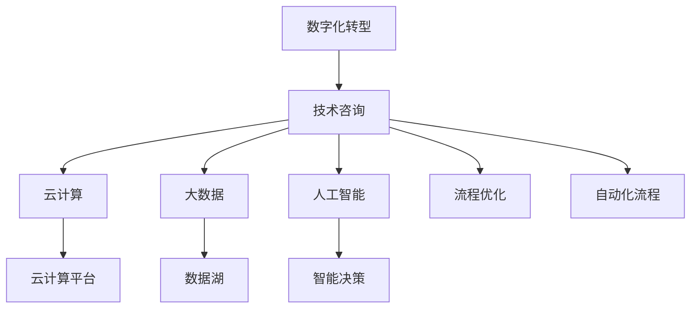

                 

# 技术咨询：从个人顾问到跨国咨询集团

在快速变化的技术环境中，技术咨询业正迅速成长为一个重要的领域。从个人顾问到跨国咨询集团，技术咨询服务的形态和内涵正在不断演变。本文将详细探讨这一领域，包括其发展历程、核心概念、技术应用以及未来趋势。

## 1. 背景介绍

### 1.1 问题由来

随着数字化转型的加速，企业对技术咨询的需求日益增长。从单一技术问题解决到复杂的数字化战略规划，技术咨询的角色变得越来越重要。但传统咨询模式往往难以满足现代企业的复杂需求，因此，从个人顾问到跨国咨询集团的转型势在必行。

### 1.2 问题核心关键点

技术咨询业的核心在于通过专业知识和技能，为企业提供有价值的解决方案。但随着数字化浪潮的推进，技术咨询业面临着新的挑战和机遇：

1. 技术复杂度上升：云计算、大数据、人工智能等新技术的发展，使得技术咨询的复杂度不断提升。
2. 服务需求多元化：企业对数字化转型需求日益多样化，涉及业务流程优化、数据驱动决策、平台架构构建等多个方面。
3. 服务全球化：跨国企业的兴起，使得技术咨询服务需要跨越地域、文化等多重障碍，提供标准化和本地化的服务。
4. 服务定制化：企业对技术咨询的需求越来越个性化，需要定制化解决方案以匹配其独特业务场景。

## 2. 核心概念与联系

### 2.1 核心概念概述

为更好地理解技术咨询业，本节将介绍几个关键概念及其联系：

- **技术咨询(IT Consulting)**：利用技术专业知识和技能，为企业提供战略规划、流程优化、系统构建等综合性咨询服务。
- **云计算(Cloud Computing)**：通过互联网提供按需扩展的计算资源，使得企业能够灵活、高效地管理IT资源。
- **大数据(Big Data)**：利用先进的数据处理和分析技术，从海量数据中提取有价值的信息，支持决策制定。
- **人工智能(AI)**：利用机器学习、深度学习等技术，实现智能化的自动化流程、决策支持等。
- **数字化转型(Digital Transformation)**：通过技术手段，实现企业业务流程、运营模式的全面变革，提升企业竞争力。

这些概念之间的逻辑关系可以通过以下Mermaid流程图来展示：



这个流程图展示了技术咨询与云计算、大数据、人工智能等核心技术的联系，以及它们如何共同支持企业数字化转型。

## 3. 核心算法原理 & 具体操作步骤

### 3.1 算法原理概述

技术咨询的核心在于将技术专业知识和技能应用到企业实际问题中，通过技术手段提升企业的业务效率和竞争力。其基本原理可以概括为：

- **需求分析**：通过与企业高管、IT部门深入交流，了解企业的业务需求、IT现状和目标。
- **技术评估**：评估现有技术和架构，确定技术咨询的可行性、成本和效益。
- **方案设计**：根据企业需求和技术评估结果，设计具体的技术解决方案。
- **实施与优化**：在企业环境中实施技术解决方案，并通过持续优化确保解决方案的长期有效性。

### 3.2 算法步骤详解

以下是技术咨询项目的基本操作步骤：

1. **需求收集与分析**：通过访谈、问卷、观察等方法，收集企业业务需求和技术需求，分析企业的IT现状和目标。
2. **技术评估**：评估企业现有技术架构和平台，分析其优缺点，并研究可能的改进方案。
3. **方案设计**：基于需求分析和技术评估结果，设计具体的技术解决方案，包括技术选型、架构设计、数据管理、安全策略等。
4. **实施规划**：制定详细的项目实施计划，包括时间表、资源分配、风险管理等。
5. **实施执行**：按计划执行技术解决方案，包括系统部署、数据迁移、用户培训等。
6. **监控与优化**：在项目实施过程中，实时监控项目进展，根据反馈进行优化和调整。
7. **评估与反馈**：项目完成后，评估项目效果，收集客户反馈，进行总结和改进。

### 3.3 算法优缺点

技术咨询的优点包括：

- **综合性**：涵盖技术方案设计、实施、优化等全过程，提供一站式解决方案。
- **专业性**：利用技术专家的知识和技能，为企业提供深度专业支持。
- **定制化**：能够根据企业需求提供定制化解决方案，满足多样化需求。

缺点包括：

- **成本高**：技术咨询项目涉及大量的人力资源和时间投入，成本较高。
- **依赖性强**：技术咨询的效果很大程度上依赖于咨询公司的专业水平和服务质量。
- **实施周期长**：项目实施周期长，可能影响企业的业务流程和运营效率。

### 3.4 算法应用领域

技术咨询广泛应用于多个行业和领域，包括但不限于：

- **金融服务**：帮助银行、保险公司等金融机构进行数字化转型，提升金融服务效率和客户体验。
- **医疗健康**：为医院、诊所等医疗机构提供技术解决方案，优化医疗流程，提升服务质量。
- **零售电商**：为零售商、电商平台提供技术支持，实现智能库存管理、个性化推荐等功能。
- **制造业**：为制造企业提供工业4.0解决方案，实现智能制造、供应链优化等。
- **政府公共服务**：为政府部门提供数字化服务，提升公共服务效率和透明度。

## 4. 数学模型和公式 & 详细讲解 & 举例说明

### 4.1 数学模型构建

技术咨询的核心在于解决企业实际问题，提升其业务效率和竞争力。因此，建模是技术咨询的重要环节。以下是一个简化的数学模型，用于描述技术咨询的流程：

$$
\text{Consulting Effectiveness} = f(\text{Business Needs}, \text{Technology Capabilities}, \text{Implementation Efficiency}, \text{Post-Implementation Optimization})
$$

其中，$Business Needs$表示企业业务需求，$Technology Capabilities$表示企业现有技术能力，$Implementation Efficiency$表示项目实施效率，$Post-Implementation Optimization$表示项目实施后的优化效果。

### 4.2 公式推导过程

技术咨询的效果可以通过多个指标进行衡量，包括项目完成时间、成本控制、用户满意度等。以下是一个简化的公式，用于计算技术咨询的总体效果：

$$
\text{Consulting Effectiveness Score} = \frac{\text{Satisfied Users} \times \text{Project On Time} \times \text{Cost Efficiency}}{\text{Number of Users}}
$$

其中，$Satisfied Users$表示满意用户数量，$Project On Time$表示项目按时完成的比例，$Cost Efficiency$表示成本控制的效果，$Number of Users$表示参与咨询项目的企业用户总数。

### 4.3 案例分析与讲解

以一家制造企业数字化转型的技术咨询项目为例，进行分析：

- **需求收集与分析**：通过访谈和问卷，收集制造企业对生产效率、供应链优化、质量控制等需求。
- **技术评估**：评估企业的生产设备和ERP系统，识别其优缺点，并提出改进方案。
- **方案设计**：设计智能制造解决方案，包括自动化生产线、智能仓储系统、质量检测系统等。
- **实施规划**：制定详细的项目实施计划，包括设备采购、系统集成、人员培训等。
- **实施执行**：按计划部署智能制造系统，并进行用户培训和系统优化。
- **监控与优化**：实时监控系统运行情况，根据反馈进行优化和调整。
- **评估与反馈**：项目完成后，评估其效果，收集企业反馈，进行总结和改进。

## 5. 项目实践：代码实例和详细解释说明

### 5.1 开发环境搭建

要进行技术咨询项目，需要搭建一个具备高可用性、安全性的开发环境。以下是一个基本的开发环境搭建流程：

1. **选择合适的开发工具**：如JIRA、Confluence、Trello等项目管理工具。
2. **配置开发环境**：安装Python、Java、Git等开发工具，搭建DevOps环境。
3. **部署云平台**：选择AWS、Azure等云平台，部署开发、测试和生产环境。
4. **安全保障**：确保数据安全和隐私保护，使用VPN、防火墙等安全措施。

### 5.2 源代码详细实现

以下是一个简化的技术咨询项目管理系统，用于项目管理和进度跟踪：

```python
class Project:
    def __init__(self, name, description, start_date, end_date, status):
        self.name = name
        self.description = description
        self.start_date = start_date
        self.end_date = end_date
        self.status = status
        self.tasks = []
    
    def add_task(self, task):
        self.tasks.append(task)
    
    def update_status(self, status):
        self.status = status
    
    def get_status(self):
        return self.status
    
    def get_task_status(self, task_name):
        for task in self.tasks:
            if task.name == task_name:
                return task.status
        return "Not Found"
    
class Task:
    def __init__(self, name, description, start_date, end_date, status):
        self.name = name
        self.description = description
        self.start_date = start_date
        self.end_date = end_date
        self.status = status
    
    def update_status(self, status):
        self.status = status
    
    def get_status(self):
        return self.status
    
    def get_name(self):
        return self.name
```

### 5.3 代码解读与分析

上述代码实现了项目管理的基本功能，包括项目创建、任务添加、状态更新等。以下是关键代码的解读：

- `Project`类：用于描述项目的基本信息，包括项目名称、描述、开始和结束日期、当前状态等。
- `add_task`方法：用于向项目中添加任务，支持动态扩展任务列表。
- `update_status`方法：用于更新项目或任务的状态，确保实时反映项目进展。
- `get_task_status`方法：用于获取特定任务的状态，提供项目的实时进度信息。

### 5.4 运行结果展示

通过使用上述代码，可以创建一个简单的项目管理工具，帮助技术咨询团队跟踪项目进展，确保按时交付。以下是一个示例输出：

```
Project Name: Smart Manufacturing System
Project Status: In Progress
Tasks:
- Task Name: Automated Production Line
  Task Status: In Progress
- Task Name: Quality Control System
  Task Status: Pending
- Task Name: Inventory Management System
  Task Status: Completed
```

## 6. 实际应用场景

### 6.1 智能制造

智能制造是技术咨询的一个典型应用场景。通过引入先进的自动化设备和智能控制系统，制造企业可以大幅提升生产效率和产品质量。技术咨询公司可以提供全面的解决方案，包括智能生产线设计、自动化设备选型、系统集成和优化等。

### 6.2 智慧零售

智慧零售通过物联网、大数据、人工智能等技术，实现对库存、营销、顾客行为等全流程的智能化管理。技术咨询公司可以帮助零售企业构建智能零售平台，提升运营效率和顾客体验。

### 6.3 金融服务

金融服务行业面临日益复杂的技术挑战，包括数据安全、交易处理、客户服务等。技术咨询公司可以提供安全合规、高效稳定、客户友好的金融服务平台，支持金融机构的数字化转型。

### 6.4 医疗健康

医疗健康行业对数据安全和隐私保护要求高，技术咨询公司可以提供高质量的数据管理和安全解决方案，支持电子病历、健康管理、远程医疗等应用。

## 7. 工具和资源推荐

### 7.1 学习资源推荐

为了帮助技术咨询从业者提升技术水平和管理能力，以下是几本推荐书籍：

1. **《IT咨询与管理》**：详细介绍了IT咨询的基本理论、方法、工具和案例。
2. **《大数据技术与应用》**：全面讲解大数据技术及其在各个行业的应用。
3. **《人工智能：现代方法》**：系统阐述人工智能的基本概念、技术和应用。
4. **《云计算基础》**：介绍云计算的基础知识、架构和应用案例。
5. **《敏捷项目管理》**：讲解敏捷项目管理的方法和实践，提升项目管理和交付效率。

### 7.2 开发工具推荐

以下是一些常用的技术咨询项目开发工具：

1. **JIRA**：项目管理工具，支持任务分配、进度跟踪、状态更新等功能。
2. **Confluence**：协作平台，用于文档共享、知识管理、团队协作。
3. **Trello**：敏捷管理工具，支持看板式任务管理和进度跟踪。
4. **GitLab**：代码托管平台，支持版本控制、代码审查、持续集成等功能。
5. **Ansible**：自动化运维工具，支持自动化配置、任务执行和监控。

### 7.3 相关论文推荐

技术咨询领域的研究涉及多个学科和领域，以下是几篇推荐论文：

1. **《IT咨询服务提供商选择决策分析模型》**：研究如何选择和评估IT咨询服务提供商，确保项目成功。
2. **《敏捷项目管理：理论与实践》**：探讨敏捷项目管理的方法和实践，提升项目交付效率和客户满意度。
3. **《大数据驱动的智能制造》**：研究大数据技术在智能制造中的应用，提升生产效率和质量。
4. **《云计算在医疗健康中的应用》**：探讨云计算在医疗健康行业的应用，提升数据管理和医疗服务效率。
5. **《人工智能在金融服务中的应用》**：研究人工智能技术在金融服务中的应用，提升金融服务效率和客户体验。

## 8. 总结：未来发展趋势与挑战

### 8.1 总结

本文对技术咨询从个人顾问到跨国咨询集团的发展历程进行了详细探讨。通过分析技术咨询的核心概念和应用领域，明确了技术咨询在企业数字化转型中的重要价值。从需求收集与分析、技术评估、方案设计、实施执行到监控与优化，技术咨询的全流程管理是其成功的关键。

通过本文的系统梳理，可以看到，技术咨询正在从单一服务向综合服务转型，从技术咨询向数字化咨询演变，未来将成为企业数字化转型的重要助力。技术咨询公司需要在技术、管理、运营等各个方面进行全面优化，方能适应日益复杂多变的需求。

### 8.2 未来发展趋势

技术咨询的未来发展趋势包括：

1. **数字化转型**：随着数字化浪潮的推进，技术咨询将更多地融合云计算、大数据、人工智能等技术，提供更全面、智能化的解决方案。
2. **国际化和本地化**：跨国企业的兴起，使得技术咨询服务需要跨越地域、文化等多重障碍，提供标准化和本地化的服务。
3. **客户体验**：提升客户体验将成为技术咨询的重要目标，通过敏捷管理、项目管理、客户反馈等手段，确保客户满意度。
4. **持续学习**：技术咨询公司需要持续学习和更新技术知识，以应对不断变化的市场需求和技术环境。
5. **人才管理**：技术咨询公司需要注重人才管理，提升团队的专业水平和协作能力，保持竞争优势。

### 8.3 面临的挑战

技术咨询行业在不断发展的同时，也面临诸多挑战：

1. **技术复杂度上升**：云计算、大数据、人工智能等新技术的发展，使得技术咨询的复杂度不断提升。
2. **服务需求多元化**：企业对数字化转型需求日益多样化，涉及业务流程优化、数据驱动决策、平台架构构建等多个方面。
3. **服务全球化**：跨国企业的兴起，使得技术咨询服务需要跨越地域、文化等多重障碍，提供标准化和本地化的服务。
4. **服务定制化**：企业对技术咨询的需求越来越个性化，需要定制化解决方案以匹配其独特业务场景。
5. **成本高**：技术咨询项目涉及大量的人力资源和时间投入，成本较高。

### 8.4 研究展望

未来技术咨询行业的研究方向包括：

1. **跨学科融合**：技术咨询公司需要跨学科融合，将技术、管理、运营等知识融合在一起，提供更全面的解决方案。
2. **智能化应用**：利用人工智能技术，提升项目管理和客户体验，提供更智能化的服务。
3. **数据驱动决策**：通过大数据分析，提供更科学的决策依据，提升项目成功率。
4. **国际化战略**：拓展国际化市场，提供本地化服务，提升国际竞争力。
5. **可持续性**：关注环境保护和可持续发展，推动绿色技术咨询。

## 9. 附录：常见问题与解答

**Q1：技术咨询的优势和劣势是什么？**

A: 技术咨询的优势包括：

- **综合性**：涵盖技术方案设计、实施、优化等全过程，提供一站式解决方案。
- **专业性**：利用技术专家的知识和技能，为企业提供深度专业支持。
- **定制化**：能够根据企业需求提供定制化解决方案，满足多样化需求。

劣势包括：

- **成本高**：技术咨询项目涉及大量的人力资源和时间投入，成本较高。
- **依赖性强**：技术咨询的效果很大程度上依赖于咨询公司的专业水平和服务质量。
- **实施周期长**：项目实施周期长，可能影响企业的业务流程和运营效率。

**Q2：如何选择和评估IT咨询服务提供商？**

A: 选择和评估IT咨询服务提供商需要考虑以下因素：

- **经验和技术水平**：评估公司的项目经验和技术能力，确保其具备解决复杂问题的能力。
- **项目管理和交付能力**：考察公司的项目管理方法、交付效率和客户满意度。
- **客户口碑和信誉**：通过客户反馈、第三方评价等方式，评估公司的信誉和口碑。
- **服务范围和能力**：评估公司的服务范围、技术能力、资源配置等，确保其能够提供全面、专业的服务。
- **成本效益**：评估服务的成本和效益，确保其具有较高的性价比。

**Q3：如何提升技术咨询项目的管理效率？**

A: 提升技术咨询项目的管理效率需要以下措施：

- **敏捷项目管理**：采用敏捷管理方法，提升项目交付效率和客户满意度。
- **项目规划和监控**：制定详细的项目计划，实时监控项目进展，及时发现和解决问题。
- **团队协作**：加强团队协作，提升团队的专业水平和协作能力。
- **客户沟通**：加强与客户的沟通，确保项目需求和目标一致。
- **持续改进**：通过客户反馈和项目总结，持续改进项目管理和服务质量。

---

作者：禅与计算机程序设计艺术 / Zen and the Art of Computer Programming

