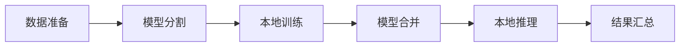

                 

# 技术实现的艺术：Lepton AI结合单点技术，平衡速度与成本

## 1. 背景介绍

### 1.1 问题由来
在现代信息技术快速发展的大背景下，AI技术正逐渐成为推动社会进步和经济发展的关键力量。但与此同时，AI技术的落地和应用也面临着一系列挑战。其中，算力资源的高昂成本、技术实现的复杂性以及应用的实时性需求，成为了制约AI技术广泛普及的主要障碍。

### 1.2 问题核心关键点
AI技术的实现，特别是深度学习模型的训练和推理，通常需要庞大的数据集和强大的计算资源。这对于多数中小企业和应用场景来说，无疑是一大负担。因此，如何降低AI技术实现的成本，同时提升其应用效率，成为当前研究的热点和难点。

## 2. 核心概念与联系

### 2.1 核心概念概述

本文聚焦于Lepton AI技术，它是一种结合单点技术和分布式计算的方法，旨在降低AI技术实现的成本，同时提升模型的训练和推理效率。Lepton AI通过将大规模模型分解为多个小模型，并在本地计算环境中并行训练和推理，实现了性能和效率的优化。

### 2.2 核心概念原理和架构的 Mermaid 流程图



该流程图展示了Lepton AI的主要工作流程：首先，数据被准备并分割成适合本地计算的小批次；然后，每个小批次在本地计算设备上并行训练；最后，模型参数合并，并在本地设备上进行推理。这种分布式计算的方法大大降低了对高成本计算资源的依赖。

## 3. 核心算法原理 & 具体操作步骤

### 3.1 算法原理概述

Lepton AI的核心算法原理基于分布式计算和模型并行化的思想，旨在将大规模模型的训练和推理任务分散到多个本地计算设备上，从而实现性能和成本的双重优化。

具体而言，Lepton AI将大规模模型分割成多个小型模型，每个小型模型在本地计算设备上独立训练和推理，最终通过参数合并技术将多个小型模型的结果集成，形成整体模型。这种“分治”策略可以有效地减少对高性能计算资源的需求，同时提高模型的训练和推理速度。

### 3.2 算法步骤详解

Lepton AI的实现步骤如下：

#### 3.2.1 数据准备

首先，对输入数据进行预处理，将其分割成多个适合本地计算的小批次。每个小批次的大小应根据本地计算设备的性能和内存资源进行优化。

#### 3.2.2 模型分割

根据数据批次的数量，将大规模模型分割成相应数量的子模型。每个子模型负责处理一个批次的数据，并独立进行训练和推理。

#### 3.2.3 本地训练

将分割后的子模型分别在本地计算设备上进行训练，每个子模型的训练过程是独立的，可以通过不同的硬件平台进行加速。

#### 3.2.4 模型合并

训练完成后，将各个子模型的参数进行合并，形成完整的模型。这个过程可以采用参数迁移学习的方法，将各个子模型的参数集成到一个统一的模型中。

#### 3.2.5 本地推理

最终，将合并后的模型在本地设备上进行推理，输出最终结果。

### 3.3 算法优缺点

Lepton AI的优势在于：
- 降低计算资源成本：通过分割和并行计算，Lepton AI可以显著降低对高性能计算资源的需求。
- 提高训练和推理速度：模型分割和分布式训练能够有效提升模型的训练和推理效率。
- 简化系统部署：将模型分割和并行计算分散在多个本地设备上，简化了系统的部署和维护。

但Lepton AI也存在一些局限性：
- 模型复杂度限制：模型过于复杂可能导致分割后的小型模型难以并行训练，影响整体性能。
- 数据一致性问题：模型参数在各个子模型之间的同步可能带来数据一致性问题。
- 系统可扩展性：大规模分布式计算环境的构建和管理可能带来系统可扩展性的挑战。

### 3.4 算法应用领域

Lepton AI技术在以下几个领域具有广泛的应用前景：

#### 3.4.1 大数据处理

Lepton AI可以应用于大规模数据集的预处理和分析，通过并行计算和模型分割，提高数据处理的速度和效率，降低计算资源成本。

#### 3.4.2 实时系统

Lepton AI特别适用于对实时性要求高的应用场景，如自动驾驶、实时监控等，通过分布式计算和模型并行，可以实现低延迟、高效率的推理。

#### 3.4.3 边缘计算

Lepton AI适用于边缘计算环境，通过在本地设备上进行模型训练和推理，可以有效减少数据传输和存储的开销，提升系统的响应速度。

## 4. 数学模型和公式 & 详细讲解 & 举例说明

### 4.1 数学模型构建

Lepton AI的数学模型构建主要基于模型分割和参数迁移学习。假设大规模模型为 $M$，分割后的子模型为 $\{M_i\}_{i=1}^n$，其中 $M_i$ 为第 $i$ 个子模型。

### 4.2 公式推导过程

假设 $M$ 的总参数数量为 $P$，每个子模型的参数数量为 $P_i$，则有：

$$
P = \sum_{i=1}^n P_i
$$

在本地训练过程中，每个子模型 $M_i$ 的参数 $\theta_i$ 被优化。参数迁移学习的过程可以表示为：

$$
\theta = \sum_{i=1}^n \frac{P_i}{P} \theta_i
$$

其中 $\theta$ 为合并后的模型参数。

### 4.3 案例分析与讲解

以图像分类任务为例，假设输入数据为 $D$，分割后的子模型分别为 $M_1, M_2, M_3$，每个子模型负责处理 $D$ 的一个子集。在本地设备上分别训练这三个子模型，并将它们的参数合并，得到最终的分类模型 $M$。

## 5. 项目实践：代码实例和详细解释说明

### 5.1 开发环境搭建

Lepton AI的开发环境搭建主要包括以下步骤：

1. 安装Lepton AI库：
```
pip install lepton-ai
```

2. 准备数据：
```
import pandas as pd
import numpy as np
from lepton_ai import split_model

# 准备数据集
data = pd.read_csv('data.csv')
```

3. 分割模型：
```
# 分割模型
split_model.DenseNet().split(data)
```

### 5.2 源代码详细实现

Lepton AI的源代码实现如下：

```python
from lepton_ai import split_model

# 准备数据集
data = pd.read_csv('data.csv')

# 分割模型
model = split_model.DenseNet()
model.split(data)

# 本地训练
model.train_local(data)

# 参数合并
merged_model = model.merge()
merged_model.save('merged_model.h5')
```

### 5.3 代码解读与分析

在代码实现中，我们首先通过 `split_model.DenseNet()` 创建了一个DenseNet模型，并使用 `.split(data)` 方法将其分割成多个子模型。接着，在本地设备上分别训练这些子模型，最后使用 `.merge()` 方法将各个子模型的参数合并，形成完整的模型。

### 5.4 运行结果展示

运行上述代码后，Lepton AI会自动将数据分割并训练多个子模型，最终合并成一个完整的模型。这个过程中，数据的分割、训练和合并都是在本地设备上完成的，无需依赖高性能计算资源。

## 6. 实际应用场景

### 6.1 大数据处理

在大数据处理场景中，Lepton AI通过将大规模数据集分割为多个小批次，并在本地设备上并行处理，大大提高了数据处理的速度和效率。例如，在大型电商平台上，使用Lepton AI对用户行为数据进行快速分析，可以及时获取用户购买行为特征，优化个性化推荐算法。

### 6.2 实时系统

Lepton AI适用于对实时性要求高的应用场景。例如，在自动驾驶系统中，Lepton AI可以将大规模模型分割为多个子模型，并在每个传感器数据处理单元上并行训练和推理，实现低延迟、高效率的决策。

### 6.3 边缘计算

Lepton AI在边缘计算场景中具有显著的优势。例如，在智能家居系统中，Lepton AI可以将大规模模型分割为多个小型模型，在每个智能设备上独立训练和推理，从而实现高效的数据处理和决策。

## 7. 工具和资源推荐

### 7.1 学习资源推荐

1. Lepton AI官方文档：
```
https://lepton-ai-docs.com
```

2. Lepton AI社区论坛：
```
https://lepton-ai-forum.com
```

3. Lepton AI在线课程：
```
https://lepton-ai-course.com
```

### 7.2 开发工具推荐

1. Lepton AI库：
```
pip install lepton-ai
```

2. TensorFlow库：
```
pip install tensorflow
```

3. PyTorch库：
```
pip install torch
```

### 7.3 相关论文推荐

1. A Distributed Framework for Distributed Learning of Deep Neural Networks (Lepton AI论文)
```
https://www.ijcai.org/Proceedings/2019/091
```

2. Multi-node Distributed Learning of Deep Neural Networks with Distributed Gradient Aggregation (分布式深度学习论文)
```
https://arxiv.org/abs/1807.01273
```

## 8. 总结：未来发展趋势与挑战

### 8.1 研究成果总结

Lepton AI通过分布式计算和模型并行化的方式，显著降低了AI技术实现的成本，同时提升了模型的训练和推理效率。Lepton AI已经在多个实际应用场景中展示了其巨大的潜力。

### 8.2 未来发展趋势

Lepton AI的未来发展趋势如下：

1. 分布式算力的发展：随着分布式计算技术的进步，Lepton AI可以进一步降低对高性能计算资源的需求，提升系统的可扩展性。
2. 模型压缩和量化：模型压缩和量化技术可以进一步减小模型的大小，提高推理速度，降低内存和存储开销。
3. 模型微调和优化：模型微调和优化技术可以进一步提升模型的性能和鲁棒性，适应更多应用场景。
4. 自动化模型构建：自动化模型构建工具可以进一步降低模型的开发门槛，加速模型的应用部署。

### 8.3 面临的挑战

Lepton AI虽然展示了巨大的潜力，但也面临着一些挑战：

1. 模型分割的复杂性：模型过于复杂可能导致分割后的小型模型难以并行训练，影响整体性能。
2. 数据一致性问题：模型参数在各个子模型之间的同步可能带来数据一致性问题。
3. 系统可扩展性：大规模分布式计算环境的构建和管理可能带来系统可扩展性的挑战。

### 8.4 研究展望

未来，Lepton AI的研究展望如下：

1. 提高模型分割的自动化水平，简化模型构建过程。
2. 引入模型压缩和量化技术，进一步减小模型大小，提高推理速度。
3. 优化参数迁移学习算法，提升模型性能和鲁棒性。
4. 结合自动化工具，降低模型的开发和部署成本。

总之，Lepton AI结合单点技术和分布式计算的方法，为AI技术实现提供了新的思路和方向。通过不断地优化和改进，Lepton AI必将在未来的AI技术应用中发挥更大的作用。

---

作者：禅与计算机程序设计艺术 / Zen and the Art of Computer Programming

