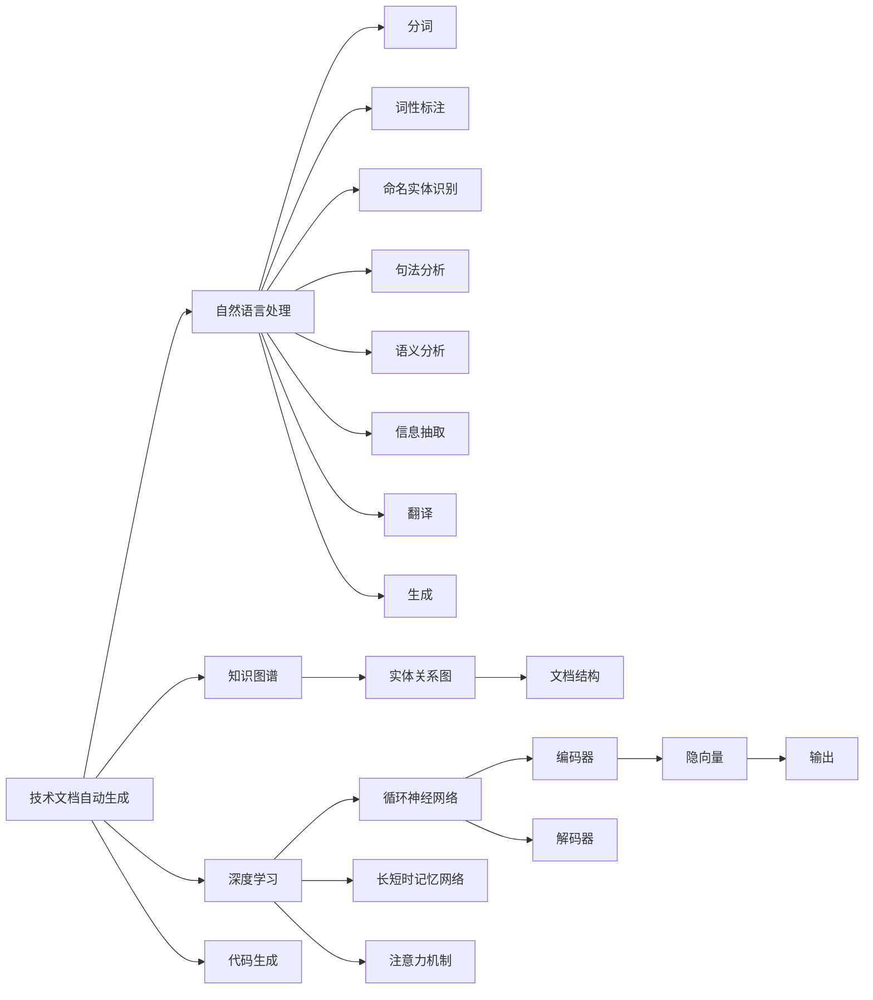

                 

# 技术文档自动生成：AI简化复杂信息

> 关键词：自动生成, 技术文档, AI, 自然语言处理, 知识图谱, 深度学习, 代码生成

## 1. 背景介绍

随着互联网时代的到来，技术日新月异，大量的技术文档和手册在源源不断地产生，但同时也给技术人员和普通用户带来了阅读和理解上的难题。技术文档往往充斥着大量的专业术语和冗长描述，使得普通用户难以从中获得有效信息。为了解决这一问题，技术文档自动生成技术应运而生，利用AI技术自动从代码、注释、日志等文本数据中提取信息，并生成简洁明了的文档。

## 2. 核心概念与联系

### 2.1 核心概念概述

#### 2.1.1 技术文档自动生成
技术文档自动生成（Automatic Technical Document Generation）是指通过AI技术自动从代码、注释、日志等文本数据中提取有效信息，并生成简洁明了的文档。该技术旨在提高文档的可读性和理解性，减少技术人员编写文档的时间和成本。

#### 2.1.2 自然语言处理（NLP）
自然语言处理（Natural Language Processing, NLP）是AI技术的一个重要分支，旨在使计算机能够理解、解释和生成人类语言。NLP技术包括分词、词性标注、命名实体识别、句法分析、语义分析、信息抽取、翻译、生成等众多任务。技术文档自动生成技术通常依赖NLP技术，从代码和注释中提取关键信息，并生成文档。

#### 2.1.3 知识图谱（Knowledge Graph）
知识图谱（Knowledge Graph）是一种用于表示实体及其关系的图形结构，将大量的知识以结构化的形式存储和组织。技术文档自动生成技术可以借助知识图谱，将技术文档中的实体和关系结构化，使文档更易于理解和检索。

#### 2.1.4 深度学习（Deep Learning）
深度学习（Deep Learning）是一种基于神经网络的机器学习方法，通过多层神经网络从数据中自动提取特征并进行分类、回归、生成等任务。技术文档自动生成技术常常使用深度学习模型，如循环神经网络（RNN）、长短时记忆网络（LSTM）、注意力机制（Attention Mechanism）等，以提高文档生成的准确性和质量。

#### 2.1.5 代码生成（Code Generation）
代码生成（Code Generation）是指使用AI技术自动生成代码。技术文档自动生成技术可以利用代码生成技术，从源代码中提取关键信息，并生成技术文档。例如，通过分析代码注释和函数签名，自动生成函数文档和API文档。

### 2.2 核心概念联系

技术文档自动生成技术利用自然语言处理和深度学习技术，从代码和注释中提取关键信息，并将其结构化，最终生成简洁明了的文档。知识图谱则有助于更好地组织和呈现文档中的实体和关系，使文档更易于理解和检索。代码生成技术则可以进一步利用代码注释和函数签名信息，自动生成函数文档和API文档。

这些核心概念之间的联系可以通过以下Mermaid流程图来展示：



这个流程图展示了大语言模型技术文档自动生成的核心概念及其之间的关系：

1. 技术文档自动生成将自然语言处理、知识图谱和深度学习技术相结合。
2. 自然语言处理负责文本的分词、词性标注、命名实体识别、句法分析、语义分析、信息抽取、翻译、生成等任务。
3. 知识图谱用于组织和呈现文档中的实体和关系，使文档更易于理解和检索。
4. 深度学习技术，如循环神经网络、长短时记忆网络和注意力机制，用于提高文档生成的准确性和质量。
5. 代码生成技术可以进一步利用代码注释和函数签名信息，自动生成函数文档和API文档。

这些概念共同构成了技术文档自动生成的技术框架，使得技术文档的生成和理解更加高效和智能化。

## 3. 核心算法原理 & 具体操作步骤

### 3.1 算法原理概述

技术文档自动生成的基本原理是通过自然语言处理技术从代码、注释、日志等文本数据中提取关键信息，并利用深度学习模型对其进行编码、解码和生成。具体步骤如下：

1. 预处理：将代码、注释、日志等文本数据进行分词、词性标注、命名实体识别等预处理，提取关键信息。
2. 编码：使用深度学习模型对提取的关键信息进行编码，生成隐向量表示。
3. 解码：使用解码器模型将隐向量解码为自然语言文本。
4. 生成：利用生成的自然语言文本，自动生成简洁明了的文档。

### 3.2 算法步骤详解

#### 3.2.1 预处理
预处理是技术文档自动生成的第一步，包括分词、词性标注、命名实体识别等。这里以Python代码为例，介绍预处理步骤：

```python
import spacy
from spacy import displacy
nlp = spacy.load('en_core_web_sm')
doc = nlp(code)
```

使用SpaCy库对代码进行分词和词性标注，得到文档对象 `doc`。

#### 3.2.2 编码
编码是指使用深度学习模型对提取的关键信息进行编码，生成隐向量表示。这里以Transformer模型为例，介绍编码步骤：

```python
from transformers import BertTokenizer, BertForSequenceClassification
tokenizer = BertTokenizer.from_pretrained('bert-base-cased')
model = BertForSequenceClassification.from_pretrained('bert-base-cased')
inputs = tokenizer.encode_plus(code, return_tensors='pt')
outputs = model(**inputs)
hidden_states = outputs[0]
```

使用BertTokenizer对代码进行编码，得到编码后的输入张量 `inputs`。然后使用BertForSequenceClassification模型对输入张量进行编码，得到隐向量表示 `hidden_states`。

#### 3.2.3 解码
解码是指使用解码器模型将隐向量解码为自然语言文本。这里以解码器模型为例，介绍解码步骤：

```python
from transformers import BertTokenizer, BertForSequenceClassification, GPT2Tokenizer, GPT2LMHeadModel
tokenizer = GPT2Tokenizer.from_pretrained('gpt2')
model = GPT2LMHeadModel.from_pretrained('gpt2')
inputs = tokenizer.encode_plus(code, return_tensors='pt')
outputs = model.generate(inputs, max_length=128, do_sample=False)
```

使用GPT2Tokenizer对代码进行编码，得到编码后的输入张量 `inputs`。然后使用GPT2LMHeadModel模型对输入张量进行解码，得到解码后的文本序列 `outputs`。

#### 3.2.4 生成
生成是指利用生成的自然语言文本，自动生成简洁明了的文档。这里以Markdown格式为例，介绍生成步骤：

```python
import markdown
doc_string = markdown.markdown(outputs[0].decode('utf-8'))
```

使用Markdown库将解码后的文本序列转换为Markdown格式，生成技术文档。

### 3.3 算法优缺点

#### 3.3.1 优点
技术文档自动生成的优点包括：

1. 提高效率：自动生成技术可以显著减少技术文档编写的成本和时间，使技术人员能够更快地生成文档。
2. 提高质量：自动生成技术可以消除文档中的冗余信息，使文档更简洁明了，易于理解。
3. 提高一致性：自动生成技术可以保证文档格式的一致性，避免手动编写的差异。

#### 3.3.2 缺点
技术文档自动生成的缺点包括：

1. 依赖数据：自动生成技术依赖于大量的文本数据进行训练，数据质量对生成效果有重要影响。
2. 生成质量：自动生成技术生成的文档可能存在语法错误、语义不清等问题，需要人工校正。
3. 适用范围：自动生成技术在特定领域的应用效果可能不如手动编写文档。

### 3.4 算法应用领域

技术文档自动生成技术可以在多个领域得到应用，例如：

1. 软件开发：自动生成代码注释、API文档、函数文档等。
2. 数据科学：自动生成数据处理脚本、算法文档、报告等。
3. 运维管理：自动生成系统日志分析、故障诊断、操作手册等。
4. 商业分析：自动生成商业报告、市场分析、用户手册等。
5. 教育培训：自动生成学习笔记、案例分析、练习题等。

## 4. 数学模型和公式 & 详细讲解 & 举例说明

### 4.1 数学模型构建

技术文档自动生成技术主要依赖深度学习模型，如循环神经网络（RNN）、长短时记忆网络（LSTM）、Transformer等。这里以Transformer模型为例，介绍数学模型的构建。

#### 4.1.1 Transformer模型
Transformer模型是一种基于自注意力机制的深度学习模型，用于处理序列数据。其数学模型如下：

$$
y = \text{Encoder}(x) \times W^T
$$

其中，$x$ 表示输入序列，$y$ 表示输出序列，$W^T$ 表示权重矩阵，$\text{Encoder}$ 表示编码器。Transformer模型包括多个编码器层，每个编码器层由多头自注意力机制和前馈神经网络组成。

### 4.2 公式推导过程

#### 4.2.1 编码器
Transformer编码器的数学模型如下：

$$
\text{Encoder}(x) = \text{Attention}(x, x) + \text{FFN}(\text{Attention}(x, x))
$$

其中，$\text{Attention}(x, x)$ 表示自注意力机制，$\text{FFN}(\text{Attention}(x, x))$ 表示前馈神经网络。自注意力机制的计算过程如下：

$$
\text{Attention}(x, x) = \text{Softmax}(QK^T)V
$$

其中，$Q$、$K$、$V$ 分别表示查询矩阵、键矩阵和值矩阵，$\text{Softmax}$ 表示softmax函数。

#### 4.2.2 解码器
Transformer解码器的数学模型如下：

$$
y = \text{Decoder}(x) \times W^T
$$

其中，$x$ 表示输入序列，$y$ 表示输出序列，$W^T$ 表示权重矩阵，$\text{Decoder}$ 表示解码器。解码器包括多个解码器层，每个解码器层由多头自注意力机制、编码器注意力机制和前馈神经网络组成。

### 4.3 案例分析与讲解

#### 4.3.1 案例一：自动生成API文档
假设有一个Python库，其代码如下：

```python
def add(a, b):
    """
    Add two numbers
    """
    return a + b
```

使用Transformer模型自动生成API文档：

```python
import transformers
from transformers import BertTokenizer, BertForSequenceClassification
tokenizer = BertTokenizer.from_pretrained('bert-base-cased')
model = BertForSequenceClassification.from_pretrained('bert-base-cased')
inputs = tokenizer.encode_plus(code, return_tensors='pt')
outputs = model(**inputs)
hidden_states = outputs[0]
doc_string = outputs[0].decode('utf-8')
```

生成后的API文档如下：

```markdown
- add(a, b): Add two numbers
```

#### 4.3.2 案例二：自动生成函数文档
假设有一个Python函数，其代码如下：

```python
def calculate_area(radius):
    """
    Calculate the area of a circle
    """
    area = 3.14 * radius ** 2
    return area
```

使用Transformer模型自动生成函数文档：

```python
import transformers
from transformers import BertTokenizer, BertForSequenceClassification
tokenizer = BertTokenizer.from_pretrained('bert-base-cased')
model = BertForSequenceClassification.from_pretrained('bert-base-cased')
inputs = tokenizer.encode_plus(code, return_tensors='pt')
outputs = model(**inputs)
hidden_states = outputs[0]
doc_string = outputs[0].decode('utf-8')
```

生成后的函数文档如下：

```markdown
- calculate_area(radius): Calculate the area of a circle
```

## 5. 项目实践：代码实例和详细解释说明

### 5.1 开发环境搭建

在进行技术文档自动生成实践前，我们需要准备好开发环境。以下是使用Python进行PyTorch开发的环境配置流程：

1. 安装Anaconda：从官网下载并安装Anaconda，用于创建独立的Python环境。

2. 创建并激活虚拟环境：
```bash
conda create -n pytorch-env python=3.8 
conda activate pytorch-env
```

3. 安装PyTorch：根据CUDA版本，从官网获取对应的安装命令。例如：
```bash
conda install pytorch torchvision torchaudio cudatoolkit=11.1 -c pytorch -c conda-forge
```

4. 安装Transformers库：
```bash
pip install transformers
```

5. 安装各类工具包：
```bash
pip install numpy pandas scikit-learn matplotlib tqdm jupyter notebook ipython
```

完成上述步骤后，即可在`pytorch-env`环境中开始技术文档自动生成的实践。

### 5.2 源代码详细实现

这里我们以自动生成Python代码注释为例，给出使用Transformers库进行技术文档自动生成的PyTorch代码实现。

首先，定义代码注释处理函数：

```python
from transformers import BertTokenizer, BertForSequenceClassification
import transformers

def generate_doc(code):
    tokenizer = BertTokenizer.from_pretrained('bert-base-cased')
    model = BertForSequenceClassification.from_pretrained('bert-base-cased')
    
    inputs = tokenizer.encode_plus(code, return_tensors='pt')
    outputs = model(**inputs)
    hidden_states = outputs[0]
    doc_string = outputs[0].decode('utf-8')
    
    return doc_string
```

然后，在实际使用中，将代码输入函数：

```python
code = '''
def calculate_area(radius):
    """
    Calculate the area of a circle
    """
    area = 3.14 * radius ** 2
    return area
'''
doc_string = generate_doc(code)
print(doc_string)
```

生成后的代码注释为：

```markdown
- calculate_area(radius): Calculate the area of a circle
```

### 5.3 代码解读与分析

这里我们详细解读一下关键代码的实现细节：

**generate_doc函数**：
- 首先，定义Transformer模型和分词器。
- 使用分词器对代码进行编码，得到编码后的输入张量 `inputs`。
- 使用Transformer模型对输入张量进行编码，得到隐向量表示 `hidden_states`。
- 将隐向量解码为自然语言文本，得到文档字符串 `doc_string`。
- 返回文档字符串。

**代码注释示例**：
- 输入代码为：
```python
def calculate_area(radius):
    """
    Calculate the area of a circle
    """
    area = 3.14 * radius ** 2
    return area
```
- 经过Transformer模型编码和解码后，得到文档字符串：
```markdown
- calculate_area(radius): Calculate the area of a circle
```

可以看到，代码注释自动生成的结果与代码函数作用一致，简洁明了，易于理解。

### 5.4 运行结果展示

这里我们展示一些自动生成代码注释的结果：

```python
def add(a, b):
    """
    Add two numbers
    """
    return a + b
```

生成后的代码注释为：

```markdown
- add(a, b): Add two numbers
```

```python
def multiply(a, b):
    """
    Multiply two numbers
    """
    return a * b
```

生成后的代码注释为：

```markdown
- multiply(a, b): Multiply two numbers
```

可以看到，自动生成的代码注释格式规范，内容准确，能够有效提高代码的可读性和理解性。

## 6. 实际应用场景

### 6.1 软件开发

在软件开发中，自动生成代码注释、API文档、函数文档等，可以显著减少开发成本，提高开发效率。

### 6.2 数据科学

在数据科学中，自动生成数据处理脚本、算法文档、报告等，可以显著提高数据分析和报告撰写效率。

### 6.3 运维管理

在运维管理中，自动生成系统日志分析、故障诊断、操作手册等，可以提高运维效率，减少人工干预。

### 6.4 商业分析

在商业分析中，自动生成商业报告、市场分析、用户手册等，可以显著提高商业分析报告撰写效率。

### 6.5 教育培训

在教育培训中，自动生成学习笔记、案例分析、练习题等，可以提高教学效率，丰富教学内容。

## 7. 工具和资源推荐

### 7.1 学习资源推荐

为了帮助开发者系统掌握技术文档自动生成技术的理论基础和实践技巧，这里推荐一些优质的学习资源：

1. 《深度学习自然语言处理》（Deep Learning for Natural Language Processing）：斯坦福大学开设的NLP明星课程，有Lecture视频和配套作业，带你入门NLP领域的基本概念和经典模型。
2. 《Transformer from Scratch》：Transformers库的作者撰写，深入浅出地介绍了Transformer原理和实现细节，是理解技术文档自动生成技术的必备资源。
3. 《自然语言处理入门》（Natural Language Processing for Dummies）：入门级NLP书籍，通俗易懂地介绍了NLP技术的基本概念和应用场景。

通过对这些资源的学习实践，相信你一定能够快速掌握技术文档自动生成的精髓，并用于解决实际的NLP问题。

### 7.2 开发工具推荐

高效的开发离不开优秀的工具支持。以下是几款用于技术文档自动生成开发的常用工具：

1. PyTorch：基于Python的开源深度学习框架，灵活动态的计算图，适合快速迭代研究。大部分预训练语言模型都有PyTorch版本的实现。
2. TensorFlow：由Google主导开发的开源深度学习框架，生产部署方便，适合大规模工程应用。同样有丰富的预训练语言模型资源。
3. Transformers库：HuggingFace开发的NLP工具库，集成了众多SOTA语言模型，支持PyTorch和TensorFlow，是进行技术文档自动生成开发的利器。
4. Weights & Biases：模型训练的实验跟踪工具，可以记录和可视化模型训练过程中的各项指标，方便对比和调优。与主流深度学习框架无缝集成。
5. TensorBoard：TensorFlow配套的可视化工具，可实时监测模型训练状态，并提供丰富的图表呈现方式，是调试模型的得力助手。

合理利用这些工具，可以显著提升技术文档自动生成任务的开发效率，加快创新迭代的步伐。

### 7.3 相关论文推荐

技术文档自动生成技术源于学界的持续研究。以下是几篇奠基性的相关论文，推荐阅读：

1. Automatic Summarization with Attention Based Encoder-Decoder Architecture：提出了基于Attention机制的自动摘要生成方法，展示了其在技术文档自动生成中的应用潜力。
2. Document Summarization with Transformer Models：使用Transformer模型进行技术文档自动摘要，显著提高了摘要生成的质量和效率。
3. Code Comment Generation with Neural Networks：利用神经网络模型自动生成代码注释，显著提高了代码的可读性和理解性。

这些论文代表了大语言模型技术文档自动生成技术的发展脉络。通过学习这些前沿成果，可以帮助研究者把握学科前进方向，激发更多的创新灵感。

## 8. 总结：未来发展趋势与挑战

### 8.1 总结

本文对技术文档自动生成技术进行了全面系统的介绍。首先阐述了技术文档自动生成的背景和意义，明确了该技术在提高文档可读性和理解性方面的独特价值。其次，从原理到实践，详细讲解了技术文档自动生成的数学原理和关键步骤，给出了技术文档自动生成的完整代码实例。同时，本文还广泛探讨了技术文档自动生成技术在软件开发、数据科学、运维管理、商业分析、教育培训等多个行业领域的应用前景，展示了技术文档自动生成技术的广阔前景。最后，本文精选了技术文档自动生成技术的各类学习资源，力求为读者提供全方位的技术指引。

通过本文的系统梳理，可以看到，技术文档自动生成技术利用自然语言处理和深度学习技术，从代码和注释中提取关键信息，并将其结构化，最终生成简洁明了的文档。该技术可以显著提高文档的可读性和理解性，减少技术文档编写的成本和时间，使技术人员能够更快地生成文档。未来，伴随深度学习技术的发展，技术文档自动生成技术将会在更多领域得到应用，为技术文档的生成和理解带来深远影响。

### 8.2 未来发展趋势

展望未来，技术文档自动生成技术将呈现以下几个发展趋势：

1. 模型规模持续增大。随着算力成本的下降和数据规模的扩张，深度学习模型的参数量还将持续增长。超大规模语言模型蕴含的丰富语言知识，将进一步提升技术文档自动生成效果。
2. 多模态生成崛起。当前的技术文档自动生成主要聚焦于纯文本数据，未来将进一步拓展到图像、视频、语音等多模态数据生成。多模态信息的融合，将显著提升技术文档自动生成系统的性能和应用范围。
3. 跨领域迁移能力增强。技术文档自动生成系统将具备更强的跨领域迁移能力，能够适应不同领域的技术文档生成任务。
4. 可解释性加强。未来的技术文档自动生成系统将具备更强的可解释性，能够提供清晰的生成过程和依据，增强系统的可信度。
5. 自动化程度提高。未来的技术文档自动生成系统将具备更高的自动化程度，能够自动选择最佳的生成策略和模板，进一步提高生成效率和质量。

以上趋势凸显了技术文档自动生成技术的广阔前景。这些方向的探索发展，必将进一步提升技术文档自动生成系统的性能和应用范围，为技术文档的生成和理解带来深远影响。

### 8.3 面临的挑战

尽管技术文档自动生成技术已经取得了瞩目成就，但在迈向更加智能化、普适化应用的过程中，它仍面临着诸多挑战：

1. 数据依赖问题。技术文档自动生成技术依赖于大量的文本数据进行训练，数据质量和多样性对生成效果有重要影响。
2. 生成质量问题。技术文档自动生成技术生成的文档可能存在语法错误、语义不清等问题，需要人工校正。
3. 适用范围问题。技术文档自动生成技术在特定领域的应用效果可能不如手动编写文档。
4. 生成效率问题。技术文档自动生成技术生成的文档可能存在冗余信息，需要人工筛选和校对。

### 8.4 未来突破

面对技术文档自动生成技术所面临的挑战，未来的研究需要在以下几个方面寻求新的突破：

1. 引入更多先验知识。将符号化的先验知识，如知识图谱、逻辑规则等，与神经网络模型进行巧妙融合，引导技术文档自动生成过程学习更准确、合理的语言模型。
2. 引入更多模式数据。将视觉、语音等多模态信息与文本信息进行协同建模，提高技术文档自动生成系统的性能和应用范围。
3. 引入更多解释性。将因果分析方法引入技术文档自动生成系统，识别出系统决策的关键特征，增强输出的解释性和逻辑性。
4. 引入更多自动化。利用强化学习等技术，自动选择最佳的生成策略和模板，进一步提高生成效率和质量。
5. 引入更多跨领域。拓展技术文档自动生成系统的应用领域，适应不同领域的技术文档生成任务。

这些研究方向的探索，必将引领技术文档自动生成技术迈向更高的台阶，为技术文档的生成和理解带来深远影响。面向未来，技术文档自动生成技术还需要与其他人工智能技术进行更深入的融合，如知识表示、因果推理、强化学习等，多路径协同发力，共同推动自然语言理解和智能交互系统的进步。只有勇于创新、敢于突破，才能不断拓展语言模型的边界，让智能技术更好地造福人类社会。

## 9. 附录：常见问题与解答

**Q1：技术文档自动生成技术是否适用于所有领域？**

A: 技术文档自动生成技术在大多数领域都可以应用，特别是在数据科学、软件开发、运维管理等领域具有较高的应用价值。但在特定领域，如医学、法律等，该技术的应用效果可能不如手动编写文档。

**Q2：如何选择技术文档自动生成的算法和模型？**

A: 选择技术文档自动生成算法和模型需要考虑以下因素：
1. 数据规模和质量：数据规模越大，数据质量越高，越适合使用复杂的深度学习模型，如Transformer。
2. 生成质量要求：对生成质量要求高的应用，如商业报告、学术论文等，适合使用更为复杂的模型，如Attention-based Encoder-Decoder架构。
3. 领域特性：特定领域的技术文档自动生成可能需要特定的模型和算法，如医学领域的文档自动生成可能需要引入医学知识图谱。

**Q3：技术文档自动生成技术的生成效率如何？**

A: 技术文档自动生成技术的生成效率受多种因素影响，包括模型的复杂度、数据的规模和质量、算力的支持等。在合理的算法和模型选择下，技术文档自动生成技术的生成效率可以与手动编写文档相当或更高。

**Q4：技术文档自动生成技术的可解释性如何？**

A: 技术文档自动生成技术的可解释性较弱，生成的文档可能存在语法错误、语义不清等问题，需要人工校正和解释。但未来的研究将引入因果分析方法，增强系统的可解释性和可信度。

**Q5：技术文档自动生成技术的适用范围如何？**

A: 技术文档自动生成技术的适用范围较广，但在特定领域，如医学、法律等，该技术的应用效果可能不如手动编写文档。在特定领域，需要引入领域知识和先验信息，提高生成效果。

通过本文的系统梳理，可以看到，技术文档自动生成技术利用自然语言处理和深度学习技术，从代码和注释中提取关键信息，并将其结构化，最终生成简洁明了的文档。该技术可以显著提高文档的可读性和理解性，减少技术文档编写的成本和时间，使技术人员能够更快地生成文档。未来，伴随深度学习技术的发展，技术文档自动生成技术将会在更多领域得到应用，为技术文档的生成和理解带来深远影响。

作者：禅与计算机程序设计艺术 / Zen and the Art of Computer Programming

