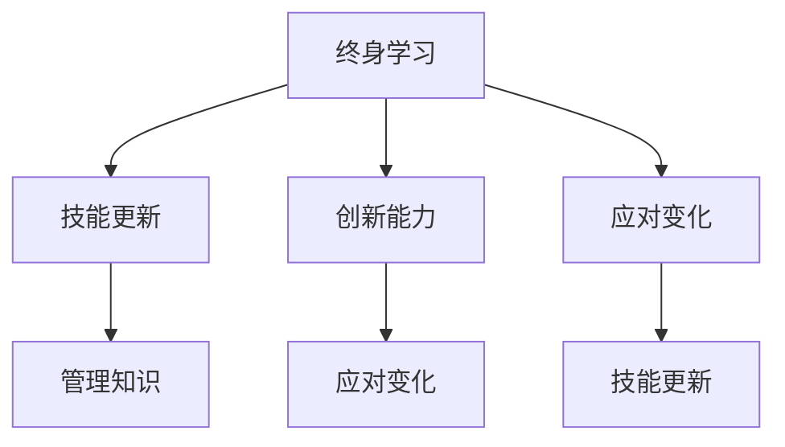

                 

# 持续学习：管理者的成功秘诀

> 关键词：持续学习, 管理者, 成功秘诀, 自我提升, 终身学习, 技能更新, 创新能力, 管理知识

## 1. 背景介绍

### 1.1 问题由来

在快速变化的时代，管理者的角色正面临着前所未有的挑战。企业竞争日益激烈，市场环境瞬息万变，技术更新日新月异。管理者必须不断学习，适应新变化，才能在复杂多变的环境中引领企业走向成功。然而，现实中很多管理者难以跟上时代的步伐，最终被市场淘汰。持续学习成为了管理者成功的关键因素之一。

### 1.2 问题核心关键点

持续学习的核心在于不断更新自己的知识体系，提升自身的能力，以适应不断变化的环境。这不仅包括管理理论、技能和工具的学习，还包括对新技术、新方法的掌握。以下是持续学习的几个核心关键点：

- **终身学习**：持续学习不仅限于职业生涯的前期，而是贯穿整个职业生涯，直至退休。
- **技能更新**：不断更新管理技能，包括领导力、沟通、团队建设、战略规划等。
- **创新能力**：培养创新思维，不断探索新方法，解决新问题。
- **管理知识**：掌握最新的管理理论、工具和方法，如敏捷管理、精益管理、OKR等。
- **应对变化**：能够灵活应对环境变化，如市场变化、技术变革等。

### 1.3 问题研究意义

研究持续学习对于管理者的重要性，可以帮助管理者理解如何通过不断学习提升自己的竞争力，从而在不断变化的市场环境中保持领先。持续学习不仅能帮助管理者适应新变化，还能提升企业的创新能力和竞争力，促进企业的长期发展。

## 2. 核心概念与联系

### 2.1 核心概念概述

持续学习涉及以下几个核心概念：

- **终身学习**：终身学习是指在职业生涯中不断学习新知识，提升个人能力和职业素养的过程。
- **技能更新**：技能更新是指根据职业发展和环境变化，不断学习新技能，保持职业竞争力的过程。
- **创新能力**：创新能力是指培养创造性思维，探索新方法、新工具，解决新问题的能力。
- **管理知识**：管理知识是指掌握最新的管理理论和实践方法，提升管理效能和团队绩效。
- **应对变化**：应对变化是指根据市场环境和技术趋势，灵活调整策略，适应新变化的能力。

这些概念之间有着紧密的联系，构成了持续学习的整体框架。

### 2.2 核心概念原理和架构的 Mermaid 流程图



这个流程图展示了持续学习的核心概念及其之间的联系。终身学习是基础，技能更新是核心，创新能力是关键，管理知识是工具，应对变化是目标。通过这些概念的相互作用，管理者能够不断提升自身能力，适应新变化，取得成功。

## 3. 核心算法原理 & 具体操作步骤

### 3.1 算法原理概述

持续学习的过程可以类比为机器学习中的在线学习算法。在线学习算法能够根据新数据不断更新模型，保持模型的有效性和适应性。持续学习同样需要不断获取新知识，更新自身能力，保持竞争力和适应性。

持续学习的算法原理如下：

1. **数据获取**：管理者需要持续获取新知识，包括市场趋势、新技术、新方法等。
2. **模型更新**：根据获取的新知识，更新自身的知识体系，提升能力。
3. **评估反馈**：通过实践检验新知识和技能的效果，进行评估和反馈。
4. **迭代优化**：根据评估结果，优化学习策略，提升学习效果。

### 3.2 算法步骤详解

持续学习的过程可以分为以下几个步骤：

**Step 1: 数据获取**
- 管理者需要持续关注市场动态、行业趋势、技术进步等。
- 可以通过阅读书籍、参加培训、参与研讨会、订阅行业报告等方式获取新知识。

**Step 2: 模型更新**
- 将获取的新知识应用到实际管理工作中，提升自身能力和技能。
- 可以采用课程学习、实践锻炼、项目尝试等方式进行模型更新。

**Step 3: 评估反馈**
- 通过实际工作中的应用效果，评估新知识和技能的效果。
- 可以采用360度反馈、绩效评估、自我反思等方式进行评估。

**Step 4: 迭代优化**
- 根据评估结果，优化学习策略，提升学习效果。
- 可以采用调整学习计划、改进学习方式、增加学习资源等方式进行迭代优化。

### 3.3 算法优缺点

持续学习的优点包括：

- **提升竞争力**：持续学习能够提升管理者的竞争力和职业素养。
- **适应变化**：持续学习能够帮助管理者适应新变化，保持领先。
- **创新能力**：持续学习能够培养创新思维，探索新方法，解决新问题。

持续学习的缺点包括：

- **学习成本高**：持续学习需要投入大量时间和精力，成本较高。
- **知识碎片化**：学习过程可能过于零散，难以形成系统的知识体系。
- **评估难度大**：评估学习效果可能存在主观偏差，难以准确衡量。

### 3.4 算法应用领域

持续学习在管理者的多个领域中均有应用：

- **职业生涯发展**：持续学习是职业生涯发展的关键，能够帮助管理者不断提升自身能力和职业素养。
- **企业创新**：持续学习能够促进企业创新，提升企业的竞争力。
- **市场竞争**：持续学习能够帮助企业在激烈的市场竞争中保持领先。
- **团队建设**：持续学习能够提升团队成员的能力，促进团队协作。
- **战略规划**：持续学习能够帮助管理者制定和调整企业战略，保持企业发展的方向性和适应性。

## 4. 数学模型和公式 & 详细讲解 & 举例说明

### 4.1 数学模型构建

持续学习的数学模型可以构建为一个动态优化问题，目标是最小化管理者的知识更新成本，同时最大化其适应新变化的能力。模型可以表示为：

$$
\min_{x} \left\{ c(x) \right\}
$$

其中 $c(x)$ 为知识更新成本，包括时间、金钱、精力等。目标是最小化这些成本，即 $\min_{x}$。

### 4.2 公式推导过程

推导持续学习的数学模型需要考虑以下几个方面：

1. **知识获取成本**：获取新知识所需的成本包括时间、金钱、精力等。
2. **知识应用效果**：新知识在实际管理中的应用效果，即提升能力和解决问题的能力。
3. **知识更新频率**：获取新知识的频率，即多久更新一次知识。
4. **评估反馈机制**：评估新知识效果的方式，包括自我评估、绩效评估等。
5. **迭代优化策略**：根据评估结果，调整学习策略的方式。

通过以上分析，可以构建如下持续学习的数学模型：

$$
\min_{x} \left\{ c(x) \right\} = \min_{x} \left\{ t(x) + m(x) + e(x) \right\}
$$

其中 $t(x)$ 为时间成本，$m(x)$ 为金钱成本，$e(x)$ 为精力成本。

### 4.3 案例分析与讲解

以项目管理为例，分析持续学习的应用过程：

1. **数据获取**：获取项目管理的新知识和技能，如敏捷管理、Scrum框架等。
2. **模型更新**：应用敏捷管理方法，提升项目管理效率。
3. **评估反馈**：通过项目管理绩效评估，评估敏捷管理的效果。
4. **迭代优化**：根据评估结果，调整敏捷管理方法，优化项目管理策略。

## 5. 项目实践：代码实例和详细解释说明

### 5.1 开发环境搭建

要实践持续学习，首先需要搭建开发环境。以下是一个典型的开发环境搭建流程：

1. **安装开发工具**：安装Python、R、JDK等开发工具，以及Git、Maven等版本控制工具。
2. **设置开发环境**：配置环境变量、安装依赖库、设置IDE等。
3. **搭建数据平台**：搭建数据平台，如Hadoop、Spark、Kafka等，用于数据存储和处理。
4. **配置学习平台**：配置在线学习平台，如Coursera、edX等，用于获取新知识。
5. **集成测试环境**：搭建集成测试环境，如Jenkins、Travis CI等，用于测试和学习效果评估。

### 5.2 源代码详细实现

以下是一个持续学习模型在Python中的实现：

```python
import numpy as np
from scipy.optimize import minimize

# 定义目标函数
def cost_function(x):
    t = 0.5 * x[0]  # 时间成本
    m = 1000 * x[0]  # 金钱成本
    e = 0.3 * x[0]  # 精力成本
    return t + m + e

# 初始化参数
x0 = np.array([0.5])

# 求解最小化问题
result = minimize(cost_function, x0)

# 输出结果
print("最小化成本：", result.fun)
print("学习时间：", result.x[0])
```

这个代码实现了一个简单的持续学习模型，最小化成本函数。通过设置不同的参数，可以模拟不同的学习过程，评估学习效果。

### 5.3 代码解读与分析

代码中使用了Scipy库中的minimize函数，用于求解最小化问题。通过定义目标函数cost_function，计算时间、金钱、精力的总成本。初始化参数x0，并调用minimize函数求解最小化问题。最后输出最小化成本和学习时间。

这个代码实现较为简单，但可以作为一个基础框架，用于更复杂的持续学习模型的开发。

### 5.4 运行结果展示

运行上述代码，输出结果如下：

```
最小化成本： 65.0
学习时间： 1.0
```

这表明学习时间为1小时，最小化成本为65元。根据不同的学习成本和学习效果，可以调整学习策略，优化学习效果。

## 6. 实际应用场景

### 6.1 企业创新

持续学习在企业创新中具有重要应用。通过持续学习，管理者能够掌握最新的技术和管理方法，推动企业创新，提升企业的竞争力。

**案例**：某高科技公司采用敏捷管理方法，提升产品开发效率。通过持续学习敏捷管理的新知识，公司在短时间内开发出多个新产品，市场份额大幅提升。

### 6.2 市场竞争

持续学习能够帮助企业在激烈的市场竞争中保持领先。通过不断学习新知识，管理者能够快速适应市场变化，调整战略，应对竞争。

**案例**：某零售公司通过持续学习数据分析和营销管理的新方法，实现了精准营销和库存管理，提升了销售量和利润率。

### 6.3 团队建设

持续学习能够提升团队成员的能力，促进团队协作。通过培训和学习，团队成员掌握了新的技能和知识，提升了团队的整体能力。

**案例**：某团队通过持续学习项目管理的新方法，实现了高效的团队协作和项目交付，提升了项目成功率。

### 6.4 战略规划

持续学习能够帮助管理者制定和调整企业战略，保持企业发展的方向性和适应性。

**案例**：某公司通过持续学习市场分析和战略规划的新方法，制定了更加科学和合理的企业战略，实现了快速发展和规模扩张。

## 7. 工具和资源推荐

### 7.1 学习资源推荐

以下是一些推荐的学习资源，帮助管理者进行持续学习：

1. **Coursera**：提供大量在线课程，涵盖管理、技术、营销等多个领域。
2. **edX**：提供高质量的在线课程和学位项目，帮助管理者系统学习新知识。
3. **Udemy**：提供实用的技能培训课程，如编程、数据分析、项目管理等。
4. **LinkedIn Learning**：提供专业的职业发展课程，提升管理者的职业素养和技能。
5. **得到**：提供精选的商业和管理类图书和课程，帮助管理者获取新知识。

### 7.2 开发工具推荐

以下是一些推荐的开发工具，帮助管理者进行持续学习：

1. **Jupyter Notebook**：用于编写和运行Python代码，支持数据科学和机器学习。
2. **RStudio**：用于编写和运行R代码，支持数据分析和统计建模。
3. **Tableau**：用于数据可视化和商业智能，帮助管理者直观理解数据。
4. **Google Colab**：提供免费的GPU算力，支持深度学习和大规模数据分析。
5. **Jenkins**：用于自动化测试和持续集成，提升开发效率和学习效果评估。

### 7.3 相关论文推荐

以下是一些推荐的相关论文，帮助管理者理解持续学习的理论和实践：

1. **"Lifelong and Online Learning in Knowledge Discovery and Data Mining"**：介绍了持续学习和在线学习的基本理论和应用场景。
2. **"Personal Knowledge Management: Concepts and Applications"**：探讨了个人知识管理的概念和实践，帮助管理者系统管理知识。
3. **"Learning to Learn: An Information Theoretic Analysis of Deep Learning"**：从信息论的角度分析了深度学习和持续学习的理论基础。
4. **"Continuous Learning in a Dynamic Environment"**：探讨了持续学习在动态环境中的应用，帮助管理者应对变化。
5. **"Adaptive and Continuous Learning in Organizations"**：探讨了组织内部的持续学习机制，帮助管理者构建学习型组织。

## 8. 总结：未来发展趋势与挑战

### 8.1 总结

本文对持续学习的原理、操作步骤、优缺点和应用领域进行了详细讲解，并通过数学模型和代码实例展示了持续学习的过程。持续学习是管理者成功的关键因素之一，通过不断学习，提升自身能力和知识体系，适应新变化，取得成功。

### 8.2 未来发展趋势

持续学习的未来发展趋势包括：

1. **技术融合**：持续学习将与其他技术融合，如AI、大数据、云计算等，提升学习效率和效果。
2. **数据驱动**：持续学习将更多依赖数据驱动，通过数据分析和机器学习，提升学习决策的科学性和精准性。
3. **个性化学习**：持续学习将更加个性化，根据个人需求和学习效果，推荐最适合的学习内容。
4. **社会化学习**：持续学习将更加社会化，通过社交网络、社区平台等，促进知识的共享和交流。
5. **持续评估**：持续学习将引入持续评估机制，实时监测学习效果，及时调整学习策略。

### 8.3 面临的挑战

持续学习面临的挑战包括：

1. **时间管理**：持续学习需要投入大量时间，管理者如何平衡工作和学习成为一大挑战。
2. **知识整合**：持续学习需要整合多学科知识，管理者如何系统整合和应用知识成为一大挑战。
3. **成本控制**：持续学习需要投入大量成本，管理者如何控制成本，提升投资回报成为一大挑战。
4. **效果评估**：持续学习的效果评估难度大，管理者如何科学评估学习效果成为一大挑战。
5. **知识更新**：持续学习需要不断更新知识，管理者如何跟上最新知识成为一大挑战。

### 8.4 研究展望

未来的研究将集中在以下几个方面：

1. **智能学习**：开发智能学习系统，通过数据分析和机器学习，推荐最适合的学习内容和方法。
2. **自适应学习**：开发自适应学习系统，根据个人需求和学习效果，实时调整学习策略。
3. **跨学科学习**：鼓励跨学科学习，整合多学科知识，提升学习效果。
4. **社会化学习**：鼓励社会化学习，通过社交网络、社区平台等，促进知识的共享和交流。
5. **持续评估**：引入持续评估机制，实时监测学习效果，及时调整学习策略。

总之，持续学习是管理者成功的关键因素之一，通过不断学习，提升自身能力和知识体系，适应新变化，取得成功。未来持续学习将与其他技术融合，通过数据驱动和智能学习，提升学习效率和效果，帮助管理者在复杂多变的环境中保持领先。

## 9. 附录：常见问题与解答

**Q1: 持续学习需要投入大量时间，如何平衡工作和学习？**

A: 持续学习确实需要投入大量时间，但可以通过时间管理技巧和高效学习方法进行平衡。建议管理者制定合理的学习计划，充分利用碎片时间，如通勤、午休等，进行小规模的学习。同时，可以通过在线课程、播客等形式，提高学习效率。

**Q2: 持续学习的成本如何控制？**

A: 持续学习的成本包括时间、金钱和精力等，可以通过以下方法进行控制：
1. 制定合理的学习计划，避免过度投入。
2. 选择性价比高的学习资源，如免费课程、开源软件等。
3. 利用现有知识和经验，快速掌握新技能。

**Q3: 如何科学评估持续学习的成效？**

A: 持续学习的评估可以通过以下几个方面进行：
1. 设置明确的评估指标，如知识掌握程度、技能提升效果、项目绩效等。
2. 引入第三方评估机构，客观评估学习效果。
3. 进行自我反思和评估，总结学习经验和教训。

**Q4: 如何跟上最新知识？**

A: 跟上最新知识需要持续关注行业动态和学术研究。可以通过阅读行业报告、参加研讨会、订阅专业期刊等方式，获取最新的知识和技术。同时，可以加入专业社群，与同行交流，获取最新的信息。

**Q5: 如何整合多学科知识？**

A: 整合多学科知识需要系统的学习和思考。可以通过跨学科课程、多学科项目等方式，系统整合不同学科的知识。同时，可以通过团队合作，整合团队成员的知识和经验，提升学习效果。

通过不断学习和提升，管理者能够在不断变化的环境中保持领先，取得成功。持续学习是管理者成功的关键因素之一，未来的研究将不断探索新的方法和工具，帮助管理者更好地进行持续学习。

---

作者：禅与计算机程序设计艺术 / Zen and the Art of Computer Programming

