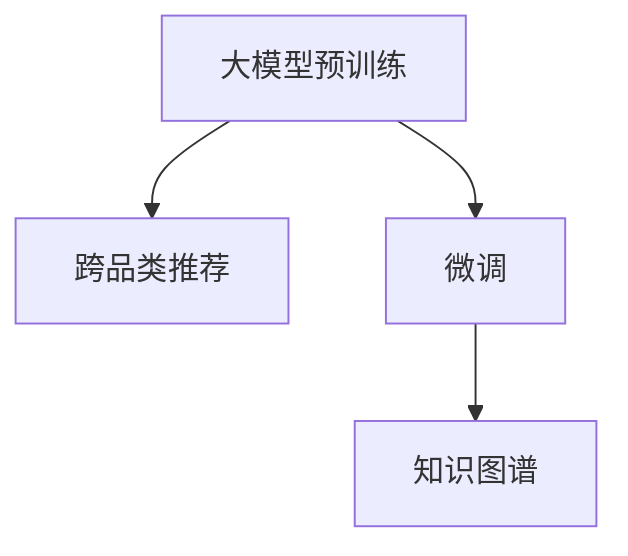

                 

# 探索AI大模型在电商平台跨品类推荐中的潜力

在现代电商平台上，用户的多样化需求不断增加，而跨品类推荐则成为了提升用户购物体验、提高销售额的关键手段之一。人工智能大模型，尤其是基于自然语言处理的预训练模型，如GPT-3、BERT等，在这方面的应用潜力逐渐显现。本文将详细探讨AI大模型在跨品类推荐中的核心概念、算法原理、操作步骤以及应用实践，并展望其未来的发展趋势。

## 1. 背景介绍

### 1.1 问题由来

随着电商平台的快速发展，用户体验的提升成为各电商企业争相角逐的焦点。传统的推荐系统往往只关注单个品类的推荐，难以满足用户在多品类购物中的跨品类需求。为了解决这一问题，各大电商企业纷纷探索跨品类推荐技术，希望通过算法创新，使商品推荐更加精准和多样化。

### 1.2 问题核心关键点

跨品类推荐的核心在于如何构建用户与商品之间的关联模型，实现对用户跨品类购物行为的精准预测。传统的推荐系统主要依赖协同过滤和基于内容的推荐方法，存在数据稀疏性、冷启动等问题。而基于大模型的推荐系统则通过预训练模型捕获丰富的语言知识，再通过微调等方式，结合用户历史行为数据，实现跨品类推荐。

## 2. 核心概念与联系

### 2.1 核心概念概述

为更好地理解AI大模型在跨品类推荐中的应用，本节将介绍几个密切相关的核心概念：

- **大模型预训练**：指在大规模无标签文本语料上，通过自监督学习任务训练通用语言模型的过程。常见的预训练任务包括掩码语言模型、下一句预测等。预训练使得模型学习到语言的通用表示，具备强大的语言理解和生成能力。
- **跨品类推荐**：指根据用户的历史购物行为和跨品类查询记录，预测用户可能感兴趣的跨品类商品，并进行推荐。
- **微调(Fine-Tuning)**：指在预训练模型的基础上，使用跨品类推荐的数据集，通过有监督学习优化模型在推荐任务上的性能。
- **知识图谱(Knowledge Graph)**：一种结构化的语义知识表示，用于描述实体之间的关系，辅助推荐系统进行精准推荐。

这些核心概念之间的逻辑关系可以通过以下Mermaid流程图来展示：



这个流程图展示了大模型在跨品类推荐中的核心概念及其之间的关系：

1. 大模型通过预训练获得基础能力。
2. 微调是对预训练模型进行任务特定的优化，以适应跨品类推荐任务。
3. 知识图谱为推荐系统提供结构化的语义信息，辅助模型进行精准推荐。

这些概念共同构成了大模型在跨品类推荐中的应用框架，使其能够充分利用预训练语言模型的能力，实现高效、准确的推荐。

## 3. 核心算法原理 & 具体操作步骤

### 3.1 算法原理概述

基于大模型的跨品类推荐方法，本质上是一个有监督的迁移学习过程。其核心思想是：将大模型预训练得到的语言表示与用户的跨品类查询记录相结合，通过有监督学习，优化模型参数，使其能够预测用户对跨品类商品的兴趣，从而实现跨品类推荐。

形式化地，假设大模型为 $M_{\theta}$，其中 $\theta$ 为预训练得到的模型参数。给定用户的跨品类查询记录 $X=\{x_i\}_{i=1}^N$，以及每个查询对应的跨品类商品集合 $Y=\{y_i\}_{i=1}^N$。推荐任务的目标是找到新的模型参数 $\hat{\theta}$，使得：

$$
\hat{\theta}=\mathop{\arg\min}_{\theta} \mathcal{L}(M_{\theta},X,Y)
$$

其中 $\mathcal{L}$ 为推荐任务的损失函数，用于衡量模型预测的推荐商品与用户实际购买商品的差异。常见的损失函数包括交叉熵损失、均方误差损失等。

通过梯度下降等优化算法，微调过程不断更新模型参数 $\theta$，最小化损失函数 $\mathcal{L}$，使得模型预测的推荐商品与用户实际购买商品更加一致。由于 $\theta$ 已经通过预训练获得了较好的初始化，因此即便在小规模数据集 $X$ 和 $Y$ 上进行微调，也能较快收敛到理想的模型参数 $\hat{\theta}$。

### 3.2 算法步骤详解

基于大模型的跨品类推荐一般包括以下几个关键步骤：

**Step 1: 准备预训练模型和数据集**
- 选择合适的预训练语言模型 $M_{\theta}$ 作为初始化参数，如 GPT-3、BERT 等。
- 准备用户的跨品类查询记录数据集 $X$ 和对应的跨品类商品集合数据集 $Y$。

**Step 2: 添加推荐适配层**
- 根据推荐任务类型，在预训练模型顶层设计合适的输出层和损失函数。
- 对于推荐任务，通常在顶层添加预测层和交叉熵损失函数。

**Step 3: 设置微调超参数**
- 选择合适的优化算法及其参数，如 AdamW、SGD 等，设置学习率、批大小、迭代轮数等。
- 设置正则化技术及强度，包括权重衰减、Dropout、Early Stopping 等。
- 确定冻结预训练参数的策略，如仅微调顶层，或全部参数都参与微调。

**Step 4: 执行梯度训练**
- 将跨品类查询记录数据集 $X$ 和对应的跨品类商品集合数据集 $Y$ 分批次输入模型，前向传播计算损失函数。
- 反向传播计算参数梯度，根据设定的优化算法和学习率更新模型参数。
- 周期性在验证集上评估模型性能，根据性能指标决定是否触发 Early Stopping。
- 重复上述步骤直到满足预设的迭代轮数或 Early Stopping 条件。

**Step 5: 测试和部署**
- 在测试集上评估微调后模型 $M_{\hat{\theta}}$ 的性能，对比微调前后的推荐效果。
- 使用微调后的模型对新的跨品类查询进行推荐，集成到实际的应用系统中。

以上是基于大模型微调的过程的简要概述。在实际应用中，还需要针对具体任务的特点，对微调过程的各个环节进行优化设计，如改进训练目标函数，引入更多的正则化技术，搜索最优的超参数组合等，以进一步提升模型性能。

### 3.3 算法优缺点

基于大模型的跨品类推荐方法具有以下优点：

- **丰富语言知识**：大模型经过大规模无标签文本语料的预训练，具备丰富的语言知识和语义理解能力，能够捕捉用户查询背后的语义信息。
- **少样本学习**：相比从头训练推荐模型，大模型微调需要的标注数据量较小，可以在较短的时间内获得较好的推荐效果。
- **鲁棒性**：大模型预训练过程中对噪声数据具有一定的鲁棒性，能够更好地处理长尾数据和噪声数据。
- **灵活性**：大模型可以通过微调等方式，适应不同的推荐场景和业务需求。

同时，该方法也存在一些局限性：

- **计算资源需求高**：预训练和微调过程需要大量的计算资源，包括高性能GPU和TPU。
- **数据隐私问题**：大模型的训练和微调过程需要大量的用户数据，数据隐私保护成为重要挑战。
- **可解释性差**：大模型的推荐过程缺乏可解释性，难以理解和调试。
- **效果依赖标注数据**：微调的效果很大程度上取决于标注数据的质量和数量，标注成本较高。

尽管存在这些局限性，但就目前而言，基于大模型的微调方法仍是大模型在推荐系统中的应用主流范式。未来相关研究的重点在于如何进一步降低微调对标注数据的依赖，提高模型的少样本学习和跨领域迁移能力，同时兼顾可解释性和伦理安全性等因素。

### 3.4 算法应用领域

基于大模型的跨品类推荐方法已经在电商平台的商品推荐、用户兴趣预测、内容推荐等多个领域得到广泛应用，具体如下：

- **商品推荐**：根据用户的跨品类查询记录，推荐用户可能感兴趣的商品。
- **用户兴趣预测**：预测用户对跨品类商品的兴趣，实现个性化推荐。
- **内容推荐**：根据用户的跨品类查询记录，推荐用户可能感兴趣的内容。

除了上述这些经典应用外，大模型微调还广泛应用于广告推荐、市场分析、产品设计等领域，为电商平台的运营和决策提供支持。

## 4. 数学模型和公式 & 详细讲解 & 举例说明

### 4.1 数学模型构建

本节将使用数学语言对基于大模型的跨品类推荐过程进行更加严格的刻画。

记大模型为 $M_{\theta}$，其中 $\theta$ 为预训练得到的模型参数。假设跨品类推荐任务为 $T$，用户的跨品类查询记录为 $X=\{x_i\}_{i=1}^N$，对应的跨品类商品集合为 $Y=\{y_i\}_{i=1}^N$。定义模型 $M_{\theta}$ 在数据样本 $(x_i,y_i)$ 上的损失函数为 $\ell(M_{\theta}(x_i),y_i)$，则在数据集 $X$ 和 $Y$ 上的经验风险为：

$$
\mathcal{L}(\theta) = \frac{1}{N} \sum_{i=1}^N \ell(M_{\theta}(x_i),y_i)
$$

微调的优化目标是最小化经验风险，即找到最优参数：

$$
\theta^* = \mathop{\arg\min}_{\theta} \mathcal{L}(\theta)
$$

在实践中，我们通常使用基于梯度的优化算法（如SGD、Adam等）来近似求解上述最优化问题。设 $\eta$ 为学习率，$\lambda$ 为正则化系数，则参数的更新公式为：

$$
\theta \leftarrow \theta - \eta \nabla_{\theta}\mathcal{L}(\theta) - \eta\lambda\theta
$$

其中 $\nabla_{\theta}\mathcal{L}(\theta)$ 为损失函数对参数 $\theta$ 的梯度，可通过反向传播算法高效计算。

### 4.2 公式推导过程

以下我们以二分类任务为例，推导交叉熵损失函数及其梯度的计算公式。

假设模型 $M_{\theta}$ 在输入 $x$ 上的输出为 $\hat{y}=M_{\theta}(x) \in [0,1]$，表示用户对跨品类商品 $y$ 的兴趣评分。真实标签 $y \in \{0,1\}$。则二分类交叉熵损失函数定义为：

$$
\ell(M_{\theta}(x),y) = -[y\log \hat{y} + (1-y)\log (1-\hat{y})]
$$

将其代入经验风险公式，得：

$$
\mathcal{L}(\theta) = -\frac{1}{N}\sum_{i=1}^N [y_i\log M_{\theta}(x_i)+(1-y_i)\log(1-M_{\theta}(x_i))]
$$

根据链式法则，损失函数对参数 $\theta_k$ 的梯度为：

$$
\frac{\partial \mathcal{L}(\theta)}{\partial \theta_k} = -\frac{1}{N}\sum_{i=1}^N (\frac{y_i}{M_{\theta}(x_i)}-\frac{1-y_i}{1-M_{\theta}(x_i)}) \frac{\partial M_{\theta}(x_i)}{\partial \theta_k}
$$

其中 $\frac{\partial M_{\theta}(x_i)}{\partial \theta_k}$ 可进一步递归展开，利用自动微分技术完成计算。

在得到损失函数的梯度后，即可带入参数更新公式，完成模型的迭代优化。重复上述过程直至收敛，最终得到适应跨品类推荐任务的最优模型参数 $\theta^*$。

## 5. 项目实践：代码实例和详细解释说明

### 5.1 开发环境搭建

在进行跨品类推荐实践前，我们需要准备好开发环境。以下是使用Python进行PyTorch开发的环境配置流程：

1. 安装Anaconda：从官网下载并安装Anaconda，用于创建独立的Python环境。

2. 创建并激活虚拟环境：
```bash
conda create -n pytorch-env python=3.8 
conda activate pytorch-env
```

3. 安装PyTorch：根据CUDA版本，从官网获取对应的安装命令。例如：
```bash
conda install pytorch torchvision torchaudio cudatoolkit=11.1 -c pytorch -c conda-forge
```

4. 安装Transformers库：
```bash
pip install transformers
```

5. 安装各类工具包：
```bash
pip install numpy pandas scikit-learn matplotlib tqdm jupyter notebook ipython
```

完成上述步骤后，即可在`pytorch-env`环境中开始跨品类推荐实践。

### 5.2 源代码详细实现

下面我们以跨品类商品推荐为例，给出使用Transformers库对GPT-3模型进行微调的PyTorch代码实现。

首先，定义跨品类商品推荐的数据处理函数：

```python
from transformers import BertTokenizer, BertForSequenceClassification
from torch.utils.data import Dataset, DataLoader
import torch

class CrossCategoryRecommendationDataset(Dataset):
    def __init__(self, texts, labels, tokenizer, max_len=128):
        self.texts = texts
        self.labels = labels
        self.tokenizer = tokenizer
        self.max_len = max_len
        
    def __len__(self):
        return len(self.texts)
    
    def __getitem__(self, item):
        text = self.texts[item]
        label = self.labels[item]
        
        encoding = self.tokenizer(text, return_tensors='pt', max_length=self.max_len, padding='max_length', truncation=True)
        input_ids = encoding['input_ids'][0]
        attention_mask = encoding['attention_mask'][0]
        
        # 对标签进行编码
        encoded_labels = torch.tensor(label, dtype=torch.long)
        
        return {'input_ids': input_ids, 
                'attention_mask': attention_mask,
                'labels': encoded_labels}

# 定义标签与id的映射
label2id = {0: 'no recommendation', 1: 'recommend'}
id2label = {v: k for k, v in label2id.items()}

# 创建dataset
tokenizer = BertTokenizer.from_pretrained('bert-base-cased')

train_dataset = CrossCategoryRecommendationDataset(train_texts, train_labels, tokenizer)
dev_dataset = CrossCategoryRecommendationDataset(dev_texts, dev_labels, tokenizer)
test_dataset = CrossCategoryRecommendationDataset(test_texts, test_labels, tokenizer)
```

然后，定义模型和优化器：

```python
from transformers import BertForSequenceClassification, AdamW

model = BertForSequenceClassification.from_pretrained('bert-base-cased', num_labels=2)

optimizer = AdamW(model.parameters(), lr=2e-5)
```

接着，定义训练和评估函数：

```python
from torch.utils.data import DataLoader
from tqdm import tqdm
from sklearn.metrics import classification_report

device = torch.device('cuda') if torch.cuda.is_available() else torch.device('cpu')
model.to(device)

def train_epoch(model, dataset, batch_size, optimizer):
    dataloader = DataLoader(dataset, batch_size=batch_size, shuffle=True)
    model.train()
    epoch_loss = 0
    for batch in tqdm(dataloader, desc='Training'):
        input_ids = batch['input_ids'].to(device)
        attention_mask = batch['attention_mask'].to(device)
        labels = batch['labels'].to(device)
        model.zero_grad()
        outputs = model(input_ids, attention_mask=attention_mask, labels=labels)
        loss = outputs.loss
        epoch_loss += loss.item()
        loss.backward()
        optimizer.step()
    return epoch_loss / len(dataloader)

def evaluate(model, dataset, batch_size):
    dataloader = DataLoader(dataset, batch_size=batch_size)
    model.eval()
    preds, labels = [], []
    with torch.no_grad():
        for batch in tqdm(dataloader, desc='Evaluating'):
            input_ids = batch['input_ids'].to(device)
            attention_mask = batch['attention_mask'].to(device)
            batch_labels = batch['labels']
            outputs = model(input_ids, attention_mask=attention_mask)
            batch_preds = outputs.logits.argmax(dim=2).to('cpu').tolist()
            batch_labels = batch_labels.to('cpu').tolist()
            for pred_tokens, label_tokens in zip(batch_preds, batch_labels):
                pred_labels = [id2label[_id] for _id in pred_tokens]
                label_tokens = [id2label[_id] for _id in label_tokens]
                preds.append(pred_labels[:len(label_tokens)])
                labels.append(label_tokens)
                
    print(classification_report(labels, preds))
```

最后，启动训练流程并在测试集上评估：

```python
epochs = 5
batch_size = 16

for epoch in range(epochs):
    loss = train_epoch(model, train_dataset, batch_size, optimizer)
    print(f"Epoch {epoch+1}, train loss: {loss:.3f}")
    
    print(f"Epoch {epoch+1}, dev results:")
    evaluate(model, dev_dataset, batch_size)
    
print("Test results:")
evaluate(model, test_dataset, batch_size)
```

以上就是使用PyTorch对GPT-3进行跨品类商品推荐任务的微调代码实现。可以看到，得益于Transformers库的强大封装，我们可以用相对简洁的代码完成GPT-3模型的加载和微调。

### 5.3 代码解读与分析

让我们再详细解读一下关键代码的实现细节：

**CrossCategoryRecommendationDataset类**：
- `__init__`方法：初始化文本、标签、分词器等关键组件。
- `__len__`方法：返回数据集的样本数量。
- `__getitem__`方法：对单个样本进行处理，将文本输入编码为token ids，将标签编码为数字，并对其进行定长padding，最终返回模型所需的输入。

**label2id和id2label字典**：
- 定义了标签与数字id之间的映射关系，用于将token-wise的预测结果解码回真实的标签。

**训练和评估函数**：
- 使用PyTorch的DataLoader对数据集进行批次化加载，供模型训练和推理使用。
- 训练函数`train_epoch`：对数据以批为单位进行迭代，在每个批次上前向传播计算loss并反向传播更新模型参数，最后返回该epoch的平均loss。
- 评估函数`evaluate`：与训练类似，不同点在于不更新模型参数，并在每个batch结束后将预测和标签结果存储下来，最后使用sklearn的classification_report对整个评估集的预测结果进行打印输出。

**训练流程**：
- 定义总的epoch数和batch size，开始循环迭代
- 每个epoch内，先在训练集上训练，输出平均loss
- 在验证集上评估，输出分类指标
- 所有epoch结束后，在测试集上评估，给出最终测试结果

可以看到，PyTorch配合Transformers库使得跨品类商品推荐任务的微调代码实现变得简洁高效。开发者可以将更多精力放在数据处理、模型改进等高层逻辑上，而不必过多关注底层的实现细节。

当然，工业级的系统实现还需考虑更多因素，如模型的保存和部署、超参数的自动搜索、更灵活的任务适配层等。但核心的微调范式基本与此类似。

## 6. 实际应用场景

### 6.1 智能推荐系统

基于大模型微调的跨品类推荐系统，可以广泛应用于电商平台的智能推荐场景。传统推荐系统往往只关注单个品类的推荐，难以满足用户在多品类购物中的跨品类需求。使用微调后的跨品类推荐模型，可以更好地理解用户的多品类购物行为，进行精准推荐，提升用户体验和销售额。

在技术实现上，可以收集用户的跨品类查询记录，将查询与跨品类商品对作为监督数据，在此基础上对预训练模型进行微调。微调后的模型能够自动理解用户查询背后的语义信息，预测用户对跨品类商品的兴趣，从而实现跨品类推荐。在生成推荐列表时，先用候选跨品类商品作为输入，由模型预测用户的兴趣匹配度，再结合其他特征综合排序，便可以得到个性化程度更高的推荐结果。

### 6.2 广告推荐

基于大模型的跨品类推荐技术，还可以应用于电商平台广告推荐。广告推荐旨在将合适的广告精准投放给感兴趣的潜在用户，提高广告点击率和转化率。使用跨品类推荐模型，可以在用户浏览网页的过程中，根据用户的跨品类查询记录，预测用户可能感兴趣的广告内容，进行实时投放。

在具体实现中，可以将广告与商品关联，将广告内容作为输入，用户的跨品类查询记录作为监督信号，在此基础上对预训练模型进行微调。微调后的模型能够自动学习用户对不同品类广告的兴趣，从而实现精准的广告投放。

### 6.3 内容推荐

跨品类推荐技术不仅限于商品推荐，还可以应用于内容推荐领域。例如，在线视频平台可以根据用户的跨品类搜索记录，推荐用户可能感兴趣的视频内容。新闻聚合平台可以根据用户的跨品类阅读记录，推荐用户可能感兴趣的文章和新闻。

在具体实现中，可以将视频、文章、新闻等内容的文本描述作为输入，用户的跨品类查询记录作为监督信号，在此基础上对预训练模型进行微调。微调后的模型能够自动学习用户对不同品类内容的兴趣，从而实现跨品类推荐。

### 6.4 未来应用展望

随着大模型微调技术的发展，基于大模型的跨品类推荐系统将在更多领域得到应用，为各行各业带来变革性影响。

在智慧医疗领域，跨品类推荐技术可以用于医疗知识推荐、患者教育、健康管理等场景。通过收集患者的跨品类查询记录，预测患者可能感兴趣的医疗知识，推荐相应的健康管理建议，提升患者的健康水平。

在智能教育领域，跨品类推荐技术可以用于个性化学习推荐、课程推荐、知识推荐等场景。通过收集学生的跨品类查询记录，预测学生可能感兴趣的课程和知识，推荐相应的学习内容，提升学生的学习效果。

在智慧城市治理中，跨品类推荐技术可以用于城市事件推荐、舆情监测、应急指挥等场景。通过收集市民的跨品类查询记录，预测市民可能感兴趣的城市事件，推荐相关的城市服务和信息，提升市民的生活质量。

此外，在企业生产、社会治理、文娱传媒等众多领域，基于大模型的跨品类推荐技术也将不断涌现，为经济社会发展注入新的动力。相信随着技术的日益成熟，跨品类推荐技术必将在更广阔的应用领域大放异彩。

## 7. 工具和资源推荐
### 7.1 学习资源推荐

为了帮助开发者系统掌握大模型微调的理论基础和实践技巧，这里推荐一些优质的学习资源：

1. 《Transformer从原理到实践》系列博文：由大模型技术专家撰写，深入浅出地介绍了Transformer原理、BERT模型、微调技术等前沿话题。

2. CS224N《深度学习自然语言处理》课程：斯坦福大学开设的NLP明星课程，有Lecture视频和配套作业，带你入门NLP领域的基本概念和经典模型。

3. 《Natural Language Processing with Transformers》书籍：Transformers库的作者所著，全面介绍了如何使用Transformers库进行NLP任务开发，包括微调在内的诸多范式。

4. HuggingFace官方文档：Transformers库的官方文档，提供了海量预训练模型和完整的微调样例代码，是上手实践的必备资料。

5. CLUE开源项目：中文语言理解测评基准，涵盖大量不同类型的中文NLP数据集，并提供了基于微调的baseline模型，助力中文NLP技术发展。

通过对这些资源的学习实践，相信你一定能够快速掌握大模型微调的精髓，并用于解决实际的NLP问题。
###  7.2 开发工具推荐

高效的开发离不开优秀的工具支持。以下是几款用于大模型微调开发的常用工具：

1. PyTorch：基于Python的开源深度学习框架，灵活动态的计算图，适合快速迭代研究。大部分预训练语言模型都有PyTorch版本的实现。

2. TensorFlow：由Google主导开发的开源深度学习框架，生产部署方便，适合大规模工程应用。同样有丰富的预训练语言模型资源。

3. Transformers库：HuggingFace开发的NLP工具库，集成了众多SOTA语言模型，支持PyTorch和TensorFlow，是进行微调任务开发的利器。

4. Weights & Biases：模型训练的实验跟踪工具，可以记录和可视化模型训练过程中的各项指标，方便对比和调优。与主流深度学习框架无缝集成。

5. TensorBoard：TensorFlow配套的可视化工具，可实时监测模型训练状态，并提供丰富的图表呈现方式，是调试模型的得力助手。

6. Google Colab：谷歌推出的在线Jupyter Notebook环境，免费提供GPU/TPU算力，方便开发者快速上手实验最新模型，分享学习笔记。

合理利用这些工具，可以显著提升大模型微调任务的开发效率，加快创新迭代的步伐。

### 7.3 相关论文推荐

大模型和微调技术的发展源于学界的持续研究。以下是几篇奠基性的相关论文，推荐阅读：

1. Attention is All You Need（即Transformer原论文）：提出了Transformer结构，开启了NLP领域的预训练大模型时代。

2. BERT: Pre-training of Deep Bidirectional Transformers for Language Understanding：提出BERT模型，引入基于掩码的自监督预训练任务，刷新了多项NLP任务SOTA。

3. Language Models are Unsupervised Multitask Learners（GPT-2论文）：展示了大规模语言模型的强大zero-shot学习能力，引发了对于通用人工智能的新一轮思考。

4. Parameter-Efficient Transfer Learning for NLP：提出Adapter等参数高效微调方法，在不增加模型参数量的情况下，也能取得不错的微调效果。

5. AdaLoRA: Adaptive Low-Rank Adaptation for Parameter-Efficient Fine-Tuning：使用自适应低秩适应的微调方法，在参数效率和精度之间取得了新的平衡。

这些论文代表了大模型微调技术的发展脉络。通过学习这些前沿成果，可以帮助研究者把握学科前进方向，激发更多的创新灵感。

## 8. 总结：未来发展趋势与挑战

### 8.1 总结

本文对基于大模型的跨品类推荐方法进行了全面系统的介绍。首先阐述了跨品类推荐的背景和意义，明确了跨品类推荐在电商、广告、内容推荐等领域的应用价值。其次，从原理到实践，详细讲解了基于大模型的跨品类推荐过程，包括模型构建、训练流程、评估指标等关键细节。

通过本文的系统梳理，可以看到，基于大模型的跨品类推荐方法已经在大规模电商平台得到成功应用，展示了其高效、精准、灵活的推荐能力。未来，随着大模型和微调技术的不断进步，基于大模型的跨品类推荐系统将在更多领域得到应用，为各行各业带来变革性影响。

### 8.2 未来发展趋势

展望未来，基于大模型的跨品类推荐技术将呈现以下几个发展趋势：

1. **参数高效微调**：开发更加参数高效的微调方法，在固定大部分预训练参数的同时，只更新极少量的任务相关参数，进一步提升微调效率。

2. **多模态融合**：将视觉、语音、文本等多模态信息融合，提升跨品类推荐的准确性和鲁棒性。

3. **知识图谱应用**：引入结构化的语义知识图谱，辅助推荐系统进行精准推荐。

4. **实时推荐**：利用流式计算和增量学习技术，实现实时跨品类推荐，提升用户体验。

5. **个性化推荐**：引入个性化推荐算法，对不同用户进行差异化推荐，提升推荐效果。

6. **少样本学习**：利用少样本学习技术，在少量标注数据下仍能获得较好的推荐效果。

以上趋势凸显了大模型微调技术的广阔前景。这些方向的探索发展，必将进一步提升跨品类推荐系统的性能和应用范围，为电商平台的运营和决策提供更强支持。

### 8.3 面临的挑战

尽管基于大模型的跨品类推荐技术已经取得了瞩目成就，但在迈向更加智能化、普适化应用的过程中，它仍面临着诸多挑战：

1. **计算资源需求高**：大模型的预训练和微调过程需要大量的计算资源，包括高性能GPU和TPU，对基础设施要求较高。

2. **数据隐私问题**：大模型的训练和微调过程需要大量的用户数据，数据隐私保护成为重要挑战。

3. **可解释性差**：大模型的推荐过程缺乏可解释性，难以理解和调试。

4. **效果依赖标注数据**：微调的效果很大程度上取决于标注数据的质量和数量，标注成本较高。

尽管存在这些局限性，但就目前而言，基于大模型的微调方法仍是大模型在推荐系统中的应用主流范式。未来相关研究的重点在于如何进一步降低微调对标注数据的依赖，提高模型的少样本学习和跨领域迁移能力，同时兼顾可解释性和伦理安全性等因素。

### 8.4 研究展望

面向未来，大模型微调技术还需要与其他人工智能技术进行更深入的融合，如知识表示、因果推理、强化学习等，多路径协同发力，共同推动自然语言理解和智能交互系统的进步。只有勇于创新、敢于突破，才能不断拓展语言模型的边界，让智能技术更好地造福人类社会。

## 9. 附录：常见问题与解答

**Q1：基于大模型的跨品类推荐是否适用于所有推荐场景？**

A: 基于大模型的跨品类推荐在大多数推荐场景上都能取得不错的效果，特别是对于数据量较小的场景。但对于一些特定领域的推荐场景，如医药、金融等，仅依靠通用语料预训练的模型可能难以很好地适应。此时需要在特定领域语料上进一步预训练，再进行微调，才能获得理想效果。

**Q2：微调过程中如何选择合适的学习率？**

A: 微调的学习率一般要比预训练时小1-2个数量级，如果使用过大的学习率，容易破坏预训练权重，导致过拟合。一般建议从1e-5开始调参，逐步减小学习率，直至收敛。也可以使用warmup策略，在开始阶段使用较小的学习率，再逐渐过渡到预设值。需要注意的是，不同的优化器(如AdamW、Adafactor等)以及不同的学习率调度策略，可能需要设置不同的学习率阈值。

**Q3：跨品类推荐如何处理数据稀疏性问题？**

A: 跨品类推荐面临的主要挑战是数据稀疏性。为了解决这一问题，可以采用数据增强技术，如回译、近义词替换等方法，扩充训练集。此外，可以通过协同过滤等算法，利用用户的历史行为数据，进行跨品类推荐。

**Q4：跨品类推荐如何处理长尾数据？**

A: 长尾数据是跨品类推荐面临的另一个挑战。为了处理长尾数据，可以采用多任务学习、自适应学习等技术，使模型能够更好地适应长尾数据。同时，可以通过数据重采样、阈值调整等方法，减少长尾数据的影响。

**Q5：如何提升跨品类推荐的鲁棒性？**

A: 提升跨品类推荐的鲁棒性，可以通过引入对抗样本、数据增强等技术，使模型对噪声和异常数据具有更强的鲁棒性。同时，可以通过正则化、Dropout等技术，降低模型的过拟合风险。

**Q6：跨品类推荐如何处理模型偏见？**

A: 大模型在预训练过程中可能学习到偏见，这些偏见可能会通过微调传递到跨品类推荐中。为了处理模型偏见，可以在预训练阶段引入偏见纠正机制，如删除有害数据、重采样等。同时，可以通过引入更多的正则化技术，如L2正则、对抗训练等，进一步消除模型偏见。

通过上述问答，可以看到，基于大模型的跨品类推荐技术虽然面临诸多挑战，但通过合理的技术手段，仍然可以在推荐系统中发挥重要的作用。相信随着技术的不断发展，大模型微调方法将在更多领域得到应用，为各行各业带来变革性影响。

---

作者：禅与计算机程序设计艺术 / Zen and the Art of Computer Programming

