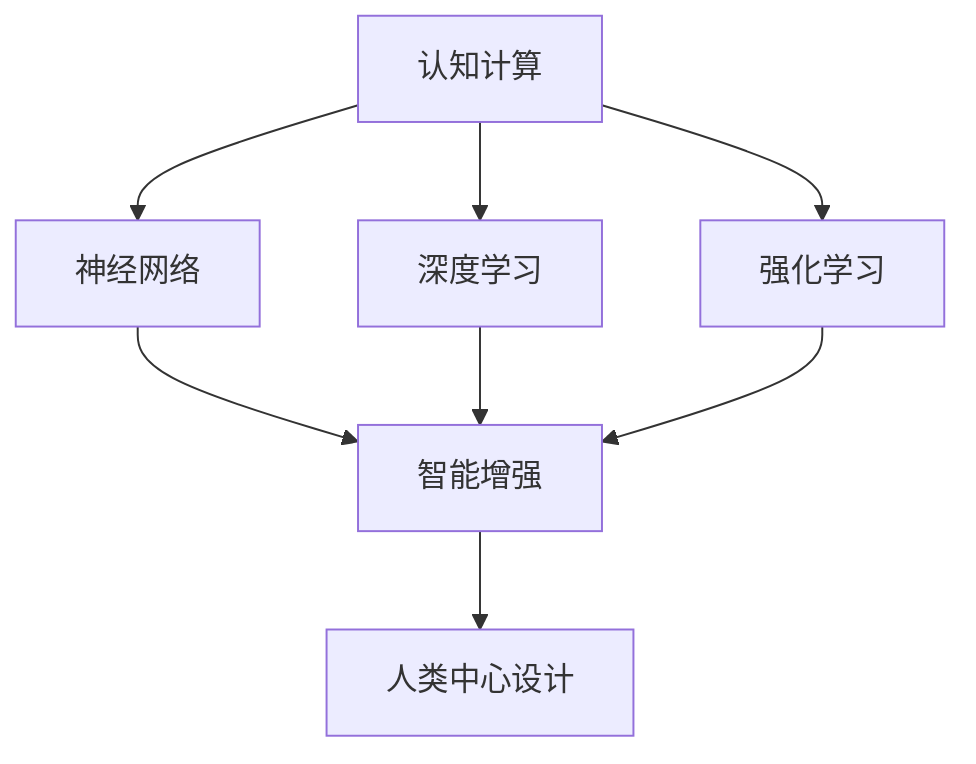

                 

# 探索人类认知的边界：人类计算的科学意义

> 关键词：认知计算, 人类计算, 人工智能, 智能增强, 人类中心设计

## 1. 背景介绍

### 1.1 问题由来

随着计算技术的飞速发展，人类计算已经不再局限于传统的计算机与数字处理，而是逐步拓展至认知计算（Cognitive Computing）领域。认知计算是指通过模拟人类大脑的工作机制，进行信息处理、模式识别、决策分析等复杂的认知任务。

近年来，认知计算的研究成果在多个领域得到了广泛应用，包括医疗诊断、金融风险评估、教育辅助、社交网络分析等。这些应用提升了人类认知能力，但同时也引发了对于人类计算科学意义的深刻思考。

### 1.2 问题核心关键点

人类计算的科学意义主要体现在以下几个方面：

- **认知模型：** 模拟人类认知过程的计算模型，能够处理更加复杂、抽象的信息。
- **人机协同：** 将人类智慧与计算能力相结合，提升决策和问题解决能力。
- **伦理道德：** 认知计算在应用过程中，如何平衡技术与伦理，维护人的尊严和隐私。
- **社会影响：** 人类计算技术对社会结构、文化、价值观等的长远影响。

## 2. 核心概念与联系

### 2.1 核心概念概述

为更好地理解人类计算的科学意义，本节将介绍几个核心概念：

- **认知计算：** 通过模拟人类认知过程，进行信息处理和决策分析的计算模式。主要技术包括知识表示、推理、自然语言理解等。
- **神经网络：** 受人类神经系统启发，通过多层非线性变换进行特征提取和模式识别的计算模型。
- **深度学习：** 一种基于神经网络的学习算法，通过多层次的特征学习，实现复杂模式识别和决策。
- **强化学习：** 通过试错和反馈机制，优化决策策略的学习算法。
- **智能增强：** 将智能系统与人类认知相结合，提升决策和问题解决能力的技术。
- **人类中心设计：** 强调以人为中心，设计能更好服务于人类需求和价值的计算系统。

这些概念之间的逻辑关系可以通过以下Mermaid流程图来展示：



这个流程图展示了几大核心概念及其之间的关系：

1. 认知计算通过模拟人类认知过程，支持复杂认知任务。
2. 神经网络、深度学习和强化学习等技术是认知计算的重要组成部分。
3. 智能增强和人类中心设计是在认知计算的基础上，进一步提升人机协同能力的实现方式。

## 3. 核心算法原理 & 具体操作步骤

### 3.1 算法原理概述

人类计算的核心算法原理主要围绕模拟人类认知过程展开，包括但不限于以下方面：

- **知识表示与推理：** 通过符号化表示和逻辑推理，进行知识的管理和推理。
- **模式识别与分类：** 通过多层次的特征提取和模式识别，进行信息的分类和聚类。
- **自然语言理解与生成：** 通过语言模型和上下文理解，实现自然语言的理解和生成。
- **决策优化与控制：** 通过强化学习等方法，进行决策策略的优化和控制。

### 3.2 算法步骤详解

以自然语言理解为例，以下是认知计算中的关键算法步骤：

1. **分词与词性标注：** 对文本进行分词和词性标注，提取关键词汇和句法结构。
2. **句法分析与依存分析：** 通过语法分析技术，理解句子的结构关系和依存关系。
3. **语义理解与语义表示：** 通过语义分析技术，理解文本的语义含义，并转化为可计算的形式。
4. **信息检索与知识库查询：** 利用信息检索技术，在知识库中查找相关知识，支持决策和推理。
5. **生成自然语言：** 通过语言生成技术，生成自然语言回答或描述。

### 3.3 算法优缺点

人类计算的优点在于能够更好地模拟人类认知过程，处理复杂抽象任务。但同时，它也存在以下缺点：

- **计算复杂度高：** 模拟人类认知过程需要大量的计算资源，处理复杂问题时计算复杂度较高。
- **数据需求大：** 需要大量的标注数据和高质量的数据，数据获取和处理成本较高。
- **模型可解释性差：** 复杂的计算模型往往难以解释其决策过程，存在"黑盒"问题。
- **鲁棒性不足：** 在面对噪声、异常情况时，认知计算模型的鲁棒性较差。

### 3.4 算法应用领域

人类计算已经在多个领域得到了广泛应用，包括：

- **医疗诊断：** 利用认知计算技术，辅助医生进行疾病诊断和患者护理。
- **金融风险评估：** 通过认知计算，分析金融市场趋势，进行风险评估和投资决策。
- **教育辅助：** 利用认知计算技术，开发个性化教育系统，提升学生的学习效果。
- **社交网络分析：** 通过认知计算，分析社交网络中的关系和行为模式，支持用户推荐和社区管理。
- **智能交通管理：** 利用认知计算，优化交通流量和路网管理，提升交通效率。
- **智慧城市建设：** 通过认知计算，支持城市决策和管理，提升城市运行效率和居民生活质量。

## 4. 数学模型和公式 & 详细讲解 & 举例说明

### 4.1 数学模型构建

认知计算的数学模型构建主要包括以下几个方面：

- **知识表示：** 通过符号化表示方法，如逻辑表达式、知识图谱等，将知识结构化。
- **推理机制：** 通过逻辑推理算法，如Deductive Reasoning、Inductive Reasoning等，进行知识的推理。
- **语言模型：** 通过统计语言模型、神经网络语言模型等，进行自然语言的建模。
- **决策优化：** 通过优化算法，如线性规划、动态规划、强化学习等，进行决策策略的优化。

### 4.2 公式推导过程

以神经网络语言模型为例，以下是其主要公式推导过程：

- **softmax函数：** 用于将神经网络的输出转化为概率分布，支持自然语言的分类和生成。
  $$
  \text{softmax}(x_i) = \frac{e^{x_i}}{\sum_{j=1}^n e^{x_j}}
  $$
- **交叉熵损失函数：** 用于衡量模型预测与真实标签之间的差异，支持模型的训练。
  $$
  \mathcal{L} = -\frac{1}{N}\sum_{i=1}^N \sum_{j=1}^n y_{ij}\log p_{ij}
  $$
- **反向传播算法：** 用于优化神经网络的权重和偏置，支持模型训练。

### 4.3 案例分析与讲解

以医疗诊断为例，以下是认知计算在医疗领域的应用案例：

- **疾病知识库构建：** 通过认知计算技术，构建疾病的知识表示和推理模型，支持医生的诊断和治疗。
- **患者电子病历分析：** 利用自然语言处理技术，分析患者电子病历，提取病情信息和诊疗方案。
- **临床决策支持系统：** 结合医疗知识库和患者信息，支持医生的诊断和治疗决策。
- **智能药物推荐系统：** 通过认知计算，根据患者病情和药物效果，推荐合适的药物和治疗方案。

## 5. 项目实践：代码实例和详细解释说明

### 5.1 开发环境搭建

在进行认知计算实践前，我们需要准备好开发环境。以下是使用Python进行PyTorch开发的环境配置流程：

1. 安装Anaconda：从官网下载并安装Anaconda，用于创建独立的Python环境。

2. 创建并激活虚拟环境：
```bash
conda create -n pytorch-env python=3.8 
conda activate pytorch-env
```

3. 安装PyTorch：根据CUDA版本，从官网获取对应的安装命令。例如：
```bash
conda install pytorch torchvision torchaudio cudatoolkit=11.1 -c pytorch -c conda-forge
```

4. 安装各类工具包：
```bash
pip install numpy pandas scikit-learn matplotlib tqdm jupyter notebook ipython
```

完成上述步骤后，即可在`pytorch-env`环境中开始认知计算实践。

### 5.2 源代码详细实现

这里我们以自然语言理解(NLU)为例，给出使用Transformers库进行认知计算的PyTorch代码实现。

首先，定义NLU任务的数据处理函数：

```python
from transformers import BertTokenizer
from torch.utils.data import Dataset
import torch

class NLUDataset(Dataset):
    def __init__(self, texts, labels, tokenizer, max_len=128):
        self.texts = texts
        self.labels = labels
        self.tokenizer = tokenizer
        self.max_len = max_len
        
    def __len__(self):
        return len(self.texts)
    
    def __getitem__(self, item):
        text = self.texts[item]
        label = self.labels[item]
        
        encoding = self.tokenizer(text, return_tensors='pt', max_length=self.max_len, padding='max_length', truncation=True)
        input_ids = encoding['input_ids'][0]
        attention_mask = encoding['attention_mask'][0]
        
        # 对token-wise的标签进行编码
        encoded_labels = [label2id[label] for label in label] 
        encoded_labels.extend([label2id['O']] * (self.max_len - len(encoded_labels)))
        labels = torch.tensor(encoded_labels, dtype=torch.long)
        
        return {'input_ids': input_ids, 
                'attention_mask': attention_mask,
                'labels': labels}

# 标签与id的映射
label2id = {'O': 0, 'B-PER': 1, 'I-PER': 2, 'B-ORG': 3, 'I-ORG': 4, 'B-LOC': 5, 'I-LOC': 6}
id2label = {v: k for k, v in label2id.items()}

# 创建dataset
tokenizer = BertTokenizer.from_pretrained('bert-base-cased')

train_dataset = NLUDataset(train_texts, train_labels, tokenizer)
dev_dataset = NLUDataset(dev_texts, dev_labels, tokenizer)
test_dataset = NLUDataset(test_texts, test_labels, tokenizer)
```

然后，定义模型和优化器：

```python
from transformers import BertForTokenClassification, AdamW

model = BertForTokenClassification.from_pretrained('bert-base-cased', num_labels=len(label2id))

optimizer = AdamW(model.parameters(), lr=2e-5)
```

接着，定义训练和评估函数：

```python
from torch.utils.data import DataLoader
from tqdm import tqdm
from sklearn.metrics import classification_report

device = torch.device('cuda') if torch.cuda.is_available() else torch.device('cpu')
model.to(device)

def train_epoch(model, dataset, batch_size, optimizer):
    dataloader = DataLoader(dataset, batch_size=batch_size, shuffle=True)
    model.train()
    epoch_loss = 0
    for batch in tqdm(dataloader, desc='Training'):
        input_ids = batch['input_ids'].to(device)
        attention_mask = batch['attention_mask'].to(device)
        labels = batch['labels'].to(device)
        model.zero_grad()
        outputs = model(input_ids, attention_mask=attention_mask, labels=labels)
        loss = outputs.loss
        epoch_loss += loss.item()
        loss.backward()
        optimizer.step()
    return epoch_loss / len(dataloader)

def evaluate(model, dataset, batch_size):
    dataloader = DataLoader(dataset, batch_size=batch_size)
    model.eval()
    preds, labels = [], []
    with torch.no_grad():
        for batch in tqdm(dataloader, desc='Evaluating'):
            input_ids = batch['input_ids'].to(device)
            attention_mask = batch['attention_mask'].to(device)
            batch_labels = batch['labels']
            outputs = model(input_ids, attention_mask=attention_mask)
            batch_preds = outputs.logits.argmax(dim=2).to('cpu').tolist()
            batch_labels = batch_labels.to('cpu').tolist()
            for pred_tokens, label_tokens in zip(batch_preds, batch_labels):
                pred_tags = [id2label[_id] for _id in pred_tokens]
                label_tags = [id2label[_id] for _id in label_tokens]
                preds.append(pred_tags[:len(label_tokens)])
                labels.append(label_tags)
                
    print(classification_report(labels, preds))
```

最后，启动训练流程并在测试集上评估：

```python
epochs = 5
batch_size = 16

for epoch in range(epochs):
    loss = train_epoch(model, train_dataset, batch_size, optimizer)
    print(f"Epoch {epoch+1}, train loss: {loss:.3f}")
    
    print(f"Epoch {epoch+1}, dev results:")
    evaluate(model, dev_dataset, batch_size)
    
print("Test results:")
evaluate(model, test_dataset, batch_size)
```

以上就是使用PyTorch对BERT进行命名实体识别任务认知计算的完整代码实现。可以看到，得益于Transformers库的强大封装，我们可以用相对简洁的代码完成BERT模型的加载和认知计算。

### 5.3 代码解读与分析

让我们再详细解读一下关键代码的实现细节：

**NLUDataset类**：
- `__init__`方法：初始化文本、标签、分词器等关键组件。
- `__len__`方法：返回数据集的样本数量。
- `__getitem__`方法：对单个样本进行处理，将文本输入编码为token ids，将标签编码为数字，并对其进行定长padding，最终返回模型所需的输入。

**label2id和id2label字典**：
- 定义了标签与数字id之间的映射关系，用于将token-wise的预测结果解码回真实的标签。

**训练和评估函数**：
- 使用PyTorch的DataLoader对数据集进行批次化加载，供模型训练和推理使用。
- 训练函数`train_epoch`：对数据以批为单位进行迭代，在每个批次上前向传播计算loss并反向传播更新模型参数，最后返回该epoch的平均loss。
- 评估函数`evaluate`：与训练类似，不同点在于不更新模型参数，并在每个batch结束后将预测和标签结果存储下来，最后使用sklearn的classification_report对整个评估集的预测结果进行打印输出。

**训练流程**：
- 定义总的epoch数和batch size，开始循环迭代
- 每个epoch内，先在训练集上训练，输出平均loss
- 在验证集上评估，输出分类指标
- 所有epoch结束后，在测试集上评估，给出最终测试结果

可以看到，PyTorch配合Transformers库使得BERT认知计算的代码实现变得简洁高效。开发者可以将更多精力放在数据处理、模型改进等高层逻辑上，而不必过多关注底层的实现细节。

当然，工业级的系统实现还需考虑更多因素，如模型的保存和部署、超参数的自动搜索、更灵活的任务适配层等。但核心的认知计算范式基本与此类似。

## 6. 实际应用场景

### 6.1 智能客服系统

基于认知计算的智能客服系统，可以广泛应用于智能客服系统的构建。传统客服往往需要配备大量人力，高峰期响应缓慢，且一致性和专业性难以保证。通过认知计算，系统能够模拟人类客服的工作方式，进行自然语言理解和生成，提供智能化的客户服务。

在技术实现上，可以收集企业内部的历史客服对话记录，将问题和最佳答复构建成监督数据，在此基础上对预训练模型进行认知计算，使其能够自动理解用户意图，匹配最合适的答复。对于客户提出的新问题，还可以接入检索系统实时搜索相关内容，动态组织生成回答。如此构建的智能客服系统，能大幅提升客户咨询体验和问题解决效率。

### 6.2 金融舆情监测

金融机构需要实时监测市场舆论动向，以便及时应对负面信息传播，规避金融风险。通过认知计算，系统能够理解金融市场动态，进行舆情分析和情感分析，识别出市场中的风险点，帮助金融机构进行风险预警和投资决策。

具体而言，可以收集金融领域相关的新闻、报道、评论等文本数据，并对其进行主题标注和情感标注。在此基础上对预训练语言模型进行认知计算，使其能够自动判断文本属于何种主题，情感倾向是正面、中性还是负面。将认知计算后的模型应用到实时抓取的网络文本数据，就能够自动监测不同主题下的情感变化趋势，一旦发现负面信息激增等异常情况，系统便会自动预警，帮助金融机构快速应对潜在风险。

### 6.3 个性化推荐系统

当前的推荐系统往往只依赖用户的历史行为数据进行物品推荐，无法深入理解用户的真实兴趣偏好。通过认知计算，推荐系统能够模拟人类决策过程，理解用户的潜在需求和行为规律，提供更加个性化和多样化的推荐内容。

在实践中，可以收集用户浏览、点击、评论、分享等行为数据，提取和用户交互的物品标题、描述、标签等文本内容。将文本内容作为模型输入，用户的后续行为（如是否点击、购买等）作为监督信号，在此基础上进行认知计算，得到推荐列表。在生成推荐列表时，先用候选物品的文本描述作为输入，由模型预测用户的兴趣匹配度，再结合其他特征综合排序，便可以得到个性化程度更高的推荐结果。

### 6.4 未来应用展望

随着认知计算的不断发展，基于认知计算的方法将在更多领域得到应用，为传统行业带来变革性影响。

在智慧医疗领域，基于认知计算的医疗问答、病历分析、药物研发等应用将提升医疗服务的智能化水平，辅助医生诊疗，加速新药开发进程。

在智能教育领域，认知计算可应用于作业批改、学情分析、知识推荐等方面，因材施教，促进教育公平，提高教学质量。

在智慧城市治理中，认知计算可应用于城市事件监测、舆情分析、应急指挥等环节，提高城市管理的自动化和智能化水平，构建更安全、高效的未来城市。

此外，在企业生产、社会治理、文娱传媒等众多领域，基于认知计算的人工智能应用也将不断涌现，为经济社会发展注入新的动力。相信随着技术的日益成熟，认知计算技术必将引领人工智能技术的进步，为构建智能未来贡献更多力量。

## 7. 工具和资源推荐

### 7.1 学习资源推荐

为了帮助开发者系统掌握认知计算的理论基础和实践技巧，这里推荐一些优质的学习资源：

1. 《认知计算：智能系统的基础》系列博文：由认知计算领域专家撰写，深入浅出地介绍了认知计算的基本原理和关键技术。

2. 《深度学习在自然语言处理中的应用》课程：由斯坦福大学开设的深度学习课程，涵盖自然语言处理的多个方面，包括认知计算。

3. 《认知计算与人工智能》书籍：全面介绍认知计算的基本概念和技术，适合初学者和专业人士。

4. HuggingFace官方文档：认知计算模型的官方文档，提供了海量预训练模型和完整的认知计算样例代码，是进行认知计算开发的利器。

5. CLUE开源项目：中文语言理解测评基准，涵盖大量不同类型的中文NLP数据集，并提供了基于认知计算的baseline模型，助力中文NLP技术发展。

通过对这些资源的学习实践，相信你一定能够快速掌握认知计算的精髓，并用于解决实际的NLP问题。

### 7.2 开发工具推荐

高效的开发离不开优秀的工具支持。以下是几款用于认知计算开发的常用工具：

1. PyTorch：基于Python的开源深度学习框架，灵活动态的计算图，适合快速迭代研究。大部分认知计算模型都有PyTorch版本的实现。

2. TensorFlow：由Google主导开发的开源深度学习框架，生产部署方便，适合大规模工程应用。同样有丰富的认知计算语言模型资源。

3. Transformers库：HuggingFace开发的NLP工具库，集成了众多SOTA认知计算模型，支持PyTorch和TensorFlow，是进行认知计算任务的开发的利器。

4. Weights & Biases：模型训练的实验跟踪工具，可以记录和可视化模型训练过程中的各项指标，方便对比和调优。与主流深度学习框架无缝集成。

5. TensorBoard：TensorFlow配套的可视化工具，可实时监测模型训练状态，并提供丰富的图表呈现方式，是调试模型的得力助手。

6. Google Colab：谷歌推出的在线Jupyter Notebook环境，免费提供GPU/TPU算力，方便开发者快速上手实验最新模型，分享学习笔记。

合理利用这些工具，可以显著提升认知计算任务的开发效率，加快创新迭代的步伐。

### 7.3 相关论文推荐

认知计算的发展源于学界的持续研究。以下是几篇奠基性的相关论文，推荐阅读：

1. 《认知计算：理解人类思维的计算模型》：探讨了认知计算的基本原理和应用场景。

2. 《基于知识表示和推理的认知计算框架》：提出了一个认知计算框架，支持知识表示和推理。

3. 《深度学习在认知计算中的应用》：展示了深度学习在自然语言处理、决策分析等认知计算任务中的应用。

4. 《认知计算中的强化学习》：讨论了认知计算中强化学习的应用，支持智能决策和行为控制。

5. 《认知计算中的多模态信息融合》：探讨了认知计算中视觉、语音等多模态信息的整合，提升语言模型的理解能力。

这些论文代表了大语言模型微调技术的发展脉络。通过学习这些前沿成果，可以帮助研究者把握学科前进方向，激发更多的创新灵感。

## 8. 总结：未来发展趋势与挑战

### 8.1 总结

本文对基于认知计算的大语言模型微调方法进行了全面系统的介绍。首先阐述了认知计算和人类计算的基本概念和核心技术，明确了认知计算在拓展人类认知边界方面的科学意义。其次，从原理到实践，详细讲解了认知计算的数学模型和关键算法，给出了认知计算任务开发的完整代码实例。同时，本文还广泛探讨了认知计算在智能客服、金融舆情、个性化推荐等多个行业领域的应用前景，展示了认知计算技术的巨大潜力。此外，本文精选了认知计算技术的各类学习资源，力求为读者提供全方位的技术指引。

通过本文的系统梳理，可以看到，基于认知计算的大语言模型微调方法正在成为NLP领域的重要范式，极大地拓展了预训练语言模型的应用边界，催生了更多的落地场景。受益于大规模语料的预训练和认知计算的加持，微调模型在处理复杂抽象任务方面表现出更强的能力和潜力，有力推动了NLP技术的产业化进程。未来，伴随认知计算方法的不断发展，相信NLP技术将在更广阔的应用领域大放异彩，深刻影响人类的生产生活方式。

### 8.2 未来发展趋势

展望未来，认知计算技术将呈现以下几个发展趋势：

1. **知识图谱的深度整合：** 将知识图谱与认知计算结合，构建更全面、准确的知识表示和推理模型，支持更复杂的决策和分析任务。

2. **多模态信息融合：** 融合视觉、语音、文本等多模态信息，构建更全面、丰富的认知计算模型，提升理解能力和生成能力。

3. **人机协同能力的增强：** 通过认知计算技术，增强人机协同能力，提升决策和问题解决的效率和效果。

4. **认知计算技术的普及：** 随着技术成熟和成本下降，认知计算技术将逐步普及到更多应用场景，如教育、医疗、金融等。

5. **伦理道德的重视：** 在认知计算的研发和应用中，注重伦理道德问题，确保技术的公平、透明和可解释性。

6. **国际标准的制定：** 推动认知计算技术的标准化，促进技术的普及和应用。

以上趋势凸显了认知计算技术的广阔前景。这些方向的探索发展，必将进一步提升认知计算系统的性能和应用范围，为构建人机协同的智能系统铺平道路。

### 8.3 面临的挑战

尽管认知计算技术已经取得了显著进展，但在迈向更加智能化、普适化应用的过程中，它仍面临诸多挑战：

1. **计算资源的需求高：** 认知计算模型通常需要大量的计算资源，如何高效利用资源是挑战之一。

2. **数据获取成本高：** 需要大量的标注数据和高质量的数据，数据获取和处理成本较高。

3. **模型的可解释性差：** 复杂的认知计算模型难以解释其决策过程，存在"黑盒"问题。

4. **鲁棒性不足：** 在面对噪声、异常情况时，认知计算模型的鲁棒性较差。

5. **伦理道德问题：** 认知计算技术可能存在偏见、歧视等伦理道德问题，需加以重视。

6. **多模态融合的复杂性：** 多模态信息的融合和整合，仍存在较大难度。

正视认知计算面临的这些挑战，积极应对并寻求突破，将使认知计算技术迈向成熟。相信随着学界和产业界的共同努力，这些挑战终将一一被克服，认知计算技术必将引领人工智能技术的进步，为构建智能未来贡献更多力量。

### 8.4 研究展望

面对认知计算技术面临的挑战，未来的研究需要在以下几个方面寻求新的突破：

1. **高效的计算资源管理：** 开发更高效的计算资源管理策略，优化模型训练和推理效率。

2. **高效的数据获取与处理：** 探索高效的数据获取与处理技术，降低数据标注和处理的成本。

3. **增强模型的可解释性：** 研究模型的可解释性技术，提升认知计算模型的透明性和可理解性。

4. **提升模型的鲁棒性：** 开发鲁棒性更强的模型，增强模型的稳定性和抗干扰能力。

5. **多模态信息的整合：** 探索更有效的方法，实现视觉、语音、文本等多模态信息的整合。

6. **伦理道德的保障：** 研究伦理道德的保障技术，确保认知计算技术的应用符合人类的价值观和伦理规范。

这些研究方向将引领认知计算技术的不断进步，为构建更加智能化、普适化的认知计算系统奠定基础。

## 9. 附录：常见问题与解答

**Q1：认知计算与传统的计算机计算有什么区别？**

A: 传统的计算机计算侧重于数值计算和逻辑处理，而认知计算侧重于模拟人类认知过程，进行信息处理、模式识别、决策分析等复杂的认知任务。

**Q2：认知计算在实际应用中有哪些优点？**

A: 认知计算在实际应用中具有以下优点：
- 能够模拟人类认知过程，处理复杂抽象任务。
- 支持多模态信息融合，提升理解能力和生成能力。
- 增强人机协同能力，提升决策和问题解决的效率和效果。

**Q3：认知计算在实际应用中存在哪些挑战？**

A: 认知计算在实际应用中存在以下挑战：
- 计算资源需求高，需要大量计算资源支持。
- 数据获取和处理成本高，需要大量标注数据和高质量的数据。
- 模型的可解释性差，难以理解其决策过程。
- 鲁棒性不足，面对噪声和异常情况时表现不佳。
- 存在伦理道德问题，需加以重视。

**Q4：如何提升认知计算模型的可解释性？**

A: 提升认知计算模型的可解释性，可以从以下几个方面入手：
- 使用更简洁、易于理解的模型结构。
- 引入可解释性技术，如决策树、规则推理等。
- 提供模型诊断工具，帮助用户理解模型的行为。

**Q5：认知计算技术的未来发展方向有哪些？**

A: 认知计算技术的未来发展方向包括：
- 知识图谱的深度整合，构建更全面、准确的知识表示和推理模型。
- 多模态信息融合，提升理解能力和生成能力。
- 人机协同能力的增强，提升决策和问题解决的效率和效果。
- 认知计算技术的普及，推动其在更多应用场景中的应用。
- 伦理道德的重视，确保技术的公平、透明和可解释性。

---

作者：禅与计算机程序设计艺术 / Zen and the Art of Computer Programming

