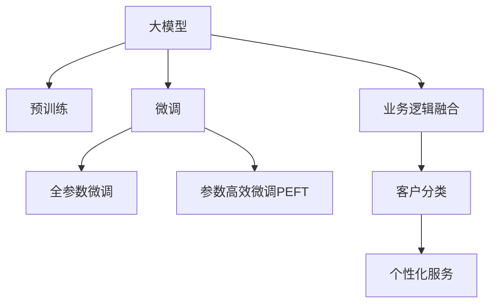

                 

# 探索基于大模型的电商智能客户分类系统

## 1. 背景介绍

### 1.1 问题由来

随着电子商务的蓬勃发展，商家对客户的精准分类和个性化营销的需求日益增加。传统客户分类依赖手工定义特征和规则，难以适应多变的业务场景。基于大模型的客户分类技术，通过对客户历史行为和交互数据的全面建模，可以自动学习并发现复杂的客户特征和行为模式，实现高效精准的客户分类。

当前，大模型技术在电商客户分类的应用中仍处于初级阶段，其强大的表示能力和大规模数据的利用，为客户分类的效率和准确性带来了显著提升。但同时，由于模型复杂度大，训练和推理成本高，部分企业仍未大规模采用。

### 1.2 问题核心关键点

大模型在电商客户分类中的应用主要体现在以下几个方面：

1. **大规模数据处理能力**：大模型具备处理海量数据的能力，可以高效处理电商客户的历史行为数据，发现客户行为模式和偏好。
2. **复杂特征表示**：大模型能够学习到更丰富、更复杂的客户特征，涵盖交易记录、浏览行为、评价反馈等多维数据。
3. **灵活性**：大模型可以通过微调技术，针对特定业务需求进行定制化训练，适应不同业务场景。
4. **实时更新**：大模型可以通过持续学习机制，实时更新客户特征，保持分类的时效性。

因此，如何高效构建基于大模型的客户分类系统，并充分利用其强大能力，已成为电商企业关注的重点。

## 2. 核心概念与联系

### 2.1 核心概念概述

为更好地理解基于大模型的客户分类系统，本节将介绍几个密切相关的核心概念：

- 大模型(Large Model)：以Transformer为代表的深度学习模型，通过大规模无标签数据预训练，学习丰富的表示能力。
- 预训练(Pre-training)：指在大规模无标签数据上，通过自监督学习任务训练通用模型。
- 微调(Fine-tuning)：指在预训练模型的基础上，通过有监督数据优化模型，适应特定任务。
- 客户分类(Customer Segmentation)：根据客户的特征和行为，将客户划分为不同的类别或群体，以便提供个性化的服务。
- 业务逻辑融合(Business Logic Integration)：将客户分类的结果与业务规则、业务场景深度结合，实现真正意义上的业务优化。

这些核心概念之间的逻辑关系可以通过以下Mermaid流程图来展示：



这个流程图展示了从预训练模型到微调模型，再到客户分类系统的全过程，以及如何将微调结果应用于个性化服务的关键步骤。

## 3. 核心算法原理 & 具体操作步骤
### 3.1 算法原理概述

基于大模型的客户分类系统，其核心算法原理可以概括为：

- **预训练阶段**：在大规模无标签数据上，通过自监督学习任务训练通用大模型，使其学习到丰富的语言表示和特征提取能力。
- **微调阶段**：在标注数据集上，通过有监督学习任务训练模型，使其适应特定的客户分类任务。
- **推理阶段**：将训练好的模型应用于新客户数据的分类，并结合业务规则生成个性化服务方案。

在实际应用中，通过不断迭代微调模型和优化业务逻辑，可以逐步提升客户分类的准确性和实用性。

### 3.2 算法步骤详解

基于大模型的客户分类系统通常包括以下几个关键步骤：

**Step 1: 准备预训练模型和数据集**
- 选择合适的预训练模型(如BERT、GPT等)作为初始化参数。
- 准备客户分类任务的标注数据集，包括客户的属性、行为、交易数据等，划分为训练集、验证集和测试集。

**Step 2: 添加任务适配层**
- 在预训练模型顶层设计合适的输出层和损失函数。对于分类任务，通常在顶层添加线性分类器和交叉熵损失函数。

**Step 3: 设置微调超参数**
- 选择合适的优化算法及其参数，如AdamW、SGD等，设置学习率、批大小、迭代轮数等。
- 设置正则化技术及强度，包括权重衰减、Dropout、Early Stopping等。

**Step 4: 执行梯度训练**
- 将训练集数据分批次输入模型，前向传播计算损失函数。
- 反向传播计算参数梯度，根据设定的优化算法和学习率更新模型参数。
- 周期性在验证集上评估模型性能，根据性能指标决定是否触发 Early Stopping。
- 重复上述步骤直到满足预设的迭代轮数或 Early Stopping 条件。

**Step 5: 测试和部署**
- 在测试集上评估微调后模型，对比微调前后的精度提升。
- 使用微调后的模型对新客户数据进行分类，并结合业务规则生成个性化服务方案。

### 3.3 算法优缺点

基于大模型的客户分类方法具有以下优点：
1. 高效处理大规模数据。大模型的预训练和微调过程能够高效处理海量客户数据，挖掘客户行为模式和特征。
2. 具备强大的特征提取能力。通过微调，大模型能够学习到更丰富、更复杂的客户特征，涵盖多维数据。
3. 实时更新。大模型可以通过持续学习机制，实时更新客户特征，保持分类的时效性。
4. 提高分类准确性。大模型的表示能力通常优于手工特征提取，提升分类的准确性。

同时，该方法也存在一定的局限性：
1. 依赖标注数据。微调效果很大程度上取决于标注数据的质量和数量，获取高质量标注数据的成本较高。
2. 模型复杂度高。大模型参数量庞大，训练和推理成本高。
3. 对数据质量敏感。客户数据的完整性和准确性对分类结果影响较大。
4. 模型部署复杂。大模型的推理速度和资源占用较大，需要优化以适配实际部署环境。

尽管存在这些局限性，但就目前而言，基于大模型的客户分类方法仍是大数据处理和客户管理中的重要工具。未来相关研究的方向可能在于如何进一步降低微调对标注数据的依赖，提高模型的少样本学习和跨领域迁移能力，同时兼顾可解释性和伦理安全性等因素。

### 3.4 算法应用领域

基于大模型的客户分类方法，已经广泛应用于电商、金融、健康医疗、物流等多个行业，为这些领域带来了显著的业务价值：

- **电商行业**：根据用户浏览、购买、评价等数据，进行精准营销、商品推荐、个性化客服等。
- **金融行业**：对客户交易行为进行分析，进行风险评估、贷款审批、客户画像等。
- **健康医疗**：对患者病历数据进行分析，进行疾病诊断、治疗方案推荐、健康管理等。
- **物流行业**：根据货物运输记录和客户反馈，进行物流优化、配送路线规划等。

此外，大模型客户分类方法还为电子商务平台、电信运营商、银行等众多行业带来了全新的技术突破，显著提升了这些行业的智能化水平和客户满意度。

## 4. 数学模型和公式 & 详细讲解 & 举例说明

### 4.1 数学模型构建

假设客户分类问题为二分类任务，客户特征向量为 $\mathbf{x} \in \mathbb{R}^d$，标签为 $y \in \{0, 1\}$。预训练模型为 $M_{\theta}$，其中 $\theta$ 为预训练得到的模型参数。

微调的目标是最小化经验风险，即找到新的模型参数 $\hat{\theta}$，使得：

$$
\hat{\theta} = \mathop{\arg\min}_{\theta} \mathcal{L}(M_{\theta}, D)
$$

其中 $\mathcal{L}$ 为针对客户分类任务设计的损失函数，用于衡量模型预测输出与真实标签之间的差异。常见的损失函数包括交叉熵损失、均方误差损失等。

在实践中，我们通常使用基于梯度的优化算法（如AdamW、SGD等）来近似求解上述最优化问题。设 $\eta$ 为学习率，$\lambda$ 为正则化系数，则参数的更新公式为：

$$
\theta \leftarrow \theta - \eta \nabla_{\theta}\mathcal{L}(\theta) - \eta\lambda\theta
$$

其中 $\nabla_{\theta}\mathcal{L}(\theta)$ 为损失函数对参数 $\theta$ 的梯度，可通过反向传播算法高效计算。

### 4.2 公式推导过程

以下我们以二分类任务为例，推导交叉熵损失函数及其梯度的计算公式。

假设模型 $M_{\theta}$ 在输入 $\mathbf{x}$ 上的输出为 $\hat{y}=M_{\theta}(\mathbf{x}) \in [0,1]$，表示客户属于正类的概率。真实标签 $y \in \{0,1\}$。则二分类交叉熵损失函数定义为：

$$
\ell(M_{\theta}(\mathbf{x}),y) = -[y\log \hat{y} + (1-y)\log (1-\hat{y})]
$$

将其代入经验风险公式，得：

$$
\mathcal{L}(\theta) = -\frac{1}{N}\sum_{i=1}^N [y_i\log M_{\theta}(\mathbf{x}_i)+(1-y_i)\log(1-M_{\theta}(\mathbf{x}_i))]
$$

根据链式法则，损失函数对参数 $\theta_k$ 的梯度为：

$$
\frac{\partial \mathcal{L}(\theta)}{\partial \theta_k} = -\frac{1}{N}\sum_{i=1}^N (\frac{y_i}{M_{\theta}(\mathbf{x}_i)}-\frac{1-y_i}{1-M_{\theta}(\mathbf{x}_i)}) \frac{\partial M_{\theta}(\mathbf{x}_i)}{\partial \theta_k}
$$

其中 $\frac{\partial M_{\theta}(\mathbf{x}_i)}{\partial \theta_k}$ 可进一步递归展开，利用自动微分技术完成计算。

在得到损失函数的梯度后，即可带入参数更新公式，完成模型的迭代优化。重复上述过程直至收敛，最终得到适应客户分类任务的最优模型参数 $\hat{\theta}$。

### 4.3 案例分析与讲解

以电商行业为例，假设某电商平台想要构建一个基于大模型的客户分类系统。具体步骤如下：

**Step 1: 准备数据和模型**
- 收集电商平台上客户的浏览、购买、评价等数据，作为训练集。
- 选择合适的预训练模型(如BERT、GPT等)作为初始化参数。

**Step 2: 添加任务适配层**
- 在预训练模型顶层添加线性分类器，并设置交叉熵损失函数。

**Step 3: 设置微调超参数**
- 设置合适的学习率、批大小、迭代轮数等。

**Step 4: 执行梯度训练**
- 将训练集数据分批次输入模型，前向传播计算损失函数。
- 反向传播计算参数梯度，根据设定的优化算法和学习率更新模型参数。
- 周期性在验证集上评估模型性能，根据性能指标决定是否触发 Early Stopping。
- 重复上述步骤直到满足预设的迭代轮数或 Early Stopping 条件。

**Step 5: 测试和部署**
- 在测试集上评估微调后模型，对比微调前后的精度提升。
- 使用微调后的模型对新客户数据进行分类，并结合业务规则生成个性化服务方案。

在实际应用中，电商客户分类系统可以根据业务需求进一步优化。例如，结合用户画像、时间戳、地理位置等多维数据，构建更加准确的客户分类模型。同时，还可以通过A/B测试等方式，不断优化模型和业务逻辑，提升客户分类的效果和业务价值。

## 5. 项目实践：代码实例和详细解释说明
### 5.1 开发环境搭建

在进行客户分类系统的开发前，我们需要准备好开发环境。以下是使用Python进行PyTorch开发的环境配置流程：

1. 安装Anaconda：从官网下载并安装Anaconda，用于创建独立的Python环境。

2. 创建并激活虚拟环境：
```bash
conda create -n pytorch-env python=3.8 
conda activate pytorch-env
```

3. 安装PyTorch：根据CUDA版本，从官网获取对应的安装命令。例如：
```bash
conda install pytorch torchvision torchaudio cudatoolkit=11.1 -c pytorch -c conda-forge
```

4. 安装TensorFlow：
```bash
pip install tensorflow
```

5. 安装各类工具包：
```bash
pip install numpy pandas scikit-learn matplotlib tqdm jupyter notebook ipython
```

完成上述步骤后，即可在`pytorch-env`环境中开始开发实践。

### 5.2 源代码详细实现

下面我们以客户分类任务为例，给出使用PyTorch和Transformers库对BERT模型进行微调的PyTorch代码实现。

首先，定义客户分类任务的数据处理函数：

```python
from transformers import BertTokenizer
from torch.utils.data import Dataset
import torch

class CustomerSegmentationDataset(Dataset):
    def __init__(self, texts, labels, tokenizer, max_len=128):
        self.texts = texts
        self.labels = labels
        self.tokenizer = tokenizer
        self.max_len = max_len
        
    def __len__(self):
        return len(self.texts)
    
    def __getitem__(self, item):
        text = self.texts[item]
        label = self.labels[item]
        
        encoding = self.tokenizer(text, return_tensors='pt', max_length=self.max_len, padding='max_length', truncation=True)
        input_ids = encoding['input_ids'][0]
        attention_mask = encoding['attention_mask'][0]
        
        # 对label进行one-hot编码
        label = torch.tensor([label], dtype=torch.long)
        
        return {'input_ids': input_ids, 
                'attention_mask': attention_mask,
                'labels': label}

# 标签与id的映射
label2id = {0: 'label0', 1: 'label1'}
id2label = {v: k for k, v in label2id.items()}

# 创建dataset
tokenizer = BertTokenizer.from_pretrained('bert-base-cased')

train_dataset = CustomerSegmentationDataset(train_texts, train_labels, tokenizer)
dev_dataset = CustomerSegmentationDataset(dev_texts, dev_labels, tokenizer)
test_dataset = CustomerSegmentationDataset(test_texts, test_labels, tokenizer)
```

然后，定义模型和优化器：

```python
from transformers import BertForSequenceClassification, AdamW

model = BertForSequenceClassification.from_pretrained('bert-base-cased', num_labels=2)

optimizer = AdamW(model.parameters(), lr=2e-5)
```

接着，定义训练和评估函数：

```python
from torch.utils.data import DataLoader
from tqdm import tqdm
from sklearn.metrics import classification_report

device = torch.device('cuda') if torch.cuda.is_available() else torch.device('cpu')
model.to(device)

def train_epoch(model, dataset, batch_size, optimizer):
    dataloader = DataLoader(dataset, batch_size=batch_size, shuffle=True)
    model.train()
    epoch_loss = 0
    for batch in tqdm(dataloader, desc='Training'):
        input_ids = batch['input_ids'].to(device)
        attention_mask = batch['attention_mask'].to(device)
        labels = batch['labels'].to(device)
        model.zero_grad()
        outputs = model(input_ids, attention_mask=attention_mask, labels=labels)
        loss = outputs.loss
        epoch_loss += loss.item()
        loss.backward()
        optimizer.step()
    return epoch_loss / len(dataloader)

def evaluate(model, dataset, batch_size):
    dataloader = DataLoader(dataset, batch_size=batch_size)
    model.eval()
    preds, labels = [], []
    with torch.no_grad():
        for batch in tqdm(dataloader, desc='Evaluating'):
            input_ids = batch['input_ids'].to(device)
            attention_mask = batch['attention_mask'].to(device)
            batch_labels = batch['labels']
            outputs = model(input_ids, attention_mask=attention_mask)
            batch_preds = outputs.logits.argmax(dim=1).to('cpu').tolist()
            batch_labels = batch_labels.to('cpu').tolist()
            for pred, label in zip(batch_preds, batch_labels):
                preds.append(pred)
                labels.append(label)
                
    print(classification_report(labels, preds))
```

最后，启动训练流程并在测试集上评估：

```python
epochs = 5
batch_size = 16

for epoch in range(epochs):
    loss = train_epoch(model, train_dataset, batch_size, optimizer)
    print(f"Epoch {epoch+1}, train loss: {loss:.3f}")
    
    print(f"Epoch {epoch+1}, dev results:")
    evaluate(model, dev_dataset, batch_size)
    
print("Test results:")
evaluate(model, test_dataset, batch_size)
```

以上就是使用PyTorch对BERT进行客户分类任务微调的完整代码实现。可以看到，得益于Transformers库的强大封装，我们可以用相对简洁的代码完成BERT模型的加载和微调。

### 5.3 代码解读与分析

让我们再详细解读一下关键代码的实现细节：

**CustomerSegmentationDataset类**：
- `__init__`方法：初始化文本、标签、分词器等关键组件。
- `__len__`方法：返回数据集的样本数量。
- `__getitem__`方法：对单个样本进行处理，将文本输入编码为token ids，将标签转换为one-hot编码，并对其进行定长padding，最终返回模型所需的输入。

**label2id和id2label字典**：
- 定义了标签与数字id之间的映射关系，用于将预测结果解码回真实的标签。

**训练和评估函数**：
- 使用PyTorch的DataLoader对数据集进行批次化加载，供模型训练和推理使用。
- 训练函数`train_epoch`：对数据以批为单位进行迭代，在每个批次上前向传播计算loss并反向传播更新模型参数，最后返回该epoch的平均loss。
- 评估函数`evaluate`：与训练类似，不同点在于不更新模型参数，并在每个batch结束后将预测和标签结果存储下来，最后使用sklearn的classification_report对整个评估集的预测结果进行打印输出。

**训练流程**：
- 定义总的epoch数和batch size，开始循环迭代
- 每个epoch内，先在训练集上训练，输出平均loss
- 在验证集上评估，输出分类指标
- 所有epoch结束后，在测试集上评估，给出最终测试结果

可以看到，PyTorch配合Transformers库使得BERT微调的代码实现变得简洁高效。开发者可以将更多精力放在数据处理、模型改进等高层逻辑上，而不必过多关注底层的实现细节。

当然，工业级的系统实现还需考虑更多因素，如模型的保存和部署、超参数的自动搜索、更灵活的任务适配层等。但核心的微调范式基本与此类似。

## 6. 实际应用场景

### 6.1 智能客服系统

基于大模型的客户分类技术，可以广泛应用于智能客服系统的构建。传统客服往往需要配备大量人力，高峰期响应缓慢，且一致性和专业性难以保证。而使用基于大模型的客户分类系统，可以自动分类客户咨询意图，匹配最合适的回答模板，实现高效智能客服。

在技术实现上，可以收集企业内部的历史客服对话记录，将问题和最佳答复构建成监督数据，在此基础上对预训练客户分类模型进行微调。微调后的分类模型能够自动理解用户意图，匹配最合适的回答模板进行回复。对于客户提出的新问题，还可以接入检索系统实时搜索相关内容，动态组织生成回答。如此构建的智能客服系统，能大幅提升客户咨询体验和问题解决效率。

### 6.2 个性化推荐系统

当前的推荐系统往往只依赖用户的历史行为数据进行物品推荐，无法深入理解用户的真实兴趣偏好。基于大模型的客户分类系统，可以根据客户历史行为和属性，进行精细分类，进一步挖掘用户的兴趣点。

在实践中，可以收集用户浏览、点击、评价、分享等行为数据，提取和用户交互的物品标题、描述、标签等文本内容。将文本内容作为模型输入，用户的后续行为（如是否点击、购买等）作为监督信号，在此基础上微调预训练客户分类模型。微调后的模型能够从文本内容中准确把握用户的兴趣点。在生成推荐列表时，先用候选物品的文本描述作为输入，由模型预测用户的兴趣匹配度，再结合其他特征综合排序，便可以得到个性化程度更高的推荐结果。

### 6.3 营销决策支持

企业可以通过客户分类系统，对客户进行细分，实现更加精准的营销策略。例如，将客户划分为高价值用户、潜在流失用户等，针对不同用户群体设计差异化的营销方案，提升营销效果。

在实践中，可以结合客户历史购买记录、消费行为、客户反馈等多维数据，构建客户分类模型，并根据不同的营销目标进行微调。微调后的模型能够识别出高价值客户、潜在流失客户等关键群体，并提出针对性的营销建议。企业可以基于这些建议，优化营销策略，提升客户满意度和忠诚度。

### 6.4 未来应用展望

随着大模型技术和客户分类方法的发展，基于大模型的客户分类系统将在更多领域得到应用，为各行各业带来变革性影响。

在智慧医疗领域，基于大模型的客户分类系统可以用于患者分群，实现更精准的医疗资源分配和个性化治疗方案。

在智能教育领域，微调系统可以用于学生分类，帮助教育机构识别出需要重点关注的学生，提供有针对性的教育支持。

在智慧城市治理中，微调系统可以用于城市事件分类，提升城市管理自动化和智能化水平，构建更安全、高效的未来城市。

此外，在企业生产、社会治理、文娱传媒等众多领域，基于大模型的客户分类系统也将不断涌现，为传统行业数字化转型升级提供新的技术路径。相信随着技术的日益成熟，客户分类系统将成为人工智能技术落地的重要工具，助力企业提升业务效率和服务质量。

## 7. 工具和资源推荐
### 7.1 学习资源推荐

为了帮助开发者系统掌握大模型客户分类技术的理论基础和实践技巧，这里推荐一些优质的学习资源：

1. 《Transformers from Principles to Practice》系列博文：由大模型技术专家撰写，深入浅出地介绍了Transformer原理、BERT模型、客户分类技术等前沿话题。

2. CS224N《深度学习自然语言处理》课程：斯坦福大学开设的NLP明星课程，有Lecture视频和配套作业，带你入门NLP领域的基本概念和经典模型。

3. 《Natural Language Processing with Transformers》书籍：Transformers库的作者所著，全面介绍了如何使用Transformers库进行NLP任务开发，包括客户分类在内的诸多范式。

4. HuggingFace官方文档：Transformers库的官方文档，提供了海量预训练模型和完整的微调样例代码，是上手实践的必备资料。

5. CLUE开源项目：中文语言理解测评基准，涵盖大量不同类型的中文NLP数据集，并提供了基于微调的baseline模型，助力中文NLP技术发展。

通过对这些资源的学习实践，相信你一定能够快速掌握大模型客户分类的精髓，并用于解决实际的NLP问题。
###  7.2 开发工具推荐

高效的开发离不开优秀的工具支持。以下是几款用于大模型客户分类开发的常用工具：

1. PyTorch：基于Python的开源深度学习框架，灵活动态的计算图，适合快速迭代研究。大部分预训练语言模型都有PyTorch版本的实现。

2. TensorFlow：由Google主导开发的开源深度学习框架，生产部署方便，适合大规模工程应用。同样有丰富的预训练语言模型资源。

3. Transformers库：HuggingFace开发的NLP工具库，集成了众多SOTA语言模型，支持PyTorch和TensorFlow，是进行客户分类任务开发的利器。

4. Weights & Biases：模型训练的实验跟踪工具，可以记录和可视化模型训练过程中的各项指标，方便对比和调优。与主流深度学习框架无缝集成。

5. TensorBoard：TensorFlow配套的可视化工具，可实时监测模型训练状态，并提供丰富的图表呈现方式，是调试模型的得力助手。

6. Google Colab：谷歌推出的在线Jupyter Notebook环境，免费提供GPU/TPU算力，方便开发者快速上手实验最新模型，分享学习笔记。

合理利用这些工具，可以显著提升大模型客户分类的开发效率，加快创新迭代的步伐。

### 7.3 相关论文推荐

大模型和客户分类技术的发展源于学界的持续研究。以下是几篇奠基性的相关论文，推荐阅读：

1. Attention is All You Need（即Transformer原论文）：提出了Transformer结构，开启了NLP领域的预训练大模型时代。

2. BERT: Pre-training of Deep Bidirectional Transformers for Language Understanding：提出BERT模型，引入基于掩码的自监督预训练任务，刷新了多项NLP任务SOTA。

3. Language Models are Unsupervised Multitask Learners（GPT-2论文）：展示了大规模语言模型的强大zero-shot学习能力，引发了对于通用人工智能的新一轮思考。

4. Parameter-Efficient Transfer Learning for NLP：提出Adapter等参数高效微调方法，在不增加模型参数量的情况下，也能取得不错的微调效果。

5. Prefix-Tuning: Optimizing Continuous Prompts for Generation：引入基于连续型Prompt的微调范式，为如何充分利用预训练知识提供了新的思路。

6. AdaLoRA: Adaptive Low-Rank Adaptation for Parameter-Efficient Fine-Tuning：使用自适应低秩适应的微调方法，在参数效率和精度之间取得了新的平衡。

这些论文代表了大模型客户分类技术的发展脉络。通过学习这些前沿成果，可以帮助研究者把握学科前进方向，激发更多的创新灵感。

## 8. 总结：未来发展趋势与挑战

### 8.1 总结

本文对基于大模型的电商智能客户分类系统进行了全面系统的介绍。首先阐述了客户分类的背景和意义，明确了基于大模型的客户分类系统的强大潜力。其次，从原理到实践，详细讲解了客户分类模型的数学模型和关键步骤，给出了客户分类任务开发的完整代码实例。同时，本文还广泛探讨了客户分类系统在电商、金融、医疗等多个行业领域的应用前景，展示了客户分类技术的巨大价值。此外，本文精选了客户分类技术的各类学习资源，力求为读者提供全方位的技术指引。

通过本文的系统梳理，可以看到，基于大模型的客户分类系统在电商行业中已经取得了显著的业务效果，显著提升了客户分类的效率和精准性。未来，随着大模型技术和微调方法的不断发展，客户分类系统还将拓展到更多领域，推动人工智能技术在垂直行业的落地应用。

### 8.2 未来发展趋势

展望未来，基于大模型的客户分类技术将呈现以下几个发展趋势：

1. **模型规模持续增大**：随着算力成本的下降和数据规模的扩张，预训练语言模型的参数量还将持续增长。超大规模语言模型蕴含的丰富语言知识，有望支撑更加复杂多变的客户分类任务。

2. **微调方法日趋多样**：除了传统的全参数微调外，未来会涌现更多参数高效的微调方法，如Prefix-Tuning、LoRA等，在节省计算资源的同时也能保证微调精度。

3. **持续学习成为常态**：随着数据分布的不断变化，客户分类模型也需要持续学习新知识以保持性能。如何在不遗忘原有知识的同时，高效吸收新样本信息，将成为重要的研究课题。

4. **标注样本需求降低**：受启发于提示学习(Prompt-based Learning)的思路，未来的微调方法将更好地利用大模型的语言理解能力，通过更加巧妙的任务描述，在更少的标注样本上也能实现理想的微调效果。

5. **多模态微调崛起**：当前的客户分类主要聚焦于纯文本数据，未来会进一步拓展到图像、视频、语音等多模态数据微调。多模态信息的融合，将显著提升语言模型对现实世界的理解和建模能力。

6. **业务逻辑融合深度**：未来的客户分类系统将更多地融合业务规则和场景，实现真正的业务优化和智能化管理。例如，将分类结果与个性化推荐、客户服务、营销策略等业务环节结合，实现闭环优化。

以上趋势凸显了大模型客户分类技术的广阔前景。这些方向的探索发展，必将进一步提升客户分类的效率和效果，推动企业智能化水平和客户满意度的提升。

### 8.3 面临的挑战

尽管基于大模型的客户分类技术已经取得了显著成效，但在迈向更加智能化、普适化应用的过程中，它仍面临着诸多挑战：

1. **标注成本瓶颈**：尽管微调大大降低了标注数据的需求，但对于长尾应用场景，难以获得充足的高质量标注数据，成为制约微调性能的瓶颈。如何进一步降低微调对标注数据的依赖，将是一大难题。

2. **模型鲁棒性不足**：客户数据的多样性和动态性使得客户分类的鲁棒性成为一大挑战。模型面对域外数据时，泛化性能往往大打折扣。如何提高模型的鲁棒性，避免灾难性遗忘，还需要更多理论和实践的积累。

3. **推理效率有待提高**：大规模语言模型虽然精度高，但在实际部署时往往面临推理速度慢、内存占用大等效率问题。如何在保证性能的同时，简化模型结构，提升推理速度，优化资源占用，将是重要的优化方向。

4. **可解释性亟需加强**：当前客户分类模型通常缺乏可解释性，难以解释其内部工作机制和决策逻辑。对于医疗、金融等高风险应用，算法的可解释性和可审计性尤为重要。如何赋予模型更强的可解释性，将是亟待攻克的难题。

5. **安全性有待保障**：客户数据的隐私和安全性是客户分类系统的核心问题。如何在保护数据隐私的同时，确保模型的安全性和公平性，将是一大挑战。

6. **业务逻辑融合难度**：客户分类系统需要深度融合业务规则和场景，实现真正的业务优化。这需要复杂的工程实现和持续的业务迭代，难度较大。

正视客户分类面临的这些挑战，积极应对并寻求突破，将是大模型客户分类技术走向成熟的必由之路。相信随着学界和产业界的共同努力，这些挑战终将一一被克服，客户分类系统必将在构建智能电商、智慧医疗、智能教育等领域中扮演越来越重要的角色。

### 8.4 研究展望

面对大模型客户分类所面临的种种挑战，未来的研究需要在以下几个方面寻求新的突破：

1. **探索无监督和半监督客户分类方法**：摆脱对大规模标注数据的依赖，利用自监督学习、主动学习等无监督和半监督范式，最大限度利用非结构化数据，实现更加灵活高效的分类。

2. **研究参数高效和计算高效的分类方法**：开发更加参数高效的分类方法，在固定大部分预训练参数的同时，只更新极少量的任务相关参数。同时优化模型的计算图，减少前向传播和反向传播的资源消耗，实现更加轻量级、实时性的部署。

3. **融合因果和对比学习范式**：通过引入因果推断和对比学习思想，增强分类模型建立稳定因果关系的能力，学习更加普适、鲁棒的语言表征，从而提升模型泛化性和抗干扰能力。

4. **引入更多先验知识**：将符号化的先验知识，如知识图谱、逻辑规则等，与神经网络模型进行巧妙融合，引导分类过程学习更准确、合理的语言模型。同时加强不同模态数据的整合，实现视觉、语音等多模态信息与文本信息的协同建模。

5. **结合因果分析和博弈论工具**：将因果分析方法引入分类模型，识别出模型决策的关键特征，增强输出解释的因果性和逻辑性。借助博弈论工具刻画人机交互过程，主动探索并规避模型的脆弱点，提高系统稳定性。

6. **纳入伦理道德约束**：在模型训练目标中引入伦理导向的评估指标，过滤和惩罚有偏见、有害的输出倾向。同时加强人工干预和审核，建立模型行为的监管机制，确保输出符合人类价值观和伦理道德。

这些研究方向的探索，必将引领大模型客户分类技术迈向更高的台阶，为构建安全、可靠、可解释、可控的智能系统铺平道路。面向未来，大模型客户分类技术还需要与其他人工智能技术进行更深入的融合，如知识表示、因果推理、强化学习等，多路径协同发力，共同推动自然语言理解和智能交互系统的进步。只有勇于创新、敢于突破，才能不断拓展语言模型的边界，让智能技术更好地造福人类社会。

## 9. 附录：常见问题与解答

**Q1：大模型客户分类是否适用于所有电商客户？**

A: 大模型客户分类在大多数电商客户上都能取得不错的效果，特别是对于数据量较小的客户。但对于一些特定客户群体，如特殊人群、敏感用户等，模型可能会存在偏差。因此，需要根据不同客户群体的特点，设计针对性的数据和模型。

**Q2：微调过程中如何选择合适的学习率？**

A: 微调的学习率一般要比预训练时小1-2个数量级，如果使用过大的学习率，容易破坏预训练权重，导致过拟合。一般建议从1e-5开始调参，逐步减小学习率，直至收敛。也可以使用warmup策略，在开始阶段使用较小的学习率，再逐渐过渡到预设值。需要注意的是，不同的优化器(如AdamW、Adafactor等)以及不同的学习率调度策略，可能需要设置不同的学习率阈值。

**Q3：采用大模型分类时会面临哪些资源瓶颈？**

A: 当前主流的预训练大模型动辄以亿计的参数规模，对算力、内存、存储都提出了很高的要求。GPU/TPU等高性能设备是必不可少的，但即便如此，超大批次的训练和推理也可能遇到显存不足的问题。因此需要采用一些资源优化技术，如梯度积累、混合精度训练、模型并行等，来突破硬件瓶颈。同时，模型的存储和读取也可能占用大量时间和空间，需要采用模型压缩、稀疏化存储等方法进行优化。

**Q4：如何缓解客户分类过程中的过拟合问题？**

A: 过拟合是客户分类面临的主要挑战，尤其是在标注数据不足的情况下。常见的缓解策略包括：
1. 数据增强：通过回译、近义替换等方式扩充训练集
2. 正则化：使用L2正则、Dropout、Early Stopping等避免过拟合
3. 对抗训练：引入对抗样本，提高模型鲁棒性
4. 参数高效微调：只调整少量参数(如Adapter、Prefix等)，减小过拟合风险
5. 多模型集成：训练多个分类模型，取平均输出，抑制过拟合

这些策略往往需要根据具体任务和数据特点进行灵活组合。只有在数据、模型、训练、推理等各环节进行全面优化，才能最大限度地发挥大模型客户分类的威力。

**Q5：客户分类模型在落地部署时需要注意哪些问题？**

A: 将客户分类模型转化为实际应用，还需要考虑以下因素：
1. 模型裁剪：去除不必要的层和参数，减小模型尺寸，加快推理速度
2. 量化加速：将浮点模型转为定点模型，压缩存储空间，提高计算效率
3. 服务化封装：将模型封装为标准化服务接口，便于集成调用
4. 弹性伸缩：根据请求流量动态调整资源配置，平衡服务质量和成本
5. 监控告警：实时采集系统指标，设置异常告警阈值，确保服务稳定性
6. 安全防护：采用访问鉴权、数据脱敏等措施，保障数据和模型安全

大模型客户分类为电子商务平台、电信运营商、银行等众多行业带来了全新的技术突破，显著提升了这些行业的智能化水平和客户满意度。未来，随着技术的不断进步，客户分类系统将会在更多领域得到应用，推动人工智能技术在垂直行业的落地应用。

---

作者：禅与计算机程序设计艺术 / Zen and the Art of Computer Programming

