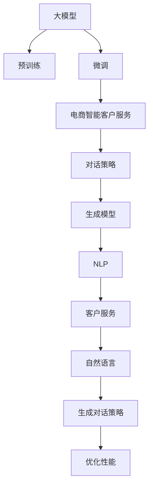

                 

# 探索基于大模型的电商智能客户服务对话策略生成系统

> 关键词：
1. 大模型
2. 客户服务
3. 对话策略
4. 电商
5. 自然语言处理(NLP)
6. 智能客服
7. 生成模型

## 1. 背景介绍

### 1.1 问题由来

随着电商行业的快速增长，线上客户服务的质量逐渐成为企业竞争力的关键因素之一。智能客服系统可以通过自然语言处理(NLP)技术，自动理解和响应客户需求，提升服务效率和用户体验。传统的规则型智能客服系统难以处理复杂多变的客户咨询，而基于大模型的对话系统则可以动态生成丰富多样的对话策略，应对各种复杂的客户服务场景。

### 1.2 问题核心关键点

本文聚焦于基于大模型的电商智能客户服务对话策略生成系统。其核心目标是通过微调预训练语言模型，生成高质量的对话策略，实现自动化客户服务，提升电商平台的客户满意度。关键问题包括：

- 如何选择合适的预训练模型，进行电商领域的微调。
- 如何设计对话策略，使其能够应对电商场景中的常见问题和边缘情况。
- 如何构建高效的训练流程，优化模型性能。
- 如何在实际应用中评估和部署对话系统，确保服务质量。

### 1.3 问题研究意义

基于大模型的智能客户服务对话系统，能够为电商企业提供全天候、高效的客户服务，缓解人力不足的问题，提升服务响应速度和质量。同时，它还能收集客户反馈，辅助电商平台优化产品和用户体验。因此，研究基于大模型的对话策略生成系统，对于提升电商企业的客户满意度和服务水平具有重要意义。

## 2. 核心概念与联系

### 2.1 核心概念概述

为更好地理解基于大模型的电商智能客户服务对话策略生成系统，本节将介绍几个密切相关的核心概念：

- 大模型（Large Model）：以自回归(如GPT)或自编码(如BERT)模型为代表的大规模预训练语言模型。通过在大规模无标签文本语料上进行预训练，学习通用的语言知识。

- 预训练(Pre-training)：指在大规模无标签文本语料上，通过自监督学习任务训练通用语言模型的过程。常见的预训练任务包括掩码语言模型、序列预测等。

- 微调(Fine-tuning)：指在预训练模型的基础上，使用下游任务的少量标注数据，通过有监督学习优化模型在特定任务上的性能。

- 对话系统(Dialouge System)：能够与用户进行自然语言交流的计算机程序。常见的对话系统包括规则型系统、基于规则和模板的系统以及基于人工智能的系统。

- 生成模型(Generative Model)：能够从输入数据中生成新数据的模型。常见的生成模型包括自回归模型（如GPT）、变分自编码器(VAE)等。

- 自然语言处理(NLP)：涉及计算机如何处理和理解自然语言的领域。包括文本分析、语音识别、机器翻译等子领域。

- 客户服务(Customer Service)：指企业在客户咨询、投诉、反馈等方面提供的支持和服务。目标是提高客户满意度和忠诚度。

这些核心概念之间的逻辑关系可以通过以下Mermaid流程图来展示：



这个流程图展示了大模型的核心概念及其之间的关系：

1. 大模型通过预训练获得基础能力。
2. 微调是对预训练模型进行任务特定的优化，以适应电商客户服务场景。
3. 对话策略生成模型基于大模型进行微调，生成高质量的对话策略。
4. 生成模型利用自然语言处理技术，实现对话策略的生成。
5. 客户服务系统利用对话策略生成模型，自动响应客户咨询。

## 3. 核心算法原理 & 具体操作步骤
### 3.1 算法原理概述

基于大模型的电商智能客户服务对话策略生成系统，本质上是将预训练语言模型应用于对话生成任务的过程。其核心思想是：将预训练语言模型作为通用的语言表示器，通过微调，使其能够在特定任务上生成高质量的对话策略。

形式化地，假设预训练语言模型为 $M_{\theta}$，其中 $\theta$ 为预训练得到的模型参数。给定电商客户服务对话数据集 $D=\{(x_i,y_i)\}_{i=1}^N$，其中 $x_i$ 为输入的客户咨询文本，$y_i$ 为对应的对话策略，微调的目标是找到新的模型参数 $\hat{\theta}$，使得模型生成的对话策略与标注数据一致。

即：
$$
\hat{\theta}=\mathop{\arg\min}_{\theta} \mathcal{L}(M_{\theta},D)
$$

其中 $\mathcal{L}$ 为针对对话生成任务的损失函数，用于衡量模型生成的对话策略与标注数据之间的差异。常见的损失函数包括交叉熵损失、BLEU分数等。

通过梯度下降等优化算法，微调过程不断更新模型参数 $\theta$，最小化损失函数 $\mathcal{L}$，使得模型生成的对话策略逼近标注数据。由于 $\theta$ 已经通过预训练获得了较好的初始化，因此即便在数据量较小的对话生成任务上，也能较快收敛到理想的模型参数 $\hat{\theta}$。

### 3.2 算法步骤详解

基于大模型的电商智能客户服务对话策略生成系统，一般包括以下几个关键步骤：

**Step 1: 准备预训练模型和数据集**
- 选择合适的预训练语言模型 $M_{\theta}$ 作为初始化参数，如 BERT、GPT等。
- 准备电商客户服务对话数据集 $D$，划分为训练集、验证集和测试集。一般要求标注数据与预训练数据的分布不要差异过大。

**Step 2: 添加任务适配层**
- 根据任务类型，在预训练模型顶层设计合适的输出层和损失函数。
- 对于对话生成任务，通常在顶层添加解码器，并使用BLEU分数作为损失函数。

**Step 3: 设置微调超参数**
- 选择合适的优化算法及其参数，如 AdamW、SGD 等，设置学习率、批大小、迭代轮数等。
- 设置正则化技术及强度，包括权重衰减、Dropout、Early Stopping等。
- 确定冻结预训练参数的策略，如仅微调顶层，或全部参数都参与微调。

**Step 4: 执行梯度训练**
- 将训练集数据分批次输入模型，前向传播计算损失函数。
- 反向传播计算参数梯度，根据设定的优化算法和学习率更新模型参数。
- 周期性在验证集上评估模型性能，根据性能指标决定是否触发 Early Stopping。
- 重复上述步骤直到满足预设的迭代轮数或 Early Stopping 条件。

**Step 5: 测试和部署**
- 在测试集上评估微调后模型 $M_{\hat{\theta}}$ 的性能，对比微调前后的生成效果。
- 使用微调后的模型对新样本进行推理预测，集成到实际的应用系统中。
- 持续收集新的对话数据，定期重新微调模型，以适应数据分布的变化。

以上是基于大模型的电商智能客户服务对话策略生成系统的微调流程。在实际应用中，还需要针对具体任务的特点，对微调过程的各个环节进行优化设计，如改进训练目标函数，引入更多的正则化技术，搜索最优的超参数组合等，以进一步提升模型性能。

### 3.3 算法优缺点

基于大模型的电商智能客户服务对话策略生成系统具有以下优点：
1. 高效快捷。使用大模型进行微调，可以快速适应电商客户服务场景，生成高质量的对话策略。
2. 鲁棒性强。大模型具备较强的泛化能力，能够较好地处理各种类型的客户咨询，适应不同的数据分布。
3. 扩展性强。对话策略生成模型可以灵活扩展，支持多轮对话、跨渠道应用等复杂场景。
4. 用户体验提升。自动生成的对话策略能够提供更为自然流畅的对话体验，减轻人工客服的负担。

同时，该方法也存在一定的局限性：
1. 依赖标注数据。微调的效果很大程度上取决于标注数据的质量和数量，获取高质量标注数据的成本较高。
2. 模型参数量大。预训练语言模型的参数量较大，微调过程也需要较大的计算资源。
3. 理解力有限。大模型虽然可以生成高质量的对话策略，但对于复杂和抽象的对话策略，理解力和创造力可能存在不足。
4. 安全性问题。自动生成的对话策略可能存在安全隐患，如隐私泄露、信息误导等。

尽管存在这些局限性，但就目前而言，基于大模型的对话策略生成方法仍是大规模电商客户服务的重要工具。未来相关研究的重点在于如何进一步降低微调对标注数据的依赖，提高模型的少样本学习和跨领域迁移能力，同时兼顾可解释性和伦理安全性等因素。

### 3.4 算法应用领域

基于大模型的电商智能客户服务对话策略生成系统，已经在多个电商平台的客户服务中得到了应用，并取得了显著效果：

- 在线客服系统：通过自然语言处理技术，自动响应客户的常见问题，提升客服效率。
- 自动客服机器人：在电商平台的网站或App上集成对话机器人，24/7不间断服务。
- 智能导购系统：通过对话生成模型，为消费者提供个性化的购物建议和商品推荐。
- 客户投诉处理：自动解析客户投诉内容，快速定位问题并处理，提升投诉解决效率。
- 销售支持：利用对话策略生成模型，生成与销售人员交互的对话策略，辅助销售决策。

除了上述这些典型应用外，对话策略生成模型还可以进一步创新性地应用于客户分析、市场调研、内容生成等场景中，为电商平台提供更全面的技术支持。

## 4. 数学模型和公式 & 详细讲解 & 举例说明
### 4.1 数学模型构建

本节将使用数学语言对基于大模型的电商智能客户服务对话策略生成系统的微调过程进行更加严格的刻画。

记预训练语言模型为 $M_{\theta}$，其中 $\theta$ 为预训练得到的模型参数。假设电商客户服务对话数据集为 $D=\{(x_i,y_i)\}_{i=1}^N$，其中 $x_i$ 为输入的客户咨询文本，$y_i$ 为对应的对话策略。

定义模型 $M_{\theta}$ 在输入 $x$ 上的损失函数为 $\ell(M_{\theta}(x),y)$，则在数据集 $D$ 上的经验风险为：

$$
\mathcal{L}(\theta) = \frac{1}{N} \sum_{i=1}^N \ell(M_{\theta}(x_i),y_i)
$$

微调的优化目标是最小化经验风险，即找到最优参数：

$$
\theta^* = \mathop{\arg\min}_{\theta} \mathcal{L}(\theta)
$$

在实践中，我们通常使用基于梯度的优化算法（如SGD、Adam等）来近似求解上述最优化问题。设 $\eta$ 为学习率，$\lambda$ 为正则化系数，则参数的更新公式为：

$$
\theta \leftarrow \theta - \eta \nabla_{\theta}\mathcal{L}(\theta) - \eta\lambda\theta
$$

其中 $\nabla_{\theta}\mathcal{L}(\theta)$ 为损失函数对参数 $\theta$ 的梯度，可通过反向传播算法高效计算。

### 4.2 公式推导过程

以下我们以二分类任务为例，推导交叉熵损失函数及其梯度的计算公式。

假设模型 $M_{\theta}$ 在输入 $x$ 上的输出为 $\hat{y}=M_{\theta}(x)$，表示模型生成的对话策略。真实标签 $y \in \{0,1\}$。则二分类交叉熵损失函数定义为：

$$
\ell(M_{\theta}(x),y) = -[y\log \hat{y} + (1-y)\log (1-\hat{y})]
$$

将其代入经验风险公式，得：

$$
\mathcal{L}(\theta) = -\frac{1}{N}\sum_{i=1}^N [y_i\log M_{\theta}(x_i)+(1-y_i)\log(1-M_{\theta}(x_i))]
$$

根据链式法则，损失函数对参数 $\theta_k$ 的梯度为：

$$
\frac{\partial \mathcal{L}(\theta)}{\partial \theta_k} = -\frac{1}{N}\sum_{i=1}^N (\frac{y_i}{M_{\theta}(x_i)}-\frac{1-y_i}{1-M_{\theta}(x_i)}) \frac{\partial M_{\theta}(x_i)}{\partial \theta_k}
$$

其中 $\frac{\partial M_{\theta}(x_i)}{\partial \theta_k}$ 可进一步递归展开，利用自动微分技术完成计算。

在得到损失函数的梯度后，即可带入参数更新公式，完成模型的迭代优化。重复上述过程直至收敛，最终得到适应电商客户服务场景的最优模型参数 $\theta^*$。

## 5. 项目实践：代码实例和详细解释说明
### 5.1 开发环境搭建

在进行微调实践前，我们需要准备好开发环境。以下是使用Python进行PyTorch开发的环境配置流程：

1. 安装Anaconda：从官网下载并安装Anaconda，用于创建独立的Python环境。

2. 创建并激活虚拟环境：
```bash
conda create -n pytorch-env python=3.8 
conda activate pytorch-env
```

3. 安装PyTorch：根据CUDA版本，从官网获取对应的安装命令。例如：
```bash
conda install pytorch torchvision torchaudio cudatoolkit=11.1 -c pytorch -c conda-forge
```

4. 安装Transformers库：
```bash
pip install transformers
```

5. 安装各类工具包：
```bash
pip install numpy pandas scikit-learn matplotlib tqdm jupyter notebook ipython
```

完成上述步骤后，即可在`pytorch-env`环境中开始微调实践。

### 5.2 源代码详细实现

下面我们以电商平台客户服务对话策略生成任务为例，给出使用Transformers库对BERT模型进行微调的PyTorch代码实现。

首先，定义对话数据处理函数：

```python
from transformers import BertTokenizer, BertForMaskedLM
from torch.utils.data import Dataset
import torch

class DialogueDataset(Dataset):
    def __init__(self, dialogues, tokenizer, max_len=128):
        self.dialogues = dialogues
        self.tokenizer = tokenizer
        self.max_len = max_len
        
    def __len__(self):
        return len(self.dialogues)
    
    def __getitem__(self, item):
        dialogue = self.dialogues[item]
        
        input_text = ' '.join(dialogue)
        input_ids = self.tokenizer(input_text, return_tensors='pt', max_length=self.max_len, padding='max_length', truncation=True)
        input_ids = input_ids['input_ids'][:, :-1]  # 去掉最后一位预测标签
        labels = input_ids['input_ids'][:, -1]
        
        return {'input_ids': input_ids, 
                'attention_mask': input_ids['attention_mask'],
                'labels': labels}

# 定义数据集
tokenizer = BertTokenizer.from_pretrained('bert-base-cased')

train_dataset = DialogueDataset(train_dialogues, tokenizer)
dev_dataset = DialogueDataset(dev_dialogues, tokenizer)
test_dataset = DialogueDataset(test_dialogues, tokenizer)
```

然后，定义模型和优化器：

```python
from transformers import BertForMaskedLM, AdamW

model = BertForMaskedLM.from_pretrained('bert-base-cased')

optimizer = AdamW(model.parameters(), lr=2e-5)
```

接着，定义训练和评估函数：

```python
from torch.utils.data import DataLoader
from tqdm import tqdm
from sklearn.metrics import accuracy_score

device = torch.device('cuda') if torch.cuda.is_available() else torch.device('cpu')
model.to(device)

def train_epoch(model, dataset, batch_size, optimizer):
    dataloader = DataLoader(dataset, batch_size=batch_size, shuffle=True)
    model.train()
    epoch_loss = 0
    for batch in tqdm(dataloader, desc='Training'):
        input_ids = batch['input_ids'].to(device)
        attention_mask = batch['attention_mask'].to(device)
        labels = batch['labels'].to(device)
        model.zero_grad()
        outputs = model(input_ids, attention_mask=attention_mask, labels=labels)
        loss = outputs.loss
        epoch_loss += loss.item()
        loss.backward()
        optimizer.step()
    return epoch_loss / len(dataloader)

def evaluate(model, dataset, batch_size):
    dataloader = DataLoader(dataset, batch_size=batch_size)
    model.eval()
    preds, labels = [], []
    with torch.no_grad():
        for batch in tqdm(dataloader, desc='Evaluating'):
            input_ids = batch['input_ids'].to(device)
            attention_mask = batch['attention_mask'].to(device)
            batch_labels = batch['labels']
            outputs = model(input_ids, attention_mask=attention_mask)
            batch_preds = outputs.logits.argmax(dim=2).to('cpu').tolist()
            batch_labels = batch_labels.to('cpu').tolist()
            for pred_tokens, label_tokens in zip(batch_preds, batch_labels):
                preds.append(pred_tokens[:len(label_tokens)])
                labels.append(label_tokens)
                
    print(accuracy_score(labels, preds))
```

最后，启动训练流程并在测试集上评估：

```python
epochs = 5
batch_size = 16

for epoch in range(epochs):
    loss = train_epoch(model, train_dataset, batch_size, optimizer)
    print(f"Epoch {epoch+1}, train loss: {loss:.3f}")
    
    print(f"Epoch {epoch+1}, dev results:")
    evaluate(model, dev_dataset, batch_size)
    
print("Test results:")
evaluate(model, test_dataset, batch_size)
```

以上就是使用PyTorch对BERT进行电商平台客户服务对话策略生成任务的完整代码实现。可以看到，得益于Transformers库的强大封装，我们可以用相对简洁的代码完成BERT模型的加载和微调。

### 5.3 代码解读与分析

让我们再详细解读一下关键代码的实现细节：

**DialogueDataset类**：
- `__init__`方法：初始化对话数据、分词器等关键组件。
- `__len__`方法：返回数据集的样本数量。
- `__getitem__`方法：对单个样本进行处理，将对话数据输入编码为token ids，并去掉最后的预测标签。

**模型和优化器**：
- 使用BertForMaskedLM作为对话策略生成模型。
- 使用AdamW优化器进行参数更新，并设置学习率。

**训练和评估函数**：
- 使用PyTorch的DataLoader对数据集进行批次化加载，供模型训练和推理使用。
- 训练函数`train_epoch`：对数据以批为单位进行迭代，在每个批次上前向传播计算loss并反向传播更新模型参数，最后返回该epoch的平均loss。
- 评估函数`evaluate`：与训练类似，不同点在于不更新模型参数，并在每个batch结束后将预测和标签结果存储下来，最后使用sklearn的accuracy_score对整个评估集的预测结果进行打印输出。

**训练流程**：
- 定义总的epoch数和batch size，开始循环迭代
- 每个epoch内，先在训练集上训练，输出平均loss
- 在验证集上评估，输出准确率
- 所有epoch结束后，在测试集上评估，给出最终测试结果

可以看到，PyTorch配合Transformers库使得BERT微调的代码实现变得简洁高效。开发者可以将更多精力放在数据处理、模型改进等高层逻辑上，而不必过多关注底层的实现细节。

当然，工业级的系统实现还需考虑更多因素，如模型的保存和部署、超参数的自动搜索、更灵活的任务适配层等。但核心的微调范式基本与此类似。

## 6. 实际应用场景
### 6.1 智能客服系统

基于大模型的智能客服系统，能够为电商企业提供全天候、高效的客户服务，缓解人力不足的问题，提升服务响应速度和质量。具体应用场景包括：

- 在线客服系统：通过自然语言处理技术，自动响应客户的常见问题，提升客服效率。
- 自动客服机器人：在电商平台的网站或App上集成对话机器人，24/7不间断服务。
- 智能导购系统：通过对话生成模型，为消费者提供个性化的购物建议和商品推荐。
- 客户投诉处理：自动解析客户投诉内容，快速定位问题并处理，提升投诉解决效率。
- 销售支持：利用对话策略生成模型，生成与销售人员交互的对话策略，辅助销售决策。

### 6.2 自动客服机器人

自动客服机器人是电商客户服务的重要组成部分，能够实时响应客户咨询，提供24/7服务。具体实现流程包括：

1. 收集客户咨询数据，划分为训练集、验证集和测试集。
2. 在训练集上微调预训练模型，生成高质量的对话策略。
3. 构建对话机器人系统，集成微调后的模型，自动响应客户咨询。
4. 在验证集上评估机器人系统的性能，优化模型参数。
5. 在测试集上测试机器人系统的稳定性和准确性。

自动客服机器人可以处理各种常见的客户咨询，如商品查询、订单状态、退货政策等。对于复杂或边缘情况，还可以进一步引入人工客服进行辅助。

### 6.3 智能导购系统

智能导购系统能够根据客户的浏览历史、购买记录等行为数据，生成个性化的购物建议和商品推荐，提升客户购买转化率。具体实现流程包括：

1. 收集客户的浏览和购买数据，预处理为训练样本。
2. 在训练集上微调预训练模型，生成对话策略。
3. 构建推荐系统，集成微调后的模型，生成个性化对话策略。
4. 在测试集上评估推荐系统的性能，优化模型参数。
5. 在实际电商平台上部署推荐系统，提供个性化对话策略。

智能导购系统可以实时更新对话策略，根据客户的变化需求，动态生成个性化的推荐结果。

### 6.4 客户投诉处理

客户投诉处理是电商客户服务中的重要环节，自动解析客户投诉内容，快速定位问题并处理，提升投诉解决效率。具体实现流程包括：

1. 收集客户投诉数据，预处理为训练样本。
2. 在训练集上微调预训练模型，生成对话策略。
3. 构建投诉处理系统，集成微调后的模型，自动解析和处理投诉。
4. 在验证集上评估投诉处理系统的性能，优化模型参数。
5. 在实际电商平台上部署投诉处理系统，提供自动化服务。

自动投诉处理系统可以自动识别客户的投诉意图，快速定位问题，并通过多渠道（如电话、邮件、社交媒体等）进行响应和处理，提升客户满意度和忠诚度。

### 6.5 销售支持

销售支持是电商客户服务的另一个重要方向，自动生成与销售人员交互的对话策略，辅助销售决策。具体实现流程包括：

1. 收集销售人员的咨询和沟通记录，预处理为训练样本。
2. 在训练集上微调预训练模型，生成对话策略。
3. 构建销售支持系统，集成微调后的模型，自动生成对话策略。
4. 在测试集上评估销售支持系统的性能，优化模型参数。
5. 在实际电商平台上部署销售支持系统，提供自动化服务。

自动销售支持系统可以实时生成个性化的对话策略，帮助销售人员应对各种复杂的客户咨询和销售场景，提升销售效率和转化率。

## 7. 工具和资源推荐
### 7.1 学习资源推荐

为了帮助开发者系统掌握大模型微调的理论基础和实践技巧，这里推荐一些优质的学习资源：

1. 《Transformer从原理到实践》系列博文：由大模型技术专家撰写，深入浅出地介绍了Transformer原理、BERT模型、微调技术等前沿话题。

2. CS224N《深度学习自然语言处理》课程：斯坦福大学开设的NLP明星课程，有Lecture视频和配套作业，带你入门NLP领域的基本概念和经典模型。

3. 《Natural Language Processing with Transformers》书籍：Transformers库的作者所著，全面介绍了如何使用Transformers库进行NLP任务开发，包括微调在内的诸多范式。

4. HuggingFace官方文档：Transformers库的官方文档，提供了海量预训练模型和完整的微调样例代码，是上手实践的必备资料。

5. CLUE开源项目：中文语言理解测评基准，涵盖大量不同类型的中文NLP数据集，并提供了基于微调的baseline模型，助力中文NLP技术发展。

通过对这些资源的学习实践，相信你一定能够快速掌握大语言模型微调的精髓，并用于解决实际的NLP问题。
###  7.2 开发工具推荐

高效的开发离不开优秀的工具支持。以下是几款用于大语言模型微调开发的常用工具：

1. PyTorch：基于Python的开源深度学习框架，灵活动态的计算图，适合快速迭代研究。大部分预训练语言模型都有PyTorch版本的实现。

2. TensorFlow：由Google主导开发的开源深度学习框架，生产部署方便，适合大规模工程应用。同样有丰富的预训练语言模型资源。

3. Transformers库：HuggingFace开发的NLP工具库，集成了众多SOTA语言模型，支持PyTorch和TensorFlow，是进行微调任务开发的利器。

4. Weights & Biases：模型训练的实验跟踪工具，可以记录和可视化模型训练过程中的各项指标，方便对比和调优。与主流深度学习框架无缝集成。

5. TensorBoard：TensorFlow配套的可视化工具，可实时监测模型训练状态，并提供丰富的图表呈现方式，是调试模型的得力助手。

6. Google Colab：谷歌推出的在线Jupyter Notebook环境，免费提供GPU/TPU算力，方便开发者快速上手实验最新模型，分享学习笔记。

合理利用这些工具，可以显著提升大语言模型微调任务的开发效率，加快创新迭代的步伐。

### 7.3 相关论文推荐

大语言模型和微调技术的发展源于学界的持续研究。以下是几篇奠基性的相关论文，推荐阅读：

1. Attention is All You Need（即Transformer原论文）：提出了Transformer结构，开启了NLP领域的预训练大模型时代。

2. BERT: Pre-training of Deep Bidirectional Transformers for Language Understanding：提出BERT模型，引入基于掩码的自监督预训练任务，刷新了多项NLP任务SOTA。

3. Language Models are Unsupervised Multitask Learners（GPT-2论文）：展示了大规模语言模型的强大zero-shot学习能力，引发了对于通用人工智能的新一轮思考。

4. Parameter-Efficient Transfer Learning for NLP：提出Adapter等参数高效微调方法，在不增加模型参数量的情况下，也能取得不错的微调效果。

5. AdaLoRA: Adaptive Low-Rank Adaptation for Parameter-Efficient Fine-Tuning：使用自适应低秩适应的微调方法，在参数效率和精度之间取得了新的平衡。

6. Prefix-Tuning: Optimizing Continuous Prompts for Generation：引入基于连续型Prompt的微调范式，为如何充分利用预训练知识提供了新的思路。

这些论文代表了大语言模型微调技术的发展脉络。通过学习这些前沿成果，可以帮助研究者把握学科前进方向，激发更多的创新灵感。

## 8. 总结：未来发展趋势与挑战
### 8.1 总结

本文对基于大模型的电商智能客户服务对话策略生成系统进行了全面系统的介绍。首先阐述了大模型和微调技术的研究背景和意义，明确了微调在拓展预训练模型应用、提升电商客户服务水平方面的独特价值。其次，从原理到实践，详细讲解了电商客户服务对话策略生成系统的数学原理和关键步骤，给出了微调任务开发的完整代码实例。同时，本文还广泛探讨了微调方法在智能客服、自动客服机器人、智能导购系统、客户投诉处理和销售支持等电商客户服务场景的应用前景，展示了微调范式的巨大潜力。

通过本文的系统梳理，可以看到，基于大模型的电商智能客户服务对话策略生成系统正在成为电商企业的重要工具，极大地提升了客户服务效率和质量。得益于大规模语料的预训练，对话策略生成模型以更低的时间和标注成本，在小样本条件下也能取得理想的效果，有力推动了电商客户服务的智能化进程。未来，伴随大语言模型微调方法的不断进步，相信NLP技术将在更广阔的应用领域大放异彩，深刻影响人类的生产生活方式。

### 8.2 未来发展趋势

展望未来，基于大模型的电商智能客户服务对话策略生成系统将呈现以下几个发展趋势：

1. 模型规模持续增大。随着算力成本的下降和数据规模的扩张，预训练语言模型的参数量还将持续增长。超大模型的语言表示能力将进一步提升，对话策略生成模型的表现也将更加出色。

2. 微调方法日趋多样。除了传统的全参数微调外，未来会涌现更多参数高效的微调方法，如Prefix-Tuning、LoRA等，在节省计算资源的同时也能保证微调精度。

3. 持续学习成为常态。随着数据分布的不断变化，微调模型也需要持续学习新知识以保持性能。如何在不遗忘原有知识的同时，高效吸收新样本信息，将成为重要的研究课题。

4. 标注样本需求降低。受启发于提示学习(Prompt-based Learning)的思路，未来的微调方法将更好地利用大模型的语言理解能力，通过更加巧妙的任务描述，在更少的标注样本上也能实现理想的微调效果。

5. 模型通用性增强。经过海量数据的预训练和多领域任务的微调，未来的对话策略生成模型将具备更强大的常识推理和跨领域迁移能力，逐步迈向通用人工智能(AGI)的目标。

以上趋势凸显了大语言模型微调技术的广阔前景。这些方向的探索发展，必将进一步提升NLP系统的性能和应用范围，为人类认知智能的进化带来深远影响。

### 8.3 面临的挑战

尽管基于大模型的对话策略生成系统已经取得了瞩目成就，但在迈向更加智能化、普适化应用的过程中，它仍面临着诸多挑战：

1. 标注成本瓶颈。虽然微调大大降低了标注数据的需求，但对于长尾应用场景，难以获得充足的高质量标注数据，成为制约微调性能的瓶颈。如何进一步降低微调对标注样本的依赖，将是一大难题。

2. 模型鲁棒性不足。当前微调模型面对域外数据时，泛化性能往往大打折扣。对于测试样本的微小扰动，微调模型的预测也容易发生波动。如何提高微调模型的鲁棒性，避免灾难性遗忘，还需要更多理论和实践的积累。

3. 推理效率有待提高。大规模语言模型虽然精度高，但在实际部署时往往面临推理速度慢、内存占用大等效率问题。如何在保证性能的同时，简化模型结构，提升推理速度，优化资源占用，将是重要的优化方向。

4. 可解释性亟需加强。当前微调模型更像是"黑盒"系统，难以解释其内部工作机制和决策逻辑。对于医疗、金融等高风险应用，算法的可解释性和可审计性尤为重要。如何赋予微调模型更强的可解释性，将是亟待攻克的难题。

5. 安全性问题。自动生成的对话策略可能存在安全隐患，如隐私泄露、信息误导等。如何构建安全可信的对话系统，保障数据和模型安全，将是重要的研究方向。

尽管存在这些挑战，但就目前而言，基于大模型的对话策略生成方法仍是大规模电商客户服务的重要工具。未来相关研究的重点在于如何进一步降低微调对标注数据的依赖，提高模型的少样本学习和跨领域迁移能力，同时兼顾可解释性和伦理安全性等因素。

### 8.4 未来突破

面对基于大模型的对话策略生成系统所面临的种种挑战，未来的研究需要在以下几个方面寻求新的突破：

1. 探索无监督和半监督微调方法。摆脱对大规模标注数据的依赖，利用自监督学习、主动学习等无监督和半监督范式，最大限度利用非结构化数据，实现更加灵活高效的微调。

2. 研究参数高效和计算高效的微调范式。开发更加参数高效的微调方法，在固定大部分预训练参数的同时，只更新极少量的任务相关参数。同时优化微调模型的计算图，减少前向传播和反向传播的资源消耗，实现更加轻量级、实时性的部署。

3. 引入更多先验知识。将符号化的先验知识，如知识图谱、逻辑规则等，与神经网络模型进行巧妙融合，引导微调过程学习更准确、合理的语言模型。同时加强不同模态数据的整合，实现视觉、语音等多模态信息与文本信息的协同建模。

4. 结合因果分析和博弈论工具。将因果分析方法引入微调模型，识别出模型决策的关键特征，增强输出解释的因果性和逻辑性。借助博弈论工具刻画人机交互过程，主动探索并规避模型的脆弱点，提高系统稳定性。

5. 纳入伦理道德约束。在模型训练目标中引入伦理导向的评估指标，过滤和惩罚有偏见、有害的输出倾向。同时加强人工干预和审核，建立模型行为的监管机制，确保输出符合人类价值观和伦理道德。

这些研究方向的探索，必将引领大语言模型微调技术迈向更高的台阶，为构建安全、可靠、可解释、可控的智能系统铺平道路。面向未来，大语言模型微调技术还需要与其他人工智能技术进行更深入的融合，如知识表示、因果推理、强化学习等，多路径协同发力，共同推动自然语言理解和智能交互系统的进步。只有勇于创新、敢于突破，才能不断拓展语言模型的边界，让智能技术更好地造福人类社会。

## 9. 附录：常见问题与解答
### Q1：基于大模型的电商智能客户服务对话策略生成系统是否适用于所有NLP任务？

A: 基于大模型的电商智能客户服务对话策略生成系统适用于需要生成对话策略的任务，如智能客服、自动客服机器人、智能导购系统、客户投诉处理和销售支持等。但对于一些需要理解语义或生成新文本的任务，如文本分类、命名实体识别、机器翻译等，需要结合其他NLP技术进行联合优化。

### Q2：微调过程中如何选择合适的学习率？

A: 微调的学习率一般要比预训练时小1-2个数量级，如果使用过大的学习率，容易破坏预训练权重，导致过拟合。一般建议从1e-5开始调参，逐步减小学习率，直至收敛。也可以使用warmup策略，在开始阶段使用较小的学习率，再逐渐过渡到预设值。需要注意的是，不同的优化器(如AdamW、Adafactor等)以及不同的学习率调度策略，可能需要设置不同的学习率阈值。

### Q3：采用大模型微调时会面临哪些资源瓶颈？

A: 目前主流的预训练大模型动辄以亿计的参数规模，对算力、内存、存储都提出了很高的要求。GPU/TPU等高性能设备是必不可少的，但即便如此，超大批次的训练和推理也可能遇到显存不足的问题。因此需要采用一些资源优化技术，如梯度积累、混合精度训练、模型并行等，来突破硬件瓶颈。同时，模型的存储和读取也可能占用大量时间和空间，需要采用模型压缩、稀疏化存储等方法进行优化。

### Q4：如何缓解微调过程中的过拟合问题？

A: 过拟合是微调面临的主要挑战，尤其是在标注数据不足的情况下。常见的缓解策略包括：
1. 数据增强：通过回译、近义替换等方式扩充训练集
2. 正则化：使用L2正则、Dropout、Early Stopping等避免过拟合
3. 对抗训练：引入对抗样本，提高模型鲁棒性
4. 参数高效微调：只调整少量参数(如Adapter、Prefix等)，减小过拟合风险
5. 多模型集成：训练多个微调模型，取平均输出，抑制过拟合

这些策略往往需要根据具体任务和数据特点进行灵活组合。只有在数据、模型、训练、推理等各环节进行全面优化，才能最大限度地发挥大模型微调的威力。

### Q5：基于大模型的对话策略生成系统在实际应用中需要注意哪些问题？

A: 将微调模型转化为实际应用，还需要考虑以下因素：
1. 模型裁剪：去除不必要的层和参数，减小模型尺寸，加快推理速度
2. 量化加速：将浮点模型转为定点模型，压缩存储空间，提高计算效率
3. 服务化封装：将模型封装为标准化服务接口，便于集成调用
4. 弹性伸缩：根据请求流量动态调整资源配置，平衡服务质量和成本
5. 监控告警：实时采集系统指标，设置异常告警阈值，确保服务稳定性
6. 安全防护：采用访问鉴权、数据脱敏等措施，保障数据和模型安全

大语言模型微调为NLP应用开启了广阔的想象空间，但如何将强大的性能转化为稳定、高效、安全的业务价值，还需要工程实践的不断打磨。唯有从数据、算法、工程、业务等多个维度协同发力，才能真正实现人工智能技术在垂直行业的规模化落地。总之，微调需要开发者根据具体任务，不断迭代和优化模型、数据和算法，方能得到理想的效果。

---

作者：禅与计算机程序设计艺术 / Zen and the Art of Computer Programming

