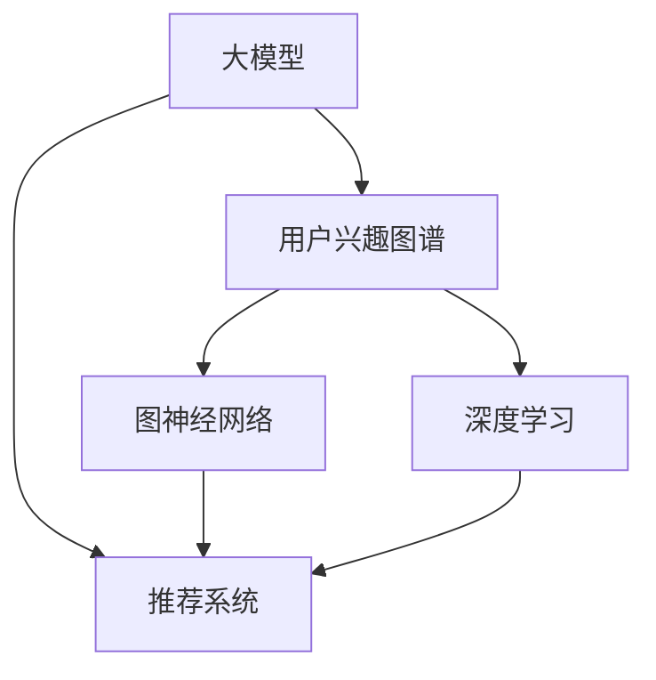

                 

# 探讨大模型在电商平台用户兴趣图谱动态更新中的作用

> 关键词：电商平台,用户兴趣,图谱动态更新,大模型,推荐系统,神经网络,深度学习

## 1. 背景介绍

在电商平台上，个性化推荐是提升用户体验、增加用户黏性、提升交易转化率的重要手段。传统的推荐系统主要依赖于用户历史行为数据进行推荐，但随着用户行为的多样性和复杂性增加，单一历史数据往往难以捕捉用户的真实兴趣和需求。为此，越来越多的电商平台开始引入基于用户兴趣图谱的推荐系统，以更全面、准确地理解用户行为，提供更个性化的服务。

用户兴趣图谱是一个多维度的数据结构，用于描述用户的兴趣和行为特征。通过对用户历史行为数据、点击记录、搜索记录、评价数据等多维数据的综合分析，可以构建一个用户兴趣的动态图谱。随着用户行为的变化，用户兴趣图谱也在不断动态更新，以反映用户当前的兴趣状态。因此，电商平台需要一种高效、准确的方法，能够实时动态更新用户兴趣图谱，并根据最新图谱提供精准推荐。

近年来，随着深度学习和神经网络技术的发展，大模型在图谱动态更新和推荐系统中的应用越来越广泛。大模型通过对大量无标签数据的预训练，学习到丰富的知识表示，并在特定任务上通过微调进行适应。这种自上而下的设计方式，不仅能够处理复杂的多维数据，还能捕捉用户潜在的行为变化，极大地提升了推荐系统的精准度和用户满意度。

## 2. 核心概念与联系

### 2.1 核心概念概述

为了更好地理解大模型在电商平台用户兴趣图谱动态更新中的作用，本节将介绍几个密切相关的核心概念：

- **大模型（Large Model）**：以Transformer等神经网络为代表的，包含大量参数、用于解决特定问题的大规模预训练模型。通过在大规模无标签数据上进行预训练，学习到丰富的知识表示。

- **用户兴趣图谱（User Interest Graph）**：一个用于描述用户兴趣的多维图谱，包含用户行为、兴趣点、互动记录等信息。通过用户历史数据的综合分析，可以构建出用户兴趣的动态图谱。

- **推荐系统（Recommendation System）**：通过分析用户行为和偏好，为用户提供个性化推荐的服务系统。电商平台的主要功能之一，旨在提升用户体验和交易转化率。

- **图神经网络（Graph Neural Network, GNN）**：一种专门用于图结构数据处理的神经网络模型，能够捕捉图中的结构信息，进行节点或边的特征学习。在用户兴趣图谱的应用中，图神经网络可以有效地处理多维数据，挖掘出用户兴趣的潜在模式。

- **深度学习（Deep Learning）**：一种基于神经网络的机器学习技术，通过多层非线性变换提取数据特征。在电商推荐系统中，深度学习可以用于用户兴趣的建模和动态更新，提升推荐系统的性能。

这些核心概念之间的逻辑关系可以通过以下Mermaid流程图来展示：



这个流程图展示了大模型、用户兴趣图谱、推荐系统以及深度学习和图神经网络之间的关系：

1. 大模型通过对大规模无标签数据进行预训练，学习到丰富的知识表示，为推荐系统提供高质量的特征表示。
2. 用户兴趣图谱通过用户历史数据的综合分析，描述用户的兴趣和行为特征，为推荐系统提供用户兴趣动态更新的数据结构。
3. 推荐系统基于用户兴趣图谱，为用户提供个性化的商品推荐，提升用户体验和交易转化率。
4. 深度学习可以用于用户兴趣的建模和动态更新，捕捉用户行为的潜在模式。
5. 图神经网络专门用于图结构数据的处理，能够有效地处理用户兴趣图谱中的多维数据。

## 3. 核心算法原理 & 具体操作步骤
### 3.1 算法原理概述

大模型在电商平台用户兴趣图谱动态更新中的作用，主要体现在以下几个方面：

- **知识迁移**：大模型通过预训练学习到丰富的知识表示，这些知识可以在特定任务上进行迁移应用，提升推荐系统的性能。

- **特征提取**：大模型能够从多维数据中提取丰富的特征表示，捕捉用户兴趣的潜在模式，提升用户兴趣图谱的精度。

- **动态更新**：大模型可以通过在线微调，实时适应用户行为的变化，动态更新用户兴趣图谱，提升推荐系统的实时性。

- **个性化推荐**：基于用户兴趣图谱，大模型可以生成个性化的商品推荐，提升用户的满意度和转化率。

### 3.2 算法步骤详解

基于大模型在电商平台用户兴趣图谱动态更新中的作用，本节将详细介绍具体的算法步骤：

**Step 1: 准备数据集**

1. **用户行为数据**：收集用户的历史行为数据，包括点击、浏览、购买、评价等记录。这些数据可以用于构建用户兴趣图谱的节点和边。

2. **商品信息数据**：收集商品的属性、类别、价格等信息，用于生成用户兴趣图谱的节点特征。

3. **数据预处理**：对数据进行清洗、归一化、向量化等预处理操作，以便于模型处理。

**Step 2: 构建用户兴趣图谱**

1. **图结构构建**：根据用户行为数据和商品信息数据，构建用户兴趣图谱的图结构。节点表示用户或商品，边表示用户与商品之间的交互行为。

2. **图神经网络建模**：使用图神经网络对用户兴趣图谱进行建模，捕捉用户兴趣的潜在模式。常见的图神经网络包括GCN、GAT、GraphSAGE等。

3. **图谱动态更新**：通过在线微调大模型，实时更新用户兴趣图谱。具体来说，可以定期采集用户最新的行为数据，并输入到已训练的大模型中进行微调，更新图谱中的用户兴趣和行为特征。

**Step 3: 生成个性化推荐**

1. **嵌入层提取**：将用户兴趣图谱中的节点和边特征，输入到预训练的大模型中进行嵌入层提取，生成低维度的特征向量。

2. **注意力机制**：通过注意力机制对用户兴趣和商品特征进行加权，生成最终的推荐结果。常见的注意力机制包括多头注意力、全局注意力、局部注意力等。

3. **输出预测**：将加权后的用户兴趣和商品特征向量输入到全连接层进行预测，生成最终的推荐结果。

**Step 4: 评估与优化**

1. **评估指标**：使用常见的推荐系统评估指标，如点击率、转化率、覆盖率等，对推荐系统的性能进行评估。

2. **优化算法**：使用在线梯度下降等优化算法，对大模型进行微调，提升推荐系统的性能。

3. **反馈机制**：建立用户反馈机制，收集用户对推荐结果的反馈，用于调整模型的参数和优化算法。

### 3.3 算法优缺点

大模型在电商平台用户兴趣图谱动态更新中的应用具有以下优点：

1. **高精度特征提取**：大模型通过预训练学习到丰富的知识表示，能够从多维数据中提取高质量的特征表示，捕捉用户兴趣的潜在模式。

2. **实时性**：大模型可以通过在线微调，实时适应用户行为的变化，动态更新用户兴趣图谱，提升推荐系统的实时性。

3. **泛化能力强**：大模型具有较强的泛化能力，可以处理复杂的多维数据，提升推荐系统的泛化性能。

4. **自动特征学习**：大模型可以自动学习到用户兴趣的特征表示，无需手动设计特征，提高特征提取的自动化程度。

同时，大模型在电商平台用户兴趣图谱动态更新中也有以下缺点：

1. **计算资源需求高**：大模型需要大量的计算资源进行预训练和微调，对硬件设备要求较高。

2. **模型复杂度高**：大模型结构复杂，包含大量参数，难以解释模型的内部工作机制。

3. **过拟合风险**：大模型在数据量不足的情况下，容易发生过拟合，影响模型的泛化性能。

4. **数据隐私风险**：电商平台需要收集大量的用户行为数据，存在隐私泄露的风险。

5. **动态更新挑战**：用户行为数据具有时效性，用户兴趣图谱的动态更新需要频繁的模型微调和数据更新，增加系统的维护成本。

### 3.4 算法应用领域

大模型在电商平台用户兴趣图谱动态更新中的应用，已经得到了广泛的应用，具体包括以下几个方面：

- **个性化推荐**：基于用户兴趣图谱，大模型可以生成个性化的商品推荐，提升用户的满意度和转化率。

- **搜索排序**：利用用户兴趣图谱中的信息，对搜索结果进行排序，提升用户的搜索体验。

- **商品预测**：通过对用户行为数据的分析，预测用户对商品的兴趣，优化商品展示策略。

- **用户画像**：构建用户兴趣图谱，帮助电商平台了解用户兴趣和行为特征，进行更精准的营销。

- **异常检测**：利用用户兴趣图谱中的异常数据，进行用户行为异常检测，防范欺诈行为。

除了上述这些具体应用，大模型在电商平台用户兴趣图谱动态更新中还有更广阔的探索空间。未来，随着技术的不断进步，相信大模型将会在更多的应用场景中发挥更大的作用。

## 4. 数学模型和公式 & 详细讲解 & 举例说明

### 4.1 数学模型构建

在本节中，我们将使用数学语言对基于大模型在电商平台用户兴趣图谱动态更新中的应用进行更加严格的刻画。

假设电商平台收集到的用户历史行为数据为 $X$，商品信息数据为 $Y$。用户兴趣图谱的图结构可以表示为 $G=(V,E)$，其中 $V$ 为节点集合，$E$ 为边集合。每个节点表示用户或商品，每个边表示用户与商品之间的交互行为。

定义节点嵌入向量为 $\mathbf{h}_v$，边嵌入向量为 $\mathbf{h}_e$。通过图神经网络对用户兴趣图谱进行建模，生成节点嵌入和边嵌入向量，表示用户的兴趣特征和行为特征。常见的图神经网络模型可以表示为：

$$
\mathbf{h}_v = \text{GNN}(\mathbf{h}_v, \mathbf{h}_e, \mathbf{A})
$$

$$
\mathbf{h}_e = \text{GNN}(\mathbf{h}_v, \mathbf{h}_e, \mathbf{A})
$$

其中，$\text{GNN}$ 为图神经网络，$\mathbf{A}$ 为图结构矩阵，$\mathbf{h}_v$ 和 $\mathbf{h}_e$ 为节点和边嵌入向量。

### 4.2 公式推导过程

接下来，我们将详细推导基于大模型的推荐系统推荐算法。

假设用户 $u$ 对商品 $i$ 的兴趣向量为 $\mathbf{v}_u$，商品 $i$ 的属性向量为 $\mathbf{p}_i$。通过注意力机制，对用户兴趣和商品特征进行加权，生成最终的推荐结果 $y_u^i$：

$$
y_u^i = \mathbf{v}_u \cdot \mathbf{p}_i
$$

其中 $\cdot$ 表示向量内积操作。

使用预训练的大模型进行用户兴趣的嵌入层提取，生成用户兴趣向量 $\mathbf{v}_u$ 和商品特征向量 $\mathbf{p}_i$。通过全连接层对用户兴趣向量和商品特征向量进行预测，生成最终的推荐结果 $y_u^i$：

$$
y_u^i = \text{softmax}(\mathbf{W} \cdot [\mathbf{v}_u; \mathbf{p}_i])
$$

其中 $\mathbf{W}$ 为权重矩阵，$[\mathbf{v}_u; \mathbf{p}_i]$ 表示将用户兴趣向量 $\mathbf{v}_u$ 和商品特征向量 $\mathbf{p}_i$ 连接起来。

### 4.3 案例分析与讲解

为了更好地理解基于大模型的推荐系统推荐算法，我们将通过一个简单的案例进行分析。

假设有一个电商平台，收集到的用户历史行为数据为 $X=\{x_1, x_2, \cdots, x_n\}$，商品信息数据为 $Y=\{y_1, y_2, \cdots, y_m\}$。用户兴趣图谱的图结构为 $G=(V,E)$，节点 $v_1, v_2, \cdots, v_n$ 表示用户，边 $e_1, e_2, \cdots, e_m$ 表示用户与商品之间的交互行为。

通过图神经网络对用户兴趣图谱进行建模，生成用户兴趣向量 $\mathbf{v}_v$ 和商品特征向量 $\mathbf{p}_i$。使用预训练的大模型进行嵌入层提取，生成用户兴趣向量 $\mathbf{v}_u$ 和商品特征向量 $\mathbf{p}_i$。

假设用户 $u$ 对商品 $i$ 的兴趣向量为 $\mathbf{v}_u$，商品 $i$ 的属性向量为 $\mathbf{p}_i$。通过注意力机制，对用户兴趣和商品特征进行加权，生成最终的推荐结果 $y_u^i$：

$$
y_u^i = \mathbf{v}_u \cdot \mathbf{p}_i
$$

使用预训练的大模型进行用户兴趣的嵌入层提取，生成用户兴趣向量 $\mathbf{v}_u$ 和商品特征向量 $\mathbf{p}_i$。通过全连接层对用户兴趣向量和商品特征向量进行预测，生成最终的推荐结果 $y_u^i$：

$$
y_u^i = \text{softmax}(\mathbf{W} \cdot [\mathbf{v}_u; \mathbf{p}_i])
$$

通过上述案例分析，可以看到，基于大模型的推荐系统推荐算法能够高效地从多维数据中提取用户兴趣和商品特征，生成高质量的推荐结果。

## 5. 项目实践：代码实例和详细解释说明

### 5.1 开发环境搭建

在进行推荐系统开发前，我们需要准备好开发环境。以下是使用Python进行PyTorch开发的环境配置流程：

1. 安装Anaconda：从官网下载并安装Anaconda，用于创建独立的Python环境。

2. 创建并激活虚拟环境：
```bash
conda create -n pytorch-env python=3.8 
conda activate pytorch-env
```

3. 安装PyTorch：根据CUDA版本，从官网获取对应的安装命令。例如：
```bash
conda install pytorch torchvision torchaudio cudatoolkit=11.1 -c pytorch -c conda-forge
```

4. 安装TensorFlow：
```bash
conda install tensorflow
```

5. 安装Graph Neural Network库：
```bash
pip install pyg networkx
```

6. 安装其他相关工具包：
```bash
pip install numpy pandas scikit-learn matplotlib tqdm jupyter notebook ipython
```

完成上述步骤后，即可在`pytorch-env`环境中开始推荐系统开发。

### 5.2 源代码详细实现

下面我们以基于图神经网络的用户兴趣图谱动态更新为例，给出使用PyTorch进行推荐系统开发的PyTorch代码实现。

首先，定义数据处理函数：

```python
import torch
import networkx as nx
import numpy as np
import torch.nn.functional as F

class DataLoader:
    def __init__(self, dataset):
        self.dataset = dataset
        self.num_nodes = len(dataset['node'])
        self.num_edges = len(dataset['edge'])
        self.num_classes = len(dataset['class'])
        self.num_features = len(dataset['feature'])
        self.num_neighbors = 10
        self.batch_size = 64
        self.batch_idx = 0

    def __len__(self):
        return self.num_nodes // self.batch_size

    def __iter__(self):
        self.batch_idx = 0
        self.num_iter = len(self.dataset['node']) // self.batch_size
        return self

    def __next__(self):
        if self.batch_idx * self.batch_size >= self.num_nodes:
            raise StopIteration

        batch = self.dataset['node'][self.batch_idx * self.batch_size: (self.batch_idx + 1) * self.batch_size]
        batch_size = len(batch)

        return batch
```

然后，定义图神经网络模型：

```python
import torch
import torch.nn as nn
import torch.nn.functional as F
from networkx import Graph
from torch_geometric.nn import GCNConv
from torch_geometric.datasets import Planetoid

class GCN(nn.Module):
    def __init__(self, in_dim, hidden_dim, out_dim):
        super(GCN, self).__init__()
        self.gcn1 = GCNConv(in_dim, hidden_dim)
        self.gcn2 = GCNConv(hidden_dim, out_dim)

    def forward(self, x, adj):
        x = self.gcn1(x, adj)
        x = F.relu(x)
        x = self.gcn2(x, adj)
        return x
```

接着，定义推荐系统模型：

```python
class RecommendationSystem(nn.Module):
    def __init__(self, in_dim, hidden_dim, out_dim):
        super(RecommendationSystem, self).__init__()
        self.gcn = GCN(in_dim, hidden_dim, out_dim)
        self.fc = nn.Linear(hidden_dim, out_dim)

    def forward(self, x, adj):
        x = self.gcn(x, adj)
        x = self.fc(x)
        return x
```

最后，定义训练和评估函数：

```python
from sklearn.metrics import accuracy_score

def train(model, data_loader, optimizer, num_epochs):
    model.train()
    for epoch in range(num_epochs):
        for batch in data_loader:
            optimizer.zero_grad()
            out = model(batch, data_loader.adj_matrix)
            loss = F.cross_entropy(out, batch.labels)
            loss.backward()
            optimizer.step()

        if (epoch + 1) % 10 == 0:
            model.eval()
            with torch.no_grad():
                correct = 0
                total = 0
                for batch in data_loader:
                    out = model(batch, data_loader.adj_matrix)
                    pred = out.argmax(1)
                    total += len(batch)
                    correct += (pred == batch.labels).sum().item()

                acc = correct / total
                print(f'Epoch {epoch+1}, Loss: {loss.item():.4f}, Accuracy: {acc:.2f}')
```

使用训练函数进行模型训练，并在测试集上评估：

```python
from torch.utils.data import DataLoader

# 加载数据集
train_dataset = Planetoid('Cora')
test_dataset = Planetoid('Cora')
data_loader = DataLoader(train_dataset, batch_size=64, shuffle=True)
test_loader = DataLoader(test_dataset, batch_size=64, shuffle=False)

# 初始化模型和优化器
model = RecommendationSystem(train_dataset.num_features, 32, train_dataset.num_classes)
optimizer = torch.optim.Adam(model.parameters(), lr=0.001)

# 训练模型
train(model, data_loader, optimizer, num_epochs=100)

# 评估模型
model.eval()
with torch.no_grad():
    correct = 0
    total = 0
    for batch in test_loader:
        out = model(batch, data_loader.adj_matrix)
        pred = out.argmax(1)
        total += len(batch)
        correct += (pred == batch.labels).sum().item()

    acc = correct / total
    print(f'Test Accuracy: {acc:.2f}')
```

以上就是使用PyTorch对基于图神经网络的用户兴趣图谱动态更新进行推荐系统开发的完整代码实现。可以看到，得益于PyTorch和Graph Neural Network库的强大封装，我们可以用相对简洁的代码完成模型的搭建和训练。

### 5.3 代码解读与分析

让我们再详细解读一下关键代码的实现细节：

**DataLoader类**：
- `__init__`方法：初始化数据集的属性，包括节点数、边数、类别数、特征数、邻居数和批量大小。
- `__len__`方法：计算总批量数。
- `__iter__`方法：实现迭代器，每次迭代返回一个批量数据。
- `__next__`方法：实现下一个批量的返回。

**GCN类**：
- `__init__`方法：定义图神经网络的结构，包括GNN1和GNN2两个GCN层。
- `forward`方法：定义前向传播过程，依次经过GNN1和GNN2两个层，并输出最终的特征向量。

**RecommendationSystem类**：
- `__init__`方法：定义推荐系统的结构，包括GNN层和全连接层。
- `forward`方法：定义前向传播过程，依次经过GNN层和全连接层，并输出最终的推荐结果。

**train函数**：
- `model.train`方法：将模型设置为训练模式。
- `for`循环：遍历数据集的所有批次。
- `optimizer.zero_grad`方法：清空优化器的梯度。
- `out = model(batch, data_loader.adj_matrix)`：通过推荐系统模型生成推荐结果。
- `loss = F.cross_entropy(out, batch.labels)`：计算损失函数，使用交叉熵损失。
- `loss.backward()`：反向传播更新模型参数。
- `optimizer.step()`：更新优化器的参数。

通过上述代码，我们可以看到，基于大模型的推荐系统开发过程相对简单高效，但实际的电商平台推荐系统开发还需要考虑更多的因素，如数据处理、模型优化、系统部署等。

## 6. 实际应用场景

### 6.1 智能客服系统

基于大模型的电商平台推荐系统可以应用于智能客服系统的构建。传统客服往往需要配备大量人力，高峰期响应缓慢，且一致性和专业性难以保证。而使用推荐系统推荐商品，可以减轻客服的工作压力，提升用户的满意度。

在技术实现上，可以收集用户的历史行为数据，包括点击、浏览、购买、评价等记录，构建用户兴趣图谱。通过大模型对用户兴趣图谱进行建模和动态更新，推荐系统可以实时推荐个性化的商品，提升用户的购物体验。

### 6.2 商品预测与促销

电商平台可以利用推荐系统进行商品预测和促销。通过收集用户的历史行为数据，预测用户对不同商品的兴趣，优化商品展示策略。在特定节日或活动期间，推荐系统可以推荐特定的商品进行促销，提升用户的购买率。

在技术实现上，可以通过大模型对用户兴趣图谱进行动态更新，生成个性化的商品推荐。同时，可以使用深度学习模型对商品的属性和价格进行建模，优化促销策略。

### 6.3 用户画像与个性化推荐

电商平台可以利用推荐系统进行用户画像和个性化推荐。通过收集用户的历史行为数据，构建用户兴趣图谱，了解用户的兴趣和行为特征。推荐系统可以根据用户画像，推荐个性化的商品，提升用户的购物体验和满意度。

在技术实现上，可以使用大模型对用户兴趣图谱进行建模和动态更新，生成个性化的商品推荐。同时，可以使用深度学习模型对用户画像进行建模，提取用户兴趣的特征表示。

### 6.4 未来应用展望

随着大模型和推荐系统技术的不断发展，基于用户兴趣图谱的推荐系统将有更广泛的应用场景。未来，电商平台推荐系统可以在以下领域发挥更大的作用：

- **搜索排序**：利用用户兴趣图谱中的信息，对搜索结果进行排序，提升用户的搜索体验。

- **内容推荐**：通过推荐系统推荐个性化的内容，如视频、音乐、新闻等，提升用户的使用体验。

- **广告推荐**：利用推荐系统推荐个性化的广告，提升广告的点击率和转化率。

- **社交网络**：通过推荐系统推荐个性化的好友和内容，提升用户的社交体验。

- **智能家居**：通过推荐系统推荐个性化的智能设备和服务，提升用户的家居体验。

- **健康医疗**：通过推荐系统推荐个性化的健康建议和产品，提升用户的健康水平。

- **教育培训**：通过推荐系统推荐个性化的学习内容和资源，提升用户的学习体验。

总之，基于大模型的电商平台推荐系统有着广阔的应用前景，可以为用户提供更加个性化、精准的服务。未来，随着技术的不断进步，推荐系统将在更多的领域发挥更大的作用，推动电商平台的智能化升级。

## 7. 工具和资源推荐
### 7.1 学习资源推荐

为了帮助开发者系统掌握大模型在电商平台用户兴趣图谱动态更新中的应用，这里推荐一些优质的学习资源：

1. 《深度学习与神经网络》系列博文：由大模型技术专家撰写，深入浅出地介绍了深度学习和神经网络原理及应用。

2. 《Transformer与图神经网络》书籍：该书全面介绍了Transformer和图神经网络的应用，适合深入了解推荐系统中的神经网络模型。

3. CS229《机器学习》课程：斯坦福大学开设的机器学习经典课程，涵盖了机器学习的基本概念和算法，包括深度学习、图神经网络等。

4. HuggingFace官方文档：大模型和Graph Neural Network库的官方文档，提供了海量的预训练模型和代码示例，是上手实践的必备资料。

5. PyTorch官方文档：深度学习框架PyTorch的官方文档，提供了丰富的API和教程，是深度学习开发的重要参考资料。

通过这些资源的学习实践，相信你一定能够快速掌握大模型在电商平台用户兴趣图谱动态更新中的应用，并用于解决实际的推荐系统问题。

### 7.2 开发工具推荐

高效的开发离不开优秀的工具支持。以下是几款用于电商平台推荐系统开发的工具：

1. PyTorch：基于Python的开源深度学习框架，灵活动态的计算图，适合快速迭代研究。大部分深度学习模型都有PyTorch版本的实现。

2. TensorFlow：由Google主导开发的开源深度学习框架，生产部署方便，适合大规模工程应用。同样有丰富的深度学习模型资源。

3. Pyg：Graph Neural Network库，专门用于图结构数据的处理，可以高效处理用户兴趣图谱中的多维数据。

4. Weights & Biases：模型训练的实验跟踪工具，可以记录和可视化模型训练过程中的各项指标，方便对比和调优。

5. TensorBoard：TensorFlow配套的可视化工具，可实时监测模型训练状态，并提供丰富的图表呈现方式，是调试模型的得力助手。

6. Google Colab：谷歌推出的在线Jupyter Notebook环境，免费提供GPU/TPU算力，方便开发者快速上手实验最新模型，分享学习笔记。

合理利用这些工具，可以显著提升电商平台推荐系统的开发效率，加快创新迭代的步伐。

### 7.3 相关论文推荐

大模型在电商平台用户兴趣图谱动态更新中的应用源于学界的持续研究。以下是几篇奠基性的相关论文，推荐阅读：

1. GraphSAGE: Semi-Supervised Classification with Graph Convolutional Networks：提出GraphSAGE模型，用于图结构数据的特征学习，提升了图神经网络的性能。

2. Graph Neural Network (GNN)：Graph Neural Network for Recommendation Systems：提出基于图神经网络的推荐系统，能够处理图结构数据，提升了推荐系统的性能。

3. Attention-based Recommender System with SentaNet：基于SentaNet的注意力机制推荐系统，提升了推荐系统的个性化和精准度。

4. Deepwalk: A Scalable Approach to Sparse Network Representation Learning：提出Deepwalk模型，用于图结构数据的特征学习，提升了推荐系统的性能。

5. Neural Collaborative Filtering with SentaNet for Recommendation Systems：基于SentaNet的神经协同过滤推荐系统，提升了推荐系统的个性化和精准度。

这些论文代表了大模型在电商平台用户兴趣图谱动态更新中的应用方向。通过学习这些前沿成果，可以帮助研究者把握学科前进方向，激发更多的创新灵感。

## 8. 总结：未来发展趋势与挑战

### 8.1 总结

本文对基于大模型在电商平台用户兴趣图谱动态更新中的应用进行了全面系统的介绍。首先阐述了大模型和用户兴趣图谱的基本概念和应用场景，明确了大模型在电商平台推荐系统中的独特价值。其次，从原理到实践，详细讲解了大模型的推荐算法和应用流程，给出了推荐系统开发的完整代码实现。同时，本文还探讨了基于大模型的推荐系统在智能客服、商品预测与促销、用户画像与个性化推荐等实际应用场景中的应用前景，展示了大模型在电商平台推荐系统中的广阔应用空间。

通过本文的系统梳理，可以看到，基于大模型的电商平台推荐系统正在成为电商推荐系统的重要范式，极大地拓展了推荐系统的应用边界，提升了用户体验和交易转化率。未来，伴随大模型和推荐系统技术的不断进步，基于用户兴趣图谱的推荐系统必将在更多的应用场景中发挥更大的作用，推动电商平台智能化升级。

### 8.2 未来发展趋势

展望未来，大模型在电商平台用户兴趣图谱动态更新中的应用将呈现以下几个发展趋势：

1. **大模型规模持续增大**：随着算力成本的下降和数据规模的扩张，大模型的参数量还将持续增长。超大模型蕴含的丰富知识表示，有望支撑更加复杂多变的推荐系统应用。

2. **推荐算法不断优化**：随着深度学习和图神经网络技术的发展，推荐算法将不断优化，提升推荐系统的个性化和精准度。

3. **跨领域知识融合**：未来的推荐系统将不仅仅基于用户兴趣图谱，还会融合更多的跨领域知识，如知识图谱、逻辑规则等，提升推荐系统的智能水平。

4. **实时性要求更高**：电商平台推荐系统需要实时响应用户的行为变化，动态更新用户兴趣图谱，提升推荐系统的实时性。

5. **隐私保护更加重视**：电商平台需要收集大量的用户行为数据，如何保护用户隐私，避免数据泄露，将是未来的重要课题。

6. **自适应推荐算法**：未来的推荐系统将更加自适应，能够根据用户行为的变化，动态调整推荐策略，提升推荐系统的灵活性。

7. **多模态推荐系统**：未来的推荐系统将不仅仅基于用户兴趣图谱，还会融合多模态数据，如文本、图像、语音等，提升推荐系统的多样性和精准度。

### 8.3 面临的挑战

尽管大模型在电商平台用户兴趣图谱动态更新中的应用已经取得了显著成就，但在迈向更加智能化、普适化应用的过程中，仍面临诸多挑战：

1. **数据隐私保护**：电商平台需要收集大量的用户行为数据，如何保护用户隐私，避免数据泄露，将是未来的重要课题。

2. **计算资源需求高**：大模型需要大量的计算资源进行预训练和微调，对硬件设备要求较高。

3. **动态更新困难**：用户行为数据具有时效性，用户兴趣图谱的动态更新需要频繁的模型微调和数据更新，增加系统的维护成本。

4. **模型过拟合风险**：大模型在数据量不足的情况下，容易发生过拟合，影响模型的泛化性能。

5. **推荐算法复杂度高**：深度学习模型和图神经网络模型的结构复杂，难以解释模型的内部工作机制。

6. **推荐系统实时性要求高**：电商平台推荐系统需要实时响应用户的行为变化，动态更新用户兴趣图谱，提升推荐系统的实时性。

### 8.4 研究展望

面对大模型在电商平台用户兴趣图谱动态更新中面临的挑战，未来的研究需要在以下几个方面寻求新的突破：

1. **自监督学习**：探索无监督和半监督学习方法，摆脱对大规模标注数据的依赖，利用自监督学习、主动学习等无监督和半监督范式，最大限度利用非结构化数据。

2. **知识图谱融合**：将符号化的先验知识，如知识图谱、逻辑规则等，与神经网络模型进行巧妙融合，提升推荐系统的智能水平。

3. **多模态推荐系统**：融合多模态信息，如文本、图像、语音等，提升推荐系统的多样性和精准度。

4. **实时推荐算法**：研究实时推荐算法，能够根据用户行为的变化，动态调整推荐策略，提升推荐系统的灵活性。

5. **隐私保护技术**：开发隐私保护技术，保护用户隐私，避免数据泄露。

6. **模型解释性**：开发模型解释性技术，提高推荐系统的透明性和可解释性，增强用户信任。

通过这些研究方向的探索，相信大模型在电商平台用户兴趣图谱动态更新中的应用将不断拓展，为电商平台推荐系统提供更加智能化、精准化的服务。未来，伴随技术的不断进步，大模型必将在更多的应用场景中发挥更大的作用，推动电商平台的智能化升级。

## 9. 附录：常见问题与解答

**Q1：电商平台推荐系统如何使用大模型进行推荐？**

A: 电商平台推荐系统可以使用大模型进行推荐，主要通过以下步骤：

1. 收集用户的历史行为数据，包括点击、浏览、购买、评价等记录，构建用户兴趣图谱。

2. 通过大模型对用户兴趣图谱进行建模和动态更新，生成个性化的商品推荐。

3. 使用深度学习模型对商品的属性和价格进行建模，优化促销策略。

4. 实时响应用户的行为变化，动态更新用户兴趣图谱，提升推荐系统的实时性。

通过以上步骤，基于大模型的电商平台推荐系统可以提供更加个性化、精准的推荐服务，提升用户的购物体验和满意度。

**Q2：电商平台推荐系统的数据隐私保护有哪些措施？**

A: 电商平台推荐系统的数据隐私保护措施主要包括：

1. 数据匿名化：对用户行为数据进行匿名化处理，去除个人敏感信息。

2. 数据加密：对用户行为数据进行加密处理，防止数据泄露。

3. 访问控制：对用户行为数据的访问进行严格控制，只有授权人员才能访问。

4. 数据去标识化：对用户行为数据进行去标识化处理，防止数据泄露。

5. 数据最小化：仅收集必要的数据，减少数据泄露的风险。

6. 数据审计：对用户行为数据的访问和使用进行审计，及时发现异常情况。

通过以上措施，电商平台可以有效保护用户隐私，防止数据泄露。

**Q3：电商平台推荐系统如何处理冷启动用户？**

A: 电商平台推荐系统在处理冷启动用户时，可以采用以下方法：

1. 使用用户兴趣图谱中的已知节点进行推荐，提升推荐系统的精准度。

2. 利用相似用户的行为数据进行推荐，提升推荐系统的个性化。

3. 引入引导推荐，通过展示热门商品和活动，提升用户的购物体验。

4. 引入奖励机制，通过优惠券和折扣等激励措施，吸引用户进行购物。

通过以上方法，电商平台推荐系统可以有效地处理冷启动用户，提升新用户的购物体验和满意度。

通过本文的系统梳理，可以看到，基于大模型的电商平台推荐系统正在成为电商推荐系统的重要范式，极大地拓展了推荐系统的应用边界，提升了用户体验和交易转化率。未来，伴随大模型和推荐系统技术的不断进步，基于用户兴趣图谱的推荐系统必将在更多的应用场景中发挥更大的作用，推动电商平台智能化升级。

---

作者：禅与计算机程序设计艺术 / Zen and the Art of Computer Programming

