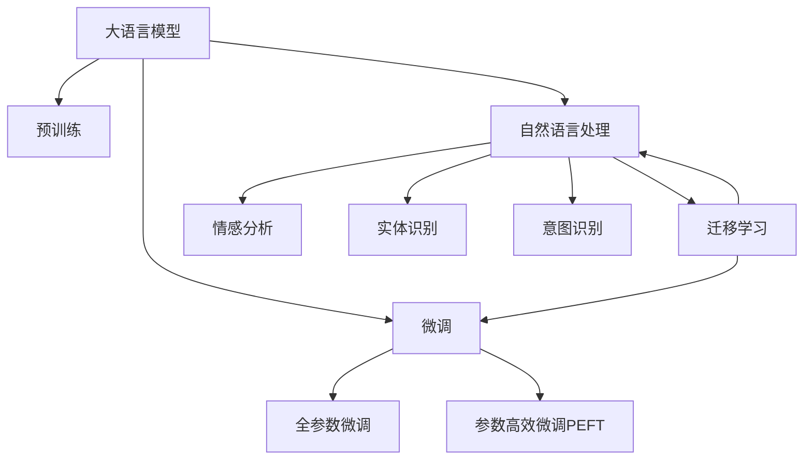

                 

# 探讨大模型在电商平台用户反馈分析中的潜力

## 1. 背景介绍

### 1.1 问题由来
随着电商平台的迅猛发展，用户反馈数据的数量和质量日益提升。如何高效利用这些数据，改进电商平台的用户体验，提升转化率和用户满意度，成为了电商平台运营的重要课题。传统的统计分析和人工审查方法已经无法满足海量数据处理和实时反馈响应的需求，亟需一种更高效、更自动化的方式。近年来，大语言模型在大规模数据上的优秀表现，为电商平台用户反馈分析提供了新的可能性。本文将探讨大模型在用户反馈分析中的潜力，分析其核心算法原理，并给出具体的操作步骤和实际案例。

### 1.2 问题核心关键点
大模型在电商平台用户反馈分析中的潜力主要体现在以下几个方面：

1. **自动理解用户反馈**：大模型能够自动分析用户的文本反馈，理解用户情感倾向和具体需求，无需人工干预。
2. **多模态数据融合**：大模型能够处理文字、图片、视频等多种反馈形式，提供更全面的用户画像。
3. **实时分析与响应**：大模型可以实时分析用户反馈，提供快速响应和决策支持。
4. **跨领域迁移能力**：大模型在多个平台和场景下具有较好的迁移能力，适应不同电商平台的需求。

本文将围绕上述核心点，深入分析大模型在电商平台用户反馈分析中的应用，包括算法原理、具体操作步骤、案例分析等。

## 2. 核心概念与联系

### 2.1 核心概念概述

为了更好地理解大模型在用户反馈分析中的潜力，我们先介绍几个关键概念：

- **大语言模型(Large Language Model, LLM)**：以自回归(如GPT)或自编码(如BERT)模型为代表的大规模预训练语言模型。通过在大规模无标签文本语料上进行预训练，学习通用的语言表示，具备强大的语言理解和生成能力。

- **预训练(Pre-training)**：指在大规模无标签文本语料上，通过自监督学习任务训练通用语言模型的过程。常见的预训练任务包括言语建模、掩码语言模型等。预训练使得模型学习到语言的通用表示。

- **微调(Fine-tuning)**：指在预训练模型的基础上，使用下游任务的少量标注数据，通过有监督地训练来优化模型在特定任务上的性能。通常只需要调整顶层分类器或解码器，并以较小的学习率更新全部或部分的模型参数。

- **迁移学习(Transfer Learning)**：指将一个领域学习到的知识，迁移应用到另一个不同但相关的领域的学习范式。大模型的预训练-微调过程即是一种典型的迁移学习方式。

- **自然语言处理(NLP)**：涉及计算机对自然语言的理解、处理和生成，是大模型应用的重要领域之一。

- **情感分析(Sentiment Analysis)**：识别和提取文本中的情感倾向，如正面、负面、中性等。

- **实体识别(Entity Recognition)**：识别文本中的特定实体，如人名、地名、机构名等。

- **意图识别(Intent Recognition)**：识别用户文本输入的意图，如询问、投诉、建议等。

这些概念之间的逻辑关系可以通过以下Mermaid流程图来展示：



这个流程图展示了大语言模型的核心概念及其之间的关系：

1. 大语言模型通过预训练获得基础能力。
2. 微调是对预训练模型进行任务特定的优化，可以分为全参数微调和参数高效微调（PEFT）。
3. 自然语言处理是连接预训练模型与用户反馈分析任务的桥梁，可以通过微调或提示学习来实现。
4. 情感分析、实体识别、意图识别等任务是大语言模型在用户反馈分析中的典型应用。
5. 迁移学习是连接预训练模型与不同电商平台用户反馈任务的桥梁，可以通过微调或提示学习来实现。

这些概念共同构成了大语言模型在用户反馈分析中的学习框架，使其能够在各种场景下发挥强大的语言理解和生成能力。

## 3. 核心算法原理 & 具体操作步骤
### 3.1 算法原理概述

大模型在电商平台用户反馈分析中的应用，主要基于两个核心算法：预训练和微调。预训练使得大模型学习到丰富的语言表示，微调则在大规模用户反馈数据上进一步优化模型，使其能够自动分析用户反馈，进行情感分析、实体识别、意图识别等任务。

以BERT为例，其核心算法流程如下：

1. **预训练**：在包含数百万条语句的大规模无标签语料上，通过掩码语言模型等自监督任务进行预训练，学习到通用语言表示。
2. **微调**：选择电商平台的客户反馈数据集，将预训练模型作为初始化参数，通过有监督地训练来优化模型在特定任务上的性能。

### 3.2 算法步骤详解

具体到电商平台用户反馈分析的微调过程，包括以下几个关键步骤：

**Step 1: 准备预训练模型和数据集**
- 选择合适的预训练语言模型 $M_{\theta}$ 作为初始化参数，如 BERT、GPT等。
- 准备电商平台的客户反馈数据集 $D=\{(x_i, y_i)\}_{i=1}^N$，其中 $x_i$ 为原始用户反馈，$y_i$ 为标注数据，如情感、实体、意图等。

**Step 2: 添加任务适配层**
- 根据任务类型，在预训练模型顶层设计合适的输出层和损失函数。例如，对于情感分析任务，通常在顶层添加线性分类器和交叉熵损失函数。
- 对于实体识别任务，可以设计序列标注模型，输出标签序列。

**Step 3: 设置微调超参数**
- 选择合适的优化算法及其参数，如 AdamW、SGD 等，设置学习率、批大小、迭代轮数等。
- 设置正则化技术及强度，包括权重衰减、Dropout、Early Stopping 等。
- 确定冻结预训练参数的策略，如仅微调顶层，或全部参数都参与微调。

**Step 4: 执行梯度训练**
- 将训练集数据分批次输入模型，前向传播计算损失函数。
- 反向传播计算参数梯度，根据设定的优化算法和学习率更新模型参数。
- 周期性在验证集上评估模型性能，根据性能指标决定是否触发 Early Stopping。
- 重复上述步骤直到满足预设的迭代轮数或 Early Stopping 条件。

**Step 5: 测试和部署**
- 在测试集上评估微调后模型 $M_{\hat{\theta}}$ 的性能，对比微调前后的精度提升。
- 使用微调后的模型对新样本进行推理预测，集成到实际的应用系统中。
- 持续收集新的数据，定期重新微调模型，以适应数据分布的变化。

### 3.3 算法优缺点

大模型在电商平台用户反馈分析中的应用，具有以下优点：

1. **高效自动分析**：大模型能够自动理解用户反馈，无需人工干预，提升效率。
2. **泛化能力强**：大模型经过大规模预训练，能够较好地泛化到不同电商平台和场景。
3. **多模态支持**：大模型可以处理多种数据形式，如文本、图片、视频等，提供更全面的用户画像。
4. **实时响应**：大模型可以实时分析用户反馈，提供快速响应和决策支持。
5. **持续学习**：大模型可以持续学习新数据，适应数据分布的变化。

同时，大模型在电商平台用户反馈分析中也存在一些局限性：

1. **依赖标注数据**：微调效果很大程度上取决于标注数据的质量和数量，标注数据的获取和标注成本较高。
2. **模型复杂度高**：大模型参数量大，计算和存储成本较高。
3. **需要大量计算资源**：微调过程中需要大量计算资源，包括高性能的GPU/TPU等硬件设备。
4. **可解释性不足**：大模型通常缺乏可解释性，难以解释其内部工作机制和决策逻辑。

尽管存在这些局限性，但大模型的潜力和优势仍然不容忽视，其在电商平台用户反馈分析中的应用将带来巨大的提升空间。

### 3.4 算法应用领域

大模型在电商平台用户反馈分析中的应用，已经在游戏、电商、教育等多个领域取得了显著效果。以下是一些典型应用场景：

- **游戏行业**：在游戏行业中，用户反馈主要包括游戏体验、游戏内容、游戏更新等方面。通过大模型进行情感分析和实体识别，游戏公司能够及时了解用户需求和意见，提升游戏品质和用户满意度。
- **电商行业**：在电商行业中，用户反馈主要包括商品评价、服务评价、购物体验等方面。通过大模型进行情感分析和意图识别，电商平台能够快速响应用户反馈，改进商品和提升服务质量。
- **教育行业**：在教育行业中，用户反馈主要包括课程评价、教师评价、学习体验等方面。通过大模型进行情感分析和实体识别，教育机构能够及时了解学生需求和反馈，改进教学内容和方式，提升教育质量。

## 4. 数学模型和公式 & 详细讲解  
### 4.1 数学模型构建

为了更好地理解大模型在电商平台用户反馈分析中的潜力，本节将介绍几个关键数学模型：

- **情感分类模型**：以二分类任务为例，使用线性分类器进行情感分析，损失函数为交叉熵损失。
- **实体识别模型**：使用序列标注模型，输出标签序列，损失函数为序列标注任务的交叉熵损失。
- **意图识别模型**：使用分类模型，输出意图标签，损失函数为分类任务的交叉熵损失。

以BERT为例，其数学模型构建如下：

- **情感分类模型**：
$$
\ell(\hat{y}, y) = -\frac{1}{N}\sum_{i=1}^N [y_i\log \hat{y_i} + (1-y_i)\log (1-\hat{y_i})]
$$
其中 $\hat{y}$ 为模型预测的情感概率分布，$y$ 为真实标签。

- **实体识别模型**：
$$
\ell(\hat{y}, y) = -\frac{1}{N}\sum_{i=1}^N [\sum_{j=1}^{n} y_{ij} \log \hat{y}_{ij}]
$$
其中 $y_{ij}$ 为第 $i$ 个样本的第 $j$ 个实体标签，$\hat{y}_{ij}$ 为模型预测的概率分布。

- **意图识别模型**：
$$
\ell(\hat{y}, y) = -\frac{1}{N}\sum_{i=1}^N [y_i\log \hat{y_i}]
$$
其中 $y_i$ 为真实意图标签，$\hat{y_i}$ 为模型预测的意图概率分布。

### 4.2 公式推导过程

以下我们以情感分类任务为例，推导交叉熵损失函数的计算过程。

假设模型 $M_{\theta}$ 在输入 $x$ 上的输出为 $\hat{y}=M_{\theta}(x) \in [0,1]$，表示样本属于正类的概率。真实标签 $y \in \{0,1\}$。则二分类交叉熵损失函数定义为：

$$
\ell(M_{\theta}(x),y) = -[y\log \hat{y} + (1-y)\log (1-\hat{y})]
$$

将其代入经验风险公式，得：

$$
\mathcal{L}(\theta) = -\frac{1}{N}\sum_{i=1}^N [y_i\log M_{\theta}(x_i)+(1-y_i)\log(1-M_{\theta}(x_i))]
$$

根据链式法则，损失函数对参数 $\theta_k$ 的梯度为：

$$
\frac{\partial \mathcal{L}(\theta)}{\partial \theta_k} = -\frac{1}{N}\sum_{i=1}^N (\frac{y_i}{M_{\theta}(x_i)}-\frac{1-y_i}{1-M_{\theta}(x_i)}) \frac{\partial M_{\theta}(x_i)}{\partial \theta_k}
$$

其中 $\frac{\partial M_{\theta}(x_i)}{\partial \theta_k}$ 可进一步递归展开，利用自动微分技术完成计算。

在得到损失函数的梯度后，即可带入参数更新公式，完成模型的迭代优化。重复上述过程直至收敛，最终得到适应电商平台用户反馈任务的最优模型参数 $\theta^*$。

## 5. 项目实践：代码实例和详细解释说明
### 5.1 开发环境搭建

在进行用户反馈分析的微调实践前，我们需要准备好开发环境。以下是使用Python进行PyTorch开发的环境配置流程：

1. 安装Anaconda：从官网下载并安装Anaconda，用于创建独立的Python环境。

2. 创建并激活虚拟环境：
```bash
conda create -n pytorch-env python=3.8 
conda activate pytorch-env
```

3. 安装PyTorch：根据CUDA版本，从官网获取对应的安装命令。例如：
```bash
conda install pytorch torchvision torchaudio cudatoolkit=11.1 -c pytorch -c conda-forge
```

4. 安装Transformers库：
```bash
pip install transformers
```

5. 安装各类工具包：
```bash
pip install numpy pandas scikit-learn matplotlib tqdm jupyter notebook ipython
```

完成上述步骤后，即可在`pytorch-env`环境中开始微调实践。

### 5.2 源代码详细实现

下面我们以电商平台情感分类任务为例，给出使用Transformers库对BERT模型进行微调的PyTorch代码实现。

首先，定义情感分类任务的数据处理函数：

```python
from transformers import BertTokenizer
from torch.utils.data import Dataset
import torch

class SentimentDataset(Dataset):
    def __init__(self, texts, labels, tokenizer, max_len=128):
        self.texts = texts
        self.labels = labels
        self.tokenizer = tokenizer
        self.max_len = max_len
        
    def __len__(self):
        return len(self.texts)
    
    def __getitem__(self, item):
        text = self.texts[item]
        label = self.labels[item]
        
        encoding = self.tokenizer(text, return_tensors='pt', max_length=self.max_len, padding='max_length', truncation=True)
        input_ids = encoding['input_ids'][0]
        attention_mask = encoding['attention_mask'][0]
        
        # 对label进行编码
        encoded_label = label2id[label] if label in label2id else 0
        labels = torch.tensor([encoded_label], dtype=torch.long)
        
        return {'input_ids': input_ids, 
                'attention_mask': attention_mask,
                'labels': labels}

# 标签与id的映射
label2id = {'正面': 1, '负面': 0}
id2label = {v: k for k, v in label2id.items()}

# 创建dataset
tokenizer = BertTokenizer.from_pretrained('bert-base-cased')

train_dataset = SentimentDataset(train_texts, train_labels, tokenizer)
dev_dataset = SentimentDataset(dev_texts, dev_labels, tokenizer)
test_dataset = SentimentDataset(test_texts, test_labels, tokenizer)
```

然后，定义模型和优化器：

```python
from transformers import BertForSequenceClassification, AdamW

model = BertForSequenceClassification.from_pretrained('bert-base-cased', num_labels=len(label2id))

optimizer = AdamW(model.parameters(), lr=2e-5)
```

接着，定义训练和评估函数：

```python
from torch.utils.data import DataLoader
from tqdm import tqdm
from sklearn.metrics import accuracy_score, precision_recall_fscore_support

device = torch.device('cuda') if torch.cuda.is_available() else torch.device('cpu')
model.to(device)

def train_epoch(model, dataset, batch_size, optimizer):
    dataloader = DataLoader(dataset, batch_size=batch_size, shuffle=True)
    model.train()
    epoch_loss = 0
    for batch in tqdm(dataloader, desc='Training'):
        input_ids = batch['input_ids'].to(device)
        attention_mask = batch['attention_mask'].to(device)
        labels = batch['labels'].to(device)
        model.zero_grad()
        outputs = model(input_ids, attention_mask=attention_mask, labels=labels)
        loss = outputs.loss
        epoch_loss += loss.item()
        loss.backward()
        optimizer.step()
    return epoch_loss / len(dataloader)

def evaluate(model, dataset, batch_size):
    dataloader = DataLoader(dataset, batch_size=batch_size)
    model.eval()
    preds, labels = [], []
    with torch.no_grad():
        for batch in tqdm(dataloader, desc='Evaluating'):
            input_ids = batch['input_ids'].to(device)
            attention_mask = batch['attention_mask'].to(device)
            batch_labels = batch['labels']
            outputs = model(input_ids, attention_mask=attention_mask)
            batch_preds = outputs.logits.argmax(dim=1).to('cpu').tolist()
            batch_labels = batch_labels.to('cpu').tolist()
            for pred, label in zip(batch_preds, batch_labels):
                preds.append(pred)
                labels.append(label)
                
    print('Accuracy:', accuracy_score(labels, preds))
    print('Precision, Recall, F1-score:', precision_recall_fscore_support(labels, preds, average='macro'))
```

最后，启动训练流程并在测试集上评估：

```python
epochs = 5
batch_size = 16

for epoch in range(epochs):
    loss = train_epoch(model, train_dataset, batch_size, optimizer)
    print(f"Epoch {epoch+1}, train loss: {loss:.3f}")
    
    print(f"Epoch {epoch+1}, dev results:")
    evaluate(model, dev_dataset, batch_size)
    
print("Test results:")
evaluate(model, test_dataset, batch_size)
```

以上就是使用PyTorch对BERT进行电商平台情感分类任务微调的完整代码实现。可以看到，得益于Transformers库的强大封装，我们可以用相对简洁的代码完成BERT模型的加载和微调。

### 5.3 代码解读与分析

让我们再详细解读一下关键代码的实现细节：

**SentimentDataset类**：
- `__init__`方法：初始化文本、标签、分词器等关键组件。
- `__len__`方法：返回数据集的样本数量。
- `__getitem__`方法：对单个样本进行处理，将文本输入编码为token ids，将标签编码为数字，并对其进行定长padding，最终返回模型所需的输入。

**label2id和id2label字典**：
- 定义了标签与数字id之间的映射关系，用于将预测结果解码为真实的标签。

**训练和评估函数**：
- 使用PyTorch的DataLoader对数据集进行批次化加载，供模型训练和推理使用。
- 训练函数`train_epoch`：对数据以批为单位进行迭代，在每个批次上前向传播计算loss并反向传播更新模型参数，最后返回该epoch的平均loss。
- 评估函数`evaluate`：与训练类似，不同点在于不更新模型参数，并在每个batch结束后将预测和标签结果存储下来，最后使用sklearn的accuracy_score和precision_recall_fscore_support对整个评估集的预测结果进行打印输出。

**训练流程**：
- 定义总的epoch数和batch size，开始循环迭代
- 每个epoch内，先在训练集上训练，输出平均loss
- 在验证集上评估，输出准确率和其他分类指标
- 所有epoch结束后，在测试集上评估，给出最终测试结果

可以看到，PyTorch配合Transformers库使得BERT微调的代码实现变得简洁高效。开发者可以将更多精力放在数据处理、模型改进等高层逻辑上，而不必过多关注底层的实现细节。

当然，工业级的系统实现还需考虑更多因素，如模型的保存和部署、超参数的自动搜索、更灵活的任务适配层等。但核心的微调范式基本与此类似。

## 6. 实际应用场景
### 6.1 智能客服系统

基于大语言模型微调的对话技术，可以广泛应用于智能客服系统的构建。传统客服往往需要配备大量人力，高峰期响应缓慢，且一致性和专业性难以保证。而使用微调后的对话模型，可以7x24小时不间断服务，快速响应客户咨询，用自然流畅的语言解答各类常见问题。

在技术实现上，可以收集企业内部的历史客服对话记录，将问题和最佳答复构建成监督数据，在此基础上对预训练对话模型进行微调。微调后的对话模型能够自动理解用户意图，匹配最合适的答案模板进行回复。对于客户提出的新问题，还可以接入检索系统实时搜索相关内容，动态组织生成回答。如此构建的智能客服系统，能大幅提升客户咨询体验和问题解决效率。

### 6.2 金融舆情监测

金融机构需要实时监测市场舆论动向，以便及时应对负面信息传播，规避金融风险。传统的人工监测方式成本高、效率低，难以应对网络时代海量信息爆发的挑战。基于大语言模型微调的文本分类和情感分析技术，为金融舆情监测提供了新的解决方案。

具体而言，可以收集金融领域相关的新闻、报道、评论等文本数据，并对其进行主题标注和情感标注。在此基础上对预训练语言模型进行微调，使其能够自动判断文本属于何种主题，情感倾向是正面、中性还是负面。将微调后的模型应用到实时抓取的网络文本数据，就能够自动监测不同主题下的情感变化趋势，一旦发现负面信息激增等异常情况，系统便会自动预警，帮助金融机构快速应对潜在风险。

### 6.3 个性化推荐系统

当前的推荐系统往往只依赖用户的历史行为数据进行物品推荐，无法深入理解用户的真实兴趣偏好。基于大语言模型微调技术，个性化推荐系统可以更好地挖掘用户行为背后的语义信息，从而提供更精准、多样的推荐内容。

在实践中，可以收集用户浏览、点击、评论、分享等行为数据，提取和用户交互的物品标题、描述、标签等文本内容。将文本内容作为模型输入，用户的后续行为（如是否点击、购买等）作为监督信号，在此基础上微调预训练语言模型。微调后的模型能够从文本内容中准确把握用户的兴趣点。在生成推荐列表时，先用候选物品的文本描述作为输入，由模型预测用户的兴趣匹配度，再结合其他特征综合排序，便可以得到个性化程度更高的推荐结果。

### 6.4 未来应用展望

随着大语言模型微调技术的发展，其在电商平台用户反馈分析中的潜力将进一步被挖掘。未来，大模型将在更广泛的场景下发挥作用，为电商平台的运营和用户反馈处理带来更多创新。

在智慧零售领域，基于大模型的用户反馈分析，可以提升商品推荐、库存管理、物流优化等方面的决策水平，实现更高效的供应链管理。

在智能家居领域，通过分析用户的反馈数据，可以优化家居设备的智能配置和使用，提升用户的生活质量。

在健康医疗领域，基于用户的健康反馈，可以为医生提供更全面的病历信息，辅助诊断和治疗决策。

此外，在智能制造、智慧农业、智能交通等众多领域，大语言模型微调技术也将不断拓展应用，为各行各业带来更多智能化的解决方案。相信随着技术的日益成熟，大语言模型微调必将在构建智能化的未来社会中扮演越来越重要的角色。

## 7. 工具和资源推荐
### 7.1 学习资源推荐

为了帮助开发者系统掌握大语言模型微调的理论基础和实践技巧，这里推荐一些优质的学习资源：

1. 《Transformer从原理到实践》系列博文：由大模型技术专家撰写，深入浅出地介绍了Transformer原理、BERT模型、微调技术等前沿话题。

2. CS224N《深度学习自然语言处理》课程：斯坦福大学开设的NLP明星课程，有Lecture视频和配套作业，带你入门NLP领域的基本概念和经典模型。

3. 《Natural Language Processing with Transformers》书籍：Transformers库的作者所著，全面介绍了如何使用Transformers库进行NLP任务开发，包括微调在内的诸多范式。

4. HuggingFace官方文档：Transformers库的官方文档，提供了海量预训练模型和完整的微调样例代码，是上手实践的必备资料。

5. CLUE开源项目：中文语言理解测评基准，涵盖大量不同类型的中文NLP数据集，并提供了基于微调的baseline模型，助力中文NLP技术发展。

通过对这些资源的学习实践，相信你一定能够快速掌握大语言模型微调的精髓，并用于解决实际的NLP问题。
###  7.2 开发工具推荐

高效的开发离不开优秀的工具支持。以下是几款用于大语言模型微调开发的常用工具：

1. PyTorch：基于Python的开源深度学习框架，灵活动态的计算图，适合快速迭代研究。大部分预训练语言模型都有PyTorch版本的实现。

2. TensorFlow：由Google主导开发的开源深度学习框架，生产部署方便，适合大规模工程应用。同样有丰富的预训练语言模型资源。

3. Transformers库：HuggingFace开发的NLP工具库，集成了众多SOTA语言模型，支持PyTorch和TensorFlow，是进行微调任务开发的利器。

4. Weights & Biases：模型训练的实验跟踪工具，可以记录和可视化模型训练过程中的各项指标，方便对比和调优。与主流深度学习框架无缝集成。

5. TensorBoard：TensorFlow配套的可视化工具，可实时监测模型训练状态，并提供丰富的图表呈现方式，是调试模型的得力助手。

6. Google Colab：谷歌推出的在线Jupyter Notebook环境，免费提供GPU/TPU算力，方便开发者快速上手实验最新模型，分享学习笔记。

合理利用这些工具，可以显著提升大语言模型微调任务的开发效率，加快创新迭代的步伐。

### 7.3 相关论文推荐

大语言模型和微调技术的发展源于学界的持续研究。以下是几篇奠基性的相关论文，推荐阅读：

1. Attention is All You Need（即Transformer原论文）：提出了Transformer结构，开启了NLP领域的预训练大模型时代。

2. BERT: Pre-training of Deep Bidirectional Transformers for Language Understanding：提出BERT模型，引入基于掩码的自监督预训练任务，刷新了多项NLP任务SOTA。

3. Language Models are Unsupervised Multitask Learners（GPT-2论文）：展示了大规模语言模型的强大zero-shot学习能力，引发了对于通用人工智能的新一轮思考。

4. Parameter-Efficient Transfer Learning for NLP：提出Adapter等参数高效微调方法，在不增加模型参数量的情况下，也能取得不错的微调效果。

5. Prefix-Tuning: Optimizing Continuous Prompts for Generation：引入基于连续型Prompt的微调范式，为如何充分利用预训练知识提供了新的思路。

6. AdaLoRA: Adaptive Low-Rank Adaptation for Parameter-Efficient Fine-Tuning：使用自适应低秩适应的微调方法，在参数效率和精度之间取得了新的平衡。

这些论文代表了大语言模型微调技术的发展脉络。通过学习这些前沿成果，可以帮助研究者把握学科前进方向，激发更多的创新灵感。

## 8. 总结：未来发展趋势与挑战
### 8.1 总结

本文对大语言模型在电商平台用户反馈分析中的潜力进行了全面系统的介绍。首先阐述了用户反馈分析的背景和意义，明确了大模型在处理大规模用户反馈数据中的优势。其次，从原理到实践，详细讲解了大模型的数学模型和算法原理，给出了微调任务开发的完整代码实例。同时，本文还广泛探讨了大模型在电商平台用户反馈分析中的应用场景，展示了其巨大的潜力。

通过本文的系统梳理，可以看到，大模型在用户反馈分析中的潜力正逐渐被发掘，其高效、准确、自动化的特性使其在电商平台中具有广泛的应用前景。未来，大模型将进一步推动电商平台的智能化转型，提升用户体验，优化运营策略，为电商行业带来更深远的影响。

### 8.2 未来发展趋势

展望未来，大语言模型在电商平台用户反馈分析中的潜力将进一步被挖掘。未来，大模型将在以下几个方面实现新的突破：

1. **多模态数据融合**：大模型能够处理图像、视频等多模态数据，结合文本数据，提供更全面的用户画像。

2. **自监督学习**：利用未标注数据进行自监督学习，进一步提升模型的泛化能力和适应性。

3. **少样本学习和零样本学习**：通过提示学习和自适应学习范式，大模型能够在少量或无标注样本下进行高效微调。

4. **跨领域迁移学习**：大模型在不同领域之间的迁移学习能力将进一步提升，适应更多应用场景。

5. **实时计算和推理**：大模型将更加注重实时计算和推理优化，满足实时响应的需求。

6. **个性化推荐和智能客服**：基于大模型的个性化推荐和智能客服系统，将进一步提升用户满意度，提升用户体验。

以上趋势凸显了大语言模型在电商平台用户反馈分析中的广阔前景。这些方向的探索发展，必将进一步提升大模型在电商平台中的应用价值，推动电商行业的智能化转型。

### 8.3 面临的挑战

尽管大语言模型在电商平台用户反馈分析中具有巨大的潜力，但在实现过程中仍面临诸多挑战：

1. **数据质量和多样性**：电商平台用户反馈数据存在噪音、不平衡等问题，影响模型训练效果。需要进一步优化数据处理和标注过程，提升数据质量和多样性。

2. **计算资源消耗**：大模型在微调过程中需要大量的计算资源，包括高性能GPU/TPU设备。如何降低计算成本，提高计算效率，仍是一个重要问题。

3. **模型可解释性和公平性**：大模型的决策过程缺乏可解释性，难以理解其内部工作机制。同时，模型可能存在偏见，影响公平性。需要进一步研究模型的可解释性和公平性问题。

4. **隐私和安全性**：电商平台用户反馈数据涉及隐私信息，如何保护用户隐私，防止数据泄露，是一个重要问题。

5. **技术门槛和成本**：大模型的微调需要较高的技术门槛和资金投入，如何降低技术门槛，降低成本，是推广应用的重要挑战。

尽管存在这些挑战，但大语言模型在电商平台用户反馈分析中的应用前景仍然广阔，需要学界和产业界共同努力，克服挑战，推动技术的广泛应用。

### 8.4 研究展望

未来，大语言模型在电商平台用户反馈分析中的应用将不断拓展，带来更多创新和突破。以下是我们对未来研究的展望：

1. **多模态数据融合与分析**：结合图像、视频等多模态数据，提升用户画像的全面性和准确性，为用户提供更个性化的服务。

2. **跨领域迁移学习和自适应学习**：利用少样本学习和自适应学习范式，提升大模型在不同领域和场景下的适应能力。

3. **实时计算与推理优化**：进一步优化大模型的计算图，提升推理速度和效率，实现实时响应。

4. **可解释性和公平性研究**：研究大模型的可解释性和公平性问题，提升用户信任和满意度。

5. **隐私和安全保护**：研究数据隐私保护技术，确保用户反馈数据的保密性和安全性。

6. **开源工具和平台**：推动大模型微调技术的开源化和平台化，降低技术门槛，推动技术的广泛应用。

这些研究方向将引领大语言模型在电商平台用户反馈分析中的应用走向深入，为电商平台提供更智能、更高效的用户反馈处理能力，提升用户体验，优化运营策略。相信随着技术的不断进步，大语言模型在电商平台中的应用将越来越广泛，推动电商行业的智能化转型。

## 9. 附录：常见问题与解答
----------------------------------------------------------------

**Q1：大语言模型微调是否适用于所有电商平台用户反馈分析任务？**

A: 大语言模型微调在大多数电商平台用户反馈分析任务上都能取得不错的效果，特别是对于数据量较小的任务。但对于一些特定领域的任务，如医疗、法律等，仅仅依靠通用语料预训练的模型可能难以很好地适应。此时需要在特定领域语料上进一步预训练，再进行微调，才能获得理想效果。此外，对于一些需要时效性、个性化很强的任务，如对话、推荐等，微调方法也需要针对性的改进优化。

**Q2：微调过程中如何选择合适的学习率？**

A: 微调的学习率一般要比预训练时小1-2个数量级，如果使用过大的学习率，容易破坏预训练权重，导致过拟合。一般建议从1e-5开始调参，逐步减小学习率，直至收敛。也可以使用warmup策略，在开始阶段使用较小的学习率，再逐渐过渡到预设值。需要注意的是，不同的优化器(如AdamW、Adafactor等)以及不同的学习率调度策略，可能需要设置不同的学习率阈值。

**Q3：采用大模型微调时会面临哪些资源瓶颈？**

A: 目前主流的预训练大模型动辄以亿计的参数规模，对算力、内存、存储都提出了很高的要求。GPU/TPU等高性能设备是必不可少的，但即便如此，超大批次的训练和推理也可能遇到显存不足的问题。因此需要采用一些资源优化技术，如梯度积累、混合精度训练、模型并行等，来突破硬件瓶颈。同时，模型的存储和读取也可能占用大量时间和空间，需要采用模型压缩、稀疏化存储等方法进行优化。

**Q4：如何缓解微调过程中的过拟合问题？**

A: 过拟合是微调面临的主要挑战，尤其是在标注数据不足的情况下。常见的缓解策略包括：
1. 数据增强：通过回译、近义替换等方式扩充训练集
2. 正则化：使用L2正则、Dropout、Early Stopping等避免过拟合
3. 对抗训练：引入对抗样本，提高模型鲁棒性
4. 参数高效微调：只调整少量参数(如Adapter、Prefix等)，减小过拟合风险
5. 多模型集成：训练多个微调模型，取平均输出，抑制过拟合

这些策略往往需要根据具体任务和数据特点进行灵活组合。只有在数据、模型、训练、推理等各环节进行全面优化，才能最大限度地发挥大模型微调的威力。

**Q5：微调模型在落地部署时需要注意哪些问题？**

A: 将微调模型转化为实际应用，还需要考虑以下因素：
1. 模型裁剪：去除不必要的层和参数，减小模型尺寸，加快推理速度
2. 量化加速：将浮点模型转为定点模型，压缩存储空间，提高计算效率
3. 服务化封装：将模型封装为标准化服务接口，便于集成调用
4. 弹性伸缩：根据请求流量动态调整资源配置，平衡服务质量和成本
5. 监控告警：实时采集系统指标，设置异常告警阈值，确保服务稳定性
6. 安全防护：采用访问鉴权、数据脱敏等措施，保障数据和模型安全

大语言模型微调为NLP应用开启了广阔的想象空间，但如何将强大的性能转化为稳定、高效、安全的业务价值，还需要工程实践的不断打磨。唯有从数据、算法、工程、业务等多个维度协同发力，才能真正实现人工智能技术在垂直行业的规模化落地。总之，微调需要开发者根据具体任务，不断迭代和优化模型、数据和算法，方能得到理想的效果。

---

作者：禅与计算机程序设计艺术 / Zen and the Art of Computer Programming

