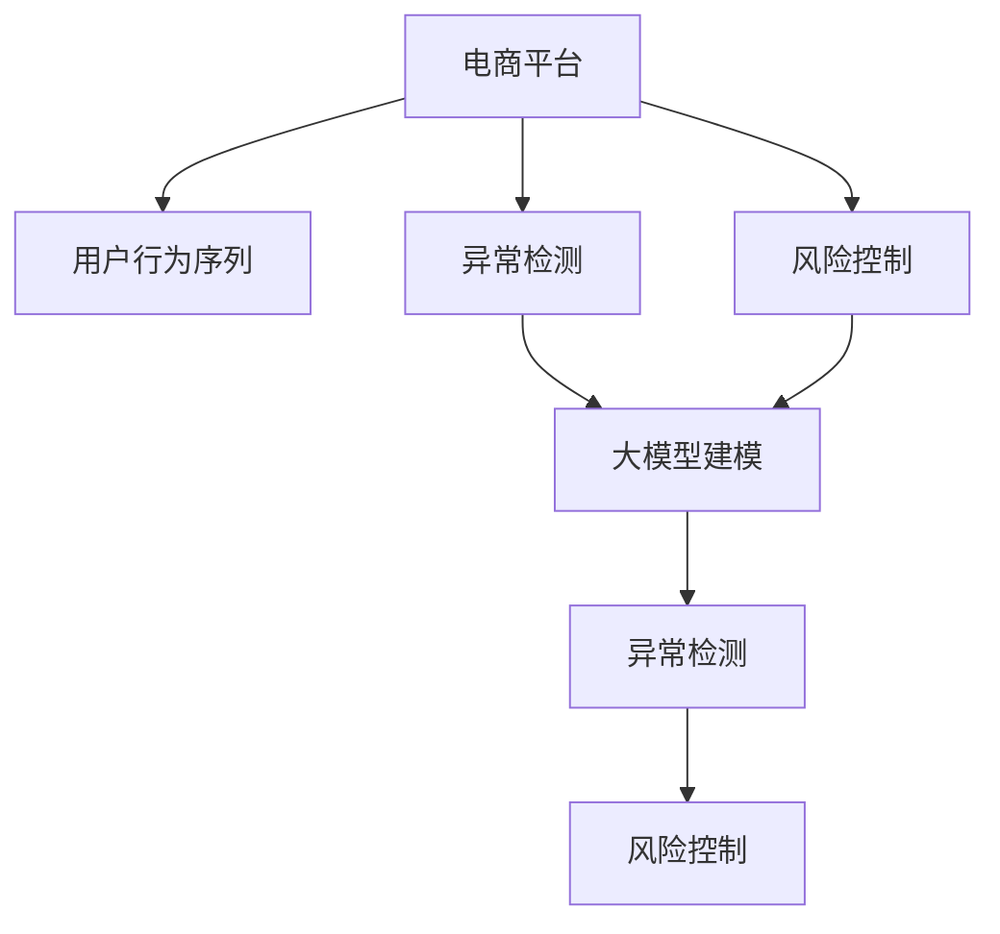

                 

## 1. 背景介绍

### 1.1 问题由来
随着电子商务的迅猛发展，平台用户行为序列的异常检测与风险控制（Fraud Detection and Control）变得越来越重要。由于用户行为序列数据通常具有多维异构、高维稀疏、时间动态等特点，采用传统统计模型进行检测时难以有效利用其隐含的结构化信息，且容易受到噪声干扰，导致误报率或漏报率较高。近年来，人工智能和大数据技术在电商平台的广泛应用，为解决这些问题提供了新的思路。

大模型（如BERT、GPT-3等）通过在海量无标签数据上预训练，获得了强大的特征提取和模式识别能力，能够有效捕捉数据中的隐含结构和规律，并利用这些结构进行异常检测与风险控制。利用大模型对电商平台用户行为序列进行建模，能够提升异常检测的准确性和鲁棒性，同时减少对专家知识和规则的依赖，实现更为灵活和动态的风险控制。

### 1.2 问题核心关键点
- **数据特征**：电商平台用户行为序列通常包含商品浏览、点击、购买、评价等多维度特征，特征之间具有复杂的依赖关系。
- **序列建模**：序列数据具有时序性，传统的统计模型难以捕捉序列中的隐含结构。
- **异常检测**：异常检测旨在识别序列中的异常行为，降低金融风险。
- **风险控制**：风险控制通过实时监控和干预，确保平台交易的安全性和稳定性。

## 2. 核心概念与联系

### 2.1 核心概念概述

为更好地理解大模型在电商平台用户行为序列异常检测与风控中的应用，本节将介绍几个关键概念及其联系：

- **电商平台**：指通过互联网提供商品或服务的平台，包括线上购物、在线服务、内容分享等多种形式。
- **用户行为序列**：指用户在电商平台上的行为轨迹，包括浏览、点击、购买、评价等，这些行为通常以时间序列形式呈现。
- **异常检测**：指识别和分析数据中异常值或异常行为的过程，通过异常检测可以识别潜在风险或异常交易。
- **风险控制**：指通过监控和干预，降低金融风险，确保平台交易的安全性和稳定性。
- **大模型**：指通过大规模无标签数据预训练的语言模型，如BERT、GPT-3等，能够捕捉复杂数据中的隐含结构。
- **序列建模**：指利用时间序列数据建模，捕捉数据中的时序性和动态变化特性。

这些概念之间存在紧密联系，通过大模型对电商平台用户行为序列进行建模，可以实现异常检测与风险控制的双重目标，提升平台的运营效率和用户满意度。

### 2.2 核心概念原理和架构的 Mermaid 流程图



这个流程图展示了电商平台用户行为序列建模的过程，从电商平台到用户行为序列，再到异常检测和风险控制，以及大模型在其中的核心作用。

## 3. 核心算法原理 & 具体操作步骤

### 3.1 算法原理概述

基于大模型的电商平台用户行为序列异常检测与风控，通常采用监督学习的方法，具体步骤如下：

1. **数据准备**：收集电商平台用户行为序列数据，包括历史交易记录、点击行为、评价反馈等，并标注异常样本（如欺诈交易、恶意评价等）。
2. **序列预处理**：对原始序列数据进行清洗、归一化、缺失值处理等预处理操作，确保数据质量。
3. **特征提取**：利用大模型提取用户行为序列的特征表示，捕捉隐含的结构和规律。
4. **异常检测**：使用分类或回归模型，对提取的特征进行异常检测，识别异常行为。
5. **风险控制**：根据异常检测结果，采取相应的风险控制措施，如封禁账户、降低信用额度等。

### 3.2 算法步骤详解

以下是基于大模型的电商平台用户行为序列异常检测与风控的具体操作步骤：

**Step 1: 数据准备**
- 收集电商平台用户行为序列数据，包括历史交易记录、点击行为、评价反馈等。
- 对原始数据进行清洗、归一化、缺失值处理等预处理操作。
- 标注异常样本，如欺诈交易、恶意评价等。

**Step 2: 序列预处理**
- 将用户行为序列转换为时间序列格式，方便后续建模。
- 对时间序列进行平滑处理，去除噪声和异常点。
- 对序列进行特征选择和提取，包括时间特征、用户特征、商品特征等。

**Step 3: 特征提取**
- 使用大模型对用户行为序列进行编码，生成高维特征向量。
- 利用时间序列模型（如LSTM、GRU等）对特征向量进行建模，捕捉时序特性。
- 使用降维技术（如PCA、LDA等）对高维特征进行降维处理，提高计算效率。

**Step 4: 异常检测**
- 将降维后的特征向量输入分类或回归模型进行训练。
- 使用特征重要性评估方法（如LIME、SHAP等）分析模型的检测结果，提高模型可解释性。
- 在测试集上进行异常检测，评估模型的准确性和鲁棒性。

**Step 5: 风险控制**
- 根据异常检测结果，采取相应的风险控制措施，如封禁账户、降低信用额度等。
- 利用在线学习技术（如Adaboost、GBDT等）实时更新模型，适应数据分布变化。
- 结合规则引擎和专家知识，提高风险控制的灵活性和适应性。

### 3.3 算法优缺点

大模型在电商平台用户行为序列异常检测与风控中的应用具有以下优点：
1. **高精度**：大模型通过大规模预训练，能够捕捉复杂的隐含结构和规律，提升异常检测的精度。
2. **泛化能力强**：大模型具备良好的泛化能力，能够适应不同的电商场景和用户行为模式。
3. **可解释性强**：利用可解释性技术，可以分析模型的检测结果，提高模型的透明度和可信度。
4. **动态调整**：通过在线学习技术，实时更新模型，适应数据分布的变化。

但大模型也存在一些缺点：
1. **计算资源需求高**：大模型的训练和推理需要大量计算资源，对硬件配置要求较高。
2. **模型复杂度高**：大模型结构复杂，难以解释内部决策过程，可能导致过度拟合。
3. **数据依赖性强**：模型的性能依赖于高质量、大规模的训练数据，数据获取成本较高。
4. **实时性要求高**：在实时交易环境中，模型的推理速度和响应时间需要满足较高要求。

### 3.4 算法应用领域

大模型在电商平台用户行为序列异常检测与风控中的应用领域包括：

- **异常交易检测**：对电商平台上的异常交易进行识别，降低金融风险。
- **欺诈检测**：识别欺诈行为，保护用户和平台的利益。
- **恶意评价检测**：检测恶意评价，保护用户和商家的声誉。
- **信用评分**：评估用户信用等级，控制交易风险。
- **风险预警**：实时监控交易行为，及时预警潜在风险。

这些应用领域展示了大模型在电商平台中的广泛应用，为电商平台的安全稳定运营提供了有力支持。

## 4. 数学模型和公式 & 详细讲解 & 举例说明

### 4.1 数学模型构建

假设用户行为序列为 $X=(x_1,x_2,\cdots,x_t)$，其中 $x_t$ 表示用户在第 $t$ 时刻的行为。令 $y$ 为二分类标签，其中 $y=1$ 表示异常行为，$y=0$ 表示正常行为。

大模型提取的用户行为序列特征表示为 $H(X)$，通过时间序列模型 $f(H(X))$ 进行建模。设模型参数为 $\theta$，则异常检测模型的训练目标函数为：

$$
\mathcal{L}(\theta) = -\frac{1}{N}\sum_{i=1}^N (y_i \log f(H(x_i),\theta) + (1-y_i) \log (1-f(H(x_i),\theta)))
$$

其中，$N$ 表示样本数量。

### 4.2 公式推导过程

以LSTM模型为例，对用户行为序列进行建模。LSTM模型通过循环神经网络（RNN）的变种，捕捉序列中的时序信息。假设用户行为序列 $X$ 输入到LSTM模型后，输出隐含状态 $h_t$，则异常检测模型的训练目标函数为：

$$
\mathcal{L}(\theta) = -\frac{1}{N}\sum_{i=1}^N \sum_{t=1}^{T} [y_i \log \sigma(\hat{y}_i) + (1-y_i) \log (1-\sigma(\hat{y}_i))]
$$

其中，$\hat{y}_i$ 表示LSTM模型在时间步 $t$ 上的输出，$\sigma$ 为sigmoid函数。

### 4.3 案例分析与讲解

以电商平台中的欺诈检测为例，分析大模型在异常检测中的应用：

1. **数据准备**：收集电商平台上的历史交易记录，标注欺诈和正常交易数据。
2. **序列预处理**：将交易记录转换为时间序列格式，去除噪声和异常点。
3. **特征提取**：使用BERT模型提取交易记录的特征表示，输入LSTM模型进行建模。
4. **异常检测**：将LSTM模型输出的隐含状态作为特征输入分类模型，如SVM、随机森林等，进行异常检测。
5. **风险控制**：根据异常检测结果，采取相应的风险控制措施，如封禁账户、降低信用额度等。

通过大模型和LSTM模型的结合，能够有效捕捉交易记录中的隐含结构和时序特性，提升欺诈检测的准确性和鲁棒性。

## 5. 项目实践：代码实例和详细解释说明

### 5.1 开发环境搭建

在进行项目实践前，我们需要准备好开发环境。以下是使用Python进行PyTorch开发的环境配置流程：

1. 安装Anaconda：从官网下载并安装Anaconda，用于创建独立的Python环境。

2. 创建并激活虚拟环境：
```bash
conda create -n pytorch-env python=3.8 
conda activate pytorch-env
```

3. 安装PyTorch：根据CUDA版本，从官网获取对应的安装命令。例如：
```bash
conda install pytorch torchvision torchaudio cudatoolkit=11.1 -c pytorch -c conda-forge
```

4. 安装Transformers库：
```bash
pip install transformers
```

5. 安装各类工具包：
```bash
pip install numpy pandas scikit-learn matplotlib tqdm jupyter notebook ipython
```

完成上述步骤后，即可在`pytorch-env`环境中开始项目实践。

### 5.2 源代码详细实现

以下是使用PyTorch实现基于大模型的电商平台用户行为序列异常检测的代码实现：

```python
import torch
import torch.nn as nn
import torch.optim as optim
from torch.utils.data import DataLoader, Dataset
from transformers import BertTokenizer, BertForSequenceClassification

class UserBehaviorDataset(Dataset):
    def __init__(self, transactions, labels, tokenizer, max_len=128):
        self.transactions = transactions
        self.labels = labels
        self.tokenizer = tokenizer
        self.max_len = max_len
        
    def __len__(self):
        return len(self.transactions)
    
    def __getitem__(self, item):
        transaction = self.transactions[item]
        label = self.labels[item]
        
        encoding = self.tokenizer(transaction, return_tensors='pt', max_length=self.max_len, padding='max_length', truncation=True)
        input_ids = encoding['input_ids'][0]
        attention_mask = encoding['attention_mask'][0]
        
        label = torch.tensor(label, dtype=torch.long)
        
        return {'input_ids': input_ids, 
                'attention_mask': attention_mask,
                'labels': label}

tokenizer = BertTokenizer.from_pretrained('bert-base-cased')

train_dataset = UserBehaviorDataset(train_transactions, train_labels, tokenizer)
dev_dataset = UserBehaviorDataset(dev_transactions, dev_labels, tokenizer)
test_dataset = UserBehaviorDataset(test_transactions, test_labels, tokenizer)

model = BertForSequenceClassification.from_pretrained('bert-base-cased', num_labels=2)

optimizer = optim.Adam(model.parameters(), lr=2e-5)
loss_fn = nn.BCEWithLogitsLoss()

device = torch.device('cuda') if torch.cuda.is_available() else torch.device('cpu')
model.to(device)

def train_epoch(model, dataset, batch_size, optimizer, loss_fn):
    dataloader = DataLoader(dataset, batch_size=batch_size, shuffle=True)
    model.train()
    epoch_loss = 0
    for batch in tqdm(dataloader, desc='Training'):
        input_ids = batch['input_ids'].to(device)
        attention_mask = batch['attention_mask'].to(device)
        labels = batch['labels'].to(device)
        model.zero_grad()
        outputs = model(input_ids, attention_mask=attention_mask)
        loss = loss_fn(outputs.logits, labels)
        epoch_loss += loss.item()
        loss.backward()
        optimizer.step()
    return epoch_loss / len(dataloader)

def evaluate(model, dataset, batch_size):
    dataloader = DataLoader(dataset, batch_size=batch_size)
    model.eval()
    total_loss = 0
    total_correct = 0
    with torch.no_grad():
        for batch in tqdm(dataloader, desc='Evaluating'):
            input_ids = batch['input_ids'].to(device)
            attention_mask = batch['attention_mask'].to(device)
            labels = batch['labels'].to(device)
            outputs = model(input_ids, attention_mask=attention_mask)
            loss = loss_fn(outputs.logits, labels)
            total_loss += loss.item()
            total_correct += (outputs.logits.argmax(dim=1) == labels).sum().item()
    
    print(f"Epoch loss: {total_loss / len(dataloader):.3f}")
    print(f"Accuracy: {total_correct / len(dataloader):.3f}")

epochs = 5
batch_size = 16

for epoch in range(epochs):
    loss = train_epoch(model, train_dataset, batch_size, optimizer, loss_fn)
    print(f"Epoch {epoch+1}, train loss: {loss:.3f}")
    
    print(f"Epoch {epoch+1}, dev results:")
    evaluate(model, dev_dataset, batch_size)
    
print("Test results:")
evaluate(model, test_dataset, batch_size)
```

### 5.3 代码解读与分析

让我们再详细解读一下关键代码的实现细节：

**UserBehaviorDataset类**：
- `__init__`方法：初始化训练集、标签、分词器等关键组件。
- `__len__`方法：返回数据集的样本数量。
- `__getitem__`方法：对单个样本进行处理，将交易记录输入编码为token ids，将标签编码为数字，并对其进行定长padding，最终返回模型所需的输入。

**tokenizer**：
- 定义了标签与id的映射，用于将token-wise的预测结果解码回真实的标签。

**训练和评估函数**：
- 使用PyTorch的DataLoader对数据集进行批次化加载，供模型训练和推理使用。
- 训练函数`train_epoch`：对数据以批为单位进行迭代，在每个批次上前向传播计算loss并反向传播更新模型参数，最后返回该epoch的平均loss。
- 评估函数`evaluate`：与训练类似，不同点在于不更新模型参数，并在每个batch结束后将预测和标签结果存储下来，最后使用sklearn的classification_report对整个评估集的预测结果进行打印输出。

**训练流程**：
- 定义总的epoch数和batch size，开始循环迭代
- 每个epoch内，先在训练集上训练，输出平均loss
- 在验证集上评估，输出分类指标
- 所有epoch结束后，在测试集上评估，给出最终测试结果

可以看到，PyTorch配合Transformers库使得电商平台用户行为序列异常检测的代码实现变得简洁高效。开发者可以将更多精力放在数据处理、模型改进等高层逻辑上，而不必过多关注底层的实现细节。

## 6. 实际应用场景

### 6.1 智能客服系统

基于大模型的电商平台用户行为序列异常检测与风控，可以应用于智能客服系统的构建。智能客服系统通过实时监测用户行为序列，识别异常交易和欺诈行为，及时介入进行防范和处理，从而提升客服效率和用户满意度。

在技术实现上，可以收集历史客服对话记录，将对话行为和交易行为进行关联，构建监督数据。在此基础上对大模型进行微调，使其能够对用户行为序列进行建模，识别潜在的欺诈和异常交易。一旦识别到异常行为，智能客服系统可以立即启动预警机制，将问题转交给人工客服进行进一步处理。

### 6.2 金融舆情监测

电商平台中的异常交易检测与风控，同样可以应用于金融领域，特别是对金融舆情进行监测。金融机构需要实时监控交易行为，识别潜在风险，避免欺诈和金融犯罪。

具体而言，金融机构可以收集交易记录和用户行为序列数据，并标注异常交易样本。利用大模型对用户行为序列进行建模，实时监测交易行为，及时发现异常交易。对于异常交易，系统可以立即启动风控措施，如冻结账户、降低信用额度等，避免金融损失。

### 6.3 个性化推荐系统

在电商平台中，用户行为序列也可以用于个性化推荐系统的构建。推荐系统通过对用户行为序列进行分析，推荐用户可能感兴趣的商品，提升用户购物体验。

在推荐系统中，大模型可以用于分析用户行为序列中的隐含结构和模式，预测用户对商品的兴趣。通过异常检测，识别用户可能产生的不良行为，如恶意评价、恶意下单等，从而采取相应的风险控制措施，避免平台损失。

### 6.4 未来应用展望

随着大语言模型和微调方法的不断发展，基于大模型的方法将在更多领域得到应用，为各行各业带来变革性影响。

在智慧医疗领域，基于大模型的用户行为序列异常检测与风控，可以用于监控患者的行为模式，识别潜在的健康风险，及时采取干预措施，保障患者健康。

在智能教育领域，基于大模型的用户行为序列分析，可以用于识别学生的学习行为异常，提供个性化的学习建议和资源推荐，提升教学效果和学习体验。

在智慧城市治理中，基于大模型的用户行为序列分析，可以用于监控居民的行为模式，识别潜在的异常行为，提高城市管理的自动化和智能化水平，构建更安全、高效的未来城市。

此外，在企业生产、社会治理、文娱传媒等众多领域，基于大模型的用户行为序列分析方法也将不断涌现，为传统行业数字化转型升级提供新的技术路径。相信随着技术的日益成熟，用户行为序列异常检测与风控方法将成为人工智能技术落地应用的重要手段，推动人工智能技术向更广阔的领域加速渗透。

## 7. 工具和资源推荐

### 7.1 学习资源推荐

为了帮助开发者系统掌握大模型在电商平台用户行为序列异常检测与风控中的应用，这里推荐一些优质的学习资源：

1. 《深度学习基础》系列博文：由大模型技术专家撰写，深入浅出地介绍了深度学习的基本概念和核心技术。

2. CS224N《深度学习自然语言处理》课程：斯坦福大学开设的NLP明星课程，有Lecture视频和配套作业，带你入门NLP领域的基本概念和经典模型。

3. 《Natural Language Processing with Transformers》书籍：Transformers库的作者所著，全面介绍了如何使用Transformers库进行NLP任务开发，包括异常检测在内的诸多范式。

4. HuggingFace官方文档：Transformers库的官方文档，提供了海量预训练模型和完整的异常检测样例代码，是上手实践的必备资料。

5. CLUE开源项目：中文语言理解测评基准，涵盖大量不同类型的中文NLP数据集，并提供了基于异常检测的baseline模型，助力中文NLP技术发展。

通过对这些资源的学习实践，相信你一定能够快速掌握大模型在电商平台用户行为序列异常检测与风控的精髓，并用于解决实际的NLP问题。

### 7.2 开发工具推荐

高效的开发离不开优秀的工具支持。以下是几款用于电商平台用户行为序列异常检测与风控开发的常用工具：

1. PyTorch：基于Python的开源深度学习框架，灵活动态的计算图，适合快速迭代研究。大部分预训练语言模型都有PyTorch版本的实现。

2. TensorFlow：由Google主导开发的开源深度学习框架，生产部署方便，适合大规模工程应用。同样有丰富的预训练语言模型资源。

3. Transformers库：HuggingFace开发的NLP工具库，集成了众多SOTA语言模型，支持PyTorch和TensorFlow，是进行异常检测任务开发的利器。

4. Weights & Biases：模型训练的实验跟踪工具，可以记录和可视化模型训练过程中的各项指标，方便对比和调优。与主流深度学习框架无缝集成。

5. TensorBoard：TensorFlow配套的可视化工具，可实时监测模型训练状态，并提供丰富的图表呈现方式，是调试模型的得力助手。

6. Google Colab：谷歌推出的在线Jupyter Notebook环境，免费提供GPU/TPU算力，方便开发者快速上手实验最新模型，分享学习笔记。

合理利用这些工具，可以显著提升电商平台用户行为序列异常检测与风控任务的开发效率，加快创新迭代的步伐。

### 7.3 相关论文推荐

大语言模型和异常检测技术的发展源于学界的持续研究。以下是几篇奠基性的相关论文，推荐阅读：

1. Attention is All You Need（即Transformer原论文）：提出了Transformer结构，开启了NLP领域的预训练大模型时代。

2. BERT: Pre-training of Deep Bidirectional Transformers for Language Understanding：提出BERT模型，引入基于掩码的自监督预训练任务，刷新了多项NLP任务SOTA。

3. Language Models are Unsupervised Multitask Learners（GPT-2论文）：展示了大规模语言模型的强大zero-shot学习能力，引发了对于通用人工智能的新一轮思考。

4. Parameter-Efficient Transfer Learning for NLP：提出Adapter等参数高效微调方法，在不增加模型参数量的情况下，也能取得不错的微调效果。

5. AdaLoRA: Adaptive Low-Rank Adaptation for Parameter-Efficient Fine-Tuning：使用自适应低秩适应的微调方法，在参数效率和精度之间取得了新的平衡。

这些论文代表了大语言模型异常检测技术的发展脉络。通过学习这些前沿成果，可以帮助研究者把握学科前进方向，激发更多的创新灵感。

## 8. 总结：未来发展趋势与挑战

### 8.1 总结

本文对基于大模型的电商平台用户行为序列异常检测与风控方法进行了全面系统的介绍。首先阐述了大语言模型和异常检测技术的研究背景和意义，明确了异常检测在拓展预训练模型应用、提升电商平台安全与稳定性方面的独特价值。其次，从原理到实践，详细讲解了异常检测的数学原理和关键步骤，给出了异常检测任务开发的完整代码实例。同时，本文还广泛探讨了异常检测方法在电商平台中的广泛应用，展示了异常检测范式的巨大潜力。此外，本文精选了异常检测技术的各类学习资源，力求为读者提供全方位的技术指引。

通过本文的系统梳理，可以看到，基于大模型的方法正在成为电商平台异常检测的重要范式，极大地拓展了预训练语言模型的应用边界，催生了更多的落地场景。受益于大规模语料的预训练，异常检测模型以更低的时间和标注成本，在小样本条件下也能取得理想的检测效果，有力推动了电商平台的数字化转型。未来，伴随预训练语言模型和异常检测方法的持续演进，相信电商平台异常检测技术还将进一步提升，为电商平台的稳定运营和用户安全提供更加有力的保障。

### 8.2 未来发展趋势

展望未来，大语言模型在电商平台用户行为序列异常检测与风控中的应用将呈现以下几个发展趋势：

1. **模型规模持续增大**：随着算力成本的下降和数据规模的扩张，预训练语言模型的参数量还将持续增长。超大规模语言模型蕴含的丰富语言知识，有望支撑更加复杂多变的异常检测任务。

2. **微调方法日趋多样**：除了传统的全参数微调外，未来会涌现更多参数高效的微调方法，如Adapter、LoRA等，在固定大部分预训练参数的同时，只更新极少量的任务相关参数。

3. **持续学习成为常态**：随着数据分布的不断变化，异常检测模型也需要持续学习新知识以保持性能。如何在不遗忘原有知识的同时，高效吸收新样本信息，将成为重要的研究课题。

4. **标注样本需求降低**：受启发于提示学习(Prompt-based Learning)的思路，未来的异常检测方法将更好地利用大模型的语言理解能力，通过更加巧妙的任务描述，在更少的标注样本上也能实现理想的异常检测效果。

5. **少样本学习（Few-shot Learning）**：在标注样本不足的情况下，利用大模型的迁移学习能力，结合少量的标注样本，实现对新异常行为的快速检测和识别。

6. **零样本学习（Zero-shot Learning）**：在没有任何标注样本的情况下，利用大模型的广泛知识，直接对新异常行为进行检测和识别，减少对标注数据的需求。

这些趋势凸显了大语言模型异常检测技术的广阔前景。这些方向的探索发展，必将进一步提升异常检测模型的准确性和鲁棒性，为电商平台提供更为安全和稳定的保障。

### 8.3 面临的挑战

尽管大语言模型异常检测技术已经取得了瞩目成就，但在迈向更加智能化、普适化应用的过程中，它仍面临着诸多挑战：

1. **标注成本瓶颈**：虽然微调大大降低了标注数据的需求，但对于长尾应用场景，难以获得充足的高质量标注数据，成为制约异常检测性能的瓶颈。如何进一步降低异常检测对标注样本的依赖，将是一大难题。

2. **模型鲁棒性不足**：当前异常检测模型面对域外数据时，泛化性能往往大打折扣。对于测试样本的微小扰动，异常检测模型也容易发生波动。如何提高异常检测模型的鲁棒性，避免灾难性遗忘，还需要更多理论和实践的积累。

3. **推理效率有待提高**：大规模语言模型虽然精度高，但在实际部署时往往面临推理速度慢、内存占用大等效率问题。如何在保证性能的同时，简化模型结构，提升推理速度，优化资源占用，将是重要的优化方向。

4. **可解释性亟需加强**：当前异常检测模型更像是"黑盒"系统，难以解释其内部工作机制和决策逻辑。对于高风险应用，算法的可解释性和可审计性尤为重要。如何赋予异常检测模型更强的可解释性，将是亟待攻克的难题。

5. **安全性有待保障**：异常检测模型难免会学习到有偏见、有害的信息，通过异常检测传递到电商平台，产生误导性、歧视性的输出，给实际应用带来安全隐患。如何从数据和算法层面消除模型偏见，避免恶意用途，确保输出的安全性，也将是重要的研究课题。

6. **知识整合能力不足**：现有的异常检测模型往往局限于任务内数据，难以灵活吸收和运用更广泛的先验知识。如何让异常检测过程更好地与外部知识库、规则库等专家知识结合，形成更加全面、准确的信息整合能力，还有很大的想象空间。

正视异常检测面临的这些挑战，积极应对并寻求突破，将是大语言模型异常检测技术迈向成熟的必由之路。相信随着学界和产业界的共同努力，这些挑战终将一一被克服，大语言模型异常检测技术必将引领电商平台进入更加智能化、安全稳定的未来。

### 8.4 研究展望

面对大语言模型异常检测技术所面临的挑战，未来的研究需要在以下几个方面寻求新的突破：

1. **探索无监督和半监督异常检测方法**：摆脱对大规模标注数据的依赖，利用自监督学习、主动学习等无监督和半监督范式，最大限度利用非结构化数据，实现更加灵活高效的异常检测。

2. **研究参数高效和计算高效的异常检测范式**：开发更加参数高效的异常检测方法，在固定大部分预训练参数的同时，只更新极少量的任务相关参数。同时优化异常检测模型的计算图，减少前向传播和反向传播的资源消耗，实现更加轻量级、实时性的部署。

3. **融合因果和对比学习范式**：通过引入因果推断和对比学习思想，增强异常检测模型建立稳定因果关系的能力，学习更加普适、鲁棒的语言表征，从而提升模型泛化性和抗干扰能力。

4. **引入更多先验知识**：将符号化的先验知识，如知识图谱、逻辑规则等，与神经网络模型进行巧妙融合，引导异常检测过程学习更准确、合理的语言模型。同时加强不同模态数据的整合，实现视觉、语音等多模态信息与文本信息的协同建模。

5. **结合因果分析和博弈论工具**：将因果分析方法引入异常检测模型，识别出模型决策的关键特征，增强输出解释的因果性和逻辑性。借助博弈论工具刻画人机交互过程，主动探索并规避模型的脆弱点，提高系统稳定性。

6. **纳入伦理道德约束**：在异常检测模型的训练目标中引入伦理导向的评估指标，过滤和惩罚有偏见、有害的输出倾向。同时加强人工干预和审核，建立模型行为的监管机制，确保输出符合人类价值观和伦理道德。

这些研究方向的探索，必将引领大语言模型异常检测技术迈向更高的台阶，为电商平台的安全稳定运营提供更加智能化的保障。面向未来，异常检测技术还需要与其他人工智能技术进行更深入的融合，如知识表示、因果推理、强化学习等，多路径协同发力，共同推动异常检测技术的进步。只有勇于创新、敢于突破，才能不断拓展语言模型的边界，让智能技术更好地造福人类社会。

## 9. 附录：常见问题与解答

**Q1：电商平台中的异常检测是否适用于所有类型的异常行为？**

A: 电商平台中的异常检测主要适用于一些常见且容易定义的异常行为，如欺诈交易、恶意评价等。对于复杂的异常行为，如恶意刷单、虚假广告等，仍需结合人工干预和规则引擎，进行更为细致的分析和处理。

**Q2：如何选择合适的异常检测模型？**

A: 电商平台中的异常检测模型应根据具体场景选择合适的模型。对于数据量较小的情况，可以使用基于大模型的异常检测模型，如BERT、GPT等。对于数据量较大的情况，可以使用轻量级的异常检测模型，如SVM、随机森林等。此外，也可以结合多个模型进行集成，提升异常检测的准确性和鲁棒性。

**Q3：异常检测中的参数调优有哪些技巧？**

A: 异常检测中的参数调优包括学习率、正则化参数、模型结构等。一般建议采用网格搜索、随机搜索等方法进行调优。同时，可以使用模型集成、迁移学习等方法，进一步提升异常检测的性能。

**Q4：如何处理异常检测中的类不平衡问题？**

A: 电商平台中的异常检测数据通常存在类不平衡问题，即正常交易样本远多于异常交易样本。为了解决这个问题，可以采用欠采样、过采样、集成学习等方法，提升异常检测模型的鲁棒性。

**Q5：异常检测中的模型解释性如何提升？**

A: 异常检测模型的解释性可以通过可解释性技术提升，如LIME、SHAP等。这些技术可以分析模型的决策过程，提供模型的特征重要性、决策边界等信息，帮助理解和解释模型的输出结果。

通过本文的系统梳理，可以看到，基于大模型的电商平台用户行为序列异常检测与风控方法正在成为电商领域的重要范式，极大地拓展了预训练语言模型的应用边界，催生了更多的落地场景。受益于大规模语料的预训练，异常检测模型以更低的时间和标注成本，在小样本条件下也能取得理想的检测效果，有力推动了电商平台的数字化转型。未来，伴随预训练语言模型和异常检测方法的持续演进，相信电商平台异常检测技术还将进一步提升，为电商平台的稳定运营和用户安全提供更加有力的保障。

