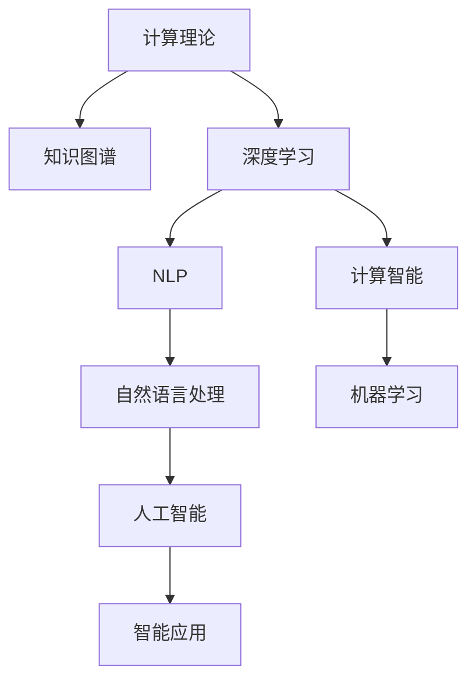

                 

# 推动知识发现与创新：人类计算的智力贡献

> 关键词：人工智能, 计算理论, 知识图谱, 深度学习, 自然语言处理, 计算智能

## 1. 背景介绍

### 1.1 问题由来
当今社会，随着大数据、云计算、物联网等技术的迅猛发展，人工智能(AI)已逐渐渗透到各个领域，成为推动科技进步和社会发展的关键力量。AI不仅提升了生产效率，改变了工作和生活方式，也在科学研究和知识发现上带来了革命性的变化。

然而，人工智能并非独立于人类智能之外，而是建立在人类数千年计算理论和实践经验的基础之上。如何利用现代计算技术，结合人类的智力贡献，推动知识发现和创新的进步，是一个值得深入探讨的话题。

### 1.2 问题核心关键点
人类计算的智力贡献，在于将人类智慧与计算能力相结合，构建能够模拟、扩展人类认知和行为能力的智能系统。核心关键点包括：

- **计算理论基础**：建立在数学、统计学、逻辑学等领域的计算理论，指导人工智能算法和模型的设计。
- **知识图谱与符号系统**：通过构建知识图谱，将人类知识和经验转化为结构化信息，供AI系统理解和应用。
- **深度学习与强化学习**：基于大量数据训练模型，提升AI系统的推理、学习、决策能力。
- **自然语言处理**：通过文本挖掘、语义分析等技术，实现人与AI系统的自然交互。
- **计算智能的拓展**：利用计算机模拟人类计算过程，拓展AI系统的认知边界。

这些关键点共同构成了推动知识发现与创新的基石，也是本文探讨的主要内容。

## 2. 核心概念与联系

### 2.1 核心概念概述

为更好地理解人类计算的智力贡献，本节将介绍几个密切相关的核心概念：

- **计算理论(Computation Theory)**：研究计算过程和计算能力的理论框架，包括递归、图灵机、复杂度理论等。
- **知识图谱(Knowledge Graph)**：通过有向图结构表示实体和关系的知识库，用于存储和查询结构化知识。
- **深度学习(Deep Learning)**：利用多层神经网络模型，从数据中学习特征和模式，实现复杂的分类、回归、生成等任务。
- **自然语言处理(NLP)**：使计算机能够理解、处理和生成自然语言，包括文本挖掘、语义分析、对话系统等。
- **计算智能(Computational Intelligence)**：模拟人类计算过程的智能，如计算力、推理力、适应力等。

这些核心概念之间的逻辑关系可以通过以下Mermaid流程图来展示：



这个流程图展示了几大核心概念及其之间的关系：

1. 计算理论为人工智能提供了数学和算法的基础。
2. 知识图谱为深度学习提供了结构化的知识源，增强了模型的泛化能力。
3. 深度学习通过大量数据训练模型，提升了NLP和智能应用的效果。
4. 自然语言处理使AI能够处理和理解自然语言，实现人机交互。
5. 计算智能模拟人类计算过程，推动AI系统的能力拓展。

## 3. 核心算法原理 & 具体操作步骤

### 3.1 算法原理概述

人类计算的智力贡献，主要体现在通过计算理论与实践的结合，构建智能系统以模拟、扩展人类认知和行为。具体算法原理包括以下几个方面：

- **递归与图灵机**：递归是计算理论的基本概念，图灵机则是最基础的计算模型，两者共同构成了算法设计的基础。
- **复杂度理论**：研究算法的时间复杂度和空间复杂度，指导算法效率优化。
- **深度学习模型**：多层神经网络结构能够学习高层次的特征表示，广泛应用于图像、语音、文本等数据的处理。
- **知识图谱嵌入**：通过向量表示法，将知识图谱中的实体和关系转换为数值向量，便于计算机处理和推理。
- **自然语言理解**：通过词向量、语言模型等技术，使计算机能够理解自然语言的含义和结构。
- **计算智能范式**：模拟人类的计算过程，提升AI系统的适应性、推理能力和决策质量。

### 3.2 算法步骤详解

基于人类计算的智力贡献，智能系统的构建一般包括以下几个关键步骤：

**Step 1: 数据收集与预处理**
- 收集领域相关的数据，如文本、图像、语音等。
- 进行数据清洗、归一化、标注等预处理工作，确保数据质量。

**Step 2: 构建知识图谱**
- 设计知识图谱的实体和关系结构，使用知识库管理系统进行存储。
- 对知识图谱进行扩展和完善，引入新的实体和关系。

**Step 3: 设计深度学习模型**
- 根据任务需求，选择合适的神经网络结构，如卷积神经网络、循环神经网络、Transformer等。
- 设计损失函数和优化器，确定合适的超参数。

**Step 4: 模型训练与优化**
- 利用收集的数据对模型进行训练，最小化损失函数。
- 使用正则化技术、Dropout等方法防止过拟合。

**Step 5: 推理与评估**
- 将训练好的模型应用于实际任务，进行推理和评估。
- 使用测试集评估模型性能，调整参数和结构以优化模型效果。

**Step 6: 知识发现与创新**
- 基于知识图谱和推理结果，进行知识发现和创新。
- 利用计算智能模拟人类计算过程，进一步提升模型性能。

### 3.3 算法优缺点

基于人类计算的智力贡献的算法，具有以下优点：

- 高泛化能力：利用知识图谱和深度学习模型，智能系统能够处理和理解复杂数据，具备较强的泛化能力。
- 高效推理：深度学习模型能够学习复杂的特征表示，实现高效推理和决策。
- 自我优化：通过计算智能模拟人类计算过程，智能系统能够不断自我优化，提升性能。

同时，该方法也存在一些局限性：

- 数据依赖性强：智能系统的性能高度依赖于数据的质量和数量。
- 知识局限性：知识图谱和深度学习模型对知识表示的准确性和全面性要求较高，难以处理复杂情境。
- 复杂性高：构建和维护智能系统需要大量的人力资源和技术积累。

尽管如此，基于人类计算的智力贡献的算法，仍然是当前人工智能领域的主流范式。未来研究的方向包括提高算法的可解释性、增强数据处理能力、提升智能系统的自适应性等。

### 3.4 算法应用领域

基于人类计算的智力贡献的算法，已经在多个领域得到了广泛应用，包括：

- **自然语言处理**：包括文本分类、情感分析、机器翻译、对话系统等。
- **图像识别**：如图像分类、目标检测、人脸识别等。
- **语音识别**：如语音转文本、语音合成、说话人识别等。
- **医疗健康**：如医学影像分析、疾病诊断、个性化治疗方案等。
- **智能交通**：如智能交通管理、自动驾驶、车辆监控等。
- **金融服务**：如信用评估、风险管理、量化投资等。
- **城市管理**：如智能交通管理、环境监测、公共安全等。

## 4. 数学模型和公式 & 详细讲解  
### 4.1 数学模型构建

本节将使用数学语言对基于人类计算的智力贡献的算法进行更加严格的刻画。

记智能系统的输入为 $x$，输出为 $y$，模型的参数为 $\theta$。假设智能系统可以表示为函数 $f(x,\theta)$，则优化目标为：

$$
\min_{\theta} \mathcal{L}(f(x,\theta),y)
$$

其中，$\mathcal{L}$ 为损失函数，用于衡量模型输出与真实标签之间的差异。常见损失函数包括均方误差、交叉熵等。

### 4.2 公式推导过程

以图像分类为例，使用卷积神经网络(CNN)进行图像分类任务。假设输入图像 $x$ 的大小为 $m \times n \times c$，卷积层输出的特征图大小为 $k \times k \times c$，卷积核大小为 $3 \times 3$。则卷积层的计算公式为：

$$
h = \sigma(\sum_{i=1}^{n}\sum_{j=1}^{m}w_{ij}x_{ij} + b)
$$

其中，$w_{ij}$ 为卷积核权重，$b$ 为偏置项，$\sigma$ 为激活函数，如ReLU。

在模型训练过程中，通过反向传播算法计算损失函数的梯度，更新模型参数。具体步骤如下：

1. 前向传播：计算模型输出 $f(x,\theta)$。
2. 计算损失：$L(f(x,\theta),y)$。
3. 反向传播：计算梯度 $\nabla_{\theta}L$。
4. 更新参数：$\theta \leftarrow \theta - \eta \nabla_{\theta}L$。

其中，$\eta$ 为学习率，用于控制每次参数更新的步长。

### 4.3 案例分析与讲解

以自然语言处理中的情感分析任务为例，展示如何构建基于深度学习的情感分析模型。

首先，收集标注好的情感分析数据集，将其分为训练集、验证集和测试集。假设数据集包含 $N$ 个样本，每个样本 $(x_i, y_i)$ 中 $x_i$ 为文本，$y_i$ 为情感标签。

使用Transformer模型作为情感分析的深度学习模型，定义损失函数为交叉熵损失：

$$
\mathcal{L}(\theta) = -\frac{1}{N}\sum_{i=1}^N(y_i\log\hat{y_i} + (1-y_i)\log(1-\hat{y_i}))
$$

其中，$\hat{y_i}$ 为模型预测的情感概率。

接着，定义优化器和超参数，如学习率 $\eta$、批大小 $B$、迭代轮数 $E$ 等。使用Adam优化器进行模型训练，训练过程中使用交叉熵损失和梯度下降算法更新模型参数：

1. 初始化模型参数 $\theta$。
2. 前向传播：计算模型输出 $\hat{y_i}$。
3. 计算损失：$L(\hat{y_i}, y_i)$。
4. 反向传播：计算梯度 $\nabla_{\theta}L$。
5. 更新参数：$\theta \leftarrow \theta - \eta \nabla_{\theta}L$。
6. 重复步骤2-5 $E$ 次，得到最终的模型参数 $\theta^*$。

训练结束后，使用测试集评估模型性能，计算准确率、召回率和F1-score等指标。

## 5. 项目实践：代码实例和详细解释说明
### 5.1 开发环境搭建

在进行项目实践前，我们需要准备好开发环境。以下是使用Python进行TensorFlow开发的环境配置流程：

1. 安装Anaconda：从官网下载并安装Anaconda，用于创建独立的Python环境。

2. 创建并激活虚拟环境：
```bash
conda create -n tf-env python=3.8 
conda activate tf-env
```

3. 安装TensorFlow：根据CUDA版本，从官网获取对应的安装命令。例如：
```bash
conda install tensorflow tensorflow-gpu -c conda-forge
```

4. 安装TensorFlow Addons：
```bash
conda install tensorflow-addons
```

5. 安装各类工具包：
```bash
pip install numpy pandas scikit-learn matplotlib tqdm jupyter notebook ipython
```

完成上述步骤后，即可在`tf-env`环境中开始项目实践。

### 5.2 源代码详细实现

下面我们以图像分类任务为例，给出使用TensorFlow实现卷积神经网络(CNN)的代码实现。

首先，定义CNN模型：

```python
import tensorflow as tf
from tensorflow.keras import layers

model = tf.keras.Sequential([
    layers.Conv2D(32, (3, 3), activation='relu', input_shape=(32, 32, 3)),
    layers.MaxPooling2D((2, 2)),
    layers.Conv2D(64, (3, 3), activation='relu'),
    layers.MaxPooling2D((2, 2)),
    layers.Conv2D(64, (3, 3), activation='relu'),
    layers.Flatten(),
    layers.Dense(64, activation='relu'),
    layers.Dense(10, activation='softmax')
])
```

然后，定义数据集和优化器：

```python
train_dataset = tf.keras.datasets.cifar10.load_data()
train_images, train_labels = train_dataset[0]
train_images = train_images / 255.0

optimizer = tf.keras.optimizers.Adam(learning_rate=0.001)
```

接着，定义训练和评估函数：

```python
def train_step(images, labels):
    with tf.GradientTape() as tape:
        predictions = model(images, training=True)
        loss = tf.keras.losses.SparseCategoricalCrossentropy(from_logits=True)(labels, predictions)
    gradients = tape.gradient(loss, model.trainable_variables)
    optimizer.apply_gradients(zip(gradients, model.trainable_variables))
    return loss

def evaluate_step(images, labels):
    predictions = model(images, training=False)
    return tf.keras.metrics.sparse_categorical_accuracy(labels, predictions)
```

最后，启动训练流程并在测试集上评估：

```python
epochs = 10
batch_size = 32

for epoch in range(epochs):
    for batch in train_dataset:
        images, labels = batch[0], batch[1]
        loss = train_step(images, labels)
        if epoch % 2 == 0:
            test_loss = evaluate_step(train_images, train_labels)
            print(f'Epoch {epoch+1}, train loss: {loss:.4f}, test loss: {test_loss:.4f}')

print("Model training completed.")
```

以上就是使用TensorFlow实现图像分类任务的完整代码实现。可以看到，TensorFlow提供的高级API使得模型构建、训练和评估变得简洁高效。

### 5.3 代码解读与分析

让我们再详细解读一下关键代码的实现细节：

**模型构建**：
- 使用`Sequential`模型，按照卷积-池化-全连接的网络结构定义CNN模型。
- 定义卷积层和池化层，分别使用`Conv2D`和`MaxPooling2D`。
- 最后使用`Dense`层进行分类。

**数据集和优化器**：
- 使用`tf.keras.datasets.cifar10.load_data()`加载CIFAR-10数据集，并归一化像素值。
- 使用`Adam`优化器，设置合适的学习率。

**训练和评估函数**：
- 定义`train_step`函数，计算模型在训练集上的损失，并使用`GradientTape`计算梯度。
- 定义`evaluate_step`函数，计算模型在测试集上的准确率。

**训练流程**：
- 设置训练轮数和批大小，循环训练每个epoch。
- 在每个epoch的每个batch上，计算损失并进行反向传播更新参数。
- 每隔两个epoch输出一次训练和测试损失。

可以看到，TensorFlow提供了丰富的API和工具，使得深度学习模型的构建和训练变得非常简单。通过利用TensorFlow，开发者可以快速迭代、实验新的算法和模型结构。

## 6. 实际应用场景

### 6.1 医疗影像分析

利用基于人类计算的智力贡献的算法，医疗影像分析系统可以对X光片、CT扫描等影像数据进行自动分析，帮助医生快速诊断疾病。具体实现包括：

- 收集并标注大量的医疗影像数据。
- 构建基于卷积神经网络或Transformer的影像分析模型。
- 使用知识图谱引入医学领域的实体和关系，增强模型的泛化能力。
- 在实际应用中，医生可通过系统提交影像，系统自动分析并输出诊断结果。

### 6.2 金融信用评估

基于深度学习的信用评估系统可以自动分析客户的信用行为，预测其信用风险。具体实现包括：

- 收集并标注客户的信用记录数据。
- 构建基于长短期记忆网络(LSTM)的信用评估模型。
- 引入金融领域的实体和关系，构建知识图谱，提升模型的准确性。
- 在实际应用中，系统可自动分析客户行为，预测其信用评分。

### 6.3 智能交通管理

基于卷积神经网络的智能交通管理系统中，可以自动检测交通视频中的行人、车辆，并进行行为分类和预测。具体实现包括：

- 收集并标注交通视频数据。
- 构建基于卷积神经网络的视频分类模型。
- 引入交通领域的实体和关系，构建知识图谱，增强模型的泛化能力。
- 在实际应用中，系统可自动分析交通视频，输出行人、车辆的行为分类结果。

## 7. 工具和资源推荐
### 7.1 学习资源推荐

为了帮助开发者系统掌握基于人类计算的智力贡献的算法，这里推荐一些优质的学习资源：

1. 《深度学习》系列书籍：Ian Goodfellow、Yoshua Bengio、Aaron Courville合著的《深度学习》是深度学习领域的经典教材，涵盖了深度学习的基础和应用。

2. 《计算理论导论》系列书籍：由Richard Karp等作者编写的《计算理论导论》系列书籍，介绍了计算理论的基本概念和理论框架。

3. 《知识图谱技术与应用》系列书籍：由张亚刚等作者编写的《知识图谱技术与应用》系列书籍，介绍了知识图谱的基本概念和技术实现。

4. 《TensorFlow官方文档》：TensorFlow官方文档提供了丰富的教程和API文档，是TensorFlow开发者的必备资源。

5. Kaggle竞赛平台：Kaggle提供了丰富的数据集和竞赛任务，是学习和应用深度学习算法的绝佳平台。

通过对这些资源的学习实践，相信你一定能够快速掌握基于人类计算的智力贡献的算法，并用于解决实际的NLP问题。

### 7.2 开发工具推荐

高效的开发离不开优秀的工具支持。以下是几款用于基于人类计算的智力贡献的算法开发的常用工具：

1. TensorFlow：由Google主导开发的开源深度学习框架，生产部署方便，适合大规模工程应用。

2. PyTorch：基于Python的开源深度学习框架，灵活动态的计算图，适合快速迭代研究。

3. TensorFlow Addons：提供TensorFlow扩展功能的开源库，如分布式训练、模型压缩等。

4. Weights & Biases：模型训练的实验跟踪工具，可以记录和可视化模型训练过程中的各项指标，方便对比和调优。

5. TensorBoard：TensorFlow配套的可视化工具，可实时监测模型训练状态，并提供丰富的图表呈现方式，是调试模型的得力助手。

6. Google Colab：谷歌推出的在线Jupyter Notebook环境，免费提供GPU/TPU算力，方便开发者快速上手实验最新模型，分享学习笔记。

合理利用这些工具，可以显著提升基于人类计算的智力贡献的算法的开发效率，加快创新迭代的步伐。

### 7.3 相关论文推荐

基于人类计算的智力贡献的算法的研究源于学界的持续研究。以下是几篇奠基性的相关论文，推荐阅读：

1. Neural Networks and Deep Learning（深度学习）：Ian Goodfellow等著，介绍了深度学习的基本理论和应用。

2. The Elements of Computing Systems（计算机系统原理）：Thomas N. Wheeler著，介绍了计算机系统的基础知识。

3. Probabilistic Graphical Models（概率图模型）：Daphne Koller、Nir Friedman著，介绍了概率图模型的基本概念和技术。

4. Deep Learning for NLP（深度学习在自然语言处理中的应用）：Yoshua Bengio等著，介绍了深度学习在NLP领域的应用。

5. Knowledge Graph Embeddings（知识图谱嵌入）：Ranjan Bose、Panagiotis Maniatis等著，介绍了知识图谱嵌入的基本方法和技术。

这些论文代表了大计算领域的研究脉络。通过学习这些前沿成果，可以帮助研究者把握学科前进方向，激发更多的创新灵感。

## 8. 总结：未来发展趋势与挑战

### 8.1 总结

本文对基于人类计算的智力贡献的算法进行了全面系统的介绍。首先阐述了计算理论、知识图谱、深度学习、自然语言处理和计算智能等核心概念及其联系，明确了这些概念在推动知识发现与创新中的重要性。其次，从原理到实践，详细讲解了基于深度学习的情感分析、图像分类等典型任务的实现过程，给出了完整的代码实例。同时，本文还探讨了基于人类计算的智力贡献的算法在医疗影像分析、金融信用评估、智能交通管理等多个领域的实际应用，展示了其广阔的应用前景。此外，本文还精选了相关学习资源、开发工具和研究论文，力求为读者提供全方位的技术指引。

通过本文的系统梳理，可以看到，基于人类计算的智力贡献的算法在计算智能领域具有重要的地位，是推动知识发现与创新的重要工具。这些算法结合了人类智慧和现代计算能力，提升了AI系统的推理、学习、决策能力，对经济社会发展具有重要意义。未来，伴随计算理论、深度学习等技术的不断进步，基于人类计算的智力贡献的算法必将更加深入人心，成为推动人类认知智能进步的关键力量。

### 8.2 未来发展趋势

展望未来，基于人类计算的智力贡献的算法将呈现以下几个发展趋势：

1. **计算理论的融合**：随着计算理论的不断发展，深度学习、知识图谱等算法将更多地融合计算理论中的递归、图灵机等概念，增强算法的理论基础。

2. **知识图谱的扩展**：知识图谱将不断扩展，引入更多实体和关系，增强模型对复杂情境的理解能力。

3. **深度学习的迭代**：深度学习算法将不断迭代优化，提高模型的准确性、泛化能力和推理能力。

4. **自然语言处理的多模态融合**：结合语音、图像等多模态数据，提升NLP模型的理解和生成能力。

5. **计算智能的拓展**：计算智能将不断拓展，模拟更多人类计算过程，提升AI系统的智能水平。

6. **自动化与交互性**：基于人类计算的智力贡献的算法将更加注重自动化和交互性，实现更加自然的人机交互。

以上趋势凸显了基于人类计算的智力贡献的算法的广阔前景。这些方向的探索发展，必将进一步提升AI系统的性能和应用范围，为人类认知智能的进化带来深远影响。

### 8.3 面临的挑战

尽管基于人类计算的智力贡献的算法已经取得了瞩目成就，但在迈向更加智能化、普适化应用的过程中，它仍面临着诸多挑战：

1. **数据依赖性强**：智能系统的性能高度依赖于数据的质量和数量，大规模数据获取和标注成本较高。

2. **知识局限性**：知识图谱和深度学习模型对知识表示的准确性和全面性要求较高，难以处理复杂情境。

3. **算法复杂性**：构建和维护智能系统需要大量的人力资源和技术积累，开发和优化算法复杂。

4. **可解释性不足**：当前智能系统往往像"黑盒"系统，难以解释其内部工作机制和决策逻辑，影响信任度。

5. **安全性问题**：智能系统可能学习到有害信息，对社会安全带来威胁，需要加强伦理和安全审查。

6. **计算资源限制**：大规模模型的训练和推理需要高性能计算资源，资源限制成为制约因素。

正视这些挑战，积极应对并寻求突破，将使基于人类计算的智力贡献的算法走向成熟，推动人工智能技术更好地服务于社会。

### 8.4 研究展望

面对基于人类计算的智力贡献的算法面临的挑战，未来的研究需要在以下几个方面寻求新的突破：

1. **自动数据生成**：利用生成对抗网络(GAN)等技术，自动生成高质量的数据，减少数据标注成本。

2. **知识图谱增强**：引入更多领域知识和逻辑规则，增强知识图谱的泛化能力。

3. **模型压缩与加速**：使用量化、剪枝、知识蒸馏等技术，减小模型尺寸，提高计算效率。

4. **可解释性增强**：引入符号逻辑推理、可解释性算法等，提升算法的可解释性。

5. **安全与隐私保护**：引入数据匿名化、差分隐私等技术，保护用户隐私和数据安全。

6. **知识图谱的动态维护**：实时更新知识图谱，增强模型的自适应能力。

这些研究方向的探索，必将引领基于人类计算的智力贡献的算法迈向更高的台阶，为构建安全、可靠、可解释、可控的智能系统铺平道路。面向未来，基于人类计算的智力贡献的算法还需要与其他人工智能技术进行更深入的融合，如知识表示、因果推理、强化学习等，多路径协同发力，共同推动自然语言理解和智能交互系统的进步。只有勇于创新、敢于突破，才能不断拓展计算智能的边界，让智能技术更好地造福人类社会。

## 9. 附录：常见问题与解答

**Q1：基于人类计算的智力贡献的算法是否可以应用于所有NLP任务？**

A: 基于人类计算的智力贡献的算法在大多数NLP任务上都能取得不错的效果，特别是对于数据量较小的任务。但对于一些特定领域的任务，如医学、法律等，仅仅依靠通用语料预训练的模型可能难以很好地适应。此时需要在特定领域语料上进一步预训练，再进行微调，才能获得理想效果。此外，对于一些需要时效性、个性化很强的任务，如对话、推荐等，微调方法也需要针对性的改进优化。

**Q2：微调过程中如何选择合适的学习率？**

A: 微调的学习率一般要比预训练时小1-2个数量级，如果使用过大的学习率，容易破坏预训练权重，导致过拟合。一般建议从1e-5开始调参，逐步减小学习率，直至收敛。也可以使用warmup策略，在开始阶段使用较小的学习率，再逐渐过渡到预设值。需要注意的是，不同的优化器(如AdamW、Adafactor等)以及不同的学习率调度策略，可能需要设置不同的学习率阈值。

**Q3：采用大模型微调时会面临哪些资源瓶颈？**

A: 目前主流的预训练大模型动辄以亿计的参数规模，对算力、内存、存储都提出了很高的要求。GPU/TPU等高性能设备是必不可少的，但即便如此，超大批次的训练和推理也可能遇到显存不足的问题。因此需要采用一些资源优化技术，如梯度积累、混合精度训练、模型并行等，来突破硬件瓶颈。同时，模型的存储和读取也可能占用大量时间和空间，需要采用模型压缩、稀疏化存储等方法进行优化。

**Q4：如何缓解微调过程中的过拟合问题？**

A: 过拟合是微调面临的主要挑战，尤其是在标注数据不足的情况下。常见的缓解策略包括：
1. 数据增强：通过回译、近义替换等方式扩充训练集
2. 正则化：使用L2正则、Dropout、Early Stopping等避免过拟合
3. 对抗训练：引入对抗样本，提高模型鲁棒性
4. 参数高效微调：只调整少量参数(如Adapter、Prefix等)，减小过拟合风险
5. 多模型集成：训练多个微调模型，取平均输出，抑制过拟合

这些策略往往需要根据具体任务和数据特点进行灵活组合。只有在数据、模型、训练、推理等各环节进行全面优化，才能最大限度地发挥大模型微调的威力。

**Q5：微调模型在落地部署时需要注意哪些问题？**

A: 将微调模型转化为实际应用，还需要考虑以下因素：
1. 模型裁剪：去除不必要的层和参数，减小模型尺寸，加快推理速度
2. 量化加速：将浮点模型转为定点模型，压缩存储空间，提高计算效率
3. 服务化封装：将模型封装为标准化服务接口，便于集成调用
4. 弹性伸缩：根据请求流量动态调整资源配置，平衡服务质量和成本
5. 监控告警：实时采集系统指标，设置异常告警阈值，确保服务稳定性
6. 安全防护：采用访问鉴权、数据脱敏等措施，保障数据和模型安全

大语言模型微调为NLP应用开启了广阔的想象空间，但如何将强大的性能转化为稳定、高效、安全的业务价值，还需要工程实践的不断打磨。唯有从数据、算法、工程、业务等多个维度协同发力，才能真正实现人工智能技术在垂直行业的规模化落地。总之，微调需要开发者根据具体任务，不断迭代和优化模型、数据和算法，方能得到理想的效果。

---

作者：禅与计算机程序设计艺术 / Zen and the Art of Computer Programming

