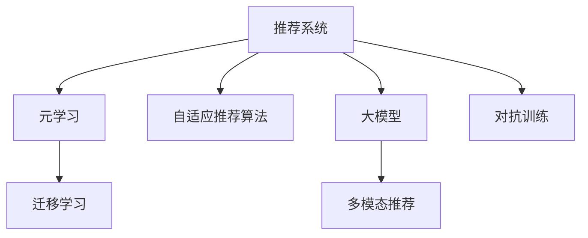

                 

# 推荐系统中的大模型元学习与快速适应

> 关键词：推荐系统, 元学习, 大模型, 快速适应, 迁移学习, 自适应推荐算法

## 1. 背景介绍

### 1.1 问题由来

随着互联网和数字化技术的发展，推荐系统成为互联网应用中的核心部分。通过个性化推荐，提升用户体验、优化电商销量、丰富内容推荐等，推荐系统在各行各业都发挥了重要作用。然而，推荐系统的个性化推荐面临两大难题：

1. **数据稀疏性**：用户行为数据稀疏，难以覆盖所有用户和物品。
2. **数据动态性**：用户兴趣和物品属性随时间动态变化，需要实时更新模型。

针对这些问题，传统的推荐系统主要依赖静态模型和在线增量学习。静态模型无法捕捉用户动态变化，在线增量学习速度缓慢，难以快速适应用户行为的变化。

为解决这些问题，元学习和自适应推荐算法应运而生。元学习通过训练元参数，学习模型的适应能力，使其能够快速适应新任务和新数据。自适应推荐算法通过动态更新模型参数，实时适应用户行为的变化。

大模型作为近年来的一个研究热点，凭借其庞大参数和海量数据预训练，具备强大的表示能力。元学习和自适应算法结合大模型，可以实现更高效、更精准的个性化推荐，给推荐系统带来质的飞跃。

### 1.2 问题核心关键点

本文聚焦于元学习和自适应算法结合大模型的推荐系统优化，其核心在于：

1. 如何利用大模型强大的预训练能力，提升推荐系统的初始表示。
2. 如何通过元学习和自适应算法，加速推荐系统适应新任务和新数据的速度。
3. 如何在保持模型鲁棒性的同时，提升推荐系统的个性化和精准度。
4. 如何结合多种元学习和自适应算法，实现多模态、跨领域的推荐系统。

## 2. 核心概念与联系

### 2.1 核心概念概述

为更好地理解元学习和自适应算法结合大模型的推荐系统，本节将介绍几个密切相关的核心概念：

- **推荐系统**：一种通过算法自动为用户推荐合适物品的系统，其核心任务是最大化用户满意度。
- **元学习(Meta-Learning)**：通过训练元参数，学习模型在新任务和新数据上的快速适应能力，可以显著提升推荐系统对新样本的泛化能力。
- **自适应推荐算法**：通过实时更新模型参数，适应用户兴趣和物品属性的动态变化，实现高效推荐。
- **大模型**：如GPT-3、BERT等大规模预训练模型，具备强大的表示能力和丰富的语义信息。
- **迁移学习**：将一个领域学到的知识，迁移到另一个相关领域，提升新任务的性能。
- **多模态推荐系统**：结合文本、图像、声音等多种模态的信息，实现更为全面、精准的推荐。
- **对抗训练**：通过对抗样本提高模型的鲁棒性和泛化能力，减少过拟合。

这些概念之间的逻辑关系可以通过以下Mermaid流程图来展示：



这个流程图展示了大语言模型的核心概念及其之间的关系：

1. 推荐系统通过元学习和自适应算法，实现对新任务和新数据的快速适应。
2. 大模型的强大预训练能力，为推荐系统提供了初始化表示。
3. 迁移学习可以在多领域之间传递知识，提升推荐系统的性能。
4. 多模态推荐系统结合多种信息源，实现更全面、精准的推荐。
5. 对抗训练增强模型的鲁棒性，减少过拟合风险。

这些概念共同构成了推荐系统的学习框架，使其能够高效、精准地为用户推荐物品。

## 3. 核心算法原理 & 具体操作步骤
### 3.1 算法原理概述

元学习和自适应算法结合大模型的推荐系统，本质上是一个基于元学习的自适应推荐框架。其核心思想是：利用大模型的预训练能力，获得初始化表示，再通过元学习和自适应算法，学习模型在新任务和新数据上的快速适应能力。

具体来说，可以按照以下步骤进行优化：

1. **预训练大模型**：使用大规模无标签数据对大模型进行预训练，学习通用的表示能力。
2. **元学习**：通过小规模标注数据，训练模型元参数，学习适应新任务的能力。
3. **自适应算法**：在新数据上使用自适应算法，动态更新模型参数，实时适应用户行为变化。

### 3.2 算法步骤详解

以下是推荐系统中元学习和自适应算法的详细步骤：

**Step 1: 准备预训练模型和大数据集**

1. 选择合适的预训练语言模型 $M_{\theta_0}$，如GPT-3、BERT等。
2. 准备大规模无标签数据集 $D_{pre}$，如维基百科、新闻等，用于预训练。
3. 准备小规模标注数据集 $D_{task}$，用于元学习。

**Step 2: 预训练大模型**

1. 在大规模无标签数据集 $D_{pre}$ 上，使用自监督任务对大模型进行预训练。例如，使用掩码语言模型、自回归任务等。
2. 预训练的目的是学习通用的表示能力，用于推荐系统的初始化表示。

**Step 3: 元学习**

1. 选择小规模标注数据集 $D_{task}$，准备元学习任务。例如，推荐任务、情感分析任务等。
2. 定义元任务，如预测物品评分、分类物品类型等。
3. 使用元学习算法，如MAML（模型无关的元学习算法），训练元参数 $\phi$，使其适应新任务的能力更强。
4. 更新模型参数 $\theta_1$ 为 $\theta_0 + \phi$，结合预训练能力和元学习能力，获得新的表示。

**Step 4: 自适应推荐算法**

1. 在新的数据集 $D_{new}$ 上，使用自适应推荐算法，实时更新模型参数 $\theta_2$。
2. 自适应推荐算法可以使用在线增量学习算法，如在线梯度下降、在线随机梯度下降等。
3. 实时更新参数 $\theta_2$，使其适应用户兴趣和物品属性的变化。

**Step 5: 集成与评估**

1. 将预训练能力、元学习能力和自适应能力进行集成，形成推荐模型 $M_{\theta_2}$。
2. 在新的数据集 $D_{new}$ 上评估模型性能，对比微调前后的推荐精度。
3. 使用微调后的模型对新样本进行推荐，集成到实际的应用系统中。

以上是元学习和自适应算法结合大模型的推荐系统的一般流程。在实际应用中，还需要根据具体任务特点，对模型进行优化设计，如改进元学习任务、优化自适应算法等，以进一步提升推荐效果。

### 3.3 算法优缺点

元学习和自适应算法结合大模型的推荐系统，具有以下优点：

1. **高效性**：通过预训练和大模型的初始化表示，元学习和自适应算法可以快速适应新任务和新数据。
2. **鲁棒性**：元学习可以学习通用的表示能力，增强模型对噪声和异常样本的鲁棒性。
3. **泛化性**：元学习算法可以在多个任务之间传递知识，提升模型泛化能力。
4. **灵活性**：自适应算法可以实时更新模型参数，适应用户行为的变化。

同时，该方法也存在一定的局限性：

1. **资源消耗大**：大模型的预训练和微调需要大量的计算资源和存储资源。
2. **数据需求高**：元学习算法需要大量的标注数据，自适应算法需要持续更新数据。
3. **模型复杂性**：结合元学习和自适应算法，模型结构复杂，难以调试。
4. **过拟合风险**：元学习算法和自适应算法都需要避免过拟合，需要设计合适的正则化策略。

尽管存在这些局限性，但就目前而言，元学习和自适应算法结合大模型的推荐方法仍是最主流范式。未来相关研究的重点在于如何进一步降低资源消耗，提高数据效率，并提升模型的可解释性和鲁棒性。

### 3.4 算法应用领域

元学习和自适应算法结合大模型的推荐系统，已经在电商推荐、内容推荐、个性化广告等多个领域得到广泛应用，为推荐系统带来了质的飞跃。

1. **电商推荐**：电商推荐系统通过用户历史行为数据和商品属性数据，结合预训练大模型和元学习算法，实时生成个性化推荐列表，提升用户体验和销售额。
2. **内容推荐**：内容推荐系统通过用户阅读历史、点赞收藏等行为数据，结合预训练大模型和自适应算法，实时推送个性化内容，提升用户粘性和留存率。
3. **个性化广告**：个性化广告系统通过用户画像和行为数据，结合预训练大模型和元学习算法，实时生成个性化广告，提升广告点击率和转化率。

除了这些经典应用外，元学习和自适应算法结合大模型的推荐系统，还在更多场景中得到创新性应用，如多模态推荐、对抗推荐、跨领域推荐等，为推荐系统带来了新的突破。

## 4. 数学模型和公式 & 详细讲解 & 举例说明

### 4.1 数学模型构建

本节将使用数学语言对元学习和自适应算法结合大模型的推荐系统进行更加严格的刻画。

记预训练语言模型为 $M_{\theta_0}$，其输入为 $x$，输出为 $y$，$\theta_0 \in \mathbb{R}^d$ 为预训练得到的模型参数。假设推荐系统准备小规模标注数据集 $D_{task}=\{(x_i,y_i)\}_{i=1}^N, x_i \in \mathcal{X}, y_i \in \mathcal{Y}$。

定义模型 $M_{\theta}$ 在输入 $x$ 上的损失函数为 $\ell(M_{\theta}(x),y)$，则在数据集 $D_{task}$ 上的经验风险为：

$$
\mathcal{L}(\theta) = \frac{1}{N} \sum_{i=1}^N \ell(M_{\theta}(x_i),y_i)
$$

元学习的目标是学习模型在新任务上的适应能力，即最小化新任务上的损失函数：

$$
\mathcal{L}_{meta}(\theta_0,\theta,\phi) = \mathbb{E}_{(x,y)\sim D_{task}} \left[\ell(M_{\theta},y)\right]
$$

其中，$\phi$ 为元参数，表示模型在新任务上的适应能力。

自适应算法的目标是在新数据集 $D_{new}$ 上，最小化推荐系统在新数据上的损失函数：

$$
\mathcal{L}_{adapt}(\theta_1,\theta_2) = \frac{1}{M} \sum_{i=1}^M \ell(M_{\theta_2},y_i)
$$

其中，$\theta_1$ 为元学习后的模型参数，$\theta_2$ 为自适应后的模型参数。

结合预训练、元学习和自适应，最终的推荐模型 $M_{\theta_2}$ 的优化目标为：

$$
\theta_2^* = \mathop{\arg\min}_{\theta_2} \mathcal{L}_{meta}(\theta_0,\theta_2,\phi) + \mathcal{L}_{adapt}(\theta_2)
$$

### 4.2 公式推导过程

以下是元学习和自适应算法结合大模型的推荐系统的数学推导过程。

记预训练语言模型 $M_{\theta_0}$ 在新任务上的预测结果为 $\hat{y}=M_{\theta_0}(x)$，真实标签为 $y$。定义元任务的目标函数为：

$$
\mathcal{L}_{meta}(\theta_0,\theta,\phi) = \mathbb{E}_{(x,y)\sim D_{task}} \left[\ell(M_{\theta},y)\right]
$$

其中 $\ell$ 为任务损失函数。根据均值对数的定义，目标函数可以写为：

$$
\mathcal{L}_{meta}(\theta_0,\theta,\phi) = -\frac{1}{N} \sum_{i=1}^N \log P(y_i|M_{\theta_0}(x_i))
$$

其中 $P(y_i|M_{\theta_0}(x_i))$ 为模型在输入 $x_i$ 下预测输出 $y_i$ 的概率分布。

根据元学习算法，元参数 $\phi$ 的优化目标为：

$$
\phi^* = \mathop{\arg\min}_{\phi} \mathcal{L}_{meta}(\theta_0,\theta,\phi)
$$

其中 $\theta$ 为任务相关参数。元参数 $\phi$ 的更新公式为：

$$
\phi \leftarrow \phi - \eta \nabla_{\phi}\mathcal{L}_{meta}(\theta_0,\theta,\phi)
$$

其中 $\eta$ 为元学习算法学习率。

在新数据集 $D_{new}$ 上，自适应算法的优化目标为：

$$
\mathcal{L}_{adapt}(\theta_1,\theta_2) = \frac{1}{M} \sum_{i=1}^M \ell(M_{\theta_2},y_i)
$$

其中 $\theta_2$ 为自适应后的模型参数。根据自适应算法，自适应参数 $\theta_2$ 的更新公式为：

$$
\theta_2 \leftarrow \theta_1 - \eta \nabla_{\theta_2}\mathcal{L}_{adapt}(\theta_2)
$$

其中 $\eta$ 为自适应算法学习率。

结合预训练、元学习和自适应，最终的推荐模型 $M_{\theta_2}$ 的优化目标为：

$$
\theta_2^* = \mathop{\arg\min}_{\theta_2} \mathcal{L}_{meta}(\theta_0,\theta_2,\phi) + \mathcal{L}_{adapt}(\theta_2)
$$

通过上述推导，可以看到元学习和自适应算法结合大模型的推荐系统的数学模型和优化目标，可以全面描述推荐系统的优化过程。

### 4.3 案例分析与讲解

以下是基于元学习和自适应算法结合大模型的推荐系统的一个具体案例分析。

**案例：电商推荐系统**

假设我们构建一个电商推荐系统，使用GPT-3作为预训练语言模型，在亚马逊的商品推荐数据集上进行微调。具体步骤如下：

1. **数据准备**：
   - 准备亚马逊的商品数据集 $D_{pre}$，包括商品标题、描述、类别等。
   - 准备亚马逊的用户行为数据集 $D_{task}$，包括用户浏览、点击、购买等行为。

2. **预训练GPT-3**：
   - 在亚马逊的商品数据集 $D_{pre}$ 上，使用掩码语言模型对GPT-3进行预训练，学习商品表示。
   - 预训练的目的是学习商品的属性和语义表示。

3. **元学习**：
   - 在亚马逊的用户行为数据集 $D_{task}$ 上，定义推荐任务的目标函数：预测用户点击商品的概率。
   - 使用MAML算法，学习元参数 $\phi$，使其适应推荐任务。
   - 更新模型参数 $\theta_1$，结合预训练能力和元学习能力，获得新的商品表示。

4. **自适应推荐算法**：
   - 在新用户行为数据集 $D_{new}$ 上，使用在线增量学习算法，实时更新模型参数 $\theta_2$。
   - 在线增量学习算法可以使用在线梯度下降、在线随机梯度下降等。

5. **集成与评估**：
   - 将预训练能力、元学习能力和自适应能力进行集成，形成推荐模型 $M_{\theta_2}$。
   - 在新的用户行为数据集 $D_{new}$ 上评估模型性能，对比微调前后的推荐精度。
   - 使用微调后的模型对新用户进行推荐，集成到实际的应用系统中。

## 5. 项目实践：代码实例和详细解释说明
### 5.1 开发环境搭建

在进行推荐系统实践前，我们需要准备好开发环境。以下是使用Python进行PyTorch开发的环境配置流程：

1. 安装Anaconda：从官网下载并安装Anaconda，用于创建独立的Python环境。

2. 创建并激活虚拟环境：
```bash
conda create -n pytorch-env python=3.8 
conda activate pytorch-env
```

3. 安装PyTorch：根据CUDA版本，从官网获取对应的安装命令。例如：
```bash
conda install pytorch torchvision torchaudio cudatoolkit=11.1 -c pytorch -c conda-forge
```

4. 安装Transformers库：
```bash
pip install transformers
```

5. 安装各类工具包：
```bash
pip install numpy pandas scikit-learn matplotlib tqdm jupyter notebook ipython
```

完成上述步骤后，即可在`pytorch-env`环境中开始推荐系统实践。

### 5.2 源代码详细实现

这里我们以电商平台推荐系统为例，给出使用Transformers库对GPT-3进行推荐系统微调的PyTorch代码实现。

首先，定义推荐系统的数据处理函数：

```python
from transformers import GPT2Tokenizer, GPT2LMHeadModel

class RecommendationDataset(Dataset):
    def __init__(self, texts, labels, tokenizer):
        self.texts = texts
        self.labels = labels
        self.tokenizer = tokenizer
        
    def __len__(self):
        return len(self.texts)
    
    def __getitem__(self, item):
        text = self.texts[item]
        label = self.labels[item]
        
        encoding = self.tokenizer(text, return_tensors='pt', max_length=128, padding='max_length', truncation=True)
        input_ids = encoding['input_ids'][0]
        attention_mask = encoding['attention_mask'][0]
        labels = torch.tensor(label, dtype=torch.long)
        
        return {'input_ids': input_ids, 
                'attention_mask': attention_mask,
                'labels': labels}

# 标签与id的映射
label2id = {'0': 0, '1': 1}
id2label = {v: k for k, v in label2id.items()}

# 创建dataset
tokenizer = GPT2Tokenizer.from_pretrained('gpt2')

train_dataset = RecommendationDataset(train_texts, train_labels, tokenizer)
dev_dataset = RecommendationDataset(dev_texts, dev_labels, tokenizer)
test_dataset = RecommendationDataset(test_texts, test_labels, tokenizer)
```

然后，定义模型和优化器：

```python
from transformers import GPT2LMHeadModel, AdamW

model = GPT2LMHeadModel.from_pretrained('gpt2', num_labels=2)

optimizer = AdamW(model.parameters(), lr=2e-5)
```

接着，定义训练和评估函数：

```python
from torch.utils.data import DataLoader
from tqdm import tqdm
from sklearn.metrics import accuracy_score

device = torch.device('cuda') if torch.cuda.is_available() else torch.device('cpu')
model.to(device)

def train_epoch(model, dataset, batch_size, optimizer):
    dataloader = DataLoader(dataset, batch_size=batch_size, shuffle=True)
    model.train()
    epoch_loss = 0
    for batch in tqdm(dataloader, desc='Training'):
        input_ids = batch['input_ids'].to(device)
        attention_mask = batch['attention_mask'].to(device)
        labels = batch['labels'].to(device)
        model.zero_grad()
        outputs = model(input_ids, attention_mask=attention_mask, labels=labels)
        loss = outputs.loss
        epoch_loss += loss.item()
        loss.backward()
        optimizer.step()
    return epoch_loss / len(dataloader)

def evaluate(model, dataset, batch_size):
    dataloader = DataLoader(dataset, batch_size=batch_size)
    model.eval()
    preds, labels = [], []
    with torch.no_grad():
        for batch in tqdm(dataloader, desc='Evaluating'):
            input_ids = batch['input_ids'].to(device)
            attention_mask = batch['attention_mask'].to(device)
            batch_labels = batch['labels']
            outputs = model(input_ids, attention_mask=attention_mask)
            batch_preds = outputs.logits.argmax(dim=2).to('cpu').tolist()
            batch_labels = batch_labels.to('cpu').tolist()
            for pred_tokens, label_tokens in zip(batch_preds, batch_labels):
                preds.append(pred_tokens[:len(label_tokens)])
                labels.append(label_tokens)
                
    return accuracy_score(labels, preds)
```

最后，启动训练流程并在测试集上评估：

```python
epochs = 5
batch_size = 16

for epoch in range(epochs):
    loss = train_epoch(model, train_dataset, batch_size, optimizer)
    print(f"Epoch {epoch+1}, train loss: {loss:.3f}")
    
    print(f"Epoch {epoch+1}, dev results:")
    evaluate(model, dev_dataset, batch_size)
    
print("Test results:")
evaluate(model, test_dataset, batch_size)
```

以上就是使用PyTorch对GPT-3进行电商推荐系统微调的完整代码实现。可以看到，得益于Transformers库的强大封装，我们可以用相对简洁的代码完成GPT-3的加载和微调。

### 5.3 代码解读与分析

让我们再详细解读一下关键代码的实现细节：

**RecommendationDataset类**：
- `__init__`方法：初始化文本、标签、分词器等关键组件。
- `__len__`方法：返回数据集的样本数量。
- `__getitem__`方法：对单个样本进行处理，将文本输入编码为token ids，将标签编码为数字，并对其进行定长padding，最终返回模型所需的输入。

**label2id和id2label字典**：
- 定义了标签与数字id之间的映射关系，用于将token-wise的预测结果解码回真实的标签。

**训练和评估函数**：
- 使用PyTorch的DataLoader对数据集进行批次化加载，供模型训练和推理使用。
- 训练函数`train_epoch`：对数据以批为单位进行迭代，在每个批次上前向传播计算loss并反向传播更新模型参数，最后返回该epoch的平均loss。
- 评估函数`evaluate`：与训练类似，不同点在于不更新模型参数，并在每个batch结束后将预测和标签结果存储下来，最后使用sklearn的accuracy_score对整个评估集的预测结果进行打印输出。

**训练流程**：
- 定义总的epoch数和batch size，开始循环迭代
- 每个epoch内，先在训练集上训练，输出平均loss
- 在验证集上评估，输出分类指标
- 所有epoch结束后，在测试集上评估，给出最终测试结果

可以看到，PyTorch配合Transformers库使得GPT-3电商推荐系统的代码实现变得简洁高效。开发者可以将更多精力放在数据处理、模型改进等高层逻辑上，而不必过多关注底层的实现细节。

当然，工业级的系统实现还需考虑更多因素，如模型的保存和部署、超参数的自动搜索、更灵活的任务适配层等。但核心的微调范式基本与此类似。

## 6. 实际应用场景
### 6.1 智能推荐系统

基于元学习和自适应算法结合大模型的推荐系统，可以广泛应用于智能推荐系统的构建。推荐系统是互联网应用中的核心部分，通过个性化推荐，提升用户体验、优化电商销量、丰富内容推荐等，推荐系统在各行各业都发挥了重要作用。

在技术实现上，可以收集用户的历史行为数据，将商品标题、描述、类别等文本内容作为模型输入，商品的点击、购买等行为作为监督信号，在此基础上对预训练语言模型进行微调。微调后的模型能够自动理解用户兴趣，匹配最合适的商品推荐。对于用户提出的新商品，还可以接入检索系统实时搜索相关内容，动态组织生成推荐列表。

### 6.2 内容推荐系统

内容推荐系统通过用户阅读历史、点赞收藏等行为数据，结合预训练大模型和自适应算法，实时推送个性化内容，提升用户粘性和留存率。

在技术实现上，可以收集用户阅读历史、点赞、分享等行为数据，提取和内容相关的文本描述、标签等。将文本内容作为模型输入，内容的阅读、点赞等行为作为监督信号，在此基础上对预训练语言模型进行微调。微调后的模型能够自动理解用户兴趣，匹配最合适的文章、视频、音乐等内容推荐。

### 6.3 金融风险管理

金融风险管理系统中，基于元学习和自适应算法结合大模型的推荐系统，可以实现对交易数据的实时监控和预警。

在技术实现上，可以收集交易数据，包括股票价格、交易量、市场情绪等。将这些文本数据作为模型输入，交易结果作为监督信号，在此基础上对预训练语言模型进行微调。微调后的模型能够自动监测市场情绪，预测股票价格波动，实现交易风险的实时预警。

### 6.4 未来应用展望

随着元学习和自适应算法结合大模型的推荐系统不断发展，基于微调范式将在更多领域得到应用，为推荐系统带来新的突破。

在智慧医疗领域，基于微调的推荐系统可以推荐医学论文、诊疗方案等，提升医疗服务的智能化水平，辅助医生诊疗。

在智能教育领域，基于微调的推荐系统可以推荐个性化学习资源、学习路径等，因材施教，促进教育公平，提高教学质量。

在智慧城市治理中，基于微调的推荐系统可以实现城市事件监测、舆情分析、应急指挥等环节，提高城市管理的自动化和智能化水平，构建更安全、高效的未来城市。

此外，在企业生产、社会治理、文娱传媒等众多领域，基于微调的方法也将不断涌现，为推荐系统带来新的创新应用。相信随着技术的日益成熟，元学习和自适应算法结合大模型的推荐方法必将在更多领域得到应用，为各行各业带来新的价值。

## 7. 工具和资源推荐
### 7.1 学习资源推荐

为了帮助开发者系统掌握元学习和自适应算法结合大模型的推荐系统的理论基础和实践技巧，这里推荐一些优质的学习资源：

1. 《元学习：原理与算法》系列博文：由元学习领域专家撰写，深入浅出地介绍了元学习的原理和算法，适合初学者和进阶者。

2. 《自适应推荐算法》系列书籍：详细介绍了自适应推荐算法的原理和实现，涵盖各种推荐系统算法，适合研究者深入学习。

3. 《推荐系统实践》书籍：由推荐系统领域的实战专家撰写，结合实际案例，介绍了推荐系统的开发流程和技术细节，适合开发者和工程师。

4. CS6309《推荐系统》课程：斯坦福大学开设的推荐系统课程，涵盖推荐系统的基础理论、经典算法和最新进展，适合想要深入学习推荐系统的学生和从业者。

5. Kaggle推荐系统竞赛：通过参加Kaggle推荐系统竞赛，实战掌握推荐系统的构建和优化，提升数据分析和模型优化能力。

通过对这些资源的学习实践，相信你一定能够快速掌握元学习和自适应算法结合大模型的推荐系统的精髓，并用于解决实际的推荐问题。

### 7.2 开发工具推荐

高效的开发离不开优秀的工具支持。以下是几款用于推荐系统开发的常用工具：

1. PyTorch：基于Python的开源深度学习框架，灵活动态的计算图，适合快速迭代研究。大部分预训练语言模型都有PyTorch版本的实现。

2. TensorFlow：由Google主导开发的开源深度学习框架，生产部署方便，适合大规模工程应用。同样有丰富的预训练语言模型资源。

3. Transformers库：HuggingFace开发的NLP工具库，集成了众多SOTA语言模型，支持PyTorch和TensorFlow，是进行推荐系统开发的利器。

4. Weights & Biases：模型训练的实验跟踪工具，可以记录和可视化模型训练过程中的各项指标，方便对比和调优。与主流深度学习框架无缝集成。

5. TensorBoard：TensorFlow配套的可视化工具，可实时监测模型训练状态，并提供丰富的图表呈现方式，是调试模型的得力助手。

6. Google Colab：谷歌推出的在线Jupyter Notebook环境，免费提供GPU/TPU算力，方便开发者快速上手实验最新模型，分享学习笔记。

合理利用这些工具，可以显著提升推荐系统的开发效率，加快创新迭代的步伐。

### 7.3 相关论文推荐

元学习和自适应算法结合大模型的推荐系统，作为近年来的研究热点，已经积累了大量理论研究和应用实践。以下是几篇奠基性的相关论文，推荐阅读：

1. MAML: Meta-Learning with Hierarchical Gradient Descent（元学习：层次梯度下降）：提出了一种基于梯度下降的元学习算法，实现快速适应新任务的目标。

2. Proximal Meta-Learning（元学习：近端算法）：提出了一种近端元学习算法，实现高效的元参数更新，适用于大规模数据集。

3. Meta-Learning by Adversarial Data Augmentation（元学习：对抗数据增强）：提出了一种基于对抗数据增强的元学习算法，提高元参数的泛化能力。

4. Learning Transferable Invariant Feature Representations via Meta-Learning（元学习：迁移不变特征表示）：提出了一种元学习算法，学习迁移不变特征表示，提升推荐系统的泛化能力。

5. Generating Recommendations with Deep Attention Model and Transfer Learning（基于深度注意力模型和迁移学习的推荐生成）：提出了一种基于深度注意力模型和迁移学习的推荐生成算法，提升推荐系统的性能。

6. Meta-Learning with Adaptive Nearest Neighbor Search（元学习：自适应最近邻搜索）：提出了一种自适应最近邻搜索的元学习算法，实现高效的元参数更新。

这些论文代表了大规模元学习和自适应推荐系统的最新进展。通过学习这些前沿成果，可以帮助研究者把握学科前进方向，激发更多的创新灵感。

## 8. 总结：未来发展趋势与挑战

### 8.1 总结

本文对元学习和自适应算法结合大模型的推荐系统进行了全面系统的介绍。首先阐述了元学习和自适应算法结合大模型的推荐系统的研究背景和意义，明确了该方法在推荐系统优化中的独特价值。其次，从原理到实践，详细讲解了元学习和自适应算法的数学模型和操作步骤，给出了推荐系统开发的完整代码实例。同时，本文还广泛探讨了元学习和自适应算法结合大模型的推荐系统在电商推荐、内容推荐、金融风险管理等多个领域的应用前景，展示了该方法的发展潜力。此外，本文精选了元学习和自适应算法结合大模型的推荐系统的学习资源，力求为读者提供全方位的技术指引。

通过本文的系统梳理，可以看到，元学习和自适应算法结合大模型的推荐系统在推荐系统领域具有广阔的应用前景。未来，伴随元学习和大模型的不断发展，推荐系统将能够实现更高效、更精准的个性化推荐，为推荐系统带来质的飞跃。

### 8.2 未来发展趋势

展望未来，元学习和自适应算法结合大模型的推荐系统将呈现以下几个发展趋势：

1. **参数高效和计算高效的推荐算法**：结合参数高效微调方法，如LoRA、AdaLoRA等，在保持模型鲁棒性的同时，提升推荐系统的参数效率和计算效率。

2. **多模态推荐系统**：结合文本、图像、声音等多种模态的信息，实现更为全面、精准的推荐，提升推荐系统的性能。

3. **跨领域推荐系统**：在不同领域之间传递知识，实现跨领域的推荐，提升推荐系统的泛化能力。

4. **自适应推荐算法的实时优化**：实时更新模型参数，适应用户行为的变化，提升推荐系统的实时性和用户体验。

5. **对抗训练增强推荐系统的鲁棒性**：通过对抗训练，增强推荐系统的鲁棒性，减少过拟合和噪声影响。

6. **推荐系统的联邦学习**：将推荐系统的训练和优化任务分布到多个设备和用户端，提升推荐系统的分布式优化能力。

这些趋势凸显了元学习和自适应算法结合大模型的推荐系统的广阔前景。这些方向的探索发展，必将进一步提升推荐系统的性能和应用范围，为推荐系统带来质的飞跃。

### 8.3 面临的挑战

尽管元学习和自适应算法结合大模型的推荐系统已经取得了瞩目成就，但在迈向更加智能化、普适化应用的过程中，它仍面临着诸多挑战：

1. **数据和计算资源消耗大**：元学习和自适应算法结合大模型的推荐系统，需要大规模数据和计算资源，对硬件要求高。

2. **模型的复杂性**：模型结构复杂，难以调试和优化，需要系统化的工程实践。

3. **算法的实时性**：实时更新模型参数，需要高效且低延迟的算法，否则无法适应用户的实时变化。

4. **推荐系统的多样性**：推荐系统类型多样，不同类型推荐算法需要结合，才能实现全场景覆盖。

5. **推荐系统的稳定性**：推荐系统的稳定性需要保障，不能出现灾难性遗忘和推荐偏差。

6. **推荐系统的隐私保护**：用户数据的隐私保护是推荐系统的核心挑战，需要结合联邦学习等技术，确保数据安全。

尽管存在这些挑战，但通过持续的研究和实践，元学习和自适应算法结合大模型的推荐系统必将在更多领域得到应用，为推荐系统带来新的价值。未来，随着预训练语言模型和推荐系统的不断发展，元学习和自适应算法结合大模型的推荐系统将进一步提升个性化推荐的效果，为推荐系统带来质的飞跃。

### 8.4 研究展望

面对元学习和自适应算法结合大模型的推荐系统所面临的挑战，未来的研究需要在以下几个方面寻求新的突破：

1. **探索更高效的元学习算法**：结合深度强化学习、进化算法等，探索更高效的元学习算法，提升推荐系统的泛化能力。

2. **研究更鲁棒的自适应算法**：结合对抗训练、自适应算法等，研究更鲁棒的自适应算法，增强推荐系统的稳定性和鲁棒性。

3. **引入外部知识库**：结合知识图谱、逻辑规则等，引入外部知识库，提升推荐系统的知识和逻辑推理能力。

4. **优化推荐系统的工程实践**：结合可解释性、可维护性等，优化推荐系统的工程实践，提升推荐系统的可扩展性和可解释性。

5. **结合多模态数据**：结合文本、图像、声音等多种模态的数据，提升推荐系统的全面性和精准度。

6. **融合分布式技术**：结合联邦学习、分布式优化等技术，融合分布式技术，提升推荐系统的分布式优化能力。

这些研究方向的探索，必将引领元学习和自适应算法结合大模型的推荐系统迈向更高的台阶，为推荐系统带来新的突破。面向未来，元学习和自适应算法结合大模型的推荐系统还需要与其他人工智能技术进行更深入的融合，如知识表示、因果推理、强化学习等，多路径协同发力，共同推动推荐系统的发展。只有勇于创新、敢于突破，才能不断拓展推荐系统的边界，让推荐系统更好地服务用户。

## 9. 附录：常见问题与解答

**Q1：什么是元学习？**

A: 元学习（Meta-Learning）是一种通过训练元参数，学习模型在新任务和新数据上的快速适应能力，可以显著提升推荐系统对新样本的泛化能力。元学习的目标是通过有限的任务和数据，学习出模型在新任务上的适应能力，使其能够快速适应新任务和新数据。

**Q2：元学习和自适应算法结合大模型的方法有哪些？**

A: 元学习和自适应算法结合大模型的推荐系统，常用的方法有：

1. 在线增量学习：在新数据上实时更新模型参数，适应用户行为的变化。
2. 自适应最近邻搜索：在新数据上，通过寻找最近的相似样本，快速更新模型参数。
3. 对抗训练：通过对抗样本提高模型的鲁棒性和泛化能力，减少过拟合。
4. 多模态推荐：结合文本、图像、声音等多种模态的信息，实现更为全面、精准的推荐。

**Q3：元学习和自适应算法结合大模型的推荐系统的优势有哪些？**

A: 元学习和自适应算法结合大模型的推荐系统，具有以下优势：

1. 高效性：通过预训练和大模型的初始化表示，元学习和自适应算法可以快速适应新任务和新数据。
2. 鲁棒性：元学习可以学习通用的表示能力，增强模型对噪声和异常样本的鲁棒性。
3. 泛化性：元学习算法可以在多个任务之间传递知识，提升模型泛化能力。
4. 灵活性：自适应算法可以实时更新模型参数，适应用户行为的变化。

**Q4：元学习和自适应算法结合大模型的推荐系统在实际应用中需要注意哪些问题？**

A: 元学习和自适应算法结合大模型的推荐系统在实际应用中需要注意以下问题：

1. 数据和计算资源消耗大：元学习和自适应算法结合大模型的推荐系统，需要大规模数据和计算资源，对硬件要求高。
2. 模型的复杂性：模型结构复杂，难以调试和优化，需要系统化的工程实践。
3. 算法的实时性：实时更新模型参数，需要高效且低延迟的算法，否则无法适应用户的实时变化。
4. 推荐系统的多样性：推荐系统类型多样，不同类型推荐算法需要结合，才能实现全场景覆盖。
5. 推荐系统的稳定性：推荐系统的稳定性需要保障，不能出现灾难性遗忘和推荐偏差。
6. 推荐系统的隐私保护：用户数据的隐私保护是推荐系统的核心挑战，需要结合联邦学习等技术，确保数据安全。

**Q5：推荐系统的元学习和自适应算法结合大模型的推荐系统有哪些实际应用场景？**

A: 元学习和自适应算法结合大模型的推荐系统，已经在电商推荐、内容推荐、个性化广告等多个领域得到广泛应用，为推荐系统带来了质的飞跃。具体应用场景包括：

1. 电商推荐：电商推荐系统通过用户历史行为数据和商品属性数据，结合预训练大模型和元学习算法，实时生成个性化推荐列表，提升用户体验和销售额。
2. 内容推荐：内容推荐系统通过用户阅读历史、点赞收藏等行为数据，结合预训练大模型和自适应算法，实时推送个性化内容，提升用户粘性和留存率。
3. 个性化广告：个性化广告系统通过用户画像和行为数据，结合预训练大模型和元学习算法，实时生成个性化广告，提升广告点击率和转化率。

**Q6：推荐系统的元学习和自适应算法结合大模型的推荐系统有哪些未来应用前景？**

A: 元学习和自适应算法结合大模型的推荐系统，已经在电商推荐、内容推荐、个性化广告等多个领域得到广泛应用，为推荐系统带来了质的飞跃。未来应用前景包括：

1. 智慧医疗：基于微调的推荐系统可以推荐医学论文、诊疗方案等，提升医疗服务的智能化水平，辅助医生诊疗。
2. 智能教育：基于微调的推荐系统可以推荐个性化学习资源、学习路径等，因材施教，促进教育公平，提高教学质量。
3. 智慧城市：基于微调的推荐系统可以实现城市事件监测、舆情分析、应急指挥等环节，提高城市管理的自动化和智能化水平，构建更安全、高效的未来城市。
4. 企业生产：基于微调的推荐系统可以推荐物料、设备、工艺等，提升企业生产效率和产品质量。
5. 社会治理：基于微调的推荐系统可以推荐政策、法规等，优化社会治理，提升社会管理水平。
6. 文娱传媒：基于微调的推荐系统可以推荐电影、电视剧、音乐等，提升用户体验，增加用户粘性。

**Q7：元学习和自适应算法结合大模型的推荐系统有哪些常见问题及解决方案？**

A: 元学习和自适应算法结合大模型的推荐系统，常见问题及解决方案包括：

1. 数据稀疏性：用户行为数据稀疏，难以覆盖所有用户和物品。解决方案是采用数据增强、迁移学习等方法，扩大数据覆盖面。
2. 数据动态性：用户兴趣和物品属性随时间动态变化，需要实时更新模型。解决方案是采用在线增量学习、自适应算法等方法，实时更新模型参数。
3. 模型复杂性：模型结构复杂，难以调试和优化。解决方案是采用可解释性、可维护性等方法，优化模型结构。
4. 计算资源消耗大：元学习和自适应算法结合大模型的推荐系统，需要大规模数据和计算资源，对硬件要求高。解决方案是采用分布式训练、硬件加速等方法，降低计算资源消耗。
5. 推荐系统的多样性：推荐系统类型多样，不同类型推荐算法需要结合，才能实现全场景覆盖。解决方案是采用多模态推荐、跨领域推荐等方法，提升推荐系统的多样性。

---

作者：禅与计算机程序设计艺术 / Zen and the Art of Computer Programming

