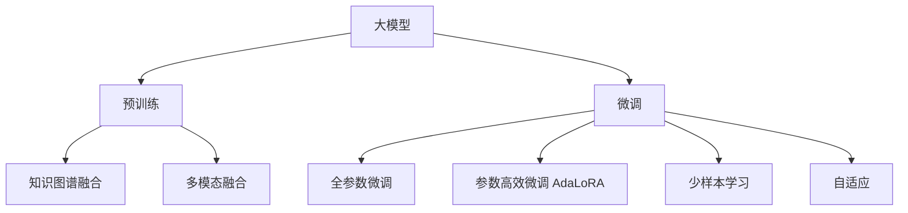

                 

# 推荐系统中的大模型少样本学习与适应

> 关键词：大模型,少样本学习,自适应,推荐系统,预训练,微调,AdaLoRA,LoRA

## 1. 背景介绍

### 1.1 问题由来
推荐系统作为现代互联网应用的核心之一，肩负着帮助用户发现感兴趣的物品、优化购物体验的使命。然而，推荐算法的效果往往依赖于用户行为数据的丰富程度，而数据收集和标注成本昂贵且耗时。在实际应用中，特别是对于一些新兴领域或小众用户群体，获取足够的行为数据非常困难，导致推荐系统难以有效运作。

为了缓解数据不足的问题，研究者提出并发展了一系列基于预训练模型的推荐系统方案。通过在预训练语言模型上微调，利用已有知识在少量标注数据上进行推荐，大模型推荐系统逐渐成为行业新宠。但即便有了大模型的加持，推荐系统的数据需求依然存在，尤其是新用户或冷启动用户，缺乏行为数据的推荐效果往往不尽如人意。

为此，推荐系统需要引入少样本学习与自适应方法，使得模型能够在有限的标注样本上实现快速优化，适配用户的兴趣变化，弥补数据不足带来的瓶颈。本文聚焦于利用大模型的少样本学习与自适应技术，以优化推荐系统性能，特别是提升冷启动用户和新用户的推荐效果。

### 1.2 问题核心关键点
为了更好地理解推荐系统中的大模型少样本学习与适应方法，本节将介绍几个密切相关的核心概念：

- 大模型：如BERT、GPT等大型语言模型，通过在大规模语料上进行预训练，学习丰富的语言知识，具备强大的语言理解和生成能力。
- 少样本学习：指模型在有限的标注样本上快速适应的能力，通过学习数据中的通用模式，实现更好的泛化。
- 自适应：指模型能够在不断变化的数据和场景中，动态调整自己的参数和行为，保持优化的稳定性。
- 预训练与微调：预训练即在大规模无标签数据上进行训练，微调则是在特定任务上有监督地优化模型。
- AdaLoRA与LoRA：参数高效微调方法，通过共享部分预训练参数，提升微调效率和效果。
- 知识图谱：结合语义知识图谱进行推荐，提升模型的领域适应性和泛化能力。
- 多模态融合：将视觉、语音等多模态数据与文本数据结合，提升推荐系统的全面性。

这些核心概念之间的逻辑关系可以通过以下Mermaid流程图来展示：



这个流程图展示了推荐系统中的大模型少样本学习与适应过程的关键步骤：

1. 大模型通过预训练获得基础能力。
2. 微调使模型在特定推荐任务上有监督地优化，适应用户兴趣变化。
3. 参数高效微调和少样本学习提升微调效率和效果。
4. 自适应方法确保模型在不断变化的数据场景中动态调整。
5. 结合知识图谱和多模态融合进一步提升推荐精度和泛化能力。

这些概念共同构成了推荐系统中的大模型少样本学习与适应框架，使得推荐系统能够在大规模预训练基础上，实现快速优化和高效推荐。

## 2. 核心概念与联系

### 2.1 核心概念概述

为更好地理解推荐系统中的大模型少样本学习与适应方法，本节将介绍几个密切相关的核心概念：

- 大模型推荐：指利用大模型进行推荐，通过在推荐任务上微调，将预训练模型的通用知识应用于推荐任务，提升推荐效果。
- 少样本学习：指模型在少量标注样本上能够快速适应的能力，通过学习数据中的通用模式，实现更好的泛化。
- 自适应推荐：指推荐系统能够在不断变化的用户兴趣和物品特征中，动态调整推荐策略，保持优化的稳定性。
- 预训练与微调：预训练即在大规模无标签数据上进行训练，微调则是在特定推荐任务上有监督地优化模型。
- AdaLoRA与LoRA：参数高效微调方法，通过共享部分预训练参数，提升微调效率和效果。
- 知识图谱：结合语义知识图谱进行推荐，提升模型的领域适应性和泛化能力。
- 多模态融合：将视觉、语音等多模态数据与文本数据结合，提升推荐系统的全面性。

这些概念之间的逻辑关系可以通过以下Mermaid流程图来展示：


这个流程图展示了推荐系统中的大模型少样本学习与适应过程的关键步骤：

1. 大模型通过预训练获得基础能力。
2. 微调使模型在特定推荐任务上有监督地优化，适应用户兴趣变化。
3. 参数高效微调和少样本学习提升微调效率和效果。
4. 自适应方法确保模型在不断变化的数据场景中动态调整。
5. 结合知识图谱和多模态融合进一步提升推荐精度和泛化能力。

这些概念共同构成了推荐系统中的大模型少样本学习与适应框架，使得推荐系统能够在大规模预训练基础上，实现快速优化和高效推荐。

## 3. 核心算法原理 & 具体操作步骤
### 3.1 算法原理概述

推荐系统中的大模型少样本学习与适应，本质上是一个有监督的迁移学习过程。其核心思想是：将预训练的大模型视作一个强大的"特征提取器"，通过在推荐任务的少量标注数据上进行有监督地训练来优化模型在该任务上的性能。

具体而言，假设预训练模型为 $M_{\theta}$，其中 $\theta$ 为预训练得到的模型参数。给定推荐任务 $T$ 的标注数据集 $D=\{(x_i, y_i)\}_{i=1}^N, x_i \in \mathcal{X}, y_i \in \{0,1\}$，即物品-用户-点击三元组，微调的目标是找到新的模型参数 $\hat{\theta}$，使得：

$$
\hat{\theta}=\mathop{\arg\min}_{\theta} \mathcal{L}(M_{\theta},D)
$$

其中 $\mathcal{L}$ 为针对任务 $T$ 设计的损失函数，用于衡量模型预测输出与真实标签之间的差异。常见的损失函数包括交叉熵损失、均方误差损失等。

通过梯度下降等优化算法，微调过程不断更新模型参数 $\theta$，最小化损失函数 $\mathcal{L}$，使得模型输出逼近真实标签。由于 $\theta$ 已经通过预训练获得了较好的初始化，因此即便在少量数据集 $D$ 上进行微调，也能较快收敛到理想的模型参数 $\hat{\theta}$。

### 3.2 算法步骤详解

基于大模型推荐系统的少样本学习与适应一般包括以下几个关键步骤：

**Step 1: 准备预训练模型和数据集**
- 选择合适的预训练语言模型 $M_{\theta}$ 作为初始化参数，如 BERT、GPT等。
- 准备推荐任务 $T$ 的标注数据集 $D$，划分为训练集、验证集和测试集。一般要求标注数据与预训练数据的分布不要差异过大。

**Step 2: 添加任务适配层**
- 根据推荐任务类型，在预训练模型顶层设计合适的输出层和损失函数。
- 对于推荐任务，通常在顶层添加分类器，如BCE损失函数，用于预测物品的点击概率。
- 对于协同过滤等推荐任务，可能需要调整编码器-解码器结构，适应不同的推荐形式。

**Step 3: 设置微调超参数**
- 选择合适的优化算法及其参数，如 AdamW、SGD 等，设置学习率、批大小、迭代轮数等。
- 设置正则化技术及强度，包括权重衰减、Dropout、Early Stopping等。
- 确定冻结预训练参数的策略，如仅微调顶层，或全部参数都参与微调。

**Step 4: 执行梯度训练**
- 将训练集数据分批次输入模型，前向传播计算损失函数。
- 反向传播计算参数梯度，根据设定的优化算法和学习率更新模型参数。
- 周期性在验证集上评估模型性能，根据性能指标决定是否触发 Early Stopping。
- 重复上述步骤直到满足预设的迭代轮数或 Early Stopping 条件。

**Step 5: 测试和部署**
- 在测试集上评估微调后模型 $M_{\hat{\theta}}$ 的性能，对比微调前后的精度提升。
- 使用微调后的模型对新样本进行推荐，集成到实际的应用系统中。
- 持续收集新的数据，定期重新微调模型，以适应数据分布的变化。

以上是基于大模型推荐系统的少样本学习与适应的一般流程。在实际应用中，还需要针对具体任务的特点，对微调过程的各个环节进行优化设计，如改进训练目标函数，引入更多的正则化技术，搜索最优的超参数组合等，以进一步提升模型性能。

### 3.3 算法优缺点

基于大模型推荐系统的少样本学习与适应方法具有以下优点：
1. 快速优化：利用已有预训练知识，通过少量标注数据即可快速提升推荐效果，降低数据收集和标注成本。
2. 泛化能力强：通过在大模型上进行微调，利用其广泛的语义知识，提升模型的泛化能力，对新样本和新场景有较好的适应性。
3. 参数高效：利用参数高效微调方法，如AdaLoRA、LoRA等，在固定大部分预训练参数的情况下，仍可取得不错的微调效果。
4. 灵活性高：通过调整任务适配层和损失函数，适应不同类型的推荐任务，扩展了推荐系统的应用范围。

同时，该方法也存在一定的局限性：
1. 数据依赖：微调效果很大程度上取决于标注数据的质量和数量，获取高质量标注数据的成本较高。
2. 泛化限制：当推荐任务与预训练数据的分布差异较大时，微调的性能提升有限。
3. 参数更新复杂：全参数微调需要更新全部预训练参数，计算成本较高。
4. 自适应不足：当前自适应方法仍较简单，难以应对快速变化的用户兴趣和物品特征。

尽管存在这些局限性，但就目前而言，基于大模型的少样本学习与适应方法在推荐系统领域仍是最主流范式。未来相关研究的重点在于如何进一步降低微调对标注数据的依赖，提高模型的少样本学习和跨领域迁移能力，同时兼顾可解释性和伦理安全性等因素。

### 3.4 算法应用领域

基于大模型的少样本学习与适应方法，在推荐系统领域已经得到了广泛的应用，覆盖了几乎所有常见推荐任务，例如：

- 物品推荐：为用户推荐感兴趣的物品，如商品、音乐、视频等。
- 用户推荐：为用户推荐感兴趣的用户，如关注、好友、粉丝等。
- 时间推荐：根据时间顺序推荐相关物品，如商品、文章等。
- 兴趣推荐：根据用户的兴趣和行为，推荐相关的兴趣主题，如新闻、视频、文章等。
- 热门推荐：推荐当前热门物品，如热门商品、热门新闻等。
- 个性化推荐：根据用户的历史行为和兴趣，推荐个性化物品，如个性化商品、个性化文章等。
- 跨模态推荐：结合视觉、语音等多模态数据进行推荐，提升推荐系统的全面性。

除了上述这些经典任务外，大模型推荐系统也被创新性地应用到更多场景中，如可控推荐、个性化推荐算法、知识图谱推荐等，为推荐技术带来了全新的突破。随着预训练模型和少样本学习方法的不断进步，相信推荐系统将在更广阔的应用领域大放异彩。

## 4. 数学模型和公式 & 详细讲解 & 举例说明

### 4.1 数学模型构建

本节将使用数学语言对基于大模型的推荐系统少样本学习与适应过程进行更加严格的刻画。

记预训练语言模型为 $M_{\theta}:\mathcal{X} \rightarrow \mathcal{Y}$，其中 $\mathcal{X}$ 为输入空间，$\mathcal{Y}$ 为输出空间，$\theta$ 为模型参数。假设推荐任务 $T$ 的训练集为 $D=\{(x_i, y_i)\}_{i=1}^N, x_i \in \mathcal{X}, y_i \in \{0,1\}$。

定义模型 $M_{\theta}$ 在数据样本 $(x,y)$ 上的损失函数为 $\ell(M_{\theta}(x),y)$，则在数据集 $D$ 上的经验风险为：

$$
\mathcal{L}(\theta) = \frac{1}{N}\sum_{i=1}^N \ell(M_{\theta}(x_i),y_i)
$$

微调的优化目标是最小化经验风险，即找到最优参数：

$$
\theta^* = \mathop{\arg\min}_{\theta} \mathcal{L}(\theta)
$$

在实践中，我们通常使用基于梯度的优化算法（如SGD、Adam等）来近似求解上述最优化问题。设 $\eta$ 为学习率，$\lambda$ 为正则化系数，则参数的更新公式为：

$$
\theta \leftarrow \theta - \eta \nabla_{\theta}\mathcal{L}(\theta) - \eta\lambda\theta
$$

其中 $\nabla_{\theta}\mathcal{L}(\theta)$ 为损失函数对参数 $\theta$ 的梯度，可通过反向传播算法高效计算。

### 4.2 公式推导过程

以下我们以推荐物品为例，推导交叉熵损失函数及其梯度的计算公式。

假设模型 $M_{\theta}$ 在输入 $x$ 上的输出为 $\hat{y}=M_{\theta}(x) \in [0,1]$，表示物品 $x$ 被用户 $y$ 点击的概率。真实标签 $y \in \{0,1\}$。则二分类交叉熵损失函数定义为：

$$
\ell(M_{\theta}(x),y) = -[y\log \hat{y} + (1-y)\log (1-\hat{y})]
$$

将其代入经验风险公式，得：

$$
\mathcal{L}(\theta) = -\frac{1}{N}\sum_{i=1}^N [y_i\log M_{\theta}(x_i)+(1-y_i)\log(1-M_{\theta}(x_i))]
$$

根据链式法则，损失函数对参数 $\theta_k$ 的梯度为：

$$
\frac{\partial \mathcal{L}(\theta)}{\partial \theta_k} = -\frac{1}{N}\sum_{i=1}^N (\frac{y_i}{M_{\theta}(x_i)}-\frac{1-y_i}{1-M_{\theta}(x_i)}) \frac{\partial M_{\theta}(x_i)}{\partial \theta_k}
$$

其中 $\frac{\partial M_{\theta}(x_i)}{\partial \theta_k}$ 可进一步递归展开，利用自动微分技术完成计算。

在得到损失函数的梯度后，即可带入参数更新公式，完成模型的迭代优化。重复上述过程直至收敛，最终得到适应推荐任务的最优模型参数 $\theta^*$。

### 4.3 案例分析与讲解

假设我们有一个电商网站的推荐系统，目标是推荐用户可能感兴趣的商品。我们的数据集 $D$ 包含 $N$ 个样本，每个样本是一个四元组 $(x_i, y_i, u_i, t_i)$，其中 $x_i$ 是商品，$y_i$ 是点击标签（0表示未点击，1表示点击），$u_i$ 是用户，$t_i$ 是时间戳。我们的目标是训练一个推荐模型，以预测给定用户 $u_i$ 在时间 $t_i$ 点击商品 $x_i$ 的概率。

在预训练阶段，我们使用大规模无标签商品描述和用户行为数据进行自监督训练。例如，可以使用掩码语言模型任务（Masked Language Model, MLM），预测商品描述中缺失的词汇。这样，模型学习到了丰富的商品知识，可以在推荐任务上进行微调。

在微调阶段，我们选择 $M_{\theta}$ 作为初始模型，并定义一个交叉熵损失函数 $\ell(M_{\theta}(x_i),y_i)$，其中 $\theta$ 是模型参数，$x_i$ 是商品，$y_i$ 是点击标签。在训练集上，我们将每个样本的 $(x_i, y_i)$ 作为输入，模型输出点击概率 $\hat{y}=M_{\theta}(x_i)$。根据交叉熵损失函数，我们计算损失 $\ell(M_{\theta}(x_i),y_i)$，并通过梯度下降更新模型参数 $\theta$。

具体来说，训练集的数据集 $D$ 可以划分为训练集、验证集和测试集。我们使用 $D_{train}$ 进行训练，通过反向传播计算损失函数梯度，并更新模型参数 $\theta$。同时，在每个epoch结束后，我们使用 $D_{valid}$ 进行验证，评估模型性能，并根据需要调整学习率等超参数。最终，在 $D_{test}$ 上测试模型的推荐效果。

在微调过程中，我们还需要注意一些优化技巧，如学习率的调整、批大小的设定、正则化等，以避免过拟合，提高模型泛化能力。

## 5. 项目实践：代码实例和详细解释说明

### 5.1 开发环境搭建

在进行推荐系统项目实践前，我们需要准备好开发环境。以下是使用Python进行PyTorch开发的环境配置流程：

1. 安装Anaconda：从官网下载并安装Anaconda，用于创建独立的Python环境。

2. 创建并激活虚拟环境：
```bash
conda create -n pytorch-env python=3.8 
conda activate pytorch-env
```

3. 安装PyTorch：根据CUDA版本，从官网获取对应的安装命令。例如：
```bash
conda install pytorch torchvision torchaudio cudatoolkit=11.1 -c pytorch -c conda-forge
```

4. 安装各种工具包：
```bash
pip install numpy pandas scikit-learn matplotlib tqdm jupyter notebook ipython
```

完成上述步骤后，即可在`pytorch-env`环境中开始项目实践。

### 5.2 源代码详细实现

下面我们以推荐系统中的大模型少样本学习与适应为例，给出使用PyTorch和Transformers库对模型进行微调的代码实现。

首先，定义推荐任务的数据处理函数：

```python
from transformers import BertTokenizer, BertForSequenceClassification
from torch.utils.data import Dataset
import torch

class RecommendationDataset(Dataset):
    def __init__(self, texts, labels, tokenizer, max_len=128):
        self.texts = texts
        self.labels = labels
        self.tokenizer = tokenizer
        self.max_len = max_len
        
    def __len__(self):
        return len(self.texts)
    
    def __getitem__(self, item):
        text = self.texts[item]
        label = self.labels[item]
        
        encoding = self.tokenizer(text, return_tensors='pt', max_length=self.max_len, padding='max_length', truncation=True)
        input_ids = encoding['input_ids'][0]
        attention_mask = encoding['attention_mask'][0]
        
        # 对label进行编码
        label = label2id[label] if isinstance(label, str) else label
        encoded_label = torch.tensor([label], dtype=torch.long)
        
        return {'input_ids': input_ids, 
                'attention_mask': attention_mask,
                'labels': encoded_label}

# 标签与id的映射
label2id = {'click': 1, 'no_click': 0}
id2label = {v: k for k, v in label2id.items()}

# 创建dataset
tokenizer = BertTokenizer.from_pretrained('bert-base-cased')

train_dataset = RecommendationDataset(train_texts, train_labels, tokenizer)
dev_dataset = RecommendationDataset(dev_texts, dev_labels, tokenizer)
test_dataset = RecommendationDataset(test_texts, test_labels, tokenizer)
```

然后，定义模型和优化器：

```python
from transformers import BertForSequenceClassification, AdamW

model = BertForSequenceClassification.from_pretrained('bert-base-cased', num_labels=2)

optimizer = AdamW(model.parameters(), lr=2e-5)
```

接着，定义训练和评估函数：

```python
from torch.utils.data import DataLoader
from tqdm import tqdm
from sklearn.metrics import classification_report

device = torch.device('cuda') if torch.cuda.is_available() else torch.device('cpu')
model.to(device)

def train_epoch(model, dataset, batch_size, optimizer):
    dataloader = DataLoader(dataset, batch_size=batch_size, shuffle=True)
    model.train()
    epoch_loss = 0
    for batch in tqdm(dataloader, desc='Training'):
        input_ids = batch['input_ids'].to(device)
        attention_mask = batch['attention_mask'].to(device)
        labels = batch['labels'].to(device)
        model.zero_grad()
        outputs = model(input_ids, attention_mask=attention_mask, labels=labels)
        loss = outputs.loss
        epoch_loss += loss.item()
        loss.backward()
        optimizer.step()
    return epoch_loss / len(dataloader)

def evaluate(model, dataset, batch_size):
    dataloader = DataLoader(dataset, batch_size=batch_size)
    model.eval()
    preds, labels = [], []
    with torch.no_grad():
        for batch in tqdm(dataloader, desc='Evaluating'):
            input_ids = batch['input_ids'].to(device)
            attention_mask = batch['attention_mask'].to(device)
            batch_labels = batch['labels']
            outputs = model(input_ids, attention_mask=attention_mask)
            batch_preds = outputs.logits.argmax(dim=2).to('cpu').tolist()
            batch_labels = batch_labels.to('cpu').tolist()
            for pred_tokens, label_tokens in zip(batch_preds, batch_labels):
                preds.append(pred_tokens)
                labels.append(label_tokens)
                
    print(classification_report(labels, preds))
```

最后，启动训练流程并在测试集上评估：

```python
epochs = 5
batch_size = 16

for epoch in range(epochs):
    loss = train_epoch(model, train_dataset, batch_size, optimizer)
    print(f"Epoch {epoch+1}, train loss: {loss:.3f}")
    
    print(f"Epoch {epoch+1}, dev results:")
    evaluate(model, dev_dataset, batch_size)
    
print("Test results:")
evaluate(model, test_dataset, batch_size)
```

以上就是使用PyTorch对BERT模型进行推荐系统少样本学习与适应的完整代码实现。可以看到，得益于Transformers库的强大封装，我们可以用相对简洁的代码完成BERT模型的加载和微调。

### 5.3 代码解读与分析

让我们再详细解读一下关键代码的实现细节：

**RecommendationDataset类**：
- `__init__`方法：初始化文本、标签、分词器等关键组件。
- `__len__`方法：返回数据集的样本数量。
- `__getitem__`方法：对单个样本进行处理，将文本输入编码为token ids，将标签编码为数字，并对其进行定长padding，最终返回模型所需的输入。

**label2id和id2label字典**：
- 定义了标签与数字id之间的映射关系，用于将标签转换成模型可接受的格式。

**训练和评估函数**：
- 使用PyTorch的DataLoader对数据集进行批次化加载，供模型训练和推理使用。
- 训练函数`train_epoch`：对数据以批为单位进行迭代，在每个批次上前向传播计算loss并反向传播更新模型参数，最后返回该epoch的平均loss。
- 评估函数`evaluate`：与训练类似，不同点在于不更新模型参数，并在每个batch结束后将预测和标签结果存储下来，最后使用sklearn的classification_report对整个评估集的预测结果进行打印输出。

**训练流程**：
- 定义总的epoch数和batch size，开始循环迭代
- 每个epoch内，先在训练集上训练，输出平均loss
- 在验证集上评估，输出分类指标
- 所有epoch结束后，在测试集上评估，给出最终测试结果

可以看到，PyTorch配合Transformers库使得BERT微调的代码实现变得简洁高效。开发者可以将更多精力放在数据处理、模型改进等高层逻辑上，而不必过多关注底层的实现细节。

当然，工业级的系统实现还需考虑更多因素，如模型的保存和部署、超参数的自动搜索、更灵活的任务适配层等。但核心的少样本学习与适应范式基本与此类似。

## 6. 实际应用场景
### 6.1 智能推荐系统

基于大模型推荐系统的少样本学习与适应方法，可以广泛应用于智能推荐系统的构建。传统推荐系统往往需要配备大量数据，高峰期响应缓慢，且难以保证推荐质量。而使用少样本学习与适应方法，通过在推荐任务上微调，利用已有知识在少量标注数据上进行推荐，能够显著提升推荐效果。

在技术实现上，可以收集用户的历史行为数据，将物品-用户-点击三元组作为标注数据，对预训练模型进行微调。微调后的模型能够自动理解用户兴趣，预测物品点击概率，推荐用户感兴趣的商品。对于新用户或冷启动用户，还可以结合预训练知识和新样本进行零样本学习，实现推荐效果的快速提升。

### 6.2 金融理财推荐

金融理财推荐是推荐系统的重要应用之一，旨在为用户推荐有价值的投资理财建议。然而，金融领域的数据获取和标注成本较高，且金融数据隐私保护要求严格，难以大规模收集标注数据。为此，可以利用少样本学习与适应方法，在有限的标注数据上训练模型，快速适应用户的投资偏好，推荐适合的理财产品。

在实践中，可以收集用户的投资偏好、历史交易数据等，将其作为标注数据，对预训练模型进行微调。微调后的模型能够自动分析用户投资风格，预测未来市场趋势，推荐合适的理财产品，帮助用户实现资产增值。

### 6.3 新闻推荐系统

新闻推荐系统帮助用户发现感兴趣的新闻资讯，提升信息获取效率。传统新闻推荐系统往往需要长期的数据积累和标注，难以快速响应新闻热点。通过少样本学习与适应方法，可以利用少量新闻推荐数据进行快速微调，提升推荐效果。

在技术实现上，可以收集用户的浏览、点击、分享等行为数据，将其作为标注数据，对预训练模型进行微调。微调后的模型能够自动理解用户的新闻偏好，推荐相关新闻，提升用户的新闻获取体验。

### 6.4 未来应用展望

随着大模型推荐系统的发展，基于少样本学习与适应的方法将在更多领域得到应用，为推荐系统带来新的突破。

在智慧医疗领域，基于少样本学习与适应的大模型推荐系统，可以帮助医院推荐最合适的医疗资源，提高诊疗效率，辅助医生诊疗。

在智能教育领域，推荐系统可以根据学生的学习情况和偏好，推荐适合的课程和资源，提升学习效果。

在智慧城市治理中，推荐系统可以推荐相关的新闻、事件等信息，提高城市管理的自动化和智能化水平，构建更安全、高效的未来城市。

此外，在企业生产、社会治理、文娱传媒等众多领域，基于少样本学习与适应的人工智能推荐系统也将不断涌现，为经济社会发展注入新的动力。相信随着技术的日益成熟，少样本学习与适应方法将成为推荐系统的重要范式，推动推荐技术在更多场景下的落地应用。

## 7. 工具和资源推荐
### 7.1 学习资源推荐

为了帮助开发者系统掌握推荐系统中的大模型少样本学习与适应理论基础和实践技巧，这里推荐一些优质的学习资源：

1. 《推荐系统实战》系列书籍：全面介绍了推荐系统的原理和实践，包括基于预训练模型的推荐系统等内容。

2. 《深度学习与推荐系统》课程：由清华大学的教授讲授，涵盖深度学习和推荐系统的基本概念和前沿技术。

3. 《Python推荐系统开发》课程：详细讲解推荐系统从数据处理到模型训练的完整流程，结合实际项目进行实践。

4. HuggingFace官方文档：推荐系统的官方文档，提供了大量的预训练模型和微调样例代码，是上手实践的必备资料。

5. Kaggle推荐系统竞赛：通过参加Kaggle推荐系统竞赛，可以深入学习推荐系统在实际项目中的应用和优化方法。

通过对这些资源的学习实践，相信你一定能够快速掌握推荐系统中的大模型少样本学习与适应精髓，并用于解决实际的推荐问题。

### 7.2 开发工具推荐

高效的开发离不开优秀的工具支持。以下是几款用于推荐系统开发的常用工具：

1. PyTorch：基于Python的开源深度学习框架，灵活动态的计算图，适合快速迭代研究。大部分预训练语言模型都有PyTorch版本的实现。

2. TensorFlow：由Google主导开发的开源深度学习框架，生产部署方便，适合大规模工程应用。同样有丰富的预训练语言模型资源。

3. Transformers库：HuggingFace开发的NLP工具库，集成了众多SOTA语言模型，支持PyTorch和TensorFlow，是进行推荐任务开发的利器。

4. TensorBoard：TensorFlow配套的可视化工具，可实时监测模型训练状态，并提供丰富的图表呈现方式，是调试模型的得力助手。

5. Weights & Biases：模型训练的实验跟踪工具，可以记录和可视化模型训练过程中的各项指标，方便对比和调优。

6. Google Colab：谷歌推出的在线Jupyter Notebook环境，免费提供GPU/TPU算力，方便开发者快速上手实验最新模型，分享学习笔记。

合理利用这些工具，可以显著提升推荐系统开发效率，加快创新迭代的步伐。

### 7.3 相关论文推荐

推荐系统中的大模型少样本学习与适应技术的发展源于学界的持续研究。以下是几篇奠基性的相关论文，推荐阅读：

1. Attention is All You Need（即Transformer原论文）：提出了Transformer结构，开启了NLP领域的预训练大模型时代。

2. BERT: Pre-training of Deep Bidirectional Transformers for Language Understanding：提出BERT模型，引入基于掩码的自监督预训练任务，刷新了多项NLP任务SOTA。

3. Adaptive Low-Rank Adaptation for Parameter-Efficient Fine-Tuning：提出AdaLoRA方法，通过共享部分预训练参数，提升微调效率和效果。

4. Parameter-Efficient Transfer Learning for NLP：提出Prompt-based Learning，通过精心设计输入文本的格式，引导模型按期望方式输出，减少微调参数。

5. Few-shot Learning with Pretrained Language Models：研究预训练模型在少样本学习中的表现，提出了多任务学习等方法。

这些论文代表了大模型推荐系统的研究进展，通过学习这些前沿成果，可以帮助研究者把握学科前进方向，激发更多的创新灵感。

## 8. 总结：未来发展趋势与挑战

### 8.1 总结

本文对基于大模型的推荐系统少样本学习与适应方法进行了全面系统的介绍。首先阐述了推荐系统中的大模型少样本学习与适应的研究背景和意义，明确了少样本学习与适应在拓展预训练模型应用、提升推荐系统性能方面的独特价值。其次，从原理到实践，详细讲解了推荐系统中的大模型少样本学习与适应的数学原理和关键步骤，给出了推荐任务开发的完整代码实例。同时，本文还广泛探讨了少样本学习与适应方法在智能推荐、金融理财、新闻推荐等多个推荐领域的应用前景，展示了少样本学习与适应范式的巨大潜力。此外，本文精选了少样本学习与适应技术的各类学习资源，力求为读者提供全方位的技术指引。

通过本文的系统梳理，可以看到，基于大模型的推荐系统少样本学习与适应方法正在成为推荐系统的重要范式，极大地拓展了预训练语言模型的应用边界，催生了更多的落地场景。受益于大规模语料的预训练，推荐系统能够在有限标注数据上进行快速优化，弥补数据不足带来的瓶颈。未来，伴随预训练语言模型和少样本学习方法的不断进步，相信推荐系统将在更广阔的应用领域大放异彩，深刻影响人类的生产生活方式。

### 8.2 未来发展趋势

展望未来，推荐系统中的大模型少样本学习与适应技术将呈现以下几个发展趋势：

1. 推荐精度不断提升：随着预训练模型和少样本学习方法的进步，推荐系统的精度将不断提升，推荐效果将更加准确。

2. 推荐泛化能力增强：推荐系统将能够更好地适应不同用户和场景，提升推荐系统的覆盖面和适用性。

3. 推荐个性化增强：利用大模型的深度学习能力和多模态数据融合技术，推荐系统将能够更精准地识别用户兴趣，提供更加个性化的推荐。

4. 推荐时效性提高：推荐系统将能够快速响应用户需求，实时更新推荐内容，提升用户满意度。

5. 推荐透明性加强：推荐系统将能够提供推荐理由和解释，增强用户信任，提升推荐系统的可解释性。

6. 推荐安全性提升：推荐系统将能够识别和过滤有害信息，确保推荐内容的合法合规，提升推荐系统的安全性。

以上趋势凸显了推荐系统中的大模型少样本学习与适应技术的广阔前景。这些方向的探索发展，必将进一步提升推荐系统的效果和应用范围，为人类生产和生活带来更大的便利和效益。

### 8.3 面临的挑战

尽管大模型推荐系统中的少样本学习与适应方法已经取得了显著成就，但在迈向更加智能化、普适化应用的过程中，它仍面临着诸多挑战：

1. 数据依赖：推荐系统依然依赖于用户行为数据的收集和标注，特别是对于新兴领域和新用户，获取足够的数据依然是一个难题。

2. 泛化限制：推荐系统中的大模型少样本学习与适应方法，在面对数据分布变化时，泛化性能可能下降。

3. 冷启动问题：对于新用户和新物品，推荐系统难以在少量数据上快速适应用户和物品特征。

4. 隐私保护：在推荐系统中，如何保护用户隐私，避免数据泄露和滥用，是一个重要问题。

5. 计算资源消耗：大模型推荐系统需要大量计算资源，如何高效利用资源，提升模型训练和推理速度，是一个重要的研究方向。

6. 可解释性不足：推荐系统中的大模型少样本学习与适应方法，往往缺乏可解释性，难以理解推荐理由和决策过程。

尽管存在这些挑战，但通过不断的研究和实践，相信推荐系统中的大模型少样本学习与适应技术将不断进步，更好地服务于推荐系统的发展。

### 8.4 研究展望

面对推荐系统中的大模型少样本学习与适应所面临的挑战，未来的研究需要在以下几个方面寻求新的突破：

1. 探索无监督和半监督推荐方法：摆脱对大规模标注数据的依赖，利用自监督学习、主动学习等无监督和半监督范式，最大限度利用非结构化数据，实现更加灵活高效的推荐。

2. 研究参数高效和计算高效的推荐方法：开发更加参数高效的推荐方法，在固定大部分预训练参数的情况下，只更新极少量的任务相关参数。同时优化推荐模型的计算图，减少前向传播和反向传播的资源消耗，实现更加轻量级、实时性的部署。

3. 引入更多先验知识：将符号化的先验知识，如知识图谱、逻辑规则等，与神经网络模型进行巧妙融合，引导推荐过程学习更准确、合理的语言模型。同时加强不同模态数据的整合，实现视觉、语音等多模态信息与文本信息的协同建模。

4. 结合因果分析和博弈论工具：将因果分析方法引入推荐系统，识别出推荐决策的关键特征，增强推荐理由的因果性和逻辑性。借助博弈论工具刻画人机交互过程，主动探索并规避推荐系统的脆弱点，提高系统稳定性。

5. 纳入伦理道德约束：在推荐目标中引入伦理导向的评估指标，过滤和惩罚有害的推荐结果，确保推荐内容的合法合规。同时加强人工干预和审核，建立推荐行为的监管机制，确保推荐系统的公平性和道德性。

这些研究方向将引领推荐系统中的大模型少样本学习与适应技术迈向更高的台阶，为构建安全、可靠、可解释、可控的推荐系统铺平道路。面向未来，大模型推荐系统中的少样本学习与适应技术还需要与其他人工智能技术进行更深入的融合，如知识表示、因果推理、强化学习等，多路径协同发力，共同推动推荐系统的发展。只有勇于创新、敢于突破，才能不断拓展推荐系统的边界，让智能技术更好地造福人类社会。

## 9. 附录：常见问题与解答

**Q1：少样本学习与适应在推荐系统中有哪些应用场景？**

A: 少样本学习与适应在推荐系统中有以下应用场景：
1. 新用户推荐：对于新用户，推荐系统可以利用少样本学习与适应方法，快速适应用户兴趣，推荐适合的商品或服务。
2. 冷启动推荐：对于未交互的新物品，推荐系统可以利用少样本学习与适应方法，快速适应用户对新物品的评价，推荐合适的商品或服务。
3. 用户兴趣变化：当用户兴趣发生变化时，推荐系统可以利用少样本学习与适应方法，快速适应用户兴趣变化，推荐适合的商品或服务。
4. 物品特征变化：当物品特征发生变化时，推荐系统可以利用少样本学习与适应方法，快速适应用户对物品特征的评价，推荐合适的商品或服务。
5. 少样本学习：对于少样本场景，推荐系统可以利用少样本学习与适应方法，快速适应用户和物品特征，推荐适合的商品或服务。

**Q2：少样本学习与适应中常见的优化技巧有哪些？**

A: 少样本学习与适应中常见的优化技巧有：
1. 学习率调整：通过学习率调度策略，如warmup、cyclical learning rate等，调整学习率，避免过拟合。
2. 批大小调整：通过调整批大小，平衡模型训练速度和效果。
3. 正则化技术：使用L2正则、Dropout等正则化技术，防止模型过拟合。
4. 数据增强：通过回译、近义替换等方式扩充训练集，增加数据多样性。
5. 对抗训练：加入对抗样本，提高模型鲁棒性。
6. 参数高效微调：只调整部分参数，保留大部分预训练权重不变，减少过拟合风险。
7. 多任务学习：在推荐任务中引入多任务学习，提升模型的泛化能力。
8. 自适应学习：利用自适应学习算法，如AdaLoRA、LoRA等，在少量数据上进行高效微调。

这些优化技巧可以帮助推荐系统更好地适应少样本学习与适应场景，提升推荐效果。

**Q3：如何构建推荐系统的少样本学习与适应框架？**

A: 构建推荐系统的少样本学习与适应框架需要以下步骤：
1. 选择合适的预训练语言模型，如BERT、GPT等，作为初始化参数。
2. 根据推荐任务类型，在预训练模型顶层设计合适的输出层和损失函数。
3. 设置微调超参数，包括学习率、批大小、迭代轮数等。
4. 使用基于梯度的优化算法，如SGD、Adam等，进行微调训练。
5. 在训练集上训练，周期性在验证集上评估模型性能，根据性能指标调整超参数。
6. 在测试集上评估微调后模型性能，对比微调前后的推荐效果。
7. 持续收集新的数据，定期重新微调模型，以适应数据分布的变化。

通过以上步骤，可以构建出推荐系统的少样本学习与适应框架，提升推荐系统的性能和效果。

**Q4：推荐系统中的大模型少样本学习与适应技术需要考虑哪些问题？**

A: 推荐系统中的大模型少样本学习与适应技术需要考虑以下问题：
1. 数据依赖：推荐系统依然依赖于用户行为数据的收集和标注，特别是对于新兴领域和新用户，获取足够的数据依然是一个难题。
2. 泛化限制：推荐系统中的大模型少样本学习与适应方法，在面对数据分布变化时，泛化性能可能下降。
3. 冷启动问题：对于新用户和新物品，推荐系统难以在少量数据上快速适应用户和物品特征。
4. 隐私保护：在推荐系统中，如何保护用户隐私，避免数据泄露和滥用，是一个重要问题。
5. 计算资源消耗：大模型推荐系统需要大量计算资源，如何高效利用资源，提升模型训练和推理速度，是一个重要的研究方向。
6. 可解释性不足：推荐系统中的大模型少样本学习与适应方法，往往缺乏可解释性，难以理解推荐理由和决策过程。

通过不断的研究和实践，相信推荐系统中的大模型少样本学习与适应技术将不断进步，更好地服务于推荐系统的发展。

---

作者：禅与计算机程序设计艺术 / Zen and the Art of Computer Programming

