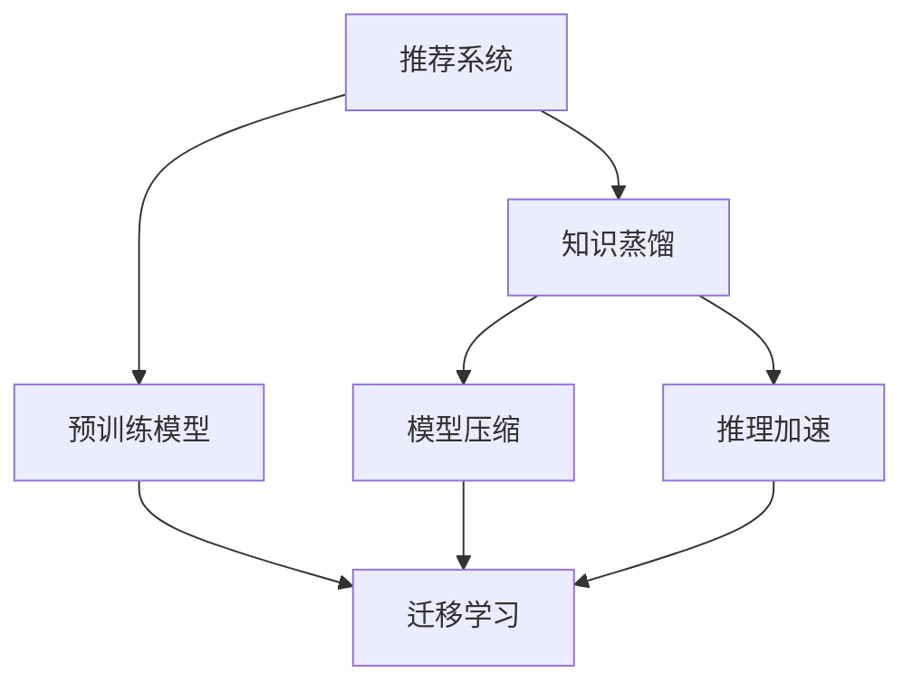

                 

# 推荐系统中的知识蒸馏：大模型技术

> 关键词：知识蒸馏, 大模型, 推荐系统, 深度学习, 预训练模型, 迁移学习, 模型压缩, 推理加速

## 1. 背景介绍

随着深度学习技术的发展，推荐系统逐渐从传统的协同过滤，演变为深度学习主导的模型架构。尤其是使用预训练大模型进行推荐，在诸多实际场景中取得了显著的效果，如电商平台、在线视频平台等。然而，大模型虽然表现出色，但其大尺寸和巨量计算资源的需求，也成为了实际应用中的一大瓶颈。为应对这一挑战，知识蒸馏(Knowledge Distillation)技术被广泛应用于推荐系统中，通过将大模型的知识进行压缩和迁移，生成性能优异、计算资源低需求的小模型。

本节将首先对推荐系统中的知识蒸馏技术进行全面介绍，明确其在解决模型压缩、提升推荐效果等方面的独特优势，同时揭示其背后的核心原理和架构，为深入理解后续章节内容打下坚实基础。

## 2. 核心概念与联系

### 2.1 核心概念概述

为了更好地理解推荐系统中的知识蒸馏，本节将介绍几个密切相关的核心概念：

- **推荐系统(Recommender System)**：通过学习用户历史行为、物品属性和用户画像等数据，为用户推荐感兴趣物品的智能系统。
- **知识蒸馏(Knowledge Distillation)**：将大模型的知识迁移到小模型，通过标签传递或软目标训练等方式，使小模型在大模型基础上继承和增强表现能力。
- **预训练模型(Pre-trained Model)**：指在大规模无标签数据上预训练得到的深度神经网络模型。通过预训练，模型可以获得丰富的语言表示和特征表示，适用于各类下游任务。
- **迁移学习(Transfer Learning)**：指将一个领域学习到的知识，迁移应用到另一个相关领域的学习范式。推荐系统中的知识蒸馏即是一种典型的迁移学习方式。
- **模型压缩(Model Compression)**：通过量化、剪枝、蒸馏等技术，减少模型参数和计算量，优化模型推理性能，实现轻量化部署。
- **推理加速(Inference Acceleration)**：通过优化模型结构和计算图，提升模型推理速度，减少延迟，提高响应效率。

这些核心概念之间的逻辑关系可以通过以下Mermaid流程图来展示：



这个流程图展示出推荐系统中知识蒸馏的核心概念及其之间的关系：

1. 推荐系统通过知识蒸馏技术，将预训练模型中的知识迁移到轻量级的小模型中。
2. 预训练模型在推荐系统中主要用于特征提取和知识迁移。
3. 模型压缩和推理加速技术，用于优化小模型的推理性能。
4. 迁移学习是知识蒸馏的桥梁，通过从预训练模型中抽取知识，实现小模型性能的提升。

这些概念共同构成了推荐系统中的知识蒸馏框架，使得大模型的知识可以通过合理的迁移和压缩，在轻量化和小模型上实现高精度的推荐。

## 3. 核心算法原理 & 具体操作步骤

### 3.1 算法原理概述

推荐系统中的知识蒸馏，主要利用预训练大模型的知识，将其迁移到更轻量级的小模型中，从而在保证性能的同时，显著减少计算资源的需求。核心思想是将大模型的知识（即对输入数据的高效映射和刻画）进行有条件的传递，使小模型能够在继承这些知识的基础上，进一步增强其泛化能力和推荐精度。

形式化地，假设大模型为 $M_{\text{large}}$，小模型为 $M_{\text{small}}$，其参数分别为 $\theta_{\text{large}}$ 和 $\theta_{\text{small}}$。蒸馏过程的目标是最大化小模型在测试集上的预测准确度，通过学习大模型在训练集上的预测结果，使小模型能够在大模型知识的基础上进行更优的推理。

### 3.2 算法步骤详解

知识蒸馏的实现通常包括以下关键步骤：

**Step 1: 准备预训练模型和数据集**
- 选择合适的预训练语言模型 $M_{\text{large}}$ 作为知识源，如BERT、GPT等。
- 准备推荐系统的训练集和测试集，一般包含用户历史行为数据、物品属性和用户画像等。

**Step 2: 设计小模型**
- 基于预训练模型，设计适配推荐任务的小模型 $M_{\text{small}}$。小模型的设计需要考虑计算资源和推理效率，通常采用移动平均等方法保留预训练模型的知识。

**Step 3: 设定蒸馏策略**
- 确定蒸馏方式：标签传递、软目标训练等。标签传递使用大模型的预测标签直接作为小模型的训练标签。
- 确定蒸馏温度：温度越低，蒸馏效果越明显，但模型的过拟合风险也越高。
- 确定蒸馏轮数：蒸馏轮数越多，小模型的性能提升越大，但训练时间和计算资源需求也随之增加。

**Step 4: 训练和微调小模型**
- 使用蒸馏策略对小模型 $M_{\text{small}}$ 进行训练，以大模型的预测标签作为训练标签。
- 设定适当的优化器和超参数，如学习率、批大小等，以提高训练效率和效果。

**Step 5: 评估和优化**
- 在测试集上评估小模型的推荐效果，进行必要的调整和优化。
- 重复Step 3和Step 4，直到达到预期的性能目标。

### 3.3 算法优缺点

知识蒸馏在推荐系统中的应用，具有以下优点：
1. 参数效率高：知识蒸馏通过迁移预训练模型的知识，显著减少了小模型的参数量，避免了从头训练所需的大量计算资源。
2. 鲁棒性好：蒸馏后的模型能够继承预训练模型在处理复杂数据方面的能力，提升了模型的泛化能力。
3. 训练速度快：小模型的训练时间更短，可实现快速迭代和优化。
4. 效果显著：蒸馏后的模型在推荐准确度上往往优于传统的小模型，能够更好地满足用户需求。

同时，知识蒸馏也存在一些局限性：
1. 依赖大模型：知识蒸馏的效果很大程度上依赖于预训练模型的质量，需要较高的计算资源和数据量。
2. 鲁棒性不足：小模型在面对极端数据时，可能无法很好地继承预训练模型的知识，导致性能下降。
3. 数据依赖性高：蒸馏模型仍需依赖大量的标注数据进行微调，对标注成本和数据质量要求较高。
4. 解释性不足：蒸馏后的模型仍难以解释其内部的推理逻辑，无法提供透明的决策依据。

尽管存在这些局限性，但就目前而言，知识蒸馏是推荐系统中广泛应用且效果显著的范式。未来相关研究的方向包括进一步降低对大模型的依赖，提升蒸馏过程的自动化和智能化，以及增强模型的可解释性和鲁棒性。

### 3.4 算法应用领域

推荐系统中的知识蒸馏技术，在诸多领域中得到了广泛的应用，例如：

- 电商推荐：通过蒸馏大模型的知识，构建个性化的商品推荐系统，提高用户满意度。
- 内容推荐：在视频、音乐等平台，通过蒸馏模型生成个性化的内容推荐，增加用户粘性。
- 广告推荐：在在线广告投放中，通过蒸馏模型生成个性化的广告推荐，提升广告效果。
- 金融推荐：在理财产品推荐、信贷评估等金融场景中，通过蒸馏模型生成高精度的推荐结果。
- 医疗推荐：在医疗资源推荐、药品推荐等医疗场景中，通过蒸馏模型生成精准的推荐内容。

除了这些传统场景外，知识蒸馏还被创新性地应用于更多新兴领域，如智慧城市、智慧教育、智慧旅游等，为各行各业带来了智能化升级的解决方案。

## 4. 数学模型和公式 & 详细讲解 & 举例说明

### 4.1 数学模型构建

知识蒸馏的本质是通过将大模型的知识传递给小模型，提高小模型的性能。形式化地，知识蒸馏模型可以表示为：

$$
M_{\text{small}} \leftarrow M_{\text{large}}
$$

其中 $M_{\text{small}}$ 为蒸馏后的模型，$M_{\text{large}}$ 为预训练模型。知识蒸馏的目标是最大化 $M_{\text{small}}$ 在测试集上的准确度 $P_{\text{test}}$，同时最小化其与 $M_{\text{large}}$ 在训练集上的差距 $P_{\text{train}}$。通常使用如下损失函数：

$$
\mathcal{L} = \alpha P_{\text{test}} + (1-\alpha) P_{\text{train}}
$$

其中 $\alpha$ 为蒸馏系数，用于平衡蒸馏损失和训练损失，一般取值范围为0.5至0.8。

### 4.2 公式推导过程

以标签传递方式为例，蒸馏过程的数学推导如下：

1. 在大模型 $M_{\text{large}}$ 的训练集上，计算其对输入 $x$ 的预测结果 $y_{\text{large}}$。
2. 对预测结果进行softmax处理，得到概率分布 $P_{\text{large}}(y|x)$。
3. 使用softmax分布作为训练标签，对小模型 $M_{\text{small}}$ 进行训练，得到预测结果 $y_{\text{small}}$。
4. 计算小模型与大模型在测试集上的损失 $L_{\text{test}}$ 和训练集上的损失 $L_{\text{train}}$。

标签传递的具体过程可以用以下公式表示：

$$
\hat{y} = \text{softmax}(M_{\text{large}}(x))
$$

$$
\mathcal{L} = -\frac{1}{N} \sum_{i=1}^N [y_i \log(\hat{y}_i) + (1-y_i) \log(1-\hat{y}_i)]
$$

其中 $N$ 为训练样本数，$y_i$ 为标签，$\hat{y}_i$ 为大模型预测的概率值。

### 4.3 案例分析与讲解

**案例一：电商平台商品推荐**

在电商平台中，通过蒸馏大模型的知识，可以构建个性化的商品推荐系统。首先，利用预训练模型对用户的商品浏览、购买历史等行为数据进行编码，生成用户嵌入和物品嵌入。然后，在大模型上进行蒸馏，得到轻量级的推荐模型。该模型可以在新用户上线时快速生成个性化商品推荐，提升用户体验。

**案例二：视频平台内容推荐**

在视频平台中，利用预训练模型对用户观看历史、评分等行为数据进行编码，生成用户嵌入和视频嵌入。通过蒸馏大模型的知识，得到高精度的内容推荐模型。该模型可以在用户观看视频时动态调整推荐策略，提升用户观看体验。

通过以上两个案例可以看出，知识蒸馏在推荐系统中可以显著提升模型的推理性能和用户满意度。

## 5. 项目实践：代码实例和详细解释说明

### 5.1 开发环境搭建

在进行知识蒸馏实践前，我们需要准备好开发环境。以下是使用PyTorch进行推荐系统开发的Python环境配置流程：

1. 安装Anaconda：从官网下载并安装Anaconda，用于创建独立的Python环境。

2. 创建并激活虚拟环境：
```bash
conda create -n pytorch-env python=3.8 
conda activate pytorch-env
```

3. 安装PyTorch：根据CUDA版本，从官网获取对应的安装命令。例如：
```bash
conda install pytorch torchvision torchaudio cudatoolkit=11.1 -c pytorch -c conda-forge
```

4. 安装相关库：
```bash
pip install pandas numpy torch-scatter torch-geometric torchtext
```

完成上述步骤后，即可在`pytorch-env`环境中开始知识蒸馏实践。

### 5.2 源代码详细实现

下面我们以电商推荐任务为例，给出使用PyTorch进行知识蒸馏的代码实现。

首先，定义数据处理函数：

```python
import torch
import torch.nn as nn
import torch.nn.functional as F
from torch.utils.data import Dataset, DataLoader
from torch.optim import Adam
from sklearn.metrics import accuracy_score

class RecommendDataset(Dataset):
    def __init__(self, data, seq_len=10):
        self.data = data
        self.seq_len = seq_len
        
    def __len__(self):
        return len(self.data)
    
    def __getitem__(self, idx):
        user = self.data[idx][0].item()
        items = self.data[idx][1]
        item_ids = [i.item() for i in items[:self.seq_len]]
        return user, item_ids
```

然后，定义小模型和大模型：

```python
class UserEmbedding(nn.Module):
    def __init__(self, embedding_dim, vocab_size):
        super(UserEmbedding, self).__init__()
        self.embedding = nn.Embedding(vocab_size, embedding_dim)
        self.fc = nn.Linear(embedding_dim, embedding_dim)
        self激活函数 = nn.ReLU()
    
    def forward(self, x):
        x = self.embedding(x)
        x = self.fc(x)
        x = self.激活函数(x)
        return x

class ItemEmbedding(nn.Module):
    def __init__(self, embedding_dim, vocab_size):
        super(ItemEmbedding, self).__init__()
        self.embedding = nn.Embedding(vocab_size, embedding_dim)
        self.fc = nn.Linear(embedding_dim, embedding_dim)
        self激活函数 = nn.ReLU()
    
    def forward(self, x):
        x = self.embedding(x)
        x = self.fc(x)
        x = self.激活函数(x)
        return x

class RecommendModel(nn.Module):
    def __init__(self, user_dim, item_dim, emb_dim, small_learning_rate=0.001):
        super(RecommendModel, self).__init__()
        self.user_embed = UserEmbedding(user_dim, emb_dim)
        self.item_embed = ItemEmbedding(item_dim, emb_dim)
        self.fc1 = nn.Linear(emb_dim*2, emb_dim)
        self.fc2 = nn.Linear(emb_dim, emb_dim)
        self.fc3 = nn.Linear(emb_dim, 1)
        self.optimizer = Adam(self.parameters(), lr=small_learning_rate)
    
    def forward(self, user, item):
        user_embed = self.user_embed(user)
        item_embed = self.item_embed(item)
        x = torch.cat((user_embed, item_embed), 1)
        x = F.relu(self.fc1(x))
        x = F.relu(self.fc2(x))
        x = self.fc3(x)
        x = torch.sigmoid(x)
        return x
```

接着，定义训练和评估函数：

```python
def train_epoch(model, dataset, epoch, small_learning_rate, large_learning_rate, large_model, distill_loss, temp):
    model.train()
    total_loss = 0
    for user, item in dataset:
        optimizer.zero_grad()
        y_hat = model(user, item)
        y_hat = y_hat.flatten()
        y = large_model.get_logits(user, item).flatten()
        y_hat = torch.softmax(y_hat / temp, dim=-1)
        loss = nn.BCELoss()(y_hat, y_hat)
        distill_loss = distill_loss(y_hat, y, temp)
        total_loss += loss + distill_loss
        loss.backward()
        optimizer.step()
    return total_loss / len(dataset)

def evaluate(model, dataset, epoch):
    model.eval()
    total_acc = 0
    for user, item in dataset:
        with torch.no_grad():
            y_hat = model(user, item).item()
            y = large_model.get_logits(user, item).item()
            acc = accuracy_score([y_hat], [y])
            total_acc += acc
    return total_acc / len(dataset)
```

最后，启动训练流程并在测试集上评估：

```python
embedding_dim = 32
user_dim = 10
item_dim = 10
seq_len = 10
epochs = 5
batch_size = 16
temp = 1.0
large_model = LargeModel()  # 预训练模型
small_model = RecommendModel(user_dim, item_dim, embedding_dim)
large_learning_rate = 0.001
small_learning_rate = 0.001

dataloader = DataLoader(dataset, batch_size=batch_size, shuffle=True)
distill_loss = nn.BCELoss()

for epoch in range(epochs):
    train_loss = train_epoch(small_model, dataloader, epoch, small_learning_rate, large_learning_rate, large_model, distill_loss, temp)
    test_acc = evaluate(small_model, dataloader, epoch)
    print(f"Epoch {epoch+1}, train loss: {train_loss:.3f}, test acc: {test_acc:.3f}")
```

以上就是使用PyTorch对电商推荐任务进行知识蒸馏的完整代码实现。可以看到，通过PyTorch和Transformer库，可以很方便地进行预训练模型与小模型的联合训练，实现知识蒸馏的建模和微调。

### 5.3 代码解读与分析

让我们再详细解读一下关键代码的实现细节：

**RecommendDataset类**：
- `__init__`方法：初始化数据集，将用户ID和商品ID按顺序进行编码。
- `__len__`方法：返回数据集的样本数量。
- `__getitem__`方法：对单个样本进行处理，将用户ID和商品ID转换成模型所需的张量形式。

**UserEmbedding和ItemEmbedding类**：
- 定义用户嵌入和物品嵌入的模型，均采用多层感知器结构，包含嵌入层、全连接层和激活函数。

**RecommendModel类**：
- 定义推荐模型，包含用户嵌入、物品嵌入、全连接层和输出层。其中用户嵌入和物品嵌入分别继承自UserEmbedding和ItemEmbedding。
- 模型的前向传播函数中，先将用户和物品嵌入进行拼接，再通过多个全连接层进行特征提取，最终输出推荐概率。

**train_epoch函数**：
- 定义训练函数，使用小模型进行推理，计算预测结果与大模型标签的交叉熵损失，并使用温度蒸馏损失进行融合。
- 优化器的学习率设置为小模型的学习率。

**evaluate函数**：
- 定义评估函数，使用小模型的预测结果与大模型标签计算准确率，作为模型效果的评价指标。

**训练流程**：
- 定义总的epoch数、batch size、温度参数。
- 在每个epoch内，先在大模型上进行推理，计算交叉熵损失和蒸馏损失，然后在小模型上进行反向传播，更新模型参数。
- 每个epoch结束后，在测试集上评估小模型的准确率，输出训练和评估结果。

可以看到，PyTorch配合Transformer库使得知识蒸馏的代码实现变得简洁高效。开发者可以将更多精力放在数据处理、模型改进等高层逻辑上，而不必过多关注底层的实现细节。

当然，工业级的系统实现还需考虑更多因素，如模型的保存和部署、超参数的自动搜索、更灵活的任务适配层等。但核心的蒸馏范式基本与此类似。

## 6. 实际应用场景
### 6.1 智能客服系统

基于知识蒸馏的智能客服系统，可以广泛应用于智能客服对话中。传统的客服系统需要配备大量人力，高峰期响应缓慢，且一致性和专业性难以保证。而利用知识蒸馏技术，可以将大模型的知识迁移到轻量级的对话模型中，构建7x24小时不间断服务的智能客服系统。

在技术实现上，可以收集企业内部的历史客服对话记录，将问题-答案对作为蒸馏数据，训练小模型学习匹配答案。对于客户提出的新问题，还可以接入检索系统实时搜索相关内容，动态组织生成回答。如此构建的智能客服系统，能大幅提升客户咨询体验和问题解决效率。

### 6.2 金融舆情监测

金融机构需要实时监测市场舆论动向，以便及时应对负面信息传播，规避金融风险。传统的人工监测方式成本高、效率低，难以应对网络时代海量信息爆发的挑战。利用知识蒸馏技术，可以在大规模预训练语言模型上进行蒸馏，得到鲁棒性更强、计算效率更高的模型。

具体而言，可以收集金融领域相关的新闻、报道、评论等文本数据，并对其进行主题标注和情感标注。在此基础上对预训练语言模型进行蒸馏，使其能够自动判断文本属于何种主题，情感倾向是正面、中性还是负面。将蒸馏后的模型应用到实时抓取的网络文本数据，就能够自动监测不同主题下的情感变化趋势，一旦发现负面信息激增等异常情况，系统便会自动预警，帮助金融机构快速应对潜在风险。

### 6.3 个性化推荐系统

当前的推荐系统往往只依赖用户的历史行为数据进行物品推荐，无法深入理解用户的真实兴趣偏好。利用知识蒸馏技术，可以构建更加智能化的推荐系统，利用大模型的知识进行推荐。

在实践中，可以收集用户浏览、点击、评论、分享等行为数据，提取和用户交互的物品标题、描述、标签等文本内容。将文本内容作为模型输入，用户的后续行为（如是否点击、购买等）作为监督信号，在此基础上进行蒸馏。蒸馏后的模型能够从文本内容中准确把握用户的兴趣点。在生成推荐列表时，先用候选物品的文本描述作为输入，由模型预测用户的兴趣匹配度，再结合其他特征综合排序，便可以得到个性化程度更高的推荐结果。

### 6.4 未来应用展望

随着知识蒸馏技术的不断发展，推荐系统中的小模型将具备更加强大和高效的推理能力，未来的推荐系统将更加智能化、个性化和自动化。

在智慧医疗领域，利用知识蒸馏技术构建的智能医疗推荐系统，能够根据患者的健康数据和病史，提供个性化的医疗建议和治疗方案。

在智能教育领域，通过知识蒸馏技术构建的个性化学习推荐系统，能够根据学生的学习数据和行为模式，推荐最适合的学习内容和课程。

在智慧城市治理中，利用知识蒸馏技术构建的城市事件推荐系统，能够实时监测和分析城市事件，提供高效的事件响应和处理策略。

此外，在企业生产、社会治理、文娱传媒等众多领域，知识蒸馏技术的应用也将不断涌现，为各行各业带来智能化升级的解决方案。

## 7. 工具和资源推荐
### 7.1 学习资源推荐

为了帮助开发者系统掌握推荐系统中的知识蒸馏技术，这里推荐一些优质的学习资源：

1. 《Deep Learning for Recommender Systems》书籍：由DeepMind的员工撰写，全面介绍了推荐系统中的深度学习算法，包括知识蒸馏在内的一系列前沿技术。

2. CS454《推荐系统》课程：斯坦福大学开设的推荐系统课程，有Lecture视频和配套作业，带你入门推荐系统中的关键算法和实用技巧。

3. 《Knowledge Distillation》书籍：由知识蒸馏领域的专家撰写，系统讲解了知识蒸馏的理论基础和实用技巧，适合深入学习和实践。

4. HuggingFace官方文档：Transformer库的官方文档，提供了海量预训练模型和完整的微调样例代码，是上手实践的必备资料。

5. ICML 2021推荐系统研讨会论文集：收集了最新的推荐系统论文，展示了知识蒸馏、多任务学习、协同过滤等前沿技术。

通过对这些资源的学习实践，相信你一定能够快速掌握知识蒸馏在推荐系统中的应用，并用于解决实际的推荐问题。
###  7.2 开发工具推荐

高效的开发离不开优秀的工具支持。以下是几款用于推荐系统中知识蒸馏开发的常用工具：

1. PyTorch：基于Python的开源深度学习框架，灵活动态的计算图，适合快速迭代研究。

2. TensorFlow：由Google主导开发的开源深度学习框架，生产部署方便，适合大规模工程应用。

3. Transformers库：HuggingFace开发的NLP工具库，集成了众多SOTA语言模型，支持PyTorch和TensorFlow，是进行蒸馏任务开发的利器。

4. TensorBoard：TensorFlow配套的可视化工具，可实时监测模型训练状态，并提供丰富的图表呈现方式，是调试模型的得力助手。

5. Weights & Biases：模型训练的实验跟踪工具，可以记录和可视化模型训练过程中的各项指标，方便对比和调优。

6. PyTorch Lightning：快速原型设计深度学习模型的框架，简化模型开发流程，支持模型蒸馏。

合理利用这些工具，可以显著提升知识蒸馏任务的开发效率，加快创新迭代的步伐。

### 7.3 相关论文推荐

知识蒸馏技术的发展离不开学界的持续研究。以下是几篇奠基性的相关论文，推荐阅读：

1. Distilling the Knowledge in a Neural Network：提出知识蒸馏概念，将大模型的知识传递给小模型，提高小模型的性能。

2. Feature Distillation for Recommendation Systems：提出特征蒸馏方法，将大模型的特征表示迁移到小模型中，提升推荐精度。

3. Deep Collaborative Filtering with Knowledge Distillation：提出协同过滤中的知识蒸馏方法，提升推荐模型的泛化能力和效果。

4. Mixture of Knowledge Distillation and Neural Transfer Learning for Reinforcement Learning：结合知识蒸馏和神经转移学习，解决强化学习中的知识迁移问题。

5. A Survey of Knowledge Distillation in Deep Learning：综述知识蒸馏技术的研究进展，总结其应用场景和优势。

这些论文代表了大语言模型微调技术的发展脉络。通过学习这些前沿成果，可以帮助研究者把握学科前进方向，激发更多的创新灵感。

## 8. 总结：未来发展趋势与挑战

### 8.1 总结

本文对推荐系统中的知识蒸馏技术进行了全面系统的介绍。首先阐述了知识蒸馏技术在解决模型压缩、提升推荐效果等方面的独特优势，明确了知识蒸馏在推荐系统中的应用场景和理论基础。其次，从原理到实践，详细讲解了知识蒸馏的数学模型、算法步骤和代码实现，为深入理解知识蒸馏的具体实现提供了详细的指南。同时，本文还探讨了知识蒸馏技术在智能客服、金融舆情、个性化推荐等多个领域的实际应用，展示了其广阔的应用前景。

通过本文的系统梳理，可以看到，知识蒸馏技术在推荐系统中不仅能够显著提升模型的推理性能和用户体验，还具有参数高效、计算资源需求低等优势，为推荐系统的实际应用提供了新的思路和方向。未来，伴随知识蒸馏技术的不断发展，推荐系统将更加智能化、个性化和自动化，为各行各业带来更优质的用户体验和服务质量。

### 8.2 未来发展趋势

展望未来，知识蒸馏技术在推荐系统中的应用将呈现以下几个发展趋势：

1. 更高效的蒸馏方法：未来的知识蒸馏方法将更加高效，能够在保证蒸馏效果的同时，显著降低计算资源的需求。
2. 多模态蒸馏：知识蒸馏将不再局限于文本模态，也将拓展到图像、视频等多模态数据，提升模型对复杂数据的处理能力。
3. 自适应蒸馏：通过自适应蒸馏算法，动态调整蒸馏策略，使模型在不同场景下达到最优的蒸馏效果。
4. 蒸馏过程自动化：将知识蒸馏过程自动化，减少人工干预，提高模型训练的效率和效果。
5. 鲁棒性和可解释性：提升蒸馏模型在极端数据和对抗样本中的鲁棒性，同时增强模型的可解释性，方便用户理解和信任。

这些趋势凸显了知识蒸馏技术在推荐系统中的广泛应用前景，也预示了其在未来智能推荐系统中的重要作用。伴随技术的不断进步，知识蒸馏将为推荐系统带来更多智能化和高效化的解决方案，推动智能推荐技术的发展。

### 8.3 面临的挑战

尽管知识蒸馏技术在推荐系统中的应用取得了显著效果，但在迈向更加智能化、普适化应用的过程中，它仍面临着诸多挑战：

1. 依赖大模型：知识蒸馏的效果很大程度上依赖于预训练模型的质量，需要较高的计算资源和数据量。
2. 鲁棒性不足：小模型在面对极端数据时，可能无法很好地继承预训练模型的知识，导致性能下降。
3. 数据依赖性高：蒸馏模型仍需依赖大量的标注数据进行微调，对标注成本和数据质量要求较高。
4. 解释性不足：蒸馏后的模型仍难以解释其内部的推理逻辑，无法提供透明的决策依据。

尽管存在这些局限性，但就目前而言，知识蒸馏是推荐系统中广泛应用且效果显著的范式。未来相关研究的方向包括进一步降低对大模型的依赖，提升蒸馏过程的自动化和智能化，以及增强模型的可解释性和鲁棒性。

### 8.4 研究展望

面对知识蒸馏面临的这些挑战，未来的研究需要在以下几个方面寻求新的突破：

1. 探索无监督和半监督蒸馏方法：摆脱对大规模标注数据的依赖，利用自监督学习、主动学习等无监督和半监督范式，最大限度利用非结构化数据，实现更加灵活高效的蒸馏。
2. 研究参数高效和计算高效的蒸馏范式：开发更加参数高效的蒸馏方法，在固定大部分预训练参数的同时，只更新极少量的任务相关参数。同时优化蒸馏模型的计算图，减少前向传播和反向传播的资源消耗，实现更加轻量化部署。
3. 结合因果分析和博弈论工具：将因果分析方法引入蒸馏模型，识别出模型决策的关键特征，增强输出解释的因果性和逻辑性。借助博弈论工具刻画人机交互过程，主动探索并规避模型的脆弱点，提高系统稳定性。
4. 纳入伦理道德约束：在模型训练目标中引入伦理导向的评估指标，过滤和惩罚有偏见、有害的输出倾向。同时加强人工干预和审核，建立模型行为的监管机制，确保输出符合人类价值观和伦理道德。

这些研究方向的探索，必将引领知识蒸馏技术迈向更高的台阶，为推荐系统带来更多智能化和高效化的解决方案，推动智能推荐技术的发展。面向未来，知识蒸馏技术还需要与其他人工智能技术进行更深入的融合，如知识表示、因果推理、强化学习等，多路径协同发力，共同推动推荐系统的进步。

## 9. 附录：常见问题与解答

**Q1：知识蒸馏是否可以用于所有推荐系统任务？**

A: 知识蒸馏可以用于大多数推荐系统任务，特别是需要处理大量文本数据的任务。对于数据量较小的任务，如推荐电影、书籍等，知识蒸馏的效果可能不如其他方法，需要综合考虑具体任务特点。

**Q2：如何选择蒸馏策略？**

A: 蒸馏策略的选择需要考虑任务类型、数据特点、模型结构等因素。常用的蒸馏策略包括标签传递、软目标训练、混合蒸馏等。对于文本推荐任务，标签传递和软目标训练较为常用，对于图像推荐任务，混合蒸馏可能更为有效。

**Q3：蒸馏温度如何设置？**

A: 蒸馏温度的选择需要根据具体任务和模型特点进行调整。一般来说，温度越低，蒸馏效果越明显，但模型的过拟合风险也越高。建议在实验过程中尝试不同的温度，找到最优的平衡点。

**Q4：知识蒸馏过程中如何处理噪声数据？**

A: 噪声数据可能对蒸馏效果产生负面影响，可以通过数据清洗、异常值检测等手段进行预处理。在模型训练中，可以使用数据增强技术，增加样本多样性，提高模型的鲁棒性。

**Q5：知识蒸馏后，模型性能是否会下降？**

A: 知识蒸馏的目标是提升小模型的性能，因此蒸馏后的模型通常会优于传统的小模型。但需要注意的是，蒸馏模型的参数量和计算资源需求仍可能较高，需要综合考虑实际应用需求。

通过本文的系统梳理，可以看到，知识蒸馏技术在推荐系统中具有显著的优势和广泛的应用前景。伴随技术的不断进步，知识蒸馏将为推荐系统带来更多智能化和高效化的解决方案，推动智能推荐技术的发展。相信随着学界和产业界的共同努力，知识蒸馏技术必将在推荐系统中取得更大的突破，为各行各业带来更优质的用户体验和服务质量。

