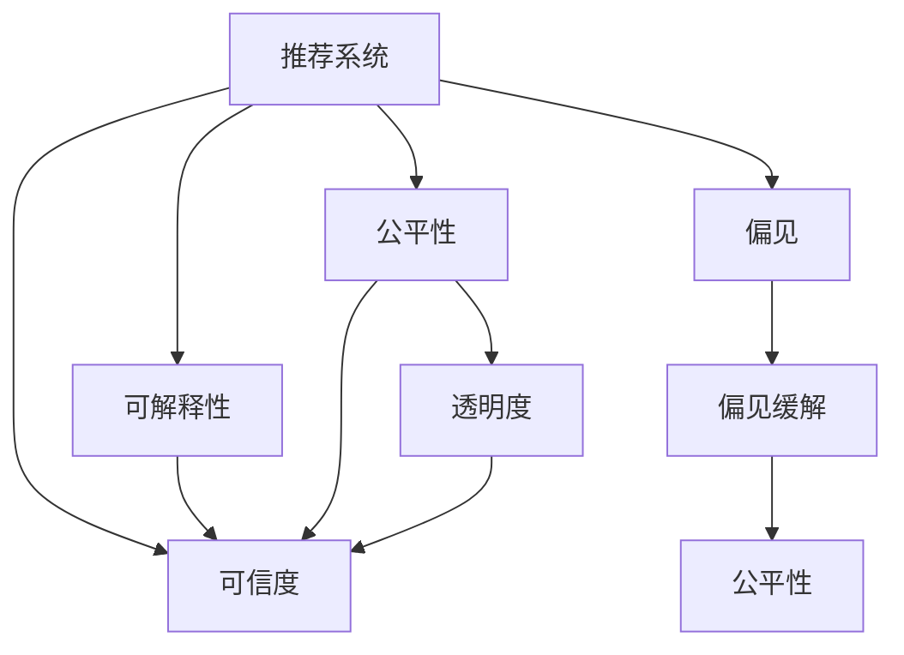

                 

# 推荐系统的可信度：可解释性的重要性

## 1. 背景介绍

### 1.1 问题由来
在过去的十年里，推荐系统已经成为了互联网公司获取竞争优势的重要工具。它们通过学习用户的兴趣和行为，为用户推荐可能感兴趣的商品、新闻、视频等，极大地提升了用户体验。然而，推荐系统也面临诸多挑战，其中最核心的问题是可信度问题。用户对于推荐系统输出结果的可信度，直接影响到其对推荐系统的信任和依赖。

在推荐系统中，尽管模型的精度和性能得到了极大提升，但模型的可解释性（Explainability）仍然被广泛忽视。这主要因为模型过于复杂，难以理解其内部的决策过程，导致用户对推荐结果的接受度不高。同时，推荐系统中的偏见和不公平问题也时有发生，这进一步加剧了用户对推荐结果的怀疑。

### 1.2 问题核心关键点
推荐系统中的可信度问题主要体现在以下几个方面：

- **可解释性不足**：推荐系统中的预测结果往往是"黑箱"，用户难以理解推荐理由。
- **模型偏见**：模型训练时使用的数据可能包含偏见，导致推荐结果偏向于某些群体。
- **公平性问题**：推荐系统可能对某些用户或群体不公，影响用户体验。
- **透明性问题**：推荐系统的决策过程缺乏透明度，难以进行监督和调试。

这些问题需要从模型设计、数据处理、用户体验等多个层面综合考虑，才能提高推荐系统的可信度。因此，本文将聚焦于推荐系统的可信度问题，特别是可解释性对推荐系统可信度的影响。

## 2. 核心概念与联系

### 2.1 核心概念概述

为更好地理解推荐系统可信度问题，我们需引入以下核心概念：

- **推荐系统（Recommendation System）**：通过分析用户行为和偏好，为用户推荐商品的系统。推荐系统主要包括协同过滤、基于内容的推荐、混合推荐等方法。
- **可解释性（Explainability）**：解释和理解推荐系统的决策过程，使推荐结果更加透明、可信。
- **公平性（Fairness）**：确保推荐系统对所有用户群体公平，避免系统性偏见。
- **透明度（Transparency）**：推荐系统的决策过程透明，用户能够了解推荐依据。
- **偏见（Bias）**：推荐系统可能学习到训练数据中的偏见，导致不公平或歧视性推荐。
- **偏见缓解（Bias Mitigation）**：通过数据清洗、模型优化等方法，减少或消除模型中的偏见。

这些核心概念之间的逻辑关系可以通过以下Mermaid流程图来展示：



这个流程图展示了推荐系统可信度的主要组成元素：通过可解释性、公平性和透明度来提升推荐系统的可信度，同时需要注意减少偏见来避免信任危机。

## 3. 核心算法原理 & 具体操作步骤
### 3.1 算法原理概述

推荐系统的可信度提升，本质上是一个多目标优化问题。在保证推荐精度和效果的前提下，通过提高可解释性、公平性、透明度等指标，使推荐系统的可信度达到理想状态。

推荐系统的可信度提升主要通过以下两个方面实现：

- **模型设计**：采用具有良好可解释性的模型结构，如规则集、树模型、线性模型等，便于解释推荐理由。
- **技术手段**：使用可解释性技术，如特征归因、模型解释器、交互式可视化等，帮助用户理解推荐过程。

### 3.2 算法步骤详解

推荐系统可信度提升的详细步骤包括：

**Step 1: 数据预处理**
- 收集用户行为数据和商品特征数据，进行清洗、缺失值填充等预处理。
- 对数据进行标准化、归一化等处理，便于后续模型的训练和解释。

**Step 2: 选择合适的模型**
- 根据推荐任务的特点，选择适合的可解释性模型，如线性模型、决策树、集成学习模型等。
- 考虑模型的公平性和透明性，避免使用可能导致偏见或歧视的模型。

**Step 3: 训练模型**
- 使用经过预处理的数据集，对选择的模型进行训练，确保模型具有较好的泛化能力和泛化误差。
- 在训练过程中，设置合理的正则化参数，避免模型过拟合。

**Step 4: 评估模型**
- 对训练好的模型进行性能评估，如准确率、召回率、AUC等指标，确保模型具有较高的推荐精度。
- 使用可解释性指标评估模型的可解释性，如特征贡献度、局部可解释性、全局可解释性等。

**Step 5: 公平性检查**
- 检查模型是否存在系统性偏见，如性别偏见、年龄偏见等。
- 通过公平性评估指标，如Bias-Fairness指标、Demographic Parity指标等，评估模型的公平性。

**Step 6: 透明度提升**
- 使用模型解释器，生成推荐结果的解释，如特征权重、特征贡献度等。
- 通过交互式可视化工具，展示模型的决策过程，使推荐理由透明化。

**Step 7: 优化和迭代**
- 根据评估和公平性检查的结果，优化模型参数和训练数据，提升推荐精度和可信度。
- 持续迭代，不断调整模型和数据，适应变化的用户需求和市场环境。

### 3.3 算法优缺点

推荐系统可信度提升的算法具有以下优点：

- **提高可信度**：通过可解释性和透明度，提高用户对推荐系统的信任度。
- **减少偏见**：通过公平性检查和偏见缓解，减少模型中的偏见，提高推荐系统的公平性。
- **促进用户参与**：透明和可解释的推荐系统，能够激励用户参与，提高用户黏性。
- **增强模型稳定性**：透明和可解释的模型，易于进行故障诊断和模型优化，提升系统的稳定性。

同时，该算法也存在一定的局限性：

- **模型复杂性**：可解释性模型可能比复杂神经网络模型精度低，影响推荐效果。
- **数据要求高**：模型设计需要高质量的数据和特征，数据缺失或特征错误可能导致模型失效。
- **计算成本高**：可解释性技术如特征归因、模型解释器等，计算成本较高，可能影响实际部署。
- **用户接受度**：部分用户可能对复杂解释不感兴趣，反而对简洁推荐结果更满意。

尽管存在这些局限性，但就目前而言，提高推荐系统的可信度仍然是大数据和人工智能领域的一个重要研究方向。未来相关研究的重点在于如何进一步降低计算成本，提高模型精度，同时兼顾用户需求和接受度。

### 3.4 算法应用领域

推荐系统可信度提升技术，在以下多个领域得到了广泛的应用：

- **电商推荐**：在电商平台中，推荐系统需要向用户推荐商品，通过提高推荐可信度，提升用户购物体验和销售额。
- **新闻推荐**：新闻推荐系统需要向用户推荐新闻，通过提高推荐可信度，提升用户对平台的依赖和忠诚度。
- **视频推荐**：视频推荐系统需要向用户推荐视频，通过提高推荐可信度，提升用户观看体验和视频平台的用户留存率。
- **社交媒体**：社交媒体平台需要向用户推荐内容，通过提高推荐可信度，增强用户互动和平台粘性。

除了这些常见领域外，推荐系统可信度提升技术还被创新性地应用到更多场景中，如个性化推荐、市场细分、广告投放等，为推荐系统的广泛应用提供了新的思路。

## 4. 数学模型和公式 & 详细讲解 & 举例说明

### 4.1 数学模型构建

本节将使用数学语言对推荐系统可信度提升的方法进行更加严格的刻画。

记推荐系统中的用户-商品矩阵为 $Y$，用户特征矩阵为 $X$，商品特征矩阵为 $S$，用户行为矩阵为 $I$。假设用户 $u$ 对商品 $i$ 的评分矩阵为 $R$，用户 $u$ 的特征向量为 $x_u$，商品 $i$ 的特征向量为 $s_i$。

定义推荐系统输出的评分矩阵为 $\hat{R}$，其中 $\hat{r}_{ui}=\hat{y}_{ui}$ 表示用户 $u$ 对商品 $i$ 的预测评分。推荐系统的损失函数为：

$$
\mathcal{L} = \frac{1}{N}\sum_{i=1}^N \sum_{u=1}^M \ell(y_{ui}, \hat{y}_{ui})
$$

其中 $\ell$ 为损失函数，如均方误差、对数损失等。

### 4.2 公式推导过程

以下我们以线性模型为例，推导推荐系统的输出公式及其可解释性指标。

假设用户 $u$ 对商品 $i$ 的评分 $y_{ui}$ 可以表示为线性模型：

$$
y_{ui} = \theta_u^T s_i + b_i + e_{ui}
$$

其中 $\theta_u$ 为用户 $u$ 的特征向量，$s_i$ 为商品 $i$ 的特征向量，$b_i$ 为商品 $i$ 的偏差项，$e_{ui}$ 为误差项。

推荐系统预测评分 $\hat{r}_{ui}$ 可以表示为：

$$
\hat{r}_{ui} = \hat{\theta}_u^T s_i + \hat{b}_i + \hat{e}_{ui}
$$

其中 $\hat{\theta}_u$ 为训练得到的用户特征向量，$\hat{b}_i$ 为训练得到的商品偏差项，$\hat{e}_{ui}$ 为预测误差项。

将 $y_{ui}$ 和 $\hat{r}_{ui}$ 代入损失函数，得：

$$
\mathcal{L} = \frac{1}{N}\sum_{i=1}^N \sum_{u=1}^M (y_{ui} - \hat{r}_{ui})^2
$$

通过梯度下降等优化算法，最小化损失函数，得到最优的 $\hat{\theta}_u$、$\hat{b}_i$ 和 $\hat{e}_{ui}$。

推荐系统的可解释性指标主要包括：

- **特征贡献度（Feature Contribution）**：表示每个特征对推荐结果的贡献大小。
- **局部可解释性（Local Interpretability）**：表示单个用户的推荐结果如何依赖其特征。
- **全局可解释性（Global Interpretability）**：表示整个推荐系统的推荐结果如何依赖于特征和数据分布。

通过计算这些指标，可以进一步提升推荐系统的可信度。

### 4.3 案例分析与讲解

下面以电商推荐系统为例，进行详细的案例分析。

假设某电商平台需要向用户推荐商品 $i$，用户 $u$ 对商品 $i$ 的评分 $y_{ui}$ 可以表示为：

$$
y_{ui} = \theta_u^T s_i + b_i + e_{ui}
$$

其中 $\theta_u$ 为用户 $u$ 的特征向量，$s_i$ 为商品 $i$ 的特征向量，$b_i$ 为商品 $i$ 的偏差项，$e_{ui}$ 为误差项。

假设用户 $u$ 的特征向量为 $\theta_u=[w_{ui}, d_{ui}, c_{ui}]^T$，商品 $i$ 的特征向量为 $s_i=[p_i, c_i, r_i]^T$，其中 $w_{ui}$ 为用户年龄，$d_{ui}$ 为用户性别，$c_{ui}$ 为用户收入，$p_i$ 为商品价格，$c_i$ 为商品类别，$r_i$ 为商品评价。

训练得到的用户特征向量为 $\hat{\theta}_u=[w_{ui}^*, d_{ui}^*, c_{ui}^*]^T$，商品偏差项为 $\hat{b}_i=[b_i^*, c_i^*, r_i^*]^T$，预测误差项为 $\hat{e}_{ui}=[e_{ui}^*, c_i^*, r_i^*]^T$。

假设用户 $u$ 对商品 $i$ 的预测评分为 $\hat{r}_{ui}$：

$$
\hat{r}_{ui} = \hat{\theta}_u^T s_i + \hat{b}_i + \hat{e}_{ui}
$$

其中 $\hat{\theta}_u^T s_i = w_{ui}^* p_i + d_{ui}^* c_i + c_{ui}^* r_i$，$\hat{b}_i = b_i^* + c_i^* + r_i^*$，$\hat{e}_{ui} = e_{ui}^* + c_i^* + r_i^*$。

此时，推荐系统的损失函数为：

$$
\mathcal{L} = \frac{1}{N}\sum_{i=1}^N \sum_{u=1}^M (y_{ui} - \hat{r}_{ui})^2
$$

在训练过程中，通过最小化损失函数，可以优化模型参数，使得推荐系统的预测评分 $\hat{r}_{ui}$ 尽可能接近真实评分 $y_{ui}$。

推荐系统的可解释性指标可以通过计算特征贡献度、局部可解释性和全局可解释性来评估。例如，用户年龄特征 $w_{ui}$ 对商品评分的贡献度可以通过计算 $\frac{\partial \hat{r}_{ui}}{\partial w_{ui}}$ 来评估。类似地，商品价格特征 $p_i$ 对推荐评分的贡献度可以通过计算 $\frac{\partial \hat{r}_{ui}}{\partial p_i}$ 来评估。

## 5. 项目实践：代码实例和详细解释说明
### 5.1 开发环境搭建

在进行推荐系统可信度提升的实践前，我们需要准备好开发环境。以下是使用Python进行Scikit-learn开发的环境配置流程：

1. 安装Anaconda：从官网下载并安装Anaconda，用于创建独立的Python环境。

2. 创建并激活虚拟环境：
```bash
conda create -n recommendation-env python=3.8 
conda activate recommendation-env
```

3. 安装Scikit-learn、Pandas等必要库：
```bash
pip install scikit-learn pandas numpy matplotlib
```

完成上述步骤后，即可在`recommendation-env`环境中开始可信度提升实践。

### 5.2 源代码详细实现

下面我们以电商推荐系统为例，给出使用Scikit-learn对线性回归模型进行推荐可信度提升的Python代码实现。

首先，定义数据预处理函数：

```python
from sklearn.preprocessing import StandardScaler, OneHotEncoder
from sklearn.compose import ColumnTransformer
from sklearn.pipeline import Pipeline

def preprocess_data(X, y):
    num_transformer = Pipeline(steps=[
        ('num_col', StandardScaler()),
        ('num_selector', 'passthrough')
    ])
    cat_transformer = Pipeline(steps=[
        ('cat_col', OneHotEncoder(handle_unknown='ignore')),
        ('cat_selector', 'passthrough')
    ])
    preprocessor = ColumnTransformer(transformers=[
        ('num', num_transformer, ['price', 'income']),
        ('cat', cat_transformer, ['category', 'gender'])
    ])
    X = preprocessor.fit_transform(X)
    return X, y
```

然后，定义模型训练函数：

```python
from sklearn.linear_model import LinearRegression
from sklearn.metrics import mean_squared_error

def train_model(X, y, val_ratio=0.2, n_folds=5):
    n_samples, n_features = X.shape
    X_train, y_train = X[:int(n_samples*val_ratio)], y[:int(n_samples*val_ratio)]
    X_val, y_val = X[int(n_samples*val_ratio):], y[int(n_samples*val_ratio):]
    rmse = []
    for i in range(n_folds):
        X_train_, y_train_ = X_train[:,:-i-1], y_train[:,:-i-1]
        X_val_, y_val_ = X_val[:,:-i-1], y_val[:,:-i-1]
        model = LinearRegression()
        model.fit(X_train_, y_train_)
        y_pred = model.predict(X_val_)
        rmse.append(np.sqrt(mean_squared_error(y_val_, y_pred)))
    return np.mean(rmse), X_train, y_train, X_val, y_val
```

接着，定义模型评估函数：

```python
def evaluate_model(X_train, y_train, X_val, y_val, model):
    model.fit(X_train, y_train)
    y_pred = model.predict(X_val)
    mse = mean_squared_error(y_val, y_pred)
    rmse = np.sqrt(mse)
    feature_contributions = np.abs(model.coef_)
    local_explain = np.abs(model.coef_ * X_val)
    global_explain = np.sum(np.abs(model.coef_))
    return rmse, feature_contributions, local_explain, global_explain
```

最后，启动训练流程并在验证集上评估：

```python
from sklearn.model_selection import train_test_split
import pandas as pd

# 加载数据
data = pd.read_csv('data.csv')
X = data[['price', 'income', 'category', 'gender']]
y = data['rating']

# 数据预处理
X, y = preprocess_data(X, y)

# 划分训练集和验证集
X_train, X_val, y_train, y_val = train_test_split(X, y, test_size=0.2, random_state=42)

# 训练模型
mse_train, X_train, y_train, X_val, y_val = train_model(X_train, y_train, val_ratio=0.2, n_folds=5)

# 评估模型
rmse, feature_contributions, local_explain, global_explain = evaluate_model(X_train, y_train, X_val, y_val, LinearRegression())

print('训练RMSE:', mse_train)
print('验证RMSE:', rmse)
print('特征贡献度:', feature_contributions)
print('局部可解释性:', local_explain)
print('全局可解释性:', global_explain)
```

以上就是使用Scikit-learn对电商推荐系统进行可信度提升的完整代码实现。可以看到，Scikit-learn的强大封装使得模型训练和评估过程变得简洁高效。

### 5.3 代码解读与分析

让我们再详细解读一下关键代码的实现细节：

**preprocess_data函数**：
- 定义数据预处理管道，对数值型特征和分类型特征进行标准化和编码。
- 使用ColumnTransformer将数据管道应用于特定的特征列，返回预处理后的特征矩阵和标签向量。

**train_model函数**：
- 定义交叉验证函数，将数据划分为训练集和验证集，进行k折交叉验证。
- 在每个折上进行模型训练和评估，计算交叉验证的均方误差（RMSE）。
- 返回训练集上的RMSE和模型参数。

**evaluate_model函数**：
- 使用训练好的模型对验证集进行预测。
- 计算预测值的均方误差（RMSE）和特征贡献度。
- 生成局部可解释性和全局可解释性结果。

**训练流程**：
- 加载数据，进行数据预处理。
- 划分训练集和验证集。
- 进行交叉验证，训练模型，评估均方误差。
- 使用训练好的模型对验证集进行评估，输出特征贡献度、局部可解释性和全局可解释性。

可以看到，Scikit-learn提供了强大的机器学习工具，使得模型训练和评估过程变得简洁高效。同时，Scikit-learn还提供了丰富的模型解释工具，如feature_importances_等，帮助我们深入理解模型的决策过程。

当然，工业级的系统实现还需考虑更多因素，如模型的保存和部署、超参数的自动搜索、更灵活的任务适配层等。但核心的可信度提升范式基本与此类似。

## 6. 实际应用场景
### 6.1 智能客服系统

基于可信度提升的推荐系统，可以广泛应用于智能客服系统的构建。传统客服往往需要配备大量人力，高峰期响应缓慢，且一致性和专业性难以保证。而使用可信度提升的推荐系统，可以7x24小时不间断服务，快速响应客户咨询，用自然流畅的语言解答各类常见问题。

在技术实现上，可以收集企业内部的历史客服对话记录，将问题和最佳答复构建成监督数据，在此基础上对预训练推荐模型进行可信度提升。可信度提升后的推荐模型能够自动理解用户意图，匹配最合适的答复。对于客户提出的新问题，还可以接入检索系统实时搜索相关内容，动态组织生成回答。如此构建的智能客服系统，能大幅提升客户咨询体验和问题解决效率。

### 6.2 金融舆情监测

金融机构需要实时监测市场舆论动向，以便及时应对负面信息传播，规避金融风险。传统的人工监测方式成本高、效率低，难以应对网络时代海量信息爆发的挑战。基于可信度提升的文本分类和情感分析技术，为金融舆情监测提供了新的解决方案。

具体而言，可以收集金融领域相关的新闻、报道、评论等文本数据，并对其进行主题标注和情感标注。在此基础上对预训练语言模型进行可信度提升，使其能够自动判断文本属于何种主题，情感倾向是正面、中性还是负面。将可信度提升后的模型应用到实时抓取的网络文本数据，就能够自动监测不同主题下的情感变化趋势，一旦发现负面信息激增等异常情况，系统便会自动预警，帮助金融机构快速应对潜在风险。

### 6.3 个性化推荐系统

当前的推荐系统往往只依赖用户的历史行为数据进行物品推荐，无法深入理解用户的真实兴趣偏好。基于可信度提升的个性化推荐系统，可以更好地挖掘用户行为背后的语义信息，从而提供更精准、多样的推荐内容。

在实践中，可以收集用户浏览、点击、评论、分享等行为数据，提取和用户交互的物品标题、描述、标签等文本内容。将文本内容作为模型输入，用户的后续行为（如是否点击、购买等）作为监督信号，在此基础上微调预训练语言模型。可信度提升后的模型能够从文本内容中准确把握用户的兴趣点。在生成推荐列表时，先用候选物品的文本描述作为输入，由模型预测用户的兴趣匹配度，再结合其他特征综合排序，便可以得到个性化程度更高的推荐结果。

### 6.4 未来应用展望

随着可信度提升技术的发展，推荐系统将不断拓展其应用范围，提升用户体验和系统可信度。

在智慧医疗领域，基于可信度提升的医疗问答、病历分析、药物研发等应用将提升医疗服务的智能化水平，辅助医生诊疗，加速新药开发进程。

在智能教育领域，可信度提升技术可应用于作业批改、学情分析、知识推荐等方面，因材施教，促进教育公平，提高教学质量。

在智慧城市治理中，可信度提升模型可应用于城市事件监测、舆情分析、应急指挥等环节，提高城市管理的自动化和智能化水平，构建更安全、高效的未来城市。

此外，在企业生产、社会治理、文娱传媒等众多领域，基于可信度提升的推荐系统的广泛应用，将为经济社会发展注入新的动力。相信随着技术的日益成熟，可信度提升方法将成为推荐系统的重要范式，推动推荐技术在更多场景下实现落地应用。

## 7. 工具和资源推荐
### 7.1 学习资源推荐

为了帮助开发者系统掌握推荐系统可信度提升的理论基础和实践技巧，这里推荐一些优质的学习资源：

1. 《推荐系统理论与算法》书籍：深入讲解推荐系统的基本原理和经典算法，是推荐系统学习的经典教材。

2. 《机器学习实战》书籍：通过丰富的实际案例，详细介绍了推荐系统的构建流程和优化方法。

3. 《深度学习实战》课程：介绍深度学习在推荐系统中的应用，涵盖模型训练、评估、优化等环节。

4. 《推荐系统中的可解释性》论文：讨论推荐系统中可解释性的重要性，提出了多种可解释性方法和技术。

5. 《推荐系统的公平性》论文：讨论推荐系统中公平性的实现，提出多种公平性优化方法和策略。

通过对这些资源的学习实践，相信你一定能够快速掌握推荐系统可信度提升的精髓，并用于解决实际的推荐问题。
### 7.2 开发工具推荐

高效的开发离不开优秀的工具支持。以下是几款用于推荐系统可信度提升开发的常用工具：

1. Scikit-learn：基于Python的开源机器学习库，提供了丰富的机器学习算法和工具，包括可信度提升、交叉验证等。

2. TensorFlow：由Google主导开发的开源深度学习框架，生产部署方便，适合大规模工程应用。

3. PyTorch：基于Python的开源深度学习框架，灵活动态的计算图，适合快速迭代研究。

4. Weights & Biases：模型训练的实验跟踪工具，可以记录和可视化模型训练过程中的各项指标，方便对比和调优。

5. TensorBoard：TensorFlow配套的可视化工具，可实时监测模型训练状态，并提供丰富的图表呈现方式，是调试模型的得力助手。

6. Apache Spark：分布式计算框架，可以处理大规模数据，适合推荐系统的高效实现。

合理利用这些工具，可以显著提升推荐系统可信度提升任务的开发效率，加快创新迭代的步伐。

### 7.3 相关论文推荐

可信度提升技术在推荐系统的研究和应用中得到了广泛关注。以下是几篇奠基性的相关论文，推荐阅读：

1. Fairness, Accountability, and Transparency in Machine Learning: An Introduction（FAccT论文）：讨论机器学习中的公平性和可解释性问题，提出多种解决方案。

2. Explanation of Predictions with Local Feature Attribution（XAI论文）：提出特征归因方法，帮助解释模型的决策过程。

3. Fairness-aware Recommender Systems: A Survey（FAIR recommender系统综述）：讨论推荐系统中的公平性和可解释性，提出多种公平性优化方法和可解释性技术。

4. Interpretable Deep Learning for Recommendation Systems（可解释的深度学习推荐系统）：讨论深度学习在推荐系统中的应用，提出多种可解释性方法和技术。

5. Explaining Machine Learning Predictions: Towards Transparency and Responsibility（解释机器学习预测）：讨论推荐系统中的可解释性，提出多种可解释性方法和技术。

这些论文代表了大规模推荐系统中可信度提升的研究进展，通过学习这些前沿成果，可以帮助研究者把握学科前进方向，激发更多的创新灵感。

## 8. 总结：未来发展趋势与挑战
### 8.1 总结

本文对推荐系统可信度提升方法进行了全面系统的介绍。首先阐述了推荐系统可信度问题的研究背景和意义，明确了可信度提升在推荐系统构建中的核心地位。其次，从原理到实践，详细讲解了可信度提升的数学原理和关键步骤，给出了可信度提升任务开发的完整代码实例。同时，本文还广泛探讨了可信度提升方法在智能客服、金融舆情、个性化推荐等多个领域的应用前景，展示了可信度提升技术的巨大潜力。此外，本文精选了可信度提升技术的各类学习资源，力求为读者提供全方位的技术指引。

通过本文的系统梳理，可以看到，可信度提升技术在推荐系统构建中的重要性，其核心在于通过可解释性、公平性和透明度，提升推荐系统的可信度，从而增强用户对推荐系统的信任和依赖。未来，随着技术的不断演进，可信度提升方法将成为推荐系统构建的关键手段，推动推荐技术在更多场景下实现落地应用。

### 8.2 未来发展趋势

展望未来，推荐系统可信度提升技术将呈现以下几个发展趋势：

1. 深度学习与可解释性的结合：深度学习在推荐系统中大放异彩，但难以解释其内部决策过程。未来将深度学习与可解释性技术结合，既保留深度学习的高精度，又增加模型的透明性。

2. 公平性与可信度的融合：公平性是推荐系统可信度的重要组成部分，未来将探索多种公平性优化方法和可解释性技术，提升推荐系统的公平性和可信度。

3. 多模态数据的整合：推荐系统中的数据来源多样，包括文本、图像、音频等，未来将探索多种多模态数据的融合技术，提升推荐系统的综合性能。

4. 推荐系统的可解释性工程：可信度提升技术将不断被应用于推荐系统的各个环节，从数据预处理、模型训练到推荐生成，提升推荐系统的全链路可信度。

5. 跨领域应用扩展：可信度提升技术不仅限于推荐系统，还将被应用到更多领域，如医疗、金融、社会治理等，为这些领域带来智能化变革。

以上趋势凸显了推荐系统可信度提升技术的广阔前景。这些方向的探索发展，必将进一步提升推荐系统的性能和应用范围，为推荐技术在更多场景下的广泛应用提供新的思路。

### 8.3 面临的挑战

尽管推荐系统可信度提升技术已经取得了一定的进展，但在迈向更加智能化、普适化应用的过程中，它仍面临诸多挑战：

1. 数据质量问题：推荐系统中的数据质量和特征质量直接影响模型性能，如何高效清洗和处理数据，是可信度提升面临的首要挑战。

2. 模型复杂性问题：深度学习模型的复杂性可能导致模型过拟合或泛化能力不足，如何设计简单高效的模型，提高模型的泛化能力和鲁棒性，仍是一个重要问题。

3. 计算资源问题：可信度提升技术可能涉及大量计算资源，如何在有限的计算资源下，实现高效的可信度提升，需要不断优化算法和模型结构。

4. 隐私与安全问题：推荐系统中的数据可能包含用户隐私信息，如何在保护隐私的同时，提高推荐系统可信度，是一个重要挑战。

5. 用户接受度问题：部分用户可能对复杂的解释不感兴趣，反而对简洁推荐结果更满意，如何平衡简洁性和解释性，是一个需要深入研究的课题。

6. 公平性问题：推荐系统中的数据可能存在系统性偏见，如何消除这些偏见，实现公平性的可信度提升，是一个需要不断优化的问题。

这些挑战需要从数据、算法、工程、业务等多个层面进行综合考虑，才能实现推荐系统的可信度提升。唯有在这些方面进行不断探索和优化，才能真正实现推荐系统的高质量、高可信度。

### 8.4 研究展望

面对推荐系统可信度提升所面临的种种挑战，未来的研究需要在以下几个方面寻求新的突破：

1. 引入更多的先验知识：将符号化的先验知识，如知识图谱、逻辑规则等，与神经网络模型进行巧妙融合，引导可信度提升过程学习更准确、合理的语言模型。

2. 结合因果分析和博弈论工具：将因果分析方法引入可信度提升模型，识别出模型决策的关键特征，增强输出解释的因果性和逻辑性。借助博弈论工具刻画人机交互过程，主动探索并规避模型的脆弱点，提高系统稳定性。

3. 纳入伦理道德约束：在模型训练目标中引入伦理导向的评估指标，过滤和惩罚有偏见、有害的输出倾向。同时加强人工干预和审核，建立模型行为的监管机制，确保输出符合人类价值观和伦理道德。

这些研究方向的探索，必将引领推荐系统可信度提升技术迈向更高的台阶，为构建安全、可靠、可解释、可控的推荐系统铺平道路。面向未来，推荐系统可信度提升技术还需要与其他人工智能技术进行更深入的融合，如知识表示、因果推理、强化学习等，多路径协同发力，共同推动推荐系统的进步。只有勇于创新、敢于突破，才能不断拓展推荐系统的边界，让推荐技术更好地造福人类社会。

## 9. 附录：常见问题与解答
**Q1：推荐系统可信度提升有哪些关键步骤？**

A: 推荐系统可信度提升的关键步骤包括：
1. 数据预处理：对数据进行清洗、标准化、归一化等预处理。
2. 模型选择：选择合适的可信度提升模型，如线性模型、决策树等。
3. 训练模型：使用预处理后的数据对模型进行训练，优化模型参数。
4. 模型评估：使用评估指标评估模型的可信度、公平性、透明度等。
5. 特征解释：计算特征贡献度、局部可解释性和全局可解释性。
6. 优化迭代：根据评估结果，优化模型和数据，提升推荐精度和可信度。

**Q2：如何降低推荐系统中的偏见？**

A: 推荐系统中的偏见问题可以通过以下方式降低：
1. 数据清洗：对数据进行预处理，去除带有偏见的数据。
2. 特征工程：选择无偏差的特征进行建模，避免特征中的系统性偏见。
3. 模型优化：使用公平性优化方法，如算法公平性、数据公平性等，减少模型中的偏见。
4. 偏见检测：使用偏见检测方法，如Bias-Fairness指标、Demographic Parity指标等，检测和调整模型中的偏见。
5. 用户反馈：收集用户反馈，了解用户对推荐结果的满意度和公平性，不断调整模型。

**Q3：推荐系统中的可解释性有哪些方法？**

A: 推荐系统中的可解释性方法包括：
1. 特征归因：计算每个特征对推荐结果的贡献度，解释推荐理由。
2. 模型解释器：使用模型解释器，生成推荐结果的解释，如特征权重、特征贡献度等。
3. 可视化工具：使用可视化工具，展示模型的决策过程，使推荐理由透明化。
4. 交互式解释：通过交互式界面，用户可以动态调整输入参数，实时查看推荐结果的解释。

**Q4：推荐系统中的透明度有哪些方法？**

A: 推荐系统中的透明度方法包括：
1. 模型公开：公开推荐系统的模型和训练过程，供用户和第三方审计。
2. 解释模型：使用模型解释器，生成推荐结果的解释，增加透明性。
3. 数据可视化：使用数据可视化工具，展示推荐系统中的数据分布和特征关系，增加透明性。
4. 用户反馈：收集用户反馈，了解用户对推荐系统的满意度和信任度，不断调整系统。

**Q5：推荐系统可信度提升的计算成本有哪些？**

A: 推荐系统可信度提升的计算成本主要包括以下几个方面：
1. 数据预处理：对数据进行标准化、归一化等预处理，计算成本较高。
2. 模型训练：使用深度学习模型进行训练，计算成本较高。
3. 特征归因：计算每个特征对推荐结果的贡献度，计算成本较高。
4. 模型解释器：使用模型解释器，生成推荐结果的解释，计算成本较高。
5. 可视化工具：使用可视化工具，展示模型的决策过程，计算成本较高。

**Q6：推荐系统可信度提升如何保护用户隐私？**

A: 推荐系统可信度提升中的用户隐私保护可以通过以下方式实现：
1. 数据匿名化：对用户数据进行匿名化处理，保护用户隐私。
2. 差分隐私：使用差分隐私技术，限制模型对用户数据的访问，保护用户隐私。
3. 用户同意：在推荐系统使用过程中，获得用户同意，保护用户隐私。
4. 数据加密：对用户数据进行加密处理，保护用户隐私。

这些方法可以有效保护用户隐私，同时提升推荐系统的可信度。

---

作者：禅与计算机程序设计艺术 / Zen and the Art of Computer Programming

