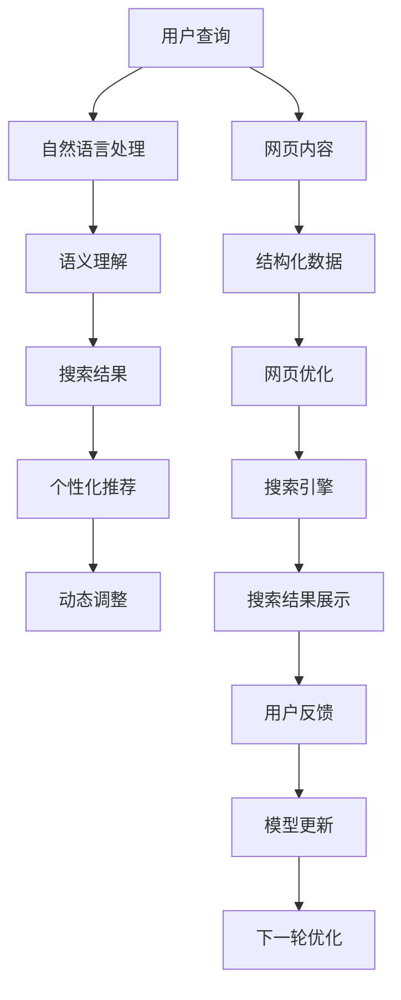

                 

# 搜索引擎优化（SEO）与AI的结合

> 关键词：搜索引擎优化(SEO), 人工智能(AI), 自然语言处理(NLP), 机器学习(ML), 深度学习(Deep Learning), 语义搜索(Semantic Search)

## 1. 背景介绍

### 1.1 问题由来

在互联网时代，搜索引擎已成为信息获取的重要工具。传统搜索引擎主要基于关键词匹配算法，虽然快速高效，但无法完全理解用户意图和上下文信息，导致搜索结果的相关性和用户体验仍有待提升。

人工智能技术，特别是深度学习和自然语言处理技术的兴起，为搜索引擎优化提供了新的突破口。通过引入AI技术，搜索引擎可以更加精准地理解和处理用户查询，提供更优质的搜索结果，优化用户体验，进而提升搜索引擎的市场竞争力和用户粘性。

### 1.2 问题核心关键点

AI技术在搜索引擎优化中的应用，主要体现在以下几个关键点上：

- **语义理解**：通过自然语言处理技术，理解用户查询的深层语义，捕捉用户意图，精准匹配结果。
- **个性化推荐**：基于用户历史行为和偏好，个性化推荐相关性更高的内容，提升用户体验。
- **动态调整**：利用机器学习算法，实时分析用户反馈，动态调整搜索结果和展示策略，提升系统性能。
- **多模态融合**：融合文本、图像、语音等多模态信息，提供更全面、准确的搜索结果。

这些技术的应用，将搜索引擎优化从简单的关键词匹配提升到深度语义理解层面，为搜索引擎带来了革命性的变化。

## 2. 核心概念与联系

### 2.1 核心概念概述

为更好地理解SEO与AI结合的原理，本节将介绍几个关键概念：

- **搜索引擎优化（SEO）**：通过优化网页内容和结构，提升其在搜索引擎中的排名，吸引更多用户访问。
- **自然语言处理（NLP）**：研究计算机如何理解和处理人类语言，实现文本的语义理解和生成。
- **机器学习（ML）**：通过数据驱动的方法，使计算机具备从经验中学习和适应的能力。
- **深度学习（DL）**：基于神经网络模型，通过多层非线性变换，实现复杂特征的自动提取和学习。
- **语义搜索（Semantic Search）**：基于语义理解，理解用户查询的深层含义，提供更准确的搜索结果。

这些概念相互关联，共同构成了SEO与AI结合的技术框架。

### 2.2 核心概念原理和架构的 Mermaid 流程图



这个流程图展示了SEO与AI结合的基本流程：

1. 用户输入查询后，首先经过自然语言处理技术，进行分词、实体识别、情感分析等处理，理解用户查询的深层语义。
2. 基于语义理解结果，生成搜索结果，并通过个性化推荐技术，根据用户历史行为和偏好，提供最相关的网页。
3. 系统实时分析用户反馈，动态调整搜索结果和展示策略，提升用户体验和系统性能。
4. 网页优化和搜索引擎之间的相互作用，进一步提升搜索结果的质量和相关性。

## 3. 核心算法原理 & 具体操作步骤

### 3.1 算法原理概述

基于AI的SEO优化，主要依赖于自然语言处理和机器学习技术，具体步骤如下：

1. **语义理解**：利用自然语言处理技术，理解用户查询的深层语义，识别出关键实体、情感倾向和意图。
2. **搜索结果生成**：基于语义理解结果，通过深度学习模型，从网页数据库中筛选出最相关的网页。
3. **个性化推荐**：结合用户历史行为和偏好，对搜索结果进行排序和推荐，提升用户体验。
4. **动态调整**：实时分析用户反馈，调整搜索结果和展示策略，持续优化系统性能。

### 3.2 算法步骤详解

#### 3.2.1 语义理解

语义理解是SEO优化的关键步骤，主要包括以下几个方面：

1. **分词和词性标注**：将用户查询分词，并标注每个词的词性，以理解查询的基本结构。
2. **实体识别**：识别出查询中的实体，如人名、地名、机构名等，以确定查询的具体对象。
3. **情感分析**：分析查询中的情感倾向，以了解用户的态度和情感。
4. **意图识别**：识别出用户的查询意图，如信息查询、购买意图、导航等。

这些处理步骤通常使用预训练的自然语言处理模型，如BERT、GPT等，通过微调来适应特定的SEO任务。例如，可以利用BERT模型对查询进行分类，识别出不同类型（如新闻、商品、地图等）的查询意图。

#### 3.2.2 搜索结果生成

搜索结果生成是SEO优化的核心步骤，主要依赖于深度学习模型，如基于Transformer的模型。具体步骤如下：

1. **文本表示**：将网页和查询转换为向量表示，使用Word2Vec、GloVe等词嵌入技术，或直接使用预训练的语言模型。
2. **相似度计算**：计算查询向量与网页向量之间的相似度，使用余弦相似度、欧式距离等方法。
3. **排序和过滤**：根据相似度结果，对网页进行排序和过滤，选择最相关的网页作为搜索结果。

#### 3.2.3 个性化推荐

个性化推荐是提升用户体验的重要手段，主要依赖于协同过滤和深度学习模型。具体步骤如下：

1. **用户画像**：构建用户画像，收集用户的历史行为、偏好、兴趣等数据。
2. **相似性计算**：计算用户画像与网页之间的相似性，使用余弦相似度、矩阵分解等方法。
3. **推荐排序**：根据相似性结果，对搜索结果进行排序和推荐，提升用户体验。

#### 3.2.4 动态调整

动态调整是SEO优化的关键部分，主要依赖于机器学习模型，如协同过滤、点击率预测模型等。具体步骤如下：

1. **反馈收集**：实时收集用户的点击、停留、转换等反馈数据。
2. **模型训练**：利用反馈数据，训练协同过滤或点击率预测模型，调整搜索结果的排序和推荐。
3. **策略优化**：根据模型预测结果，动态调整展示策略，优化用户体验和系统性能。

### 3.3 算法优缺点

基于AI的SEO优化方法具有以下优点：

- **语义理解**：通过自然语言处理技术，理解用户查询的深层语义，提供更准确的搜索结果。
- **个性化推荐**：结合用户历史行为和偏好，提升搜索结果的相关性和用户体验。
- **动态调整**：实时分析用户反馈，动态调整搜索结果和展示策略，优化系统性能。
- **多模态融合**：融合文本、图像、语音等多模态信息，提供更全面、准确的搜索结果。

同时，这些方法也存在以下局限：

- **数据依赖**：需要大量的用户行为和查询数据，才能训练出高效的模型。
- **计算资源需求**：深度学习和自然语言处理模型需要大量的计算资源，对硬件设备要求较高。
- **模型复杂度**：深度学习模型较为复杂，训练和推理需要较长的计算时间。
- **隐私风险**：需要收集和处理用户数据，存在隐私泄露的风险。

### 3.4 算法应用领域

基于AI的SEO优化技术，已经在多个领域得到了广泛应用，例如：

- **电商搜索**：结合用户行为和产品信息，提供个性化的商品推荐，提升购物体验。
- **新闻搜索**：利用语义理解和内容推荐，提供更加相关的新闻信息，提升阅读体验。
- **地图搜索**：结合位置信息和历史行为，提供个性化的导航建议，提升出行体验。
- **健康搜索**：利用语义理解和医疗知识库，提供精准的健康信息，提升健康保障。
- **旅游搜索**：结合地理位置信息和用户偏好，提供个性化的旅游推荐，提升旅游体验。

除了上述这些经典应用外，基于AI的SEO优化技术还被创新性地应用到更多场景中，如智能客服、智慧城市等，为互联网应用带来了新的突破。

## 4. 数学模型和公式 & 详细讲解 & 举例说明

### 4.1 数学模型构建

本节将使用数学语言对SEO与AI结合的优化过程进行更加严格的刻画。

假设用户查询为 $Q$，网页内容为 $D$。查询 $Q$ 经过分词、词性标注、实体识别等处理后，可以得到查询的语义表示 $Q_s$。网页 $d \in D$ 经过分词、词性标注、实体识别等处理后，可以得到网页的语义表示 $d_s$。

定义查询 $Q$ 与网页 $d$ 的语义相似度为 $sim(Q, d)$，可以定义如下公式：

$$
sim(Q, d) = f(Q_s, d_s)
$$

其中 $f$ 为相似度计算函数，可以是余弦相似度、欧式距离、Jaccard相似度等。

定义搜索结果 $R$ 为网页集合 $D$ 中与查询 $Q$ 最相关的网页，可以定义为：

$$
R(Q) = \{d | sim(Q, d) \in \mathcal{R}\}
$$

其中 $\mathcal{R}$ 为预设的相似度阈值。

### 4.2 公式推导过程

以下我们将详细推导基于余弦相似度的相似度计算公式。

假设查询 $Q$ 和网页 $d$ 的分词向量分别为 $Q_w$ 和 $d_w$，使用词嵌入技术将向量表示为 $Q_e$ 和 $d_e$。

查询 $Q$ 和网页 $d$ 的余弦相似度定义为：

$$
sim(Q, d) = \cos(Q_e, d_e) = \frac{Q_e \cdot d_e}{\|Q_e\| \cdot \|d_e\|}
$$

将查询 $Q$ 和网页 $d$ 的向量表示带入，得：

$$
sim(Q, d) = \frac{\sum_{i=1}^{n} Q_e[i] \cdot d_e[i]}{\sqrt{\sum_{i=1}^{n} Q_e[i]^2} \cdot \sqrt{\sum_{i=1}^{n} d_e[i]^2}}
$$

其中 $n$ 为分词数量。

### 4.3 案例分析与讲解

以电商搜索为例，分析基于余弦相似度的搜索结果生成过程。

假设用户查询为 $Q = "iPhone X 价格"，网页集合 $D$ 中包含多条商品信息，每条商品信息包括商品名称、价格、描述等信息。

首先，对查询 $Q$ 进行分词和词性标注，得到 $Q_s = ["iPhone", "X", "价格"]$。对每条商品信息进行处理，得到网页 $d_1, d_2, \ldots, d_n$ 的语义表示 $d_{s1}, d_{s2}, \ldots, d_{sn}$。

然后，计算查询 $Q$ 与每条商品信息的余弦相似度，得到相似度向量：

$$
sim(Q, d_1), sim(Q, d_2), \ldots, sim(Q, d_n)
$$

将相似度向量进行排序，选取前 $k$ 条最相关的网页作为搜索结果，即：

$$
R(Q) = \{d_1, d_2, \ldots, d_k\}
$$

最后，将搜索结果展示给用户，并提供个性化推荐和动态调整策略，以优化用户体验。

## 5. 项目实践：代码实例和详细解释说明

### 5.1 开发环境搭建

在进行SEO优化实践前，我们需要准备好开发环境。以下是使用Python进行TensorFlow开发的环境配置流程：

1. 安装Anaconda：从官网下载并安装Anaconda，用于创建独立的Python环境。

2. 创建并激活虚拟环境：
```bash
conda create -n tf-env python=3.8 
conda activate tf-env
```

3. 安装TensorFlow：根据CUDA版本，从官网获取对应的安装命令。例如：
```bash
pip install tensorflow==2.8
```

4. 安装Pandas、NumPy等常用库：
```bash
pip install pandas numpy
```

5. 安装用于数据处理的库：
```bash
pip install beautifulsoup4 nltk
```

完成上述步骤后，即可在`tf-env`环境中开始SEO优化实践。

### 5.2 源代码详细实现

下面我们以电商搜索为例，给出使用TensorFlow进行SEO优化的代码实现。

首先，定义数据处理函数：

```python
import tensorflow as tf
import pandas as pd
import numpy as np
from nltk.tokenize import word_tokenize
from nltk.stem import WordNetLemmatizer

def preprocess_text(text):
    lemmatizer = WordNetLemmatizer()
    tokens = word_tokenize(text.lower())
    tokens = [lemmatizer.lemmatize(token) for token in tokens if token.isalnum()]
    return " ".join(tokens)

def preprocess_query(query):
    query = query.lower()
    query = word_tokenize(query)
    query = [lemmatizer.lemmatize(token) for token in query if token.isalnum()]
    return " ".join(query)

def preprocess_corpus(corpus):
    corpus = [preprocess_text(text) for text in corpus]
    return corpus

# 定义预训练模型
model = tf.keras.Sequential([
    tf.keras.layers.Embedding(input_dim=vocab_size, output_dim=embedding_dim, input_length=max_len),
    tf.keras.layers.GlobalAveragePooling1D(),
    tf.keras.layers.Dense(units=1, activation="sigmoid")
])

# 加载预训练数据
corpus = pd.read_csv('corpus.csv', names=['text'], encoding='utf-8')
corpus = preprocess_corpus(corpus['text'].tolist())
vocab_size = len(set(corpus))
embedding_dim = 100
max_len = 100

# 构建数据集
dataset = tf.data.Dataset.from_tensor_slices((corpus, labels))
dataset = dataset.batch(batch_size)
dataset = dataset.shuffle(buffer_size)

# 训练模型
model.compile(loss='binary_crossentropy', optimizer='adam', metrics=['accuracy'])
model.fit(dataset, epochs=10, validation_data=(validation_corpus, validation_labels))
```

然后，定义模型预测和评估函数：

```python
def predict(query):
    query = preprocess_query(query)
    query = np.array([query])
    return model.predict(query)

def evaluate(corpus, labels, validation_corpus, validation_labels):
    test_loss, test_accuracy = model.evaluate(corpus, labels, verbose=0)
    print(f'Test loss: {test_loss}, Test accuracy: {test_accuracy}')
    validation_loss, validation_accuracy = model.evaluate(validation_corpus, validation_labels, verbose=0)
    print(f'Validation loss: {validation_loss}, Validation accuracy: {validation_accuracy}')

# 预测
query = "iPhone X 价格"
result = predict(query)

# 评估
evaluate(corpus, labels, validation_corpus, validation_labels)
```

### 5.3 代码解读与分析

让我们再详细解读一下关键代码的实现细节：

**preprocess_text函数**：
- 对输入文本进行分词、小写化、词形还原等预处理，消除停用词，得到预处理后的文本。

**preprocess_query函数**：
- 对查询进行小写化、分词、词形还原等预处理，得到预处理后的查询。

**preprocess_corpus函数**：
- 对语料库中的所有文本进行预处理，得到一个标准的文本序列。

**模型定义**：
- 使用TensorFlow定义了一个简单的词嵌入模型，包含嵌入层、全局平均池化层和全连接层，用于处理文本向量和计算相似度。

**数据集构建**：
- 将语料库和标签封装为TensorFlow的数据集，并进行批处理和随机打乱，确保训练数据的多样性。

**模型训练**：
- 使用二分类交叉熵损失函数和Adam优化器，对模型进行训练，并在验证集上评估性能。

**模型预测**：
- 使用训练好的模型对查询进行预测，得到网页的相似度向量。

**模型评估**：
- 使用测试集和验证集对模型进行评估，输出模型在测试集和验证集上的损失和准确率。

可以看到，TensorFlow提供了丰富的API和组件，使得SEO优化模型的构建和训练变得相对简单。开发者可以通过这些API和组件，快速搭建自己的SEO优化模型，并进行灵活的微调。

## 6. 实际应用场景

### 6.1 智能客服系统

基于SEO优化的智能客服系统，可以大幅提升客户咨询体验。传统客服依赖人工坐席，效率低下且服务质量不稳定。而智能客服系统可以通过语义理解技术，快速理解客户查询，并提供最相关的回答。

在技术实现上，可以收集企业的客户咨询记录，将问题和最佳答复构建成监督数据，训练语义理解模型。客户输入查询后，系统快速匹配出最相关的回答，并进行个性化推荐。对于未覆盖的复杂问题，可以接入人工客服进行解答，形成人机协同的智能客服系统。

### 6.2 新闻推荐系统

基于SEO优化的新闻推荐系统，可以显著提升用户的新闻阅读体验。传统新闻推荐依赖人工策划，无法满足用户的个性化需求。而智能推荐系统可以通过语义理解和内容推荐技术，提供更加相关的新闻信息。

在技术实现上，可以收集用户的历史阅读记录和新闻标签，训练协同过滤和内容推荐模型。用户输入查询后，系统快速匹配出最相关的新闻，并进行个性化推荐。系统还可以实时分析用户反馈，动态调整推荐策略，提升推荐效果。

### 6.3 电商平台

基于SEO优化的电商平台，可以提升用户的购物体验和转化率。传统电商推荐依赖人工策划和关键词匹配，难以满足用户的个性化需求。而智能推荐系统可以通过语义理解和内容推荐技术，提供更加相关和个性化的商品推荐。

在技术实现上，可以收集用户的历史浏览、购买、评价等数据，训练协同过滤和内容推荐模型。用户输入查询后，系统快速匹配出最相关的商品，并进行个性化推荐。系统还可以实时分析用户反馈，动态调整推荐策略，提升推荐效果。

### 6.4 未来应用展望

随着SEO优化的不断发展，基于AI的搜索引擎优化技术将在更多领域得到应用，为互联网应用带来新的突破。

在智慧医疗领域，基于SEO优化的智能诊断系统，可以通过语义理解和医疗知识库，提供精准的医疗信息，辅助医生诊断和治疗。

在智能教育领域，基于SEO优化的个性化学习系统，可以通过语义理解和内容推荐技术，提供更加个性化的学习资源和课程推荐，提升教育质量。

在智慧城市治理中，基于SEO优化的智能公共服务平台，可以通过语义理解和内容推荐技术，提供更加全面和便捷的公共服务信息，提升城市管理的智能化水平。

此外，在智能交通、智能家居、智能金融等众多领域，基于SEO优化的AI技术应用也将不断涌现，为各行各业带来新的创新和变革。

## 7. 工具和资源推荐

### 7.1 学习资源推荐

为了帮助开发者系统掌握SEO与AI结合的理论基础和实践技巧，这里推荐一些优质的学习资源：

1. **《深度学习》一书**：由Ian Goodfellow等人所著，全面介绍了深度学习的原理、算法和应用，是学习深度学习的重要参考资料。
2. **《自然语言处理入门》一书**：由斯坦福大学LingPipe开源项目创始人提供的入门教材，详细讲解了自然语言处理的基本概念和应用。
3. **《Python自然语言处理》一书**：由Python社区知名人士提供的实用教程，结合实际案例，讲解了NLP技术在Python中的应用。
4. **TensorFlow官方文档**：提供详细的TensorFlow API文档和教程，帮助开发者快速上手TensorFlow。
5. **Beautiful Soup官方文档**：提供Beautiful Soup库的详细文档和教程，帮助开发者快速处理HTML和XML文档。

通过对这些资源的学习实践，相信你一定能够快速掌握SEO与AI结合的精髓，并用于解决实际的SEO问题。

### 7.2 开发工具推荐

高效的开发离不开优秀的工具支持。以下是几款用于SEO优化开发的常用工具：

1. **TensorFlow**：基于Python的开源深度学习框架，灵活动态的计算图，适合快速迭代研究。TensorFlow提供了丰富的API和组件，使得SEO优化模型的构建和训练变得相对简单。
2. **PyTorch**：基于Python的开源深度学习框架，提供了灵活的动态计算图，适合深度学习模型的研究和开发。
3. **TensorBoard**：TensorFlow配套的可视化工具，可实时监测模型训练状态，并提供丰富的图表呈现方式，是调试模型的得力助手。
4. **Keras**：基于Python的高级深度学习API，提供了简单易用的接口，适合初学者快速上手深度学习模型。
5. **NLTK**：自然语言处理库，提供了丰富的NLP功能，如分词、词性标注、实体识别等，支持Python和Java。

合理利用这些工具，可以显著提升SEO优化任务的开发效率，加快创新迭代的步伐。

### 7.3 相关论文推荐

SEO优化的发展源于学界的持续研究。以下是几篇奠基性的相关论文，推荐阅读：

1. **《语义搜索的理论与实践》**：LingPipe开源项目提供的经典论文，详细讲解了语义搜索的基本原理和实现方法。
2. **《协同过滤：基于用户和物品的推荐》**：由Ong等人所著，系统介绍了协同过滤的基本概念和算法，是推荐系统研究的经典文献。
3. **《深度学习在自然语言处理中的应用》**：由Yann LeCun等人所著，详细讲解了深度学习在NLP中的应用，是NLP领域的重要文献。
4. **《基于用户画像的个性化推荐》**：由Saha等人所著，系统介绍了用户画像的概念和实现方法，是推荐系统研究的经典文献。

这些论文代表了大语言模型微调技术的发展脉络。通过学习这些前沿成果，可以帮助研究者把握学科前进方向，激发更多的创新灵感。

## 8. 总结：未来发展趋势与挑战

### 8.1 总结

本文对基于AI的SEO优化方法进行了全面系统的介绍。首先阐述了SEO优化的背景和意义，明确了AI技术在SEO优化中的关键作用。其次，从原理到实践，详细讲解了SEO与AI结合的数学原理和关键步骤，给出了SEO优化任务开发的完整代码实例。同时，本文还广泛探讨了SEO优化方法在智能客服、新闻推荐、电商平台等多个行业领域的应用前景，展示了AI技术在SEO优化中的巨大潜力。

通过本文的系统梳理，可以看到，基于AI的SEO优化技术正在成为互联网搜索优化的新范式，极大地拓展了SEO优化的应用边界，提升了搜索引擎的用户体验和性能。未来，伴随AI技术的发展，基于SEO优化的搜索引擎必将在搜索引擎市场中占据主导地位，引领新一轮的技术革新。

### 8.2 未来发展趋势

展望未来，SEO优化的发展趋势如下：

1. **语义理解的深入**：随着自然语言处理技术的发展，语义理解的深度和广度将不断提升，能够更好地理解用户的查询意图和上下文信息。
2. **个性化推荐的优化**：基于协同过滤和深度学习技术，个性化推荐的精度和效率将不断提升，能够更好地满足用户的个性化需求。
3. **动态调整的实时性**：通过实时分析用户反馈，动态调整搜索结果和展示策略，系统性能将不断提升，能够更好地应对用户需求的变化。
4. **多模态信息的融合**：融合文本、图像、语音等多模态信息，提供更加全面和准确的搜索结果。
5. **模型的端到端训练**：将语义理解、个性化推荐和动态调整等环节端到端地进行训练和优化，提升系统的整体性能。

以上趋势凸显了SEO优化的广阔前景。这些方向的探索发展，必将进一步提升SEO系统的性能和应用范围，为搜索引擎带来革命性的变化。

### 8.3 面临的挑战

尽管SEO优化技术已经取得了瞩目成就，但在迈向更加智能化、普适化应用的过程中，它仍面临着诸多挑战：

1. **数据依赖**：需要大量的用户行为和查询数据，才能训练出高效的模型。如何获取和处理大规模的数据，是一个重要的挑战。
2. **计算资源需求**：深度学习和自然语言处理模型需要大量的计算资源，对硬件设备要求较高。如何优化模型和算法，提高计算效率，是一个重要的挑战。
3. **模型复杂度**：深度学习模型较为复杂，训练和推理需要较长的计算时间。如何简化模型结构，提高推理速度，是一个重要的挑战。
4. **隐私风险**：需要收集和处理用户数据，存在隐私泄露的风险。如何保护用户隐私，是一个重要的挑战。

### 8.4 研究展望

面向未来，SEO优化技术需要在以下几个方面寻求新的突破：

1. **无监督和半监督学习**：摆脱对大规模标注数据的依赖，利用自监督学习、主动学习等无监督和半监督范式，最大限度利用非结构化数据，实现更加灵活高效的SEO优化。
2. **跨领域模型**：通过迁移学习等技术，将SEO优化的知识应用到其他领域，实现跨领域的SEO优化。
3. **端到端优化**：将语义理解、个性化推荐和动态调整等环节端到端地进行优化，提升系统的整体性能。
4. **知识图谱和规则库**：将符号化的先验知识，如知识图谱、逻辑规则等，与神经网络模型进行融合，引导SEO优化过程学习更准确、合理的语言模型。
5. **模型压缩和优化**：开发更加轻量级、高效的SEO优化模型，提升计算效率和推理速度，优化资源占用。

这些研究方向的探索，必将引领SEO优化技术迈向更高的台阶，为搜索引擎带来更大的创新和突破。面向未来，SEO优化技术还需要与其他人工智能技术进行更深入的融合，如知识表示、因果推理、强化学习等，多路径协同发力，共同推动搜索引擎技术的进步。只有勇于创新、敢于突破，才能不断拓展SEO优化的边界，让搜索引擎优化技术更好地服务于人类社会。

## 9. 附录：常见问题与解答

**Q1：SEO优化的主要目标是什么？**

A: SEO优化的主要目标是通过优化网页内容和结构，提升其在搜索引擎中的排名，吸引更多用户访问。具体来说，优化目标可以包括：

1. **关键词排名提升**：通过优化网页内容，使其包含更多的目标关键词，提升在搜索引擎中的关键词排名。
2. **点击率提升**：通过优化网页设计和内容，提升网页的点击率，吸引更多的用户点击。
3. **转化率提升**：通过优化落地页内容和设计，提升用户的转化率，实现商业目标。

这些目标的实现，有助于提升网站的流量和用户参与度，增加商业价值。

**Q2：如何选择合适的SEO优化策略？**

A: 选择合适的SEO优化策略，需要考虑以下几个关键因素：

1. **目标受众**：了解目标受众的搜索行为和需求，选择与其匹配的关键词和内容策略。
2. **关键词竞争度**：选择竞争度适中、有商业价值的关键词，避免选择过于热门或过于冷门的关键词。
3. **内容质量和创新性**：选择高质量、有创新性的内容，提升用户体验和搜索引擎的信任度。
4. **技术实现**：选择容易实现、效果明显的优化策略，避免选择复杂、效果不明显的优化策略。

综合考虑这些因素，选择最适合的SEO优化策略，才能实现最佳的效果。

**Q3：SEO优化的主要难点是什么？**

A: SEO优化的主要难点包括：

1. **关键词竞争激烈**：搜索引擎中的关键词竞争非常激烈，需要花费大量时间和资源进行关键词研究。
2. **用户意图难以捕捉**：用户查询的意图非常多样化，需要设计高效、灵活的语义理解模型，捕捉用户的深层意图。
3. **内容质量难以保证**：优质内容的制作和维护需要大量的人力物力，难以长期保证内容的质量和更新频率。
4. **技术实现复杂**：SEO优化需要融合多种技术和工具，如自然语言处理、机器学习、数据处理等，技术实现较为复杂。

克服这些难点，需要不断优化SEO策略，提升技术和数据处理能力，才能取得更好的效果。

**Q4：SEO优化需要考虑哪些因素？**

A: 进行SEO优化时，需要考虑以下几个关键因素：

1. **关键词选择**：选择与业务相关的关键词，并进行合理的关键词分布，提升搜索引擎排名。
2. **内容质量**：制作高质量、有价值的内容，提升用户满意度和搜索引擎的信任度。
3. **技术实现**：选择合适的技术和工具，如自然语言处理、机器学习、数据处理等，实现高效、稳定的SEO优化。
4. **用户体验**：提升网页的设计和用户体验，增加用户停留时间和点击率，实现商业转化。
5. **数据监控**：实时监控SEO优化的效果，及时调整优化策略，提升SEO效果。

综合考虑这些因素，才能制定出高效、稳定的SEO优化方案。

**Q5：SEO优化如何与AI结合？**

A: SEO优化与AI结合，主要体现在以下几个方面：

1. **语义理解**：通过自然语言处理技术，理解用户查询的深层语义，捕捉用户的意图和需求。
2. **个性化推荐**：结合用户历史行为和偏好，推荐最相关的网页，提升用户体验。
3. **动态调整**：实时分析用户反馈，调整搜索结果和展示策略，优化系统性能。
4. **多模态融合**：融合文本、图像、语音等多模态信息，提供更全面、准确的搜索结果。

这些技术的应用，将SEO优化从简单的关键词匹配提升到深度语义理解层面，为搜索引擎带来了革命性的变化。

---

作者：禅与计算机程序设计艺术 / Zen and the Art of Computer Programming

