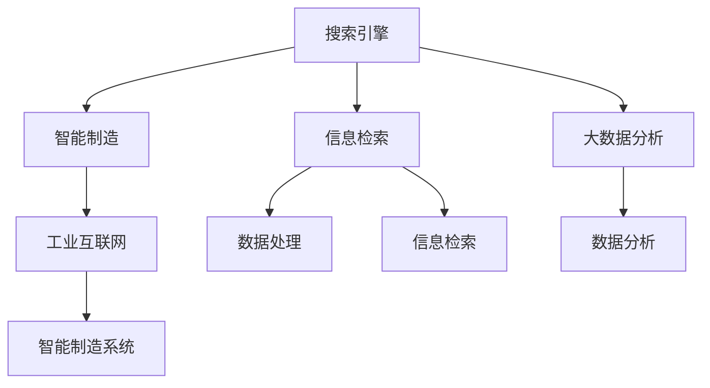
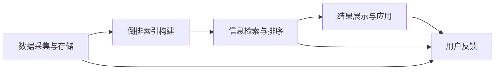

                 

# 搜索引擎在智能制造中的应用

> 关键词：智能制造,搜索引擎,自动化生产,工业互联网,信息检索,大数据分析

## 1. 背景介绍

### 1.1 问题由来
随着人工智能(AI)和物联网(IoT)技术的迅猛发展，智能制造正成为制造业转型升级的重要方向。智能制造通过将先进的信息技术嵌入到制造体系中，提升生产效率、降低成本、提高产品质量，实现制造业的智能化、个性化和柔性化发展。

然而，随着制造环境的日益复杂和数据量的爆炸性增长，传统的数据查询和检索方式已经难以满足智能制造的需求。如何在海量的设备数据、生产数据、质量数据中，快速准确地获取所需信息，成为智能制造系统面临的重要挑战。

搜索引擎技术作为信息检索的核心手段，能够高效处理结构化和非结构化数据，满足智能制造对信息需求的多样性和实时性。本文将探讨搜索引擎在智能制造中的应用，旨在构建智能制造领域的信息检索解决方案，提升生产效率和决策支持能力。

## 2. 核心概念与联系

### 2.1 核心概念概述

为更好地理解搜索引擎在智能制造中的应用，本节将介绍几个密切相关的核心概念：

- 搜索引擎(Search Engine)：指一种能够从大量数据中快速检索出用户查询的文档或网页的工具。通过爬虫技术收集网页，建立倒排索引，采用搜索算法返回与查询相关的结果。

- 智能制造(Smart Manufacturing)：结合数字化、网络化、智能化技术，实现制造过程的自动化、柔性化和个性化，提高生产效率、降低成本、提升产品质量。

- 工业互联网(Industrial Internet)：通过将传感器、智能设备、软件平台等有机集成，构建集智能制造、智能服务、智能运营于一体的工业生态系统，实现制造业的数字化转型。

- 信息检索(Information Retrieval)：指从信息集合中自动检索出与用户查询相关的信息，并通过排序和过滤技术提升检索效果。信息检索是搜索引擎的核心技术。

- 大数据分析(Big Data Analysis)：指在智能制造过程中，对海量数据的收集、存储、分析和应用，为决策支持和生产优化提供支持。

这些核心概念之间的逻辑关系可以通过以下Mermaid流程图来展示：



这个流程图展示出搜索引擎、智能制造、工业互联网之间的关系：

1. 搜索引擎通过信息检索技术，帮助智能制造系统高效地从海量数据中获取所需信息。
2. 工业互联网将智能制造系统中的各种设备、系统和数据连接起来，构建统一的数字化平台。
3. 大数据分析在工业互联网的支撑下，对制造数据进行全面分析和挖掘，为智能制造提供数据支撑。

这些概念共同构成了智能制造的信息基础设施，使搜索引擎成为智能制造信息检索的核心工具。

## 3. 核心算法原理 & 具体操作步骤
### 3.1 算法原理概述

搜索引擎在智能制造中的应用，本质上是将搜索引擎技术应用于制造业的信息检索需求。其核心思想是：

1. **数据采集与存储**：通过传感器和物联网设备，采集制造环境中的各种数据，并将其存储在统一的数据库中。
2. **倒排索引构建**：对存储的数据进行结构化处理，建立倒排索引，用于快速检索。
3. **信息检索与排序**：当用户输入查询时，搜索引擎根据查询词与倒排索引的匹配度，返回相关性最高的文档或数据。
4. **结果展示与应用**：将检索结果展示给用户，支持其在智能制造系统中进行数据查询、决策支持等操作。

搜索引擎在智能制造中的应用流程如图所示：



### 3.2 算法步骤详解

搜索引擎在智能制造中的具体操作，一般包括以下几个关键步骤：

**Step 1: 数据采集与存储**

- **传感器和物联网设备**：在智能制造系统内部安装各种传感器和物联网设备，实时采集生产设备状态、生产参数、质量数据等。
- **数据存储与管理**：利用数据库技术，将采集到的数据存储在统一的数据仓库中，并支持数据管理和查询操作。

**Step 2: 倒排索引构建**

- **数据结构化处理**：对存储的数据进行预处理和结构化，如去重、格式化、分词等，提高数据质量。
- **倒排索引建立**：建立倒排索引表，将每个词与包含该词的文档或数据进行关联。倒排索引通常采用B树、哈希表等数据结构实现。

**Step 3: 信息检索与排序**

- **查询处理**：用户输入查询词后，搜索引擎通过分词、词性标注、去停用词等预处理技术，构建查询向量。
- **匹配计算**：将查询向量与倒排索引进行匹配，计算每篇文档的相关度。
- **排序与过滤**：根据相关度计算结果，对文档进行排序和过滤，返回与查询最相关的结果。

**Step 4: 结果展示与应用**

- **结果展示**：将检索结果以网页、图表、报表等形式展示给用户，支持用户进一步查询和分析。
- **应用集成**：将搜索引擎集成到智能制造系统的各个环节，如生产计划、质量控制、设备维护等，提供信息支持。

### 3.3 算法优缺点

搜索引擎在智能制造中的应用，具有以下优点：

1. **高效性**：能够在海量数据中快速检索出相关结果，满足智能制造对信息实时性和多样性的需求。
2. **灵活性**：支持结构化和非结构化数据检索，能够处理多种信息格式和数据源。
3. **可扩展性**：支持分布式部署，能够适应智能制造系统的扩展需求。
4. **普适性**：适用于制造领域的各种信息检索需求，如设备状态查询、生产数据分析、质量问题诊断等。

同时，搜索引擎也存在以下缺点：

1. **数据质量依赖**：依赖于传感器和物联网设备的稳定性与精度，数据质量影响检索效果。
2. **计算复杂度**：在处理大规模数据时，检索算法复杂度高，可能影响响应速度。
3. **数据隐私问题**：制造数据涉及企业机密，需要确保数据存储和传输的安全性。
4. **模型训练难度**：需要根据智能制造系统的需求，设计合适的模型和算法，进行训练和优化。

尽管存在这些局限性，但搜索引擎在智能制造中的应用前景广阔，仍是大数据背景下信息检索的重要手段。

### 3.4 算法应用领域

搜索引擎在智能制造中的应用，主要包括以下几个关键领域：

1. **生产设备状态监控**：通过传感器采集设备的运行状态数据，实时查询设备状态，进行故障预测和维护。
2. **生产过程优化**：利用传感器采集的生产参数数据，进行实时查询和分析，优化生产工艺和流程。
3. **质量控制与检测**：通过传感器采集的产品质量数据，进行实时查询和检测，提升产品质量和一致性。
4. **设备故障诊断**：利用传感器采集的设备状态数据，进行实时查询和分析，诊断设备故障原因。
5. **资源优化与调度**：通过传感器采集的资源数据，进行实时查询和分析，优化资源配置和调度。
6. **供应链管理**：利用传感器采集的供应链数据，进行实时查询和分析，提升供应链的透明度和效率。

此外，搜索引擎在智能制造中的应用，还可扩展到更广泛的信息处理领域，如能源管理、物流管理、环境监测等，为智能制造提供更全面的信息支持。

## 4. 数学模型和公式 & 详细讲解 & 举例说明

### 4.1 数学模型构建

本节将使用数学语言对搜索引擎在智能制造中的应用进行更加严格的刻画。

记智能制造系统的传感器数据为 $D=\{d_1,d_2,...,d_N\}$，其中 $d_i=(x_i,y_i,t_i)$ 表示第 $i$ 个传感器的数据，$x_i$ 为采集值，$y_i$ 为标签信息，$t_i$ 为时间戳。假设用户输入查询词为 $q$，搜索引擎返回的相关文档为 $S=\{s_1,s_2,...,s_M\}$，其中 $s_i$ 为第 $i$ 个文档，相关度为 $r_i$。

搜索引擎的数学模型可以表述为：

$$
\max_{q_i} \sum_{i=1}^M \alpha_i \cdot r_i
$$

其中，$q_i$ 为第 $i$ 个查询词，$\alpha_i$ 为权重系数，$r_i$ 为第 $i$ 个文档的相关度。

### 4.2 公式推导过程

为了更好地理解搜索引擎在智能制造中的应用，我们将使用TF-IDF(Term Frequency-Inverse Document Frequency)算法计算文档的相关度。假设查询向量为 $q_t$，文档向量为 $s_t$，则相关度计算公式为：

$$
r_t = \sum_{i=1}^N \frac{q_t \cdot d_i}{N \cdot \|q_t\| \cdot \|d_i\|}
$$

其中，$q_t$ 为查询向量，$d_i$ 为传感器数据向量，$\|q_t\|$ 和 $\|d_i\|$ 分别为向量的范数。

这个公式的意义是：计算查询向量与传感器数据的点积，并除以查询向量的范数和传感器数据的范数的乘积，得到文档的相关度。

### 4.3 案例分析与讲解

以下以智能制造系统中生产设备的故障诊断为例，展示搜索引擎的应用。

假设有一台加工设备，传感器实时采集设备的温度、振动、压力等数据，存储在数据库中。当设备出现异常时，维护人员需要通过查询相关数据，进行故障分析。

具体步骤如下：

1. **数据采集与存储**：通过传感器采集设备的温度、振动、压力等数据，并存储在数据库中。

2. **倒排索引构建**：对存储的数据进行结构化处理，建立倒排索引表，将每个传感器数据与设备状态进行关联。

3. **信息检索与排序**：维护人员输入查询词，如“设备故障”，搜索引擎通过匹配计算，返回与查询相关的高温、高振动等数据。

4. **结果展示与应用**：将检索结果以报表形式展示给维护人员，分析设备异常原因，进行故障诊断和维护。

通过搜索引擎的应用，智能制造系统能够高效、准确地进行设备故障诊断，提升设备的可靠性和维护效率。

## 5. 项目实践：代码实例和详细解释说明
### 5.1 开发环境搭建

在进行搜索引擎实践前，我们需要准备好开发环境。以下是使用Python进行Elasticsearch开发的开发环境配置流程：

1. 安装Elasticsearch：从官网下载并安装Elasticsearch，用于构建搜索引擎的索引和检索服务。

2. 安装Flask：通过Flask框架实现搜索引擎的前端展示和用户交互。

3. 安装TensorFlow或PyTorch：用于数据处理和模型训练。

4. 安装Pandas和NumPy：用于数据读取和处理。

完成上述步骤后，即可在本地搭建一个简易的搜索引擎服务，并使用Flask框架进行前后端集成。

### 5.2 源代码详细实现

下面是使用Elasticsearch构建智能制造系统搜索引擎的Python代码实现：

```python
from elasticsearch import Elasticsearch
from flask import Flask, render_template, request
from flask_sqlalchemy import SQLAlchemy

app = Flask(__name__)
app.config['SQLALCHEMY_DATABASE_URI'] = 'sqlite:////tmp/test.db'
db = SQLAlchemy(app)

# 创建数据库模型
class Device(db.Model):
    id = db.Column(db.Integer, primary_key=True)
    name = db.Column(db.String(100))
    temperature = db.Column(db.Float)
    vibration = db.Column(db.Float)
    pressure = db.Column(db.Float)
    timestamp = db.Column(db.DateTime)

# 初始化Elasticsearch客户端
es = Elasticsearch([{'host': 'localhost', 'port': 9200}])

# 定义查询处理函数
def query_handler(query):
    results = []
    for doc in es.search(index='device', body=query):
        results.append(doc['_source'])
    return results

# 定义结果展示函数
def show_results(results):
    return render_template('results.html', results=results)

# 定义Flask路由
@app.route('/')
def index():
    return render_template('index.html')

@app.route('/search', methods=['POST'])
def search():
    query = request.form.get('query')
    if not query:
        return 'Invalid query'
    results = query_handler(query)
    return show_results(results)

if __name__ == '__main__':
    app.run(debug=True)
```

在上述代码中，我们通过Flask和SQLAlchemy实现了简单的数据存储和查询功能。同时，使用Elasticsearch构建了倒排索引，并通过查询处理函数实现了搜索引擎的检索功能。最后，将检索结果展示在前端页面上。

### 5.3 代码解读与分析

让我们再详细解读一下关键代码的实现细节：

**Flask和SQLAlchemy**：
- 使用Flask框架搭建Web应用，通过SQLAlchemy进行数据库操作。
- 定义了Device模型，存储设备的各项参数数据。

**Elasticsearch客户端**：
- 初始化Elasticsearch客户端，连接本地的Elasticsearch服务。
- 使用Elasticsearch的search方法进行索引搜索，返回与查询相关的文档。

**查询处理函数**：
- 接收查询词，通过Elasticsearch进行搜索，返回与查询相关的文档。
- 文档以JSON格式存储，包含设备的各项参数数据。

**结果展示函数**：
- 将搜索结果以HTML页面形式展示给用户。
- 使用Flask的render_template方法渲染模板，显示搜索结果。

**Flask路由**：
- 定义了主页和查询接口的路由。
- 主页用于展示查询界面，查询接口接收查询词，调用查询处理函数，并展示搜索结果。

通过上述代码的实现，我们构建了一个简单的搜索引擎服务，实现了设备状态的实时查询和展示。这仅是搜索引擎在智能制造中的应用基础，在实际应用中，还需要进行更深入的优化和扩展。

## 6. 实际应用场景
### 6.1 智能制造系统

搜索引擎在智能制造系统中的应用，已经广泛应用于生产设备监控、生产过程优化、质量控制、设备故障诊断等多个领域。

**生产设备监控**：通过传感器采集设备的各项参数数据，实时查询设备状态，进行故障预测和维护。

**生产过程优化**：利用传感器采集的生产参数数据，进行实时查询和分析，优化生产工艺和流程。

**质量控制与检测**：通过传感器采集的产品质量数据，进行实时查询和检测，提升产品质量和一致性。

**设备故障诊断**：利用传感器采集的设备状态数据，进行实时查询和分析，诊断设备故障原因。

**资源优化与调度**：通过传感器采集的资源数据，进行实时查询和分析，优化资源配置和调度。

**供应链管理**：利用传感器采集的供应链数据，进行实时查询和分析，提升供应链的透明度和效率。

此外，搜索引擎在智能制造中的应用，还可扩展到更广泛的信息处理领域，如能源管理、物流管理、环境监测等，为智能制造提供更全面的信息支持。

### 6.2 未来应用展望

随着Elasticsearch等搜索引擎技术的不断发展，搜索引擎在智能制造中的应用前景更加广阔。未来，搜索引擎将在智能制造中发挥越来越重要的作用，具体表现在以下几个方面：

1. **实时性增强**：通过引入流式处理、实时计算等技术，搜索引擎能够更快速地处理数据，满足智能制造对信息实时性的更高需求。

2. **数据融合与集成**：通过数据集成平台，将传感器、物联网、机器学习等技术融合到搜索引擎中，提供更全面的信息支持。

3. **智能推荐与决策支持**：利用机器学习、深度学习等技术，对检索结果进行智能推荐和决策支持，提升智能制造系统的决策水平。

4. **多模态信息处理**：通过引入语音识别、图像识别等技术，搜索引擎能够处理更丰富的信息源，提升智能制造系统的信息处理能力。

5. **边缘计算与云计算结合**：将搜索引擎部署到边缘计算节点，结合云计算资源，提升智能制造系统的计算能力和数据处理能力。

6. **联邦学习与隐私保护**：通过联邦学习技术，保护数据隐私和安全，提升智能制造系统的数据共享和合作能力。

7. **工业大数据分析**：结合工业互联网，构建工业大数据平台，对制造数据进行全面分析和挖掘，为智能制造提供数据支撑。

未来，搜索引擎在智能制造中的应用将更加智能化、集成化和实时化，为制造业的数字化转型提供更强大的信息支撑。

## 7. 工具和资源推荐
### 7.1 学习资源推荐

为了帮助开发者系统掌握搜索引擎在智能制造中的应用，这里推荐一些优质的学习资源：

1. 《Elasticsearch从入门到精通》系列博文：由Elasticsearch官方提供的详细教程，从基础概念到高级应用，全面介绍Elasticsearch的使用。

2. 《TensorFlow 2.0实战教程》书籍：介绍TensorFlow的各个模块和应用场景，包括数据处理和模型训练。

3. 《Python深度学习》书籍：介绍深度学习的基本概念和算法，包括自然语言处理和搜索引擎应用。

4. 《Flask Web开发实战》书籍：介绍Flask框架的使用和Web应用开发。

5. 《工业互联网》课程：由工业互联网领域的专家讲解，涵盖工业互联网的各个方面，包括智能制造、智慧供应链等。

通过对这些资源的学习实践，相信你一定能够快速掌握搜索引擎在智能制造中的应用技巧，并用于解决实际的智能制造问题。

### 7.2 开发工具推荐

高效的开发离不开优秀的工具支持。以下是几款用于智能制造系统搜索引擎开发的常用工具：

1. Elasticsearch：高性能的分布式搜索引擎，支持实时索引和搜索。

2. TensorFlow或PyTorch：深度学习框架，支持数据处理和模型训练。

3. Flask：轻量级的Web框架，支持前后端集成。

4. SQLAlchemy：Python的ORM框架，支持数据库操作。

5. Pandas和NumPy：数据分析和处理工具。

6. Apache Kafka：流式数据处理平台，支持实时数据流处理。

7. Prometheus和Grafana：监控和可视化工具，支持数据监控和展示。

合理利用这些工具，可以显著提升智能制造系统搜索引擎的开发效率，加快创新迭代的步伐。

### 7.3 相关论文推荐

搜索引擎在智能制造中的应用，源于学界的持续研究。以下是几篇奠基性的相关论文，推荐阅读：

1. "A Survey on Machine Learning-based Anomaly Detection"（机器学习异常检测综述）：介绍机器学习在异常检测中的应用，包括分类、聚类、深度学习等方法。

2. "Elasticsearch: A Distributed Real-Time Search and Analytics Engine"（Elasticsearch：分布式实时搜索和分析引擎）：Elasticsearch的官方文档，详细介绍了Elasticsearch的设计思想和应用场景。

3. "Efficient Estimation of Word Representations in Vector Space"（词向量空间高效估计）：介绍Word2Vec和GloVe等词向量模型，是自然语言处理领域的重要基础。

4. "Deep Learning for Manufacturing Quality Management"（深度学习在制造质量管理中的应用）：介绍深度学习在制造质量检测和管理中的应用，包括图像识别、深度学习模型训练等。

5. "Towards A Smart Manufacturing Ecosystem"（智能制造生态系统的构建）：探讨智能制造生态系统的构建方法和应用场景，包括工业互联网、云计算等技术。

这些论文代表了大语言模型微调技术的发展脉络。通过学习这些前沿成果，可以帮助研究者把握学科前进方向，激发更多的创新灵感。

## 8. 总结：未来发展趋势与挑战
### 8.1 研究成果总结

本文对搜索引擎在智能制造中的应用进行了全面系统的介绍。首先阐述了智能制造和工业互联网的发展现状，明确了搜索引擎在智能制造信息检索需求中的重要价值。其次，从原理到实践，详细讲解了搜索引擎在智能制造中的应用流程，并给出了具体的代码实现。最后，本文还探讨了搜索引擎在智能制造中的应用场景和未来发展方向，提出了若干改进措施和优化建议。

通过本文的系统梳理，可以看到，搜索引擎在智能制造中的应用前景广阔，能够高效、灵活地处理制造领域的各类信息，提升生产效率和决策支持能力。未来，随着Elasticsearch等搜索引擎技术的不断发展，搜索引擎在智能制造中的应用将更加智能化、集成化和实时化，为制造业的数字化转型提供更强大的信息支撑。

### 8.2 未来发展趋势

展望未来，搜索引擎在智能制造中的应用将呈现以下几个发展趋势：

1. **实时性增强**：引入流式处理、实时计算等技术，提升搜索引擎的响应速度和实时性。

2. **数据融合与集成**：通过数据集成平台，将传感器、物联网、机器学习等技术融合到搜索引擎中，提供更全面的信息支持。

3. **智能推荐与决策支持**：利用机器学习、深度学习等技术，对检索结果进行智能推荐和决策支持，提升智能制造系统的决策水平。

4. **多模态信息处理**：引入语音识别、图像识别等技术，提升搜索引擎的信息处理能力，处理更丰富的信息源。

5. **边缘计算与云计算结合**：将搜索引擎部署到边缘计算节点，结合云计算资源，提升智能制造系统的计算能力和数据处理能力。

6. **联邦学习与隐私保护**：通过联邦学习技术，保护数据隐私和安全，提升智能制造系统的数据共享和合作能力。

7. **工业大数据分析**：结合工业互联网，构建工业大数据平台，对制造数据进行全面分析和挖掘，为智能制造提供数据支撑。

以上趋势凸显了搜索引擎在智能制造中的应用潜力，搜索引擎将在智能制造的信息检索中发挥越来越重要的作用。

### 8.3 面临的挑战

尽管搜索引擎在智能制造中的应用前景广阔，但在迈向更加智能化、集成化应用的过程中，它仍面临诸多挑战：

1. **数据质量问题**：依赖于传感器和物联网设备的稳定性与精度，数据质量影响搜索引擎的检索效果。

2. **计算资源需求**：在处理大规模数据时，搜索引擎的计算资源需求高，可能影响系统的响应速度和扩展性。

3. **数据隐私问题**：制造数据涉及企业机密，需要确保数据存储和传输的安全性。

4. **模型训练难度**：需要根据智能制造系统的需求，设计合适的模型和算法，进行训练和优化。

5. **边缘计算与云计算的融合**：边缘计算与云计算的结合需要考虑数据一致性、通信带宽等问题。

6. **工业大数据分析**：需要构建统一的工业大数据平台，对海量数据进行存储、管理和分析。

正视搜索引擎面临的这些挑战，积极应对并寻求突破，将使搜索引擎在智能制造中的应用更加高效、可靠和安全。

### 8.4 研究展望

面向未来，搜索引擎在智能制造中的应用，需要在以下几个方面寻求新的突破：

1. **数据质量优化**：通过引入数据清洗、预处理等技术，提高传感器和物联网设备的数据质量，提升搜索引擎的检索效果。

2. **计算资源优化**：通过分布式计算、并行处理等技术，优化搜索引擎的计算资源需求，提升系统的扩展性和响应速度。

3. **隐私保护技术**：利用区块链、加密技术等手段，保护数据隐私和安全，提升智能制造系统的数据共享和合作能力。

4. **模型训练优化**：通过迁移学习、自监督学习等技术，优化搜索引擎的模型训练过程，提升模型的泛化能力和精度。

5. **联邦学习与隐私保护**：通过联邦学习技术，保护数据隐私和安全，提升智能制造系统的数据共享和合作能力。

6. **工业大数据分析**：结合工业互联网，构建工业大数据平台，对制造数据进行全面分析和挖掘，为智能制造提供数据支撑。

这些研究方向的探索，必将引领搜索引擎在智能制造中的应用走向更高的台阶，为制造业的数字化转型提供更强大的信息支撑。

## 9. 附录：常见问题与解答

**Q1：智能制造系统中的传感器和物联网设备应该如何选择？**

A: 智能制造系统中的传感器和物联网设备需要根据具体应用场景进行选择。通常需要考虑设备的精度、稳定性、响应速度、数据传输速率等因素。例如，在生产设备监控中，需要选择能够实时采集温度、振动、压力等数据的传感器；在设备故障诊断中，需要选择能够采集设备状态数据的高精度传感器。

**Q2：如何保证智能制造系统中数据的实时性？**

A: 智能制造系统中数据的实时性可以通过以下几个方法保证：
1. 引入流式处理技术，如Apache Kafka，支持数据实时采集和处理。
2. 利用缓存技术，如Redis，缓存处理结果，提高响应速度。
3. 引入微服务架构，将系统拆分为多个微服务，实现高并发和高可用。

**Q3：智能制造系统中的数据存储和管理有哪些建议？**

A: 智能制造系统中的数据存储和管理需要考虑以下几个方面：
1. 采用分布式数据库技术，如Hadoop、Spark，支持大规模数据存储和处理。
2. 利用数据仓库技术，如SQLAlchemy、Hive，实现数据的集中管理和查询。
3. 利用数据同步和复制技术，如Apache NiFi，确保数据的及时性和一致性。

**Q4：智能制造系统中如何保证数据的隐私和安全？**

A: 智能制造系统中数据的隐私和安全可以通过以下几个方法保证：
1. 采用加密技术，如AES、RSA，保护数据的传输和存储安全。
2. 利用区块链技术，确保数据的完整性和不可篡改性。
3. 引入访问控制和审计技术，如RBAC、DAC，确保数据的访问控制和安全审计。

**Q5：智能制造系统中如何优化模型的训练和部署？**

A: 智能制造系统中模型的训练和部署可以采用以下几个方法优化：
1. 引入迁移学习、自监督学习等技术，优化模型的训练过程。
2. 利用分布式计算技术，如TensorFlow分布式训练，提高模型的训练效率。
3. 利用模型压缩和稀疏化技术，优化模型的部署和推理速度。

这些建议将有助于提升智能制造系统的模型训练和部署效率，保证系统的稳定性和可靠性。

---

作者：禅与计算机程序设计艺术 / Zen and the Art of Computer Programming

