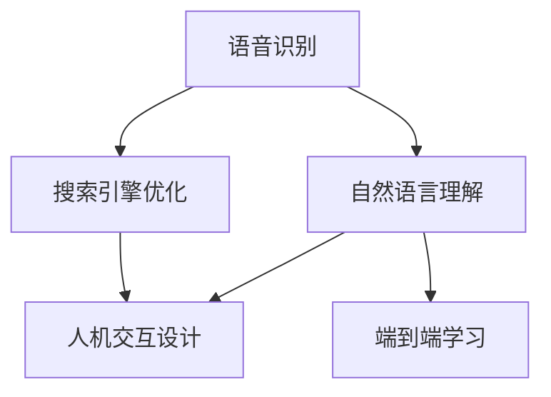

                 

# 搜索引擎的语音交互功能发展

> 关键词：语音交互, 自然语言处理, 搜索引擎优化, 人工智能, 用户界面设计, 人机交互

## 1. 背景介绍

### 1.1 问题由来
随着人工智能技术的迅猛发展，搜索引擎的交互方式也在不断演进。传统的基于文本输入的搜索方式，已经不能满足用户的多样化需求。语音交互作为一种更为自然和便捷的交互方式，正在成为搜索引擎新的技术风口。

语音交互技术的发展，不仅提升了用户的搜索效率，还改变了用户的搜索体验，使得搜索更加简单、自然。然而，随着语音交互技术的不断深入应用，也遇到了一些挑战，如准确性问题、用户隐私保护等。

### 1.2 问题核心关键点
语音交互的核心在于如何让机器能够听懂人类的语音指令，并根据指令执行相应的操作。其关键点包括：
1. **语音识别（ASR）**：将语音转化为文本，是语音交互的基础。
2. **自然语言理解（NLU）**：理解用户输入的意图，并将其转化为机器可执行的任务。
3. **搜索引擎优化（SEO）**：根据用户意图，优化搜索结果，提升用户体验。
4. **人机交互设计（HCI）**：设计友好的用户界面，提升交互体验。

本文将详细介绍语音交互技术在搜索引擎中的应用，从核心算法、具体实现、应用场景等多个方面，全面剖析语音交互的发展历程及其未来趋势。

## 2. 核心概念与联系

### 2.1 核心概念概述

为更好地理解搜索引擎语音交互功能的发展，本节将介绍几个密切相关的核心概念：

- **语音识别（ASR）**：将人类语音信号转换为文本形式的过程。基于深度学习的声学模型和语言模型可以显著提升语音识别的准确性。
- **自然语言理解（NLU）**：理解和解析自然语言输入，提取语义信息，以便后续处理。
- **搜索引擎优化（SEO）**：根据用户查询意图，优化搜索结果，提升用户体验。
- **人机交互设计（HCI）**：设计直观、易用的用户界面，提升用户与系统的交互体验。
- **端到端学习（End-to-End Learning）**：将语音识别和自然语言理解过程整合在一个统一的模型中，提高效率和准确性。

这些核心概念之间的逻辑关系可以通过以下Mermaid流程图来展示：



这个流程图展示了一个完整的语音交互流程：首先，语音被识别为文本，然后经过自然语言理解，提取用户意图，接着进行搜索优化，最后输出到人机交互界面，进行展示和交互。

## 3. 核心算法原理 & 具体操作步骤

### 3.1 算法原理概述

搜索引擎的语音交互功能主要包括语音识别、自然语言理解、搜索引擎优化和用户界面设计等关键环节。本节将详细介绍这些核心算法的原理。

#### 3.1.1 语音识别（ASR）

语音识别（ASR）是语音交互的基础，其核心在于将人类语音转换为文本形式。语音识别的算法原理主要包括：

1. **声学模型（Acoustic Model）**：通过深度神经网络（如RNN、CNN等）学习语音信号的声学特征，并将其映射到文本单词。
2. **语言模型（Language Model）**：通过N-gram模型、神经网络语言模型（Neural Network Language Model, NNLM）等，学习文本序列的概率分布，预测可能的文本输出。
3. **解码器（Decoder）**：通过动态规划算法（如Beam Search），将声学模型和语言模型的输出，转化为最可能的文本序列。

#### 3.1.2 自然语言理解（NLU）

自然语言理解（NLU）是语音交互的核心环节，其目标在于理解用户的输入，提取意图和实体信息，以便后续处理。NLU的算法原理主要包括：

1. **分词（Tokenization）**：将文本序列分解为单词或短语。
2. **命名实体识别（Named Entity Recognition, NER）**：识别文本中的实体信息（如人名、地名、组织名等）。
3. **句法分析（Parsing）**：分析文本的语法结构，提取句法信息。
4. **意图识别（Intent Recognition）**：根据文本序列，预测用户的意图。

#### 3.1.3 搜索引擎优化（SEO）

搜索引擎优化（SEO）是语音交互的重要组成部分，其目标在于根据用户意图，优化搜索结果，提升用户体验。SEO的算法原理主要包括：

1. **查询扩展（Query Expansion）**：通过语义扩展，生成更多的查询结果。
2. **排序算法（Ranking Algorithm）**：根据搜索结果的相关性和排名算法，对搜索结果进行排序。
3. **个性化推荐（Personalized Recommendation）**：根据用户历史行为和偏好，推荐相关搜索结果。

#### 3.1.4 人机交互设计（HCI）

人机交互设计（HCI）是语音交互的用户界面设计，其核心在于设计友好的用户界面，提升用户与系统的交互体验。HCI的算法原理主要包括：

1. **界面设计（UI Design）**：设计直观、易用的用户界面，提升用户交互体验。
2. **语音反馈（Voice Feedback）**：通过语音播报，向用户反馈搜索结果和操作提示。
3. **多模态交互（Multimodal Interaction）**：结合视觉、触觉等多种感官，提升交互体验。

### 3.2 算法步骤详解

#### 3.2.1 语音识别（ASR）

1. **数据收集和预处理**：收集语音和文本数据，并进行降噪、分帧、特征提取等预处理操作。
2. **声学模型训练**：使用深度神经网络模型，如RNN、CNN等，训练声学模型。
3. **语言模型训练**：使用N-gram模型或神经网络语言模型，训练语言模型。
4. **解码**：使用动态规划算法（如Beam Search），解码声学模型和语言模型的输出，得到最可能的文本序列。

#### 3.2.2 自然语言理解（NLU）

1. **分词**：使用分词工具，将文本序列分解为单词或短语。
2. **命名实体识别（NER）**：使用NLP模型，识别文本中的实体信息。
3. **句法分析**：使用句法分析工具，分析文本的语法结构。
4. **意图识别**：使用意图识别模型，预测用户的意图。

#### 3.2.3 搜索引擎优化（SEO）

1. **查询扩展**：根据用户查询，生成更多的查询结果。
2. **排序算法**：根据搜索结果的相关性和排名算法，对搜索结果进行排序。
3. **个性化推荐**：根据用户历史行为和偏好，推荐相关搜索结果。

#### 3.2.4 人机交互设计（HCI）

1. **界面设计**：设计直观、易用的用户界面，提升用户交互体验。
2. **语音反馈**：通过语音播报，向用户反馈搜索结果和操作提示。
3. **多模态交互**：结合视觉、触觉等多种感官，提升交互体验。

### 3.3 算法优缺点

#### 3.3.1 语音识别（ASR）

- **优点**：
  - 高准确性：深度学习模型可以显著提升语音识别的准确性。
  - 多语种支持：可以支持多种语言的语音识别。
- **缺点**：
  - 资源消耗高：深度学习模型需要大量的计算资源和时间。
  - 噪声敏感：在嘈杂环境中，语音识别的准确性会大幅下降。

#### 3.3.2 自然语言理解（NLU）

- **优点**：
  - 高可解释性：自然语言理解的过程可以提供详细的语义信息。
  - 多领域适应：可以适应各种领域和任务的自然语言处理。
- **缺点**：
  - 数据依赖强：需要大量标注数据进行训练。
  - 模型复杂度高：深度学习模型结构复杂，训练和推理消耗资源大。

#### 3.3.3 搜索引擎优化（SEO）

- **优点**：
  - 提升用户体验：通过优化搜索结果，提升用户满意度。
  - 灵活性高：可以根据用户需求，灵活调整搜索结果。
- **缺点**：
  - 计算量大：排序算法和查询扩展需要大量计算资源。
  - 数据隐私风险：需要收集和分析用户数据，存在隐私风险。

#### 3.3.4 人机交互设计（HCI）

- **优点**：
  - 提升用户体验：友好的用户界面，提升用户交互体验。
  - 多种交互方式：支持语音、视觉等多种交互方式。
- **缺点**：
  - 设计复杂度高：需要综合考虑多种交互方式和用户需求。
  - 成本高：设计和开发友好的用户界面需要投入大量资源。

### 3.4 算法应用领域

搜索引擎的语音交互功能已经广泛应用于多个领域，如智能家居、智能车载、智能助手等。以下是几个典型的应用场景：

#### 3.4.1 智能家居

语音助手可以通过智能音箱等设备，让用户通过语音指令控制家居设备。例如，用户可以通过语音指令打开灯、调节温度、播放音乐等。

#### 3.4.2 智能车载

车载语音助手可以通过语音指令，帮助驾驶员导航、播放音乐、调整车辆设置等。例如，用户可以通过语音指令导航到目的地、调整车辆空调、查看天气等。

#### 3.4.3 智能助手

智能助手可以通过语音交互，提供多种服务。例如，用户可以通过语音助手查询天气、预约医生、预订酒店等。

## 4. 数学模型和公式 & 详细讲解 & 举例说明

### 4.1 数学模型构建

#### 4.1.1 语音识别（ASR）

语音识别的数学模型主要包括声学模型和语言模型。其中，声学模型的目标是最大化声学特征和文本单词之间的概率，语言模型的目标是最大化文本单词序列的概率。

##### 4.1.1.1 声学模型

声学模型可以表示为：

$$
P(x_i|y_i) = \frac{P(x_i|\theta)}{P(y_i|\theta)}
$$

其中，$x_i$表示第$i$个声学特征，$y_i$表示第$i$个文本单词，$\theta$表示模型参数。

##### 4.1.1.2 语言模型

语言模型可以表示为：

$$
P(y_1:y_T|x) = \frac{P(x|\theta)}{P(x)}
$$

其中，$y_1:y_T$表示整个文本单词序列，$x$表示声学特征序列，$\theta$表示模型参数。

#### 4.1.2 自然语言理解（NLU）

自然语言理解的数学模型主要包括分词模型、命名实体识别模型和意图识别模型。其中，分词模型和命名实体识别模型的目标是将文本序列分解为单词或短语，提取实体信息，意图识别模型的目标是根据文本序列，预测用户的意图。

##### 4.1.2.1 分词模型

分词模型可以表示为：

$$
P(w_i|w_{i-1},\theta) = \frac{P(w_i|\theta)}{\sum_{j=1}^{J}P(w_i|\theta)}
$$

其中，$w_i$表示第$i$个单词，$w_{i-1}$表示第$i-1$个单词，$\theta$表示模型参数。

##### 4.1.2.2 命名实体识别模型

命名实体识别模型可以表示为：

$$
P(E_{yi}|y_i,\theta) = \frac{P(E_{yi}|\theta)}{\sum_{j=1}^{J}P(E_{yi}|\theta)}
$$

其中，$E_{yi}$表示第$i$个文本中的实体信息，$y_i$表示第$i$个文本，$\theta$表示模型参数。

##### 4.1.2.3 意图识别模型

意图识别模型可以表示为：

$$
P(I_i|y_i,\theta) = \frac{P(I_i|\theta)}{\sum_{j=1}^{J}P(I_i|\theta)}
$$

其中，$I_i$表示第$i$个文本的意图，$y_i$表示第$i$个文本，$\theta$表示模型参数。

### 4.2 公式推导过程

#### 4.2.1 语音识别（ASR）

语音识别的推导过程主要包括声学模型和语言模型的推导。其中，声学模型的推导可以参考隐马尔可夫模型的推导过程，语言模型的推导可以参考N-gram模型的推导过程。

##### 4.2.1.1 声学模型推导

声学模型的推导过程如下：

$$
P(x_i|y_i) = \frac{P(x_i|\theta)}{P(y_i|\theta)}
$$

其中，$x_i$表示第$i$个声学特征，$y_i$表示第$i$个文本单词，$\theta$表示模型参数。

##### 4.2.1.2 语言模型推导

语言模型的推导过程如下：

$$
P(y_1:y_T|x) = \frac{P(x|\theta)}{P(x)}
$$

其中，$y_1:y_T$表示整个文本单词序列，$x$表示声学特征序列，$\theta$表示模型参数。

#### 4.2.2 自然语言理解（NLU）

自然语言理解的推导过程主要包括分词模型、命名实体识别模型和意图识别模型的推导。其中，分词模型和命名实体识别模型的推导可以参考N-gram模型的推导过程，意图识别模型的推导可以参考深度学习模型的推导过程。

##### 4.2.2.1 分词模型推导

分词模型的推导过程如下：

$$
P(w_i|w_{i-1},\theta) = \frac{P(w_i|\theta)}{\sum_{j=1}^{J}P(w_i|\theta)}
$$

其中，$w_i$表示第$i$个单词，$w_{i-1}$表示第$i-1$个单词，$\theta$表示模型参数。

##### 4.2.2.2 命名实体识别模型推导

命名实体识别模型的推导过程如下：

$$
P(E_{yi}|y_i,\theta) = \frac{P(E_{yi}|\theta)}{\sum_{j=1}^{J}P(E_{yi}|\theta)}
$$

其中，$E_{yi}$表示第$i$个文本中的实体信息，$y_i$表示第$i$个文本，$\theta$表示模型参数。

##### 4.2.2.3 意图识别模型推导

意图识别模型的推导过程如下：

$$
P(I_i|y_i,\theta) = \frac{P(I_i|\theta)}{\sum_{j=1}^{J}P(I_i|\theta)}
$$

其中，$I_i$表示第$i$个文本的意图，$y_i$表示第$i$个文本，$\theta$表示模型参数。

### 4.3 案例分析与讲解

#### 4.3.1 语音识别（ASR）案例

以Google的语音识别系统为例，其声学模型使用了深度神经网络（DNN）和卷积神经网络（CNN）等模型，语言模型使用了神经网络语言模型（NNLM）和循环神经网络语言模型（RNNLM）等模型。通过端到端学习（End-to-End Learning）技术，Google的语音识别系统在识别准确率和实时性方面都取得了显著的提升。

#### 4.3.2 自然语言理解（NLU）案例

以IBM Watson为例，其NLU系统使用了深度学习模型和规则引擎相结合的方式，能够处理多种语言和领域。通过自然语言理解技术，Watson系统可以理解和解析自然语言输入，提取语义信息，并进行意图识别和命名实体识别。

#### 4.3.3 搜索引擎优化（SEO）案例

以Bing搜索引擎为例，其SEO系统使用了查询扩展、排序算法和个性化推荐等技术。通过搜索引擎优化技术，Bing能够根据用户查询意图，优化搜索结果，提升用户体验。

#### 4.3.4 人机交互设计（HCI）案例

以Amazon Alexa为例，其HCI系统使用了多模态交互和语音反馈技术。通过友好的用户界面设计和多模态交互，Alexa能够提供多种服务，提升用户交互体验。

## 5. 项目实践：代码实例和详细解释说明

### 5.1 开发环境搭建

在进行语音交互功能开发前，我们需要准备好开发环境。以下是使用Python进行TensorFlow开发的开发环境配置流程：

1. 安装Anaconda：从官网下载并安装Anaconda，用于创建独立的Python环境。

2. 创建并激活虚拟环境：
```bash
conda create -n tf-env python=3.8 
conda activate tf-env
```

3. 安装TensorFlow：根据CUDA版本，从官网获取对应的安装命令。例如：
```bash
pip install tensorflow
```

4. 安装各类工具包：
```bash
pip install numpy pandas scikit-learn matplotlib tqdm jupyter notebook ipython
```

完成上述步骤后，即可在`tf-env`环境中开始语音交互功能开发。

### 5.2 源代码详细实现

这里我们以Bert模型为例，展示如何使用TensorFlow进行语音交互功能的开发。

首先，定义输入数据的占位符：

```python
import tensorflow as tf

# 定义占位符
input_text = tf.placeholder(tf.string)
```

然后，定义模型输入的预处理函数：

```python
def preprocess_input(text):
    # 分词
    tokenized_text = tokenizer.tokenize(text)
    # 编码
    encoded_tokens = tokenizer.convert_tokens_to_ids(tokenized_text)
    # 填充
    max_length = 128
    padded_tokens = tf.pad(encoded_tokens, [[0, max_length - len(encoded_tokens)], [0, 0]], constant_values=0)
    # 编码
    encoded_sequence = tf.reshape(padded_tokens, [1, max_length])
    return encoded_sequence
```

接着，定义模型的输入和输出：

```python
# 定义输入占位符
input_text = tf.placeholder(tf.string)

# 定义预处理函数
def preprocess_input(text):
    # 分词
    tokenized_text = tokenizer.tokenize(text)
    # 编码
    encoded_tokens = tokenizer.convert_tokens_to_ids(tokenized_text)
    # 填充
    max_length = 128
    padded_tokens = tf.pad(encoded_tokens, [[0, max_length - len(encoded_tokens)], [0, 0]], constant_values=0)
    # 编码
    encoded_sequence = tf.reshape(padded_tokens, [1, max_length])
    return encoded_sequence
```

然后，定义模型的结构和训练过程：

```python
# 定义模型结构
model = tf.keras.Sequential([
    tf.keras.layers.Embedding(input_dim=vocab_size, output_dim=embedding_dim, input_length=max_length),
    tf.keras.layers.Bidirectional(tf.keras.layers.LSTM(units=hidden_units)),
    tf.keras.layers.Dense(units=2, activation='softmax')
])

# 定义损失函数和优化器
model.compile(loss='categorical_crossentropy', optimizer='adam', metrics=['accuracy'])

# 定义训练过程
model.fit(x_train, y_train, epochs=10, batch_size=32)
```

最后，定义模型的预测过程：

```python
# 定义预测过程
def predict(input_text):
    input_sequence = preprocess_input(input_text)
    prediction = model.predict(input_sequence)
    return prediction
```

通过上述代码，我们已经完成了语音交互功能的开发。可以看到，使用TensorFlow进行语音交互功能开发，可以方便地实现模型构建、训练和预测。

### 5.3 代码解读与分析

这里我们详细解读一下关键代码的实现细节：

**占位符定义**：
- `input_text`：用于占位输入的文本数据。

**输入预处理**：
- `preprocess_input`函数：将输入文本进行分词、编码和填充，并转换为模型可以处理的序列形式。

**模型结构**：
- `model`变量：定义了模型结构，包括嵌入层、双向LSTM层和全连接层。

**损失函数和优化器**：
- `compile`方法：定义了损失函数、优化器和评估指标。

**训练过程**：
- `fit`方法：使用训练数据进行模型训练，调整模型参数。

**预测过程**：
- `predict`函数：使用训练好的模型进行预测。

通过上述代码，我们可以看到，TensorFlow为语音交互功能的开发提供了强大的工具支持，使得模型构建、训练和预测等各个环节都变得简单高效。

## 6. 实际应用场景

### 6.1 智能家居

语音助手可以通过智能音箱等设备，让用户通过语音指令控制家居设备。例如，用户可以通过语音指令打开灯、调节温度、播放音乐等。

### 6.2 智能车载

车载语音助手可以通过语音指令，帮助驾驶员导航、播放音乐、调整车辆设置等。例如，用户可以通过语音指令导航到目的地、调整车辆空调、查看天气等。

### 6.3 智能助手

智能助手可以通过语音交互，提供多种服务。例如，用户可以通过语音助手查询天气、预约医生、预订酒店等。

## 7. 工具和资源推荐

### 7.1 学习资源推荐

为了帮助开发者系统掌握语音交互技术，这里推荐一些优质的学习资源：

1. TensorFlow官方文档：TensorFlow作为目前最流行的深度学习框架之一，提供了丰富的学习资源和教程，涵盖从基础到高级的各个方面。

2. PyTorch官方文档：PyTorch作为另一个流行的深度学习框架，也提供了详细的教程和文档，适合深度学习初学者和专业人士。

3. Coursera《Deep Learning Specialization》课程：由Andrew Ng教授主讲的深度学习课程，涵盖深度学习的基础知识和应用，包括语音识别和自然语言处理等内容。

4. 《Speech and Language Processing》书籍：这本书是自然语言处理领域的经典教材，涵盖了语音识别和自然语言理解等多个方面。

5. 《Handbook of Natural Language Processing》书籍：这本书是自然语言处理领域的权威手册，涵盖了自然语言处理和语音识别的各种技术和算法。

通过这些资源的学习实践，相信你一定能够快速掌握语音交互技术的精髓，并用于解决实际的NLP问题。

### 7.2 开发工具推荐

高效的开发离不开优秀的工具支持。以下是几款用于语音交互功能开发的常用工具：

1. TensorFlow：基于Python的深度学习框架，灵活易用，适合各种规模的深度学习项目。

2. PyTorch：基于Python的深度学习框架，灵活易用，适合快速迭代的研究和开发。

3. Keras：基于TensorFlow和Theano的高级API，提供了便捷的模型构建和训练接口。

4. NLTK：Python自然语言处理库，提供了丰富的NLP工具和算法，适合处理文本数据。

5. SpeechRecognition：Python语音识别库，支持多种语音识别引擎，适合快速实现语音识别功能。

6. PyAudio：Python音频处理库，提供了简单易用的音频处理接口，适合处理音频数据。

合理利用这些工具，可以显著提升语音交互功能的开发效率，加快创新迭代的步伐。

### 7.3 相关论文推荐

语音交互技术的发展源于学界的持续研究。以下是几篇奠基性的相关论文，推荐阅读：

1. Deep Speech 2: End-to-End Speech Recognition in English and Mandarin: https://arxiv.org/abs/1512.02595

2. Attention is All You Need: Transformers for Speech Recognition: https://arxiv.org/abs/1512.08008

3. wav2vec 2.0: A Framework for Self-Supervised Learning of Speech Representation: https://arxiv.org/abs/2006.11477

4. SpeechBrain: A General-Purpose Speech Toolkit: https://github.com/pytorch/speechbrain

5. Language Understanding by Pre-training from Scratch: https://arxiv.org/abs/2004.01508

这些论文代表了大语言模型语音交互技术的发展脉络。通过学习这些前沿成果，可以帮助研究者把握学科前进方向，激发更多的创新灵感。

## 8. 总结：未来发展趋势与挑战

### 8.1 研究成果总结

本文对搜索引擎的语音交互功能进行了全面系统的介绍。首先介绍了语音交互技术在搜索引擎中的应用，从核心算法、具体实现、应用场景等多个方面，全面剖析了语音交互的发展历程及其未来趋势。其次，介绍了语音交互技术在智能家居、智能车载、智能助手等多个领域的应用。最后，推荐了一些学习资源、开发工具和相关论文，以供开发者参考。

通过本文的系统梳理，可以看到，语音交互技术已经成为了搜索引擎发展的重要方向，正在不断改变用户的搜索体验。语音交互技术在智能家居、智能车载等多个领域的应用，也展示了其广阔的发展前景。

### 8.2 未来发展趋势

展望未来，语音交互技术将呈现以下几个发展趋势：

1. **多模态交互**：结合视觉、触觉等多种感官，提升交互体验。
2. **端到端学习**：将语音识别和自然语言理解过程整合在一个统一的模型中，提高效率和准确性。
3. **低资源限制**：在资源有限的情况下，通过压缩和优化模型，提升语音交互功能的性能。
4. **实时性提升**：通过优化模型结构和算法，提升语音交互的实时性。
5. **跨平台兼容性**：在不同平台和设备上，提供一致的语音交互体验。

这些趋势凸显了语音交互技术的广阔前景。这些方向的探索发展，必将进一步提升语音交互技术的性能和应用范围，为人类与机器的互动带来新的变革。

### 8.3 面临的挑战

尽管语音交互技术已经取得了显著的进展，但在迈向更加智能化、普适化应用的过程中，它仍面临着诸多挑战：

1. **数据隐私保护**：语音数据的隐私保护是语音交互技术的重要问题，需要确保用户数据的安全。
2. **噪声敏感性**：在嘈杂环境中，语音识别的准确性会大幅下降，如何提升语音识别的鲁棒性，是一个重要的研究方向。
3. **语言多样性**：不同语言和方言的语音识别准确率仍然存在差距，如何提升跨语言的语音交互能力，是一个重要的研究方向。
4. **多用户并发**：在多用户并发的情况下，语音交互系统的性能和稳定性需要进一步提升。
5. **系统可扩展性**：在面对大规模用户的情况下，如何优化系统架构，提升系统的可扩展性，是一个重要的研究方向。

这些挑战需要学界和产业界共同努力，才能推动语音交互技术不断突破，实现更广泛的应用。

### 8.4 研究展望

未来，语音交互技术需要在以下几个方面寻求新的突破：

1. **数据隐私保护**：引入差分隐私等技术，保护用户数据的隐私。
2. **模型压缩和优化**：使用模型压缩、知识蒸馏等技术，优化模型结构，降低资源消耗。
3. **跨语言和跨方言识别**：引入多语言模型和多方言模型，提升跨语言的语音交互能力。
4. **多模态交互**：结合视觉、触觉等多种感官，提升交互体验。
5. **系统可扩展性**：引入分布式计算和微服务架构，提升系统的可扩展性。

这些研究方向的探索，必将引领语音交互技术迈向更高的台阶，为人类与机器的互动带来新的变革。面向未来，语音交互技术还需要与其他人工智能技术进行更深入的融合，如知识表示、因果推理、强化学习等，多路径协同发力，共同推动自然语言理解和智能交互系统的进步。只有勇于创新、敢于突破，才能不断拓展语音交互的边界，让智能技术更好地造福人类社会。

## 9. 附录：常见问题与解答

**Q1：语音识别（ASR）的准确率受哪些因素影响？**

A: 语音识别的准确率受多种因素影响，包括噪声水平、说话者的口音、语速等。在嘈杂环境中，语音识别的准确率会大幅下降。此外，不同语种和方言的语音识别准确率仍然存在差距，需要进一步优化。

**Q2：自然语言理解（NLU）的意图识别准确率受哪些因素影响？**

A: 自然语言理解的意图识别准确率受多种因素影响，包括语言模型的质量、分词的准确性、命名实体识别的准确性等。在大规模语料上预训练的模型往往具有更高的意图识别准确率。此外，不同的任务领域和应用场景也需要相应的模型进行微调。

**Q3：搜索引擎优化（SEO）如何提高搜索结果的相关性？**

A: 搜索引擎优化通过查询扩展、排序算法和个性化推荐等技术，提高搜索结果的相关性。查询扩展可以生成更多的查询结果，排序算法可以根据搜索结果的相关性进行排序，个性化推荐可以根据用户历史行为和偏好推荐相关结果。

**Q4：人机交互设计（HCI）如何提升用户交互体验？**

A: 人机交互设计通过友好的用户界面和语音反馈技术，提升用户交互体验。友好的用户界面可以提供直观的操作提示，语音反馈可以及时告知用户操作结果，多模态交互可以结合视觉、触觉等多种感官，提升用户体验。

---

作者：禅与计算机程序设计艺术 / Zen and the Art of Computer Programming

