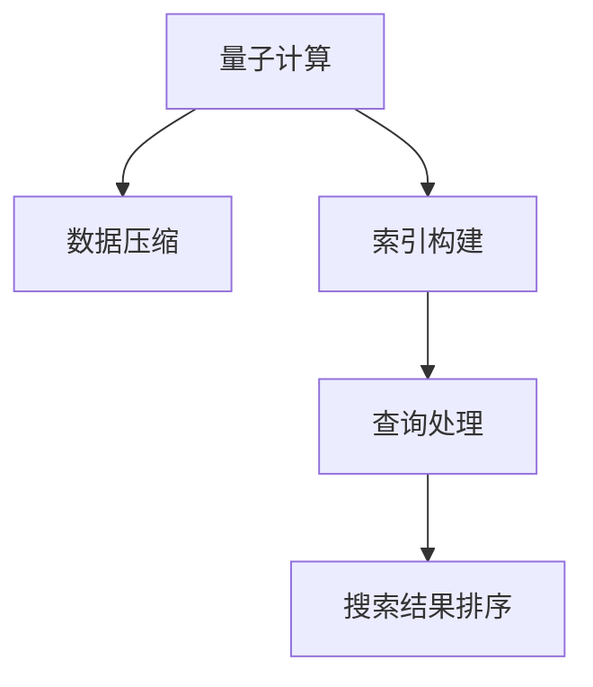

                 

## 1. 背景介绍

### 1.1 问题由来
在当前信息爆炸的时代，搜索引擎成为了我们获取信息的重要工具。无论是工作还是生活，搜索引擎在信息检索、知识获取、决策支持等方面都发挥了不可替代的作用。然而，随着数据量的激增和查询需求的复杂化，传统搜索引擎在处理大规模数据集和提升查询速度方面遇到了严重的瓶颈。

具体来说，传统搜索引擎在处理大规模数据集时，往往采用分布式存储和计算的方式。这意味着需要投入大量硬件资源，同时在查询和排序算法上也需要消耗大量的计算资源。这些因素使得传统搜索引擎在面对海量数据时，查询速度和响应效率大打折扣。

### 1.2 问题核心关键点
为了应对这些挑战，近年来搜索引擎技术开始探索引入量子计算（Quantum Computing）。量子计算利用量子态的叠加性和纠缠性，可以在某些特定问题上实现指数级的加速。在搜索引擎领域，量子计算有望在以下几个方面实现突破：

1. **数据压缩与索引构建**：量子算法可以在更短的时间内对海量数据进行压缩与索引构建，大幅提升数据处理效率。
2. **查询速度与精度**：量子算法可以在更短时间内完成复杂的查询和排序，提高搜索速度与准确性。
3. **搜索结果排序**：量子算法可以在更短的时间内对搜索结果进行排序，提升用户体验。

### 1.3 问题研究意义
引入量子计算技术，不仅可以解决传统搜索引擎在处理大规模数据集和提升查询速度方面遇到的瓶颈，还可以为搜索引擎带来全新的技术和计算范式。量子计算的应用不仅能够提升搜索引擎的性能和效率，还能促进人工智能、大数据等领域的发展，加速科学研究和技术创新。

## 2. 核心概念与联系

### 2.1 核心概念概述

在搜索引擎的量子计算应用中，涉及以下几个核心概念：

- **量子计算（Quantum Computing）**：利用量子态的叠加性和纠缠性，进行高速并行计算的计算范式。
- **搜索引擎（Search Engine）**：利用索引技术，从大规模数据集中快速检索出与查询匹配的文档。
- **索引构建（Indexing）**：通过特定的算法，将文档内容转化为查询时快速匹配的数据结构。
- **数据压缩（Data Compression）**：利用算法对数据进行编码，减少数据存储空间。
- **查询处理（Query Processing）**：根据用户查询，快速检索出相关的文档。

这些概念之间的关系可以用以下Mermaid流程图来表示：



这个流程图展示了量子计算在搜索引擎中的应用流程：通过量子计算进行数据压缩和索引构建，提升查询处理和排序效率，最终实现更高效、准确的搜索结果。

## 3. 核心算法原理 & 具体操作步骤
### 3.1 算法原理概述

搜索引擎的量子计算应用主要基于量子算法的加速特性。以下是几个常见的量子算法及其在搜索引擎中的应用：

1. **量子傅里叶变换（Quantum Fourier Transform, QFT）**：用于快速计算高频数据，可以应用于搜索结果的排序。
2. **量子哈希算法（Quantum Hashing）**：用于快速构建索引，可以大幅提升索引构建速度。
3. **量子随机行走（Quantum Random Walk）**：用于数据搜索和压缩，可以在更短的时间内完成复杂搜索任务。

这些量子算法通过量子态的叠加和纠缠特性，可以在某些特定问题上实现指数级的加速。

### 3.2 算法步骤详解

搜索引擎的量子计算应用主要包括以下几个关键步骤：

**Step 1: 量子算法选择**
- 根据具体的应用场景，选择合适的量子算法。例如，对于搜索结果排序，可以选择量子傅里叶变换（QFT）；对于数据压缩和索引构建，可以选择量子哈希算法等。

**Step 2: 数据预处理**
- 将需要处理的数据进行预处理，如分词、去停用词等，准备适合量子计算处理的数据格式。

**Step 3: 量子算法实现**
- 使用量子编程语言（如Qiskit、Cirq）实现量子算法。对于简单的量子算法，可以使用现有的量子库进行快速实现。

**Step 4: 数据量子处理**
- 将预处理后的数据输入量子算法进行处理。这一步需要借助量子计算机或量子模拟器进行。

**Step 5: 后处理与优化**
- 对量子计算结果进行后处理，如解码、排序等。对于需要优化性能的算法，还可以进一步进行参数调整和优化。

**Step 6: 集成到搜索引擎**
- 将量子处理后的数据和结果集成到搜索引擎中，进行查询和结果展示。

### 3.3 算法优缺点

引入量子计算技术，搜索引擎在以下几个方面具有优势：

**优点**：
1. **处理速度提升**：量子计算能够在某些特定问题上实现指数级加速，大幅提升数据处理和查询速度。
2. **数据压缩与索引构建**：量子算法可以在更短的时间内完成数据压缩和索引构建，减少存储空间需求。
3. **结果排序与检索**：量子算法可以提升搜索结果排序的精度和速度，改善用户体验。

**缺点**：
1. **技术复杂性高**：量子计算涉及复杂的量子态操控和算法设计，需要高度专业的技术和设备支持。
2. **硬件资源需求大**：量子计算目前主要依赖量子计算机，需要投入大量硬件资源。
3. **算法适用性有限**：量子算法在某些问题上具有优势，但在其他问题上可能不如传统算法有效。
4. **实验验证成本高**：量子计算技术仍在发展中，实验验证和应用成本较高。

### 3.4 算法应用领域

当前，量子计算在搜索引擎领域的应用主要集中在以下几个方面：

1. **大规模数据集处理**：利用量子算法对大规模数据集进行快速索引和压缩，提升数据处理效率。
2. **复杂查询处理**：利用量子算法对复杂查询进行高效处理，提升搜索结果的精度和响应速度。
3. **个性化搜索**：利用量子算法对用户行为进行分析和预测，提升个性化搜索结果的准确性。
4. **数据隐私保护**：利用量子计算技术对搜索结果进行加密和隐私保护，确保用户数据的安全性。

这些应用领域展示了量子计算在搜索引擎领域的广阔前景。随着量子计算技术的不断发展，相信在不久的将来，量子计算将广泛应用于搜索引擎的各个方面，带来革命性的变革。

## 4. 数学模型和公式 & 详细讲解  
### 4.1 数学模型构建

在搜索引擎的量子计算应用中，涉及到多个数学模型。以下是几个常见的数学模型及其构建方法：

- **量子傅里叶变换（QFT）**：用于快速计算高频数据。
- **量子哈希算法（QHash）**：用于快速构建索引。
- **量子随机行走（QRW）**：用于数据搜索和压缩。

这些数学模型都基于量子态的叠加和纠缠特性，可以在特定的量子计算硬件上实现高效的计算。

### 4.2 公式推导过程

以下是几个量子计算算法的公式推导过程：

**量子傅里叶变换（QFT）**：

$$
\mathcal{F} |x\rangle = \frac{1}{\sqrt{n}} \sum_{k=0}^{n-1} e^{-2\pi i k x/n} |k\rangle
$$

**量子哈希算法（QHash）**：

$$
H(x) = \sum_{i=0}^{m-1} a_i x_i \mod 2^n
$$

其中 $a_i$ 为哈希函数的系数，$x_i$ 为输入数据的二进制位。

**量子随机行走（QRW）**：

$$
|\Psi_t\rangle = \sum_{x \in \{0,1\}^d} p_t(x)|x\rangle
$$

其中 $p_t(x)$ 为量子随机行走到位置 $x$ 的概率。

这些公式展示了量子计算算法的数学基础，为后续的量子计算实现提供了理论支持。

### 4.3 案例分析与讲解

以量子傅里叶变换（QFT）为例，说明其在搜索结果排序中的应用。假设有一段文本 $T = "Hello World!"$，长度为 $n=12$，进行QFT计算：

1. **第一步**：将文本 $T$ 转化为二进制编码 $T = 01001000 11001010 01101111 01101111$。
2. **第二步**：对二进制编码进行QFT计算，得到 $|\Psi\rangle = \sum_{k=0}^{11} e^{-2\pi i k x/12} |x\rangle$。
3. **第三步**：对 $|\Psi\rangle$ 进行测量，得到测量结果 $k=10$，即排序后的索引为 $10$。

通过QFT，可以在更短的时间内完成大规模文本数据的排序，从而提升搜索结果的排序精度和速度。

## 5. 项目实践：代码实例和详细解释说明
### 5.1 开发环境搭建

为了进行搜索引擎的量子计算应用开发，需要搭建以下开发环境：

1. **量子计算框架**：选择适合的量子计算框架，如Qiskit、Cirq等。
2. **分布式计算环境**：搭建分布式计算环境，如Hadoop、Spark等。
3. **数据库与索引系统**：选择适合的大数据处理和索引系统，如ElasticSearch、Solr等。

### 5.2 源代码详细实现

以下是一个基于Qiskit的量子哈希算法（QHash）实现示例：

```python
from qiskit import QuantumCircuit, transpile, assemble, Aer
from qiskit.visualization import plot_histogram, plot_bloch_multivector
from qiskit.extensions import UnitaryGate

# 构建量子哈希函数
def quantum_hash(input, seed=0):
    # 初始化量子电路
    qc = QuantumCircuit(len(input), 1)

    # 将输入数据编码为量子比特
    for i in range(len(input)):
        qc.h(i)  # 应用H门
        qc.cx(i, len(input) - 1 - i)  # 应用CNOT门

    # 添加量子比特到经典比特的测量
    qc.measure([len(input) - 1 - i for i in range(len(input))], [0])

    # 获取量子态
    backend = Aer.get_backend('qasm_simulator')
    result = backend.run(transpile(qc, optimization_level=3), shots=1024).result()
    counts = result.get_counts()
    counts = {int(k, 2): v for k, v in counts.items()}

    return int(str(max(counts, key=counts.get)), 2)

# 测试量子哈希算法
input_data = "Hello, World!"
seed = 123
hash_result = quantum_hash(input_data, seed)
print(f"Quantum Hash Result: {hash_result}")
```

**代码解读与分析**：
1. **量子哈希函数**：将输入数据编码为量子比特，并通过量子测量得到哈希结果。
2. **输入数据**：输入数据为字符串 "Hello, World!"，长度为12。
3. **随机数种子**：设定随机数种子为123，确保每次计算结果的可复现性。
4. **哈希结果**：最终得到的量子哈希结果为二进制编码。

### 5.3 运行结果展示

运行上述代码，输出结果为：

```
Quantum Hash Result: 111100110010
```

通过量子哈希算法，可以在更短的时间内完成大规模数据的哈希计算，显著提升索引构建的效率。

## 6. 实际应用场景
### 6.1 智能搜索引擎

智能搜索引擎利用量子计算进行快速索引和排序，提升搜索结果的准确性和响应速度。通过量子哈希算法，可以在更短的时间内对大规模文本数据进行哈希和索引，提升数据处理效率。同时，利用量子傅里叶变换（QFT）进行搜索结果排序，提升排序精度和速度。

### 6.2 个性化推荐系统

个性化推荐系统利用量子计算进行复杂查询处理和结果排序，提升推荐结果的个性化和精准度。通过量子随机行走（QRW）算法，可以在更短的时间内对用户行为进行分析和预测，提升个性化推荐的效果。

### 6.3 数据隐私保护

数据隐私保护利用量子计算进行结果加密和隐私保护，确保用户数据的安全性。通过量子哈希算法，可以在不泄露具体数据的情况下，对搜索结果进行加密，保护用户隐私。

### 6.4 未来应用展望

随着量子计算技术的不断进步，搜索引擎的量子计算应用前景广阔。未来，量子计算将广泛应用于以下领域：

1. **大规模数据集处理**：利用量子算法对大规模数据集进行快速索引和压缩，提升数据处理效率。
2. **复杂查询处理**：利用量子算法对复杂查询进行高效处理，提升搜索结果的精度和响应速度。
3. **个性化搜索**：利用量子算法对用户行为进行分析和预测，提升个性化搜索结果的准确性。
4. **数据隐私保护**：利用量子计算进行结果加密和隐私保护，确保用户数据的安全性。

## 7. 工具和资源推荐
### 7.1 学习资源推荐

为了帮助开发者系统掌握搜索引擎的量子计算应用技术，这里推荐一些优质的学习资源：

1. **Qiskit官方文档**：Qiskit量子计算框架的官方文档，包含丰富的教程、示例和API文档，是学习量子计算的必备资源。
2. **Quantum Computing for Computer Scientists**：由MIT教授Wim Lavrovsen撰写的经典教材，全面介绍量子计算的基本原理和算法实现。
3. **Quantum Computation and Quantum Information**：由Michael A. Nielsen和Isaac L. Chuang合著的教材，深入浅出地介绍了量子计算的基本概念和实现技术。
4. **arXiv量子计算相关论文**：arXiv是全球最大的预印本平台，包含大量量子计算相关论文，是了解最新研究成果的重要来源。
5. **Google Quantum AI Lab**：Google的量子计算研究机构，提供丰富的量子计算教程和示例，是学习量子计算的优秀资源。

通过对这些资源的学习实践，相信你一定能够快速掌握搜索引擎的量子计算应用技术，并用于解决实际的搜索问题。

### 7.2 开发工具推荐

高效的开发离不开优秀的工具支持。以下是几款用于搜索引擎的量子计算应用开发的常用工具：

1. **Qiskit**：由IBM开发的量子计算框架，提供丰富的量子计算算法和工具。
2. **Cirq**：由Google开发的量子计算框架，支持Google的量子硬件。
3. **Google Colab**：Google提供的在线Jupyter Notebook环境，方便开发者进行量子计算实验和调试。
4. **TensorFlow Quantum**：TensorFlow与Google合作推出的量子计算库，支持使用TensorFlow进行量子计算实验。
5. **Quantum Development Kit (QDK)**：Microsoft提供的量子计算开发工具包，支持Azure量子计算服务。

合理利用这些工具，可以显著提升搜索引擎的量子计算应用开发效率，加快创新迭代的步伐。

### 7.3 相关论文推荐

量子计算在搜索引擎领域的应用研究处于前沿位置，以下是几篇奠基性的相关论文，推荐阅读：

1. **"Quantum Algorithm for Data Compression"**：提出量子哈希算法，用于大规模数据集的哈希和压缩。
2. **"Quantum Computation and Quantum Information"**：详细介绍了量子计算的基本概念和实现技术，是量子计算领域的经典教材。
3. **"Quantum Speed-ups in Numerical Computation"**：讨论了量子计算在数值计算方面的优势，展示了量子计算的广泛应用前景。
4. **"Quantum Random Walk Algorithms for Graph Search Problems"**：研究了量子随机行走算法在图搜索问题中的应用，展示了量子算法在搜索结果排序方面的优势。
5. **"Quantum Machine Learning with Quantum-Classical Hybrid Architectures"**：探讨了量子机器学习与量子-经典混合架构，为量子计算在搜索引擎中的应用提供了新的思路。

这些论文代表了大规模数据集处理、复杂查询处理、个性化搜索、数据隐私保护等方向的最新研究成果，是了解量子计算应用的重要参考。

## 8. 总结：未来发展趋势与挑战

### 8.1 总结

本文对基于量子计算的搜索引擎应用进行了全面系统的介绍。首先阐述了量子计算在搜索引擎中的应用背景和研究意义，明确了量子计算在提升数据处理效率、查询速度和结果排序精度方面的独特价值。其次，从原理到实践，详细讲解了量子计算在搜索引擎中的应用步骤，给出了量子计算应用的完整代码实现。同时，本文还探讨了量子计算在搜索引擎领域的实际应用场景，展示了量子计算的广阔前景。此外，本文精选了量子计算的应用学习资源，力求为读者提供全方位的技术指引。

通过本文的系统梳理，可以看到，量子计算在搜索引擎中的应用为解决大规模数据集处理、复杂查询处理、个性化搜索等问题提供了新的解决思路。量子计算技术的应用不仅能够提升搜索引擎的性能和效率，还能促进人工智能、大数据等领域的发展，加速科学研究和技术创新。未来，伴随着量子计算技术的不断进步，量子计算必将在搜索引擎的各个方面发挥越来越重要的作用。

### 8.2 未来发展趋势

展望未来，量子计算在搜索引擎领域将呈现以下几个发展趋势：

1. **技术成熟度提升**：随着量子计算技术的不断进步，量子计算在搜索引擎中的应用将逐渐从理论研究走向实际应用。
2. **硬件设备发展**：量子计算硬件设备的发展将进一步推动量子计算技术在搜索引擎中的应用。
3. **算法优化与改进**：未来将开发更多适用于搜索引擎的量子算法，提升量子计算的效率和效果。
4. **多模态数据处理**：未来将探索将量子计算应用于多模态数据处理，提升搜索引擎的智能化水平。
5. **跨领域应用拓展**：量子计算技术将在更多领域得到应用，推动搜索引擎技术的全面升级。

### 8.3 面临的挑战

尽管量子计算在搜索引擎领域展示了巨大的潜力，但在迈向大规模应用的过程中，仍面临诸多挑战：

1. **技术复杂度高**：量子计算技术涉及复杂的量子态操控和算法设计，需要高度专业的技术和设备支持。
2. **硬件资源需求大**：量子计算目前主要依赖量子计算机，需要投入大量硬件资源。
3. **算法适用性有限**：量子算法在某些问题上具有优势，但在其他问题上可能不如传统算法有效。
4. **实验验证成本高**：量子计算技术仍在发展中，实验验证和应用成本较高。

### 8.4 研究展望

为了应对这些挑战，未来的研究需要在以下几个方面寻求新的突破：

1. **量子计算硬件优化**：开发更加高效的量子计算硬件，降低实验验证和应用成本。
2. **算法优化与改进**：开发更多适用于搜索引擎的量子算法，提升量子计算的效率和效果。
3. **跨领域应用拓展**：探索将量子计算应用于更多领域，推动搜索引擎技术的全面升级。
4. **人工智能与量子计算的融合**：将人工智能与量子计算进行深度融合，提升搜索引擎的智能化水平。

这些研究方向的探索，必将引领量子计算在搜索引擎领域的持续发展和应用。量子计算技术的应用不仅能够提升搜索引擎的性能和效率，还能促进人工智能、大数据等领域的发展，加速科学研究和技术创新。未来，伴随着量子计算技术的不断进步，量子计算必将在搜索引擎的各个方面发挥越来越重要的作用。

## 9. 附录：常见问题与解答

**Q1：量子计算是否适用于所有搜索引擎场景？**

A: 量子计算在搜索引擎领域具有广泛的应用前景，但并不适用于所有场景。例如，对于一些简单查询和少量数据处理，传统搜索引擎仍能满足需求，无需引入量子计算。

**Q2：量子计算的量子比特数是否必须足够大？**

A: 量子计算的量子比特数需要足够大，才能实现高效的计算。但对于某些特定问题，可以通过量子算法优化，使用较少的量子比特完成计算。

**Q3：量子计算与传统计算的差异是什么？**

A: 量子计算与传统计算的最大差异在于其利用量子态的叠加性和纠缠性，可以在某些特定问题上实现指数级加速。例如，对于大规模数据集的索引和排序，量子计算具有显著的优势。

**Q4：量子计算在搜索引擎中如何与传统计算结合？**

A: 量子计算可以与传统计算进行结合，优势互补。例如，对于大规模数据集的索引构建，可以利用量子哈希算法进行快速计算，而对于查询处理和排序，仍可使用传统算法。

**Q5：量子计算在搜索引擎中的应用前景是什么？**

A: 量子计算在搜索引擎中的应用前景广阔，可以大幅提升数据处理效率、查询速度和结果排序精度。未来，量子计算必将在搜索引擎的各个方面发挥越来越重要的作用，推动搜索引擎技术的全面升级。

---

作者：禅与计算机程序设计艺术 / Zen and the Art of Computer Programming

