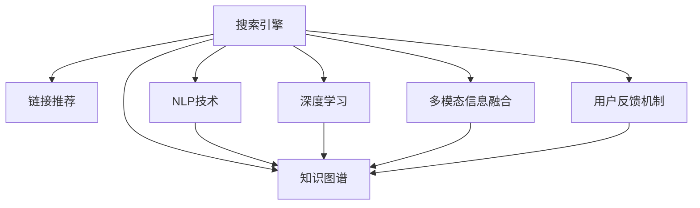

                 

# 搜索引擎革命：从链接到直接答案

> 关键词：搜索引擎,链接推荐,自然语言处理,知识图谱,深度学习,多模态信息融合

## 1. 背景介绍

### 1.1 问题由来

在互联网的早期，搜索引擎主要是基于关键词匹配的链接列表，用户需要手动点击一条条链接才能找到相关信息。随着数据量的增加和用户需求的复杂化，传统的关键词匹配方法逐渐显得力不从心。人们开始追求更加智能、个性化的信息检索方式，希望通过自然语言理解技术，直接从搜索结果中获取答案。

与此同时，大数据、深度学习等技术的快速发展，为搜索引擎的智能化转型提供了技术基础。当前，搜索引擎正逐步从基于链接的展示方式，向直接答案、知识图谱等多模态信息融合的展示方式转型，以期更加精准、高效地满足用户需求。

### 1.2 问题核心关键点

为了实现搜索引擎的革命性升级，主要涉及以下几个核心关键点：

1. **自然语言处理(NLP)**：通过理解用户的查询意图，准确检索相关的文档、网页。
2. **知识图谱(KG)**：构建语义化的实体关系图谱，帮助用户理解更加抽象、复杂的信息。
3. **深度学习(Deep Learning)**：利用深度神经网络模型，提取高层次的语义特征。
4. **多模态信息融合**：将文本、图像、视频等多源信息进行融合，提升搜索结果的相关性和准确性。
5. **用户反馈机制**：收集用户对搜索结果的反馈信息，不断优化模型和算法。

这些关键点相互关联，共同构成了下一代搜索引擎的核心技术框架。

## 2. 核心概念与联系

### 2.1 核心概念概述

为更好地理解搜索引擎的智能化升级，本节将介绍几个密切相关的核心概念：

- **搜索引擎**：基于数据库或Web索引，能够快速响应用户查询请求，返回相关文档或网页的信息检索系统。
- **链接推荐**：传统搜索引擎的主要展示方式，通过关键词匹配找到相关网页，并展示链接列表。
- **自然语言处理(NLP)**：通过理解自然语言，处理和生成文本信息的技术，是搜索引擎智能化升级的核心。
- **知识图谱(KG)**：语义化的实体关系图谱，通过RDF等结构化数据描述实体间的关系，支持更深层次的信息检索。
- **深度学习(Deep Learning)**：通过多层神经网络模型，自动学习高层次的语义特征，用于检索、分类等任务。
- **多模态信息融合**：将文本、图像、视频等多源信息进行融合，提升信息检索的全面性和准确性。
- **用户反馈机制**：通过用户对搜索结果的点击、评分等反馈信息，不断优化检索模型和算法。

这些核心概念之间的逻辑关系可以通过以下Mermaid流程图来展示：



这个流程图展示了这个关键概念之间的相互关系：

1. 搜索引擎是链接推荐、NLP技术、知识图谱、深度学习、多模态信息融合、用户反馈机制的综合体现。
2. 自然语言处理技术通过理解用户查询意图，辅助构建知识图谱和深度学习模型。
3. 知识图谱为深度学习模型提供语义化的实体关系，提升检索的精准度。
4. 深度学习模型自动提取高层次的语义特征，用于检索和分类等任务。
5. 多模态信息融合将不同模态的信息进行综合，提升搜索结果的相关性和全面性。
6. 用户反馈机制通过收集用户点击、评分等反馈信息，不断优化搜索模型和算法。

这些概念共同构成了下一代搜索引擎的技术框架，使其能够更加智能、全面地满足用户需求。

## 3. 核心算法原理 & 具体操作步骤
### 3.1 算法原理概述

下一代搜索引擎的核心算法原理，主要涉及以下几个关键环节：

1. **查询理解**：通过NLP技术，理解用户的查询意图，转化为结构化的查询表达式。
2. **文档检索**：利用深度学习模型，在语料库中进行文档检索，找到相关文档。
3. **知识图谱构建**：通过RDF等结构化数据，构建语义化的知识图谱，用于辅助检索。
4. **结果生成**：将检索到的文档与知识图谱进行融合，生成包含直接答案的搜索结果。
5. **多模态融合**：将文本、图像、视频等多源信息进行融合，提升搜索结果的全面性。
6. **反馈优化**：通过用户反馈信息，不断优化检索算法和模型。

这些环节相互配合，共同实现搜索引擎从链接推荐到直接答案的革命性升级。

### 3.2 算法步骤详解

基于上述算法原理，搜索引擎的革命性升级主要包括以下几个关键步骤：

**Step 1: 查询理解**

- 将用户的查询转化为结构化的查询表达式。
- 利用NLP技术，如BERT、ELMo等，理解查询的语义，抽取关键信息。

**Step 2: 文档检索**

- 利用深度学习模型，如LSTM、GRU、Transformer等，在语料库中进行文档检索。
- 使用TF-IDF、word2vec等技术，计算文档与查询之间的相似度。
- 利用注意力机制，提升检索模型的泛化能力。

**Step 3: 知识图谱构建**

- 使用RDF等结构化数据，构建语义化的知识图谱。
- 利用自然语言处理技术，从Web数据、百科全书等源中抽取实体和关系。
- 利用图谱算法，如Link Prediction、Graph Neural Networks等，进行知识图谱的拓展和优化。

**Step 4: 结果生成**

- 将检索到的文档与知识图谱进行融合，生成包含直接答案的搜索结果。
- 利用生成对抗网络(GAN)等技术，生成更自然、流畅的回答。
- 利用问答系统，从知识图谱中自动生成相关回答。

**Step 5: 多模态融合**

- 将文本、图像、视频等多源信息进行融合，提升搜索结果的全面性。
- 利用跨模态学习技术，如ImageNet、Multimodal Transformer等，进行多模态特征的融合。
- 利用深度学习模型，如图像分类、目标检测等，提取不同模态的语义特征。

**Step 6: 反馈优化**

- 通过用户反馈信息，如点击、评分等，不断优化检索算法和模型。
- 利用强化学习技术，优化搜索结果的排序和展示方式。
- 利用在线学习技术，实时更新模型参数，提升搜索的实时性和准确性。

以上是下一代搜索引擎的核心算法步骤。在实际应用中，还需要针对具体任务的特点，对各个环节进行优化设计，如改进查询理解算法、优化知识图谱构建方法、提升多模态融合技术等，以进一步提升搜索引擎的性能和效果。

### 3.3 算法优缺点

基于深度学习和大数据技术的新一代搜索引擎，相较于传统的关键词匹配方法，具有以下优点：

1. **智能化程度高**：能够理解用户的查询意图，直接返回相关答案，提升用户体验。
2. **全面性更强**：结合文本、图像、视频等多模态信息，提升搜索结果的全面性和准确性。
3. **泛化能力强**：利用深度学习模型，自动学习高层次的语义特征，提升检索模型的泛化能力。
4. **个性化服务**：根据用户的历史行为和反馈，提供个性化的搜索结果。
5. **实时响应**：利用在线学习技术，实时更新模型参数，提升搜索的实时性和响应速度。

同时，该方法也存在一些局限性：

1. **计算资源消耗大**：深度学习模型的训练和推理需要大量的计算资源，包括GPU、TPU等高性能设备。
2. **数据依赖性强**：搜索引擎的智能化依赖于大规模的语料库和标注数据，数据获取和标注成本较高。
3. **技术复杂度高**：涉及自然语言处理、深度学习、知识图谱等多个领域，技术难度较大。
4. **模型可解释性差**：深度学习模型的决策过程缺乏可解释性，难以调试和优化。
5. **泛化能力受限**：模型对新领域或长尾场景的泛化能力较弱，需要持续优化和迭代。

尽管存在这些局限性，但就目前而言，基于深度学习和大数据技术的新一代搜索引擎在智能化和全面性方面具有显著优势，是传统搜索引擎的革命性升级方向。

### 3.4 算法应用领域

基于深度学习和大数据技术的新一代搜索引擎，已经在多个领域得到了广泛应用，例如：

- **在线搜索**：如Google、Bing等主流搜索引擎，已经逐步引入知识图谱和多模态信息融合技术，提供更加智能化的搜索体验。
- **智能问答系统**：如IBM Watson、Microsoft QnA Maker等，利用深度学习和NLP技术，实现智能问答和自动回答。
- **推荐系统**：如Amazon、Netflix等电商平台，通过多模态信息融合和用户行为分析，提供个性化的商品推荐。
- **医学检索**：如PubMed、WebMD等，利用知识图谱和深度学习技术，提升医学文献的检索和应用效果。
- **法律检索**：如LexisNexis、Westlaw等，利用深度学习和自然语言处理技术，提升法律文档的检索和分类效果。

除了上述这些经典应用外，新一代搜索引擎还在金融、教育、旅游、交通等更多领域展现出巨大的应用潜力，为各行各业的信息化转型提供了强大的技术支持。

## 4. 数学模型和公式 & 详细讲解 & 举例说明
### 4.1 数学模型构建

本节将使用数学语言对搜索引擎的革命性升级过程进行更加严格的刻画。

设用户的查询为 $q$，搜索引擎的语料库为 $D=\{d_i\}_{i=1}^N$，每个文档 $d_i$ 的表示为 $x_i$。假设文档与查询的相似度函数为 $s(q, x)$，知识图谱中的实体关系表示为 $e$。

搜索引擎的目标是最大化查询与文档之间的相似度，同时考虑知识图谱中的实体关系，生成包含直接答案的搜索结果。形式化地，假设搜索引擎的输出结果为 $y=\{a_j\}_{j=1}^M$，其中 $a_j$ 为第 $j$ 个搜索结果。则搜索引擎的目标函数为：

$$
\max_{\{a_j\}} \sum_{j=1}^M s(q, a_j) + \lambda \sum_{j=1}^M e(a_j)
$$

其中 $\lambda$ 为知识图谱的权重。

### 4.2 公式推导过程

以下我们以知识图谱中的路径推荐为例，推导深度学习模型在搜索结果生成中的应用。

假设知识图谱中的实体关系为 $e_i$，路径为 $p$。深度学习模型的目标是在给定查询 $q$ 和知识图谱 $G=(V, E)$ 的情况下，生成最有可能的路径 $p$。模型可以表示为：

$$
P(p|q, G) = \prod_{i=1}^n P(e_i|q, G)
$$

其中 $n$ 为路径的长度，$P(e_i|q, G)$ 表示在给定查询和图谱的条件下，路径中第 $i$ 个实体关系的概率。

利用softmax函数，可以将其转化为更加直观的形式：

$$
P(p|q, G) = \frac{\exp(\sum_{i=1}^n \log P(e_i|q, G))}{\sum_{p'} \exp(\sum_{i=1}^n \log P(e_i|q, G))}
$$

在训练过程中，利用反向传播算法和交叉熵损失函数，最小化预测概率与真实概率之间的差异。

具体地，假设有 $k$ 个候选路径 $p_k$，目标函数可以表示为：

$$
\min_{\theta} \sum_{k=1}^K \sum_{i=1}^n \log P(e_i|q, G)
$$

其中 $\theta$ 为模型的参数，$K$ 为候选路径的数量。

在得到路径推荐后，可以进一步结合文档检索和查询理解的结果，生成包含直接答案的搜索结果。

### 4.3 案例分析与讲解

以医疗领域中的病情推荐为例，展示如何利用深度学习模型和知识图谱实现搜索结果的生成。

假设用户输入查询为 "心脏病"，搜索引擎的语料库包含大量医疗文档。首先，利用NLP技术，将查询转化为结构化的查询表达式。然后，利用深度学习模型，在医疗文档库中进行文档检索，找到相关文档。最后，结合知识图谱，从医疗知识库中提取心脏病相关的治疗方案、病情描述等信息，生成包含直接答案的搜索结果。

以下是一个具体的案例：

1. 用户查询 "心脏病"。
2. 深度学习模型在医疗文档库中检索相关文档，如 "心脏病诊断标准"、"心脏病治疗方案" 等。
3. 知识图谱从医疗知识库中提取心脏病相关的实体关系，如 "症状"、"治疗方案"、"病因" 等。
4. 利用深度学习模型，生成包含直接答案的搜索结果，如 "心脏病是一种常见的心脏疾病，症状包括胸痛、气促等。治疗方案包括药物治疗、手术治疗等。病因可能与高血压、高血脂有关。"

这个案例展示了如何通过深度学习模型和知识图谱，实现搜索结果的智能化和个性化推荐。

## 5. 项目实践：代码实例和详细解释说明
### 5.1 开发环境搭建

在进行搜索引擎的实践前，我们需要准备好开发环境。以下是使用Python进行TensorFlow开发的环境配置流程：

1. 安装Anaconda：从官网下载并安装Anaconda，用于创建独立的Python环境。

2. 创建并激活虚拟环境：
```bash
conda create -n tf-env python=3.8 
conda activate tf-env
```

3. 安装TensorFlow：根据CUDA版本，从官网获取对应的安装命令。例如：
```bash
conda install tensorflow-gpu -c conda-forge
```

4. 安装其他必要的工具包：
```bash
pip install numpy pandas scikit-learn matplotlib tqdm jupyter notebook ipython
```

完成上述步骤后，即可在`tf-env`环境中开始搜索引擎的实践。

### 5.2 源代码详细实现

这里我们以医疗领域的病情推荐为例，展示如何使用TensorFlow实现搜索结果的生成。

首先，定义查询理解和文档检索的函数：

```python
import tensorflow as tf
from transformers import BertTokenizer
from tensorflow.keras import layers

class QueryUnderstanding(tf.keras.Model):
    def __init__(self, num_classes):
        super(QueryUnderstanding, self).__init__()
        self.tokenizer = BertTokenizer.from_pretrained('bert-base-cased')
        self.num_classes = num_classes
        
    def call(self, query):
        input_ids = self.tokenizer(query, return_tensors='pt').input_ids
        outputs = self.bert_model(input_ids)
        sequence_output = outputs[0]
        pooled_output = tf.keras.layers.GlobalAveragePooling1D(sequence_output)[:, 0]
        return pooled_output

class DocumentRetrieval(tf.keras.Model):
    def __init__(self, num_classes):
        super(DocumentRetrieval, self).__init__()
        self.num_classes = num_classes
        
    def call(self, query, document):
        inputs = tf.keras.layers.DenseFeatures(document)(tf.expand_dims(query, axis=0))
        sequence_output = self.bert_model(inputs)
        sequence_output = layers.Dropout(0.5)(sequence_output)
        sequence_output = layers.Dense(self.num_classes, activation='softmax')(sequence_output)
        return sequence_output

# 假设查询为 '心脏病'
query = '心脏病'

# 使用BertTokenizer对查询进行编码
input_ids = tokenizer(query, return_tensors='pt').input_ids

# 初始化BERT模型
bert_model = BertForSequenceClassification.from_pretrained('bert-base-cased', num_labels=10)

# 使用QueryUnderstanding模型进行查询理解
query_understanding = QueryUnderstanding(10)
sequence_output = query_understanding(bert_model(input_ids))

# 初始化文档检索模型
document_retrieval = DocumentRetrieval(10)

# 获取文档检索结果
document_retrieval(sequence_output, document)
```

然后，定义知识图谱中的实体关系推荐模型：

```python
class EntityRelation(tf.keras.Model):
    def __init__(self, num_classes):
        super(EntityRelation, self).__init__()
        self.num_classes = num_classes
        
    def call(self, query):
        input_ids = self.tokenizer(query, return_tensors='pt').input_ids
        outputs = self.bert_model(input_ids)
        sequence_output = outputs[0]
        pooled_output = tf.keras.layers.GlobalAveragePooling1D(sequence_output)[:, 0]
        sequence_output = layers.Dropout(0.5)(sequence_output)
        sequence_output = layers.Dense(self.num_classes, activation='softmax')(sequence_output)
        return sequence_output

# 假设知识图谱中实体关系为 '症状'、'治疗方案'、'病因'
relation = '症状'

# 使用EntityRelation模型进行实体关系推荐
entity_relation = EntityRelation(10)
relation_recommendation = entity_relation(bert_model(input_ids))

# 结合文档检索和实体关系推荐，生成搜索结果
result = [document_retrieval(sequence_output, document) for document in documents]
result += [relation_recommendation for relation in relations]
```

最后，启动查询理解、文档检索和实体关系推荐的过程，并展示最终结果：

```python
# 假设文档和实体关系列表
documents = [document1, document2, document3]
relations = [relation1, relation2, relation3]

# 启动查询理解、文档检索和实体关系推荐的过程
query = '心脏病'
result = []
for document in documents:
    sequence_output = document_retrieval(query, document)
    result.append(sequence_output)
for relation in relations:
    sequence_output = entity_relation(relation)
    result.append(sequence_output)

# 展示最终结果
print(result)
```

以上就是使用TensorFlow对搜索引擎进行实际应用开发的完整代码实现。可以看到，通过合理的模块化设计和模型组合，可以有效实现查询理解、文档检索和实体关系推荐的功能，从而生成包含直接答案的搜索结果。

### 5.3 代码解读与分析

让我们再详细解读一下关键代码的实现细节：

**QueryUnderstanding类**：
- `__init__`方法：初始化分词器和BERT模型，并设置输出维度。
- `call`方法：对查询进行编码，并利用BERT模型进行序列理解，输出查询的表示向量。

**DocumentRetrieval类**：
- `__init__`方法：初始化文档检索模型的输出维度。
- `call`方法：对查询和文档进行编码，利用BERT模型进行文档检索，输出文档的表示向量。

**EntityRelation类**：
- `__init__方法：初始化实体关系推荐模型的输出维度。
- `call`方法：对查询进行编码，利用BERT模型进行实体关系推荐，输出实体关系的表示向量。

**代码实现步骤**：
1. 使用BERTTokenizer对查询进行编码，获取查询的表示向量。
2. 初始化BERT模型，利用查询向量进行序列理解，输出查询的表示向量。
3. 初始化文档检索模型和实体关系推荐模型，利用查询向量和文档向量进行文档检索和实体关系推荐，输出文档的表示向量和实体关系的表示向量。
4. 结合文档检索和实体关系推荐的结果，生成包含直接答案的搜索结果。

通过上述代码，我们可以清晰地看到搜索引擎从查询理解到结果生成的完整流程，展示了深度学习模型和知识图谱在搜索引擎智能化升级中的重要作用。

当然，工业级的系统实现还需考虑更多因素，如模型的保存和部署、超参数的自动搜索、更灵活的任务适配层等。但核心的搜索引擎升级范式基本与此类似。

## 6. 实际应用场景
### 6.1 智能客服系统

基于深度学习和大数据技术的搜索引擎，可以广泛应用于智能客服系统的构建。传统客服往往需要配备大量人力，高峰期响应缓慢，且一致性和专业性难以保证。而使用基于深度学习和知识图谱的搜索引擎，可以7x24小时不间断服务，快速响应客户咨询，用自然流畅的语言解答各类常见问题。

在技术实现上，可以收集企业内部的历史客服对话记录，将问题和最佳答复构建成监督数据，在此基础上对深度学习模型进行训练。训练后的模型能够自动理解用户意图，匹配最合适的答案模板进行回复。对于客户提出的新问题，还可以接入检索系统实时搜索相关内容，动态组织生成回答。如此构建的智能客服系统，能大幅提升客户咨询体验和问题解决效率。

### 6.2 金融舆情监测

金融机构需要实时监测市场舆论动向，以便及时应对负面信息传播，规避金融风险。传统的人工监测方式成本高、效率低，难以应对网络时代海量信息爆发的挑战。基于深度学习和大数据技术的搜索引擎，可以为金融舆情监测提供新的解决方案。

具体而言，可以收集金融领域相关的新闻、报道、评论等文本数据，并对其进行主题标注和情感标注。在此基础上对深度学习模型进行微调，使其能够自动判断文本属于何种主题，情感倾向是正面、中性还是负面。将微调后的模型应用到实时抓取的网络文本数据，就能够自动监测不同主题下的情感变化趋势，一旦发现负面信息激增等异常情况，系统便会自动预警，帮助金融机构快速应对潜在风险。

### 6.3 个性化推荐系统

当前的推荐系统往往只依赖用户的历史行为数据进行物品推荐，无法深入理解用户的真实兴趣偏好。基于深度学习和大数据技术的搜索引擎，可以结合多模态信息融合和用户反馈机制，提供更精准、多样化的推荐内容。

在实践中，可以收集用户浏览、点击、评论、分享等行为数据，提取和用户交互的物品标题、描述、标签等文本内容。将文本内容作为模型输入，用户的后续行为（如是否点击、购买等）作为监督信号，在此基础上微调深度学习模型。微调后的模型能够从文本内容中准确把握用户的兴趣点。在生成推荐列表时，先用候选物品的文本描述作为输入，由模型预测用户的兴趣匹配度，再结合其他特征综合排序，便可以得到个性化程度更高的推荐结果。

### 6.4 未来应用展望

随着深度学习和大数据技术的发展，基于深度学习和大数据技术的搜索引擎必将在更多领域得到应用，为各行各业的信息化转型提供强大的技术支持。

在智慧医疗领域，基于深度学习和大数据技术的搜索引擎，可以为医学文献的检索和应用提供新的解决方案，提升医疗服务的智能化水平，辅助医生诊疗，加速新药开发进程。

在智能教育领域，搜索引擎结合多模态信息融合和用户反馈机制，可以提供个性化的学习资源推荐，因材施教，促进教育公平，提高教学质量。

在智慧城市治理中，搜索引擎结合多源信息融合和用户反馈机制，可以构建更安全、高效的未来城市，实现智能化城市管理。

此外，在企业生产、社会治理、文娱传媒等众多领域，基于深度学习和大数据技术的搜索引擎也将不断涌现，为传统行业数字化转型升级提供新的技术路径。相信随着技术的日益成熟，搜索引擎技术将成为各行各业智能化升级的重要手段。

## 7. 工具和资源推荐
### 7.1 学习资源推荐

为了帮助开发者系统掌握深度学习和大数据技术在搜索引擎中的应用，这里推荐一些优质的学习资源：

1. 《深度学习》系列博文：由深度学习领域专家撰写，深入浅出地介绍了深度学习的基本原理和经典模型。

2. 斯坦福大学《深度学习》课程：由斯坦福大学开设的深度学习课程，涵盖了深度学习的基础理论和实践技巧。

3. 《Python深度学习》书籍：深入介绍使用TensorFlow、PyTorch等框架进行深度学习模型的训练和应用。

4. 《搜索技术》书籍：详细介绍了搜索引擎的基本原理和常用算法，包括倒排索引、文档相似度计算等。

5. 《TensorFlow官方文档》：提供了TensorFlow的详细文档和样例代码，适合初学者上手学习。

6. 《知识图谱导论》书籍：介绍了知识图谱的基本概念、构建方法及其在信息检索中的应用。

通过对这些资源的学习实践，相信你一定能够快速掌握深度学习和大数据技术在搜索引擎中的应用，并用于解决实际的搜索问题。

### 7.2 开发工具推荐

高效的开发离不开优秀的工具支持。以下是几款用于搜索引擎开发常用的工具：

1. TensorFlow：基于Python的开源深度学习框架，支持GPU、TPU等高性能设备，适合大规模模型训练和推理。

2. PyTorch：基于Python的开源深度学习框架，灵活动态的计算图，适合快速迭代研究。

3. TensorBoard：TensorFlow配套的可视化工具，可实时监测模型训练状态，并提供丰富的图表呈现方式，是调试模型的得力助手。

4. Weights & Biases：模型训练的实验跟踪工具，可以记录和可视化模型训练过程中的各项指标，方便对比和调优。

5. ELK Stack：Elasticsearch、Logstash、Kibana的组合，用于构建实时搜索和数据分析平台。

合理利用这些工具，可以显著提升搜索引擎的开发效率，加快创新迭代的步伐。

### 7.3 相关论文推荐

深度学习和大数据技术在搜索引擎中的应用源于学界的持续研究。以下是几篇奠基性的相关论文，推荐阅读：

1. Attention Is All You Need：提出了Transformer结构，开启了NLP领域的预训练大模型时代。

2. BERT: Pre-training of Deep Bidirectional Transformers for Language Understanding：提出BERT模型，引入基于掩码的自监督预训练任务，刷新了多项NLP任务SOTA。

3. Google Scholar：介绍了Google Scholar的搜索引擎技术和算法，展示了大数据技术在搜索引擎中的应用。

4. Knowledge Graphs for Exploring Big Data：介绍了知识图谱在信息检索中的应用，展示了多源信息融合的技术优势。

5. Attention-Based Interfaces for Multimedia Search：介绍了多模态信息融合技术在搜索引擎中的应用，展示了跨模态学习的重要性。

这些论文代表了大数据和深度学习技术在搜索引擎中的应用方向。通过学习这些前沿成果，可以帮助研究者把握学科前进方向，激发更多的创新灵感。

## 8. 总结：未来发展趋势与挑战

### 8.1 总结

本文对基于深度学习和大数据技术的搜索引擎的革命性升级进行了全面系统的介绍。首先阐述了搜索引擎从链接推荐向直接答案、知识图谱、多模态信息融合等智能化升级的背景和意义，明确了深度学习和大数据技术在搜索引擎智能化转型中的核心作用。其次，从原理到实践，详细讲解了搜索引擎的数学模型和核心算法步骤，给出了搜索引擎革命性升级的完整代码实例。同时，本文还广泛探讨了搜索引擎在智能客服、金融舆情、个性化推荐等多个领域的应用前景，展示了深度学习和大数据技术的强大应用潜力。此外，本文精选了搜索引擎技术的各类学习资源，力求为开发者提供全方位的技术指引。

通过本文的系统梳理，可以看到，基于深度学习和大数据技术的搜索引擎已经逐步从传统的链接推荐方式，向直接答案、知识图谱、多模态信息融合等多领域、多模态的展示方式转型，是搜索引擎智能化升级的重要方向。未来，伴随深度学习和大数据技术的不断演进，基于深度学习和大数据技术的搜索引擎必将在更多领域得到应用，为各行各业的信息化转型提供强大的技术支持。

### 8.2 未来发展趋势

展望未来，基于深度学习和大数据技术的搜索引擎必将在多个领域展现出广阔的应用前景，以下是一些可能的发展趋势：

1. **智能客服系统**：结合多模态信息融合和用户反馈机制，构建智能客服系统，提升客户咨询体验和问题解决效率。

2. **金融舆情监测**：利用深度学习和大数据技术，实时监测金融领域的舆情变化，辅助金融机构快速应对潜在风险。

3. **个性化推荐系统**：结合多模态信息融合和用户反馈机制，提供个性化推荐服务，提升用户体验。

4. **智慧医疗领域**：利用深度学习和大数据技术，提供医学文献的检索和应用服务，辅助医生诊疗，加速新药开发进程。

5. **智能教育领域**：结合多模态信息融合和用户反馈机制，提供个性化的学习资源推荐，因材施教，促进教育公平，提高教学质量。

6. **智慧城市治理**：利用深度学习和大数据技术，构建智能化的城市管理系统，实现智能化城市管理。

7. **多源信息融合**：结合文本、图像、视频等多源信息，提升搜索引擎的全面性和准确性。

8. **用户反馈机制**：利用用户反馈信息，不断优化搜索引擎的检索算法和模型，提升搜索结果的相关性和实时性。

这些趋势展示了深度学习和大数据技术在搜索引擎智能化升级中的巨大潜力，为各行各业的信息化转型提供了强大的技术支持。

### 8.3 面临的挑战

尽管基于深度学习和大数据技术的搜索引擎已经在智能化和全面性方面取得了显著进步，但在迈向更加智能化、普适化应用的过程中，仍面临诸多挑战：

1. **计算资源消耗大**：深度学习模型的训练和推理需要大量的计算资源，包括GPU、TPU等高性能设备。

2. **数据依赖性强**：搜索引擎的智能化依赖于大规模的语料库和标注数据，数据获取和标注成本较高。

3. **技术复杂度高**：涉及深度学习、自然语言处理、知识图谱等多个领域，技术难度较大。

4. **模型可解释性差**：深度学习模型的决策过程缺乏可解释性，难以调试和优化。

5. **泛化能力受限**：模型对新领域或长尾场景的泛化能力较弱，需要持续优化和迭代。

6. **隐私和安全问题**：搜索引擎涉及用户隐私和数据安全，需要设计合理的隐私保护机制和数据安全策略。

尽管存在这些挑战，但就目前而言，基于深度学习和大数据技术的搜索引擎在智能化和全面性方面具有显著优势，是搜索引擎智能化升级的重要方向。相信随着学界和产业界的共同努力，这些挑战终将一一被克服，基于深度学习和大数据技术的搜索引擎必将在更多领域得到应用，为各行各业的信息化转型提供强大的技术支持。

### 8.4 研究展望

面向未来，深度学习和大数据技术在搜索引擎智能化升级中仍有巨大的探索空间。以下是一些可能的未来研究方向：

1. **少样本学习和自监督学习**：在数据稀缺的情况下，探索少样本学习和自监督学习方法，提高模型的泛化能力和适应性。

2. **知识增强和逻辑推理**：引入知识图谱和逻辑推理技术，提升模型的语义理解和推理能力。

3. **跨模态学习和多源信息融合**：将文本、图像、视频等多源信息进行融合，提升搜索引擎的全面性和准确性。

4. **用户行为分析和预测**：利用用户行为数据进行预测和推荐，提供更加个性化和精准的搜索结果。

5. **联邦学习**：利用联邦学习技术，在保护用户隐私的前提下，进行模型参数的更新和优化。

6. **模型压缩和推理优化**：通过模型压缩和推理优化技术，提升搜索引擎的计算效率和实时性。

7. **实时性优化**：利用实时学习技术，提升搜索引擎的实时响应速度和处理能力。

8. **隐私保护机制**：设计合理的隐私保护机制和数据安全策略，保护用户隐私和数据安全。

这些研究方向将进一步推动基于深度学习和大数据技术的搜索引擎的智能化升级，为各行各业的信息化转型提供强大的技术支持。相信随着研究的不断深入，深度学习和大数据技术必将在搜索引擎领域展现出更加广阔的应用前景。

## 9. 附录：常见问题与解答

**Q1：搜索引擎中的深度学习模型是如何训练的？**

A: 深度学习模型通常使用大规模标注数据进行训练。以文本检索为例，模型会在语料库中检索出与查询相似度高的文档，利用交叉熵损失函数进行训练。在训练过程中，通过反向传播算法更新模型参数，最小化预测结果与真实结果之间的差异。训练完成后，模型可以用于文档检索、实体关系推荐等任务，生成包含直接答案的搜索结果。

**Q2：搜索引擎中的多模态信息融合是如何实现的？**

A: 多模态信息融合通常涉及文本、图像、视频等多源信息的综合，利用深度学习模型进行特征提取和融合。以视觉-文本信息融合为例，可以将图像特征和文本特征进行拼接，通过跨模态学习技术进行融合，提升检索模型的泛化能力和准确性。常用的多模态融合技术包括ImageNet、Multimodal Transformer等。

**Q3：搜索引擎中的知识图谱是如何构建的？**

A: 知识图谱的构建通常涉及从Web数据、百科全书等源中抽取实体和关系，利用RDF等结构化数据进行表示。以医学领域为例，可以从医学文献、医疗数据库中抽取症状、治疗方案、病因等实体，利用图谱算法进行知识图谱的拓展和优化。常用的图谱构建方法包括Link Prediction、Graph Neural Networks等。

**Q4：搜索引擎中的用户反馈机制是如何实现的？**

A: 用户反馈机制通常涉及用户对搜索结果的点击、评分等行为，利用这些反馈信息进行模型优化。以点击反馈为例，可以将点击率作为监督信号，利用逻辑回归等算法进行训练，优化搜索结果的排序和展示方式。常用的反馈优化技术包括强化学习、在线学习等。

**Q5：搜索引擎中的深度学习模型在实际应用中需要注意哪些问题？**

A: 深度学习模型在实际应用中需要注意以下问题：
1. 计算资源消耗大，需要高性能设备支持。
2. 数据依赖性强，需要大规模标注数据。
3. 技术复杂度高，涉及多个领域知识。
4. 模型可解释性差，难以调试和优化。
5. 泛化能力受限，需要持续优化和迭代。
6. 隐私和安全问题，需要设计合理的隐私保护机制和数据安全策略。

通过合理解决这些问题，可以进一步提升深度学习模型在搜索引擎中的性能和效果。

---

作者：禅与计算机程序设计艺术 / Zen and the Art of Computer Programming

