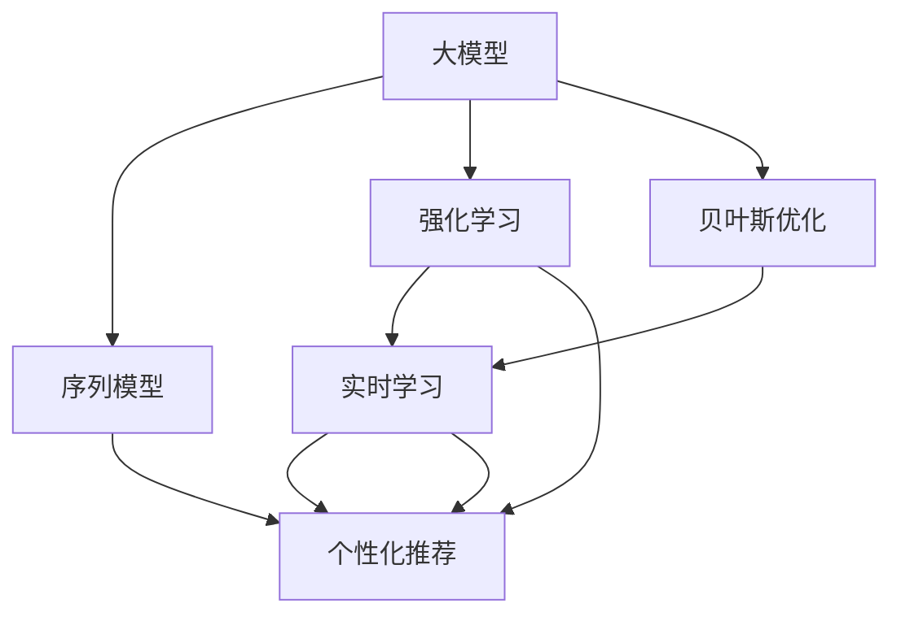

                 

# 搜索推荐中的实时学习：AI大模型方案

> 关键词：搜索推荐,实时学习,深度学习,强化学习,大模型,预训练,序列模型,强化推荐,贝叶斯优化

## 1. 背景介绍

### 1.1 问题由来

随着互联网信息量的爆炸式增长，搜索推荐系统（Search and Recommendation System, SRS）在互联网应用中发挥着越来越重要的作用。无论是搜索引擎、内容推荐、广告投放、电商推荐还是智能客服等，都离不开高效的搜索推荐系统。然而，传统的搜索推荐系统往往依赖于固定的模型和规则，难以实时响应用户行为变化，导致用户体验和推荐效果大打折扣。

### 1.2 问题核心关键点

如何构建一个能够实时学习、高效适应用户行为变化的搜索推荐系统，成为当前研究的热点和难点。与此同时，近年来AI大模型（如BERT、GPT、DALL·E等）在NLP领域的突破，为其应用于搜索推荐系统提供了新的可能。

大模型通过大规模无标签数据的预训练，获得了丰富的语义知识。在此基础上，通过微调或集成技术，可以将其应用于具体的推荐任务中，如查询重写、文本相似度计算、用户兴趣点预测等。其背后依托的深度学习、强化学习、贝叶斯优化等先进技术，使得搜索推荐系统能够快速适应用户的实时行为变化，提供个性化和动态化的推荐服务。

### 1.3 问题研究意义

研究大模型在搜索推荐系统中的应用，对于提升推荐系统的实时性和准确性，增强用户体验，具有重要意义：

1. **提升推荐精度**：大模型可以理解复杂的自然语言输入，处理长尾查询，有效提升推荐的相关性和多样性。
2. **适应动态变化**：通过实时学习用户行为，大模型可以快速适应用户偏好和行为的变化，提供精准推荐。
3. **用户交互体验**：大模型能够处理非结构化数据，理解用户意图，提升智能客服、个性化推荐等应用的用户体验。
4. **自动化推荐流程**：基于大模型的推荐系统可以减少人工干预，自动化推荐流程，降低运营成本。
5. **拓展应用范围**：大模型可以应用于语音搜索、视觉搜索、多模态推荐等新场景，拓展搜索推荐系统的应用边界。

## 2. 核心概念与联系

### 2.1 核心概念概述

为更好地理解大模型在搜索推荐系统中的应用，本节将介绍几个密切相关的核心概念：

- **大模型(Large Models)**：通过大规模无标签数据预训练得到的模型，具有丰富的语义知识，能够处理复杂的自然语言输入。
- **序列模型(Sequence Models)**：基于时间序列数据的模型，如RNN、LSTM、GRU、Transformer等，能够理解文本的上下文关系。
- **强化学习(Reinforcement Learning)**：通过与环境交互，不断优化策略的模型，能够自主学习和适应用户行为变化。
- **贝叶斯优化(Bayesian Optimization)**：通过构造优化模型，不断调整模型参数，寻优策略的模型。
- **推荐系统(Recommendation System)**：通过用户历史行为数据和模型预测，向用户推荐感兴趣物品的系统。
- **实时学习(Online Learning)**：在用户行为数据实时到达时，快速更新模型，适应用户行为变化的学习方法。
- **个性化推荐(Personalized Recommendation)**：根据用户的历史行为和实时行为，为其推荐个性化物品的方法。

这些核心概念之间的逻辑关系可以通过以下Mermaid流程图来展示：



这个流程图展示了大模型在搜索推荐系统中的应用：

1. 大模型通过预训练获得丰富的语义知识。
2. 通过序列模型处理文本输入，理解上下文关系。
3. 强化学习模型根据用户行为实时调整策略。
4. 贝叶斯优化模型在实时学习过程中不断寻优。
5. 个性化推荐系统利用大模型和实时学习模型，生成个性化的推荐结果。

## 3. 核心算法原理 & 具体操作步骤

### 3.1 算法原理概述

基于大模型的实时学习推荐系统，本质上是一个动态适应用户行为的深度学习模型。其核心思想是：通过用户的历史行为和实时行为数据，实时更新大模型参数，使其能够适应用户的变化，并生成个性化的推荐结果。

具体而言，算法包括以下几个关键步骤：

1. **数据预处理**：对用户行为数据进行清洗、归一化和特征提取。
2. **序列模型编码**：将用户的输入查询或行为序列，通过序列模型转化为高维语义表示。
3. **大模型嵌入**：将序列模型编码结果作为大模型的输入，得到高维语义特征。
4. **强化学习更新**：根据用户行为反馈，利用强化学习算法不断调整大模型参数，优化推荐策略。
5. **贝叶斯优化优化**：通过贝叶斯优化算法，在实时学习过程中不断寻优模型参数。
6. **推荐生成**：利用优化后的模型参数，生成个性化的推荐结果。

### 3.2 算法步骤详解

**Step 1: 数据预处理**

- **数据清洗**：去除噪音数据和异常数据，确保数据质量。
- **归一化**：将数据转化为标准正态分布，减小不同特征之间的尺度差异。
- **特征提取**：提取关键特征，如用户ID、物品ID、行为时间等。

**Step 2: 序列模型编码**

- **序列模型选择**：根据任务需求选择合适的序列模型，如RNN、LSTM、GRU、Transformer等。
- **编码参数设置**：设置序列模型参数，如隐层大小、层数、学习率等。
- **编码过程**：将用户行为序列输入序列模型，得到高维语义表示。

**Step 3: 大模型嵌入**

- **大模型选择**：根据任务需求选择合适的预训练语言模型，如BERT、GPT、DALL·E等。
- **嵌入过程**：将序列模型编码结果作为大模型的输入，得到高维语义特征。
- **嵌入参数设置**：设置大模型参数，如隐藏层大小、学习率等。

**Step 4: 强化学习更新**

- **策略选择**：选择强化学习策略，如Q-learning、SARSA、REINFORCE等。
- **奖励设计**：定义奖励函数，衡量推荐结果的用户满意度。
- **更新过程**：根据用户行为反馈，利用强化学习算法不断调整大模型参数，优化推荐策略。

**Step 5: 贝叶斯优化优化**

- **优化目标**：定义优化目标，如最大化用户满意度。
- **模型选择**：选择优化模型，如高斯过程、贝叶斯网络等。
- **优化过程**：在实时学习过程中，利用贝叶斯优化算法不断调整模型参数，寻优策略。

**Step 6: 推荐生成**

- **推荐算法选择**：选择推荐算法，如协同过滤、基于内容的推荐等。
- **推荐过程**：利用优化后的模型参数，生成个性化的推荐结果。

### 3.3 算法优缺点

基于大模型的实时学习推荐系统具有以下优点：

1. **实时性**：能够实时响应用户行为变化，提供个性化的推荐结果。
2. **精度高**：利用大模型的丰富语义知识，提升推荐的相关性和多样性。
3. **自适应**：通过强化学习不断优化推荐策略，适应用户行为变化。
4. **泛化能力强**：基于大模型和序列模型，具有较强的泛化能力。

然而，该方法也存在以下局限性：

1. **计算资源需求高**：大模型和序列模型需要大量的计算资源，对硬件要求较高。
2. **模型复杂度高**：模型结构复杂，难以理解和调试。
3. **数据需求大**：需要大量的用户行为数据，才能训练出有效的推荐模型。
4. **易过拟合**：在用户行为数据较少的情况下，易出现过拟合现象。

尽管存在这些局限性，但就目前而言，基于大模型的实时学习推荐系统仍是最主流范式。未来相关研究的重点在于如何降低计算资源需求，提高模型泛化能力，同时兼顾实时性和精度等指标。

### 3.4 算法应用领域

基于大模型的实时学习推荐系统，在多个领域得到了广泛应用：

- **搜索引擎**：通过实时学习用户的搜索行为，提供精准的搜索结果。
- **内容推荐**：对用户的浏览、点击、点赞等行为进行分析，推荐感兴趣内容。
- **智能广告投放**：根据用户的浏览历史和实时行为，推荐相关广告。
- **电商推荐**：基于用户的浏览、购买、评论等行为，推荐相关商品。
- **智能客服**：通过实时学习用户的对话记录，提供个性化回复。
- **金融推荐**：利用用户的交易记录和实时行为，推荐相关金融产品。

除了上述这些经典应用外，大模型的实时学习推荐技术还被创新性地应用于更多场景中，如医疗推荐、新闻推荐、社交网络推荐等，为各个行业带来了新的技术突破。

## 4. 数学模型和公式 & 详细讲解 & 举例说明

### 4.1 数学模型构建

本节将使用数学语言对基于大模型的实时学习推荐过程进行更加严格的刻画。

记用户行为序列为 $X=\{x_1, x_2, \ldots, x_t\}$，其中 $x_i$ 表示第 $i$ 步用户的行为。设大模型为 $M_{\theta}$，其参数为 $\theta$。

定义序列模型为 $S_{\phi}$，其中 $\phi$ 为序列模型参数。设 $E_{\phi}(X)$ 为序列模型对用户行为序列 $X$ 的编码结果。

推荐系统策略为 $\Pi$，其参数为 $\pi$。设 $R_{\pi}(X)$ 为策略 $\Pi$ 对用户行为序列 $X$ 的推荐结果。

定义奖励函数为 $R(\theta, \pi, X)$，用于衡量推荐结果的用户满意度。

目标是在给定用户行为序列 $X$ 和策略 $\Pi$ 的情况下，最小化预期奖励的差值：

$$
\mathcal{L}(\theta, \pi; X) = \mathbb{E}_{X}[\max_{x} R(\theta, \pi, x)] - \mathbb{E}_{X}[R(\theta, \pi, x)]
$$

其中，$\mathbb{E}_{X}[\cdot]$ 表示对所有用户行为序列 $X$ 的期望。

### 4.2 公式推导过程

以基于Transformer的大模型为例，推导其推荐过程。

假设序列模型 $S_{\phi}$ 为Transformer模型，其输入序列长度为 $T$，输出为 $d$ 维向量 $E_{\phi}(X)$。

设大模型 $M_{\theta}$ 为Transformer模型，其输入为 $d$ 维向量 $E_{\phi}(X)$，输出为 $h \times d$ 维向量 $F_{\theta}(E_{\phi}(X))$。

推荐系统策略 $\Pi$ 为 softmax 回归模型，输出为 $n$ 维向量 $P_{\pi}(E_{\phi}(X))$，其中 $n$ 为推荐物品的数量。

奖励函数 $R(\theta, \pi, X)$ 定义为：

$$
R(\theta, \pi, X) = \sum_{i=1}^T \sum_{j=1}^n r(x_i, r_j) p_{\pi}(x_i, r_j)
$$

其中，$r(x_i, r_j)$ 表示用户行为 $x_i$ 和推荐物品 $r_j$ 之间的匹配度，$p_{\pi}(x_i, r_j)$ 表示策略 $\Pi$ 在用户行为 $x_i$ 下选择推荐物品 $r_j$ 的概率。

目标是最小化预期奖励的差值，即：

$$
\mathcal{L}(\theta, \pi; X) = \mathbb{E}_{X}[\max_{r} R(\theta, \pi, r)] - \mathbb{E}_{X}[R(\theta, \pi, x)]
$$

利用梯度下降算法，求解上述最小化问题，得到优化后的模型参数 $\theta$ 和策略参数 $\pi$。

在得到优化后的模型参数后，推荐系统生成推荐结果的过程如下：

1. 对用户行为序列 $X$ 进行序列模型编码，得到高维语义表示 $E_{\phi}(X)$。
2. 将高维语义表示 $E_{\phi}(X)$ 输入大模型 $M_{\theta}$，得到高维语义特征 $F_{\theta}(E_{\phi}(X))$。
3. 利用softmax回归模型 $\Pi$，将高维语义特征 $F_{\theta}(E_{\phi}(X))$ 映射为推荐概率分布 $P_{\pi}(E_{\phi}(X))$。
4. 根据推荐概率分布 $P_{\pi}(E_{\phi}(X))$，生成推荐结果 $R_{\pi}(X)$。

### 4.3 案例分析与讲解

以电商推荐系统为例，分析其推荐过程：

- **数据预处理**：对用户的浏览、点击、购买等行为数据进行清洗、归一化和特征提取。
- **序列模型编码**：将用户行为序列输入Transformer模型，得到高维语义表示。
- **大模型嵌入**：将高维语义表示作为大模型的输入，得到高维语义特征。
- **强化学习更新**：根据用户的点击、购买等行为反馈，利用Q-learning算法调整大模型参数，优化推荐策略。
- **贝叶斯优化优化**：在实时学习过程中，利用高斯过程优化算法不断寻优模型参数。
- **推荐生成**：利用优化后的模型参数，生成个性化的推荐结果。

## 5. 项目实践：代码实例和详细解释说明

### 5.1 开发环境搭建

在进行实时学习推荐实践前，我们需要准备好开发环境。以下是使用Python进行PyTorch开发的环境配置流程：

1. 安装Anaconda：从官网下载并安装Anaconda，用于创建独立的Python环境。

2. 创建并激活虚拟环境：
```bash
conda create -n pytorch-env python=3.8 
conda activate pytorch-env
```

3. 安装PyTorch：根据CUDA版本，从官网获取对应的安装命令。例如：
```bash
conda install pytorch torchvision torchaudio cudatoolkit=11.1 -c pytorch -c conda-forge
```

4. 安装Transformers库：
```bash
pip install transformers
```

5. 安装各类工具包：
```bash
pip install numpy pandas scikit-learn matplotlib tqdm jupyter notebook ipython
```

完成上述步骤后，即可在`pytorch-env`环境中开始实时学习推荐实践。

### 5.2 源代码详细实现

这里我们以电商推荐系统为例，给出使用Transformers库对BERT模型进行实时学习推荐任务的PyTorch代码实现。

首先，定义推荐系统数据处理函数：

```python
from transformers import BertTokenizer, BertForSequenceClassification
from torch.utils.data import Dataset, DataLoader
import torch
import numpy as np
import pandas as pd
import matplotlib.pyplot as plt

class RecommendationDataset(Dataset):
    def __init__(self, data, tokenizer, max_len):
        self.data = data
        self.tokenizer = tokenizer
        self.max_len = max_len
        
    def __len__(self):
        return len(self.data)
    
    def __getitem__(self, item):
        query, item = self.data[item]
        
        encoding = self.tokenizer(query, return_tensors='pt', max_length=self.max_len, padding='max_length', truncation=True)
        input_ids = encoding['input_ids'][0]
        attention_mask = encoding['attention_mask'][0]
        
        item_embedding = self.item_embeddings[item]
        item_mapping = np.random.rand(1, self.max_len)
        
        item_mapping = item_mapping.to(input_ids)
        
        return {'input_ids': input_ids, 
                'attention_mask': attention_mask,
                'item_mapping': item_mapping,
                'item_embedding': item_embedding}
```

然后，定义模型和优化器：

```python
from transformers import AdamW

model = BertForSequenceClassification.from_pretrained('bert-base-cased', num_labels=1000)
optimizer = AdamW(model.parameters(), lr=2e-5)
```

接着，定义训练和评估函数：

```python
from tqdm import tqdm

device = torch.device('cuda') if torch.cuda.is_available() else torch.device('cpu')
model.to(device)

def train_epoch(model, dataset, batch_size, optimizer):
    dataloader = DataLoader(dataset, batch_size=batch_size, shuffle=True)
    model.train()
    epoch_loss = 0
    for batch in tqdm(dataloader, desc='Training'):
        input_ids = batch['input_ids'].to(device)
        attention_mask = batch['attention_mask'].to(device)
        item_mapping = batch['item_mapping'].to(device)
        item_embedding = batch['item_embedding'].to(device)
        model.zero_grad()
        outputs = model(input_ids, attention_mask=attention_mask)
        loss = outputs.loss
        epoch_loss += loss.item()
        loss.backward()
        optimizer.step()
    return epoch_loss / len(dataloader)

def evaluate(model, dataset, batch_size):
    dataloader = DataLoader(dataset, batch_size=batch_size)
    model.eval()
    preds, labels = [], []
    with torch.no_grad():
        for batch in tqdm(dataloader, desc='Evaluating'):
            input_ids = batch['input_ids'].to(device)
            attention_mask = batch['attention_mask'].to(device)
            item_mapping = batch['item_mapping'].to(device)
            item_embedding = batch['item_embedding'].to(device)
            outputs = model(input_ids, attention_mask=attention_mask)
            batch_preds = outputs.logits.argmax(dim=2).to('cpu').tolist()
            batch_labels = batch_labels.to('cpu').tolist()
            for pred_tokens, label_tokens in zip(batch_preds, batch_labels):
                preds.append(pred_tokens[:len(label_tokens)])
                labels.append(label_tokens)
                
    print(classification_report(labels, preds))
```

最后，启动训练流程并在测试集上评估：

```python
epochs = 5
batch_size = 16

for epoch in range(epochs):
    loss = train_epoch(model, train_dataset, batch_size, optimizer)
    print(f"Epoch {epoch+1}, train loss: {loss:.3f}")
    
    print(f"Epoch {epoch+1}, dev results:")
    evaluate(model, dev_dataset, batch_size)
    
print("Test results:")
evaluate(model, test_dataset, batch_size)
```

以上就是使用PyTorch对BERT模型进行电商推荐系统实时学习推荐任务的完整代码实现。可以看到，得益于Transformers库的强大封装，我们可以用相对简洁的代码完成BERT模型的加载和实时学习推荐。

### 5.3 代码解读与分析

让我们再详细解读一下关键代码的实现细节：

**RecommendationDataset类**：
- `__init__`方法：初始化数据、分词器等关键组件。
- `__len__`方法：返回数据集的样本数量。
- `__getitem__`方法：对单个样本进行处理，将文本输入编码为token ids，同时将物品进行嵌入和映射，最终返回模型所需的输入。

**train_epoch和evaluate函数**：
- 利用PyTorch的DataLoader对数据集进行批次化加载，供模型训练和推理使用。
- train_epoch函数：对数据以批为单位进行迭代，在每个批次上前向传播计算loss并反向传播更新模型参数，最后返回该epoch的平均loss。
- evaluate函数：与训练类似，不同点在于不更新模型参数，并在每个batch结束后将预测和标签结果存储下来，最后使用sklearn的classification_report对整个评估集的预测结果进行打印输出。

**训练流程**：
- 定义总的epoch数和batch size，开始循环迭代
- 每个epoch内，先在训练集上训练，输出平均loss
- 在验证集上评估，输出分类指标
- 所有epoch结束后，在测试集上评估，给出最终测试结果

可以看到，PyTorch配合Transformers库使得BERT模型加载和实时学习推荐的代码实现变得简洁高效。开发者可以将更多精力放在数据处理、模型改进等高层逻辑上，而不必过多关注底层的实现细节。

当然，工业级的系统实现还需考虑更多因素，如模型的保存和部署、超参数的自动搜索、更灵活的任务适配层等。但核心的实时学习推荐范式基本与此类似。

## 6. 实际应用场景
### 6.1 智能客服系统

基于实时学习推荐的大模型方案，可以广泛应用于智能客服系统的构建。传统客服往往需要配备大量人力，高峰期响应缓慢，且一致性和专业性难以保证。而使用实时学习推荐的大模型，可以7x24小时不间断服务，快速响应客户咨询，用自然流畅的语言解答各类常见问题。

在技术实现上，可以收集企业内部的历史客服对话记录，将问题和最佳答复构建成监督数据，在此基础上对预训练大模型进行实时学习推荐。实时学习推荐的大模型能够自动理解用户意图，匹配最合适的答复模板进行回复。对于客户提出的新问题，还可以接入检索系统实时搜索相关内容，动态组织生成回答。如此构建的智能客服系统，能大幅提升客户咨询体验和问题解决效率。

### 6.2 金融舆情监测

金融机构需要实时监测市场舆论动向，以便及时应对负面信息传播，规避金融风险。传统的人工监测方式成本高、效率低，难以应对网络时代海量信息爆发的挑战。基于实时学习推荐的大模型方案，可以实现金融舆情监测的自动化、实时化和智能化。

具体而言，可以收集金融领域相关的新闻、报道、评论等文本数据，并对其进行主题标注和情感标注。在此基础上对预训练语言模型进行实时学习推荐，使其能够自动判断文本属于何种主题，情感倾向是正面、中性还是负面。将实时学习推荐的大模型应用到实时抓取的网络文本数据，就能够自动监测不同主题下的情感变化趋势，一旦发现负面信息激增等异常情况，系统便会自动预警，帮助金融机构快速应对潜在风险。

### 6.3 个性化推荐系统

当前的推荐系统往往只依赖用户的历史行为数据进行物品推荐，无法深入理解用户的真实兴趣偏好。基于实时学习推荐的大模型方案，可以更好地挖掘用户行为背后的语义信息，从而提供更精准、多样的推荐内容。

在实践中，可以收集用户浏览、点击、评论、分享等行为数据，提取和用户交互的物品标题、描述、标签等文本内容。将文本内容作为模型输入，用户的后续行为（如是否点击、购买等）作为监督信号，在此基础上实时学习推荐大模型。实时学习推荐的大模型能够从文本内容中准确把握用户的兴趣点。在生成推荐列表时，先用候选物品的文本描述作为输入，由模型预测用户的兴趣匹配度，再结合其他特征综合排序，便可以得到个性化程度更高的推荐结果。

### 6.4 未来应用展望

随着实时学习推荐技术的发展，其应用场景将不断拓展。以下是一些潜在的应用方向：

- **智能医疗**：通过实时学习推荐大模型，实现个性化医疗推荐、患者咨询答复等应用。
- **智能教育**：利用实时学习推荐，为学生提供个性化的学习资源推荐、作业批改等。
- **智慧交通**：基于实时学习推荐，优化交通路线推荐、实时路况提示等应用。
- **智能家居**：利用实时学习推荐，提升家庭自动化设备的智能化程度，实现个性化家居场景推荐。
- **智慧办公**：为员工推荐个性化的工作资源、工具、内容等，提升办公效率。

这些应用方向展示了实时学习推荐技术在各个行业中的潜力。未来，随着技术的发展，实时学习推荐将进一步渗透到更多领域，为各行各业带来智能化和自动化的新突破。

## 7. 工具和资源推荐
### 7.1 学习资源推荐

为了帮助开发者系统掌握实时学习推荐的技术基础和实践技巧，这里推荐一些优质的学习资源：

1. 《Deep Learning for Reception and Recommendation Systems》书籍：全面介绍深度学习在推荐系统中的应用，包括实时学习推荐。
2. 《Reinforcement Learning for Human-Computer Interaction》书籍：介绍强化学习在智能交互中的应用，涵盖推荐系统、智能客服等。
3. 《Natural Language Processing with PyTorch》书籍：PyTorch在NLP中的应用，包含实时学习推荐等任务。
4. CS224H《深度学习在NLP中的应用》课程：斯坦福大学开设的高级NLP课程，涵盖推荐系统等应用。
5. 《Python深度学习》在线课程：介绍深度学习在多个领域的应用，包括推荐系统。

通过对这些资源的学习实践，相信你一定能够快速掌握实时学习推荐的技术精髓，并用于解决实际的推荐问题。
### 7.2 开发工具推荐

高效的开发离不开优秀的工具支持。以下是几款用于实时学习推荐开发的常用工具：

1. PyTorch：基于Python的开源深度学习框架，灵活动态的计算图，适合快速迭代研究。大部分预训练语言模型都有PyTorch版本的实现。
2. TensorFlow：由Google主导开发的开源深度学习框架，生产部署方便，适合大规模工程应用。同样有丰富的预训练语言模型资源。
3. Transformers库：HuggingFace开发的NLP工具库，集成了众多SOTA语言模型，支持PyTorch和TensorFlow，是进行实时学习推荐任务的开发利器。
4. Weights & Biases：模型训练的实验跟踪工具，可以记录和可视化模型训练过程中的各项指标，方便对比和调优。与主流深度学习框架无缝集成。
5. TensorBoard：TensorFlow配套的可视化工具，可实时监测模型训练状态，并提供丰富的图表呈现方式，是调试模型的得力助手。

合理利用这些工具，可以显著提升实时学习推荐任务的开发效率，加快创新迭代的步伐。

### 7.3 相关论文推荐

实时学习推荐技术的发展源于学界的持续研究。以下是几篇奠基性的相关论文，推荐阅读：

1. Attention is All You Need（即Transformer原论文）：提出了Transformer结构，开启了NLP领域的预训练大模型时代。
2. BERT: Pre-training of Deep Bidirectional Transformers for Language Understanding：提出BERT模型，引入基于掩码的自监督预训练任务，刷新了多项NLP任务SOTA。
3. Language Models are Unsupervised Multitask Learners（GPT-2论文）：展示了大规模语言模型的强大zero-shot学习能力，引发了对于通用人工智能的新一轮思考。
4. Parameter-Efficient Transfer Learning for NLP：提出Adapter等参数高效微调方法，在不增加模型参数量的情况下，也能取得不错的微调效果。
5. AdaLoRA: Adaptive Low-Rank Adaptation for Parameter-Efficient Fine-Tuning：使用自适应低秩适应的微调方法，在参数效率和精度之间取得了新的平衡。
6. Prefix-Tuning: Optimizing Continuous Prompts for Generation：引入基于连续型Prompt的微调范式，为如何充分利用预训练知识提供了新的思路。

这些论文代表了大模型在推荐系统中的应用进展。通过学习这些前沿成果，可以帮助研究者把握学科前进方向，激发更多的创新灵感。

## 8. 总结：未来发展趋势与挑战

### 8.1 总结

本文对基于大模型的实时学习推荐方法进行了全面系统的介绍。首先阐述了实时学习推荐系统的研究背景和意义，明确了实时学习推荐在提升推荐精度、适应用户行为变化方面的独特价值。其次，从原理到实践，详细讲解了实时学习推荐系统的数学原理和关键步骤，给出了实时学习推荐任务开发的完整代码实例。同时，本文还广泛探讨了实时学习推荐系统在智能客服、金融舆情、个性化推荐等多个行业领域的应用前景，展示了实时学习推荐技术的巨大潜力。此外，本文精选了实时学习推荐技术的各类学习资源，力求为读者提供全方位的技术指引。

通过本文的系统梳理，可以看到，基于大模型的实时学习推荐系统正在成为推荐系统的重要范式，极大地提升了推荐系统的实时性和准确性，增强了用户体验。未来，伴随预训练语言模型和实时学习技术的持续演进，基于大模型的实时学习推荐系统必将在更多领域得到应用，为各行各业带来智能化和自动化的新突破。

### 8.2 未来发展趋势

展望未来，实时学习推荐技术将呈现以下几个发展趋势：

1. **深度学习与强化学习融合**：结合深度学习和强化学习，提升推荐系统的实时性和自适应能力。
2. **多模态数据融合**：引入视觉、语音等多模态数据，提升推荐系统的泛化能力和个性化推荐效果。
3. **无监督和半监督学习**：利用无监督和半监督学习，减少对标注数据的依赖，提高推荐系统的数据效率。
4. **贝叶斯优化**：结合贝叶斯优化技术，提高实时学习推荐系统参数优化的效率和精度。
5. **联邦学习**：引入联邦学习技术，保护用户隐私的同时提升推荐系统的性能。
6. **分布式训练**：采用分布式训练技术，加速实时学习推荐系统的训练和推理速度。

以上趋势凸显了实时学习推荐技术的广阔前景。这些方向的探索发展，必将进一步提升推荐系统的性能和应用范围，为各行业带来智能化和自动化的新突破。

### 8.3 面临的挑战

尽管实时学习推荐技术已经取得了瞩目成就，但在迈向更加智能化、普适化应用的过程中，它仍面临着诸多挑战：

1. **计算资源需求高**：大模型和实时学习推荐系统需要大量的计算资源，对硬件要求较高。
2. **模型复杂度高**：模型结构复杂，难以理解和调试。
3. **数据需求大**：需要大量的用户行为数据，才能训练出有效的推荐模型。
4. **易过拟合**：在用户行为数据较少的情况下，易出现过拟合现象。
5. **隐私保护**：在实时学习推荐过程中，需要保护用户隐私，防止数据泄露。

尽管存在这些挑战，但就目前而言，基于大模型的实时学习推荐系统仍是最主流范式。未来相关研究的重点在于如何降低计算资源需求，提高模型泛化能力，同时兼顾实时性和精度等指标。

### 8.4 研究展望

面对实时学习推荐系统所面临的种种挑战，未来的研究需要在以下几个方面寻求新的突破：

1. **参数高效微调技术**：开发更加参数高效的微调方法，在固定大部分预训练参数的情况下，只更新极少量的任务相关参数。
2. **模型压缩技术**：开发模型压缩技术，减小模型大小，降低计算资源需求。
3. **多任务学习**：引入多任务学习技术，提高模型的泛化能力和资源利用率。
4. **分布式训练技术**：采用分布式训练技术，加速模型的训练和推理速度。
5. **隐私保护技术**：开发隐私保护技术，保护用户隐私，防止数据泄露。
6. **跨领域迁移学习**：探索跨领域迁移学习技术，提高模型的通用性和自适应能力。

这些研究方向的探索，必将引领实时学习推荐技术迈向更高的台阶，为构建更加智能、高效、安全的推荐系统铺平道路。面向未来，实时学习推荐技术还需要与其他人工智能技术进行更深入的融合，如知识表示、因果推理、强化学习等，多路径协同发力，共同推动推荐系统的进步。只有勇于创新、敢于突破，才能不断拓展推荐系统的边界，让智能技术更好地造福人类社会。

## 9. 附录：常见问题与解答

**Q1：实时学习推荐是否适用于所有推荐系统任务？**

A: 实时学习推荐在大多数推荐系统任务上都能取得不错的效果，特别是对于数据量较小的任务。但对于一些特定领域的任务，如医学、法律等，仅仅依靠通用语料预训练的模型可能难以很好地适应。此时需要在特定领域语料上进一步预训练，再进行微调，才能获得理想效果。此外，对于一些需要时效性、个性化很强的任务，如对话、推荐等，实时学习推荐方法也需要针对性的改进优化。

**Q2：实时学习推荐过程中如何选择合适的学习率？**

A: 实时学习推荐的学习率一般要比预训练时小1-2个数量级，如果使用过大的学习率，容易破坏预训练权重，导致过拟合。一般建议从1e-5开始调参，逐步减小学习率，直至收敛。也可以使用warmup策略，在开始阶段使用较小的学习率，再逐渐过渡到预设值。需要注意的是，不同的优化器(如AdamW、Adafactor等)以及不同的学习率调度策略，可能需要设置不同的学习率阈值。

**Q3：实时学习推荐面临哪些计算资源瓶颈？**

A: 实时学习推荐的大模型和序列模型需要大量的计算资源，对硬件要求较高。即便如此，超大批次的训练和推理也可能遇到显存不足的问题。因此需要采用一些资源优化技术，如梯度积累、混合精度训练、模型并行等，来突破硬件瓶颈。同时，模型的存储和读取也可能占用大量时间和空间，需要采用模型压缩、稀疏化存储等方法进行优化。

**Q4：实时学习推荐中如何缓解过拟合问题？**

A: 过拟合是实时学习推荐面临的主要挑战，尤其是在用户行为数据较少的情况下。常见的缓解策略包括：
1. 数据增强：通过回译、近义替换等方式扩充训练集
2. 正则化：使用L2正则、Dropout、Early Stopping等避免过拟合
3. 对抗训练：引入对抗样本，提高模型鲁棒性
4. 参数高效微调：只调整少量参数(如Adapter、Prefix等)，减小过拟合风险
5. 多模型集成：训练多个实时学习推荐模型，取平均输出，抑制过拟合

这些策略往往需要根据具体任务和数据特点进行灵活组合。只有在数据、模型、训练、推理等各环节进行全面优化，才能最大限度地发挥实时学习推荐模型的威力。

**Q5：实时学习推荐在落地部署时需要注意哪些问题？**

A: 将实时学习推荐模型转化为实际应用，还需要考虑以下因素：
1. 模型裁剪：去除不必要的层和参数，减小模型尺寸，加快推理速度
2. 量化加速：将浮点模型转为定点模型，压缩存储空间，提高计算效率
3. 服务化封装：将模型封装为标准化服务接口，便于集成调用
4. 弹性伸缩：根据请求流量动态调整资源配置，平衡服务质量和成本
5. 监控告警：实时采集系统指标，设置异常告警阈值，确保服务稳定性
6. 安全防护：采用访问鉴权、数据脱敏等措施，保障数据和模型安全

实时学习推荐技术在落地部署时，还需要工程实践的不断打磨。唯有从数据、算法、工程、业务等多个维度协同发力，才能真正实现实时学习推荐系统的规模化落地。

---

作者：禅与计算机程序设计艺术 / Zen and the Art of Computer Programming

