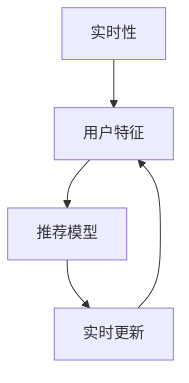

                 

# 搜索推荐系统中的实时特征更新技术

## 1. 背景介绍

随着互联网和智能设备的普及，搜索推荐系统（Recommender System）成为了现代互联网的核心应用之一，广泛应用于电商、社交网络、视频流媒体等各个领域。搜索推荐系统通过挖掘用户的历史行为和偏好，为每位用户提供个性化的搜索结果和推荐内容，极大地提升了用户体验。

然而，搜索推荐系统面临的一个重要挑战是如何实时地更新用户的特征，以适应用户的不断变化的兴趣和需求。传统的搜索推荐系统在用户特征更新方面存在一定的局限性，导致推荐结果的准确性和个性化程度难以达到理想的效果。

为应对这一挑战，本文将详细探讨实时特征更新技术在搜索推荐系统中的应用，包括核心概念、算法原理、具体操作步骤和实际应用案例。

## 2. 核心概念与联系

### 2.1 核心概念概述

搜索推荐系统中的实时特征更新技术，是指在用户行为数据实时流入系统的过程中，动态更新用户特征，从而提升推荐模型的效果。其主要包括以下几个关键概念：

- **实时性（Real-time）**：用户行为数据是动态变化的，搜索推荐系统需要实时地捕捉和处理这些数据，才能提供及时准确的推荐结果。
- **用户特征（User Profile）**：用户特征是搜索推荐系统的核心，包括用户的兴趣、历史行为、社交关系等，决定了推荐模型输出内容的相关性。
- **推荐模型（Recommendation Model）**：推荐模型基于用户特征和物品特征，通过一定的算法计算出推荐的物品。常用的推荐算法包括协同过滤、内容推荐、混合推荐等。
- **实时更新（Real-time Update）**：通过算法实时地更新用户特征，如动态地添加、修改或删除用户行为数据，确保用户特征的最新性。

这些核心概念之间的逻辑关系可以通过以下Mermaid流程图来展示：



## 3. 核心算法原理 & 具体操作步骤

### 3.1 算法原理概述

实时特征更新技术的基础是实时处理和更新用户特征。实时特征更新技术的目标是使用户的当前行为和偏好能够及时反映在推荐模型中，从而提高推荐结果的相关性和准确性。

### 3.2 算法步骤详解

实时特征更新技术主要包括三个步骤：数据采集、特征更新和模型更新。下面详细介绍每个步骤的实现过程：

**数据采集**：
实时特征更新技术的第一步是采集用户的实时行为数据，并将其转化为推荐系统所需的用户特征。具体流程如下：

1. **数据源**：数据源可以是用户的点击记录、浏览记录、搜索记录等。
2. **数据预处理**：对采集到的原始数据进行去重、去噪、分词等预处理操作，确保数据质量。
3. **数据存储**：将预处理后的数据存储在实时数据仓库中，供后续处理使用。

**特征更新**：
特征更新是指根据用户的实时行为数据，动态更新用户特征。具体流程如下：

1. **特征提取**：从数据源中提取有用的特征，如用户的兴趣点、浏览时间、浏览顺序等。
2. **特征更新**：使用实时特征更新算法，对用户特征进行更新。常见的实时特征更新算法包括FIFO、LRU等。
3. **特征存储**：将更新后的用户特征存储在缓存或数据库中，供后续模型使用。

**模型更新**：
模型更新是指根据最新的用户特征，实时更新推荐模型，从而生成推荐结果。具体流程如下：

1. **模型训练**：使用更新后的用户特征和物品特征，重新训练推荐模型。
2. **模型部署**：将训练好的推荐模型部署到生产环境中，供实际使用。
3. **模型评估**：对部署后的推荐模型进行实时评估，确保推荐结果的准确性和相关性。

### 3.3 算法优缺点

实时特征更新技术具有以下优点：

1. **个性化程度高**：实时更新用户特征，能够更好地反映用户的当前兴趣和需求，提高推荐结果的个性化程度。
2. **实时性高**：通过实时处理用户行为数据，能够及时捕捉用户的兴趣变化，快速生成推荐结果。
3. **减少计算成本**：在用户特征更新时，只更新需要的部分特征，减少计算资源消耗，提升系统效率。

同时，该技术也存在一定的局限性：

1. **数据量要求高**：实时特征更新技术需要大量的数据支持，对数据采集和存储的要求较高。
2. **实时性要求高**：实现实时特征更新需要高效的数据处理和计算能力，对硬件和软件的要求较高。
3. **算法复杂**：实时特征更新算法需要考虑多个因素，如特征权值、数据存储、缓存策略等，算法实现较为复杂。

### 3.4 算法应用领域

实时特征更新技术广泛应用于以下几个领域：

- **电商推荐**：电商网站需要实时捕捉用户浏览、点击、购买等行为，动态更新用户的兴趣偏好，生成个性化的商品推荐。
- **社交网络**：社交网络平台需要实时捕捉用户动态发布的内容、点赞、评论等行为，生成个性化的内容推荐。
- **视频流媒体**：视频流媒体平台需要实时捕捉用户的观看行为、评分、收藏等行为，生成个性化的视频推荐。
- **智能家居**：智能家居系统需要实时捕捉用户的行为数据，动态更新用户的习惯和偏好，生成个性化的家居控制指令。

## 4. 数学模型和公式 & 详细讲解 & 举例说明

### 4.1 数学模型构建

实时特征更新技术的数学模型包括用户特征模型和推荐模型。下面详细介绍这两个模型的构建过程：

**用户特征模型**：
用户特征模型包括静态特征和动态特征。静态特征是指用户的基本属性，如年龄、性别、地理位置等。动态特征是指用户的行为数据，如浏览记录、点击记录、购买记录等。

**推荐模型**：
推荐模型基于用户特征和物品特征，通过一定的算法计算出推荐的物品。常用的推荐算法包括协同过滤、内容推荐、混合推荐等。其中，协同过滤算法基于用户的相似度，推荐物品相似的物品；内容推荐算法基于物品的属性，推荐属性相似的物品；混合推荐算法将多个推荐算法进行融合，提升推荐结果的准确性。

### 4.2 公式推导过程

以协同过滤推荐算法为例，介绍实时特征更新技术的公式推导过程：

协同过滤推荐算法的基本公式如下：

$$
\text{推荐结果} = \text{用户特征} \times \text{物品特征} \times \text{相似度矩阵}
$$

其中，用户特征和物品特征通过矩阵乘法计算推荐结果。相似度矩阵表示用户之间的相似度，通常使用余弦相似度或皮尔逊相关系数计算。

实时特征更新技术在协同过滤算法中的应用，需要实时更新用户特征和物品特征。假设用户$u$对物品$i$进行了操作，则用户特征和物品特征的更新公式如下：

$$
\text{更新后的用户特征} = \text{原始用户特征} + \text{用户操作贡献}
$$

$$
\text{更新后的物品特征} = \text{原始物品特征} + \text{物品操作贡献}
$$

其中，用户操作贡献和物品操作贡献可以使用梯度下降等优化算法计算。

### 4.3 案例分析与讲解

下面以电商推荐系统为例，介绍实时特征更新技术的具体应用：

**案例背景**：
某电商网站通过实时特征更新技术，提升用户的推荐体验。网站每天会收集大量的用户行为数据，包括浏览、点击、购买等行为。网站使用协同过滤算法进行推荐，需要实时更新用户特征和物品特征，以提升推荐结果的相关性。

**具体实现**：
1. **数据采集**：网站通过前端页面记录用户的浏览、点击、购买等行为，实时采集用户行为数据。
2. **特征提取**：从用户行为数据中提取有用的特征，如用户的浏览时间、浏览顺序、购买频率等。
3. **特征更新**：使用FIFO（先进先出）算法，实时更新用户特征和物品特征。
4. **模型更新**：使用协同过滤算法，根据更新后的用户特征和物品特征，重新训练推荐模型，并生成推荐结果。
5. **模型评估**：对生成的推荐结果进行实时评估，确保推荐结果的相关性和个性化程度。

## 5. 项目实践：代码实例和详细解释说明

### 5.1 开发环境搭建

为了实现实时特征更新技术，需要搭建一个高效的开发环境。以下是使用Python进行实时特征更新技术开发的常用环境配置流程：

1. **安装Python**：从官网下载并安装Python 3.x版本。
2. **安装数据处理库**：安装Pandas、NumPy等数据处理库，用于数据预处理和分析。
3. **安装机器学习库**：安装Scikit-learn、TensorFlow等机器学习库，用于推荐模型的训练和部署。
4. **安装Web框架**：安装Flask、Django等Web框架，用于推荐结果的展示和接口服务。

完成上述步骤后，即可在本地搭建实时特征更新技术的开发环境。

### 5.2 源代码详细实现

下面以协同过滤推荐算法为例，详细介绍实时特征更新技术的源代码实现：

```python
import numpy as np
import pandas as pd
from sklearn.metrics.pairwise import cosine_similarity

# 定义用户特征和物品特征
user_features = pd.DataFrame(np.random.rand(10000, 10))
item_features = pd.DataFrame(np.random.rand(1000, 10))

# 定义用户行为数据
user_behaviors = pd.DataFrame(np.random.randint(0, 2, size=(10000, 1000)))

# 定义协同过滤算法
def collaborative_filtering(user_features, item_features, user_behaviors):
    # 计算用户和物品的相似度
    user_similarity = cosine_similarity(user_features)
    item_similarity = cosine_similarity(item_features)

    # 计算推荐结果
    recommendation = user_behaviors.dot(item_similarity).dot(user_similarity) / np.dot(user_similarity, user_similarity)

    return recommendation

# 实时特征更新算法
def real_time_feature_update(user_features, item_features, user_behaviors):
    # 实时更新用户特征和物品特征
    user_features = user_features + user_behaviors.dot(item_features)

    # 实时更新推荐模型
    recommendation = collaborative_filtering(user_features, item_features, user_behaviors)

    return recommendation

# 测试代码
user_features = pd.DataFrame(np.random.rand(10000, 10))
item_features = pd.DataFrame(np.random.rand(1000, 10))
user_behaviors = pd.DataFrame(np.random.randint(0, 2, size=(10000, 1000)))

recommendation = real_time_feature_update(user_features, item_features, user_behaviors)
print(recommendation)
```

以上代码实现了实时特征更新技术的基本流程。具体来说，代码中定义了用户特征、物品特征和用户行为数据，使用协同过滤算法计算推荐结果，并使用实时特征更新算法更新用户特征和物品特征。

### 5.3 代码解读与分析

上述代码中的关键步骤如下：

1. **用户特征和物品特征的初始化**：通过随机生成数据，创建用户特征和物品特征矩阵。
2. **用户行为数据的采集**：通过随机生成数据，创建用户行为数据矩阵。
3. **推荐模型的定义**：定义协同过滤算法的实现函数，用于计算推荐结果。
4. **实时特征更新算法的实现**：定义实时特征更新算法的实现函数，用于实时更新用户特征和物品特征。
5. **测试代码的执行**：调用实时特征更新算法，计算推荐结果，并输出结果。

## 6. 实际应用场景

实时特征更新技术在以下几个场景中具有重要应用：

### 6.1 电商推荐

电商推荐系统需要实时捕捉用户的浏览、点击、购买等行为，动态更新用户的兴趣偏好，生成个性化的商品推荐。通过实时特征更新技术，电商网站能够快速响应用户的实时行为，提高推荐结果的个性化程度和实时性。

### 6.2 视频流媒体

视频流媒体平台需要实时捕捉用户的观看行为、评分、收藏等行为，生成个性化的视频推荐。通过实时特征更新技术，视频流媒体平台能够快速捕捉用户的兴趣变化，提升推荐结果的相关性。

### 6.3 社交网络

社交网络平台需要实时捕捉用户动态发布的内容、点赞、评论等行为，生成个性化的内容推荐。通过实时特征更新技术，社交网络平台能够快速捕捉用户的兴趣变化，提升推荐结果的相关性。

### 6.4 智能家居

智能家居系统需要实时捕捉用户的行为数据，动态更新用户的习惯和偏好，生成个性化的家居控制指令。通过实时特征更新技术，智能家居系统能够快速捕捉用户的兴趣变化，提升用户体验。

## 7. 工具和资源推荐

### 7.1 学习资源推荐

为了帮助开发者系统掌握实时特征更新技术的原理和应用，以下是几本推荐的学习资源：

1. 《推荐系统实战》：全面介绍了推荐系统的基础概念、算法实现和工程实践，适合初学者学习。
2. 《机器学习实战》：介绍了多种机器学习算法和实际应用，包括推荐系统在内的众多领域。
3. 《深度学习》：介绍了深度学习的基础知识和前沿技术，包括推荐系统在内的多种应用场景。
4. Kaggle：提供了大量的推荐系统竞赛数据和代码示例，适合进阶学习。

### 7.2 开发工具推荐

实时特征更新技术的开发需要使用多种工具，以下是几款推荐的开发工具：

1. Python：Python是实时特征更新技术的主流开发语言，适合数据处理、机器学习、Web开发等多种场景。
2. Pandas：Pandas是Python中常用的数据处理库，适合数据预处理和分析。
3. Scikit-learn：Scikit-learn是Python中常用的机器学习库，适合推荐模型的训练和评估。
4. TensorFlow：TensorFlow是Google开源的机器学习框架，适合大规模推荐模型的训练和部署。
5. Flask/Django：Flask和Django是Python中常用的Web框架，适合推荐结果的展示和接口服务。

### 7.3 相关论文推荐

实时特征更新技术的发展离不开学界的持续研究。以下是几篇推荐的论文，有助于深入理解实时特征更新技术的原理和应用：

1. "Real-time Recommendation Systems: A Survey"：介绍了实时推荐系统的基本概念和主要技术。
2. "A Survey of Recommender Systems for Streaming Data"：介绍了实时推荐系统的最新研究和应用进展。
3. "Adaptive Online Learning in Recommender Systems"：研究了在线推荐系统中用户的实时行为数据处理方法。
4. "Hybrid Recommender Systems: A Survey and Evaluation Framework"：介绍了混合推荐系统的方法和应用。

## 8. 总结：未来发展趋势与挑战

### 8.1 总结

本文对实时特征更新技术在搜索推荐系统中的应用进行了详细探讨。首先介绍了实时特征更新技术的核心概念，包括实时性、用户特征、推荐模型和实时更新。其次，从算法原理、具体操作步骤和实际应用案例，详细介绍了实时特征更新技术的实现过程。最后，对实时特征更新技术的优缺点、应用领域和未来发展趋势进行了分析。

通过本文的系统梳理，可以看到，实时特征更新技术在搜索推荐系统中具有重要应用，能够显著提升推荐结果的相关性和个性化程度。未来，随着技术的不断发展和应用场景的不断拓展，实时特征更新技术必将在更多领域得到应用，带来更多的创新和突破。

### 8.2 未来发展趋势

展望未来，实时特征更新技术将呈现以下几个发展趋势：

1. **实时性更高**：随着硬件计算能力的提升和算法优化，实时特征更新技术将具备更高的实时性，能够实时捕捉用户的兴趣变化，快速生成推荐结果。
2. **数据质量更高**：实时特征更新技术将更加注重数据质量，通过数据清洗、去噪、去重等预处理操作，提升数据的质量和可用性。
3. **模型更加智能**：实时特征更新技术将引入更多智能化算法，如深度学习、强化学习等，提升推荐模型的效果和个性化程度。
4. **应用场景更广**：实时特征更新技术将应用到更多领域，如智能家居、智能城市、医疗健康等，带来更多的创新和突破。

以上趋势凸显了实时特征更新技术的广阔前景。这些方向的探索发展，必将进一步提升推荐系统的性能和应用范围，为人工智能技术的落地应用带来更多的可能。

### 8.3 面临的挑战

尽管实时特征更新技术已经取得了一定的进展，但在迈向更加智能化、普适化应用的过程中，它仍面临着诸多挑战：

1. **数据量要求高**：实时特征更新技术需要大量的数据支持，对数据采集和存储的要求较高。
2. **实时性要求高**：实现实时特征更新需要高效的数据处理和计算能力，对硬件和软件的要求较高。
3. **算法复杂**：实时特征更新算法需要考虑多个因素，如特征权值、数据存储、缓存策略等，算法实现较为复杂。

### 8.4 研究展望

面对实时特征更新技术所面临的挑战，未来的研究需要在以下几个方面寻求新的突破：

1. **优化数据采集和存储**：探索更高效的数据采集和存储方法，提升数据质量和实时性。
2. **提升算法效率**：引入更多高效算法，提升实时特征更新算法的效率和实时性。
3. **引入更多先验知识**：将符号化的先验知识，如知识图谱、逻辑规则等，与神经网络模型进行融合，提升推荐模型的效果和个性化程度。
4. **研究跨模态推荐**：研究跨模态推荐方法，将文本、图像、音频等多模态数据进行融合，提升推荐结果的准确性和相关性。

这些研究方向的探索，必将引领实时特征更新技术迈向更高的台阶，为搜索推荐系统带来更多的创新和突破。面向未来，实时特征更新技术还需要与其他人工智能技术进行更深入的融合，如知识表示、因果推理、强化学习等，多路径协同发力，共同推动推荐系统的进步。只有勇于创新、敢于突破，才能不断拓展搜索推荐系统的边界，让推荐系统更好地服务用户。

## 9. 附录：常见问题与解答

**Q1：实时特征更新技术如何处理数据缺失和异常值？**

A: 实时特征更新技术在处理数据缺失和异常值时，可以采用以下方法：

1. **数据插补**：使用插补算法，如均值插补、中位数插补等，填补缺失值。
2. **异常值检测**：使用异常值检测算法，如z-score、箱线图等，检测和处理异常值。
3. **数据清洗**：对数据进行清洗操作，如去重、去噪等，确保数据的质量和一致性。

**Q2：实时特征更新技术如何避免数据偏差？**

A: 实时特征更新技术在处理数据偏差时，可以采用以下方法：

1. **数据采样**：对数据进行采样操作，确保样本的代表性。
2. **特征降维**：使用特征降维算法，如PCA、LDA等，降低数据的维度，减少数据的偏差。
3. **模型优化**：使用优化算法，如AdaBoost、Gradient Boosting等，优化模型的性能和泛化能力。

**Q3：实时特征更新技术如何提高推荐结果的个性化程度？**

A: 实时特征更新技术可以通过以下方法提高推荐结果的个性化程度：

1. **用户行为分析**：分析用户的历史行为数据，提取有用的特征，如浏览时间、浏览顺序、购买频率等。
2. **实时行为更新**：根据用户的新行为数据，实时更新用户特征，确保用户特征的最新性。
3. **个性化推荐算法**：使用个性化推荐算法，如协同过滤、内容推荐等，生成个性化的推荐结果。

**Q4：实时特征更新技术在推荐系统中的应用有哪些？**

A: 实时特征更新技术在推荐系统中的应用包括：

1. **电商推荐**：电商网站需要实时捕捉用户浏览、点击、购买等行为，动态更新用户的兴趣偏好，生成个性化的商品推荐。
2. **视频流媒体**：视频流媒体平台需要实时捕捉用户的观看行为、评分、收藏等行为，生成个性化的视频推荐。
3. **社交网络**：社交网络平台需要实时捕捉用户动态发布的内容、点赞、评论等行为，生成个性化的内容推荐。
4. **智能家居**：智能家居系统需要实时捕捉用户的行为数据，动态更新用户的习惯和偏好，生成个性化的家居控制指令。

**Q5：实时特征更新技术在推荐系统中的优化方法有哪些？**

A: 实时特征更新技术在推荐系统中的优化方法包括：

1. **数据预处理**：对数据进行去重、去噪、分词等预处理操作，确保数据质量。
2. **特征提取**：从数据源中提取有用的特征，如用户的兴趣点、浏览时间、浏览顺序等。
3. **特征更新**：使用实时特征更新算法，对用户特征进行更新。常见的实时特征更新算法包括FIFO、LRU等。
4. **模型训练**：使用更新后的用户特征和物品特征，重新训练推荐模型。
5. **模型评估**：对部署后的推荐模型进行实时评估，确保推荐结果的准确性和相关性。

以上是实时特征更新技术在推荐系统中的应用和优化方法。通过这些方法和技术，推荐系统能够更好地捕捉用户的实时行为，生成个性化、高精度的推荐结果。

---

作者：禅与计算机程序设计艺术 / Zen and the Art of Computer Programming

