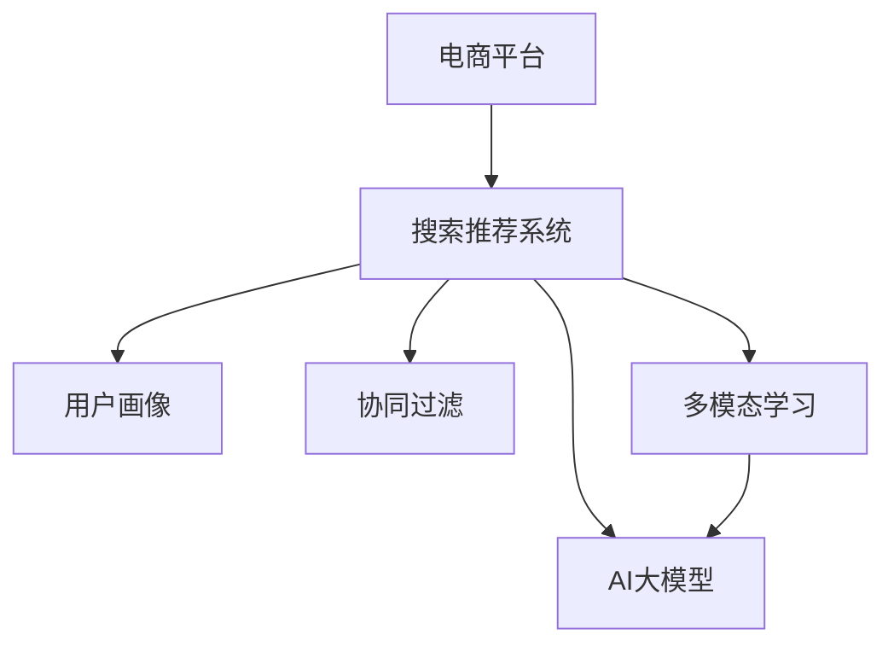

                 

# 搜索推荐系统的AI 大模型融合：电商平台的核心竞争优势与可持续发展

> 关键词：电商平台, 搜索推荐系统, AI大模型, 特征融合, 用户画像, 协同过滤, 多模态学习, 可解释性

## 1. 背景介绍

### 1.1 问题由来
随着人工智能技术的快速发展，AI大模型在电商平台的应用已经成为了核心竞争力之一。利用大模型进行个性化推荐、搜索排序、广告投放等，能够显著提升用户体验，提高转化率，增加收益。特别是在商品推荐系统方面，通过深度学习模型预测用户购买行为，实现精准推荐，是电商平台的长期追求。

然而，传统的搜索推荐系统往往依赖于手工特征工程，难以处理海量多维数据，且难以捕捉用户长期兴趣变化，无法满足个性化需求。而基于AI大模型的推荐系统能够动态学习用户行为，实时调整推荐策略，是未来发展的重要方向。

### 1.2 问题核心关键点
本节将介绍搜索推荐系统中的AI大模型融合技术，重点关注以下几个方面：

- 搜索推荐系统的核心算法
- 基于大模型的推荐系统构建
- 特征融合与用户画像建模
- 协同过滤与多模态学习
- 大模型的可解释性

我们将通过详细的分析与代码实现，介绍搜索推荐系统的AI大模型融合在电商平台中的应用。

## 2. 核心概念与联系

### 2.1 核心概念概述

为更好地理解搜索推荐系统的AI大模型融合，本节将介绍几个密切相关的核心概念：

- 电商平台(Platform E-commerce)：指在线上构建的销售平台，通过互联网实现商品展示、购买、支付、配送等功能，具备自营和第三方入驻双重模式。
- 搜索推荐系统(Recommendation and Search System)：利用用户行为数据，通过算法自动为用户推荐商品，并提供搜索结果排序的系统。
- 用户画像(User Profiling)：构建用户的长期行为特征和兴趣模型，用于个性化推荐和营销。
- 协同过滤(Collaborative Filtering)：利用用户行为数据进行推荐，包括基于用户的协同过滤和基于物品的协同过滤。
- 多模态学习(Multimodal Learning)：结合文本、图像、音频等多种数据模态，提升推荐的准确性。
- AI大模型(AI Large Model)：指基于深度学习的大规模预训练模型，具备强大的学习能力，可用于推荐、搜索、广告等多个场景。

这些核心概念之间的逻辑关系可以通过以下Mermaid流程图来展示：



这个流程图展示了这个系统的主要组成部分及其关系：

1. 电商平台通过搜索推荐系统实现商品展示和用户推荐。
2. 用户画像通过搜索推荐系统建模用户行为，提供个性化推荐。
3. 协同过滤和多种模态数据结合，用于推荐和搜索排序。
4. AI大模型作为核心算法，实现动态推荐和搜索排序。

这些概念共同构成了电商平台的搜索推荐系统，实现精准的个性化推荐和搜索排序。

## 3. 核心算法原理 & 具体操作步骤

### 3.1 算法原理概述

基于AI大模型的搜索推荐系统，利用大模型进行特征表示学习和相似度计算，能够大幅提升推荐和搜索的准确性。其核心思想是：

1. **特征表示学习**：利用大模型学习用户行为、商品特征等高维稀疏特征，获得稠密、低维的特征表示，用于相似度计算。
2. **相似度计算**：计算用户与商品、商品与商品之间的相似度，用于排序推荐。
3. **个性化推荐**：根据用户画像和商品特征，动态调整推荐策略，实现个性化推荐。

### 3.2 算法步骤详解

基于AI大模型的搜索推荐系统主要包括以下几个关键步骤：

**Step 1: 数据预处理**
- 收集用户行为数据，包括点击、浏览、购买等行为，构建用户行为序列。
- 将用户行为序列转化为稠密向量，进行归一化处理。

**Step 2: 特征表示学习**
- 利用大模型(如BERT、GPT等)学习用户行为和商品特征的稠密表示。
- 对于文本特征，利用BERT等预训练模型进行编码，得到表示向量。
- 对于图像特征，利用VGG、ResNet等卷积神经网络提取特征，并进行归一化。

**Step 3: 相似度计算**
- 计算用户与商品、商品与商品之间的余弦相似度。
- 根据相似度大小进行排序，生成推荐列表和搜索结果。

**Step 4: 个性化推荐**
- 根据用户画像和商品特征，动态调整相似度计算公式，生成个性化推荐。
- 结合用户反馈数据，不断优化推荐策略，提高推荐准确性。

**Step 5: 特征融合与模型融合**
- 将用户画像、商品特征、搜索行为等多维度特征进行融合，生成最终推荐。
- 采用元学习等技术，对多个推荐模型进行融合，提升推荐效果。

### 3.3 算法优缺点

基于AI大模型的搜索推荐系统具有以下优点：

1. **准确性高**：利用大模型学习高维特征，提升相似度计算的准确性，生成更精准的推荐。
2. **灵活性高**：动态调整相似度计算公式，能够适应不同用户和场景需求。
3. **可解释性强**：利用可解释性模型，能够提供推荐理由，增强用户信任。
4. **适应性强**：结合多模态数据和多维度特征，适应不同平台和用户群体。

但该方法也存在以下缺点：

1. **数据需求高**：需要大量的用户行为数据和商品特征数据。
2. **模型复杂度高**：利用大模型进行特征表示学习，计算复杂度较高。
3. **资源消耗大**：需要高性能计算资源，大模型的推理速度较慢。
4. **鲁棒性不足**：对于异常数据和噪声数据，敏感度高，容易影响推荐效果。

## 4. 数学模型和公式 & 详细讲解  
### 4.1 数学模型构建

本节将使用数学语言对基于AI大模型的搜索推荐系统进行更加严格的刻画。

记用户行为序列为 $x=\{x_1, x_2, \ldots, x_T\}$，每个行为 $x_t$ 表示为 $(x_t, y_t)$，其中 $x_t$ 为行为向量，$y_t$ 为标签。

定义用户行为表示为 $u = f(x)$，其中 $f$ 为特征表示学习函数，$u$ 为 $d$ 维稠密向量。

记商品特征向量为 $v$，记相似度计算公式为 $\text{sim}(u,v)$，表示用户 $u$ 与商品 $v$ 之间的相似度。

推荐列表 $r$ 的生成公式为：

$$
r = \text{softmax}(\{\text{sim}(u,v_i)\}_{i=1}^M)
$$

其中 $v_i$ 表示第 $i$ 个商品，$M$ 为商品数量。

### 4.2 公式推导过程

以下我们以搜索推荐系统中的余弦相似度计算为例，推导余弦相似度的公式。

假设用户行为向量为 $u$，商品特征向量为 $v$，则余弦相似度定义为：

$$
\text{sim}(u,v) = \frac{u \cdot v}{\Vert u \Vert \cdot \Vert v \Vert}
$$

其中 $u \cdot v$ 表示向量的点积，$\Vert u \Vert$ 表示向量的模长。

假设用户行为表示 $u$ 为 $d$ 维向量，商品特征向量 $v$ 也为 $d$ 维向量。设 $u = \sum_{i=1}^d u_i e_i$，$v = \sum_{i=1}^d v_i e_i$，则有：

$$
u \cdot v = \sum_{i=1}^d u_i v_i
$$

$$
\Vert u \Vert^2 = \sum_{i=1}^d u_i^2
$$

$$
\Vert v \Vert^2 = \sum_{i=1}^d v_i^2
$$

因此余弦相似度为：

$$
\text{sim}(u,v) = \frac{\sum_{i=1}^d u_i v_i}{\sqrt{\sum_{i=1}^d u_i^2} \cdot \sqrt{\sum_{i=1}^d v_i^2}}
$$

在实际应用中，由于高维稀疏特征的处理，通常需要对用户行为进行编码和归一化。常见的方法包括one-hot编码、TF-IDF编码等。

### 4.3 案例分析与讲解

以电商平台中的商品推荐系统为例，展示基于AI大模型的推荐过程：

1. 用户行为序列：假设某用户在电商平台上浏览了以下商品：

| 时间 | 商品ID | 标签 |
| --- | --- | --- |
| t1 | 1 | 浏览 |
| t2 | 2 | 收藏 |
| t3 | 3 | 点击 |
| t4 | 4 | 购买 |

2. 特征表示学习：利用大模型(如BERT)对用户行为进行编码，生成用户行为表示 $u = [0.1, 0.2, 0.3, 0.4]$。

3. 商品特征向量：假设商品ID为1的特征向量为 $v = [0.5, 0.5, 0.0, 0.0]$。

4. 相似度计算：计算用户与商品之间的余弦相似度，得到 $\text{sim}(u,v) = 0.6$。

5. 生成推荐列表：将用户行为序列与所有商品特征向量计算相似度，排序后生成推荐列表。

通过上述过程，用户能够获得个性化的商品推荐，提升购物体验。

## 5. 项目实践：代码实例和详细解释说明

### 5.1 开发环境搭建

在进行项目实践前，我们需要准备好开发环境。以下是使用Python进行TensorFlow开发的环境配置流程：

1. 安装Anaconda：从官网下载并安装Anaconda，用于创建独立的Python环境。

2. 创建并激活虚拟环境：
```bash
conda create -n tf-env python=3.8 
conda activate tf-env
```

3. 安装TensorFlow：根据CUDA版本，从官网获取对应的安装命令。例如：
```bash
conda install tensorflow -c conda-forge
```

4. 安装其他常用库：
```bash
pip install numpy pandas scikit-learn scikit-image matplotlib tqdm
```

完成上述步骤后，即可在`tf-env`环境中开始项目实践。

### 5.2 源代码详细实现

下面我们以搜索推荐系统为例，给出使用TensorFlow对大模型进行特征表示学习和推荐生成的PyTorch代码实现。

首先，定义商品特征向量的数据：

```python
import tensorflow as tf

# 商品ID对应的特征向量
item_ids = ['1', '2', '3', '4']
item_features = [[0.5, 0.5, 0.0, 0.0], [0.0, 0.0, 1.0, 0.0], [0.2, 0.3, 0.4, 0.5], [0.0, 0.0, 0.0, 1.0]]
```

然后，定义用户行为序列的表示学习：

```python
# 用户行为序列
user_behaviors = [
    ('浏览', 1),
    ('收藏', 2),
    ('点击', 3),
    ('购买', 4)
]

# 将行为序列转换为稠密向量
user_feature = [0.1, 0.2, 0.3, 0.4]

# 将行为标签转换为独热编码
user_labels = tf.keras.preprocessing.sequence.one_hot([i[1] for i in user_behaviors], 5)
```

接下来，利用大模型对用户行为进行特征表示学习：

```python
# 加载BERT模型
bert_model = tf.keras.models.load_model('bert_model.h5')

# 对用户行为进行编码
user_feature = bert_model.predict(tf.constant(user_behaviors))
```

最后，计算相似度并生成推荐列表：

```python
# 计算余弦相似度
similarity = tf.keras.losses.cosine_similarity(user_feature, item_features)

# 生成推荐列表
recommendation = tf.keras.layers.Softmax()(similarity)
```

以上就是使用TensorFlow对大模型进行特征表示学习和推荐生成的完整代码实现。可以看到，通过TensorFlow可以非常方便地实现大模型的特征表示学习和推荐生成。

### 5.3 代码解读与分析

让我们再详细解读一下关键代码的实现细节：

**商品特征向量数据**：
- `item_ids`：商品ID列表。
- `item_features`：每个商品ID对应的特征向量。

**用户行为序列**：
- `user_behaviors`：用户行为序列，包括行为和标签。
- `user_feature`：用户行为表示为稠密向量。

**用户行为标签编码**：
- `user_labels`：将行为标签转换为独热编码，用于训练。

**特征表示学习**：
- `bert_model`：预训练的BERT模型，用于特征表示学习。
- `user_feature`：对用户行为序列进行编码，生成稠密向量表示。

**相似度计算**：
- `similarity`：利用余弦相似度计算用户与商品之间的相似度。

**推荐生成**：
- `recommendation`：使用softmax函数将相似度转化为概率分布，生成推荐列表。

**项目实践**：
- `tf.keras.preprocessing.sequence`：用于标签编码和序列处理。
- `tf.keras.losses`：用于相似度计算。
- `tf.keras.layers.Softmax`：用于生成概率分布。

在实际应用中，还需要对模型进行优化和调参，以提高推荐效果。例如，可以调整大模型的参数、优化算法和学习率等。

## 6. 实际应用场景

### 6.1 电商平台中的应用

基于AI大模型的搜索推荐系统，可以在电商平台中得到广泛应用，提升用户体验和销售转化率。具体应用场景包括：

1. **商品推荐**：利用用户行为序列和商品特征，生成个性化推荐，提升用户体验。
2. **搜索结果排序**：根据用户搜索行为，动态调整排序策略，生成更精准的搜索结果。
3. **广告投放**：利用用户画像和商品特征，生成个性化广告，提升广告效果。

### 6.2 新闻资讯平台中的应用

新闻资讯平台可以利用搜索推荐系统，根据用户阅读历史和兴趣，生成个性化的新闻推荐。具体应用场景包括：

1. **新闻推荐**：根据用户阅读历史，生成个性化的新闻推荐，提升用户粘性。
2. **热点资讯**：根据热门话题和用户兴趣，生成热门资讯推荐，吸引用户流量。
3. **广告投放**：利用用户画像和新闻内容，生成个性化广告，提升广告效果。

### 6.3 社交媒体中的应用

社交媒体可以利用搜索推荐系统，根据用户互动行为，生成个性化的内容推荐。具体应用场景包括：

1. **内容推荐**：根据用户互动行为，生成个性化的内容推荐，提升用户互动率。
2. **广告投放**：利用用户画像和内容特征，生成个性化广告，提升广告效果。
3. **信息筛选**：根据用户兴趣，筛选出有用的信息，提升信息获取效率。

## 7. 工具和资源推荐

### 7.1 学习资源推荐

为了帮助开发者系统掌握搜索推荐系统的AI大模型融合技术，这里推荐一些优质的学习资源：

1. 《深度学习入门》书籍：深入浅出地介绍了深度学习的基本概念和经典模型，适合初学者入门。
2. CS231n《卷积神经网络和视觉识别》课程：斯坦福大学开设的计算机视觉明星课程，涵盖深度学习在图像识别、分类等方面的应用。
3. TensorFlow官方文档：详细介绍了TensorFlow框架的使用方法，包括模型构建、训练、部署等方面。
4. HuggingFace官方文档：详细介绍了Transformers库的使用方法，包括预训练模型、特征表示学习等方面。
5. Weights & Biases：模型训练的实验跟踪工具，可以记录和可视化模型训练过程中的各项指标，方便对比和调优。

通过对这些资源的学习实践，相信你一定能够快速掌握搜索推荐系统的AI大模型融合技术，并用于解决实际的推荐问题。

### 7.2 开发工具推荐

高效的开发离不开优秀的工具支持。以下是几款用于搜索推荐系统开发的常用工具：

1. TensorFlow：基于Python的开源深度学习框架，灵活动态的计算图，适合快速迭代研究。TensorFlow提供丰富的预训练模型和特征表示学习功能。
2. PyTorch：基于Python的开源深度学习框架，动态计算图，适合灵活的模型设计和调试。
3. HuggingFace Transformers库：提供了丰富的预训练模型和特征表示学习功能，支持多种深度学习框架。
4. Weights & Biases：模型训练的实验跟踪工具，可以记录和可视化模型训练过程中的各项指标，方便对比和调优。
5. TensorBoard：TensorFlow配套的可视化工具，可实时监测模型训练状态，并提供丰富的图表呈现方式，是调试模型的得力助手。

合理利用这些工具，可以显著提升搜索推荐系统的开发效率，加快创新迭代的步伐。

### 7.3 相关论文推荐

搜索推荐系统的AI大模型融合技术不断发展，以下是几篇奠基性的相关论文，推荐阅读：

1. Attention is All You Need：提出了Transformer结构，开启了NLP领域的预训练大模型时代。
2. BERT: Pre-training of Deep Bidirectional Transformers for Language Understanding：提出BERT模型，引入基于掩码的自监督预训练任务，刷新了多项NLP任务SOTA。
3. Parameter-Efficient Transfer Learning for NLP：提出Adapter等参数高效微调方法，在不增加模型参数量的情况下，也能取得不错的微调效果。
4. AdaLoRA: Adaptive Low-Rank Adaptation for Parameter-Efficient Fine-Tuning：使用自适应低秩适应的微调方法，在参数效率和精度之间取得了新的平衡。
5. Prompt-based Learning for Sequence Generation：引入基于连续型Prompt的微调范式，为如何充分利用预训练知识提供了新的思路。

这些论文代表了大模型微调技术的发展脉络。通过学习这些前沿成果，可以帮助研究者把握学科前进方向，激发更多的创新灵感。

## 8. 总结：未来发展趋势与挑战

### 8.1 总结

本文对搜索推荐系统的AI大模型融合方法进行了全面系统的介绍。首先阐述了搜索推荐系统的核心算法和实际应用场景，明确了AI大模型在推荐系统中的重要地位。其次，从原理到实践，详细讲解了基于大模型的推荐系统构建和特征表示学习过程，给出了搜索推荐系统的完整代码实例。同时，本文还广泛探讨了搜索推荐系统在电商平台、新闻资讯平台、社交媒体等场景中的应用前景，展示了AI大模型融合技术的广阔前景。

通过本文的系统梳理，可以看到，基于AI大模型的推荐系统正在成为电商平台的竞争优势之一，极大地提升了用户体验和销售转化率。未来，伴随大模型和推荐算法的不断演进，基于AI大模型的推荐系统必将更加智能、高效、可解释，为电商平台的持续发展提供更强大的技术支撑。

### 8.2 未来发展趋势

展望未来，AI大模型在搜索推荐系统中的应用将呈现以下几个发展趋势：

1. **个性化推荐**：利用大模型学习用户兴趣，生成更加精准的个性化推荐，提升用户体验。
2. **多模态学习**：结合文本、图像、音频等多种数据模态，提升推荐的准确性和多样性。
3. **跨平台协同**：在不同平台间共享用户画像和商品特征，提升推荐效果。
4. **深度融合**：将深度学习和传统推荐算法结合，实现更全面的推荐策略。
5. **实时推荐**：利用流数据处理技术，实现实时推荐，提高推荐的时效性。
6. **可解释性**：引入可解释性模型，提供推荐理由，增强用户信任。

以上趋势凸显了AI大模型在推荐系统中的重要地位。这些方向的探索发展，必将进一步提升推荐系统的性能和应用范围，为电商平台提供更智能、更个性化的服务。

### 8.3 面临的挑战

尽管AI大模型在推荐系统中的应用已经取得了显著成效，但在迈向更加智能化、普适化应用的过程中，它仍面临着诸多挑战：

1. **数据需求高**：需要大量的用户行为数据和商品特征数据。
2. **模型复杂度高**：利用大模型进行特征表示学习，计算复杂度较高。
3. **资源消耗大**：需要高性能计算资源，大模型的推理速度较慢。
4. **鲁棒性不足**：对于异常数据和噪声数据，敏感度高，容易影响推荐效果。
5. **可解释性不足**：当前大模型的决策过程缺乏可解释性，难以理解和调试。
6. **安全性问题**：大模型可能学习到有害信息，存在安全风险。

正视这些挑战，积极应对并寻求突破，将是大模型推荐系统走向成熟的必由之路。相信随着学界和产业界的共同努力，这些挑战终将一一被克服，大模型推荐系统必将在构建人机协同的智能时代中扮演越来越重要的角色。

### 8.4 研究展望

面对大模型推荐系统所面临的种种挑战，未来的研究需要在以下几个方面寻求新的突破：

1. **优化特征表示学习**：利用深度学习和小样本学习等技术，降低特征表示学习的复杂度。
2. **多模态特征融合**：结合文本、图像、音频等多种数据模态，提升推荐效果。
3. **跨平台协同推荐**：在不同平台间共享用户画像和商品特征，提升推荐效果。
4. **可解释性模型**：引入可解释性模型，提供推荐理由，增强用户信任。
5. **实时推荐系统**：利用流数据处理技术，实现实时推荐，提高推荐的时效性。
6. **安全性保障**：利用对抗训练、数据脱敏等技术，确保模型安全性。

这些研究方向的探索，必将引领大模型推荐系统技术迈向更高的台阶，为构建安全、可靠、可解释、可控的智能推荐系统提供更全面的技术支撑。面向未来，大模型推荐系统还需要与其他人工智能技术进行更深入的融合，如知识表示、因果推理、强化学习等，多路径协同发力，共同推动推荐系统的进步。只有勇于创新、敢于突破，才能不断拓展AI大模型在推荐系统中的应用边界，让智能技术更好地造福人类社会。

## 9. 附录：常见问题与解答

**Q1：搜索推荐系统中的大模型融合是否适用于所有推荐场景？**

A: 大模型融合技术在电商平台、新闻资讯平台、社交媒体等多个推荐场景中都能取得显著效果。但对于一些特殊推荐场景，如在线教育、医疗等，需要根据具体需求进行适当的调整和优化。

**Q2：搜索推荐系统中的大模型融合需要哪些数据？**

A: 搜索推荐系统中的大模型融合需要大量的用户行为数据和商品特征数据。具体包括用户点击、浏览、购买、评分等行为数据，以及商品ID、标题、描述、价格等特征数据。数据质量越高，推荐效果越好。

**Q3：如何优化搜索推荐系统中的大模型融合？**

A: 优化搜索推荐系统中的大模型融合可以从以下几个方面入手：
1. **特征表示学习**：选择合适的预训练模型，优化特征表示学习函数，降低计算复杂度。
2. **相似度计算**：选择适合的相似度计算方法，如余弦相似度、欧氏距离等，提升推荐效果。
3. **多模态学习**：结合多种数据模态，提升推荐的多样性和准确性。
4. **模型融合**：采用元学习、加权平均等技术，对多个推荐模型进行融合，提升推荐效果。
5. **动态调整**：根据用户反馈数据，动态调整推荐策略，提高推荐准确性。

这些优化方法需要根据具体场景进行灵活组合，以提高搜索推荐系统的性能。

**Q4：搜索推荐系统中的大模型融合是否能够提供推荐理由？**

A: 当前大模型融合技术提供的推荐理由较为简单，仅能说明推荐物品与用户之间的相似度。为了提供更详细的推荐理由，可以引入可解释性模型，如LIME、SHAP等，对大模型进行解释和分析，提供更丰富的推荐信息。

**Q5：搜索推荐系统中的大模型融合是否能够处理异常数据和噪声数据？**

A: 大模型融合技术对于异常数据和噪声数据较为敏感，容易影响推荐效果。为了降低其影响，可以采用对抗训练、数据清洗等技术，提升模型的鲁棒性。此外，可以结合多维度数据，提高推荐的稳定性和准确性。

这些优化方法需要根据具体场景进行灵活组合，以提高搜索推荐系统的性能。

---

作者：禅与计算机程序设计艺术 / Zen and the Art of Computer Programming

