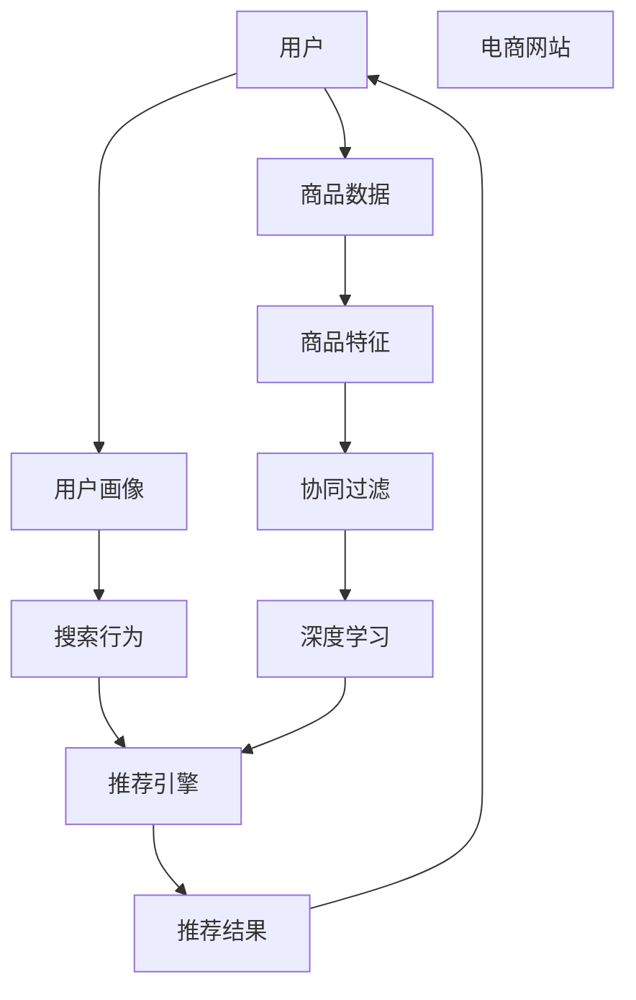

                 

# 搜索推荐系统的AI 大模型融合：电商平台的核心竞争力与转型发展战略

## 1. 背景介绍

在当今数字化时代，电商平台作为线上线下融合的重要平台，其核心竞争力已经从传统的交易撮合转向了智能化的搜索推荐服务。AI大模型的融合应用，为电商平台提供了强大的数据理解和用户洞察能力，极大地提升了用户体验和运营效率。本文将从核心概念入手，全面剖析AI大模型在搜索推荐系统中的融合应用，探讨其对电商平台核心竞争力与转型发展战略的深远影响。

## 2. 核心概念与联系

### 2.1 核心概念概述

为更好地理解AI大模型在搜索推荐系统中的应用，本节将介绍几个关键概念：

- **AI大模型**：指基于深度学习技术，通过大规模数据训练得到的通用或领域专用模型，如BERT、GPT等，具备强大的数据表征和学习能力。
- **搜索推荐系统**：指电商平台通过算法模型预测用户行为，向用户推荐商品或展示搜索结果的系统。
- **用户画像**：指对用户特征的全面描述，包括兴趣偏好、行为记录、社交关系等，用于个性化推荐。
- **协同过滤**：指通过用户行为记录或商品相关性进行推荐，属于基于用户或基于物品的推荐方法。
- **深度学习**：指利用多层神经网络结构，自动从数据中提取高层次特征，用于复杂模式识别和决策。
- **预训练模型**：指在大量无标签数据上进行训练的通用模型，如BERT，用于提取文本数据的语义表示。

### 2.2 核心概念原理和架构的 Mermaid 流程图



这个流程图展示了大模型在搜索推荐系统中的基本流程：用户通过电商平台进行浏览和搜索，产生数据被输入到推荐引擎中，通过深度学习模型和协同过滤算法生成个性化推荐结果，并反馈到用户端。电商网站则根据推荐结果展示商品，完成整个推荐循环。

## 3. 核心算法原理 & 具体操作步骤

### 3.1 算法原理概述

AI大模型在搜索推荐系统中的应用，主要基于深度学习和协同过滤两种算法。深度学习模型通过在大规模数据上预训练，提取高层次的语义表示，进而用于用户画像和商品特征的生成。协同过滤算法则利用用户行为数据，构建用户之间或商品之间的相似性关系，推荐与用户或商品相似的其他商品。

以基于BERT的推荐系统为例，算法流程主要分为以下几个步骤：

1. **用户画像生成**：将用户的历史行为数据（如浏览记录、购买历史）输入到预训练的BERT模型中，提取用户特征向量，用于表示用户画像。
2. **商品特征表示**：将商品的描述、标签等文本数据输入到预训练的BERT模型中，提取商品特征向量，用于表示商品。
3. **相似度计算**：计算用户画像和商品特征向量之间的相似度，筛选出与用户兴趣最相关的商品。
4. **推荐结果排序**：将相似度计算结果结合商品的其他属性（如价格、销量）进行综合排序，生成推荐列表。

### 3.2 算法步骤详解

以下将详细介绍基于BERT的推荐系统算法步骤：

**Step 1: 数据预处理**

- **用户行为数据**：包括浏览记录、点击次数、购买历史等。
- **商品数据**：包括商品名称、描述、标签、价格等。

**Step 2: 用户画像生成**

- **用户行为编码**：将用户行为数据转换为向量形式，作为输入。
- **BERT嵌入**：使用预训练的BERT模型进行编码，得到用户特征向量。

**Step 3: 商品特征表示**

- **商品数据编码**：将商品数据转换为向量形式，作为输入。
- **BERT嵌入**：使用预训练的BERT模型进行编码，得到商品特征向量。

**Step 4: 相似度计算**

- **余弦相似度**：计算用户画像和商品特征向量之间的余弦相似度，用于度量相关性。
- **相似度筛选**：选取相似度高于阈值的商品作为推荐候选集。

**Step 5: 推荐结果排序**

- **多模融合**：结合商品的属性（如价格、销量）和相似度得分，生成推荐结果。
- **模型训练**：通过优化算法（如Adagrad、Adam）对模型参数进行优化。

### 3.3 算法优缺点

基于BERT的推荐系统有以下优点：

1. **高精度**：利用深度学习模型提取语义表示，可以提升推荐的准确性和相关性。
2. **泛化能力强**：预训练的BERT模型具备通用性，可以应用于多种商品和用户，提升系统的鲁棒性。
3. **可解释性强**：BERT模型的特征向量可以解释用户行为和商品属性之间的关系，便于理解和调试。

同时，该方法也存在以下缺点：

1. **计算资源需求高**：BERT模型的参数量较大，训练和推理需要高性能的GPU/TPU设备。
2. **数据需求量大**：需要大量用户行为数据和商品数据，获取和标注成本较高。
3. **模型复杂度高**：深度学习模型复杂，维护和调参难度较大。
4. **易过拟合**：在大规模推荐数据集上，模型可能出现过拟合现象，影响泛化能力。

### 3.4 算法应用领域

基于BERT的推荐系统，广泛应用于电商平台的搜索推荐、个性化广告、商品分类等多个领域。具体而言：

- **搜索推荐**：用户输入查询词后，系统根据查询词和用户画像生成推荐列表。
- **个性化广告**：根据用户画像和行为数据，投放精准的个性化广告。
- **商品分类**：将商品自动分类，提高商品搜索的效率和准确性。
- **客户画像**：构建全面的用户画像，提升个性化推荐效果。

## 4. 数学模型和公式 & 详细讲解 & 举例说明

### 4.1 数学模型构建

假设用户画像表示为 $\mathbf{u}$，商品特征表示为 $\mathbf{v}$，相似度为 $s(\mathbf{u},\mathbf{v})$。推荐算法可以分为以下几步：

1. **用户画像生成**：将用户行为数据 $d_u$ 输入BERT模型，得到用户画像向量 $\mathbf{u}$。
2. **商品特征表示**：将商品数据 $d_v$ 输入BERT模型，得到商品特征向量 $\mathbf{v}$。
3. **相似度计算**：计算用户画像和商品特征向量之间的余弦相似度 $s(\mathbf{u},\mathbf{v})$。
4. **推荐结果排序**：根据相似度得分 $s(\mathbf{u},\mathbf{v})$ 和商品属性 $a_v$，使用线性回归模型对商品进行排序。

### 4.2 公式推导过程

**用户画像生成公式**：

$$
\mathbf{u} = \text{BERT}(d_u)
$$

**商品特征表示公式**：

$$
\mathbf{v} = \text{BERT}(d_v)
$$

**相似度计算公式**：

$$
s(\mathbf{u},\mathbf{v}) = \cos(\mathbf{u},\mathbf{v}) = \frac{\mathbf{u} \cdot \mathbf{v}}{\|\mathbf{u}\| \|\mathbf{v}\|}
$$

**推荐结果排序公式**：

$$
\text{rank}(\mathbf{v}) = \alpha \cdot s(\mathbf{u},\mathbf{v}) + \beta \cdot a_v
$$

其中 $\alpha$ 和 $\beta$ 为权重系数，用于平衡相似度和商品属性对推荐结果的影响。

### 4.3 案例分析与讲解

以电商平台搜索推荐为例，假设有如下数据：

- 用户行为数据 $d_u = \{\text{浏览记录}=[\text{商品1},\text{商品2},\text{商品3}]\}$。
- 商品数据 $d_v = \{\text{商品1的描述}=\text{商品1的标签}=\text{商品1的价格}\}$。

将用户行为数据和商品数据输入BERT模型，得到用户画像 $\mathbf{u}$ 和商品特征 $\mathbf{v}$。根据余弦相似度公式计算相似度得分 $s(\mathbf{u},\mathbf{v})$，然后使用线性回归模型对商品进行排序，得到推荐结果。

## 5. 项目实践：代码实例和详细解释说明

### 5.1 开发环境搭建

在进行项目实践前，我们需要准备好开发环境。以下是使用Python进行PyTorch开发的环境配置流程：

1. 安装Anaconda：从官网下载并安装Anaconda，用于创建独立的Python环境。

2. 创建并激活虚拟环境：
```bash
conda create -n pytorch-env python=3.8 
conda activate pytorch-env
```

3. 安装PyTorch：根据CUDA版本，从官网获取对应的安装命令。例如：
```bash
conda install pytorch torchvision torchaudio cudatoolkit=11.1 -c pytorch -c conda-forge
```

4. 安装Transformers库：
```bash
pip install transformers
```

5. 安装各类工具包：
```bash
pip install numpy pandas scikit-learn matplotlib tqdm jupyter notebook ipython
```

完成上述步骤后，即可在`pytorch-env`环境中开始项目实践。

### 5.2 源代码详细实现

下面我们以基于BERT的推荐系统为例，给出使用Transformers库的PyTorch代码实现。

首先，定义推荐系统的类结构：

```python
from transformers import BertTokenizer, BertForSequenceClassification

class RecommendationSystem:
    def __init__(self, model_path, tokenizer_path):
        self.tokenizer = BertTokenizer.from_pretrained(tokenizer_path)
        self.model = BertForSequenceClassification.from_pretrained(model_path)
        self.model.eval()
        
    def process_data(self, data, max_len=128):
        tokenized_data = self.tokenizer(data, return_tensors='pt', max_length=max_len, padding='max_length', truncation=True)
        return tokenized_data['input_ids'], tokenized_data['attention_mask']
    
    def predict(self, input_ids, attention_mask):
        with torch.no_grad():
            logits = self.model(input_ids=input_ids, attention_mask=attention_mask)
        return logits
    
    def recommend(self, user_data, item_data, k=10):
        user_ids, user_masks = self.process_data(user_data)
        item_ids, item_masks = self.process_data(item_data)
        
        user_logits = self.predict(user_ids, user_masks)
        item_logits = self.predict(item_ids, item_masks)
        
        user_similarity = user_logits.mean(dim=1)
        item_similarity = item_logits.mean(dim=1)
        
        recommendations = []
        for i in range(len(item_data)):
            similarity = user_similarity[i] * item_similarity[i]
            recommendations.append((i, similarity))
        recommendations.sort(key=lambda x: x[1], reverse=True)[:k]
        
        return recommendations
```

然后，定义训练函数：

```python
from torch.utils.data import Dataset, DataLoader
from sklearn.model_selection import train_test_split
from torch.optim import Adam

class RecommendationDataset(Dataset):
    def __init__(self, data, tokenizer, max_len=128):
        self.data = data
        self.tokenizer = tokenizer
        self.max_len = max_len
        
    def __len__(self):
        return len(self.data)
    
    def __getitem__(self, item):
        user_data, item_data = self.data[item]
        user_ids, user_masks = self.tokenizer(user_data, return_tensors='pt', max_length=self.max_len, padding='max_length', truncation=True)
        item_ids, item_masks = self.tokenizer(item_data, return_tensors='pt', max_length=self.max_len, padding='max_length', truncation=True)
        return user_ids, user_masks, item_ids, item_masks

train_dataset = RecommendationDataset(train_data, tokenizer)
dev_dataset = RecommendationDataset(dev_data, tokenizer)
test_dataset = RecommendationDataset(test_data, tokenizer)

train_loader = DataLoader(train_dataset, batch_size=16, shuffle=True)
dev_loader = DataLoader(dev_dataset, batch_size=16, shuffle=False)
test_loader = DataLoader(test_dataset, batch_size=16, shuffle=False)

model = RecommendationSystem(model_path, tokenizer_path)
optimizer = Adam(model.parameters(), lr=2e-5)
criterion = torch.nn.CrossEntropyLoss()

for epoch in range(epochs):
    for batch in train_loader:
        user_ids, user_masks, item_ids, item_masks = batch
        user_logits = model.predict(user_ids, user_masks)
        item_logits = model.predict(item_ids, item_masks)
        loss = criterion(user_logits, item_ids)
        optimizer.zero_grad()
        loss.backward()
        optimizer.step()
        
    with torch.no_grad():
        dev_logits = model.predict(dev_loader.dataset.data, dev_loader.dataset.tokenizer(dev_loader.dataset.data))
        test_logits = model.predict(test_loader.dataset.data, test_loader.dataset.tokenizer(test_loader.dataset.data))
        
    dev_loss = criterion(dev_logits, dev_loader.dataset.targets).item()
    test_loss = criterion(test_logits, test_loader.dataset.targets).item()
    print(f"Epoch {epoch+1}, dev loss: {dev_loss:.3f}, test loss: {test_loss:.3f}")
```

最后，在训练完成后，可以使用推荐系统进行推荐：

```python
user_data = ["商品1的描述"]
item_data = ["商品2的描述", "商品3的描述", "商品4的描述", "商品5的描述"]
recommendations = model.recommend(user_data, item_data)
print(f"推荐结果: {recommendations}")
```

以上就是使用PyTorch对基于BERT的推荐系统进行开发的完整代码实现。可以看到，Transformer库使得代码实现变得简洁高效。开发者可以将更多精力放在数据处理、模型改进等高层逻辑上，而不必过多关注底层的实现细节。

### 5.3 代码解读与分析

让我们再详细解读一下关键代码的实现细节：

**RecommendationSystem类**：
- `__init__`方法：初始化tokenizer和BERT模型，并将模型设置为评估模式。
- `process_data`方法：对输入数据进行分词和编码，返回tensor化的输入。
- `predict`方法：将输入数据前向传播，得到模型的预测结果。
- `recommend`方法：计算用户画像和商品特征的相似度，生成推荐列表。

**train函数**：
- 定义数据集和数据加载器，准备训练数据。
- 定义优化器、损失函数，对模型进行训练。
- 在每个epoch内，对训练集数据进行迭代训练，计算损失函数，并更新模型参数。

**recommendation_dataset类**：
- 继承自`Dataset`，用于处理推荐数据。
- `__init__`方法：初始化数据和分词器。
- `__getitem__`方法：对单个样本进行编码，返回tensor化的输入和标签。

合理利用这些工具，可以显著提升推荐系统的开发效率，加快创新迭代的步伐。

## 6. 实际应用场景

### 6.1 智能客服系统

基于大模型融合的推荐系统，可以广泛应用于智能客服系统的构建。传统客服往往需要配备大量人力，高峰期响应缓慢，且一致性和专业性难以保证。而使用融合大模型的推荐系统，可以7x24小时不间断服务，快速响应客户咨询，用自然流畅的语言解答各类常见问题。

在技术实现上，可以收集企业内部的历史客服对话记录，将问题和最佳答复构建成监督数据，在此基础上对预训练模型进行微调。微调后的推荐系统能够自动理解用户意图，匹配最合适的答复模板进行回复。对于客户提出的新问题，还可以接入检索系统实时搜索相关内容，动态组织生成回答。如此构建的智能客服系统，能大幅提升客户咨询体验和问题解决效率。

### 6.2 金融舆情监测

金融机构需要实时监测市场舆论动向，以便及时应对负面信息传播，规避金融风险。传统的人工监测方式成本高、效率低，难以应对网络时代海量信息爆发的挑战。基于大模型融合的推荐系统，为金融舆情监测提供了新的解决方案。

具体而言，可以收集金融领域相关的新闻、报道、评论等文本数据，并对其进行主题标注和情感标注。在此基础上对预训练语言模型进行微调，使其能够自动判断文本属于何种主题，情感倾向是正面、中性还是负面。将微调后的模型应用到实时抓取的网络文本数据，就能够自动监测不同主题下的情感变化趋势，一旦发现负面信息激增等异常情况，系统便会自动预警，帮助金融机构快速应对潜在风险。

### 6.3 个性化推荐系统

当前的推荐系统往往只依赖用户的历史行为数据进行物品推荐，无法深入理解用户的真实兴趣偏好。基于大模型融合的推荐系统，可以更好地挖掘用户行为背后的语义信息，从而提供更精准、多样的推荐内容。

在实践中，可以收集用户浏览、点击、评论、分享等行为数据，提取和用户交互的物品标题、描述、标签等文本内容。将文本内容作为模型输入，用户的后续行为（如是否点击、购买等）作为监督信号，在此基础上微调预训练语言模型。微调后的模型能够从文本内容中准确把握用户的兴趣点。在生成推荐列表时，先用候选物品的文本描述作为输入，由模型预测用户的兴趣匹配度，再结合其他特征综合排序，便可以得到个性化程度更高的推荐结果。

### 6.4 未来应用展望

随着大模型融合技术的不断发展，基于推荐系统的应用将更加广泛，为各行业带来变革性影响。

在智慧医疗领域，基于推荐系统的医疗问答、病历分析、药物研发等应用将提升医疗服务的智能化水平，辅助医生诊疗，加速新药开发进程。

在智能教育领域，融合大模型的推荐系统可应用于作业批改、学情分析、知识推荐等方面，因材施教，促进教育公平，提高教学质量。

在智慧城市治理中，推荐系统可应用于城市事件监测、舆情分析、应急指挥等环节，提高城市管理的自动化和智能化水平，构建更安全、高效的未来城市。

此外，在企业生产、社会治理、文娱传媒等众多领域，基于大模型融合的人工智能应用也将不断涌现，为经济社会发展注入新的动力。相信随着技术的日益成熟，推荐系统必将在更广阔的应用领域大放异彩，深刻影响人类的生产生活方式。

## 7. 工具和资源推荐

### 7.1 学习资源推荐

为了帮助开发者系统掌握大模型融合的理论基础和实践技巧，这里推荐一些优质的学习资源：

1. 《深度学习入门：基于TensorFlow》系列博文：由大模型技术专家撰写，深入浅出地介绍了深度学习的基础概念和应用。

2. CS231n《深度学习计算机视觉》课程：斯坦福大学开设的计算机视觉明星课程，涵盖了深度学习在图像处理中的应用。

3. 《深度学习与自然语言处理》书籍：自然语言处理领域的权威教材，介绍了深度学习在NLP任务中的应用。

4. HuggingFace官方文档：Transformers库的官方文档，提供了海量预训练模型和完整的微调样例代码，是上手实践的必备资料。

5. Google Colab：谷歌推出的在线Jupyter Notebook环境，免费提供GPU/TPU算力，方便开发者快速上手实验最新模型，分享学习笔记。

通过对这些资源的学习实践，相信你一定能够快速掌握大模型融合的精髓，并用于解决实际的NLP问题。

### 7.2 开发工具推荐

高效的开发离不开优秀的工具支持。以下是几款用于大模型融合开发的常用工具：

1. PyTorch：基于Python的开源深度学习框架，灵活动态的计算图，适合快速迭代研究。大部分预训练语言模型都有PyTorch版本的实现。

2. TensorFlow：由Google主导开发的开源深度学习框架，生产部署方便，适合大规模工程应用。同样有丰富的预训练语言模型资源。

3. Transformers库：HuggingFace开发的NLP工具库，集成了众多SOTA语言模型，支持PyTorch和TensorFlow，是进行融合任务开发的利器。

4. Weights & Biases：模型训练的实验跟踪工具，可以记录和可视化模型训练过程中的各项指标，方便对比和调优。与主流深度学习框架无缝集成。

5. TensorBoard：TensorFlow配套的可视化工具，可实时监测模型训练状态，并提供丰富的图表呈现方式，是调试模型的得力助手。

6. Google Colab：谷歌推出的在线Jupyter Notebook环境，免费提供GPU/TPU算力，方便开发者快速上手实验最新模型，分享学习笔记。

合理利用这些工具，可以显著提升大模型融合的开发效率，加快创新迭代的步伐。

### 7.3 相关论文推荐

大模型融合的发展源于学界的持续研究。以下是几篇奠基性的相关论文，推荐阅读：

1. Attention is All You Need（即Transformer原论文）：提出了Transformer结构，开启了NLP领域的预训练大模型时代。

2. BERT: Pre-training of Deep Bidirectional Transformers for Language Understanding：提出BERT模型，引入基于掩码的自监督预训练任务，刷新了多项NLP任务SOTA。

3. Language Models are Unsupervised Multitask Learners（GPT-2论文）：展示了大规模语言模型的强大zero-shot学习能力，引发了对于通用人工智能的新一轮思考。

4. Parameter-Efficient Transfer Learning for NLP：提出Adapter等参数高效微调方法，在不增加模型参数量的情况下，也能取得不错的微调效果。

5. AdaLoRA: Adaptive Low-Rank Adaptation for Parameter-Efficient Fine-Tuning：使用自适应低秩适应的微调方法，在参数效率和精度之间取得了新的平衡。

这些论文代表了大模型融合技术的发展脉络。通过学习这些前沿成果，可以帮助研究者把握学科前进方向，激发更多的创新灵感。

## 8. 总结：未来发展趋势与挑战

### 8.1 总结

本文对基于大模型融合的搜索推荐系统进行了全面系统的介绍。首先阐述了大模型融合在电商平台搜索推荐中的应用背景和意义，明确了融合技术在提升用户体验和运营效率方面的独特价值。其次，从原理到实践，详细讲解了推荐算法的数学模型和关键步骤，给出了融合任务开发的完整代码实例。同时，本文还广泛探讨了融合技术在智能客服、金融舆情、个性化推荐等多个行业领域的应用前景，展示了融合范式的巨大潜力。此外，本文精选了融合技术的各类学习资源，力求为读者提供全方位的技术指引。

通过本文的系统梳理，可以看到，基于大模型融合的推荐系统正在成为电商平台的核心竞争力，极大地提升了用户体验和运营效率。融合技术的应用，不仅改变了电商平台的服务模式，还催生了更多的创新应用场景，为传统行业带来了变革性影响。未来，伴随大模型融合技术的不断演进，基于推荐系统的应用将更加广泛，为各行各业带来更多的智能化机遇。

### 8.2 未来发展趋势

展望未来，大模型融合技术将呈现以下几个发展趋势：

1. **多模态融合**：推荐系统将进一步拓展到图像、视频、语音等多模态数据融合，增强对复杂场景的理解和表达能力。

2. **跨领域融合**：推荐系统将融合更多领域的数据和知识，提升模型的泛化能力和应用范围。

3. **实时化融合**：推荐系统将实现实时数据处理和实时推荐，提升用户体验和系统效率。

4. **可解释性增强**：推荐系统的决策过程将更加透明，便于理解和调试。

5. **个性化强化**：推荐系统将更加注重个性化推荐，结合用户行为和语义信息，提供更加精准的推荐结果。

6. **协同推荐**：推荐系统将实现多用户之间的协同推荐，增强推荐的丰富度和多样性。

以上趋势凸显了大模型融合技术的广阔前景。这些方向的探索发展，必将进一步提升推荐系统的性能和应用范围，为各行各业带来更多的智能化机遇。

### 8.3 面临的挑战

尽管大模型融合技术已经取得了瞩目成就，但在迈向更加智能化、普适化应用的过程中，它仍面临着诸多挑战：

1. **数据隐私和安全**：用户数据的隐私保护和安全性要求高，如何合理使用和保护用户数据，是融合技术面临的重要问题。

2. **计算资源瓶颈**：大模型融合需要高性能的计算资源，如何降低计算成本，提升系统效率，是融合技术需要解决的关键问题。

3. **模型复杂度**：大模型融合的模型复杂度高，如何简化模型结构，提升模型效率，是融合技术需要关注的重点。

4. **泛化能力**：模型在特定领域的泛化能力不足，如何提升模型在不同场景下的表现，是融合技术需要克服的难点。

5. **用户体验**：推荐结果需要更加贴近用户需求，如何提升推荐结果的个性化和满意度，是融合技术需要优化的目标。

6. **算法透明性**：推荐算法的决策过程需要更加透明，如何提升算法的可解释性，是融合技术需要探索的方向。

正视融合技术面临的这些挑战，积极应对并寻求突破，将是大模型融合技术迈向成熟的必由之路。相信随着学界和产业界的共同努力，这些挑战终将一一被克服，大模型融合技术必将在构建智能推荐系统方面发挥更大的作用。

### 8.4 研究展望

面对大模型融合技术所面临的种种挑战，未来的研究需要在以下几个方面寻求新的突破：

1. **多模态融合技术**：开发更加高效的多模态融合算法，提升模型对复杂场景的理解能力。

2. **跨领域融合技术**：结合更多领域的数据和知识，提升模型的泛化能力和应用范围。

3. **实时化推荐技术**：实现实时数据处理和实时推荐，提升用户体验和系统效率。

4. **个性化推荐技术**：结合用户行为和语义信息，提供更加精准的推荐结果。

5. **协同推荐技术**：实现多用户之间的协同推荐，增强推荐的丰富度和多样性。

6. **算法透明性技术**：提升算法的可解释性，增强系统的透明性和可信度。

这些研究方向的探索，必将引领大模型融合技术迈向更高的台阶，为智能推荐系统的进步贡献力量。面向未来，大模型融合技术还需要与其他人工智能技术进行更深入的融合，如知识表示、因果推理、强化学习等，多路径协同发力，共同推动智能推荐系统的进步。只有勇于创新、敢于突破，才能不断拓展推荐系统的边界，让智能技术更好地造福人类社会。

## 9. 附录：常见问题与解答

**Q1：基于大模型融合的推荐系统是否适用于所有电商平台？**

A: 基于大模型融合的推荐系统在大多数电商平台上都能取得不错的效果，特别是对于数据量较大的平台。但对于一些特定领域的电商平台，如垂直电商或小众商品市场，数据量和用户量较小，需要针对性地调整推荐算法和数据处理方式。

**Q2：大模型融合需要哪些计算资源？**

A: 大模型融合需要高性能的计算资源，包括GPU/TPU等硬件设备。模型的训练和推理需要大量的计算资源，特别是在大规模数据集上训练时，计算资源的需求更高。可以通过分布式计算、模型压缩等方法优化资源使用。

**Q3：如何优化大模型融合算法的计算效率？**

A: 优化计算效率的方法包括：
1. 数据预处理：进行数据分块、数据压缩等处理，减少计算量和内存占用。
2. 模型压缩：使用知识蒸馏、剪枝等方法，减少模型的参数量。
3. 分布式计算：使用分布式训练框架，如TensorFlow、PyTorch等，提升计算效率。
4. 算法优化：优化算法的计算图，减少冗余计算和内存占用。

**Q4：大模型融合的推荐系统如何处理推荐结果的多样性？**

A: 处理推荐结果多样性的方法包括：
1. 多模型集成：训练多个推荐模型，取平均值或投票结果，抑制推荐结果的偏见。
2. 用户反馈：通过用户反馈调整推荐算法，提升推荐的准确性和多样性。
3. 个性化推荐：结合用户行为和语义信息，提供更加精准和多样化的推荐结果。

这些方法可以结合使用，提升推荐系统的多样性和用户满意度。

**Q5：如何提升大模型融合算法的泛化能力？**

A: 提升泛化能力的方法包括：
1. 增加数据量：收集更多数据，进行数据增强，提升模型的泛化能力。
2. 优化模型结构：设计更加合理的模型结构，减少过拟合风险。
3. 正则化技术：使用L2正则、Dropout等正则化技术，防止模型过拟合。
4. 模型融合：结合多个模型的预测结果，提升模型的泛化能力。

这些方法可以结合使用，提升模型的泛化能力和应用范围。

---

作者：禅与计算机程序设计艺术 / Zen and the Art of Computer Programming

