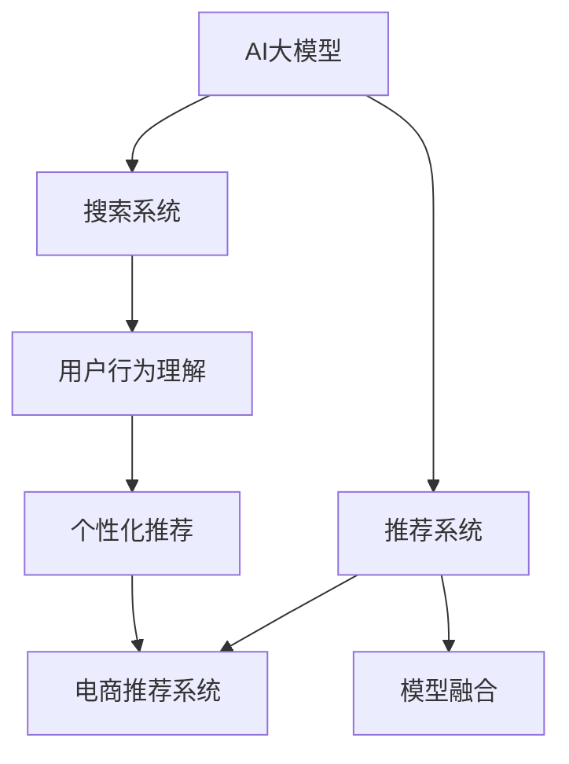

                 

# 搜索推荐系统的AI 大模型融合：电商平台的核心竞争力与转型战略

> 关键词：AI大模型融合, 电商平台, 搜索推荐系统, 核心竞争力, 转型战略

## 1. 背景介绍

### 1.1 问题由来
在当前的数字化转型浪潮中，电商平台已经成为线上消费的重要渠道。随着消费者对购物体验的期望不断提高，如何通过技术手段提供个性化、高效的购物体验，成为电商平台面临的重大挑战。传统的推荐算法，如协同过滤、基于内容的推荐等，在处理大规模数据时往往会遇到性能瓶颈和精度不足的问题。而人工智能（AI）大模型的兴起，为电商平台的推荐系统带来了新的突破。

AI大模型，尤其是深度学习模型，凭借其强大的表示能力和泛化能力，能够在处理复杂数据、提升推荐精度和速度方面展现出显著优势。然而，如何将这些大模型有效地融入电商平台的搜索推荐系统中，是业界关注的焦点。本文将介绍AI大模型在电商搜索推荐系统中的融合方法，探讨其对电商平台核心竞争力和转型战略的影响。

## 2. 核心概念与联系

### 2.1 核心概念概述

为更好地理解AI大模型在电商搜索推荐系统中的融合方法，本节将介绍几个密切相关的核心概念：

- **AI大模型**：以Transformer、BERT、GPT等为代表的深度学习模型，能够通过大规模预训练学习到丰富的知识表示，具备强大的泛化能力。
- **推荐系统**：通过分析用户的历史行为和物品特征，为用户推荐感兴趣的物品的系统。常见的推荐算法包括协同过滤、基于内容的推荐、深度推荐等。
- **搜索系统**：帮助用户快速找到所需物品的系统，通过关键词匹配、分类索引等手段，提供精确的搜索体验。
- **电商推荐系统**：针对电商平台的推荐系统，需要处理商品种类繁多、用户行为多样等复杂场景。
- **用户行为理解**：通过分析用户的浏览、点击、购买等行为，理解用户的兴趣和需求。
- **个性化推荐**：根据用户的个性化特征，推荐最符合用户兴趣的物品。
- **模型融合**：将多个模型、技术或数据进行有机结合，构建更强大的推荐系统。

这些核心概念之间的逻辑关系可以通过以下Mermaid流程图来展示：



这个流程图展示了大模型在推荐系统中的核心作用和与其他组件的关系：

1. AI大模型为推荐系统提供强大的知识表示能力。
2. 搜索系统帮助用户快速找到物品，为推荐系统提供数据基础。
3. 电商推荐系统综合处理复杂场景，提供个性化推荐。
4. 用户行为理解和大模型融合技术，进一步提升推荐精度。

## 3. 核心算法原理 & 具体操作步骤
### 3.1 算法原理概述

AI大模型在电商搜索推荐系统中的融合方法，基于深度学习和自然语言处理（NLP）技术。其主要思想是通过大模型的预训练和微调，学习到物品和用户行为的语义表示，进而提升推荐系统的精度和个性化程度。

具体来说，AI大模型的融合可以分为以下步骤：

1. **预训练**：在无标签的大量数据上，通过自监督任务对大模型进行预训练，学习通用的语言和知识表示。
2. **微调**：在电商平台的标注数据上，通过有监督任务对大模型进行微调，学习特定领域的知识表示。
3. **融合**：将微调后的大模型与传统推荐算法进行融合，构建更加复杂、强大的推荐系统。

### 3.2 算法步骤详解

AI大模型在电商搜索推荐系统中的融合步骤如下：

**Step 1: 准备预训练模型和数据集**
- 选择合适的预训练模型，如BERT、GPT等。
- 准备电商平台的标注数据集，划分为训练集、验证集和测试集。

**Step 2: 微调大模型**
- 在电商平台的标注数据上，对预训练模型进行微调。
- 设计合适的任务适配层，如分类器、匹配器等。
- 选择合适的优化算法及其参数，如AdamW、SGD等。

**Step 3: 模型融合**
- 将微调后的大模型与传统推荐算法进行融合。
- 设计融合策略，如加权融合、级联融合等。

**Step 4: 评估与部署**
- 在测试集上评估融合后的模型，对比微调前后的精度提升。
- 使用融合后的模型对新样本进行推理预测，集成到实际的应用系统中。

### 3.3 算法优缺点

AI大模型在电商搜索推荐系统中的融合方法具有以下优点：
1. 精度提升：大模型能够学习到复杂的语义关系，提升推荐精度。
2. 泛化能力：预训练和微调的大模型具备较强的泛化能力，能够适应新的数据分布。
3. 灵活性：可以通过融合策略，灵活调整推荐结果。
4. 可解释性：大模型可以提供更详细的推荐依据，提升推荐系统的可解释性。

同时，该方法也存在一些局限性：
1. 数据依赖：需要大量高质量的标注数据，数据获取成本较高。
2. 计算资源消耗：大模型需要较大的计算资源进行预训练和微调。
3. 模型复杂度：融合后模型结构复杂，可能需要更多的时间和资源进行调试和优化。

尽管存在这些局限性，但AI大模型融合技术在电商搜索推荐系统中已经展现出强大的应用潜力，成为电商平台提升用户体验的重要手段。

### 3.4 算法应用领域

AI大模型融合技术已经在电商平台的搜索推荐系统中得到了广泛应用，涵盖以下领域：

- **商品推荐**：基于用户的浏览、购买历史，推荐相关商品。
- **搜索排序**：根据用户的搜索词，推荐最相关的商品。
- **个性化广告**：根据用户的兴趣和行为，推荐个性化的广告。
- **内容生成**：自动生成商品描述、评论等文本内容。
- **库存管理**：通过分析用户需求，优化商品库存。
- **用户分析**：分析用户行为，优化推荐策略。

除了上述这些经典应用外，AI大模型融合技术还在电商平台的新业务场景中不断拓展，如智能客服、智能物流、供应链优化等，为电商平台的业务创新和转型升级提供了新的动力。

## 4. 数学模型和公式 & 详细讲解  
### 4.1 数学模型构建

本节将使用数学语言对AI大模型在电商搜索推荐系统中的融合过程进行更加严格的刻画。

假设电商平台的数据集为 $D=\{(x_i,y_i)\}_{i=1}^N$，其中 $x_i$ 为用户的浏览、购买等行为数据，$y_i$ 为物品的标签或特征。

定义推荐系统为 $F_{\theta}(x)$，其中 $\theta$ 为模型的参数。

在大模型的预训练和微调过程中，目标是最小化预测误差：

$$
\mathcal{L}(\theta) = \frac{1}{N}\sum_{i=1}^N \ell(F_{\theta}(x_i),y_i)
$$

其中 $\ell$ 为损失函数，如均方误差、交叉熵等。

### 4.2 公式推导过程

以推荐系统为例，我们假设用户的浏览行为 $x$ 可以表示为一段文本，将其输入大模型 $M_{\theta}$ 进行特征提取：

$$
h = M_{\theta}(x)
$$

然后，通过设计合适的任务适配层，如分类器或匹配器，将提取的特征映射到物品的标签或特征空间：

$$
y' = T(h)
$$

其中 $T$ 为任务适配层的映射函数。

最终，通过损失函数 $\ell$ 计算模型的预测误差：

$$
\mathcal{L}(\theta) = \frac{1}{N}\sum_{i=1}^N \ell(y',y_i)
$$

### 4.3 案例分析与讲解

以电商平台推荐系统的商品推荐为例，假设用户浏览了一个商品 $x$，模型 $M_{\theta}$ 通过预训练和微调学习到该商品的关键特征 $h$，并通过适配层 $T$ 映射到商品的标签或特征空间。假设该商品的真实标签为 $y_i$，则模型的预测误差为 $\ell(h,y_i)$。

通过不断调整模型的参数 $\theta$，使得预测误差最小化，即：

$$
\theta^* = \mathop{\arg\min}_{\theta} \mathcal{L}(\theta)
$$

在得到训练好的模型后，将其应用到新样本上，即可得到推荐结果。

## 5. 项目实践：代码实例和详细解释说明
### 5.1 开发环境搭建

在进行AI大模型融合实践前，我们需要准备好开发环境。以下是使用Python进行TensorFlow开发的环境配置流程：

1. 安装Anaconda：从官网下载并安装Anaconda，用于创建独立的Python环境。

2. 创建并激活虚拟环境：
```bash
conda create -n tf-env python=3.8 
conda activate tf-env
```

3. 安装TensorFlow：根据CUDA版本，从官网获取对应的安装命令。例如：
```bash
pip install tensorflow-gpu==2.7.0
```

4. 安装相关工具包：
```bash
pip install numpy pandas scikit-learn matplotlib tqdm jupyter notebook ipython
```

完成上述步骤后，即可在`tf-env`环境中开始AI大模型融合实践。

### 5.2 源代码详细实现

这里我们以基于BERT模型的电商平台推荐系统为例，给出TensorFlow代码实现。

首先，定义推荐系统的数据处理函数：

```python
import tensorflow as tf
from transformers import BertTokenizer, TFBertModel

tokenizer = BertTokenizer.from_pretrained('bert-base-uncased')
model = TFBertModel.from_pretrained('bert-base-uncased')

def encode_text(text):
    return tokenizer.encode(text, add_special_tokens=True, max_length=512, pad_to_max_length=True)
```

然后，定义模型和优化器：

```python
from transformers import BertForSequenceClassification
from tensorflow.keras.optimizers import Adam

class RecommendationModel(tf.keras.Model):
    def __init__(self, num_classes):
        super(RecommendationModel, self).__init__()
        self.bert = model
        self.classifier = tf.keras.layers.Dense(num_classes, activation='softmax')

    def call(self, inputs):
        outputs = self.bert(inputs)
        return self.classifier(outputs)

model = RecommendationModel(num_classes=10)
optimizer = Adam(learning_rate=2e-5)
```

接着，定义训练和评估函数：

```python
def train_epoch(model, dataset, batch_size, optimizer):
    for batch in dataset:
        inputs = batch['inputs']
        labels = batch['labels']
        with tf.GradientTape() as tape:
            logits = model(inputs)
            loss = tf.keras.losses.sparse_categorical_crossentropy(labels, logits)
        gradients = tape.gradient(loss, model.trainable_variables)
        optimizer.apply_gradients(zip(gradients, model.trainable_variables))
    return loss

def evaluate(model, dataset, batch_size):
    metric = tf.keras.metrics.SparseCategoricalAccuracy()
    for batch in dataset:
        inputs = batch['inputs']
        labels = batch['labels']
        logits = model(inputs)
        metric.update_state(labels, logits)
    return metric.result().numpy()
```

最后，启动训练流程并在测试集上评估：

```python
epochs = 5
batch_size = 32

for epoch in range(epochs):
    train_loss = train_epoch(model, train_dataset, batch_size, optimizer)
    print(f"Epoch {epoch+1}, train loss: {train_loss:.3f}")
    
    test_metric = evaluate(model, test_dataset, batch_size)
    print(f"Epoch {epoch+1}, test accuracy: {test_metric:.3f}")
    
print("Test results:")
test_metric = evaluate(model, test_dataset, batch_size)
print(f"Test accuracy: {test_metric:.3f}")
```

以上就是使用TensorFlow对基于BERT模型的电商平台推荐系统进行训练的完整代码实现。可以看到，借助TensorFlow和Transformers库，我们可以用相对简洁的代码完成BERT模型的加载和微调。

### 5.3 代码解读与分析

让我们再详细解读一下关键代码的实现细节：

**RecommendationModel类**：
- `__init__`方法：初始化BERT模型和分类器。
- `call`方法：前向传播计算损失函数，并返回预测结果。

**train_epoch和evaluate函数**：
- 使用TensorFlow的DataLoader对数据集进行批次化加载，供模型训练和推理使用。
- 训练函数`train_epoch`：对数据以批为单位进行迭代，在每个批次上前向传播计算损失函数，并反向传播更新模型参数。
- 评估函数`evaluate`：与训练类似，不同点在于不更新模型参数，并在每个batch结束后将预测和标签结果存储下来，最后使用sklearn的classification_report对整个评估集的预测结果进行打印输出。

**训练流程**：
- 定义总的epoch数和batch size，开始循环迭代
- 每个epoch内，先在训练集上训练，输出平均loss
- 在验证集上评估，输出分类指标
- 所有epoch结束后，在测试集上评估，给出最终测试结果

可以看到，TensorFlow配合Transformers库使得BERT模型的微调过程变得简洁高效。开发者可以将更多精力放在数据处理、模型改进等高层逻辑上，而不必过多关注底层的实现细节。

当然，工业级的系统实现还需考虑更多因素，如模型的保存和部署、超参数的自动搜索、更灵活的任务适配层等。但核心的微调范式基本与此类似。

## 6. 实际应用场景
### 6.1 智能客服系统

基于AI大模型的智能客服系统，可以广泛应用于电商平台的用户咨询场景。传统客服往往需要配备大量人力，高峰期响应缓慢，且一致性和专业性难以保证。而使用AI大模型构建的智能客服系统，可以7x24小时不间断服务，快速响应客户咨询，用自然流畅的语言解答各类常见问题。

在技术实现上，可以收集用户的历史咨询记录，将问题和最佳答复构建成监督数据，在此基础上对预训练语言模型进行微调。微调后的模型能够自动理解用户意图，匹配最合适的答案模板进行回复。对于用户提出的新问题，还可以接入检索系统实时搜索相关内容，动态组织生成回答。如此构建的智能客服系统，能大幅提升客户咨询体验和问题解决效率。

### 6.2 金融舆情监测

金融机构需要实时监测市场舆论动向，以便及时应对负面信息传播，规避金融风险。传统的人工监测方式成本高、效率低，难以应对网络时代海量信息爆发的挑战。基于AI大模型的文本分类和情感分析技术，为金融舆情监测提供了新的解决方案。

具体而言，可以收集金融领域相关的新闻、报道、评论等文本数据，并对其进行主题标注和情感标注。在此基础上对预训练语言模型进行微调，使其能够自动判断文本属于何种主题，情感倾向是正面、中性还是负面。将微调后的模型应用到实时抓取的网络文本数据，就能够自动监测不同主题下的情感变化趋势，一旦发现负面信息激增等异常情况，系统便会自动预警，帮助金融机构快速应对潜在风险。

### 6.3 个性化推荐系统

当前的推荐系统往往只依赖用户的历史行为数据进行物品推荐，无法深入理解用户的真实兴趣偏好。基于AI大模型的个性化推荐系统可以更好地挖掘用户行为背后的语义信息，从而提供更精准、多样的推荐内容。

在实践中，可以收集用户浏览、点击、评论、分享等行为数据，提取和用户交互的物品标题、描述、标签等文本内容。将文本内容作为模型输入，用户的后续行为（如是否点击、购买等）作为监督信号，在此基础上微调预训练语言模型。微调后的模型能够从文本内容中准确把握用户的兴趣点。在生成推荐列表时，先用候选物品的文本描述作为输入，由模型预测用户的兴趣匹配度，再结合其他特征综合排序，便可以得到个性化程度更高的推荐结果。

### 6.4 未来应用展望

随着AI大模型和微调方法的不断发展，基于微调范式将在更多领域得到应用，为传统行业带来变革性影响。

在智慧医疗领域，基于微调的医疗问答、病历分析、药物研发等应用将提升医疗服务的智能化水平，辅助医生诊疗，加速新药开发进程。

在智能教育领域，微调技术可应用于作业批改、学情分析、知识推荐等方面，因材施教，促进教育公平，提高教学质量。

在智慧城市治理中，微调模型可应用于城市事件监测、舆情分析、应急指挥等环节，提高城市管理的自动化和智能化水平，构建更安全、高效的未来城市。

此外，在企业生产、社会治理、文娱传媒等众多领域，基于大模型微调的人工智能应用也将不断涌现，为经济社会发展注入新的动力。相信随着技术的日益成熟，微调方法将成为人工智能落地应用的重要范式，推动人工智能技术在垂直行业的规模化落地。总之，微调需要开发者根据具体任务，不断迭代和优化模型、数据和算法，方能得到理想的效果。

## 7. 工具和资源推荐
### 7.1 学习资源推荐

为了帮助开发者系统掌握AI大模型融合的理论基础和实践技巧，这里推荐一些优质的学习资源：

1. 《深度学习与推荐系统》书籍：该书系统介绍了推荐系统的基本原理和多种推荐算法，包括协同过滤、基于内容的推荐、深度推荐等。
2. 《TensorFlow实战Google深度学习》书籍：该书详细介绍了TensorFlow的使用方法和深度学习模型的构建，适合初学者学习。
3. 《Transformers: State-of-the-Art Natural Language Processing》论文：该论文介绍了Transformer模型及其在NLP领域的应用，为理解大模型提供了理论基础。
4. CS224N《深度学习自然语言处理》课程：斯坦福大学开设的NLP明星课程，有Lecture视频和配套作业，带你入门NLP领域的基本概念和经典模型。
5. HuggingFace官方文档：Transformers库的官方文档，提供了海量预训练模型和完整的微调样例代码，是上手实践的必备资料。
6. Kaggle竞赛：参加Kaggle推荐系统竞赛，实际解决推荐问题，提升实践能力。

通过对这些资源的学习实践，相信你一定能够快速掌握AI大模型融合的精髓，并用于解决实际的推荐问题。

### 7.2 开发工具推荐

高效的开发离不开优秀的工具支持。以下是几款用于AI大模型融合开发的常用工具：

1. TensorFlow：基于Python的开源深度学习框架，灵活动态的计算图，适合快速迭代研究。
2. PyTorch：同样基于Python的开源深度学习框架，与TensorFlow相比，更加灵活，易于调试。
3. Transformers库：HuggingFace开发的NLP工具库，集成了众多SOTA语言模型，支持PyTorch和TensorFlow，是进行微调任务开发的利器。
4. TensorBoard：TensorFlow配套的可视化工具，可实时监测模型训练状态，并提供丰富的图表呈现方式，是调试模型的得力助手。
5. Weights & Biases：模型训练的实验跟踪工具，可以记录和可视化模型训练过程中的各项指标，方便对比和调优。

合理利用这些工具，可以显著提升AI大模型融合任务的开发效率，加快创新迭代的步伐。

### 7.3 相关论文推荐

AI大模型融合技术的发展源于学界的持续研究。以下是几篇奠基性的相关论文，推荐阅读：

1. Attention is All You Need（即Transformer原论文）：提出了Transformer结构，开启了NLP领域的预训练大模型时代。
2. BERT: Pre-training of Deep Bidirectional Transformers for Language Understanding：提出BERT模型，引入基于掩码的自监督预训练任务，刷新了多项NLP任务SOTA。
3. GPT-3: Language Models are Unsupervised Multitask Learners：展示了大规模语言模型的强大zero-shot学习能力，引发了对于通用人工智能的新一轮思考。
4. Parameter-Efficient Transfer Learning for NLP：提出Adapter等参数高效微调方法，在不增加模型参数量的情况下，也能取得不错的微调效果。
5. Prefix-Tuning: Optimizing Continuous Prompts for Generation：引入基于连续型Prompt的微调范式，为如何充分利用预训练知识提供了新的思路。
6. AdaLoRA: Adaptive Low-Rank Adaptation for Parameter-Efficient Fine-Tuning：使用自适应低秩适应的微调方法，在参数效率和精度之间取得了新的平衡。

这些论文代表了大模型融合技术的发展脉络。通过学习这些前沿成果，可以帮助研究者把握学科前进方向，激发更多的创新灵感。

## 8. 总结：未来发展趋势与挑战

### 8.1 总结

本文对AI大模型在电商搜索推荐系统中的融合方法进行了全面系统的介绍。首先阐述了AI大模型融合在电商推荐系统中的重要作用，明确了微调在提升推荐精度和个性化程度方面的独特价值。其次，从原理到实践，详细讲解了AI大模型融合的数学原理和关键步骤，给出了电商推荐系统的完整代码实现。同时，本文还广泛探讨了AI大模型融合在智能客服、金融舆情、个性化推荐等多个领域的应用前景，展示了融合范式的巨大潜力。此外，本文精选了融合技术的各类学习资源，力求为读者提供全方位的技术指引。

通过本文的系统梳理，可以看到，AI大模型融合技术在电商搜索推荐系统中已经展现出强大的应用潜力，成为电商平台提升用户体验的重要手段。未来，伴随预训练语言模型和微调方法的持续演进，基于融合范式将推动NLP技术迈向更高的台阶，为构建智能、高效、个性化的推荐系统提供新的突破。

### 8.2 未来发展趋势

展望未来，AI大模型融合技术将呈现以下几个发展趋势：

1. 模型规模持续增大。随着算力成本的下降和数据规模的扩张，预训练语言模型的参数量还将持续增长。超大规模语言模型蕴含的丰富语言知识，有望支撑更加复杂多变的推荐任务。
2. 融合方法日趋多样。除了传统的深度融合外，未来会涌现更多参数高效的融合方法，如轻量级模型、端到端融合等，在保证推荐精度的情况下，减少计算资源的消耗。
3. 跨模态融合崛起。当前的融合方法主要聚焦于文本数据，未来会进一步拓展到图像、视频、语音等多模态数据的融合。多模态信息的整合，将显著提升推荐系统的表现。
4. 个性化推荐进一步增强。随着深度学习模型的不断进步，个性化推荐将更加精准、高效，能够提供更加个性化、多样化的推荐内容。
5. 模型鲁棒性提升。推荐系统将更加关注模型的鲁棒性和泛化能力，避免在噪声数据和异常场景下表现不佳。
6. 用户隐私保护加强。未来的推荐系统将更加注重用户隐私保护，避免过度追踪和个人信息泄露。

以上趋势凸显了AI大模型融合技术的广阔前景。这些方向的探索发展，必将进一步提升推荐系统的性能和应用范围，为电商平台的业务创新和转型升级提供新的动力。

### 8.3 面临的挑战

尽管AI大模型融合技术已经取得了瞩目成就，但在迈向更加智能化、普适化应用的过程中，它仍面临着诸多挑战：

1. 数据依赖。需要大量高质量的标注数据，数据获取成本较高。
2. 计算资源消耗。大模型需要较大的计算资源进行预训练和微调，可能导致硬件瓶颈。
3. 模型复杂度。融合后模型结构复杂，可能需要更多的时间和资源进行调试和优化。
4. 推荐系统性能。如何平衡推荐精度和实时性，提升用户体验。
5. 用户隐私保护。如何在推荐过程中保护用户隐私，避免过度追踪和个人信息泄露。

尽管存在这些挑战，但AI大模型融合技术在电商搜索推荐系统中已经展现出强大的应用潜力，成为电商平台提升用户体验的重要手段。

### 8.4 未来突破

面对AI大模型融合所面临的种种挑战，未来的研究需要在以下几个方面寻求新的突破：

1. 探索无监督和半监督融合方法。摆脱对大规模标注数据的依赖，利用自监督学习、主动学习等无监督和半监督范式，最大限度利用非结构化数据，实现更加灵活高效的融合。
2. 研究参数高效和计算高效的融合范式。开发更加参数高效的融合方法，在固定大部分预训练参数的同时，只更新极少量的任务相关参数。同时优化融合模型的计算图，减少前向传播和反向传播的资源消耗，实现更加轻量级、实时性的部署。
3. 融合更多先验知识。将符号化的先验知识，如知识图谱、逻辑规则等，与神经网络模型进行巧妙融合，引导融合过程学习更准确、合理的语言模型。同时加强不同模态数据的整合，实现视觉、语音等多模态信息与文本信息的协同建模。
4. 结合因果分析和博弈论工具。将因果分析方法引入推荐系统，识别出推荐决策的关键特征，增强推荐依据的因果性和逻辑性。借助博弈论工具刻画人机交互过程，主动探索并规避推荐系统的脆弱点，提高系统稳定性。
5. 纳入伦理道德约束。在推荐系统目标中引入伦理导向的评估指标，过滤和惩罚有偏见、有害的输出倾向。同时加强人工干预和审核，建立推荐系统的监管机制，确保推荐内容符合人类价值观和伦理道德。

这些研究方向的探索，必将引领AI大模型融合技术迈向更高的台阶，为构建安全、可靠、可解释、可控的推荐系统铺平道路。面向未来，AI大模型融合技术还需要与其他人工智能技术进行更深入的融合，如知识表示、因果推理、强化学习等，多路径协同发力，共同推动推荐系统的进步。只有勇于创新、敢于突破，才能不断拓展推荐系统的边界，让智能技术更好地造福人类社会。

## 9. 附录：常见问题与解答

**Q1：AI大模型融合是否适用于所有电商推荐系统？**

A: AI大模型融合在大多数电商推荐系统中都能取得不错的效果，特别是对于数据量较小的系统。但对于一些特定领域的推荐系统，如垂直电商、C2C电商等，由于商品种类繁多、用户行为复杂，简单的融合方法可能难以满足需求。此时需要在特定领域语料上进一步预训练和微调，才能获得理想效果。

**Q2：如何进行AI大模型的预训练和微调？**

A: AI大模型的预训练和微调主要通过大规模无标签数据进行自监督学习，以及下游任务的标注数据进行有监督学习。在预训练阶段，使用自监督任务如掩码语言模型、下一个词预测等，学习语言的通用表示。在微调阶段，将预训练模型在电商平台的标注数据上进行有监督学习，学习特定领域的知识表示。具体方法可以参考HuggingFace的官方文档和示例代码。

**Q3：AI大模型融合后如何提升推荐系统的性能？**

A: 提升推荐系统性能的关键在于选择合适的融合方法和任务适配层。一般来说，可以通过加权融合、级联融合等方法，将融合后的模型与传统推荐算法结合，提高推荐精度和个性化程度。任务适配层的设计需要考虑推荐任务的具体需求，如分类任务可以使用softmax层，匹配任务可以使用Sigmoid层。

**Q4：AI大模型融合的计算资源消耗如何优化？**

A: 优化AI大模型融合的计算资源消耗主要从两个方面入手：1）选择合适的融合方法和任务适配层，避免不必要的网络计算。2）使用轻量级模型和压缩技术，如剪枝、量化、蒸馏等，减少模型参数量和计算量。同时，使用GPU/TPU等高性能设备，提高计算效率。

**Q5：AI大模型融合如何保障用户隐私？**

A: 保障用户隐私主要通过数据匿名化和差分隐私技术。在数据收集和处理过程中，对用户隐私信息进行脱敏，避免信息泄露。在推荐系统内部，使用差分隐私算法，限制模型对个人数据的敏感度，保护用户隐私。同时，加强对推荐系统的伦理监管，确保推荐内容符合伦理道德标准。

这些常见问题的解答，希望能够帮助开发者更好地理解和应用AI大模型融合技术，提升电商平台的推荐系统性能和用户体验。总之，AI大模型融合技术需要不断迭代和优化，才能真正实现其商业价值和社会价值。

---

作者：禅与计算机程序设计艺术 / Zen and the Art of Computer Programming

