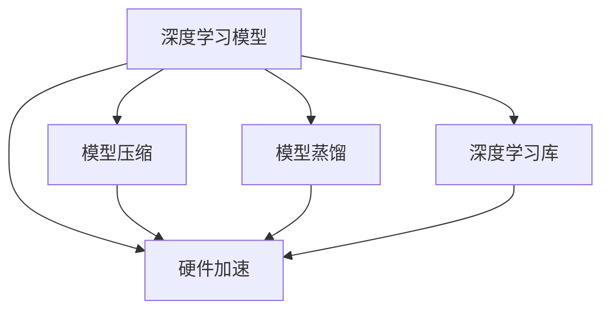

                 

# 搜索推荐系统的模型压缩：大模型高效部署策略

> 关键词：模型压缩,搜索推荐系统,大模型,深度学习,超参数优化,模型蒸馏,硬件加速

## 1. 背景介绍

### 1.1 问题由来
在互联网快速发展的今天，搜索引擎和推荐系统已成为人们获取信息和娱乐的重要工具。搜索引擎通过用户查询的文本信息匹配网页内容，推荐系统则根据用户的历史行为数据和当前偏好，生成个性化的搜索结果或商品推荐。传统的基于统计的搜索推荐系统虽然能够满足基本需求，但在应对大规模、高复杂度的任务时，其性能和效果显得捉襟见肘。

近年来，深度学习技术在搜索推荐领域取得了显著进展，基于深度神经网络模型的推荐系统逐步成为主流。其中，大规模预训练模型如BERT、GPT-3等，凭借强大的语言表征能力，在用户意图理解、商品匹配等方面表现优异，为搜索引擎和推荐系统的智能决策提供了坚实基础。然而，这些大规模模型不仅需要巨量计算资源进行训练，其推理和部署过程也面临诸多挑战。如何在保持模型精度的同时，实现高效、低成本的模型部署，成为当前深度学习社区关注的热点问题。

### 1.2 问题核心关键点
本文聚焦于搜索推荐系统中大模型的压缩和高效部署策略，旨在通过模型压缩技术，在有限的计算资源下，高效实现深度学习模型的推理和部署。具体来说，本文将介绍以下核心概念：

- 模型压缩（Model Compression）：指在不改变模型性能的前提下，减少模型参数数量、计算量和内存占用，以提高模型推理效率和资源利用率。
- 深度学习模型压缩：针对深度神经网络模型，采用剪枝、量化、模型蒸馏等方法，降低模型复杂度。
- 搜索推荐系统：基于用户查询和行为数据，生成个性化搜索结果或推荐商品的系统。
- 大模型（Large Model）：具有亿级参数规模的深度神经网络模型，能够处理复杂的自然语言理解和推理任务。
- 模型蒸馏（Model Distillation）：通过将知识从大型复杂模型转移到小型简单模型，实现模型压缩和性能提升。
- 硬件加速（Hardware Acceleration）：利用GPU、TPU等硬件资源，加速深度学习模型的推理过程。

通过理解这些核心概念，我们可以更好地把握搜索推荐系统中大模型压缩和高效部署的原理和实践。

## 2. 核心概念与联系

### 2.1 核心概念概述

为更好地理解搜索推荐系统中大模型压缩和高效部署的原理，本节将介绍几个密切相关的核心概念：

- 深度学习模型：指基于神经网络结构的模型，通过学习数据特征，实现复杂任务的处理。
- 模型压缩：通过剪枝、量化、蒸馏等方法，优化模型的计算和存储，提升推理效率。
- 硬件加速：利用GPU、TPU等高性能计算设备，提升模型的计算速度和响应时间。
- 深度学习库：如TensorFlow、PyTorch等，提供高效模型训练和推理的支持。

这些概念之间的逻辑关系可以通过以下Mermaid流程图来展示：



这个流程图展示了大模型压缩和高效部署的核心概念及其之间的关系：

1. 深度学习模型通过学习数据特征，实现复杂的任务处理。
2. 模型压缩通过剪枝、量化等技术，优化模型的计算和存储，提升推理效率。
3. 硬件加速通过GPU、TPU等设备，提升模型的计算速度和响应时间。
4. 深度学习库提供高效的模型训练和推理工具，支持大模型压缩和高效部署。

这些概念共同构成了搜索推荐系统中大模型压缩和高效部署的基础框架，使其能够在大规模数据和复杂任务中发挥强大作用。通过理解这些核心概念，我们可以更好地掌握大模型压缩和高效部署的原理和技巧。

## 3. 核心算法原理 & 具体操作步骤
### 3.1 算法原理概述

搜索推荐系统中大模型的压缩和高效部署，本质上是一个模型优化和资源利用优化的过程。其核心思想是：通过模型压缩技术，减少模型参数数量和计算量，同时利用硬件加速技术，提升模型推理速度和资源利用率，以适应计算资源有限的实际场景。

形式化地，假设原始大模型为 $M_{\text{large}}$，其参数量为 $P_{\text{large}}$，推理速度为 $V_{\text{large}}$。压缩后的模型为 $M_{\text{compressed}}$，其参数量为 $P_{\text{compressed}}$，推理速度为 $V_{\text{compressed}}$。目标是最小化模型的参数量和计算量，同时最大化模型的推理速度和准确率，即：

$$
\min \limits_{M_{\text{compressed}}} \{P_{\text{compressed}}, V_{\text{large}}-V_{\text{compressed}}\}
$$
$$
\max \limits_{M_{\text{compressed}}} \{V_{\text{compressed}}, \text{Accuracy}_{\text{large}}-\text{Accuracy}_{\text{compressed}}\}
$$

其中，$\text{Accuracy}_{\text{large}}$ 表示原始大模型的准确率，$\text{Accuracy}_{\text{compressed}}$ 表示压缩后模型的准确率。

### 3.2 算法步骤详解

基于上述目标，搜索推荐系统中大模型的压缩和高效部署一般包括以下几个关键步骤：

**Step 1: 选择压缩技术**
- 根据具体应用场景和硬件条件，选择合适的模型压缩技术。如剪枝、量化、模型蒸馏等。
- 对不同压缩技术的优缺点进行评估，选择最适合的方案。

**Step 2: 设计压缩策略**
- 确定压缩目标和优化指标。如减少模型参数量、提升推理速度等。
- 根据应用场景和任务需求，设计具体的压缩策略。如固定部分参数、减少部分层的计算量等。

**Step 3: 实施压缩过程**
- 对原始模型进行压缩。如使用剪枝技术去掉冗余连接，使用量化技术减少参数类型等。
- 优化模型结构，提升模型的推理速度和资源利用率。如引入硬件加速技术，优化模型的计算图等。

**Step 4: 测试和验证**
- 在测试集上评估压缩后模型的性能，与原始模型进行对比。
- 调整压缩策略，直至达到预期的压缩效果和性能提升。

**Step 5: 部署和优化**
- 将压缩后的模型部署到实际应用中。
- 根据应用反馈，不断优化模型参数和结构，提升模型性能。

以上是搜索推荐系统中大模型压缩和高效部署的一般流程。在实际应用中，还需要针对具体任务的特点，对压缩过程的各个环节进行优化设计，如改进压缩算法、引入更多的硬件优化技术等，以进一步提升模型性能。

### 3.3 算法优缺点

基于模型压缩和高效部署的搜索推荐系统，具有以下优点：
1. 显著提升推理效率。压缩后的模型参数量和计算量大大减少，推理速度显著提升，可以满足实时性和高效性的要求。
2. 降低计算成本。通过减少模型复杂度，可以大幅降低训练和推理的计算成本，提高资源利用率。
3. 提升系统稳定性。压缩后的模型对噪声和干扰的鲁棒性增强，能够更好地应对实际应用中的各种情况。

同时，该方法也存在一定的局限性：
1. 压缩效果有限。不同的压缩技术效果差异较大，需要针对具体应用场景进行评估和选择。
2. 精度损失。压缩过程中可能会引入一定的精度损失，需要在精度和速度之间进行权衡。
3. 硬件要求高。硬件加速依赖于高性能的计算设备，如GPU、TPU等，对设备资源有较高的要求。
4. 技术复杂。压缩和优化过程需要一定的技术积累和经验，对开发人员要求较高。

尽管存在这些局限性，但就目前而言，基于模型压缩和高效部署的方法仍是搜索推荐系统的重要优化手段。未来相关研究的重点在于如何进一步降低计算资源需求，提高模型的鲁棒性和可解释性，同时兼顾精度和速度等性能指标。

### 3.4 算法应用领域

搜索推荐系统中的大模型压缩和高效部署方法，在众多实际应用中得到了广泛的应用，例如：

- 搜索引擎：优化搜索引擎中的查询处理和结果排序算法，提升搜索速度和准确性。
- 推荐系统：压缩推荐模型，提高推荐系统的响应速度和资源利用率，提升用户体验。
- 广告推荐：优化广告推荐模型，降低推荐成本，提高广告点击率和转化率。
- 个性化推荐：减少推荐模型的复杂度，提高推荐系统的灵活性和适应性，满足个性化需求。

除了上述这些经典应用外，大模型压缩和高效部署技术还被创新性地应用到更多场景中，如在线广告投放、智能家居控制、智能客服系统等，为搜索推荐技术带来了全新的突破。随着压缩和优化方法的不断进步，相信搜索推荐系统必将在更广阔的应用领域大放异彩。

## 4. 数学模型和公式 & 详细讲解  
### 4.1 数学模型构建

本节将使用数学语言对搜索推荐系统中大模型压缩和高效部署过程进行更加严格的刻画。

假设原始大模型为 $M_{\text{large}}$，其参数量为 $P_{\text{large}}$，推理速度为 $V_{\text{large}}$。压缩后的模型为 $M_{\text{compressed}}$，其参数量为 $P_{\text{compressed}}$，推理速度为 $V_{\text{compressed}}$。

定义模型 $M_{\text{large}}$ 在输入 $x$ 上的推理时间为 $T_{\text{large}}(x)$，推理速度 $V_{\text{large}}=1/T_{\text{large}}(x)$。定义模型 $M_{\text{compressed}}$ 在输入 $x$ 上的推理时间为 $T_{\text{compressed}}(x)$，推理速度 $V_{\text{compressed}}=1/T_{\text{compressed}}(x)$。

则模型压缩和高效部署的优化目标可以表述为：

$$
\min \limits_{M_{\text{compressed}}} \{P_{\text{compressed}}, V_{\text{large}}-V_{\text{compressed}}\}
$$
$$
\max \limits_{M_{\text{compressed}}} \{V_{\text{compressed}}, \text{Accuracy}_{\text{large}}-\text{Accuracy}_{\text{compressed}}\}
$$

在实践中，我们通常使用基于梯度的优化算法（如SGD、Adam等）来近似求解上述最优化问题。设 $\eta$ 为学习率，$\lambda$ 为正则化系数，则参数的更新公式为：

$$
\theta \leftarrow \theta - \eta \nabla_{\theta}\mathcal{L}(\theta) - \eta\lambda\theta
$$

其中 $\nabla_{\theta}\mathcal{L}(\theta)$ 为损失函数对参数 $\theta$ 的梯度，可通过反向传播算法高效计算。

### 4.2 公式推导过程

以下我们以剪枝技术为例，推导模型压缩的优化公式。

假设模型 $M_{\text{large}}$ 中有 $n$ 个权重，每个权重 $w_i$ 的绝对值大小表示其在模型中的重要性。设 $w_i$ 的原始大小为 $s_i$，经过剪枝后的大小为 $s_i'$。

定义模型 $M_{\text{large}}$ 在输入 $x$ 上的推理时间 $T_{\text{large}}(x)$ 为：

$$
T_{\text{large}}(x) = \sum_{i=1}^n \frac{s_i}{V_{\text{large}}}
$$

剪枝后的模型 $M_{\text{compressed}}$ 在输入 $x$ 上的推理时间 $T_{\text{compressed}}(x)$ 为：

$$
T_{\text{compressed}}(x) = \sum_{i=1}^n \frac{s_i'}{V_{\text{compressed}}}
$$

假设在剪枝过程中，每个权重 $w_i$ 的绝对值大小按一定比例 $\alpha$ 进行缩放，则有：

$$
s_i' = \alpha \cdot s_i
$$

则压缩后的模型推理速度 $V_{\text{compressed}}$ 为：

$$
V_{\text{compressed}} = \frac{T_{\text{large}}(x)}{\sum_{i=1}^n \alpha \cdot s_i}
$$

为了最小化模型推理时间，我们需要最小化 $T_{\text{compressed}}(x)$，即：

$$
\min \limits_{\alpha} \{T_{\text{compressed}}(x)\} = \min \limits_{\alpha} \left\{\sum_{i=1}^n \frac{\alpha \cdot s_i'}{V_{\text{compressed}}}\right\}
$$

利用拉格朗日乘子法，我们可以得到剪枝的优化公式：

$$
\min \limits_{\alpha} \left\{\sum_{i=1}^n \frac{\alpha \cdot s_i'}{V_{\text{compressed}}} + \lambda \sum_{i=1}^n s_i(1 - \alpha \cdot s_i')\right\}
$$

其中 $\lambda$ 为正则化系数，用于控制剪枝过程中权重缩放的比例。

## 5. 项目实践：代码实例和详细解释说明
### 5.1 开发环境搭建

在进行模型压缩实践前，我们需要准备好开发环境。以下是使用Python进行TensorFlow开发的环境配置流程：

1. 安装Anaconda：从官网下载并安装Anaconda，用于创建独立的Python环境。

2. 创建并激活虚拟环境：
```bash
conda create -n tf-env python=3.8 
conda activate tf-env
```

3. 安装TensorFlow：根据CUDA版本，从官网获取对应的安装命令。例如：
```bash
conda install tensorflow==2.7.0
```

4. 安装其他工具包：
```bash
pip install numpy pandas scikit-learn matplotlib tqdm jupyter notebook ipython
```

完成上述步骤后，即可在`tf-env`环境中开始模型压缩实践。

### 5.2 源代码详细实现

下面我们以剪枝技术为例，给出使用TensorFlow实现大模型剪枝的代码实现。

首先，定义原始模型：

```python
import tensorflow as tf

# 定义原始模型
class LargeModel(tf.keras.Model):
    def __init__(self):
        super(LargeModel, self).__init__()
        self.layers = tf.keras.Sequential([
            tf.keras.layers.Dense(256, activation='relu'),
            tf.keras.layers.Dense(128, activation='relu'),
            tf.keras.layers.Dense(1, activation='sigmoid')
        ])
    
    def call(self, x):
        return self.layers(x)
```

然后，定义剪枝策略和优化器：

```python
# 定义剪枝策略
def prune_model(model, sparsity):
    for layer in model.layers:
        if layer.kernel.name.endswith('kernel'):
            if sparsity < 1.0:
                layer.kernel.assign(tf.reshape(layer.kernel.numpy(), [-1]))
                mask = tf.random.uniform([layer.kernel.shape[0]]) > sparsity
                layer.kernel.assign(tf.reshape(layer.kernel.numpy() * mask, layer.kernel.shape))
    
# 定义优化器
optimizer = tf.keras.optimizers.Adam(learning_rate=0.001)
```

接着，定义剪枝过程：

```python
# 加载原始模型
large_model = LargeModel()

# 定义剪枝策略和优化器
sparsity = 0.5
prune_model(large_model, sparsity)

# 定义损失函数
loss_fn = tf.keras.losses.BinaryCrossentropy()

# 定义训练数据
train_data = tf.data.Dataset.from_tensor_slices((train_x, train_y))
train_data = train_data.batch(32)

# 定义训练过程
@tf.function
def train_step(inputs):
    with tf.GradientTape() as tape:
        y_pred = large_model(inputs)
        loss = loss_fn(y_true, y_pred)
    gradients = tape.gradient(loss, large_model.trainable_variables)
    optimizer.apply_gradients(zip(gradients, large_model.trainable_variables))
    return loss

# 训练过程
for epoch in range(epochs):
    total_loss = 0.0
    for step, inputs in enumerate(train_data):
        loss = train_step(inputs)
        total_loss += loss
    print(f"Epoch {epoch+1}, loss: {total_loss/len(train_data)}")
```

最后，评估剪枝后的模型：

```python
# 加载测试数据
test_data = tf.data.Dataset.from_tensor_slices((test_x, test_y))
test_data = test_data.batch(32)

# 评估剪枝后的模型
with tf.GradientTape() as tape:
    y_pred = large_model(test_data)
    loss = loss_fn(y_true, y_pred)
result = loss.numpy()

print(f"Test loss: {result}")
```

以上就是使用TensorFlow对大模型进行剪枝的完整代码实现。可以看到，得益于TensorFlow的强大封装，我们能够用相对简洁的代码完成大模型的剪枝过程。

### 5.3 代码解读与分析

让我们再详细解读一下关键代码的实现细节：

**LargeModel类**：
- `__init__`方法：初始化模型层。
- `call`方法：定义模型前向传播过程。

**prune_model函数**：
- 遍历模型的每一层，对于全连接层，使用随机掩码进行剪枝。
- 掩码生成方式为：随机生成一个[权重数量]大小的向量，如果元素大于阈值sparsity，则保留相应权重，否则设置为0。
- 注意，由于TensorFlow在处理稀疏矩阵时较为复杂，因此我们首先使用numpy数组生成随机掩码，再将其转换为TensorFlow张量。

**Adam优化器**：
- 使用Adam优化器进行模型参数的更新，学习率为0.001。

**train_step函数**：
- 定义训练过程，使用tf.GradientTape自动记录梯度，并使用optimizer应用梯度。
- 返回当前批次上的损失。

**训练过程**：
- 在每个epoch内，使用train_data进行训练。
- 对于每个批次，计算损失并更新模型参数。
- 输出每个epoch的平均损失。

**评估剪枝后的模型**：
- 加载测试数据，使用test_data进行评估。
- 计算损失并输出结果。

可以看到，TensorFlow提供了丰富的API和工具，使得大模型的剪枝和优化过程变得简单高效。开发者可以更多地关注于模型架构的设计和优化策略的选择，而不必过多关注底层的实现细节。

当然，工业级的系统实现还需考虑更多因素，如模型的保存和部署、超参数的自动搜索、更灵活的任务适配层等。但核心的模型压缩和优化过程基本与此类似。

## 6. 实际应用场景
### 6.1 搜索引擎优化

在大规模搜索场景中，实时查询的处理和结果排序是搜索引擎性能的关键。传统的统计方法往往无法高效处理复杂的查询和文档特征，导致查询速度和排序精度不足。通过压缩搜索模型，可以显著提升模型的推理速度和资源利用率，从而优化搜索引擎的整体性能。

具体来说，可以采用剪枝和量化等技术，对搜索引擎中的查询处理和结果排序模型进行压缩。通过减少模型参数量和计算量，可以在保证精度的同时，大幅提升模型推理速度。对于大规模索引数据和高并发查询需求，采用硬件加速技术如GPU、TPU，可以进一步提升搜索引擎的响应速度和并发能力。如此构建的搜索引擎，能够更好地应对海量用户查询，提升用户体验。

### 6.2 推荐系统加速

推荐系统在大数据时代发挥着重要作用，为用户推荐个性化的商品、内容、服务等。传统的基于协同过滤、内容推荐等方法的推荐系统，计算复杂度较高，难以应对实时化的推荐需求。通过模型压缩和高效部署，可以大幅降低推荐系统的计算开销，提升推荐系统的响应速度和资源利用率。

具体而言，可以采用剪枝和模型蒸馏等技术，对推荐系统中的用户行为预测和商品匹配模型进行压缩。通过减少模型参数量和计算量，可以在保证推荐精度的同时，降低模型推理的计算成本。对于大规模用户数据和复杂商品特征，采用硬件加速技术如GPU、TPU，可以进一步提升推荐系统的计算速度和资源利用率。如此构建的推荐系统，能够更好地处理实时化的推荐需求，提升推荐效果和用户体验。

### 6.3 广告投放优化

在线广告投放是互联网公司重要的收入来源，其投放效果直接影响广告主的投放ROI和平台的用户体验。传统的基于规则或统计方法的广告投放系统，无法适应多样化的广告场景和复杂的广告投放策略。通过模型压缩和高效部署，可以提升广告投放系统的推理速度和资源利用率，从而优化广告投放效果。

具体来说，可以采用剪枝和量化等技术，对广告投放系统中的广告效果预测和投放策略优化模型进行压缩。通过减少模型参数量和计算量，可以在保证广告效果预测精度的同时，降低广告投放的计算成本。对于大规模广告数据和复杂的投放策略，采用硬件加速技术如GPU、TPU，可以进一步提升广告投放系统的计算速度和资源利用率。如此构建的广告投放系统，能够更好地应对实时化的广告投放需求，提升广告效果和平台的用户体验。

### 6.4 未来应用展望

随着模型压缩和高效部署技术的不断发展，基于深度学习的大规模模型必将在更广泛的应用场景中得到应用，为搜索推荐系统带来新的突破。

在智慧城市治理中，基于大模型的搜索推荐系统可以用于交通流量预测、环境监测、公共安全等领域，提升城市管理的自动化和智能化水平，构建更安全、高效的未来城市。

在金融领域，基于大模型的推荐系统可以用于风险控制、投资决策、客户服务等领域，提升金融机构的智能化决策能力，降低金融风险。

在医疗健康领域，基于大模型的推荐系统可以用于疾病诊断、治疗方案推荐、健康管理等领域，提升医疗服务的智能化水平，提升医疗服务质量。

此外，在教育、农业、工业等众多领域，基于大模型的搜索推荐系统也将不断涌现，为各个行业带来变革性影响。相信随着压缩和优化方法的不断进步，基于大模型的搜索推荐系统必将在更广阔的应用领域大放异彩。

## 7. 工具和资源推荐
### 7.1 学习资源推荐

为了帮助开发者系统掌握大模型压缩和高效部署的理论基础和实践技巧，这里推荐一些优质的学习资源：

1. 《深度学习：从线性到非线性》系列博文：由深度学习专家撰写，深入浅出地介绍了深度学习的基本原理和常用技术。

2. CS231n《卷积神经网络》课程：斯坦福大学开设的计算机视觉课程，涵盖深度学习在计算机视觉中的应用。

3. 《深度学习：理论与实践》书籍：全面介绍了深度学习的理论基础和实用技术，包括模型压缩、硬件加速等前沿方向。

4. PyTorch官方文档：提供了丰富的深度学习模型和工具支持，涵盖模型训练、推理、优化等各个环节。

5. TensorFlow官方文档：提供了深度学习模型训练和推理的全面支持，包括模型压缩、硬件加速等先进技术。

6. Weights & Biases：模型训练的实验跟踪工具，可以记录和可视化模型训练过程中的各项指标，方便对比和调优。

通过对这些资源的学习实践，相信你一定能够快速掌握大模型压缩和高效部署的精髓，并用于解决实际的深度学习问题。
### 7.2 开发工具推荐

高效的开发离不开优秀的工具支持。以下是几款用于大模型压缩和高效部署开发的常用工具：

1. PyTorch：基于Python的开源深度学习框架，灵活动态的计算图，适合快速迭代研究。

2. TensorFlow：由Google主导开发的开源深度学习框架，生产部署方便，适合大规模工程应用。

3. ONNX：一个开放标准，用于将深度学习模型转换为高效、跨平台的格式。

4. TVM：一个自动化的深度学习优化工具，可以将深度学习模型转换为高效的计算图。

5. TensorBoard：TensorFlow配套的可视化工具，可实时监测模型训练状态，并提供丰富的图表呈现方式。

6. Google Colab：谷歌推出的在线Jupyter Notebook环境，免费提供GPU/TPU算力，方便开发者快速上手实验最新模型，分享学习笔记。

合理利用这些工具，可以显著提升大模型压缩和高效部署任务的开发效率，加快创新迭代的步伐。

### 7.3 相关论文推荐

大模型压缩和高效部署技术的发展源于学界的持续研究。以下是几篇奠基性的相关论文，推荐阅读：

1. SqueezeNet：提出SqueezeNet模型，通过卷积核大小的压缩和参数共享，显著减少了模型计算量和存储空间。

2. Distillation: A New Way to Think About Transfer Learning：提出模型蒸馏方法，通过知识迁移将复杂模型的知识传递给简单模型。

3. MobileNetV2: Inverted Residuals and Linear Bottlenecks：提出MobileNetV2模型，通过深度可分离卷积和线性瓶颈，实现了模型轻量化和高性能的平衡。

4. XNOR-Net: Improving the Speed of Deep Neural Networks with Quantized Arithmetic：提出XNOR-Net模型，通过位宽压缩和权值量化，实现了模型的高效推理。

5. Pruning Neural Networks with L1-Regularization：提出剪枝技术，通过L1正则化去除冗余参数，实现模型压缩和推理加速。

6. Knowledge Distillation：提出模型蒸馏方法，通过知识迁移将复杂模型的知识传递给简单模型，实现模型压缩和性能提升。

这些论文代表了大模型压缩和高效部署技术的发展脉络。通过学习这些前沿成果，可以帮助研究者把握学科前进方向，激发更多的创新灵感。

## 8. 总结：未来发展趋势与挑战

### 8.1 总结

本文对搜索推荐系统中大模型的压缩和高效部署方法进行了全面系统的介绍。首先阐述了大模型在搜索推荐系统中的应用背景和优化需求，明确了模型压缩和高效部署在提升系统性能和资源利用率方面的独特价值。其次，从原理到实践，详细讲解了模型压缩和高效部署的数学原理和关键步骤，给出了模型压缩任务开发的完整代码实例。同时，本文还广泛探讨了模型压缩和高效部署技术在搜索引擎、推荐系统、广告投放等实际应用中的高效性和灵活性，展示了模型压缩和优化技术的巨大潜力。最后，本文精选了模型压缩和高效部署技术的各类学习资源，力求为读者提供全方位的技术指引。

通过本文的系统梳理，可以看到，基于深度学习的大规模模型在搜索推荐系统中具有广泛的应用前景，通过模型压缩和高效部署技术，可以在有限的计算资源下，高效实现深度学习模型的推理和部署。未来，伴随深度学习技术的不断发展，模型压缩和高效部署技术必将在更多应用场景中得到应用，为搜索推荐系统带来新的突破。

### 8.2 未来发展趋势

展望未来，大模型压缩和高效部署技术将呈现以下几个发展趋势：

1. 模型压缩技术将不断发展。随着新压缩技术的不断涌现，如剪枝、量化、模型蒸馏等，模型复杂度将进一步降低，推理效率将进一步提升。

2. 硬件加速技术将持续演进。随着GPU、TPU等硬件设备性能的提升，深度学习模型的推理速度和资源利用率将大幅提升。

3. 混合压缩策略将得到广泛应用。将多种压缩技术结合使用，综合优化模型参数、计算量和内存占用，实现更高效的模型压缩。

4. 模型泛化能力将进一步提升。通过模型蒸馏等技术，实现知识迁移，提升模型在不同任务上的泛化能力和鲁棒性。

5. 模型可解释性将得到加强。通过引入可视化工具和可解释性方法，增强模型的决策过程的可解释性和可控性。

6. 跨平台部署将更加便捷。借助模型压缩和优化工具，如ONNX、TVM等，实现模型跨平台的快速部署和优化。

以上趋势凸显了大模型压缩和高效部署技术的广阔前景。这些方向的探索发展，必将进一步提升搜索推荐系统的性能和应用范围，为深度学习技术在各个领域带来新的突破。

### 8.3 面临的挑战

尽管大模型压缩和高效部署技术已经取得了显著进展，但在实际应用中仍面临诸多挑战：

1. 模型压缩效果有限。不同的压缩技术效果差异较大，需要针对具体应用场景进行评估和选择。

2. 精度损失难以避免。压缩过程中可能会引入一定的精度损失，需要在精度和速度之间进行权衡。

3. 硬件要求较高。硬件加速依赖于高性能的计算设备，如GPU、TPU等，对设备资源有较高的要求。

4. 技术复杂度较高。模型压缩和优化过程需要一定的技术积累和经验，对开发人员要求较高。

尽管存在这些挑战，但就目前而言，基于模型压缩和高效部署的方法仍是搜索推荐系统的重要优化手段。未来相关研究的重点在于如何进一步降低计算资源需求，提高模型的鲁棒性和可解释性，同时兼顾精度和速度等性能指标。

### 8.4 研究展望

面向未来，大模型压缩和高效部署技术的研究方向可以从以下几个方面进行探索：

1. 探索新型的压缩技术。如基于深度可分离卷积、深度重参数化等技术，进一步降低模型复杂度。

2. 研究跨领域的模型压缩方法。探索适用于不同应用场景的通用模型压缩技术，提升模型的跨平台兼容性和灵活性。

3. 引入更多的硬件优化技术。如利用混合精度训练、异步计算等技术，进一步提升模型的计算速度和资源利用率。

4. 结合专家知识和数据融合。将符号化的先验知识，如知识图谱、逻辑规则等，与神经网络模型进行融合，提升模型的知识整合能力和泛化能力。

5. 引入深度强化学习技术。通过强化学习优化模型压缩和优化过程，寻找最优的压缩策略和优化方案。

6. 关注模型的伦理和安全性。在模型压缩和优化过程中，考虑模型的可解释性和安全性，确保模型的公平性和稳定性。

这些研究方向将为搜索推荐系统带来新的突破，推动深度学习技术在各个领域的应用和普及。相信随着学界和产业界的共同努力，大模型压缩和高效部署技术必将在更多应用场景中得到应用，为深度学习技术的发展和普及贡献力量。

## 9. 附录：常见问题与解答
### 9.1 Q1: 大模型压缩和高效部署是否适用于所有搜索推荐任务？

A: 大模型压缩和高效部署技术在大多数搜索推荐任务中都能取得不错的效果，特别是在数据量较大的场景下。但对于一些特定领域的任务，如医疗、金融等，仅仅依靠通用语料预训练的模型可能难以很好地适应。此时需要在特定领域语料上进一步预训练，再进行微调，才能获得理想效果。此外，对于一些需要时效性、个性化很强的任务，如对话、推荐等，微调方法也需要针对性的改进优化。

### 9.2 Q2: 如何选择合适的模型压缩技术？

A: 选择合适的模型压缩技术需要考虑以下几个因素：
1. 数据规模：对于大规模数据，量化和模型蒸馏效果更佳。对于小规模数据，剪枝和权重共享等技术更为适合。
2. 计算资源：硬件加速设备丰富的情况下，量化和蒸馏技术更加便捷。硬件资源受限的情况下，剪枝和重参数化等技术更为高效。
3. 精度要求：对模型精度要求高的情况下，应优先选择剪枝和蒸馏技术。对精度要求较低的情况下，可以考虑量化和权重共享等技术。
4. 任务特性：针对特定任务，选择最适应的压缩技术。如推荐系统中的推荐模型，剪枝和蒸馏效果更佳。搜索引擎中的查询处理模型，量化和重参数化效果更佳。

### 9.3 Q3: 剪枝过程中如何避免精度损失？

A: 剪枝过程中，为避免精度损失，可以采取以下措施：
1. 渐进剪枝：逐步剪枝，每次只去除部分冗余参数，避免一次性剪去过多参数导致的精度损失。
2. 剪枝策略：使用梯度剪枝、权重剪枝、特征剪枝等策略，减少对重要参数的剪枝，避免引入大量噪声。
3. 剪枝后微调：在剪枝后对模型进行微调，调整被剪枝参数的权重，使其在保留重要特征的同时，尽量减少对整体性能的影响。
4. 权衡选择：在保证推理速度的前提下，尽量保留模型中的重要参数，避免过多剪枝导致精度下降。

### 9.4 Q4: 如何优化硬件加速的效率？

A: 优化硬件加速的效率可以从以下几个方面进行：
1. 设备选择：选择合适的GPU或TPU设备，确保其性能和资源能够满足模型推理的需求。
2. 硬件优化：利用混合精度训练、异步计算等技术，提高硬件设备的计算效率和资源利用率。
3. 模型优化：优化模型的计算图，减少前向传播和反向传播的资源消耗，实现更加轻量级、实时性的部署。
4. 内存管理：优化模型的内存使用，避免内存溢出和缓存命中问题，提高模型推理速度。
5. 模型压缩：通过剪枝、量化等技术，减少模型的参数量和计算量，提升模型在硬件上的运行效率。

通过这些优化措施，可以显著提升大模型在硬件加速设备上的推理效率和资源利用率，从而实现更高效的搜索推荐系统。

### 9.5 Q5: 如何平衡模型压缩和模型性能？

A: 在模型压缩和模型性能之间进行平衡，需要根据具体应用场景进行权衡：
1. 数据规模：对于大规模数据，优先考虑压缩技术，减少模型计算量和内存占用，提升推理速度。
2. 计算资源：硬件资源丰富的情况下，优先考虑压缩技术，提高资源利用率。硬件资源受限的情况下，优先考虑模型优化，提升推理效率。
3. 任务特性：针对特定任务，选择最适合的压缩技术。如推荐系统中的推荐模型，优先考虑剪枝和蒸馏技术。搜索引擎中的查询处理模型，优先考虑量化和重参数化技术。
4. 精度要求：对模型精度要求高的情况下，优先考虑模型优化和微调，保持模型性能的同时，尽量减少计算开销。对精度要求较低的情况下，优先考虑压缩技术，提升推理效率。

通过综合考虑这些因素，可以在保证模型性能的前提下，实现高效的模型压缩和部署。

---

作者：禅与计算机程序设计艺术 / Zen and the Art of Computer Programming

