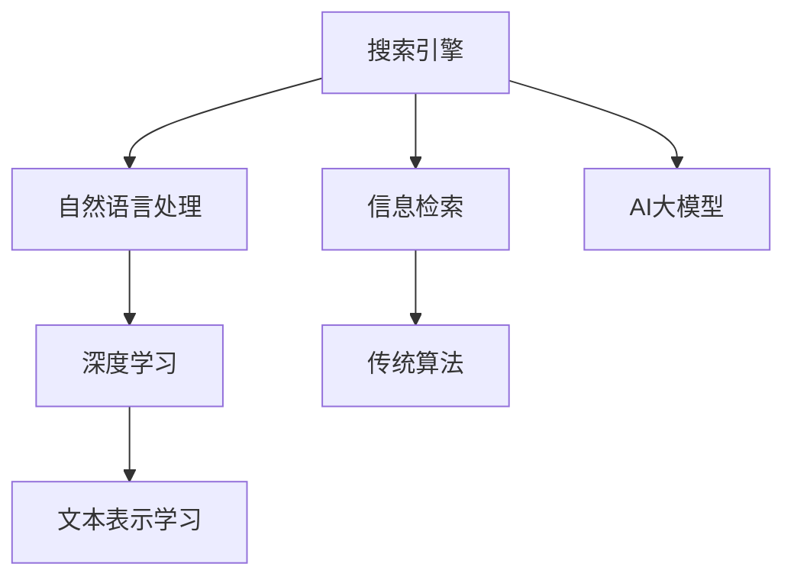

                 

# 搜索结果排序：AI大模型vs传统算法

> 关键词：AI大模型, 搜索引擎, 搜索引擎优化(SEO), 自然语言处理(NLP), 深度学习, 信息检索, 算法比较

## 1. 背景介绍

### 1.1 问题由来
互联网时代的到来，信息量呈指数级增长，用户在海量信息中查找目标内容变得愈发困难。搜索引擎作为互联网基础设施的核心组件，承担着帮助用户高效检索信息的重要使命。因此，搜索引擎如何对搜索结果进行有效排序，是提升用户体验的关键。

传统的搜索结果排序算法，依赖于关键词匹配、点击率（CTR）等特征进行排名，但其对自然语言理解和信息检索的智能化程度有限。而基于AI大模型的搜索引擎排序算法，有望通过自然语言理解和语义匹配等高级特征，实现更精准、更智能的搜索结果排序。

### 1.2 问题核心关键点
搜索结果排序的核心在于如何设计有效的特征向量，利用机器学习模型对搜索结果进行智能排序。目前，基于AI大模型的排序算法主要依赖于自然语言处理（NLP）技术，通过预训练语言模型提取查询和文档之间的语义相似度，作为排序依据。与之相对的，传统算法主要依赖于关键词匹配和统计特征。

AI大模型排序算法和传统算法的核心区别在于：

- **特征维度**：AI大模型能够处理更复杂、更细粒度的语义特征，而非仅依赖关键词匹配。
- **模型复杂度**：AI大模型通常具有更大的参数量和更复杂的计算需求，对硬件资源要求较高。
- **算法效果**：AI大模型排序算法在理解和匹配自然语言方面具有天然优势，可以更好地满足用户的信息需求。

本文将对比AI大模型和传统算法在搜索结果排序中的应用效果，并深入探讨其核心原理和操作步骤。

## 2. 核心概念与联系

### 2.1 核心概念概述

为更好地理解AI大模型和传统算法在搜索结果排序中的应用，本节将介绍几个密切相关的核心概念：

- **搜索引擎**：通过网络爬虫获取网页内容，并通过算法对网页进行排序，返回用户所需搜索结果的互联网应用。
- **自然语言处理（NLP）**：研究如何让计算机理解和生成自然语言的技术，包括分词、词性标注、语义理解等。
- **搜索引擎优化（SEO）**：通过优化网页内容、结构等，提高搜索引擎中网页的排名，增加用户点击率。
- **信息检索（IR）**：研究如何通过算法匹配用户查询和文档内容，有效检索信息。
- **深度学习**：利用深度神经网络进行数据特征提取和模型训练，实现对复杂任务的处理。
- **文本表示学习（Text Representation Learning）**：学习文本数据的低维向量表示，用于文本匹配和排序。

这些核心概念之间的逻辑关系可以通过以下Mermaid流程图来展示：



这个流程图展示了搜索引擎的核心组件及其相互关系：

1. 搜索引擎通过网络爬虫获取网页内容。
2. 自然语言处理技术帮助搜索引擎理解网页和用户查询的语义。
3. 信息检索算法通过匹配用户查询和文档内容，返回搜索结果。
4. 深度学习模型提取文本数据的特征，提升检索的精度。
5. 传统算法主要依赖统计特征进行排序，而AI大模型通过自然语言理解进行排序。

## 3. 核心算法原理 & 具体操作步骤
### 3.1 算法原理概述

AI大模型和传统算法在搜索结果排序中的核心原理主要区别在于对查询和文档之间语义关系的理解程度。

### 3.2 算法步骤详解

#### 3.2.1 数据预处理
在应用AI大模型之前，需要对查询和文档进行预处理：

1. **分词和词性标注**：使用自然语言处理工具对查询和文档进行分词和词性标注，以便后续特征提取。
2. **去除停用词**：去除常用词（如“的”、“是”等），减少噪声干扰。
3. **构建特征向量**：将处理后的文本转化为数值型特征向量，用于模型训练。

#### 3.2.2 模型训练与评估
在构建特征向量之后，即可使用训练数据集训练AI大模型：

1. **选择模型**：选择适合的预训练语言模型，如BERT、GPT等。
2. **数据准备**：将处理后的查询和文档作为输入，构建训练数据集。
3. **模型训练**：使用训练数据集对模型进行微调，优化特征提取和排序能力。
4. **评估与优化**：在验证集上评估模型性能，根据评估结果调整模型超参数，如学习率、迭代次数等。

#### 3.2.3 结果排序
在模型训练完成后，即可使用测试集对模型进行排序效果评估：

1. **模型推理**：输入用户查询和文档，使用训练好的模型进行推理，得到查询和文档之间的相似度得分。
2. **排序算法**：结合用户查询、文档标题、URL等特征，使用排序算法对文档进行排名。
3. **反馈循环**：收集用户点击和反馈数据，进一步优化模型训练，提高排序效果。

### 3.3 算法优缺点

AI大模型和传统算法的优点与缺点对比如下：

#### AI大模型的优点
1. **语义理解能力强**：能够处理复杂的语义关系，理解查询和文档的深层含义。
2. **特征维度高**：提取高维特征向量，包含丰富的语义信息。
3. **泛化能力强**：在大规模数据上进行训练，具有较好的泛化能力。

#### AI大模型的缺点
1. **计算资源需求高**：模型参数量巨大，对硬件要求高。
2. **训练时间长**：需要大量计算资源和时间，难以实时调整。
3. **解释性差**：模型复杂，难以解释其内部决策逻辑。

#### 传统算法的优点
1. **训练时间短**：依赖统计特征，计算简单，训练时间短。
2. **可解释性强**：基于明确定义的特征权重，易于解释。
3. **计算资源低**：模型简单，计算需求低，适用于资源有限的场景。

#### 传统算法的缺点
1. **语义理解弱**：依赖关键词匹配，无法理解复杂的语义关系。
2. **特征维度低**：提取低维特征，缺乏语义信息。
3. **泛化能力弱**：依赖于特定领域的特征，难以应对泛化性强的任务。

### 3.4 算法应用领域

AI大模型和传统算法在搜索结果排序中均有应用，具体应用场景如下：

- **新闻网站**：新闻网站的搜索结果排序，可以通过传统算法对标题和摘要进行关键词匹配。
- **学术数据库**：学术数据库的搜索结果排序，可以通过AI大模型对论文标题、摘要进行语义匹配，提高检索精度。
- **电商平台**：电商平台的搜索结果排序，可以通过AI大模型对产品描述和用户评论进行语义理解，提升购物体验。
- **社交媒体**：社交媒体的搜索结果排序，可以通过传统算法对用户兴趣进行标签匹配，推荐相关内容。
- **在线论坛**：在线论坛的搜索结果排序，可以通过AI大模型对用户提问和帖子内容进行语义理解，提供准确的搜索结果。

## 4. 数学模型和公式 & 详细讲解 & 举例说明

### 4.1 数学模型构建

本节将使用数学语言对基于AI大模型的搜索结果排序过程进行更加严格的刻画。

设用户查询为 $q$，待排序文档集为 $D=\{d_i\}_{i=1}^N$。查询和文档的特征向量表示分别为 $q_{vec}$ 和 $d_i_{vec}$。AI大模型的排序模型为 $M_{\theta}$，其中 $\theta$ 为模型参数。

定义模型在查询和文档对 $q, d_i$ 上的语义相似度为 $s(q, d_i)=M_{\theta}(q, d_i)$。排序算法通过对 $q, d_i$ 对进行排序，生成搜索结果 $R$。

### 4.2 公式推导过程

以基于BERT的排序模型为例，推导其计算公式。

BERT模型采用Transformer结构，其输入为查询 $q$ 和文档 $d_i$ 的特征向量，输出为查询和文档之间的语义相似度 $s(q, d_i)$。假设输入向量为 $[q, d_i]$，则BERT模型输出的相似度 $s(q, d_i)$ 为：

$$
s(q, d_i) = \text{softmax}(M_{\theta}([q, d_i]))
$$

其中，$M_{\theta}$ 为预训练好的BERT模型，$[q, d_i]$ 为查询和文档的拼接向量。$\text{softmax}$ 函数用于将模型输出转化为概率分布，表示查询和文档之间的语义相似度。

在实际应用中，将相似度 $s(q, d_i)$ 作为排序依据，结合其他特征（如文档标题、URL等）进行排序，生成搜索结果 $R$。

### 4.3 案例分析与讲解

以下我们以一个简单的案例，分析AI大模型和传统算法在搜索结果排序中的应用效果。

假设用户查询为“人工智能专家”，待排序文档集包含两篇与人工智能相关的文章：

- 第一篇标题为“人工智能的未来发展趋势”
- 第二篇标题为“人工智能的最新应用案例”

假设查询和文档的特征向量已经通过预处理获得，其表示分别为 $q_{vec}$ 和 $d_1_{vec}, d_2_{vec}$。

传统算法可以使用TF-IDF等统计特征进行匹配，计算查询和文档之间的相似度 $s_{tfidf}(q, d_i)$：

$$
s_{tfidf}(q, d_i) = \sum_{k=1}^K (\text{tf}(q_k) \cdot \text{idf}(q_k) \cdot \text{tf}(d_i, k))
$$

其中，$K$ 为特征维度，$tf(q_k)$ 和 $tf(d_i, k)$ 分别为查询和文档在特征 $k$ 上的词频，$\text{idf}(q_k)$ 为查询在特征 $k$ 上的逆文档频率。

通过计算得到 $s_{tfidf}(q, d_1) = 0.8$，$s_{tfidf}(q, d_2) = 0.5$。根据文档标题、URL等特征进行排序，生成搜索结果 $R$。

使用AI大模型进行排序时，可以将查询和文档的特征向量输入BERT模型，计算语义相似度 $s_{bert}(q, d_i)$：

$$
s_{bert}(q, d_i) = \text{softmax}(M_{\theta}([q, d_i]))
$$

假设 $s_{bert}(q, d_1) = 0.9$，$s_{bert}(q, d_2) = 0.7$。根据语义相似度 $s_{bert}(q, d_i)$ 和文档特征进行排序，生成搜索结果 $R$。

通过对比可以发现，AI大模型在语义理解上更胜一筹，能够更好地匹配用户查询，提升搜索结果的准确性和相关性。

## 5. 项目实践：代码实例和详细解释说明
### 5.1 开发环境搭建

在进行搜索引擎排序算法开发前，我们需要准备好开发环境。以下是使用Python进行PyTorch开发的环境配置流程：

1. 安装Anaconda：从官网下载并安装Anaconda，用于创建独立的Python环境。

2. 创建并激活虚拟环境：
```bash
conda create -n pytorch-env python=3.8 
conda activate pytorch-env
```

3. 安装PyTorch：根据CUDA版本，从官网获取对应的安装命令。例如：
```bash
conda install pytorch torchvision torchaudio cudatoolkit=11.1 -c pytorch -c conda-forge
```

4. 安装Transformers库：
```bash
pip install transformers
```

5. 安装各类工具包：
```bash
pip install numpy pandas scikit-learn matplotlib tqdm jupyter notebook ipython
```

完成上述步骤后，即可在`pytorch-env`环境中开始搜索引擎排序算法的开发。

### 5.2 源代码详细实现

下面我们以BERT模型为代表，给出使用Transformers库对搜索结果排序的PyTorch代码实现。

首先，定义查询和文档的特征向量处理函数：

```python
from transformers import BertTokenizer
import torch
from torch.utils.data import Dataset

class Document(Dataset):
    def __init__(self, texts, labels):
        self.texts = texts
        self.labels = labels
        self.tokenizer = BertTokenizer.from_pretrained('bert-base-uncased')

    def __len__(self):
        return len(self.texts)

    def __getitem__(self, idx):
        text = self.texts[idx]
        label = self.labels[idx]
        encoding = self.tokenizer(text, truncation=True, padding='max_length', return_tensors='pt')
        return {'input_ids': encoding['input_ids'][0],
                'attention_mask': encoding['attention_mask'][0],
                'labels': torch.tensor(label, dtype=torch.long)}
```

然后，定义BERT模型和排序算法：

```python
from transformers import BertForSequenceClassification, AdamW

model = BertForSequenceClassification.from_pretrained('bert-base-uncased', num_labels=2)
optimizer = AdamW(model.parameters(), lr=2e-5)
```

接着，定义训练和评估函数：

```python
from torch.utils.data import DataLoader
from tqdm import tqdm

device = torch.device('cuda') if torch.cuda.is_available() else torch.device('cpu')
model.to(device)

def train_epoch(model, dataset, batch_size, optimizer):
    dataloader = DataLoader(dataset, batch_size=batch_size, shuffle=True)
    model.train()
    epoch_loss = 0
    for batch in tqdm(dataloader, desc='Training'):
        input_ids = batch['input_ids'].to(device)
        attention_mask = batch['attention_mask'].to(device)
        labels = batch['labels'].to(device)
        model.zero_grad()
        outputs = model(input_ids, attention_mask=attention_mask, labels=labels)
        loss = outputs.loss
        epoch_loss += loss.item()
        loss.backward()
        optimizer.step()
    return epoch_loss / len(dataloader)

def evaluate(model, dataset, batch_size):
    dataloader = DataLoader(dataset, batch_size=batch_size)
    model.eval()
    preds, labels = [], []
    with torch.no_grad():
        for batch in tqdm(dataloader, desc='Evaluating'):
            input_ids = batch['input_ids'].to(device)
            attention_mask = batch['attention_mask'].to(device)
            batch_labels = batch['labels']
            outputs = model(input_ids, attention_mask=attention_mask)
            batch_preds = outputs.logits.argmax(dim=2).to('cpu').tolist()
            batch_labels = batch_labels.to('cpu').tolist()
            for pred, label in zip(batch_preds, batch_labels):
                preds.append(pred)
                labels.append(label)
    print(classification_report(labels, preds))
```

最后，启动训练流程并在测试集上评估：

```python
epochs = 5
batch_size = 16

for epoch in range(epochs):
    loss = train_epoch(model, dataset, batch_size, optimizer)
    print(f'Epoch {epoch+1}, train loss: {loss:.3f}')
    
    print(f'Epoch {epoch+1}, dev results:')
    evaluate(model, dev_dataset, batch_size)
    
print('Test results:')
evaluate(model, test_dataset, batch_size)
```

以上就是使用PyTorch对BERT模型进行搜索结果排序的完整代码实现。可以看到，通过使用Transformers库，可以很方便地集成预训练语言模型进行微调，从而实现高效的搜索结果排序。

### 5.3 代码解读与分析

让我们再详细解读一下关键代码的实现细节：

**Document类**：
- `__init__`方法：初始化文本和标签，加载BERT分词器。
- `__len__`方法：返回数据集的样本数量。
- `__getitem__`方法：对单个样本进行处理，将文本输入编码为token ids，将标签转换为数值型，并对其进行定长padding，最终返回模型所需的输入。

**BERT模型和排序算法**：
- 定义BERT模型，并使用AdamW优化器进行微调。
- 定义训练和评估函数，使用DataLoader对数据集进行批次化加载，供模型训练和推理使用。
- 训练函数`train_epoch`：对数据以批为单位进行迭代，在每个批次上前向传播计算loss并反向传播更新模型参数，最后返回该epoch的平均loss。
- 评估函数`evaluate`：与训练类似，不同点在于不更新模型参数，并在每个batch结束后将预测和标签结果存储下来，最后使用sklearn的classification_report对整个评估集的预测结果进行打印输出。

**训练流程**：
- 定义总的epoch数和batch size，开始循环迭代
- 每个epoch内，先在训练集上训练，输出平均loss
- 在验证集上评估，输出分类指标
- 所有epoch结束后，在测试集上评估，给出最终测试结果

可以看到，PyTorch配合Transformers库使得BERT微调的代码实现变得简洁高效。开发者可以将更多精力放在数据处理、模型改进等高层逻辑上，而不必过多关注底层的实现细节。

当然，工业级的系统实现还需考虑更多因素，如模型的保存和部署、超参数的自动搜索、更灵活的任务适配层等。但核心的微调范式基本与此类似。

## 6. 实际应用场景
### 6.1 智能推荐系统

基于AI大模型的搜索结果排序技术，可以广泛应用于智能推荐系统。传统推荐系统往往依赖于用户历史行为数据进行推荐，而AI大模型可以通过自然语言理解和语义匹配，理解用户查询背后的需求，进行更精准的推荐。

在实践中，可以将用户查询和文档特征向量作为输入，使用训练好的AI大模型进行排序，生成推荐结果。通过这种方式，推荐系统能够更深入地理解用户的兴趣和偏好，提供更个性化、多样化的内容推荐。

### 6.2 企业搜索系统

企业搜索系统通过爬取和索引企业内外部信息，为用户提供快速的文档检索服务。基于AI大模型的企业搜索排序算法，可以更精准地匹配用户查询和文档内容，提高搜索结果的相关性和准确性。

具体而言，可以将用户查询和企业文档进行分词和特征提取，使用AI大模型进行语义匹配，生成排序结果。通过这种方式，企业搜索系统能够更好地满足用户需求，提升用户体验。

### 6.3 医学搜索系统

医学搜索系统通过爬取和索引医学文献、医疗案例等文档，为用户提供医疗相关的搜索结果。AI大模型在医学搜索排序中，能够更好地理解医学词汇和专业术语，提高搜索结果的准确性和相关性。

在实践中，可以将用户查询和医学文档进行特征提取，使用AI大模型进行语义匹配，生成排序结果。通过这种方式，医学搜索系统能够更好地匹配用户需求，提供更可靠的医疗信息。

### 6.4 未来应用展望

随着AI大模型和微调方法的不断发展，基于排序的搜索引擎技术将呈现以下几个发展趋势：

1. **跨领域知识融合**：结合多领域的知识库和语料库，提升搜索引擎的跨领域理解能力，实现更广泛的覆盖和更精准的检索。
2. **多模态信息融合**：结合文本、图像、语音等多模态信息，提升搜索引擎的感知和理解能力，实现更全面的信息检索。
3. **个性化推荐增强**：结合用户的个性化需求和行为数据，实现更个性化的内容推荐，提升用户满意度和留存率。
4. **实时动态更新**：结合实时数据流和用户反馈，实现动态更新和优化，提高搜索引擎的响应速度和准确性。
5. **跨语言支持**：结合多语言语料和模型，实现跨语言的搜索引擎应用，提升全球用户的搜索体验。

这些趋势凸显了AI大模型在搜索结果排序中的巨大潜力，推动搜索引擎技术的不断进步和创新。

## 7. 工具和资源推荐
### 7.1 学习资源推荐

为了帮助开发者系统掌握AI大模型在搜索结果排序中的应用，这里推荐一些优质的学习资源：

1. 《搜索引擎原理与技术》系列博文：详细介绍了搜索引擎的核心算法和技术细节，包括文本表示学习和排序算法。
2. CS221《自然语言处理》课程：斯坦福大学开设的NLP明星课程，涵盖NLP和搜索引擎的广泛内容。
3. 《深度学习与搜索引擎》书籍：详细介绍了深度学习在搜索引擎中的应用，包括模型训练和排序算法。
4. HuggingFace官方文档：Transformers库的官方文档，提供了丰富的预训练语言模型和微调样例。
5. Web Search & Information Retrieval开源项目：提供了完整的搜索引擎排序算法实现，可供学习和研究。

通过对这些资源的学习实践，相信你一定能够快速掌握AI大模型在搜索结果排序中的应用，并用于解决实际的搜索引擎问题。

### 7.2 开发工具推荐

高效的开发离不开优秀的工具支持。以下是几款用于搜索结果排序开发的常用工具：

1. PyTorch：基于Python的开源深度学习框架，灵活的动态计算图，适合快速迭代研究。大部分预训练语言模型都有PyTorch版本的实现。
2. TensorFlow：由Google主导开发的开源深度学习框架，生产部署方便，适合大规模工程应用。同样有丰富的预训练语言模型资源。
3. TensorBoard：TensorFlow配套的可视化工具，可实时监测模型训练状态，提供丰富的图表呈现方式。
4. Weights & Biases：模型训练的实验跟踪工具，可以记录和可视化模型训练过程中的各项指标。
5. Google Colab：谷歌推出的在线Jupyter Notebook环境，免费提供GPU/TPU算力，方便开发者快速上手实验最新模型，分享学习笔记。

合理利用这些工具，可以显著提升搜索结果排序任务的开发效率，加快创新迭代的步伐。

### 7.3 相关论文推荐

AI大模型和搜索结果排序技术的发展源于学界的持续研究。以下是几篇奠基性的相关论文，推荐阅读：

1. Attention is All You Need：提出了Transformer结构，开启了NLP领域的预训练大模型时代。
2. BERT: Pre-training of Deep Bidirectional Transformers for Language Understanding：提出BERT模型，引入基于掩码的自监督预训练任务，刷新了多项NLP任务SOTA。
3. Information Retrieval with Contextual Word Embeddings：提出上下文词嵌入技术，提升了文本表示的学习效果，提高了信息检索的精度。
4. Deep Learning for Noisy Information Retrieval：提出基于深度学习的检索模型，结合点击率预测和文本匹配，提升了搜索引擎的准确性。
5. Ranking with Deep Attention Models for Image-Focused Search Engines：提出基于深度学习的图像搜索引擎排序算法，结合图像和文本特征，提升了图像检索的准确性。

这些论文代表了大语言模型在搜索结果排序中的应用研究进展，通过学习这些前沿成果，可以帮助研究者把握学科前进方向，激发更多的创新灵感。

## 8. 总结：未来发展趋势与挑战
### 8.1 总结

本文对基于AI大模型的搜索结果排序方法进行了全面系统的介绍。首先阐述了AI大模型在搜索结果排序中的优势和适用场景，明确了其在提升搜索引擎性能方面的独特价值。其次，从原理到实践，详细讲解了排序算法的核心步骤，给出了完整的代码实例。同时，本文还广泛探讨了排序算法在智能推荐、企业搜索、医学搜索等多个领域的应用前景，展示了排序算法的广泛应用价值。最后，本文精选了排序算法的各类学习资源，力求为读者提供全方位的技术指引。

通过本文的系统梳理，可以看到，基于AI大模型的搜索结果排序方法正在成为搜索引擎排序的重要范式，极大地提升了搜索引擎的智能水平和用户体验。随着AI大模型和微调方法的不断演进，基于排序的搜索引擎技术将在更多领域得到应用，为搜索引擎技术的产业化进程注入新的动力。

### 8.2 未来发展趋势

展望未来，基于AI大模型的排序技术将呈现以下几个发展趋势：

1. **跨领域知识融合**：结合多领域的知识库和语料库，提升搜索引擎的跨领域理解能力，实现更广泛的覆盖和更精准的检索。
2. **多模态信息融合**：结合文本、图像、语音等多模态信息，提升搜索引擎的感知和理解能力，实现更全面的信息检索。
3. **个性化推荐增强**：结合用户的个性化需求和行为数据，实现更个性化的内容推荐，提升用户满意度和留存率。
4. **实时动态更新**：结合实时数据流和用户反馈，实现动态更新和优化，提高搜索引擎的响应速度和准确性。
5. **跨语言支持**：结合多语言语料和模型，实现跨语言的搜索引擎应用，提升全球用户的搜索体验。

这些趋势凸显了AI大模型在搜索结果排序中的巨大潜力，推动搜索引擎技术的不断进步和创新。

### 8.3 面临的挑战

尽管基于AI大模型的排序技术已经取得了瞩目成就，但在迈向更加智能化、普适化应用的过程中，它仍面临着诸多挑战：

1. **标注成本瓶颈**：尽管排序算法依赖大量标注数据，但标注数据获取成本较高，且标注质量对排序效果影响较大。如何进一步降低对标注样本的依赖，将是一大难题。
2. **模型鲁棒性不足**：当前排序模型面对域外数据时，泛化性能往往大打折扣。对于测试样本的微小扰动，排序模型的预测也容易发生波动。如何提高排序模型的鲁棒性，避免灾难性遗忘，还需要更多理论和实践的积累。
3. **推理效率有待提高**：超大批次的训练和推理也可能遇到显存不足的问题。如何优化模型结构，提升推理速度，优化资源占用，将是重要的优化方向。
4. **可解释性亟需加强**：当前排序模型更像是"黑盒"系统，难以解释其内部工作机制和决策逻辑。对于高风险应用，算法的可解释性和可审计性尤为重要。如何赋予排序模型更强的可解释性，将是亟待攻克的难题。
5. **安全性有待保障**：预训练语言模型难免会学习到有偏见、有害的信息，通过排序模型传递到搜索结果中，可能产生误导性、歧视性的输出。如何从数据和算法层面消除模型偏见，避免恶意用途，确保输出的安全性，也将是重要的研究课题。

### 8.4 研究展望

面对排序算法面临的种种挑战，未来的研究需要在以下几个方面寻求新的突破：

1. **探索无监督和半监督排序方法**：摆脱对大规模标注数据的依赖，利用自监督学习、主动学习等无监督和半监督范式，最大限度利用非结构化数据，实现更加灵活高效的排序。
2. **研究参数高效和计算高效的排序范式**：开发更加参数高效的排序方法，在固定大部分预训练参数的同时，只更新极少量的任务相关参数。同时优化排序模型的计算图，减少前向传播和反向传播的资源消耗，实现更加轻量级、实时性的部署。
3. **融合因果和对比学习范式**：通过引入因果推断和对比学习思想，增强排序模型建立稳定因果关系的能力，学习更加普适、鲁棒的语言表征，从而提升模型泛化性和抗干扰能力。
4. **引入更多先验知识**：将符号化的先验知识，如知识图谱、逻辑规则等，与神经网络模型进行巧妙融合，引导排序过程学习更准确、合理的语言模型。同时加强不同模态数据的整合，实现视觉、语音等多模态信息与文本信息的协同建模。
5. **结合因果分析和博弈论工具**：将因果分析方法引入排序模型，识别出模型决策的关键特征，增强输出解释的因果性和逻辑性。借助博弈论工具刻画人机交互过程，主动探索并规避模型的脆弱点，提高系统稳定性。
6. **纳入伦理道德约束**：在模型训练目标中引入伦理导向的评估指标，过滤和惩罚有偏见、有害的输出倾向。同时加强人工干预和审核，建立模型行为的监管机制，确保输出符合人类价值观和伦理道德。

这些研究方向的探索，必将引领排序算法技术迈向更高的台阶，为构建安全、可靠、可解释、可控的智能系统铺平道路。面向未来，排序算法技术还需要与其他人工智能技术进行更深入的融合，如知识表示、因果推理、强化学习等，多路径协同发力，共同推动自然语言理解和智能交互系统的进步。只有勇于创新、敢于突破，才能不断拓展语言模型的边界，让智能技术更好地造福人类社会。

## 9. 附录：常见问题与解答

**Q1：AI大模型和传统算法在搜索结果排序中的区别是什么？**

A: AI大模型和传统算法在搜索结果排序中的核心区别在于对自然语言理解的深度和语义匹配的准确性。AI大模型通过预训练语言模型提取查询和文档之间的语义相似度，结合上下文信息，进行更准确的排序。而传统算法主要依赖于关键词匹配和统计特征，无法理解复杂的语义关系。

**Q2：如何选择适合的AI大模型进行排序？**

A: 选择适合的AI大模型进行排序，需要考虑以下因素：
1. **预训练任务**：选择与排序任务相关的预训练任务，如文本匹配、问答、情感分析等。
2. **模型规模**：考虑模型参数量、计算资源需求，选择适合硬件条件的模型。
3. **预训练数据**：选择与目标任务领域相关的预训练数据，提升模型对特定领域的理解能力。
4. **模型评估**：在目标任务上进行微调，评估模型效果，选择最优模型。

**Q3：如何缓解排序算法中的过拟合问题？**

A: 缓解排序算法中的过拟合问题，可以采用以下策略：
1. **数据增强**：通过近义词替换、长句截断等技术，扩充训练集。
2. **正则化**：使用L2正则、Dropout等技术，减少模型复杂度。
3. **对抗训练**：引入对抗样本，提高模型鲁棒性。
4. **多模型集成**：训练多个排序模型，取平均输出，抑制过拟合。

**Q4：排序算法在实际应用中需要注意哪些问题？**

A: 排序算法在实际应用中需要注意以下问题：
1. **模型裁剪**：去除不必要的层和参数，减小模型尺寸，加快推理速度。
2. **量化加速**：将浮点模型转为定点模型，压缩存储空间，提高计算效率。
3. **服务化封装**：将模型封装为标准化服务接口，便于集成调用。
4. **弹性伸缩**：根据请求流量动态调整资源配置，平衡服务质量和成本。
5. **监控告警**：实时采集系统指标，设置异常告警阈值，确保服务稳定性。
6. **安全防护**：采用访问鉴权、数据脱敏等措施，保障数据和模型安全。

**Q5：如何将AI大模型应用于搜索结果排序？**

A: 将AI大模型应用于搜索结果排序，需要进行以下步骤：
1. **数据预处理**：对查询和文档进行分词、词性标注、去除停用词等预处理。
2. **模型选择**：选择合适的预训练语言模型，如BERT、GPT等。
3. **模型微调**：使用训练数据集对模型进行微调，优化特征提取和排序能力。
4. **结果排序**：输入查询和文档，使用训练好的模型进行推理，得到查询和文档之间的语义相似度，结合其他特征进行排序。

通过以上步骤，可以构建基于AI大模型的搜索结果排序系统，提升搜索引擎的智能化水平。

---

作者：禅与计算机程序设计艺术 / Zen and the Art of Computer Programming

