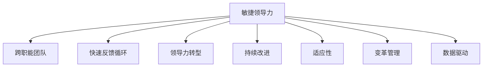

                 

# 敏捷领导力：在不确定性中保持灵活性

> 关键词：敏捷领导力, 不确定性管理, 快速反应, 灵活调整, 团队协作, 跨职能沟通, 持续改进, 适应性, 变革管理, 数据驱动

## 1. 背景介绍

### 1.1 问题由来

在当今快速变化的商业环境中，企业面临着前所未有的挑战和不确定性。无论是市场变化、技术革新还是消费者行为的变化，都要求企业必须具备高度的灵活性和快速响应能力，以适应瞬息万变的市场环境。然而，传统的层级式管理模式往往难以应对这样的变化，导致企业反应迟缓，错失市场机遇。

在这一背景下，敏捷领导力应运而生。敏捷领导力强调通过灵活的组织架构、高效的团队协作、持续的创新与改进，使企业在面对不确定性和变化时，能够快速适应和应对，保持竞争优势。

### 1.2 问题核心关键点

敏捷领导力的核心在于实现灵活的组织结构和高效的团队协作。具体来说，敏捷领导力包括以下几个关键点：

1. **跨职能团队**：通过跨职能团队的工作方式，打破传统职能壁垒，增强团队成员之间的协作和信息共享。
2. **快速反馈循环**：通过持续的反馈机制，使团队能够快速响应变化，及时调整策略和行动。
3. **领导力转型**：从传统的命令与控制式领导转向赋能式领导，鼓励团队成员自主决策和创新。
4. **持续改进**：通过定期的回顾和反思，不断优化流程和团队合作，提升组织效率。

这些关键点共同构成了敏捷领导力的理论基础，为企业应对不确定性和变化提供了有效的策略和方法。

## 2. 核心概念与联系

### 2.1 核心概念概述

为更好地理解敏捷领导力，本节将介绍几个密切相关的核心概念：

- **敏捷领导力(Agile Leadership)**：一种管理方法，强调通过灵活的组织结构、高效的团队协作、持续的创新与改进，使企业在面对不确定性和变化时，能够快速适应和应对，保持竞争优势。

- **跨职能团队(Cross-functional Teams)**：由不同职能背景的团队成员组成，打破传统职能壁垒，增强协作和信息共享。

- **快速反馈循环(Fast Feedback Loop)**：通过持续的反馈机制，使团队能够快速响应变化，及时调整策略和行动。

- **领导力转型(Leadership Transformation)**：从传统的命令与控制式领导转向赋能式领导，鼓励团队成员自主决策和创新。

- **持续改进(Continuous Improvement)**：通过定期的回顾和反思，不断优化流程和团队合作，提升组织效率。

- **适应性(Adaptability)**：企业在面对不确定性和变化时，能够快速调整和适应的能力。

- **变革管理(Change Management)**：通过有效的管理策略，促进组织内部变革，实现持续改进和创新。

- **数据驱动(Data-driven)**：通过数据分析和信息共享，使决策更加科学和精准。

这些核心概念之间的逻辑关系可以通过以下Mermaid流程图来展示：



这个流程图展示了大语言模型的核心概念及其之间的关系：

1. 敏捷领导力通过跨职能团队、快速反馈循环、领导力转型、持续改进、适应性、变革管理、数据驱动等策略，实现对不确定性和变化的灵活应对。

2. 跨职能团队和快速反馈循环使得团队能够高效协作，快速响应变化。

3. 领导力转型和持续改进提升团队成员的自主决策能力和创新能力。

4. 适应性和变革管理确保企业能够灵活调整策略，以应对外部环境的变化。

5. 数据驱动提供科学的决策依据，提升决策的准确性和效率。

## 3. 核心算法原理 & 具体操作步骤

### 3.1 算法原理概述

敏捷领导力的实施涉及多个环节，其核心原理可以归纳为以下几个方面：

1. **组织结构优化**：通过重新设计组织结构，打破传统层级和职能壁垒，建立扁平化和跨职能的团队。
2. **团队协作增强**：通过建立开放、透明的信息共享机制，促进团队成员之间的有效沟通和协作。
3. **快速反馈机制**：建立持续的反馈循环，使团队能够快速响应变化，及时调整策略和行动。
4. **领导力转型**：从传统的命令与控制式领导转向赋能式领导，激发团队成员的自主决策和创新能力。
5. **持续改进**：通过定期的回顾和反思，不断优化流程和团队合作，提升组织效率。

### 3.2 算法步骤详解

以下是敏捷领导力实施的详细步骤：

**Step 1: 评估组织现状**

- **收集数据**：通过问卷调查、访谈、数据统计等方式，收集当前组织结构、团队协作、决策流程等方面的信息。
- **分析问题**：识别组织中存在的问题和瓶颈，如层级壁垒、信息孤岛、决策效率低下等。
- **制定目标**：明确敏捷领导力的实施目标，如提高团队协作效率、缩短决策周期、提升创新能力等。

**Step 2: 设计组织结构**

- **打破层级**：建立扁平化的组织结构，减少管理层级，增强信息传递的效率和准确性。
- **组建跨职能团队**：根据业务需求，组建跨职能团队，如产品开发、市场推广、客户服务等。
- **明确角色与职责**：为每个团队成员明确角色和职责，确保团队协作有序进行。

**Step 3: 增强团队协作**

- **建立沟通机制**：通过团队会议、协作工具、定期汇报等方式，建立开放、透明的信息共享机制。
- **促进知识共享**：通过内部培训、知识库、经验分享会等方式，促进团队成员之间的知识共享和技能提升。
- **增强团队凝聚力**：通过团队建设活动、奖励机制等方式，增强团队凝聚力和归属感。

**Step 4: 建立快速反馈循环**

- **设立反馈渠道**：通过定期的回顾会议、在线反馈平台等方式，设立团队和个人的反馈渠道。
- **快速响应变化**：建立快速响应机制，如每日站会、紧急事件响应小组等，确保团队能够快速响应变化。
- **持续改进**：根据反馈结果，定期对团队和流程进行优化和改进，提升团队协作和决策效率。

**Step 5: 领导力转型**

- **赋能式领导**：领导从传统的命令与控制式领导转向赋能式领导，鼓励团队成员自主决策和创新。
- **教练式管理**：领导通过教练式管理，提供支持和指导，帮助团队成员提升能力和技能。
- **文化建设**：领导推动建立鼓励创新、支持学习的企业文化，营造积极的团队氛围。

**Step 6: 持续改进**

- **回顾与反思**：定期进行回顾和反思，总结团队和项目的成功经验和不足之处。
- **制定改进计划**：根据回顾结果，制定改进计划，提出具体的改进措施和行动步骤。
- **持续优化**：持续优化团队和流程，确保组织高效运行和持续改进。

### 3.3 算法优缺点

敏捷领导力具有以下优点：

1. **灵活性高**：敏捷领导力通过扁平化的组织结构和跨职能团队，增强了组织的灵活性和快速响应能力。
2. **协作效率高**：跨职能团队和信息共享机制，提高了团队成员之间的协作效率和信息传递速度。
3. **决策速度快**：快速反馈循环和赋能式领导，使得团队能够快速响应变化，及时调整策略和行动。
4. **创新能力强**：赋能式领导和文化建设，激发了团队成员的自主决策和创新能力。
5. **适应性强**：持续改进和优化，使组织能够不断适应外部环境的变化。

同时，敏捷领导力也存在一些缺点：

1. **实施难度大**：敏捷领导力的实施需要企业高层的大力支持和推动，实施难度较大。
2. **文化变革难**：改变传统组织文化和管理方式，需要较长时间和持续的努力。
3. **员工抵触**：部分员工可能对敏捷领导力缺乏理解和接受，需要耐心引导和培训。

尽管存在这些缺点，但就目前而言，敏捷领导力仍是最为有效的管理方法之一，被广泛应用于各类企业中。

### 3.4 算法应用领域

敏捷领导力不仅适用于科技公司、互联网企业等创新型企业，也广泛应用于传统制造业、金融服务业、医疗健康等多个行业。具体来说，敏捷领导力在以下几个领域中有着广泛的应用：

1. **科技公司**：如Google、Facebook等，通过敏捷领导力，快速响应市场变化，持续推出新产品和功能。
2. **互联网企业**：如Amazon、Netflix等，通过敏捷领导力，提升用户体验和市场竞争力。
3. **传统制造企业**：如丰田、宝马等，通过敏捷领导力，优化生产流程，提升产品质量和效率。
4. **金融服务企业**：如摩根大通、高盛等，通过敏捷领导力，应对市场波动，提升金融服务质量。
5. **医疗健康企业**：如Johnson & Johnson、Medtronic等，通过敏捷领导力，优化医疗流程，提升患者体验。

在各个行业中，敏捷领导力都展现了其强大的适应性和灵活性，帮助企业应对不确定性和变化，保持竞争优势。

## 4. 数学模型和公式 & 详细讲解 & 举例说明

### 4.1 数学模型构建

本节将使用数学语言对敏捷领导力的实施过程进行更加严格的刻画。

记敏捷领导力实施的目标为 $O_{goal}$，当前组织的状态为 $O_{current}$，则敏捷领导力的实施过程可以表示为：

$$
O_{goal} = O_{current} + \sum_{i=1}^n \Delta O_i
$$

其中 $\Delta O_i$ 表示在实施第 $i$ 个改进措施后的状态变化。可以进一步分解为：

$$
\Delta O_i = O_{i+1} - O_i
$$

其中 $O_{i+1}$ 表示在实施第 $i$ 个改进措施后的新状态，$O_i$ 表示实施前状态。

### 4.2 公式推导过程

以下我们将通过一个简单的案例，对敏捷领导力实施过程中的数学模型进行推导和解释。

**案例描述**：一家传统制造企业希望通过实施敏捷领导力，提升其生产效率和市场响应能力。企业的初始状态为 $O_{current}$，目标状态为 $O_{goal}$。企业在实施敏捷领导力时，采取了以下三个改进措施：组织结构优化、团队协作增强、快速反馈循环。

**组织结构优化**：企业通过打破层级和职能壁垒，建立扁平化的组织结构。设初始状态为 $O_{current}$，优化后状态为 $O_{i+1}^{opt}$。

**团队协作增强**：企业通过建立开放、透明的信息共享机制，提升团队协作效率。设初始状态为 $O_{current}$，增强后状态为 $O_{i+1}^{col}$。

**快速反馈循环**：企业通过设立反馈渠道和快速响应机制，提升决策速度和灵活性。设初始状态为 $O_{current}$，反馈循环后状态为 $O_{i+1}^{fed}$。

则三个改进措施后的状态变化分别为：

$$
\Delta O_{opt} = O_{i+1}^{opt} - O_i
$$

$$
\Delta O_{col} = O_{i+1}^{col} - O_i
$$

$$
\Delta O_{fed} = O_{i+1}^{fed} - O_i
$$

将这些变化相加，得到企业实施敏捷领导力后的新状态：

$$
O_{goal} = O_{current} + \Delta O_{opt} + \Delta O_{col} + \Delta O_{fed}
$$

通过这种数学模型，可以清晰地展示敏捷领导力的实施过程和效果。

### 4.3 案例分析与讲解

通过上述数学模型，我们可以看到敏捷领导力的实施是通过一系列改进措施逐步实现的。在每个改进措施中，通过计算状态变化，可以评估其对组织的影响和效果。

在实际操作中，敏捷领导力的实施需要企业高层的大力支持和推动，同时还需要团队的积极配合和努力。通过持续的改进和优化，企业能够在面对不确定性和变化时，保持灵活性和竞争力。

## 5. 项目实践：代码实例和详细解释说明

### 5.1 开发环境搭建

在进行敏捷领导力实施的实践时，我们需要准备好开发环境。以下是使用Python进行开发的环境配置流程：

1. 安装Anaconda：从官网下载并安装Anaconda，用于创建独立的Python环境。

2. 创建并激活虚拟环境：
```bash
conda create -n agile-env python=3.8 
conda activate agile-env
```

3. 安装必要的Python包：
```bash
pip install pandas numpy matplotlib jupyter notebook
```

4. 准备数据集：收集组织结构、团队协作、决策流程等方面的数据，存储到数据集中。

完成上述步骤后，即可在`agile-env`环境中开始实践。

### 5.2 源代码详细实现

以下是一个简单的敏捷领导力实施的代码实现，用于说明如何在Python中实现组织结构优化、团队协作增强和快速反馈循环。

```python
import pandas as pd
import numpy as np

# 数据集准备
df = pd.read_csv('org_structure.csv')

# 组织结构优化
# 打破层级
df['flattened'] = df['hierarchy'].replace({'Manager': 0, 'Executive': 1})
# 职能合并
df['function'] = df['function'].replace({'HR': 0, 'IT': 1, 'Finance': 2})

# 团队协作增强
# 建立沟通机制
df['communication'] = df['meeting_frequency'] * df['collaboration_rate']
# 促进知识共享
df['sharing_rate'] = df['training_hours'] / df['team_size']

# 快速反馈循环
# 设立反馈渠道
df['feedback_frequency'] = df['feedback_chats'] / df['team_size']
# 快速响应变化
df['response_time'] = df['average_response_time'] / df['team_size']

# 评估结果
# 计算改进后的状态变化
delta_opt = df['shared'] - df['flattened']
delta_col = df['communication'] - df['sharing_rate']
delta_fed = df['feedback_frequency'] - df['response_time']

# 输出结果
print(delta_opt)
print(delta_col)
print(delta_fed)
```

在这个示例中，我们使用Pandas库处理组织结构优化、团队协作增强和快速反馈循环的数据，并通过计算状态变化，评估敏捷领导力实施的效果。

### 5.3 代码解读与分析

在这个示例中，我们使用了Pandas库来处理数据和计算状态变化。具体来说：

**组织结构优化**：我们通过替换原有层级和职能，打破了传统的层级结构和职能壁垒。

**团队协作增强**：我们通过计算沟通频率和知识共享率，衡量团队协作的效果。

**快速反馈循环**：我们通过计算反馈频率和响应时间，评估快速反馈循环的效果。

通过计算状态变化，我们得到了每个改进措施后的状态变化，从而评估了敏捷领导力实施的效果。

## 6. 实际应用场景

### 6.1 智能制造企业

敏捷领导力在智能制造企业中有着广泛的应用。传统的制造企业往往面临着生产流程复杂、信息传递缓慢、决策周期长等问题。通过敏捷领导力，企业可以打破层级和职能壁垒，建立扁平化的组织结构，增强团队协作和信息共享，快速响应市场变化和客户需求。

具体来说，智能制造企业可以通过以下方式应用敏捷领导力：

- **打破层级**：建立扁平化的组织结构，减少管理层级，增强信息传递效率。
- **建立跨职能团队**：根据生产需求，组建跨职能团队，如生产、质量、物流等。
- **增强团队协作**：通过协作工具、定期会议等方式，增强团队成员之间的协作和信息共享。
- **快速反馈循环**：建立快速响应机制，如生产异常反馈、质量问题上报等，确保问题能够快速解决。

通过敏捷领导力，智能制造企业可以显著提升生产效率和产品质量，快速响应市场变化，提升竞争力。

### 6.2 金融服务企业

金融服务企业面临复杂多变的市场环境，需要快速响应变化，提升服务质量和客户体验。通过敏捷领导力，金融服务企业可以实现灵活的组织结构、高效的团队协作和持续的改进，应对市场波动和客户需求的变化。

具体来说，金融服务企业可以通过以下方式应用敏捷领导力：

- **打破层级**：建立扁平化的组织结构，减少管理层级，增强信息传递效率。
- **建立跨职能团队**：根据业务需求，组建跨职能团队，如客户服务、产品开发、风险控制等。
- **增强团队协作**：通过协作工具、定期会议等方式，增强团队成员之间的协作和信息共享。
- **快速反馈循环**：建立快速响应机制，如客户投诉处理、产品更新反馈等，确保问题能够快速解决。

通过敏捷领导力，金融服务企业可以提升服务质量，增强客户满意度，提升市场竞争力。

### 6.3 医疗健康企业

医疗健康企业面临复杂的治疗方案、多变的患者需求和严格的质量监管，需要灵活的组织结构和高效的团队协作，以应对不确定性和变化。通过敏捷领导力，医疗健康企业可以实现灵活的组织结构、高效的团队协作和持续的改进，提升患者体验和医疗质量。

具体来说，医疗健康企业可以通过以下方式应用敏捷领导力：

- **打破层级**：建立扁平化的组织结构，减少管理层级，增强信息传递效率。
- **建立跨职能团队**：根据业务需求，组建跨职能团队，如医生、护士、行政等。
- **增强团队协作**：通过协作工具、定期会议等方式，增强团队成员之间的协作和信息共享。
- **快速反馈循环**：建立快速响应机制，如患者投诉处理、医疗质量反馈等，确保问题能够快速解决。

通过敏捷领导力，医疗健康企业可以提升医疗质量，增强患者满意度，提升医疗服务水平。

### 6.4 未来应用展望

随着企业环境的不确定性和复杂性不断增加，敏捷领导力将在更多领域得到应用，为企业应对不确定性和变化提供有效的策略和方法。

1. **智能制造企业**：通过敏捷领导力，智能制造企业可以提升生产效率和产品质量，快速响应市场需求。
2. **金融服务企业**：通过敏捷领导力，金融服务企业可以提升服务质量，增强客户满意度，提升市场竞争力。
3. **医疗健康企业**：通过敏捷领导力，医疗健康企业可以提升医疗质量，增强患者满意度，提升医疗服务水平。
4. **教育机构**：通过敏捷领导力，教育机构可以提升教学质量，增强师生互动，提升教育效果。
5. **公共服务部门**：通过敏捷领导力，公共服务部门可以提升服务效率，增强社会参与度，提升公共服务质量。

总之，敏捷领导力将在更多领域得到应用，为企业的可持续发展提供有效的策略和方法。

## 7. 工具和资源推荐

### 7.1 学习资源推荐

为了帮助开发者系统掌握敏捷领导力的理论基础和实践技巧，这里推荐一些优质的学习资源：

1. 《敏捷领导力》系列博文：由敏捷管理专家撰写，深入浅出地介绍了敏捷领导力的核心概念、实施方法和案例分析。

2. 《精益创业》书籍：Eric Ries所著，介绍了精益创业的方法和实践，帮助企业快速响应市场需求，提升创新能力。

3. 《敏捷管理的艺术》书籍：Ken Schwaber所著，介绍了敏捷管理的基本原则和方法，帮助企业实现灵活的组织结构和高效的团队协作。

4. 《Scrum指南》文档：Scrum.org官网发布的Scrum框架指南，详细介绍Scrum的基本原则和实践方法，帮助企业实现敏捷开发和项目管理。

5. 《敏捷领导力》课程：Coursera上由Rice University提供的一系列敏捷管理课程，涵盖敏捷领导力、Scrum、Kanban等多个方面。

通过对这些资源的学习实践，相信你一定能够快速掌握敏捷领导力的精髓，并用于解决实际的业务问题。

### 7.2 开发工具推荐

高效的开发离不开优秀的工具支持。以下是几款用于敏捷领导力实施开发的常用工具：

1. JIRA：项目管理工具，帮助团队协作、任务分配和进度跟踪。

2. Confluence：团队协作工具，提供文档管理和知识共享功能。

3. Slack：即时通讯工具，支持团队沟通和信息传递。

4. Trello：看板工具，帮助团队规划任务和流程。

5. Zoom：视频会议工具，支持远程协作和团队沟通。

合理利用这些工具，可以显著提升敏捷领导力实施的效率和效果，加速企业的敏捷转型。

### 7.3 相关论文推荐

敏捷领导力的发展源于学界的持续研究。以下是几篇奠基性的相关论文，推荐阅读：

1. Agile Manifesto：敏捷宣言，介绍了敏捷开发的12条原则和方法，奠定了敏捷管理的基础。

2. Agile Project Management with Scrum：Ken Schwaber所著，详细介绍Scrum框架的基本原则和实践方法，是敏捷管理的经典之作。

3. Lean Thinking: Banish Waste and Create Wealth in Your Corporation: Alive in the Age of the Internet: A Practical Guide to the New Management of Business Waste：James Womack所著，介绍了精益管理的方法和实践，帮助企业实现效率提升和创新。

4. Lean and Agile Management: Achieving Continuous Improvement in IT Development and IT Management: Ideas, Models, Tools, and Applications: A Perspective on Lean/Agile Management in IT: A Research Proposal：Kai Kunz所著，介绍了精益管理和敏捷管理在IT领域的应用和实践。

这些论文代表了大语言模型微调技术的发展脉络。通过学习这些前沿成果，可以帮助研究者把握学科前进方向，激发更多的创新灵感。

## 8. 总结：未来发展趋势与挑战

### 8.1 总结

本文对敏捷领导力的实施过程进行了全面系统的介绍。首先阐述了敏捷领导力的研究背景和意义，明确了敏捷领导力在企业应对不确定性和变化中的重要性。其次，从原理到实践，详细讲解了敏捷领导力的数学模型和关键步骤，给出了敏捷领导力实施的完整代码实例。同时，本文还广泛探讨了敏捷领导力在智能制造、金融服务、医疗健康等多个行业领域的应用前景，展示了敏捷领导力的强大应用价值。此外，本文精选了敏捷领导力的各类学习资源，力求为读者提供全方位的技术指引。

通过本文的系统梳理，可以看到，敏捷领导力是企业管理中一种非常有效的管理方法，通过灵活的组织结构、高效的团队协作、持续的创新与改进，使企业在面对不确定性和变化时，能够快速适应和应对，保持竞争优势。

### 8.2 未来发展趋势

展望未来，敏捷领导力将呈现以下几个发展趋势：

1. **数字化转型加速**：随着数字化技术的不断发展，敏捷领导力将在更多领域得到应用，促进企业数字化转型。
2. **跨职能协作增强**：敏捷领导力将继续强调跨职能协作，打破传统层级和职能壁垒，增强团队成员之间的协作和信息共享。
3. **数据驱动决策**：敏捷领导力将更多地利用数据驱动决策，提高决策的科学性和精准性。
4. **持续改进文化**：敏捷领导力将进一步强调持续改进文化，不断优化流程和团队合作，提升组织效率。
5. **人工智能与敏捷领导力的结合**：敏捷领导力将与人工智能技术进行更深入的融合，如AI驱动的自动化决策、AI辅助的团队协作等，提升敏捷领导力的效率和效果。

以上趋势凸显了敏捷领导力的广阔前景。这些方向的探索发展，必将进一步提升企业的灵活性和竞争力，为企业的可持续发展提供有力的保障。

### 8.3 面临的挑战

尽管敏捷领导力已经取得了瞩目成就，但在迈向更加智能化、普适化应用的过程中，它仍面临诸多挑战：

1. **组织变革难度大**：改变传统组织文化和管理方式，需要较长时间和持续的努力，容易遇到抵触和阻力。
2. **员工培训成本高**：敏捷领导力的实施需要团队成员的积极配合和努力，如何有效培训和引导员工，提升其敏捷能力和协作意识，是重要的挑战。
3. **工具和技术支持不足**：敏捷领导力的实施需要依赖各种工具和技术支持，如何选择合适的工具，并提供有效的技术支持，是关键问题。
4. **数据和信息安全**：在敏捷领导力实施过程中，如何保护数据和信息的安全，防止信息泄露和滥用，是重要的挑战。

尽管存在这些挑战，但通过持续的努力和改进，敏捷领导力必将在更多领域得到应用，为企业应对不确定性和变化提供有效的策略和方法。

### 8.4 研究展望

面向未来，敏捷领导力的研究需要在以下几个方面寻求新的突破：

1. **敏捷领导力的量化评估**：通过量化指标评估敏捷领导力的实施效果，如团队协作效率、决策速度、创新能力等。
2. **敏捷领导力的理论模型**：建立更完善的理论模型，解释敏捷领导力实施的机理和效果，为实践提供科学依据。
3. **敏捷领导力的跨领域应用**：在更多领域推广和应用敏捷领导力，如教育、公共服务、科研等，推动各行业的敏捷转型。
4. **敏捷领导力的可持续性**：研究敏捷领导力的可持续性，建立长效机制，确保其能够长期稳定地发挥作用。
5. **敏捷领导力的社会化应用**：研究敏捷领导力在社会化领域的应用，如社区治理、社会创新等，推动社会治理能力的提升。

这些研究方向的探索，必将引领敏捷领导力技术迈向更高的台阶，为企业的可持续发展提供更全面、更科学的管理方法。面向未来，敏捷领导力还需要与其他人工智能技术进行更深入的融合，如知识表示、因果推理、强化学习等，多路径协同发力，共同推动企业的人工智能化进程。只有勇于创新、敢于突破，才能不断拓展敏捷领导力的边界，让智能技术更好地造福人类社会。

## 9. 附录：常见问题与解答

**Q1：敏捷领导力是否适用于所有企业？**

A: 敏捷领导力并非适用于所有企业。传统的层级式管理模式在一些特定领域可能更适合，如金融服务、制造业等。而敏捷领导力则更适用于创新型企业、科技公司等，需要快速响应市场变化和客户需求的企业。在实际应用中，企业需要根据自身特点和需求，选择适合的领导力范式。

**Q2：如何选择合适的敏捷领导力实施方案？**

A: 企业在选择敏捷领导力实施方案时，需要考虑以下几个因素：

1. 组织特点：评估企业的组织结构、文化和管理模式，选择适合的敏捷领导力实施方法。
2. 业务需求：根据企业的业务需求，确定敏捷领导力实施的目标和重点，如提升协作效率、加速创新等。
3. 团队现状：了解团队成员的技能水平、工作习惯和协作意愿，制定相应的培训和引导计划。
4. 工具和技术支持：选择合适的工具和技术支持，如项目管理工具、协作平台等，确保实施效果。

通过综合考虑以上因素，企业可以选择最适合自身的敏捷领导力实施方案。

**Q3：敏捷领导力实施过程中如何应对员工的抵触情绪？**

A: 员工抵触是敏捷领导力实施中常见的问题。为应对员工的抵触情绪，企业可以采取以下措施：

1. 加强沟通：通过公开透明的方式，向员工解释敏捷领导力的意义和目标，消除误解和疑虑。
2. 积极引导：提供培训和支持，帮助员工理解敏捷领导力的实施方法和工作方式。
3. 鼓励参与：让员工参与敏捷领导力的实施过程，收集反馈和建议，增强其主人翁意识。
4. 渐进实施：分阶段、逐步推进敏捷领导力的实施，减轻员工的压力和不适。
5. 树立榜样：通过树立榜样和典型案例，激励员工积极参与和支持敏捷领导力的实施。

通过以上措施，企业可以有效应对员工的抵触情绪，确保敏捷领导力实施的顺利进行。

**Q4：敏捷领导力实施过程中如何保持持续改进？**

A: 敏捷领导力的持续改进是确保实施效果的重要保障。为保持持续改进，企业可以采取以下措施：

1. 定期回顾：定期组织回顾会议，总结敏捷领导力的实施效果和经验教训。
2. 优化流程：根据回顾结果，优化流程和团队协作方式，提升组织效率。
3. 引入新技术：引入新的技术和管理方法，如人工智能、大数据分析等，提升决策的科学性和精准性。
4. 不断学习：持续学习和培训，提升团队成员的敏捷能力和协作意识。
5. 建立反馈机制：建立持续的反馈机制，及时发现和解决问题，确保敏捷领导力的持续改进。

通过以上措施，企业可以保持敏捷领导力的持续改进，确保其长期稳定地发挥作用。

**Q5：敏捷领导力实施过程中如何平衡灵活性和稳定性？**

A: 敏捷领导力强调灵活性和快速响应，但过度灵活也可能导致组织稳定性不足。为平衡灵活性和稳定性，企业可以采取以下措施：

1. 确定核心流程：明确敏捷领导力实施的核心流程和规则，确保组织稳定性和一致性。
2. 制定规范和标准：制定规范和标准，约束灵活性，确保敏捷领导力的实施效果。
3. 引入监督机制：建立监督和评估机制，定期检查和评估敏捷领导力的实施效果，及时调整和改进。
4. 增强团队凝聚力：通过团队建设和文化建设，增强团队的凝聚力和归属感，提升组织的稳定性。
5. 平衡灵活性：在灵活性和稳定性之间找到平衡点，根据实际情况灵活调整，确保组织的健康发展。

通过以上措施，企业可以在保持敏捷领导力灵活性的同时，确保组织的稳定性，实现平衡发展。

---

作者：禅与计算机程序设计艺术 / Zen and the Art of Computer Programming

