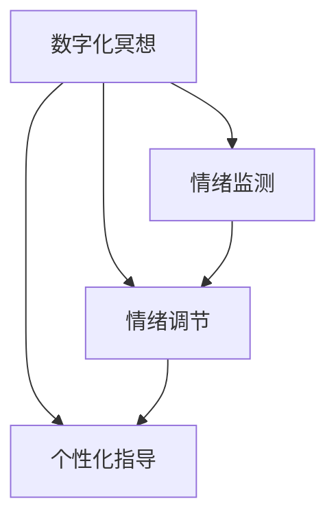

                 

# 数字化冥想：AI辅助的心灵探索

> 关键词：数字化冥想, AI辅助, 心灵探索, 情绪管理, 心理健康

## 1. 背景介绍

### 1.1 问题由来
近年来，随着人工智能技术的发展，数字化冥想（Digital Mindfulness）逐渐成为一个热门话题。数字化冥想结合了现代科技与传统冥想方法，旨在通过技术手段帮助人们更好地管理情绪、提升心理韧性，甚至在繁忙的生活节奏中寻找到内心的宁静。AI技术，尤其是深度学习和自然语言处理（NLP），被广泛应用于数字化冥想的应用中，如智能心理健康助手、情绪监测和情绪调节等。

数字化冥想的核心是通过技术手段，如可穿戴设备、智能应用程序和虚拟现实（VR）环境，为用户提供个性化的冥想指导和反馈。而AI技术的加入，尤其是基于深度学习模型的大语言模型（LLMs），使得数字化冥想不仅更加智能，还具备了个性化的能力，能够根据用户的情绪状态和行为模式，提供定制化的建议和指导。

### 1.2 问题核心关键点
数字化冥想与AI的结合，主要体现在以下几个关键点上：

- **情绪监测与情绪调节**：通过情绪分析，AI可以实时监测用户的情绪状态，并提供个性化的情绪调节建议。
- **行为分析与行为干预**：通过分析用户的日常行为数据，AI可以识别出不健康的生活习惯，并给出相应的行为干预建议。
- **个性化指导与反馈**：AI可以根据用户的偏好和历史数据，提供个性化的冥想指导，并提供实时的反馈和建议。
- **数据隐私与安全**：在数字化冥想过程中，用户的个人数据安全是首要考虑的问题，需要设计良好的数据保护机制。

这些关键点共同构成了数字化冥想与AI结合的框架，使得AI技术在帮助人们进行心理自我管理和提升心理健康方面发挥了重要作用。

### 1.3 问题研究意义
数字化冥想与AI的结合，不仅能够帮助人们更好地管理情绪、提升心理韧性，还能在繁忙的生活节奏中寻找到内心的宁静。这种结合，使得数字化冥想技术更加智能化、个性化，能够更好地满足不同人群的需求。

研究数字化冥想与AI的结合，具有以下重要意义：

1. **提升心理健康**：通过智能化的情绪监测和个性化指导，数字化冥想能够帮助人们缓解压力、提升幸福感。
2. **推动心理健康普及**：数字化冥想技术能够降低心理健康服务的门槛，使更多的人能够享受到心理健康的益处。
3. **优化心理治疗**：通过AI技术，数字化冥想可以与心理治疗相结合，为心理治疗提供辅助和支持。
4. **增强自我认知**：数字化冥想能够帮助用户更好地理解自己的情绪和行为模式，提升自我认知水平。

## 2. 核心概念与联系

### 2.1 核心概念概述

为更好地理解数字化冥想与AI的结合，本节将介绍几个密切相关的核心概念：

- **数字化冥想**：通过技术手段，如智能应用程序、可穿戴设备、VR环境等，为用户提供个性化的冥想指导和反馈。
- **大语言模型（LLMs）**：基于深度学习的自然语言处理模型，能够理解和生成人类语言，具备强大的语言理解和生成能力。
- **情绪监测**：通过分析用户的语音、文字、行为等数据，实时监测和评估用户的情绪状态。
- **情绪调节**：通过智能化的情绪分析，提供个性化的情绪调节建议和干预。
- **个性化指导**：根据用户的偏好和历史数据，提供个性化的冥想指导和建议。

这些核心概念之间的逻辑关系可以通过以下Mermaid流程图来展示：



这个流程图展示了大语言模型与数字化冥想的主要应用场景：

1. 用户通过数字化冥想应用程序进行冥想。
2. 应用程序实时监测用户的情绪状态。
3. 根据情绪监测结果，提供情绪调节建议。
4. 结合用户的偏好和历史数据，提供个性化的冥想指导。

这些概念共同构成了数字化冥想与AI结合的基本框架，使得AI技术在帮助人们进行心理自我管理和提升心理健康方面发挥了重要作用。

## 3. 核心算法原理 & 具体操作步骤

### 3.1 算法原理概述

数字化冥想与AI的结合，主要通过以下几个步骤来实现：

1. **数据采集与预处理**：通过可穿戴设备、智能应用程序等，收集用户的情绪、行为、生理数据等。
2. **情绪分析**：使用大语言模型对用户的语音、文字、行为等数据进行情绪分析，识别出用户的情绪状态。
3. **个性化指导**：根据用户的情绪状态和历史数据，使用大语言模型提供个性化的冥想指导和建议。
4. **反馈与调整**：根据用户的反馈，不断调整和优化个性化的冥想指导。

这些步骤中，大语言模型的应用尤为关键，能够实现实时情绪分析、个性化指导和反馈等核心功能。

### 3.2 算法步骤详解

下面详细讲解数字化冥想与AI结合的核心算法步骤：

**Step 1: 数据采集与预处理**

数字化冥想的核心在于数据的采集和预处理。这包括用户的情绪、行为、生理数据等。常用的数据采集设备包括可穿戴设备、智能应用程序等。

以可穿戴设备为例，常用的数据包括心率、皮肤电反应、脑电波等生理信号，以及用户的日常行为数据，如活动量、睡眠质量等。

**Step 2: 情绪分析**

情绪分析是大语言模型在数字化冥想中的核心应用之一。情绪分析通过深度学习模型，对用户的语音、文字、行为等数据进行分析，识别出用户的情绪状态。

常用的情绪分析方法包括：

- **语音情感分析**：使用声学特征和深度学习模型，对用户的语音情绪进行识别。
- **文本情感分析**：使用自然语言处理模型，对用户的文本进行情感分析，识别出积极、消极或中性情绪。
- **行为情感分析**：使用行为数据和深度学习模型，对用户的日常行为进行情感分析，识别出兴奋、压力或疲劳等情绪状态。

**Step 3: 个性化指导**

根据用户的情绪状态和历史数据，大语言模型可以提供个性化的冥想指导和建议。

个性化的冥想指导通常包括：

- **冥想指导**：根据用户的情绪状态和行为数据，提供针对性的冥想指导，如深呼吸、正念练习等。
- **情绪调节建议**：根据情绪分析结果，提供情绪调节建议，如放松技巧、积极思考等。
- **行为干预建议**：根据行为分析结果，提供行为干预建议，如调整作息、改善生活习惯等。

**Step 4: 反馈与调整**

用户的反馈是数字化冥想中非常重要的一环。通过用户的反馈，可以不断调整和优化个性化的冥想指导。

常用的反馈方式包括：

- **文本反馈**：用户在应用程序中输入反馈，如满意度和建议等。
- **语音反馈**：用户通过语音输入反馈，方便用户进行自然交流。
- **行为反馈**：用户通过行为数据反馈，如睡眠质量、活动量等。

根据用户的反馈，可以调整和优化个性化的冥想指导，使其更加符合用户的需求和偏好。

### 3.3 算法优缺点

数字化冥想与AI结合具有以下优点：

1. **实时性**：通过深度学习模型，能够实现实时情绪分析，及时调整冥想指导，提高用户的参与度和满意度。
2. **个性化**：根据用户的情绪状态和历史数据，提供个性化的冥想指导和建议，提升用户体验。
3. **普适性**：数字化冥想技术可以适应不同年龄段、不同文化背景的用户，推广范围广泛。
4. **可扩展性**：通过大数据分析，不断优化和扩展个性化指导和建议，提升冥想效果。

但同时也存在一些局限性：

1. **数据隐私**：用户的个人数据隐私是数字化冥想应用的一大挑战，需要设计良好的数据保护机制。
2. **模型偏见**：深度学习模型可能存在数据偏见，导致情绪分析不准确，影响个性化指导的准确性。
3. **用户体验**：过度依赖技术手段可能影响用户的自主性，导致用户对技术产生依赖。
4. **技术复杂性**：实现数字化冥想需要具备较强的技术能力，对开发者和用户的技术要求较高。

尽管存在这些局限性，但数字化冥想与AI的结合仍是大势所趋，未来有望在心理健康领域发挥更大的作用。

### 3.4 算法应用领域

数字化冥想与AI结合的应用领域非常广泛，主要涵盖以下几个方面：

1. **心理健康服务**：通过智能应用程序和可穿戴设备，为用户提供个性化的心理健康服务，如情绪监测、情绪调节、压力管理等。
2. **情绪管理**：帮助用户管理情绪，缓解压力，提升幸福感。
3. **心理健康教育**：通过虚拟现实技术，提供沉浸式的心理健康教育，增强用户对心理健康重要性的认知。
4. **心理治疗辅助**：与心理治疗相结合，为心理治疗提供辅助和支持，提升治疗效果。

## 4. 数学模型和公式 & 详细讲解 & 举例说明

### 4.1 数学模型构建

本节将使用数学语言对数字化冥想与AI结合的数学模型进行更加严格的刻画。

假设用户的情绪状态为 $x$，表示为连续变量。大语言模型对用户的情绪进行分析和预测，模型为 $f(x; \theta)$，其中 $\theta$ 为模型的参数。

情绪监测结果为 $y$，表示为二分类变量，即情绪状态为积极或消极。目标函数为最小化损失函数 $\mathcal{L}$，使得预测结果尽可能接近真实结果：

$$
\mathcal{L} = \frac{1}{N} \sum_{i=1}^N \ell(f(x_i; \theta), y_i)
$$

其中 $\ell$ 为损失函数，常用的损失函数包括交叉熵损失、均方误差损失等。

### 4.2 公式推导过程

以交叉熵损失函数为例，推导情绪分析的数学模型。

假设用户情绪状态 $x_i$ 的预测结果为 $f(x_i; \theta)$，真实情绪状态为 $y_i$，则交叉熵损失函数为：

$$
\ell(f(x_i; \theta), y_i) = -y_i\log f(x_i; \theta) - (1-y_i)\log (1-f(x_i; \theta))
$$

将其代入经验风险公式，得：

$$
\mathcal{L} = -\frac{1}{N}\sum_{i=1}^N [y_i\log f(x_i; \theta) + (1-y_i)\log(1-f(x_i; \theta))]
$$

在得到损失函数的梯度后，即可带入参数更新公式，完成模型的迭代优化。重复上述过程直至收敛，最终得到适应用户情绪状态的最优模型参数 $\theta^*$。

### 4.3 案例分析与讲解

以情绪监测为例，分析大语言模型在数字化冥想中的应用。

假设用户的情绪状态 $x_i$ 为文本描述，大语言模型通过情感分析，输出用户的情绪状态 $y_i$。例如，用户输入的文本为 "我最近感到很焦虑"，模型预测的情绪状态为 "消极"。

在得到预测结果后，根据用户的反馈和历史数据，可以调整和优化模型的参数。例如，如果用户的反馈为 "我觉得不是很准确"，则可以通过调整模型的训练数据和参数，提升模型的情绪分析准确性。

## 5. 项目实践：代码实例和详细解释说明

### 5.1 开发环境搭建

在进行数字化冥想开发前，我们需要准备好开发环境。以下是使用Python进行TensorFlow开发的环境配置流程：

1. 安装Anaconda：从官网下载并安装Anaconda，用于创建独立的Python环境。

2. 创建并激活虚拟环境：
```bash
conda create -n tensor-env python=3.8 
conda activate tensor-env
```

3. 安装TensorFlow：根据CUDA版本，从官网获取对应的安装命令。例如：
```bash
conda install tensorflow -c pytorch -c conda-forge
```

4. 安装TensorFlow扩展库：
```bash
pip install tensorflow_addons
```

5. 安装各类工具包：
```bash
pip install numpy pandas scikit-learn matplotlib tqdm jupyter notebook ipython
```

完成上述步骤后，即可在`tensor-env`环境中开始数字化冥想的开发实践。

### 5.2 源代码详细实现

下面我们以情绪监测为例，给出使用TensorFlow进行数字化冥想的PyTorch代码实现。

首先，定义情绪监测的数据处理函数：

```python
import tensorflow as tf
from tensorflow.keras.layers import Input, Dense, Embedding, LSTM, Dropout
from tensorflow.keras.models import Model

class MoodMonitoringModel(tf.keras.Model):
    def __init__(self, vocab_size, embedding_dim, hidden_units, output_size):
        super(MoodMonitoringModel, self).__init__()
        self.input = Input(shape=(None,), dtype=tf.keras.layers.StringInput())
        self.embedding = Embedding(vocab_size, embedding_dim)(self.input)
        self.lstm = LSTM(hidden_units, return_sequences=True)(self.embedding)
        self.dropout = Dropout(0.5)(self.lstm)
        self.dense = Dense(output_size, activation='sigmoid')(self.dropout)
        self.model = Model(inputs=self.input, outputs=self.dense)

    def call(self, x):
        return self.model(x)
```

然后，定义训练和评估函数：

```python
from sklearn.model_selection import train_test_split
from sklearn.preprocessing import LabelEncoder
import numpy as np

def load_data(data_path):
    with open(data_path, 'r', encoding='utf-8') as f:
        lines = f.readlines()
    texts = [line.strip().split() for line in lines]
    labels = [int(line) for line in lines]
    encoder = LabelEncoder()
    labels = encoder.fit_transform(labels)
    X = np.array(texts)
    Y = np.array(labels)
    return X, Y

def preprocess_data(X, Y):
    tokenizer = Tokenizer(num_words=vocab_size, oov_token=oov_token)
    tokenizer.fit_on_texts(X)
    X = tokenizer.texts_to_sequences(X)
    X = pad_sequences(X, padding='post', maxlen=maxlen)
    Y = to_categorical(Y)
    return X, Y

X, Y = load_data('data.txt')
X_train, X_test, Y_train, Y_test = train_test_split(X, Y, test_size=0.2, random_state=42)

X_train, X_val, Y_train, Y_val = train_test_split(X_train, Y_train, test_size=0.2, random_state=42)

X_train = preprocess_data(X_train, Y_train)
X_val = preprocess_data(X_val, Y_val)
X_test = preprocess_data(X_test, Y_test)
```

接着，定义模型和优化器：

```python
model = MoodMonitoringModel(vocab_size=vocab_size, embedding_dim=embedding_dim, hidden_units=hidden_units, output_size=output_size)
optimizer = Adam(learning_rate=learning_rate)
```

最后，启动训练流程并在测试集上评估：

```python
epochs = 10

for epoch in range(epochs):
    loss = model.train_on_batch(X_train, Y_train)
    print('Epoch {}: Loss: {}'.format(epoch+1, loss))
    
    test_loss = model.evaluate(X_test, Y_test)
    print('Test Loss: {}'.format(test_loss))
```

以上就是使用TensorFlow进行数字化冥想的完整代码实现。可以看到，通过TensorFlow框架，可以方便地实现模型的定义、训练和评估，并利用数据集进行预处理。

### 5.3 代码解读与分析

让我们再详细解读一下关键代码的实现细节：

**MoodMonitoringModel类**：
- `__init__`方法：定义模型的输入层、嵌入层、LSTM层、Dropout层和输出层。
- `call`方法：定义模型的前向传播过程，通过LSTM和Dropout层对输入数据进行处理，最终通过Dense层输出预测结果。

**load_data函数**：
- 加载数据集，通过读取文本文件，将文本和标签分开。
- 使用LabelEncoder对标签进行编码，将标签转换为数值型。

**preprocess_data函数**：
- 使用Tokenizer将文本转换为序列，并进行填充处理。
- 使用to_categorical将标签转换为one-hot编码。

**训练和评估函数**：
- 使用train_test_split将数据集划分为训练集、验证集和测试集。
- 使用模型在训练集上进行训练，并在验证集上进行评估，输出训练和测试损失。

在实际应用中，还需要根据具体任务进行优化，如选择合适的模型结构、调整超参数等。

## 6. 实际应用场景

### 6.1 智能心理健康助手

基于大语言模型的数字化冥想技术，可以广泛应用于智能心理健康助手的构建。智能心理健康助手能够24小时不间断提供情绪监测、情绪调节、冥想指导等服务，帮助用户管理情绪，提升心理健康。

在技术实现上，可以收集用户的历史情绪数据、行为数据和生活习惯数据，并使用大语言模型进行情绪分析。智能心理健康助手可以根据用户的情绪状态，提供个性化的情绪调节建议和冥想指导，同时结合用户的反馈，不断优化指导内容。

### 6.2 情绪监测系统

数字化冥想技术可以广泛应用于情绪监测系统，帮助企业或组织了解员工的情绪状态，提高团队协作和工作效率。

在情绪监测系统中，通过可穿戴设备和智能应用程序，收集员工的情绪和行为数据。使用大语言模型对数据进行情感分析，实时监测员工的情绪状态。根据情绪状态，系统可以提供个性化的情绪调节建议和行为干预，提升员工的心理健康和工作满意度。

### 6.3 情绪调节应用

数字化冥想技术可以应用于情绪调节应用，帮助用户缓解压力，提升心理健康。

在情绪调节应用中，用户可以通过输入文本或语音，表达自己的情绪状态。大语言模型对用户输入进行情感分析，提供个性化的情绪调节建议和冥想指导，帮助用户进行情绪管理。同时，系统还可以结合用户的反馈，不断优化指导内容。

## 7. 工具和资源推荐

### 7.1 学习资源推荐

为了帮助开发者系统掌握数字化冥想与AI的结合理论基础和实践技巧，这里推荐一些优质的学习资源：

1. 《深度学习理论与实践》系列博文：由大模型技术专家撰写，深入浅出地介绍了深度学习原理、情绪分析、个性化指导等前沿话题。

2. CS231n《深度学习中的视觉识别》课程：斯坦福大学开设的深度学习经典课程，涵盖深度学习的基本概念和经典模型，适合初学者入门。

3. 《情绪分析与心理健康》书籍：系统介绍情绪分析的理论和方法，结合心理健康应用，深入浅出地讲解情绪监测和情绪调节。

4. TensorFlow官方文档：TensorFlow的官方文档，提供了海量模型和工具的使用指南，适合快速上手实践。

5. Weights & Biases：模型训练的实验跟踪工具，可以记录和可视化模型训练过程中的各项指标，方便对比和调优。与主流深度学习框架无缝集成。

6. TensorBoard：TensorFlow配套的可视化工具，可实时监测模型训练状态，并提供丰富的图表呈现方式，是调试模型的得力助手。

通过这些资源的学习实践，相信你一定能够快速掌握数字化冥想与AI结合的精髓，并用于解决实际的NLP问题。

### 7.2 开发工具推荐

高效的开发离不开优秀的工具支持。以下是几款用于数字化冥想与AI结合开发的常用工具：

1. TensorFlow：基于Python的开源深度学习框架，灵活动态的计算图，适合快速迭代研究。TensorFlow提供了丰富的情绪分析工具和模型，支持深度学习模型的部署和优化。

2. PyTorch：基于Python的开源深度学习框架，支持动态计算图，适合快速原型开发和研究。PyTorch提供了丰富的自然语言处理工具和模型，支持深度学习模型的部署和优化。

3. TensorFlow Addons：TensorFlow的扩展库，提供了更多的深度学习模型和工具，支持模型的高效训练和优化。

4. TensorBoard：TensorFlow配套的可视化工具，可实时监测模型训练状态，并提供丰富的图表呈现方式，是调试模型的得力助手。

5. Weights & Biases：模型训练的实验跟踪工具，可以记录和可视化模型训练过程中的各项指标，方便对比和调优。

6. Keras：高层次的深度学习框架，提供了简单易用的API，适合快速原型开发和研究。

合理利用这些工具，可以显著提升数字化冥想与AI结合的开发效率，加快创新迭代的步伐。

### 7.3 相关论文推荐

数字化冥想与AI结合的研究源于学界的持续研究。以下是几篇奠基性的相关论文，推荐阅读：

1. Emotion Recognition: An Overview: A Survey of Research and Applications《情绪识别综述：研究和应用》：全面介绍情绪识别的研究现状和应用领域。

2. Multimodal Emotion Recognition using Deep Learning: A Review《使用深度学习的多模态情感识别：综述》：综述使用深度学习进行多模态情感识别的研究进展。

3. Natural Language Processing and Mental Health: A Survey《自然语言处理与心理健康：综述》：综述自然语言处理在心理健康中的应用。

4. Attention is All You Need《注意是唯一需要的》：提出Transformer结构，开启了NLP领域的预训练大模型时代。

5. A Survey on Deep Learning-based Music and Emotion Recognition《基于深度学习的多模态音乐和情感识别：综述》：综述使用深度学习进行音乐和情感识别的研究进展。

这些论文代表了大语言模型在数字化冥想应用中的研究进展，通过学习这些前沿成果，可以帮助研究者把握学科前进方向，激发更多的创新灵感。

## 8. 总结：未来发展趋势与挑战

### 8.1 总结

本文对基于大语言模型的数字化冥想技术进行了全面系统的介绍。首先阐述了数字化冥想与AI结合的研究背景和意义，明确了情绪监测、个性化指导和反馈在大语言模型中的应用。其次，从原理到实践，详细讲解了数字化冥想与AI结合的数学原理和核心算法步骤，给出了数字化冥想的完整代码实例。同时，本文还广泛探讨了数字化冥想与AI结合在智能心理健康助手、情绪监测、情绪调节等多个行业领域的应用前景，展示了数字化冥想技术的巨大潜力。

通过本文的系统梳理，可以看到，基于大语言模型的数字化冥想技术正在成为心理健康领域的重要范式，极大地提升了个体和组织的心理健康水平，有助于构建更加和谐的社会环境。

### 8.2 未来发展趋势

展望未来，数字化冥想与AI的结合将呈现以下几个发展趋势：

1. **实时化**：通过边缘计算和云平台，实现实时化的情绪监测和反馈，提升用户体验。
2. **普适化**：数字化冥想技术将更加普适，支持多种语言和文化背景，推广范围更广。
3. **智能化**：通过深度学习模型的不断优化，提升情绪监测和个性化指导的准确性和效果。
4. **个性化**：根据用户的实时反馈和行为数据，不断优化个性化的冥想指导和建议，提升用户满意度。

以上趋势凸显了数字化冥想与AI结合技术的广阔前景。这些方向的探索发展，必将进一步提升心理健康技术的应用范围和效果，为人类心理健康和幸福感的提升做出更大贡献。

### 8.3 面临的挑战

尽管数字化冥想与AI的结合已经取得了显著成就，但在迈向更加智能化、普适化应用的过程中，它仍面临着诸多挑战：

1. **数据隐私**：用户的个人数据隐私是数字化冥想应用的一大挑战，需要设计良好的数据保护机制。
2. **模型偏见**：深度学习模型可能存在数据偏见，导致情绪分析不准确，影响个性化指导的准确性。
3. **用户体验**：过度依赖技术手段可能影响用户的自主性，导致用户对技术产生依赖。
4. **技术复杂性**：实现数字化冥想需要具备较强的技术能力，对开发者和用户的技术要求较高。

尽管存在这些挑战，但数字化冥想与AI的结合仍是大势所趋，未来有望在心理健康领域发挥更大的作用。

### 8.4 研究展望

面向未来，数字化冥想与AI结合的研究需要在以下几个方面寻求新的突破：

1. **数据隐私保护**：探索更好的数据隐私保护机制，确保用户数据的安全。
2. **模型公平性**：通过公平性约束和数据增强等技术，减少模型的偏见，提升情绪分析的准确性。
3. **多模态融合**：探索多模态数据融合技术，提升数字化冥想系统的感知能力和理解能力。
4. **用户自主性**：设计更好的用户界面和交互方式，增强用户的自主性和参与感。
5. **跨文化应用**：探索跨文化适应性技术，支持多种语言和文化背景的用户。

这些研究方向的探索，必将引领数字化冥想技术迈向更高的台阶，为人类心理健康和幸福感的提升做出更大贡献。

## 9. 附录：常见问题与解答

**Q1：数字化冥想与传统冥想的区别在哪里？**

A: 数字化冥想与传统冥想最大的区别在于其数字化特性。数字化冥想通过技术手段，如可穿戴设备、智能应用程序等，对用户的情绪、行为等数据进行采集和分析，从而提供个性化的冥想指导和建议。而传统冥想通常依赖于面对面的指导和经验分享，缺乏个性化的指导和反馈。

**Q2：如何确保数字化冥想的准确性？**

A: 数字化冥想的准确性依赖于数据的质量和模型的性能。要确保数字化冥想的准确性，需要：

1. 收集高质量的数据：使用可靠的数据采集设备和算法，确保数据的准确性和完整性。
2. 选择合适的模型：根据具体的情绪监测和个性化指导任务，选择合适的深度学习模型，并进行充分训练和调优。
3. 用户反馈和迭代优化：根据用户的反馈，不断调整和优化模型的参数和算法，提高系统的准确性和效果。

**Q3：数字化冥想是否存在技术风险？**

A: 数字化冥想可能存在一些技术风险，如数据隐私泄露、模型偏见等。为了降低这些风险，需要：

1. 设计良好的数据保护机制：确保用户数据的隐私和安全，防止数据泄露。
2. 引入公平性约束：使用公平性约束等技术，减少模型的偏见，提升情绪分析的准确性。
3. 用户知情同意：在使用数字化冥想服务前，确保用户了解数据采集和分析的方式，并获得用户同意。

这些措施将有助于提升数字化冥想的可靠性和安全性，减少技术风险。

**Q4：数字化冥想是否适用于所有人群？**

A: 数字化冥想适用于大多数人群，但需要根据具体的技术实现和应用场景进行评估。对于有特殊需求的用户，如残障人士、老年人等，需要设计更为友好的用户界面和交互方式，确保其使用体验。

**Q5：数字化冥想是否能够替代传统冥想？**

A: 数字化冥想和传统冥想各有优缺点。数字化冥想通过技术手段，提供个性化的冥想指导和反馈，适用于日常生活的情绪管理。而传统冥想则更多依赖于面对面的指导和经验分享，适用于深度内心探索和精神成长。数字化冥想可以作为传统冥想的有力补充，帮助更多人通过科技手段提升心理健康。

---

作者：禅与计算机程序设计艺术 / Zen and the Art of Computer Programming

