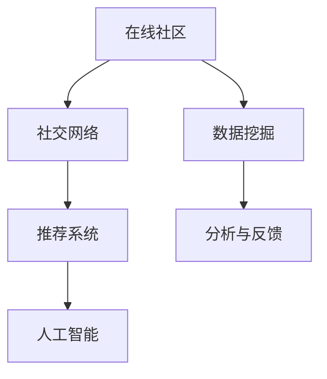

                 

# 数字化宠物社交创业：宠物主人的在线社区

## 1. 背景介绍

### 1.1 问题由来

在当今社会，宠物逐渐成为人类重要的伴侣和家庭成员。随着人们生活水平的提高，对宠物的关注和投入也在不断增加。然而，由于现代生活节奏的加快和城市化的推进，宠物主人往往面临与宠物相处时间不足的困境，难以及时关注宠物的身心健康。宠物社交需求日益凸显，成为当下热门话题。

在这样的背景下，宠物社交创业应运而生。通过数字化技术构建的在线宠物社区，使得宠物主人能够随时分享宠物的生活状态、健康状况和社交互动，同时也能获取相关的养护知识和资讯，与志同道合的宠物主人交流心得，极大地满足了宠物主人的社交需求和关照宠物的心理需求。

### 1.2 问题核心关键点

宠物社交创业的核心在于建立一个集互动、知识共享、情感交流于一体的在线社区，利用数字化技术打破物理空间的限制，让宠物主人能够随时随地与宠物、与其他宠物主人进行互动，分享信息和知识，获得心理慰藉。

为了实现这一目标，需要解决以下几个关键问题：
- 如何构建一个安全、稳定、高效的在线社区平台？
- 如何设计一套适合宠物主人的社交互动机制？
- 如何整合专家知识和资源，提供丰富的养护建议和实用信息？
- 如何构建可信的用户关系网络，确保社区的活跃度和参与度？
- 如何优化用户推荐算法，提高社区内容的可发现性和匹配度？

### 1.3 问题研究意义

宠物社交创业具有重要的研究意义：
1. 促进宠物主人的心理健康。宠物社交创业通过构建虚拟社交空间，使宠物主人能够与宠物进行互动，缓解孤独感，提升心理健康水平。
2. 强化人与宠物的情感联系。在线宠物社区为宠物主人提供了一个展示和分享宠物生活的平台，增强了人与宠物的情感联结。
3. 推动宠物行业的发展。宠物社交创业将促使宠物行业更多关注数字化转型，促进宠物产品的研发和销售。
4. 丰富社会生活内容。随着宠物文化的普及，宠物社交创业成为社交娱乐的新热点，为社会生活增添了更多色彩。
5. 提升宠物养护知识普及度。通过在线宠物社区分享养护知识和经验，能够提升宠物主人的养护水平，减少宠物生病或意外伤害的风险。

## 2. 核心概念与联系

### 2.1 核心概念概述

为更好地理解宠物社交创业的技术架构和实现机制，本节将介绍几个关键概念：

- 在线社区：通过互联网构建的虚拟社交平台，用户可以在平台上进行交流、分享、互动。
- 社交网络(Social Network)：利用图论和算法，构建用户之间的关系网络，记录用户的互动行为。
- 推荐系统(Recommendation System)：根据用户行为和兴趣，推荐合适的信息内容。
- 人工智能与机器学习：利用算法优化推荐系统，增强社区内容的匹配度和可发现性。
- 数据挖掘与分析：从社区数据中挖掘有价值的信息，优化社区运营策略，提升用户体验。

这些概念之间的逻辑关系可以通过以下Mermaid流程图来展示：



这个流程图展示了在线社区平台的核心概念及其之间的关系：

1. 在线社区通过互联网技术搭建虚拟平台，构成社区基础。
2. 社交网络利用图论和算法，建立用户间的互动关系。
3. 推荐系统利用人工智能算法，推荐适合用户的内容。
4. 数据挖掘从社区数据中提取信息，进行分析和反馈。
5. 分析结果反过来优化社区运营和算法策略。

## 3. 核心算法原理 & 具体操作步骤

### 3.1 算法原理概述

宠物社交创业的核心算法主要涉及社交网络的构建、推荐系统的优化、人工智能技术的应用以及数据挖掘与分析。下面逐一介绍这些核心算法的原理和实现步骤。

### 3.2 算法步骤详解

#### 3.2.1 社交网络的构建

社交网络构建主要涉及以下步骤：

1. **用户注册与验证**：用户需要注册并经过身份验证才能加入社区。验证过程包括身份信息审核、社交证明等，确保用户身份的真实性。
2. **关系网络建立**：用户通过互相关注、添加好友等行为，建立与他人的关系网络。平台可以通过这些关系行为生成社交图谱，记录用户之间的互动情况。
3. **社交规则制定**：制定社交规则，如内容过滤、互动行为规范等，确保社区环境的安全和秩序。

#### 3.2.2 推荐系统的优化

推荐系统是宠物社交创业的核心技术之一，旨在为用户推荐个性化的内容，增强用户粘性。其核心算法包括协同过滤、基于内容的推荐和深度学习推荐等。

1. **协同过滤算法**：通过分析用户行为数据（如浏览、点赞、评论等），找到与目标用户行为相似的其他用户，并根据这些相似用户的历史行为，推荐相似的内容。
2. **基于内容的推荐**：通过分析内容属性（如标签、关键词等），找到与目标用户兴趣相符的内容，推荐给用户。
3. **深度学习推荐**：使用深度学习模型，如深度神经网络、卷积神经网络等，分析用户行为数据和内容属性，预测用户可能感兴趣的内容，进行推荐。

#### 3.2.3 人工智能技术的应用

人工智能技术在宠物社交创业中主要用于增强推荐系统的精准度和个性化程度。

1. **自然语言处理(NLP)**：通过分析用户输入的文本内容，理解用户的意图和兴趣，推荐相关的内容。
2. **图像识别与处理**：通过分析宠物图片和视频，识别宠物的健康状况和行为，为用户提供养护建议。
3. **聊天机器人**：通过构建聊天机器人，自动解答用户的问题，提供24小时在线服务。

#### 3.2.4 数据挖掘与分析

数据挖掘与分析是优化社区运营的重要手段。

1. **用户行为分析**：通过分析用户的行为数据，发现用户的兴趣和需求，优化内容推荐策略。
2. **社区互动分析**：通过分析社区中的互动数据，发现社区的热点话题和趋势，优化社区运营策略。
3. **异常行为检测**：通过分析用户行为，检测异常行为，如账号被盗、不当内容传播等，确保社区环境的安全。

### 3.3 算法优缺点

社交网络的构建、推荐系统的优化、人工智能技术的应用以及数据挖掘与分析，各自具有优点和缺点：

#### 社交网络的构建

**优点**：
- 用户可以随时关注、互动，增强社区活跃度。
- 社区关系网络可以模拟现实中的社交行为，增强用户粘性。

**缺点**：
- 过度关注可能导致用户信息泄露，影响用户隐私。
- 虚假账号、恶意账号可能破坏社区环境。

#### 推荐系统的优化

**优点**：
- 通过个性化推荐，提高用户粘性和满意度。
- 提升内容发现效率，增加社区活跃度。

**缺点**：
- 推荐算法可能存在偏差，影响推荐效果。
- 个性化推荐可能导致信息茧房，限制用户视野。

#### 人工智能技术的应用

**优点**：
- 提高内容的个性化程度，增强用户体验。
- 增强互动的自动化和智能化程度，提高服务效率。

**缺点**：
- 需要大量的数据和计算资源，成本较高。
- 人工智能技术本身可能存在一定的局限性，如误判、偏见等。

#### 数据挖掘与分析

**优点**：
- 通过数据分析，优化社区运营策略，提升用户体验。
- 发现社区中的热点话题和趋势，指导社区发展方向。

**缺点**：
- 数据隐私和安全问题需要特别关注。
- 数据分析结果可能存在误导性，需要谨慎解读和使用。

### 3.4 算法应用领域

这些核心算法在宠物社交创业中的应用领域包括：

1. **在线宠物社区的构建与运营**：利用社交网络和推荐系统，构建互动平台，提供个性化服务。
2. **宠物健康监测与养护**：通过图像识别和聊天机器人，提供宠物健康监测和养护建议。
3. **宠物食品与产品推荐**：利用推荐系统，根据用户需求推荐适合的宠物产品。
4. **社区内容生成与审核**：通过人工智能技术，生成高质量社区内容，并进行智能审核，确保内容健康和安全。
5. **用户行为分析与预测**：利用数据挖掘和分析，优化社区运营策略，预测用户需求和行为。

## 4. 数学模型和公式 & 详细讲解 & 举例说明

### 4.1 数学模型构建

为了更好地理解这些核心算法的数学模型，本节将介绍一些关键数学模型及其构建方法。

#### 社交网络的数学模型

社交网络可以建模为图论中的有向图 $G=(V,E)$，其中 $V$ 表示节点集，$E$ 表示边集。每个节点代表社区中的一个用户，边表示用户之间的关系，如关注、好友等。

社交网络的构建和分析可以使用以下数学模型：

1. **邻接矩阵**：表示用户之间关系的矩阵，矩阵中 $A_{ij}=1$ 表示用户 $i$ 与用户 $j$ 存在关系，$A_{ij}=0$ 表示不存在关系。
2. **度矩阵**：表示用户节点的度数，即与用户 $i$ 有关系的用户数。
3. **拉普拉斯矩阵**：表示社交网络的拓扑结构，$L=D-A$，其中 $D$ 是度矩阵，$A$ 是邻接矩阵。

#### 推荐系统的数学模型

推荐系统可以建模为优化问题，目标是最小化用户和内容的误差。常用的优化模型包括：

1. **协同过滤模型**：基于用户和物品的共现矩阵 $X$，最大化目标函数 $J(X)$，使得预测值与实际值的误差最小。
2. **基于内容的推荐模型**：基于内容的特征向量 $V$ 和用户的兴趣向量 $U$，最大化目标函数 $J(V,U)$，使得预测值与实际值的误差最小。
3. **深度学习推荐模型**：使用深度神经网络对用户行为数据和内容属性进行处理，输出推荐结果。

#### 人工智能技术的数学模型

人工智能技术主要涉及图像识别、自然语言处理和聊天机器人等，可以使用以下数学模型：

1. **图像识别模型**：使用卷积神经网络对图像进行特征提取和分类，输出宠物健康状态。
2. **自然语言处理模型**：使用循环神经网络对文本进行情感分析、意图识别等处理，输出用户意图和兴趣。
3. **聊天机器人模型**：使用基于记忆的神经网络对用户输入进行处理，输出回答。

### 4.2 公式推导过程

#### 社交网络的公式推导

社交网络的构建可以使用以下公式：

1. **邻接矩阵**：
$$
A_{ij} = 
\begin{cases}
1 & \text{用户 }i\text{ 关注 }j\\
0 & \text{用户 }i\text{ 不关注 }j
\end{cases}
$$

2. **度矩阵**：
$$
D = \text{diag}(d_1, d_2, ..., d_n)
$$
其中 $d_i$ 表示用户 $i$ 的度数。

3. **拉普拉斯矩阵**：
$$
L = D - A
$$

#### 推荐系统的公式推导

推荐系统的优化可以使用以下公式：

1. **协同过滤模型**：
$$
J(X) = \sum_{i=1}^{m}\sum_{j=1}^{n}(y_{ij} - \hat{y}_{ij})^2
$$
其中 $X$ 表示用户行为矩阵，$y_{ij}$ 表示真实值，$\hat{y}_{ij}$ 表示预测值。

2. **基于内容的推荐模型**：
$$
J(V,U) = \sum_{i=1}^{m}\sum_{j=1}^{n}(y_{ij} - \hat{y}_{ij})^2
$$
其中 $V$ 表示内容特征向量，$U$ 表示用户兴趣向量。

3. **深度学习推荐模型**：
$$
J(\theta) = \frac{1}{2}\sum_{i=1}^{m}\sum_{j=1}^{n}(y_{ij} - f(X_i; \theta))^2
$$
其中 $\theta$ 表示模型参数，$f(X_i; \theta)$ 表示模型对用户 $i$ 的推荐结果。

### 4.3 案例分析与讲解

#### 社交网络案例分析

社交网络的构建和分析在实际应用中有许多成功案例。以微信朋友圈为例，用户之间通过关注、点赞等行为建立关系网络，平台通过分析这些关系数据，优化推荐算法，提高用户粘性。

#### 推荐系统案例分析

推荐系统在电商、视频流媒体、新闻推荐等领域有广泛应用。以亚马逊推荐系统为例，通过分析用户历史行为数据，为用户推荐可能感兴趣的商品，显著提高了用户购买率。

#### 人工智能技术案例分析

人工智能技术在图像识别、自然语言处理和聊天机器人等领域有显著应用。以谷歌翻译为例，通过深度学习模型对不同语言的文本进行翻译，显著提升了翻译的准确率和效率。

## 5. 项目实践：代码实例和详细解释说明

### 5.1 开发环境搭建

在进行项目实践前，我们需要准备好开发环境。以下是使用Python进行Django开发的环境配置流程：

1. 安装Anaconda：从官网下载并安装Anaconda，用于创建独立的Python环境。

2. 创建并激活虚拟环境：
```bash
conda create -n pet-social env python=3.8 
conda activate pet-social
```

3. 安装Django：
```bash
pip install django
```

4. 安装其他依赖库：
```bash
pip install django-allauth pillow opencv-python matplotlib pandas numpy scikit-learn
```

5. 安装前端框架：
```bash
pip install django-bootstrap3
```

完成上述步骤后，即可在`pet-social env`环境中开始项目开发。

### 5.2 源代码详细实现

下面以一个简单的在线宠物社区为例，给出使用Django框架进行开发的PyTorch代码实现。

首先，定义社区用户模型：

```python
from django.contrib.auth.models import AbstractUser
from django.db import models

class PetOwner(AbstractUser):
    bio = models.TextField(max_length=255, blank=True)
    pet = models.ForeignKey('Pet', on_delete=models.CASCADE)
    
    def __str__(self):
        return f'{self.username} ({self.pet.name})'
```

然后，定义宠物模型：

```python
class Pet(models.Model):
    owner = models.ForeignKey('PetOwner', on_delete=models.CASCADE)
    name = models.CharField(max_length=255)
    age = models.IntegerField()
    gender = models.CharField(max_length=10)
    
    def __str__(self):
        return self.name
```

接着，定义社交网络关系模型：

```python
class Friendship(models.Model):
    owner = models.ForeignKey('PetOwner', related_name='friends', on_delete=models.CASCADE)
    friend = models.ForeignKey('PetOwner', related_name='friendships', on_delete=models.CASCADE)
    
    def __str__(self):
        return f'{self.owner} is friends with {self.friend}'
```

最后，定义社区动态模型：

```python
class Post(models.Model):
    owner = models.ForeignKey('PetOwner', on_delete=models.CASCADE)
    pet = models.ForeignKey('Pet', on_delete=models.CASCADE)
    content = models.TextField(max_length=255)
    timestamp = models.DateTimeField(auto_now_add=True)
    
    def __str__(self):
        return f'{self.pet.name}: {self.content}'
```

在配置文件`settings.py`中，添加`allauth`的配置：

```python
INSTALLED_APPS = [
    ...
    'django_allauth',
    ...
]

SITE_ID = 1
```

启动项目后，用户可以通过注册、登录、关注好友、发布动态等操作，构建社交网络。通过社交网络关系和社区动态，用户可以分享宠物的生活状态和健康情况，获取其他用户的关注和点赞，进行互动交流。

### 5.3 代码解读与分析

让我们再详细解读一下关键代码的实现细节：

**PetOwner类**：
- `__str__`方法：定义用户模型的字符串表示，方便在前端显示。
- `bio`字段：表示用户的个人简介，可以增加用户的社交属性。
- `pet`字段：表示用户所拥有的宠物，增加宠物信息对社交互动的影响。

**Pet类**：
- `__str__`方法：定义宠物模型的字符串表示，方便在前端显示。
- `name`字段：表示宠物的名称。
- `age`字段和`gender`字段：表示宠物的年龄和性别，用于增加互动的多样性。

**Friendship类**：
- `__str__`方法：定义好友关系的字符串表示，方便在前端显示。
- `owner`字段和`friend`字段：表示好友关系的双方，记录用户间的互动关系。

**Post类**：
- `__str__`方法：定义社区动态的字符串表示，方便在前端显示。
- `owner`字段和`pet`字段：表示社区动态的发布者和涉及的宠物，记录社区互动的内容。
- `content`字段：表示社区动态的具体内容，用于展示用户分享的信息。
- `timestamp`字段：表示社区动态的发布时间，用于排序和显示。

可以看到，Django框架提供了强大的模型定义和数据库操作的封装能力，可以方便地实现社区的社交网络和动态内容管理。开发者可以根据实际需求，进一步扩展模型的字段和方法，优化社区功能和用户体验。

## 6. 实际应用场景

### 6.1 智能推荐系统

在线宠物社区的用户行为数据可以用于构建智能推荐系统，推荐宠物产品、养护知识等。

具体而言，可以通过分析用户对宠物产品的评价、浏览记录和购买历史，构建用户兴趣模型，再结合物品属性和用户行为数据，使用协同过滤、基于内容的推荐算法或深度学习推荐模型，为用户推荐适合的宠物产品，增加用户的购买率和满意度。

### 6.2 健康监测与养护

在线宠物社区可以利用图像识别和聊天机器人等人工智能技术，提供宠物健康监测和养护建议。

具体而言，用户可以上传宠物的图片和视频，平台通过图像识别技术分析宠物的健康状况和行为，判断是否存在异常，并向用户提供针对性的养护建议。此外，通过聊天机器人，用户可以随时随地咨询宠物健康问题，获取专业的回答和建议。

### 6.3 社交互动与情感交流

在线宠物社区通过构建社交网络，提供用户间的互动和情感交流平台。

具体而言，用户可以关注好友，发布动态，点赞评论，形成互动关系网络。通过社交互动，用户可以分享宠物生活的点点滴滴，获得其他用户的关注和点赞，增强心理满足感和归属感。此外，社区还可以组织线上线下活动，增加用户的参与感和社区凝聚力。

## 7. 工具和资源推荐

### 7.1 学习资源推荐

为了帮助开发者系统掌握在线宠物社交创业的技术，这里推荐一些优质的学习资源：

1. Django官方文档：详细介绍了Django框架的各个组件和使用方法，是Django开发的必备参考资料。
2. Django实战：一本由实际开发经验丰富的作者编写，结合实战项目讲解Django开发的经典书籍。
3. Django教程：通过一系列教程，逐步讲解Django框架的各个功能和最佳实践，适合初学者入门。
4. Django全栈开发：讲解Django框架在前后端开发中的全栈解决方案，涵盖前端框架、后端开发、数据库迁移等。
5. Django Allauth：一个Django插件，用于简化用户认证和社交网络集成，适合在线宠物社区等应用。

通过对这些资源的学习实践，相信你一定能够快速掌握Django开发的基本方法和技术细节，并应用于实际的宠物社交创业项目。

### 7.2 开发工具推荐

高效的开发离不开优秀的工具支持。以下是几款用于Django开发和后端数据处理的常用工具：

1. PyCharm：一款功能强大的Python开发工具，提供强大的代码编辑、调试和测试功能，适合Django开发。
2. Visual Studio Code：一款轻量级的代码编辑器，支持Python、Django等多种语言和框架，适合前后端开发。
3. Django Debug Toolbar：用于调试Django应用的工具，提供详细的调试信息和性能分析，适合开发过程中使用。
4. Git：版本控制工具，适合团队协作和代码版本管理，适合在线宠物社区等应用。
5. Docker：容器化技术，用于封装Django应用，方便部署和扩展，适合线上生产环境。

合理利用这些工具，可以显著提升Django开发的效率和质量，加速项目的迭代和部署。

### 7.3 相关论文推荐

在线宠物社交创业涉及多个领域的知识和技术，需要深入学习相关理论。以下是几篇奠基性的相关论文，推荐阅读：

1. "Social Networking Research: A Review"：全面介绍了社交网络的研究现状和未来发展方向。
2. "Recommender Systems Handbook"：系统介绍了推荐系统的理论基础和算法实现，适合了解推荐系统的基本原理和方法。
3. "Artificial Intelligence and Image Recognition"：讲解了人工智能在图像识别领域的应用，适合了解图像识别的基本原理和方法。
4. "Natural Language Processing with PyTorch"：讲解了自然语言处理在Python环境下的应用，适合了解NLP技术的实现方法。
5. "Dialogue Systems: A Survey"：全面介绍了聊天机器人的研究现状和未来发展方向。

这些论文代表了大语言模型微调技术的发展脉络。通过学习这些前沿成果，可以帮助研究者把握学科前进方向，激发更多的创新灵感。

## 8. 总结：未来发展趋势与挑战

### 8.1 总结

本文对在线宠物社交创业进行了系统介绍，介绍了社交网络、推荐系统、人工智能等核心技术的实现原理和方法。通过对这些技术的深入讲解和实践案例，展示了在线宠物社区的构建和运营思路。

通过本文的系统梳理，可以看到，在线宠物社交创业不仅需要技术上的创新，还需要业务模式和运营策略上的优化，才能构建一个稳定、活跃的在线宠物社区。大语言模型微调技术的快速发展，为在线宠物社区提供了更多可能性，推动了宠物社交领域的数字化转型。

### 8.2 未来发展趋势

展望未来，在线宠物社交创业将呈现以下几个发展趋势：

1. **智能推荐系统**：随着数据和算法的进步，智能推荐系统的精度和个性化程度将不断提升，进一步增强用户粘性和满意度。
2. **个性化内容创作**：通过AI技术，生成更多高质量的社区内容，丰富用户的社交体验。
3. **互动社交游戏**：通过游戏化设计，增加社区的互动性和趣味性，提升用户活跃度。
4. **跨平台社交网络**：将社区扩展到更多平台，如移动端、PC端、社交媒体等，提升用户覆盖率和参与度。
5. **社区治理机制**：通过智能算法和人工干预，优化社区环境，打击不良行为，确保社区健康和安全。

以上趋势凸显了在线宠物社交创业的广阔前景。这些方向的探索发展，将推动在线宠物社区向更加智能化、个性化和互动化的方向迈进。

### 8.3 面临的挑战

尽管在线宠物社交创业的前景广阔，但也面临诸多挑战：

1. **用户隐私和安全问题**：在线宠物社区涉及用户和宠物的敏感信息，如何保护用户隐私和宠物数据安全是一个重要挑战。
2. **数据质量和多样性问题**：社区内容的丰富性和多样性对推荐系统和社交网络质量有重要影响，如何获取高质量的数据是一个挑战。
3. **跨平台整合问题**：将社区扩展到多个平台时，如何实现数据和功能的无缝整合，是一个技术上的挑战。
4. **内容审核和监管问题**：如何确保社区内容的健康和安全，避免不当内容传播，是一个运营上的挑战。
5. **用户粘性和参与度问题**：如何提高用户粘性和参与度，增强社区活力，是一个需要持续优化的问题。

这些挑战需要在技术、业务和运营等多个层面协同解决，才能真正实现在线宠物社交创业的成功。

### 8.4 研究展望

面对在线宠物社交创业所面临的挑战，未来的研究需要在以下几个方面寻求新的突破：

1. **隐私保护技术**：开发更高效、更安全的隐私保护算法，确保用户和宠物数据的安全。
2. **高质量数据获取**：通过数据爬取、数据标注等手段，获取更多高质量的数据，提升社区内容的丰富性和多样性。
3. **跨平台整合技术**：开发跨平台整合的技术方案，确保数据和功能的无缝整合。
4. **内容审核和监管算法**：开发高效的内容审核和监管算法，确保社区内容的健康和安全。
5. **用户粘性提升技术**：开发提升用户粘性的技术手段，增强社区活力和用户参与度。

这些研究方向的探索，将推动在线宠物社交创业向更高层次迈进，为更多宠物主人提供高质量、高互动性的社交平台，推动宠物行业的发展和社会的进步。

## 9. 附录：常见问题与解答

**Q1：在线宠物社区的社交网络如何构建？**

A: 在线宠物社区的社交网络可以通过用户注册、好友添加、关注等功能构建。平台可以通过这些功能生成社交图谱，记录用户之间的互动关系。

**Q2：推荐系统的核心算法有哪些？**

A: 推荐系统的核心算法包括协同过滤、基于内容的推荐和深度学习推荐等。协同过滤算法通过分析用户行为数据，找到相似用户，推荐相似的内容。基于内容的推荐算法通过分析内容属性，找到与用户兴趣相符的内容。深度学习推荐算法使用深度神经网络对用户行为数据和内容属性进行处理，输出推荐结果。

**Q3：在线宠物社区的智能推荐系统如何构建？**

A: 智能推荐系统可以通过收集用户行为数据，构建用户兴趣模型，再结合物品属性和用户行为数据，使用推荐算法为用户推荐适合的宠物产品。

**Q4：在线宠物社区的个性化内容创作如何实现？**

A: 个性化内容创作可以通过AI技术，生成更多高质量的社区内容，丰富用户的社交体验。例如，可以使用自然语言处理技术，自动生成宠物生活的有趣内容。

**Q5：在线宠物社区的跨平台整合如何实现？**

A: 跨平台整合可以通过API接口、数据同步等手段实现。平台可以将社区功能扩展到多个平台，实现数据的无缝整合。

**Q6：在线宠物社区的内容审核和监管如何实现？**

A: 内容审核和监管可以通过智能算法和人工干预相结合的方式实现。平台可以通过机器学习算法自动识别不良内容，并由人工审核团队进行审核，确保社区内容的健康和安全。

这些常见问题及其解答，可以帮助你更好地理解在线宠物社交创业的核心技术和实现方法，希望对你在实践中的开发和优化提供一定的参考和帮助。

