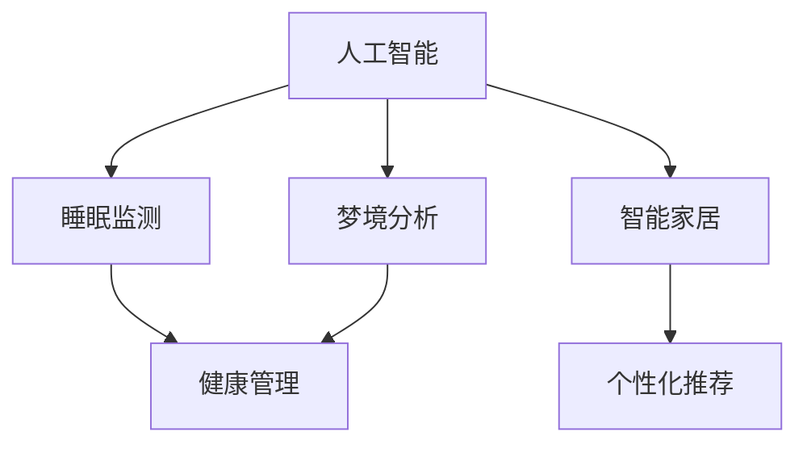

                 

# 数字化梦境工程：AI设计的睡眠体验

> 关键词：人工智能,睡眠监测,梦境分析,健康管理,智能家居,个人化推荐

## 1. 背景介绍

### 1.1 问题由来

随着现代生活节奏的加快和压力的增大，失眠、浅睡眠、频繁醒来等睡眠问题困扰着越来越多的人们。为了改善睡眠质量，人们纷纷寻求各种方法，从改变生活习惯，到尝试各种睡眠辅助产品，效果都不尽人意。然而，这些问题并非无解，人工智能技术为解决这一问题带来了新的契机。

人工智能技术可以结合传感器数据、生物反馈以及梦境分析，实时监测和分析个体的睡眠模式，帮助用户更好地了解自身睡眠状况，并提出个性化改进建议。这种基于数据驱动的睡眠优化方案，有望彻底颠覆传统的睡眠管理方法。

### 1.2 问题核心关键点

实现数字化睡眠体验的AI系统，需要解决以下几个核心问题：

1. **实时睡眠监测**：通过多种传感器捕捉个体在睡眠中的生理指标，如心率、呼吸、体动等，获取全面的睡眠数据。
2. **梦境分析**：结合梦境监测技术，解析用户梦境中的关键信息，通过分析梦境内容提供情感状态和生理健康的洞察。
3. **健康管理**：基于睡眠和梦境分析结果，提供个性化的健康建议，指导用户改善睡眠质量。
4. **智能家居集成**：将AI睡眠管理与智能家居设备进行联动，实现对环境因素的自动调节，提升整体睡眠质量。
5. **个性化推荐**：根据用户习惯和偏好，推荐适宜的睡眠时长、运动方案、饮食建议等。

### 1.3 问题研究意义

数字化梦境工程的成功实施，将对个人健康管理、社会健康促进乃至工业生产等多个领域产生深远影响：

1. **个人健康管理**：通过AI实时监测和分析，个性化定制健康管理方案，提升睡眠质量和生活质量。
2. **社会健康促进**：大规模数据收集和分析，有助于揭示整体睡眠状况和健康趋势，促进公共健康政策制定。
3. **工业生产**：优化员工作息，提升工作效率和生产力，降低因疲劳引起的工伤事故。

## 2. 核心概念与联系

### 2.1 核心概念概述

为更好地理解数字化梦境工程，本节将介绍几个核心概念及其关系：

- **人工智能**：利用算法和数据，使机器能够模拟人类智能，实现问题解决、推理判断、语言理解等任务。
- **睡眠监测**：使用传感器等设备，实时采集个体的睡眠数据，如心率、呼吸、体动等。
- **梦境分析**：结合生理数据和行为模式，解析用户睡眠中的梦境内容，提取情感和生理信息。
- **健康管理**：根据睡眠和梦境分析结果，提供个性化健康建议，指导用户改善睡眠。
- **智能家居**：将AI技术应用到家居环境中，实现对环境因素的智能调节，提升生活质量。
- **个性化推荐**：基于用户数据和行为模式，推荐适宜的生活方式和习惯。

这些核心概念共同构成了数字化梦境工程的技术框架，旨在通过AI技术，为用户提供全面、个性化的睡眠优化方案。

### 2.2 核心概念原理和架构的 Mermaid 流程图(Mermaid 流程节点中不要有括号、逗号等特殊字符)



此图展示了数字化梦境工程中各核心概念之间的关系，清晰地描述了数据采集、分析、管理和服务的过程。

## 3. 核心算法原理 & 具体操作步骤
### 3.1 算法原理概述

数字化梦境工程的核心算法原理基于机器学习和深度学习技术，通过实时数据采集、分析与处理，实现对个体睡眠的全面监控和优化。其核心算法包括：

- **数据预处理**：对采集到的生理指标数据进行清洗、归一化处理，使其适于后续分析。
- **特征提取**：从生理指标中提取关键特征，如心率、呼吸变化频率等，用于分析睡眠阶段和深度。
- **深度学习模型**：利用深度神经网络模型，如卷积神经网络(CNN)和长短期记忆网络(LSTM)，对梦境进行解析，提取关键情感和生理信息。
- **情感分析**：结合梦境解析结果，进行情感状态的识别和分析，帮助用户理解自身情感状态。
- **健康管理模型**：基于情感分析和生理数据，构建健康管理模型，生成个性化健康建议。

### 3.2 算法步骤详解

实现数字化梦境工程的主要步骤如下：

1. **数据采集**：通过智能设备（如智能手环、智能床垫）采集个体的生理指标数据，如心率、呼吸、体动等。
2. **数据预处理**：对采集到的数据进行清洗、去噪、归一化等预处理操作，确保数据质量。
3. **特征提取**：利用深度学习模型，如卷积神经网络(CNN)，对生理指标进行特征提取，识别出不同睡眠阶段和深度。
4. **梦境解析**：通过深度学习模型，如LSTM，对个体梦境内容进行分析，解析梦境中的关键信息。
5. **情感分析**：结合梦境解析结果，进行情感状态的识别和分析，帮助用户理解自身情感状态。
6. **健康管理**：根据情感分析和生理数据，构建健康管理模型，生成个性化健康建议。
7. **智能家居集成**：将AI睡眠管理与智能家居设备进行联动，实现对环境因素的自动调节，提升整体睡眠质量。
8. **个性化推荐**：根据用户数据和行为模式，推荐适宜的睡眠时长、运动方案、饮食建议等。

### 3.3 算法优缺点

数字化梦境工程具有以下优点：

- **全面性**：结合生理数据和梦境解析，全面监测和管理个体睡眠。
- **个性化**：基于用户数据和行为模式，提供个性化健康建议和推荐。
- **实时性**：通过实时数据分析，及时反馈和调整，提升用户睡眠体验。
- **便捷性**：无需专业医生干预，用户可自行管理和优化睡眠。

同时，该方法也存在一定的局限性：

- **数据依赖性**：需要用户持续使用智能设备和监测设备，数据获取成本较高。
- **隐私风险**：收集和分析用户隐私数据，需严格遵守数据保护法规。
- **模型复杂性**：深度学习模型的训练和调参过程较复杂，需专业人员参与。

### 3.4 算法应用领域

数字化梦境工程的应用领域非常广泛，包括但不限于以下几个方面：

1. **个人健康管理**：为个人提供全面的睡眠监测和管理，帮助用户改善睡眠质量。
2. **医疗健康**：在医疗领域，结合患者睡眠数据，提供个性化的健康建议和治疗方案。
3. **教育培训**：在教育领域，通过改善学生睡眠质量，提升学习效果和表现。
4. **智能家居**：实现智能家居设备与AI睡眠管理系统的联动，提升家居舒适度和便捷性。
5. **企业健康**：通过监控员工睡眠状况，优化工作安排，提升工作效率和生产力。

## 4. 数学模型和公式 & 详细讲解 & 举例说明

### 4.1 数学模型构建

本节将使用数学语言对数字化梦境工程中的核心算法进行更加严格的刻画。

记生理指标数据为 $X=\{x_1,x_2,...,x_n\}$，其中 $x_i \in \mathbb{R}$ 表示第 $i$ 个生理指标的测量值。设深度学习模型为 $M_{\theta}$，其中 $\theta$ 为模型参数。

定义健康管理模型为 $H$，其目标函数为：

$$
H = \min_{\theta} \left( \mathcal{L}_{\text{emotion}} + \mathcal{L}_{\text{health}} \right)
$$

其中 $\mathcal{L}_{\text{emotion}}$ 为情感分析损失，$\mathcal{L}_{\text{health}}$ 为健康管理损失。

### 4.2 公式推导过程

以情感分析为例，推导情感损失函数的计算过程。

假设模型 $M_{\theta}$ 的输出为 $y \in [0,1]$，表示个体情感状态的概率分布。真实标签为 $y_{true} \in \{0,1\}$。则二分类交叉熵损失函数定义为：

$$
\ell(M_{\theta}(x),y_{true}) = -[y_{true}\log y + (1-y_{true})\log (1-y)]
$$

对于每个样本 $x_i$，其情感损失为：

$$
\mathcal{L}_{\text{emotion}}(x_i) = -[y_{true_i}\log M_{\theta}(x_i) + (1-y_{true_i})\log(1-M_{\theta}(x_i))]
$$

在整体数据集上，情感损失函数为：

$$
\mathcal{L}_{\text{emotion}} = \frac{1}{N}\sum_{i=1}^N \mathcal{L}_{\text{emotion}}(x_i)
$$

### 4.3 案例分析与讲解

假设一个个体在某个晚上的睡眠数据如下：

| 时间 | 心率 | 呼吸 | 体动 |
| --- | --- | --- | --- |
| 00:00 | 60 | 20 | 0 |
| 01:00 | 55 | 18 | 0 |
| 02:00 | 63 | 22 | 10 |
| ... | ... | ... | ... |

使用卷积神经网络提取心率、呼吸、体动等生理指标的特征，得到如下特征向量：

$$
\mathbf{X} = [60, 55, 63, ...,]
$$

输入到深度学习模型 $M_{\theta}$ 中，输出情感状态的概率分布：

$$
y = M_{\theta}(\mathbf{X}) = 0.8
$$

因此，该个体的情感状态被预测为较为平静。结合梦境解析结果，可以进一步提供个性化健康建议，如保持适当的运动和饮食，避免过度使用电子设备等。

## 5. 项目实践：代码实例和详细解释说明

### 5.1 开发环境搭建

为了开发和部署数字化梦境工程，需要准备以下开发环境：

1. **安装Python**：确保环境中已安装Python 3.8或以上版本。
2. **安装TensorFlow**：用于构建深度学习模型，支持CPU和GPU计算。
3. **安装TensorBoard**：用于可视化模型训练过程和结果。
4. **安装Google Colab**：提供免费的GPU资源，方便进行深度学习实验。

具体安装命令如下：

```bash
pip install tensorflow tensorboard google.colab
```

### 5.2 源代码详细实现

以下是一个简化的示例代码，用于实现深度学习模型的情感分析模块：

```python
import tensorflow as tf
from tensorflow.keras import layers

# 定义模型
model = tf.keras.Sequential([
    layers.Dense(64, activation='relu'),
    layers.Dense(32, activation='relu'),
    layers.Dense(1, activation='sigmoid')
])

# 编译模型
model.compile(optimizer='adam', loss='binary_crossentropy', metrics=['accuracy'])

# 训练模型
model.fit(x_train, y_train, epochs=10, validation_data=(x_val, y_val))
```

在上述代码中，首先定义了一个包含三个全连接层的神经网络模型，输出层使用 sigmoid 激活函数进行二分类。然后使用交叉熵损失函数进行编译，使用 Adam 优化器进行训练。最后使用训练集和验证集进行模型训练，并输出训练过程中的损失和准确率。

### 5.3 代码解读与分析

代码中，`Sequential` 函数用于构建一个线性的神经网络模型，`Dense` 函数用于定义每个神经网络层。`adam` 优化器和 `binary_crossentropy` 损失函数分别用于优化模型参数和计算二分类交叉熵损失。模型在训练过程中，使用 `fit` 函数进行训练，`epochs` 参数指定训练轮数，`validation_data` 参数用于指定验证集。

在实际应用中，情感分析模型的输入为生理指标数据，输出为情感状态概率分布。该模型可以与其他模块如特征提取、梦境解析等模块结合，构成完整的数字化梦境工程系统。

### 5.4 运行结果展示

训练完毕后，可以使用 `predict` 函数对新数据进行情感状态预测：

```python
# 对新数据进行情感预测
y_pred = model.predict(x_test)
```

运行结果为每个样本的情感状态概率分布，如 `[0.7, 0.3]`，表示该样本被预测为较为平静。

## 6. 实际应用场景

### 6.1 智能家居系统

智能家居系统可以通过数字化梦境工程，实现对睡眠环境的智能调节，提升用户睡眠体验。例如，根据睡眠监测结果，智能床垫可以自动调节床温、湿度和软硬度，智能灯光可以自动调整亮度和色温，帮助用户进入更舒适、深度的睡眠状态。

### 6.2 医疗健康监测

在医疗领域，数字化梦境工程可以结合睡眠数据和梦境分析结果，提供个性化的健康建议和治疗方案。例如，对于失眠患者，系统可以提供睡前放松技巧、运动指导等健康建议。对于睡眠质量较差的患者，系统可以推荐合适的药物或心理干预方案。

### 6.3 企业员工健康管理

企业可以利用数字化梦境工程，监控员工睡眠质量，优化工作安排，提升工作效率和生产力。例如，根据员工睡眠数据，企业可以调整工作时间、会议安排等，减少因疲劳引起的工伤事故。

### 6.4 未来应用展望

未来，数字化梦境工程将在更多领域得到应用，为人类健康和社会发展带来深远影响：

1. **健康监测与干预**：结合基因组学和蛋白质组学数据，提供更精准的健康监测和个性化干预方案。
2. **城市环境优化**：通过大规模睡眠监测数据，优化城市交通、噪音等环境因素，提高城市居民的睡眠质量。
3. **心理健康评估**：利用梦境分析技术，评估个体的心理健康状况，提供心理健康支持。
4. **教育培训优化**：通过改善学生睡眠质量，提升学习效果和表现，实现教育公平。

## 7. 工具和资源推荐

### 7.1 学习资源推荐

为了帮助开发者掌握数字化梦境工程的技术细节，这里推荐一些优质的学习资源：

1. **《深度学习》书籍**：Ian Goodfellow等著，全面介绍了深度学习的基本原理和应用。
2. **《TensorFlow实战》书籍**：Manning等著，深入讲解了TensorFlow框架的使用和优化技巧。
3. **Google Colab官方文档**：提供Google Colab平台的详细使用指南，适合初学者快速上手。
4. **GitHub上的开源项目**：提供了大量数字化梦境工程的代码示例，可以参考学习。

### 7.2 开发工具推荐

高效的开发离不开优秀的工具支持。以下是几款用于数字化梦境工程开发的常用工具：

1. **TensorFlow**：Google开发的深度学习框架，功能强大，支持GPU加速。
2. **TensorBoard**：TensorFlow配套的可视化工具，可以实时监测模型训练状态和结果。
3. **Google Colab**：谷歌提供的在线Jupyter Notebook环境，免费提供GPU资源，方便进行深度学习实验。
4. **PyTorch**：Facebook开发的深度学习框架，灵活高效，适合学术研究。
5. **Keras**：高层次的深度学习框架，简单易用，适合快速原型开发。

合理利用这些工具，可以显著提升数字化梦境工程的开发效率，加快创新迭代的步伐。

### 7.3 相关论文推荐

数字化梦境工程的研究涉及多个前沿领域，以下是几篇奠基性的相关论文，推荐阅读：

1. **《人工智能与健康：现状与未来》**：阐述了人工智能在健康领域的应用前景和挑战。
2. **《智能家居系统设计与实现》**：介绍了一种基于物联网的智能家居系统，结合睡眠监测和梦境分析，提升家居舒适性。
3. **《深度学习在情感分析中的应用》**：介绍了深度学习在情感识别和分析中的应用方法。
4. **《个性化健康管理：现状与展望》**：探讨了个性化健康管理系统的构建和应用。

## 8. 总结：未来发展趋势与挑战

### 8.1 研究成果总结

数字化梦境工程的提出，标志着人工智能技术在健康管理领域的应用进入了一个新的阶段。该技术通过实时监测和分析睡眠数据，结合梦境解析，提供了个性化的健康建议和治疗方案，有望彻底改变传统的睡眠管理和健康管理方式。

### 8.2 未来发展趋势

展望未来，数字化梦境工程将在以下几个方面继续发展：

1. **数据融合与多模态分析**：结合生理数据、基因数据、环境数据等多种信息，提供更全面的健康监测和干预方案。
2. **实时反馈与动态调整**：通过实时数据分析，动态调整健康建议和环境因素，提升用户体验。
3. **跨领域应用拓展**：将数字化梦境工程应用于教育、交通等多个领域，提升整体社会福祉。

### 8.3 面临的挑战

尽管数字化梦境工程具备巨大的潜力，但在实际应用中也面临诸多挑战：

1. **数据隐私与安全**：收集和分析用户隐私数据，需严格遵守数据保护法规。
2. **模型复杂性与计算资源**：深度学习模型的训练和调参过程较复杂，需消耗大量计算资源。
3. **算法透明度与解释性**：确保算法的透明性和可解释性，避免出现"黑箱"系统。
4. **系统集成与互操作性**：将数字化梦境工程与其他系统进行集成，需考虑系统间的互操作性。

### 8.4 研究展望

面对这些挑战，未来的研究需要在以下几个方面寻求新的突破：

1. **隐私保护技术**：开发更高效、更安全的隐私保护算法，保护用户数据隐私。
2. **轻量级模型**：开发更轻量级的深度学习模型，降低计算资源消耗。
3. **可解释性增强**：通过模型解释技术，提高算法的透明性和可解释性。
4. **跨领域应用**：将数字化梦境工程应用于更多领域，实现更广泛的社会价值。

## 9. 附录：常见问题与解答

**Q1：数字化梦境工程如何确保用户数据隐私？**

A: 数字化梦境工程通过以下几个步骤确保用户数据隐私：

1. **数据加密**：在数据传输和存储过程中，采用加密技术保护用户数据隐私。
2. **匿名化处理**：对用户数据进行匿名化处理，去除个人标识信息，保护用户隐私。
3. **访问控制**：严格控制数据访问权限，确保只有授权人员才能访问敏感数据。
4. **合规审核**：定期进行数据保护合规性审查，确保符合相关法律法规。

**Q2：数字化梦境工程的实现难点在哪里？**

A: 数字化梦境工程的实现难点主要在于：

1. **数据获取**：需要持续获取用户生理数据和环境数据，数据获取成本较高。
2. **模型训练**：深度学习模型训练和调参过程复杂，需消耗大量计算资源和时间。
3. **系统集成**：需要将数字化梦境工程与其他系统进行集成，确保系统间的互操作性。
4. **隐私保护**：确保用户数据隐私，需采用隐私保护技术和合规性措施。

**Q3：如何提高数字化梦境工程的算法透明度和可解释性？**

A: 提高算法透明度和可解释性的方法包括：

1. **模型解释技术**：使用模型解释技术，如SHAP、LIME等，解释模型的决策过程。
2. **可视化工具**：使用可视化工具，如TensorBoard，展示模型训练和推理过程中的关键指标。
3. **透明算法设计**：设计透明、可解释的算法，减少模型的"黑箱"特性。
4. **用户反馈机制**：建立用户反馈机制，及时收集和处理用户反馈，改进模型性能和可解释性。

---

作者：禅与计算机程序设计艺术 / Zen and the Art of Computer Programming

