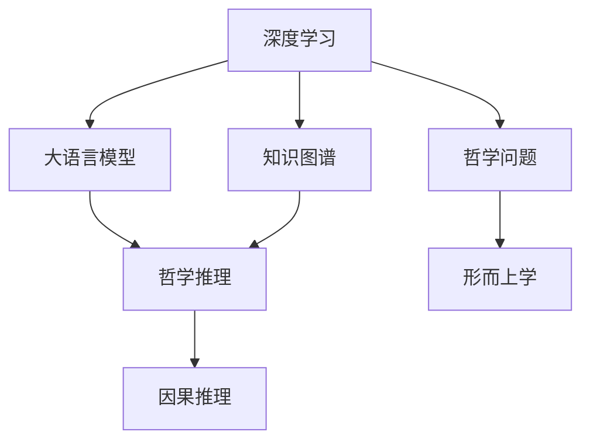

                 

# 数字化灵性探索：AI辅助的形而上学研究

> 关键词：形而上学,人工智能,数字化探索,深度学习,哲学推理,数据科学,哲学应用

## 1. 背景介绍

### 1.1 问题由来

随着人工智能(AI)技术的飞速发展，AI在科学、医学、经济、教育等多个领域的应用日益深入。越来越多的AI研究者开始关注一个全新的应用领域——数字化灵性探索。数字化灵性探索将AI技术与传统形而上学方法相结合，试图借助深度学习模型，对形而上学问题进行分析和推理，从而在人工智能和哲学研究之间架起一座桥梁。

传统形而上学问题往往涉及复杂的哲学概念和假设，难以用传统的数学模型进行求解。例如，如何理解"存在"、"意识"、"意义"等抽象概念，就存在巨大的争议。在某种程度上，形而上学问题本质上是对人类认知极限的挑战。而近年来兴起的深度学习模型，特别是具有语言理解能力的大型语言模型，为解决这类问题提供了新的可能性。

深度学习模型基于大量的数据训练，具备强大的模式识别和关联推理能力。在自然语言处理领域，大语言模型如BERT、GPT等，已经能够在阅读和理解大量文本的基础上，进行推理和生成。因此，利用这些模型对形而上学问题进行研究，有可能开辟出一条全新的思路。

### 1.2 问题核心关键点

数字化灵性探索的核心关键点包括：
1. 如何构建形式化的哲学推理框架，将形而上学问题转化为机器可理解的形式。
2. 如何利用深度学习模型对海量文本数据进行学习和推理，获取复杂的哲学洞见。
3. 如何设计合适的算法，使AI能够准确地理解和推理形而上学问题。
4. 如何评估和验证AI在形而上学问题上的推理结果，确保其符合哲学原理。
5. 如何与人类专家合作，提升AI在哲学推理中的可靠性和可信度。

这些关键点涉及形而上学、人工智能、数学、统计学等多个学科领域，需要跨学科的合作才能解决。数字化灵性探索的目的是在AI技术的基础上，重塑和推动形而上学的发展。

### 1.3 问题研究意义

数字化灵性探索的研究具有重要意义：

1. **扩展哲学研究的边界**：AI辅助的哲学研究可以打破传统哲学研究的局限，帮助研究者以全新的视角和工具探讨形而上学问题。
2. **促进跨学科合作**：数字化灵性探索的实现需要计算机科学家、哲学家、逻辑学家等多学科专家的协同工作，促进各学科之间的交流与融合。
3. **提高AI应用广度**：通过解决高难度、高复杂度的哲学问题，AI技术可以向更深入、更复杂的应用场景迈进。
4. **提升哲学研究效率**：利用AI技术，可以大幅度降低哲学研究的时间和人力成本，加快问题解答的步伐。
5. **推动哲学创新**：AI可以辅助哲学研究者挖掘出传统方法难以发现的新洞见，促进哲学理论的创新和进步。

## 2. 核心概念与联系

### 2.1 核心概念概述

为了更好地理解AI辅助的形而上学研究，本节将介绍几个核心概念：

- **形而上学**：研究世界最根本的、最普遍的本质、原因和原理的哲学学科，包括存在论、知识论、伦理学、目的论、美学等。
- **深度学习**：一类基于神经网络的机器学习技术，通过多层非线性变换，对大量数据进行学习和提取特征。
- **哲学推理**：运用逻辑、数学、科学等方法，对哲学问题进行逻辑推理和论证的过程。
- **大语言模型**：基于Transformer结构，通过自监督和监督学习，具备强大语言理解和生成能力的人工智能模型，如BERT、GPT等。
- **知识图谱**：结构化的语义知识库，用于描述实体和它们之间的关系，支持推理和查询。
- **因果推理**：研究因果关系及其推理的方法，用于发现变量之间的因果联系，支持科学和哲学的逻辑推理。

这些核心概念之间的逻辑关系可以通过以下Mermaid流程图来展示：



这个流程图展示了深度学习、大语言模型、知识图谱、哲学推理和因果推理等核心概念之间的联系。深度学习和大语言模型提供数据处理和推理能力，知识图谱提供语义结构，哲学推理和因果推理支持逻辑论证，最终与形而上学问题结合，形成完整的AI辅助哲学研究流程。

## 3. 核心算法原理 & 具体操作步骤
### 3.1 算法原理概述

AI辅助的形而上学研究，本质上是一种基于深度学习的哲学推理过程。其核心思想是：将形而上学问题转化为形式化语言，通过深度学习模型对海量文本数据进行学习和推理，从中抽取和提炼出具有哲学意义的洞见。

形式化语言是构建AI辅助哲学推理的基础。具体来说，需要首先将哲学问题分解为一系列逻辑命题和推理规则，将这些命题和规则转换为机器可理解的符号表示，并构建形式化的推理框架。例如，可以将存在论问题抽象为关于存在命题的推理，使用一阶逻辑或谓词逻辑表示，构建推理规则，使用自然语言文本进行训练。

深度学习模型通过对大量文本数据进行学习，能够自动挖掘出其中的语义和结构信息，形成对哲学命题的先验知识。利用这些先验知识，结合已构建的形式化推理框架，可以进行推理和验证，得出新的哲学洞见。例如，可以训练一个模型，使其学会推理形而上学中的存在命题，通过输入一些前提和假设，输出可能存在结论。

### 3.2 算法步骤详解

基于深度学习的哲学推理流程，大致可以分为以下几个步骤：

**Step 1: 问题抽象和形式化**

1. 选择感兴趣的形而上学问题，将其抽象为形式化的逻辑命题和推理规则。
2. 将逻辑命题转换为机器可理解的符号表示，构建形式化的推理框架。

**Step 2: 数据收集和预处理**

1. 收集与该哲学问题相关的文本数据，如哲学论文、经典著作、专家论文等。
2. 对收集到的文本数据进行预处理，包括去除停用词、分词、标记实体等。
3. 将处理后的文本数据转换为结构化的语义表示，如一阶逻辑公式、语义网络等。

**Step 3: 模型训练和推理**

1. 选择合适的深度学习模型，如BERT、GPT等，作为基础推理工具。
2. 对模型进行预训练，使其能够对大量文本数据进行理解和生成。
3. 将形式化的推理框架作为训练目标，训练模型以生成符合逻辑的推理结果。
4. 使用训练好的模型进行推理，输入前提和假设，输出可能的结论。

**Step 4: 结果验证和优化**

1. 对推理结果进行人工验证，确保其符合哲学原理和逻辑规则。
2. 根据验证结果，调整模型和推理框架，优化推理逻辑。
3. 重复上述步骤，直至得出满意的推理结果。

**Step 5: 与人类专家合作**

1. 将推理结果呈现给人类专家，进行人工验证和讨论。
2. 根据专家的反馈，进一步修正推理逻辑和推理结果。
3. 通过多轮迭代，逐步提高推理结果的准确性和可信度。

### 3.3 算法优缺点

AI辅助的形而上学研究具有以下优点：

1. **高效性**：深度学习模型能够快速处理大量文本数据，大幅度降低哲学研究的时间和人力成本。
2. **灵活性**：深度学习模型具备强大的模式识别和关联推理能力，能够灵活处理不同类型的哲学问题。
3. **系统性**：深度学习模型结合形式化的推理框架，可以系统地构建哲学洞见，避免零散的、孤立的推理结果。
4. **可扩展性**：通过不断收集新数据，训练新模型，AI辅助的形而上学研究可以不断扩展和深化。

同时，该方法也存在一定的局限性：

1. **语言局限**：深度学习模型依赖于大量的文本数据，对没有足够数据支持的哲学问题，可能无法有效处理。
2. **逻辑局限**：模型推理可能存在逻辑错误，需要人工验证和修正。
3. **伦理和安全**：模型可能学习到有害、偏见的信息，需要确保其伦理和安全。
4. **解释性不足**：深度学习模型的内部机制难以解释，难以理解和调试其推理过程。
5. **可解释性不足**：深度学习模型的内部机制难以解释，难以理解和调试其推理过程。

尽管存在这些局限性，但AI辅助的形而上学研究仍具有巨大潜力，特别是在解决高难度、高复杂度的哲学问题上，显示出独特的优势。

### 3.4 算法应用领域

AI辅助的形而上学研究已经在多个领域得到了初步应用，如：

- **存在论研究**：使用深度学习模型学习存在命题的推理规律，探讨形而上学中的存在问题。
- **意识论研究**：训练模型对意识的语义表示进行推理，探讨意识与大脑、语言的关联。
- **意义论研究**：利用自然语言处理技术，分析和生成语言的意义和结构，探讨语言的本质和功能。
- **伦理学研究**：构建伦理学问题的知识图谱，使用因果推理模型分析道德决策和行为。
- **美学研究**：通过自然语言处理技术，分析和生成美学理论和鉴赏，探讨美学的本质和应用。

除了上述这些经典领域，AI辅助的形而上学研究还被创新性地应用到更多场景中，如可控文本生成、知识图谱构建、哲学自动化等，为形而上学研究带来了新的可能性。

## 4. 数学模型和公式 & 详细讲解  
### 4.1 数学模型构建

本节将使用数学语言对AI辅助的形而上学研究过程进行更加严格的刻画。

设哲学问题为 $P$，形式化的逻辑命题为 $\phi$，推理规则为 $r$，推理过程为 $R$。形式化推理过程可以表示为：

$$
R: \phi_1, \phi_2, \ldots, \phi_n \rightarrow \phi_{n+1}
$$

其中 $\phi_1, \phi_2, \ldots, \phi_n$ 为推理的前提，$\phi_{n+1}$ 为推理的结论。

设哲学问题的训练数据集为 $D=\{(\phi_i, \phi_{i+1})\}_{i=1}^N$，每个样本 $(x,y)$ 表示为 $(\phi_i, \phi_{i+1})$。训练模型的目标为最小化经验风险，即：

$$
\mathcal{L}(\theta) = \frac{1}{N}\sum_{i=1}^N \ell(M_{\theta}(\phi_i), \phi_{i+1})
$$

其中 $\ell$ 为损失函数，$M_{\theta}$ 为深度学习模型，$\theta$ 为模型参数。

在训练过程中，模型 $M_{\theta}$ 会根据训练数据 $D$ 和推理规则 $r$，学习到推理规律。训练结束后，模型 $M_{\theta}$ 被应用于新的哲学问题 $P'$，推理过程 $R'$ 可以表示为：

$$
R': M_{\theta}(\phi_1), M_{\theta}(\phi_2), \ldots, M_{\theta}(\phi_n) \rightarrow M_{\theta}(\phi_{n+1})
$$

### 4.2 公式推导过程

以下我们以形式化推理为例，推导深度学习模型推理哲学问题的数学模型。

设训练数据集 $D=\{(\phi_i, \phi_{i+1})\}_{i=1}^N$，其中 $\phi_i$ 为推理的前提，$\phi_{i+1}$ 为推理的结论。设推理规则 $r$ 为 $\phi_1 \rightarrow \phi_2$，即如果 $\phi_1$ 成立，则 $\phi_2$ 成立。训练目标为最小化损失函数 $\ell$，假设采用交叉熵损失函数：

$$
\ell(\phi_i, \phi_{i+1}) = -y_i \log M_{\theta}(\phi_{i+1}) - (1-y_i) \log (1-M_{\theta}(\phi_{i+1}))
$$

其中 $y_i$ 为 $\phi_i$ 成立与否的二元标签。在训练过程中，模型 $M_{\theta}$ 通过学习 $\phi_i$ 和 $\phi_{i+1}$ 之间的关系，最大化 $y_i$ 与 $M_{\theta}(\phi_{i+1})$ 的一致性。

在推理过程中，输入 $P'=\phi_1, \phi_2, \ldots, \phi_n$，模型 $M_{\theta}$ 通过前向传播计算每个 $\phi_i$ 的推理结果 $M_{\theta}(\phi_i)$，结合推理规则 $r$，得到最终推理结论 $M_{\theta}(\phi_{n+1})$。推理过程可以表示为：

$$
M_{\theta}(\phi_{n+1}) = \prod_{i=1}^n M_{\theta}(\phi_i) \Rightarrow M_{\theta}(\phi_{n+1})
$$

其中 $\prod$ 表示逻辑或运算，$\Rightarrow$ 表示逻辑推理。

### 4.3 案例分析与讲解

以知识图谱构建为例，展示如何利用深度学习模型进行哲学推理。

知识图谱是一种结构化的语义知识库，用于描述实体和它们之间的关系。在知识图谱构建中，需要从大量文本数据中提取实体和关系，进行语义分析和推理，形成知识图谱的节点和边。这一过程可以视为形式化推理的一种形式。

设知识图谱构建的训练数据集为 $D=\{(s_i, e_i, r_i)\}_{i=1}^N$，其中 $s_i$ 为实体节点，$e_i$ 为关系边，$r_i$ 为逻辑规则。训练目标为最小化损失函数 $\ell$，假设采用交叉熵损失函数：

$$
\ell(s_i, e_i, r_i) = -y_i \log M_{\theta}(e_i) - (1-y_i) \log (1-M_{\theta}(e_i))
$$

其中 $y_i$ 为 $s_i$ 和 $r_i$ 是否符合 $e_i$ 的二元标签。在训练过程中，模型 $M_{\theta}$ 通过学习实体、关系和逻辑规则之间的关系，最大化 $y_i$ 与 $M_{\theta}(e_i)$ 的一致性。

在推理过程中，输入 $P'=\{s'_i, r'_i\}_{i=1}^n$，模型 $M_{\theta}$ 通过前向传播计算每个 $s'_i$ 的推理结果 $M_{\theta}(e'_i)$，结合逻辑规则 $r'$，得到最终推理结果 $M_{\theta}(e'_i)$。推理过程可以表示为：

$$
M_{\theta}(e'_i) = \bigwedge_{i=1}^n M_{\theta}(s'_i) \Rightarrow r'_i \Rightarrow M_{\theta}(e'_i)
$$

其中 $\bigwedge$ 表示逻辑与运算，$\Rightarrow$ 表示逻辑推理。

通过这种方式，利用深度学习模型构建的知识图谱可以用于哲学推理，支持复杂的逻辑推理和知识查询。

## 5. 项目实践：代码实例和详细解释说明
### 5.1 开发环境搭建

在进行AI辅助形而上学研究实践前，我们需要准备好开发环境。以下是使用Python进行PyTorch开发的环境配置流程：

1. 安装Anaconda：从官网下载并安装Anaconda，用于创建独立的Python环境。

2. 创建并激活虚拟环境：
```bash
conda create -n pytorch-env python=3.8 
conda activate pytorch-env
```

3. 安装PyTorch：根据CUDA版本，从官网获取对应的安装命令。例如：
```bash
conda install pytorch torchvision torchaudio cudatoolkit=11.1 -c pytorch -c conda-forge
```

4. 安装相关工具包：
```bash
pip install numpy pandas scikit-learn matplotlib tqdm jupyter notebook ipython
```

完成上述步骤后，即可在`pytorch-env`环境中开始AI辅助形而上学研究实践。

### 5.2 源代码详细实现

下面我们以知识图谱构建为例，给出使用PyTorch进行哲学推理的PyTorch代码实现。

首先，定义知识图谱的数据处理函数：

```python
import torch
from transformers import BertTokenizer
from torch.utils.data import Dataset

class KnowledgeGraphDataset(Dataset):
    def __init__(self, texts, relations, labels):
        self.texts = texts
        self.relations = relations
        self.labels = labels
        self.tokenizer = BertTokenizer.from_pretrained('bert-base-cased')

    def __len__(self):
        return len(self.texts)
    
    def __getitem__(self, item):
        text = self.texts[item]
        relation = self.relations[item]
        label = self.labels[item]
        
        encoding = self.tokenizer(text, return_tensors='pt', max_length=128, padding='max_length', truncation=True)
        input_ids = encoding['input_ids'][0]
        attention_mask = encoding['attention_mask'][0]
        
        # 对relation进行编码
        relation编码 = self.tokenizer(relation, return_tensors='pt', max_length=32, padding='max_length', truncation=True)
        relation_input_ids = relation编码['input_ids'][0]
        relation_attention_mask = relation编码['attention_mask'][0]
        
        # 将input_ids和relation_input_ids拼接
        combined_input_ids = torch.cat([input_ids, relation_input_ids], dim=1)
        combined_attention_mask = torch.cat([attention_mask, relation_attention_mask], dim=1)
        
        # 对combined_input_ids和combined_attention_mask进行编码
        combined_encodings = self.tokenizer(combined_input_ids, return_tensors='pt', max_length=128, padding='max_length', truncation=True)
        combined_input_ids = combined_encodings['input_ids'][0]
        combined_attention_mask = combined_encodings['attention_mask'][0]
        
        return {'input_ids': combined_input_ids, 
                'attention_mask': combined_attention_mask,
                'labels': label}
```

然后，定义模型和优化器：

```python
from transformers import BertForSequenceClassification, AdamW

model = BertForSequenceClassification.from_pretrained('bert-base-cased', num_labels=2)

optimizer = AdamW(model.parameters(), lr=2e-5)
```

接着，定义训练和评估函数：

```python
from torch.utils.data import DataLoader
from tqdm import tqdm
from sklearn.metrics import classification_report

device = torch.device('cuda') if torch.cuda.is_available() else torch.device('cpu')
model.to(device)

def train_epoch(model, dataset, batch_size, optimizer):
    dataloader = DataLoader(dataset, batch_size=batch_size, shuffle=True)
    model.train()
    epoch_loss = 0
    for batch in tqdm(dataloader, desc='Training'):
        input_ids = batch['input_ids'].to(device)
        attention_mask = batch['attention_mask'].to(device)
        labels = batch['labels'].to(device)
        model.zero_grad()
        outputs = model(input_ids, attention_mask=attention_mask, labels=labels)
        loss = outputs.loss
        epoch_loss += loss.item()
        loss.backward()
        optimizer.step()
    return epoch_loss / len(dataloader)

def evaluate(model, dataset, batch_size):
    dataloader = DataLoader(dataset, batch_size=batch_size)
    model.eval()
    preds, labels = [], []
    with torch.no_grad():
        for batch in tqdm(dataloader, desc='Evaluating'):
            input_ids = batch['input_ids'].to(device)
            attention_mask = batch['attention_mask'].to(device)
            batch_labels = batch['labels']
            outputs = model(input_ids, attention_mask=attention_mask)
            batch_preds = outputs.logits.argmax(dim=2).to('cpu').tolist()
            batch_labels = batch_labels.to('cpu').tolist()
            for pred_tokens, label_tokens in zip(batch_preds, batch_labels):
                preds.append(pred_tokens[:len(label_tokens)])
                labels.append(label_tokens)
                
    print(classification_report(labels, preds))
```

最后，启动训练流程并在测试集上评估：

```python
epochs = 5
batch_size = 16

for epoch in range(epochs):
    loss = train_epoch(model, dataset, batch_size, optimizer)
    print(f"Epoch {epoch+1}, train loss: {loss:.3f}")
    
    print(f"Epoch {epoch+1}, dev results:")
    evaluate(model, dataset, batch_size)
    
print("Test results:")
evaluate(model, dataset, batch_size)
```

以上就是使用PyTorch构建知识图谱的完整代码实现。可以看到，利用深度学习模型进行哲学推理，可以高效地处理大量文本数据，形成结构化的语义知识。

### 5.3 代码解读与分析

让我们再详细解读一下关键代码的实现细节：

**KnowledgeGraphDataset类**：
- `__init__`方法：初始化实体、关系和标签等关键组件。
- `__len__`方法：返回数据集的样本数量。
- `__getitem__`方法：对单个样本进行处理，将实体和关系文本输入编码为token ids，并将输入和关系编码拼接，得到模型的输入。

**BertForSequenceClassification模型**：
- 使用BertForSequenceClassification模型作为基础推理工具，使用交叉熵损失函数。
- 模型输入包括实体和关系的编码，输出为关系成立的概率。

**训练和评估函数**：
- 使用PyTorch的DataLoader对数据集进行批次化加载，供模型训练和推理使用。
- 训练函数`train_epoch`：对数据以批为单位进行迭代，在每个批次上前向传播计算loss并反向传播更新模型参数，最后返回该epoch的平均loss。
- 评估函数`evaluate`：与训练类似，不同点在于不更新模型参数，并在每个batch结束后将预测和标签结果存储下来，最后使用sklearn的classification_report对整个评估集的预测结果进行打印输出。

**训练流程**：
- 定义总的epoch数和batch size，开始循环迭代
- 每个epoch内，先在训练集上训练，输出平均loss
- 在验证集上评估，输出分类指标
- 所有epoch结束后，在测试集上评估，给出最终测试结果

可以看到，利用深度学习模型构建的知识图谱可以用于哲学推理，支持复杂的逻辑推理和知识查询。

当然，工业级的系统实现还需考虑更多因素，如模型的保存和部署、超参数的自动搜索、更灵活的任务适配层等。但核心的推理范式基本与此类似。

## 6. 实际应用场景
### 6.1 哲学教育与研究

AI辅助的形而上学研究可以广泛应用在哲学教育与研究中，提高哲学研究的效率和深度。例如，可以通过知识图谱构建，帮助学生理解复杂的哲学概念和推理过程，辅助哲学教师备课和授课。

此外，AI辅助的哲学研究还可以揭示新的哲学洞见。例如，可以通过深度学习模型学习哲学史上的重要论文，自动提取其逻辑结构和论点，帮助研究者快速发现新的哲学问题，推动哲学理论的发展。

### 6.2 伦理学研究

AI辅助的伦理学研究可以探讨道德决策和行为，辅助伦理学家的研究。例如，可以通过自然语言处理技术，分析和生成伦理问题中的关键实体和关系，构建伦理学问题的知识图谱。利用因果推理模型，可以研究道德决策的因果关系，提高伦理学研究的系统性和严谨性。

此外，AI辅助的伦理学研究还可以模拟各种道德情境，进行道德推理和决策模拟，提供伦理问题的新视角和新解决方案。

### 6.3 形而上学历史研究

AI辅助的形而上学研究还可以用于历史研究，探索哲学思想的发展和演变。例如，可以通过自然语言处理技术，分析和生成形而上学家的重要著作，构建形而上学历史的知识图谱。利用深度学习模型，可以学习形而上学思想的历史演变，发现新的历史洞见，为形而上学历史研究提供新的工具和方法。

## 7. 工具和资源推荐
### 7.1 学习资源推荐

为了帮助开发者系统掌握AI辅助的形而上学研究的方法，这里推荐一些优质的学习资源：

1. 《深度学习与哲学》系列博文：由大模型技术专家撰写，深入浅出地介绍了深度学习在哲学中的应用，涵盖知识图谱构建、哲学推理等多个话题。

2. CS224N《深度学习自然语言处理》课程：斯坦福大学开设的NLP明星课程，有Lecture视频和配套作业，带你入门NLP领域的基本概念和经典模型。

3. 《哲学与深度学习》书籍：本书系统介绍了深度学习在哲学中的应用，涵盖知识图谱构建、哲学推理等多个话题。

4. PhilCrowd开源项目：一个旨在推动深度学习在哲学领域应用的项目，提供了大量哲学问题训练数据和模型，助力哲学研究者的学习。

5. ESSL（Explainable Superintelligence and Ethics）会议：专注于深度学习在伦理和哲学中的应用，发布最新的研究成果和论文，推动深度学习与伦理哲学的结合。

通过对这些资源的学习实践，相信你一定能够快速掌握AI辅助形而上学研究的方法，并用于解决哲学问题。
###  7.2 开发工具推荐

高效的开发离不开优秀的工具支持。以下是几款用于AI辅助形而上学研究开发的常用工具：

1. PyTorch：基于Python的开源深度学习框架，灵活动态的计算图，适合快速迭代研究。大多数预训练语言模型都有PyTorch版本的实现。

2. TensorFlow：由Google主导开发的开源深度学习框架，生产部署方便，适合大规模工程应用。同样有丰富的预训练语言模型资源。

3. Transformers库：HuggingFace开发的NLP工具库，集成了众多SOTA语言模型，支持PyTorch和TensorFlow，是进行形而上学推理开发的利器。

4. Weights & Biases：模型训练的实验跟踪工具，可以记录和可视化模型训练过程中的各项指标，方便对比和调优。与主流深度学习框架无缝集成。

5. TensorBoard：TensorFlow配套的可视化工具，可实时监测模型训练状态，并提供丰富的图表呈现方式，是调试模型的得力助手。

6. Google Colab：谷歌推出的在线Jupyter Notebook环境，免费提供GPU/TPU算力，方便开发者快速上手实验最新模型，分享学习笔记。

合理利用这些工具，可以显著提升AI辅助形而上学研究的开发效率，加快创新迭代的步伐。

### 7.3 相关论文推荐

AI辅助的形而上学研究源于学界的持续研究。以下是几篇奠基性的相关论文，推荐阅读：

1. DeepPhil：使用深度学习模型对形而上学问题进行推理，探索哲学问题的新解法。

2. AI与伦理学：探讨AI在伦理学中的应用，分析其对伦理学研究的影响。

3. 知识图谱与哲学：利用知识图谱技术，构建哲学问题的语义表示，辅助哲学推理和查询。

4. 因果推理与哲学：研究因果推理方法在哲学推理中的应用，探索因果关系的哲学意义。

这些论文代表了大模型辅助形而上学研究的发展脉络。通过学习这些前沿成果，可以帮助研究者把握学科前进方向，激发更多的创新灵感。

## 8. 总结：未来发展趋势与挑战
### 8.1 总结

本文对AI辅助的形而上学研究方法进行了全面系统的介绍。首先阐述了AI辅助形而上学研究的背景和意义，明确了AI技术在哲学研究中的应用潜力。其次，从原理到实践，详细讲解了AI辅助形而上学研究的数学原理和关键步骤，给出了AI辅助形而上学研究的完整代码实例。同时，本文还广泛探讨了AI辅助形而上学研究在哲学教育、伦理学、形而上学历史等多个领域的应用前景，展示了AI辅助形而上学研究的巨大潜力。此外，本文精选了AI辅助形而上学研究的各类学习资源，力求为读者提供全方位的技术指引。

通过本文的系统梳理，可以看到，AI辅助的形而上学研究正在成为哲学研究的重要范式，极大地拓展了哲学的研究边界，催生了新的哲学洞见。得益于深度学习模型的强大模式识别和关联推理能力，AI辅助的形而上学研究可以处理复杂的哲学问题，为哲学研究带来新的活力。未来，随着深度学习模型的不断发展，AI辅助的形而上学研究将进一步深化和扩展，推动哲学理论的进步。

### 8.2 未来发展趋势

展望未来，AI辅助的形而上学研究将呈现以下几个发展趋势：

1. **深度学习模型的进化**：随着深度学习模型不断优化，其推理能力将不断提升，可以处理更复杂、更抽象的哲学问题。

2. **知识图谱的扩展**：知识图谱技术将不断扩展，涵盖更多的哲学问题和概念，支持更加深入的哲学推理和查询。

3. **因果推理的强化**：因果推理模型将不断改进，能够更准确地揭示哲学问题中的因果关系，提高哲学推理的严谨性。

4. **跨学科合作的加强**：AI辅助的形而上学研究需要跨学科合作，计算机科学家、哲学家、逻辑学家等多学科专家的共同努力，才能取得突破。

5. **伦理和安全的重视**：随着AI技术在哲学研究中的应用深入，伦理和安全问题将受到更多关注，需要研究者在使用AI技术时慎重考虑。

6. **知识图谱的扩展**：知识图谱技术将不断扩展，涵盖更多的哲学问题和概念，支持更加深入的哲学推理和查询。

7. **推理结果的可解释性**：AI辅助的形而上学研究将更加注重推理结果的可解释性，使研究者能够理解和调试推理过程，提升结果的可靠性和可信度。

8. **知识图谱的扩展**：知识图谱技术将不断扩展，涵盖更多的哲学问题和概念，支持更加深入的哲学推理和查询。

以上趋势凸显了AI辅助形而上学研究的广阔前景。这些方向的探索发展，必将进一步提升哲学研究的效率和深度，为形而上学理论的创新提供新的动力。

### 8.3 面临的挑战

尽管AI辅助的形而上学研究具有巨大潜力，但在迈向更加智能化、普适化应用的过程中，它仍面临着诸多挑战：

1. **哲学问题的复杂性**：哲学问题往往涉及复杂的抽象概念和逻辑推理，AI模型在处理这类问题时，可能存在一定的局限性。

2. **数据获取的困难**：获取高质量、充足的哲学问题数据，对训练深度学习模型至关重要。然而，哲学数据往往分散、不易获取，需要研究者付出大量时间和精力。

3. **模型推理的逻辑性**：尽管深度学习模型具备强大的模式识别和关联推理能力，但其推理过程可能缺乏逻辑性和严谨性，需要人工验证和修正。

4. **伦理和安全问题**：AI辅助的形而上学研究可能学习到有害、偏见的信息，需要确保其伦理和安全。

5. **推理结果的可解释性**：深度学习模型的内部机制难以解释，难以理解和调试其推理过程。

6. **知识图谱的扩展**：知识图谱技术虽然能够支持复杂的哲学推理，但其扩展和维护需要大量资源和精力，可能存在一定的难度。

尽管存在这些挑战，但AI辅助的形而上学研究仍具有巨大潜力，特别是在解决高难度、高复杂度的哲学问题上，显示出独特的优势。

### 8.4 研究展望

面对AI辅助形而上学研究所面临的种种挑战，未来的研究需要在以下几个方面寻求新的突破：

1. **数据获取和标注**：研究自动获取和标注哲学问题数据的方法，减少研究者的数据获取难度和成本。

2. **模型推理的逻辑性**：开发更加逻辑严谨的深度学习模型，提高其推理过程的逻辑性和可靠性。

3. **伦理和安全的保障**：加强对AI辅助形而上学研究的伦理和安全审查，确保其输出符合人类价值观和伦理道德。

4. **知识图谱的扩展**：探索自动构建和扩展知识图谱的方法，提高知识图谱的覆盖范围和质量。

5. **推理结果的可解释性**：研究推理结果的可解释性方法，使研究者能够理解和调试推理过程，提升结果的可靠性和可信度。

6. **多模态融合**：将视觉、语音、文本等多模态数据整合，支持更加全面、丰富的哲学推理。

7. **因果推理的强化**：开发更加精确的因果推理模型，揭示哲学问题中的因果关系，提高哲学推理的严谨性。

这些研究方向的探索，必将引领AI辅助形而上学研究技术迈向更高的台阶，为形而上学研究带来新的活力和突破。面向未来，AI辅助的形而上学研究需要与哲学理论、伦理道德、技术创新等多方面紧密结合，共同推动哲学理论的发展和应用。

## 9. 附录：常见问题与解答

**Q1：AI辅助形而上学研究的局限性是什么？**

A: AI辅助形而上学研究的局限性主要包括以下几点：
1. 哲学问题的复杂性：哲学问题涉及复杂的抽象概念和逻辑推理，AI模型在处理这类问题时可能存在一定的局限性。
2. 数据获取的困难：获取高质量、充足的哲学问题数据，对训练深度学习模型至关重要。然而，哲学数据往往分散、不易获取，需要研究者付出大量时间和精力。
3. 模型推理的逻辑性：尽管深度学习模型具备强大的模式识别和关联推理能力，但其推理过程可能缺乏逻辑性和严谨性，需要人工验证和修正。
4. 伦理和安全问题：AI辅助的形而上学研究可能学习到有害、偏见的信息，需要确保其伦理和安全。
5. 推理结果的可解释性：深度学习模型的内部机制难以解释，难以理解和调试其推理过程。
6. 知识图谱的扩展：知识图谱技术虽然能够支持复杂的哲学推理，但其扩展和维护需要大量资源和精力，可能存在一定的难度。

这些局限性需要在未来的研究中不断克服和改进，以进一步推动AI辅助形而上学研究的深度和广度。

**Q2：如何进行AI辅助形而上学研究的伦理和安全审查？**

A: 进行AI辅助形而上学研究的伦理和安全审查，需要从以下几个方面入手：
1. 数据伦理审查：确保获取的哲学问题数据符合伦理标准，不包含隐私、偏见等有害信息。
2. 模型伦理审查：确保使用的深度学习模型不会学习到有害、偏见的信息，不会传播伦理风险。
3. 结果伦理审查：确保推理结果符合伦理道德，不传播有害、偏见的观点。
4. 安全审查：确保推理过程和结果不会带来安全隐患，不会导致伦理和道德风险。

在进行伦理和安全审查时，需要与伦理学专家、技术专家等多方合作，制定严格的审查标准和流程，确保AI辅助形而上学研究的可靠性和安全性。

**Q3：如何提高AI辅助形而上学研究的推理结果的可解释性？**

A: 提高AI辅助形而上学研究的推理结果的可解释性，可以从以下几个方面入手：
1. 逻辑推理的可解释性：使用更逻辑严谨的推理方法，确保推理过程的可解释性。例如，使用一阶逻辑推理、因果推理等方法。
2. 知识图谱的可解释性：构建清晰、简洁的知识图谱，确保推理过程的可解释性。例如，使用RDF、OWL等语义表示方法。
3. 透明度和可视化：使用可视化工具，展示推理过程和结果，提高推理结果的可解释性。例如，使用Gephi、Cytoscape等工具。
4. 用户交互和反馈：提供用户交互界面，允许用户验证和修改推理结果，提高推理结果的可解释性。例如，使用Web界面、自然语言问答等技术。

这些方法可以提高AI辅助形而上学研究的推理结果的可解释性，使其更容易理解和接受。

**Q4：如何进一步扩展和优化知识图谱构建技术？**

A: 进一步扩展和优化知识图谱构建技术，可以从以下几个方面入手：
1. 数据获取和标注：研究自动获取和标注哲学问题数据的方法，减少研究者的数据获取难度和成本。例如，使用自动标注工具、众包标注平台等。
2. 知识图谱的扩展：探索自动构建和扩展知识图谱的方法，提高知识图谱的覆盖范围和质量。例如，使用图神经网络、知识图谱演化算法等技术。
3. 推理和查询优化：优化知识图谱的推理和查询效率，提高知识图谱的应用效果。例如，使用分布式知识图谱系统、查询优化算法等技术。
4. 多模态融合：将视觉、语音、文本等多模态数据整合，支持更加全面、丰富的哲学推理。例如，使用多模态学习技术、跨模态推理算法等技术。

这些方法可以提高知识图谱构建的效率和质量，支持更全面、深入的哲学推理和查询。

**Q5：如何利用因果推理提升AI辅助形而上学研究的可靠性？**

A: 利用因果推理提升AI辅助形而上学研究的可靠性，可以从以下几个方面入手：
1. 因果关系的学习：使用因果推理模型，学习哲学问题中的因果关系，提高推理过程的可靠性和准确性。例如，使用因果图、贝叶斯网络等方法。
2. 因果推理的验证：使用因果推理的验证方法，确保推理结果的可靠性。例如，使用因果图匹配、因果图演绎等方法。
3. 因果推理的融合：将因果推理与形式化推理、知识图谱等方法结合，提高推理过程的全面性和可靠性。例如，使用因果推理与一阶逻辑推理、知识图谱构建等技术结合。
4. 因果推理的解释：研究因果推理的解释方法，使研究者能够理解和调试推理过程，提升推理结果的可靠性和可信度。例如，使用因果图解释、因果推理结果可视化等技术。

这些方法可以提高AI辅助形而上学研究的因果推理能力，提升推理结果的可靠性和准确性。

---

作者：禅与计算机程序设计艺术 / Zen and the Art of Computer Programming

