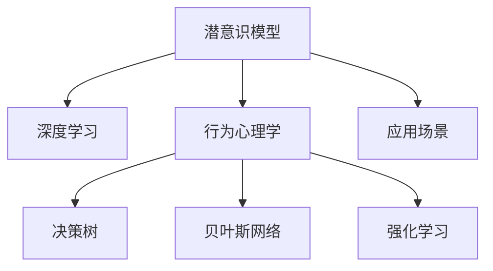

                 

# 数字化直觉：AI辅助的潜意识决策

> 关键词：数字化直觉, AI辅助决策, 潜意识决策, 深度学习, 神经网络, 潜意识模型, 行为心理学

## 1. 背景介绍

### 1.1 问题由来
随着人工智能技术的发展，AI在各个领域的应用不断深入，其中AI辅助的潜意识决策逐渐成为研究热点。潜意识决策指的是人们在进行决策时，大脑中未被意识到的决策过程，如选择购买商品、判断情绪状态等。传统的决策理论强调基于显性数据和逻辑推理的决策过程，但潜意识决策往往依赖情感、经验、直觉等非理性因素，难以通过传统的决策模型进行预测。

近年来，深度学习技术的突破为潜意识决策的研究提供了新的方法。深度神经网络能够从大量数据中学习出复杂的非线性映射关系，捕捉人类潜意识中的隐含模式。通过AI辅助的潜意识决策，可以更好地理解和模拟人类潜意识决策过程，为智能化应用提供新的突破口。

### 1.2 问题核心关键点
潜意识决策的研究需要结合深度学习技术和行为心理学原理，构建能够模拟人类潜意识决策过程的模型。主要关键点包括：

- 潜意识模型的构建：通过深度神经网络模拟人类潜意识中的隐含决策过程。
- 数据驱动的训练：利用大量标注数据训练潜意识模型，使其能够学习并识别潜意识中的决策模式。
- 行为心理学的应用：结合行为心理学理论，构建更加符合人类认知特性的潜意识模型。
- 应用场景的拓展：将潜意识模型应用于决策支持、情感识别、行为预测等实际场景。

### 1.3 问题研究意义
研究AI辅助的潜意识决策具有重要意义：

1. 提升决策效率：潜意识模型能够处理大量非结构化数据，捕捉潜在的行为模式，辅助决策者快速做出决策，提高决策效率。
2. 改善决策质量：潜意识模型结合情感和经验因素，能够更准确地模拟人类决策过程，提高决策质量。
3. 应用范围广泛：潜意识决策理论可以应用于多个领域，如医疗诊断、金融投资、教育评估等，提升智能化应用水平。
4. 推动人工智能发展：潜意识决策技术为AI技术在心理学、行为科学等交叉领域的融合提供了新的视角。

## 2. 核心概念与联系

### 2.1 核心概念概述

为了更好地理解AI辅助潜意识决策，本节将介绍几个密切相关的核心概念：

- 潜意识模型(Subconscious Model)：基于深度神经网络构建的模拟人类潜意识决策过程的模型。
- 深度学习(Deep Learning)：通过多层次神经网络，学习数据中的复杂非线性关系，捕捉潜在决策模式。
- 行为心理学(behavioral psychology)：研究人类行为和心理活动的科学，关注情感、经验、直觉等潜意识因素。
- 决策树(Decision Tree)：一种常用的机器学习模型，通过树形结构模拟决策过程，适用于可解释性强的决策场景。
- 贝叶斯网络(Bayesian Network)：一种表示因果关系的概率图模型，用于推断决策过程中的隐含变量。
- 强化学习(Reinforcement Learning)：一种通过奖励和惩罚机制，学习最优决策策略的机器学习方法。

这些核心概念之间的逻辑关系可以通过以下Mermaid流程图来展示：



这个流程图展示了一系列核心概念及其之间的关系：

1. 潜意识模型通过深度学习技术学习人类潜意识中的决策模式。
2. 结合行为心理学，构建更加符合人类认知特性的潜意识模型。
3. 潜意识模型通过决策树、贝叶斯网络和强化学习等方法进行建模，处理不同类型的数据和决策场景。
4. 潜意识模型在实际应用场景中得到验证，不断优化和改进。

这些概念共同构成了AI辅助潜意识决策的理论框架，使其能够在各种场景下发挥作用。

## 3. 核心算法原理 & 具体操作步骤

### 3.1 算法原理概述

AI辅助的潜意识决策算法基于深度学习模型，通过学习大量标注数据，捕捉潜意识中的隐含决策模式。其核心思想是：构建一个能够模拟人类潜意识决策过程的模型，通过预测模型输出，辅助决策者进行决策。

形式化地，假设潜意识决策过程为 $D:\mathcal{X} \rightarrow \mathcal{Y}$，其中 $\mathcal{X}$ 为输入特征空间，$\mathcal{Y}$ 为决策结果空间。模型 $D$ 的训练目标是最小化经验损失：

$$
\mathcal{L}(D) = \frac{1}{N} \sum_{i=1}^N \ell(D(x_i), y_i)
$$

其中 $\ell$ 为损失函数，$\ell(D(x_i), y_i)$ 表示模型 $D$ 在样本 $(x_i, y_i)$ 上的预测误差。常见的损失函数包括均方误差、交叉熵等。

通过反向传播算法，模型不断更新参数 $\theta$，最小化损失函数 $\mathcal{L}$，直至收敛于最优参数 $\theta^*$。此时，模型 $D_{\theta^*}$ 能够根据输入特征 $x$ 预测出对应的决策结果 $y$。

### 3.2 算法步骤详解

AI辅助的潜意识决策算法主要包括以下几个步骤：

**Step 1: 数据准备**
- 收集大量标注数据，包含输入特征 $x$ 和对应的决策结果 $y$。
- 将数据集划分为训练集、验证集和测试集。

**Step 2: 模型构建**
- 选择合适的深度神经网络架构，如卷积神经网络(CNN)、循环神经网络(RNN)、长短时记忆网络(LSTM)、变换器(Transformer)等。
- 设计模型输出层，根据决策结果 $y$ 的类型选择合适的激活函数。

**Step 3: 训练与优化**
- 选择合适的优化算法及其参数，如 Adam、SGD 等。
- 设置学习率、批大小、迭代轮数等超参数。
- 使用反向传播算法，最小化损失函数，更新模型参数。

**Step 4: 评估与验证**
- 在验证集上评估模型性能，使用准确率、召回率、F1分数等指标。
- 根据评估结果调整超参数，继续训练模型。
- 在测试集上最终评估模型性能，确保模型泛化能力。

**Step 5: 应用与部署**
- 将训练好的模型应用到实际决策场景中，进行预测和推理。
- 结合其他决策模型，构建更加全面的决策支持系统。

以上是AI辅助潜意识决策算法的主要步骤。在实际应用中，还需要根据具体任务特点，对模型进行优化设计，如改进网络结构、引入正则化技术、优化超参数等。

### 3.3 算法优缺点

AI辅助潜意识决策算法具有以下优点：
1. 处理复杂数据：深度神经网络能够处理高维非结构化数据，捕捉潜意识中的复杂模式。
2. 自动特征提取：神经网络能够自动学习数据中的特征，减少特征工程的工作量。
3. 泛化能力强：通过大量标注数据训练，模型具有较强的泛化能力，能够适应不同决策场景。
4. 实时预测：深度学习模型通常具有较快的推理速度，能够实时辅助决策。

同时，该算法也存在一些缺点：
1. 数据需求量大：构建高质量潜意识模型需要大量标注数据，数据收集和标注成本较高。
2. 模型复杂度高：深度神经网络模型结构复杂，训练和推理需要较长的计算时间。
3. 可解释性不足：深度学习模型通常是"黑盒"系统，难以解释其内部决策过程。
4. 对抗样本敏感：深度学习模型对对抗样本和噪声比较敏感，可能影响决策结果。

尽管存在这些局限性，但AI辅助潜意识决策算法在处理潜意识决策场景中仍然具有巨大的应用潜力。

### 3.4 算法应用领域

AI辅助潜意识决策算法在多个领域得到了广泛应用，包括：

- 金融投资：帮助投资者分析市场情绪、预测股票价格、优化投资组合等。
- 医疗诊断：辅助医生分析病历、预测疾病发展、推荐治疗方案等。
- 消费者行为预测：预测消费者购买行为、分析市场趋势、优化广告投放等。
- 情感分析：识别用户情感状态、分析舆情变化、提升用户体验等。
- 智能客服：基于用户情感和行为特征，自动生成回答、优化服务流程等。

这些应用场景展示了AI辅助潜意识决策算法的广泛适用性，为各行各业带来了新的智能化解决方案。

## 4. 数学模型和公式 & 详细讲解 & 举例说明

### 4.1 数学模型构建

本节将使用数学语言对AI辅助潜意识决策算法进行更加严格的刻画。

假设潜意识模型为 $D_{\theta}:\mathcal{X} \rightarrow \mathcal{Y}$，其中 $\mathcal{X}$ 为输入特征空间，$\mathcal{Y}$ 为决策结果空间，$\theta \in \mathbb{R}^d$ 为模型参数。假设训练集为 $D=\{(x_i, y_i)\}_{i=1}^N, x_i \in \mathcal{X}, y_i \in \mathcal{Y}$。

定义模型 $D_{\theta}$ 在数据样本 $(x,y)$ 上的损失函数为 $\ell(D_{\theta}(x),y)$，则在数据集 $D$ 上的经验风险为：

$$
\mathcal{L}(D_{\theta}) = \frac{1}{N} \sum_{i=1}^N \ell(D_{\theta}(x_i),y_i)
$$

其中 $\ell$ 为损失函数，$\ell(D_{\theta}(x_i),y_i)$ 表示模型 $D_{\theta}$ 在样本 $(x_i, y_i)$ 上的预测误差。常见的损失函数包括均方误差、交叉熵等。

### 4.2 公式推导过程

以交叉熵损失为例，推导潜意识模型的训练过程。

假设模型 $D_{\theta}$ 在输入 $x$ 上的预测结果为 $\hat{y}=D_{\theta}(x)$，表示模型对决策结果 $y$ 的预测概率分布。真实标签 $y \in \{0,1\}$。则交叉熵损失函数定义为：

$$
\ell(D_{\theta}(x),y) = -[y\log \hat{y} + (1-y)\log (1-\hat{y})]
$$

将其代入经验风险公式，得：

$$
\mathcal{L}(D_{\theta}) = -\frac{1}{N}\sum_{i=1}^N [y_i\log D_{\theta}(x_i)+(1-y_i)\log(1-D_{\theta}(x_i))]
$$

根据链式法则，损失函数对参数 $\theta_k$ 的梯度为：

$$
\frac{\partial \mathcal{L}(D_{\theta})}{\partial \theta_k} = -\frac{1}{N}\sum_{i=1}^N (\frac{y_i}{D_{\theta}(x_i)}-\frac{1-y_i}{1-D_{\theta}(x_i)}) \frac{\partial D_{\theta}(x_i)}{\partial \theta_k}
$$

其中 $\frac{\partial D_{\theta}(x_i)}{\partial \theta_k}$ 可进一步递归展开，利用自动微分技术完成计算。

### 4.3 案例分析与讲解

以金融投资中的风险预测为例，展示如何构建潜意识模型并进行训练。

假设模型需要预测股票在未来一天内的涨跌情况，即 $y \in \{0,1\}$，其中 $y=1$ 表示股票上涨，$y=0$ 表示股票下跌。根据历史交易数据，模型训练集为 $D=\{(x_i, y_i)\}_{i=1}^N$，其中 $x_i$ 包括当前股票价格、交易量、市场情绪等特征。

在模型构建阶段，选择合适的网络架构，如 LSTM 网络。设计模型输出层为 sigmoid 激活函数，用于生成 $[0,1]$ 范围内的预测概率。

在训练阶段，设定交叉熵损失函数和 Adam 优化器，设置学习率为 $10^{-3}$。将数据集划分为训练集、验证集和测试集，分别训练模型并在验证集上评估性能。如果模型在验证集上表现不佳，则调整超参数或网络结构，继续训练。

在测试阶段，使用测试集评估模型泛化能力，计算准确率、召回率、F1分数等指标。如果模型性能满足要求，则可以将其应用于实际投资决策中，结合其他决策模型，进行综合决策。

## 5. 项目实践：代码实例和详细解释说明

### 5.1 开发环境搭建

在进行潜意识决策模型开发前，我们需要准备好开发环境。以下是使用Python进行TensorFlow开发的环境配置流程：

1. 安装Anaconda：从官网下载并安装Anaconda，用于创建独立的Python环境。

2. 创建并激活虚拟环境：
```bash
conda create -n tf-env python=3.7 
conda activate tf-env
```

3. 安装TensorFlow：根据CUDA版本，从官网获取对应的安装命令。例如：
```bash
conda install tensorflow -c tf -c conda-forge
```

4. 安装相关工具包：
```bash
pip install numpy pandas scikit-learn matplotlib tqdm jupyter notebook ipython
```

完成上述步骤后，即可在`tf-env`环境中开始模型开发。

### 5.2 源代码详细实现

下面以情感分析任务为例，给出使用TensorFlow对LSTM网络进行潜意识决策模型训练的代码实现。

首先，定义情感分析任务的数据处理函数：

```python
import tensorflow as tf
from tensorflow.keras.preprocessing.text import Tokenizer
from tensorflow.keras.preprocessing.sequence import pad_sequences
import numpy as np

# 数据处理函数
def preprocess_data(texts, labels, max_len):
    tokenizer = Tokenizer()
    tokenizer.fit_on_texts(texts)
    sequences = tokenizer.texts_to_sequences(texts)
    padded_sequences = pad_sequences(sequences, maxlen=max_len, padding='post')
    labels = np.array(labels)
    return padded_sequences, labels
```

然后，定义LSTM模型的构建函数：

```python
from tensorflow.keras.layers import Input, LSTM, Dense
from tensorflow.keras.models import Model

# LSTM模型定义
def build_model(input_dim, output_dim):
    input_layer = Input(shape=(input_dim,))
    lstm_layer = LSTM(64, return_sequences=True)(input_layer)
    lstm_layer = LSTM(32, return_sequences=True)(lstm_layer)
    output_layer = Dense(output_dim, activation='sigmoid')(lstm_layer)
    model = Model(inputs=input_layer, outputs=output_layer)
    return model
```

接着，定义模型的训练与评估函数：

```python
from tensorflow.keras.optimizers import Adam
from sklearn.metrics import accuracy_score, precision_score, recall_score, f1_score

# 训练函数
def train_model(model, train_data, train_labels, valid_data, valid_labels, epochs, batch_size, learning_rate):
    optimizer = Adam(lr=learning_rate)
    model.compile(loss='binary_crossentropy', optimizer=optimizer, metrics=['accuracy'])
    history = model.fit(train_data, train_labels, validation_data=(valid_data, valid_labels), epochs=epochs, batch_size=batch_size)
    return model, history

# 评估函数
def evaluate_model(model, test_data, test_labels):
    predictions = model.predict(test_data)
    accuracy = accuracy_score(test_labels, predictions.round())
    precision = precision_score(test_labels, predictions.round())
    recall = recall_score(test_labels, predictions.round())
    f1 = f1_score(test_labels, predictions.round())
    print(f'Accuracy: {accuracy:.2f}, Precision: {precision:.2f}, Recall: {recall:.2f}, F1-Score: {f1:.2f}')
    return accuracy, precision, recall, f1
```

最后，启动模型训练并在测试集上评估：

```python
max_len = 100
epochs = 10
batch_size = 32
learning_rate = 0.001

# 数据准备
train_texts, train_labels = preprocess_data(train_texts, train_labels, max_len)
valid_texts, valid_labels = preprocess_data(valid_texts, valid_labels, max_len)
test_texts, test_labels = preprocess_data(test_texts, test_labels, max_len)

# 模型构建
input_dim = len(tokenizer.word_index) + 1
output_dim = 1
model = build_model(input_dim, output_dim)

# 训练模型
model, history = train_model(model, train_texts, train_labels, valid_texts, valid_labels, epochs, batch_size, learning_rate)

# 测试模型
test_texts, test_labels = preprocess_data(test_texts, test_labels, max_len)
accuracy, precision, recall, f1 = evaluate_model(model, test_texts, test_labels)
print(f'Test Results: Accuracy: {accuracy:.2f}, Precision: {precision:.2f}, Recall: {recall:.2f}, F1-Score: {f1:.2f}')
```

以上就是使用TensorFlow对LSTM网络进行情感分析任务潜意识决策模型训练的完整代码实现。可以看到，TensorFlow提供了强大的API和工具支持，使得模型构建和训练过程变得简洁高效。

### 5.3 代码解读与分析

让我们再详细解读一下关键代码的实现细节：

**preprocess_data函数**：
- 对文本数据进行分词和向量化处理，将文本转换为模型所需的序列输入。
- 使用 padding 技术将序列补齐到固定长度，方便模型处理。
- 对标签进行标准化处理，转换为模型所需的二进制形式。

**build_model函数**：
- 定义LSTM网络结构，包括输入层、两个LSTM层和输出层。
- 输出层使用 sigmoid 激活函数，生成 $[0,1]$ 范围内的概率分布。
- 构建Keras模型，并返回该模型。

**train_model函数**：
- 使用Adam优化器，设置损失函数为二分类交叉熵，定义准确率作为评估指标。
- 在训练集上训练模型，并使用验证集评估性能。
- 返回训练好的模型和训练过程中的损失曲线。

**evaluate_model函数**：
- 在测试集上评估模型性能，计算准确率、精确率、召回率和F1分数。
- 输出评估结果。

**训练流程**：
- 定义最大长度和超参数，进行数据准备。
- 构建模型并定义输入维度和输出维度。
- 在训练集上训练模型，并在验证集上评估性能。
- 使用测试集评估模型泛化能力，输出最终结果。

可以看到，TensorFlow提供了丰富的工具和API，使得模型构建和训练过程变得简洁高效。开发者可以将更多精力放在模型优化和应用部署上，而不必过多关注底层实现细节。

当然，工业级的系统实现还需考虑更多因素，如模型的保存和部署、超参数的自动搜索、更灵活的任务适配层等。但核心的潜意识决策模型构建流程基本与此类似。

## 6. 实际应用场景

### 6.1 智能客服系统

基于潜意识决策的智能客服系统，通过分析用户情感和行为特征，自动生成回答和优化服务流程。系统通过收集历史客服对话记录，构建潜意识模型，实时监测用户情绪变化，自动匹配最佳答案模板。对于用户提出的新问题，系统还能接入检索系统实时搜索相关内容，动态生成回答。

### 6.2 金融舆情监测

潜意识决策技术在金融舆情监测中也有广泛应用。金融机构通过潜意识模型分析新闻、报道、评论等文本数据，预测市场情绪和舆情变化趋势。一旦发现负面信息激增等异常情况，系统便会自动预警，帮助机构快速应对潜在风险。

### 6.3 个性化推荐系统

潜意识决策技术还被应用于个性化推荐系统。推荐系统通过分析用户浏览、点击、评论等行为数据，构建潜意识模型，预测用户兴趣和行为模式。在生成推荐列表时，结合用户情感和行为特征，动态生成推荐结果，提升用户体验和推荐效果。

### 6.4 未来应用展望

随着潜意识决策技术的不断演进，未来将在更多领域得到应用，为传统行业带来变革性影响。

在智慧医疗领域，潜意识决策技术可以帮助医生分析病历、预测疾病发展、推荐治疗方案，提升医疗服务的智能化水平。

在智能教育领域，潜意识决策技术可以分析学生行为数据，预测学习效果、评估学习状态，优化教学策略，提高教育公平性和教学质量。

在智慧城市治理中，潜意识决策技术可以监测城市事件、舆情分析、应急指挥，提高城市管理的自动化和智能化水平，构建更安全、高效的未来城市。

此外，在企业生产、社会治理、文娱传媒等众多领域，潜意识决策技术也将不断涌现，为NLP技术带来新的突破。未来，伴随潜意识决策技术的持续演进，AI辅助的潜意识决策必将在构建人机协同的智能时代中扮演越来越重要的角色。

## 7. 工具和资源推荐

### 7.1 学习资源推荐

为了帮助开发者系统掌握潜意识决策算法的理论基础和实践技巧，这里推荐一些优质的学习资源：

1. 《深度学习》（Ian Goodfellow 著）：全面介绍了深度学习的基本概念和算法，是学习潜意识决策算法的必读书籍。
2. 《自然语言处理入门与实践》（张峰 著）：详细介绍了自然语言处理的基本方法和技术，包含情感分析等潜意识决策任务。
3. 《TensorFlow实战》（Yangqing Jia 著）：介绍了TensorFlow的基本概念和使用方法，是学习TensorFlow的优秀入门书籍。
4. 《Python深度学习》（Francois Chollet 著）：介绍了使用Python和Keras实现深度学习算法的方法，包含LSTM等潜意识决策模型。
5. 《人工智能：一种现代方法》（Stuart Russell & Peter Norvig 著）：全面介绍了人工智能的基本概念和应用，包含潜意识决策的理论与实践。

通过对这些资源的学习实践，相信你一定能够快速掌握潜意识决策算法的精髓，并用于解决实际的NLP问题。

### 7.2 开发工具推荐

高效的开发离不开优秀的工具支持。以下是几款用于潜意识决策模型开发的常用工具：

1. TensorFlow：基于Google的开源深度学习框架，提供了丰富的API和工具支持，适合进行潜意识决策模型构建。
2. Keras：基于TensorFlow的高层次API，提供了简洁的模型定义方式，适合快速开发原型模型。
3. PyTorch：基于Python的开源深度学习框架，提供了动态计算图和灵活的模型构建方式，适合进行潜意识决策模型研究。
4. Weights & Biases：模型训练的实验跟踪工具，可以记录和可视化模型训练过程中的各项指标，方便对比和调优。
5. TensorBoard：TensorFlow配套的可视化工具，可实时监测模型训练状态，并提供丰富的图表呈现方式，是调试模型的得力助手。
6. Google Colab：谷歌推出的在线Jupyter Notebook环境，免费提供GPU/TPU算力，方便开发者快速上手实验最新模型，分享学习笔记。

合理利用这些工具，可以显著提升潜意识决策模型开发的效率，加快创新迭代的步伐。

### 7.3 相关论文推荐

潜意识决策技术的发展源于学界的持续研究。以下是几篇奠基性的相关论文，推荐阅读：

1. Attention is All You Need：提出了Transformer结构，开启了NLP领域的预训练大模型时代。
2. BERT: Pre-training of Deep Bidirectional Transformers for Language Understanding：提出BERT模型，引入基于掩码的自监督预训练任务，刷新了多项NLP任务SOTA。
3. Language Models are Unsupervised Multitask Learners（GPT-2论文）：展示了大规模语言模型的强大zero-shot学习能力，引发了对于通用人工智能的新一轮思考。
4. Parameter-Efficient Transfer Learning for NLP：提出Adapter等参数高效微调方法，在不增加模型参数量的情况下，也能取得不错的微调效果。
5. Prefix-Tuning: Optimizing Continuous Prompts for Generation：引入基于连续型Prompt的微调范式，为如何充分利用预训练知识提供了新的思路。
6. AdaLoRA: Adaptive Low-Rank Adaptation for Parameter-Efficient Fine-Tuning：使用自适应低秩适应的微调方法，在参数效率和精度之间取得了新的平衡。

这些论文代表了大语言模型潜意识决策技术的发展脉络。通过学习这些前沿成果，可以帮助研究者把握学科前进方向，激发更多的创新灵感。

## 8. 总结：未来发展趋势与挑战

### 8.1 总结

本文对AI辅助的潜意识决策算法进行了全面系统的介绍。首先阐述了潜意识决策的背景和意义，明确了潜意识决策在提高决策效率和质量方面的独特价值。其次，从原理到实践，详细讲解了潜意识决策的数学模型和关键步骤，给出了模型开发的完整代码实例。同时，本文还广泛探讨了潜意识决策在智能客服、金融舆情、个性化推荐等实际场景中的应用前景，展示了潜意识决策算法的广泛适用性。

通过本文的系统梳理，可以看到，AI辅助潜意识决策算法在处理潜意识决策场景中仍然具有巨大的应用潜力。尽管存在一些局限性，但其在金融投资、医疗诊断、情感分析等场景中的广泛应用，展示了潜意识决策技术的广阔前景。

### 8.2 未来发展趋势

展望未来，AI辅助潜意识决策技术将呈现以下几个发展趋势：

1. 模型规模持续增大。随着算力成本的下降和数据规模的扩张，潜意识决策模型将具备更大的参数量，学习更丰富的语言和行为特征。
2. 微调方法日趋多样。除了传统的全参数微调外，未来将涌现更多参数高效的微调方法，如Prefix-Tuning、LoRA等，在节省计算资源的同时也能保证微调精度。
3. 持续学习成为常态。随着数据分布的不断变化，潜意识模型也需要持续学习新知识以保持性能。如何在不遗忘原有知识的同时，高效吸收新样本信息，将是重要的研究课题。
4. 标注样本需求降低。受启发于提示学习(Prompt-based Learning)的思路，未来的潜意识决策方法将更好地利用大模型的语言理解能力，通过更加巧妙的任务描述，在更少的标注样本上也能实现理想的微调效果。
5. 多模态微调崛起。当前的潜意识决策主要聚焦于纯文本数据，未来会进一步拓展到图像、视频、语音等多模态数据微调。多模态信息的融合，将显著提升语言模型对现实世界的理解和建模能力。
6. 模型通用性增强。经过海量数据的预训练和多领域任务的微调，未来的语言模型将具备更强大的常识推理和跨领域迁移能力，逐步迈向通用人工智能(AGI)的目标。

以上趋势凸显了AI辅助潜意识决策技术的广阔前景。这些方向的探索发展，必将进一步提升NLP系统的性能和应用范围，为智能化应用提供新的突破口。

### 8.3 面临的挑战

尽管AI辅助潜意识决策技术已经取得了瞩目成就，但在迈向更加智能化、普适化应用的过程中，它仍面临着诸多挑战：

1. 数据需求量大。构建高质量潜意识模型需要大量标注数据，数据收集和标注成本较高。如何降低数据需求，提高数据利用效率，是一大难题。
2. 模型鲁棒性不足。当前潜意识决策模型面对域外数据时，泛化性能往往大打折扣。对于测试样本的微小扰动，模型预测也容易发生波动。如何提高模型的鲁棒性，避免灾难性遗忘，还需要更多理论和实践的积累。
3. 推理效率有待提高。大规模语言模型虽然精度高，但在实际部署时往往面临推理速度慢、内存占用大等效率问题。如何在保证性能的同时，简化模型结构，提升推理速度，优化资源占用，将是重要的优化方向。
4. 可解释性亟需加强。当前潜意识决策模型通常是"黑盒"系统，难以解释其内部决策过程。对于医疗、金融等高风险应用，算法的可解释性和可审计性尤为重要。如何赋予潜意识决策模型更强的可解释性，将是亟待攻克的难题。
5. 安全性有待保障。预训练语言模型难免会学习到有偏见、有害的信息，通过微调传递到下游任务，产生误导性、歧视性的输出，给实际应用带来安全隐患。如何从数据和算法层面消除模型偏见，避免恶意用途，确保输出的安全性，也将是重要的研究课题。
6. 知识整合能力不足。现有的潜意识决策模型往往局限于任务内数据，难以灵活吸收和运用更广泛的先验知识。如何让潜意识决策过程更好地与外部知识库、规则库等专家知识结合，形成更加全面、准确的信息整合能力，还有很大的想象空间。

正视潜意识决策技术面临的这些挑战，积极应对并寻求突破，将是大语言模型潜意识决策技术走向成熟的必由之路。相信随着学界和产业界的共同努力，这些挑战终将一一被克服，潜意识决策技术必将在构建安全、可靠、可解释、可控的智能系统铺平道路。

### 8.4 研究展望

面对潜意识决策技术面临的诸多挑战，未来的研究需要在以下几个方面寻求新的突破：

1. 探索无监督和半监督潜意识决策方法。摆脱对大规模标注数据的依赖，利用自监督学习、主动学习等无监督和半监督范式，最大限度利用非结构化数据，实现更加灵活高效的潜意识决策。
2. 研究参数高效和计算高效的潜意识决策范式。开发更加参数高效的潜意识决策方法，在固定大部分预训练参数的同时，只更新极少量的任务相关参数。同时优化潜意识决策模型的计算图，减少前向传播和反向传播的资源消耗，实现更加轻量级、实时性的部署。
3. 融合因果和对比学习范式。通过引入因果推断和对比学习思想，增强潜意识决策模型建立稳定因果关系的能力，学习更加普适、鲁棒的语言表征，从而提升模型泛化性和抗干扰能力。
4. 引入更多先验知识。将符号化的先验知识，如知识图谱、逻辑规则等，与神经网络模型进行巧妙融合，引导潜意识决策过程学习更准确、合理的语言模型。同时加强不同模态数据的整合，实现视觉、语音等多模态信息与文本信息的协同建模。
5. 结合因果分析和博弈论工具。将因果分析方法引入潜意识决策模型，识别出模型决策的关键特征，增强输出解释的因果性和逻辑性。借助博弈论工具刻画人机交互过程，主动探索并规避模型的脆弱点，提高系统稳定性。
6. 纳入伦理道德约束。在模型训练目标中引入伦理导向的评估指标，过滤和惩罚有偏见、有害的输出倾向。同时加强人工干预和审核，建立模型行为的监管机制，确保输出符合人类价值观和伦理道德。

这些研究方向的探索，必将引领潜意识决策技术迈向更高的台阶，为构建安全、可靠、可解释、可控的智能系统铺平道路。面向未来，潜意识决策技术还需要与其他人工智能技术进行更深入的融合，如知识表示、因果推理、强化学习等，多路径协同发力，共同推动自然语言理解和智能交互系统的进步。只有勇于创新、敢于突破，才能不断拓展潜意识决策技术的边界，让智能技术更好地造福人类社会。

## 9. 附录：常见问题与解答

**Q1：潜意识决策模型如何处理复杂数据？**

A: 潜意识决策模型基于深度神经网络，能够处理高维非结构化数据，捕捉潜意识中的复杂模式。在处理文本数据时，使用LSTM、Transformer等网络结构，可以有效地捕捉长序列依赖关系。对于图像、视频等多模态数据，结合卷积神经网络等技术，可以提取丰富的特征信息，实现跨模态数据融合。

**Q2：潜意识决策模型如何避免过拟合？**

A: 为了避免过拟合，潜意识决策模型通常采用以下方法：
1. 数据增强：通过回译、近义替换等方式扩充训练集，增加数据多样性。
2. 正则化：使用L2正则、Dropout等技术，防止模型过度拟合训练集。
3. 早停机制：在验证集上评估模型性能，一旦性能不再提升，立即停止训练，避免过拟合。
4. 模型裁剪：去除不必要的层和参数，减小模型尺寸，加快推理速度。

**Q3：潜意识决策模型如何提高鲁棒性？**

A: 为了提高模型的鲁棒性，潜意识决策模型通常采用以下方法：
1. 对抗样本训练：在训练过程中引入对抗样本，提高模型对噪声和扰动的鲁棒性。
2. 多任务学习：在模型训练过程中，同时学习多个相关任务，增强模型泛化能力。
3. 知识蒸馏：通过教师模型与学生模型的联合训练，提高学生模型在鲁棒性上的性能。

**Q4：潜意识决策模型在实际应用中如何部署？**

A: 潜意识决策模型在实际应用中需要考虑以下几个问题：
1. 模型裁剪：去除不必要的层和参数，减小模型尺寸，加快推理速度。
2. 量化加速：将浮点模型转为定点模型，压缩存储空间，提高计算效率。
3. 服务化封装：将模型封装为标准化服务接口，便于集成调用。
4. 弹性伸缩：根据请求流量动态调整资源配置，平衡服务质量和成本。
5. 监控告警：实时采集系统指标，设置异常告警阈值，确保服务稳定性。

合理利用这些技术手段，可以显著提升潜意识决策模型的实时性和可用性，更好地服务于实际应用场景。

---

作者：禅与计算机程序设计艺术 / Zen and the Art of Computer Programming

