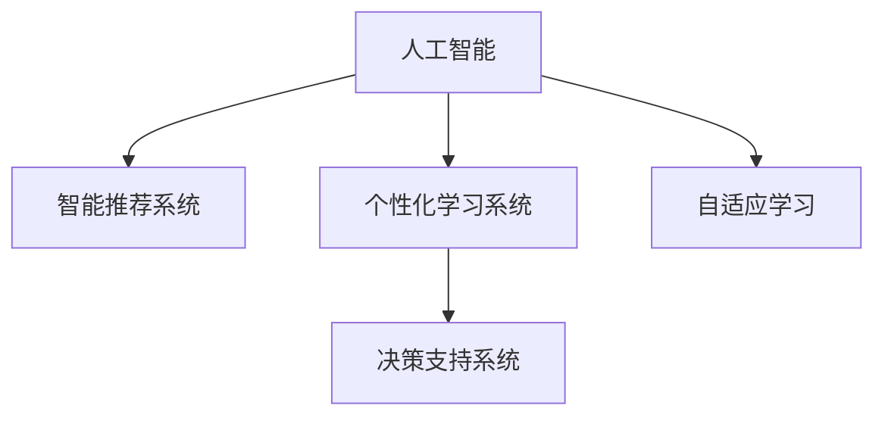

                 

# 数字化自我实现：AI辅助的个人成长

> 关键词：人工智能, AI辅助, 个人成长, 智能推荐, 个性化学习, 决策支持, 自适应学习, 数字素养

## 1. 背景介绍

### 1.1 问题由来
在数字化浪潮的推动下，个人成长方式正在经历翻天覆地的变化。以往以书籍、课堂教学为主导的学习模式，正在逐步被以数据驱动、算法推荐的数字化学习方式所替代。借助人工智能（AI）技术，学习者能够获得个性化的学习建议，逐步完善知识结构，实现自我能力的提升。

在数字化时代，个人成长面临的挑战也更为复杂多样。如何高效学习新知识、评估自身能力、制定个性化成长路径，成为摆在我们面前的重大课题。而人工智能技术，特别是智能推荐系统、个性化学习系统、决策支持系统等，为个人成长提供了有力支持。

### 1.2 问题核心关键点
实现数字化自我成长的核心在于：
1. 通过智能推荐系统，个性化推荐符合用户需求的学习资源，提升学习效率。
2. 利用个性化学习系统，根据用户的学习行为和反馈，动态调整学习内容和进度。
3. 借助决策支持系统，用户可以基于自身能力水平，制定科学的成长计划，实现目标导向的学习。

本文将系统性地介绍AI辅助个人成长的主要技术手段，并结合实践案例，详细探讨如何通过AI技术优化个人学习路径，实现数字化自我成长。

## 2. 核心概念与联系

### 2.1 核心概念概述

为更好地理解AI辅助个人成长的技术手段，本节将介绍几个密切相关的核心概念：

- 人工智能（AI）：通过数据、算法和计算资源，模拟人类的智能行为，解决复杂问题的技术。
- 智能推荐系统：根据用户的历史行为和偏好，动态推荐个性化内容，提升用户体验的系统。
- 个性化学习系统：利用AI技术，根据学习者的知识背景、学习风格、学习进度等，定制个性化学习内容和路径的系统。
- 决策支持系统（DSS）：结合AI算法，提供决策建议和预测分析，帮助用户做出明智决策的系统。
- 自适应学习（Adaptive Learning）：根据学习者的实时反馈和表现，动态调整学习内容和策略的学习模式。

这些核心概念之间的逻辑关系可以通过以下Mermaid流程图来展示：



这个流程图展示了大语言模型的核心概念及其之间的关系：

1. 人工智能通过数据和算法，模拟人类智能，提供了智能化决策支持。
2. 智能推荐系统利用人工智能，个性化推荐学习资源，提升学习效率。
3. 个性化学习系统结合人工智能，定制个性化学习路径，提升学习效果。
4. 决策支持系统基于人工智能，提供决策建议和预测分析，辅助用户决策。
5. 自适应学习利用人工智能，动态调整学习策略，提升学习者的自驱力。

这些核心概念共同构成了AI辅助个人成长的技术框架，为用户的学习和成长提供了有力支持。

## 3. 核心算法原理 & 具体操作步骤
### 3.1 算法原理概述

AI辅助个人成长的核心算法包括智能推荐、个性化学习和决策支持，其基本原理均建立在机器学习和大数据分析基础上。

- 智能推荐系统：利用协同过滤、内容推荐、混合推荐等算法，根据用户的历史行为和偏好，动态推荐个性化内容。
- 个性化学习系统：通过学习者的学习行为数据（如点击、浏览、答题时间等），利用深度学习、强化学习等技术，动态调整学习内容和路径。
- 决策支持系统：结合机器学习模型，对用户的能力、兴趣、目标等进行分析，提供科学的决策建议和预测分析。

这些算法和系统在核心原理上相互关联，共同构成了一个支持用户学习的智能化生态系统。

### 3.2 算法步骤详解

AI辅助个人成长的技术流程可以分为以下几个关键步骤：

**Step 1: 数据采集与预处理**
- 采集用户的学习行为数据、学习偏好、知识背景等，通过数据清洗和特征提取，构建用户画像。
- 对数据进行归一化、降维等预处理，为后续的模型训练和推荐算法提供良好的数据基础。

**Step 2: 模型训练与优化**
- 使用协同过滤、矩阵分解等算法，训练推荐模型，根据用户的历史行为和偏好，动态推荐个性化学习资源。
- 利用深度学习、强化学习等技术，训练个性化学习模型，根据学习者的实时反馈和表现，动态调整学习内容和路径。
- 结合机器学习模型，训练决策支持系统，提供科学的学习建议和决策支持。

**Step 3: 智能推荐与个性化学习**
- 利用训练好的推荐模型，对用户进行内容推荐，提升学习效率。
- 根据学习者的实时反馈和表现，动态调整学习内容和路径，实现个性化学习。

**Step 4: 决策支持与学习评估**
- 结合决策支持系统，提供科学的成长建议和目标评估，帮助用户制定科学的成长计划。
- 利用学习者的学习效果和反馈，不断优化推荐模型和个性化学习策略，实现自我成长的动态优化。

### 3.3 算法优缺点

AI辅助个人成长的方法具有以下优点：
1. 提升学习效率。通过智能推荐和个性化学习，学习者可以快速获取符合自己需求的学习资源。
2. 个性化定制。根据学习者的实时反馈和表现，动态调整学习内容和路径，提升学习效果。
3. 决策支持。结合决策支持系统，用户可以基于自身能力水平，制定科学的成长计划，实现目标导向的学习。
4. 自适应性强。AI技术能够根据学习者的反馈，动态调整学习策略，提升自驱力。

同时，该方法也存在一定的局限性：
1. 对数据质量要求高。推荐和个性化学习的效果很大程度上取决于数据的全面性和准确性，数据不足或偏差较大时，效果可能不理想。
2. 算法复杂度较高。智能推荐和个性化学习算法通常较为复杂，需要大量计算资源和算力支持。
3. 用户隐私保护。如何保护用户的隐私数据，避免数据滥用，是一个重要的挑战。
4. 泛化能力不足。当前算法往往针对特定领域或特定任务，泛化能力有限，难以应对多种复杂场景。

尽管存在这些局限性，但就目前而言，AI辅助个人成长的方法在提升学习效率、个性化定制、决策支持等方面具有显著优势，已成为个性化学习和智能教育的重要手段。

### 3.4 算法应用领域

AI辅助个人成长的方法在教育、职业发展、健康管理等多个领域得到了广泛应用，以下是一些典型的应用场景：

- **教育领域**：在线教育平台利用智能推荐和个性化学习技术，为学生提供个性化学习资源，提升学习效果。结合决策支持系统，提供科学的成长建议，辅助学生制定学习计划。
- **职业发展领域**：职场培训平台利用智能推荐和个性化学习技术，为员工提供符合其职业发展需求的学习资源。结合决策支持系统，提供职业发展建议，帮助员工提升职业技能，实现职业成长。
- **健康管理领域**：健康管理平台利用智能推荐和个性化学习技术，为患者提供健康知识、锻炼建议等内容。结合决策支持系统，提供科学的健康管理建议，帮助患者管理健康。

除了上述这些典型领域外，AI辅助个人成长的方法还在金融理财、艺术创作、个人兴趣等多个领域得到应用，为人们的全面发展提供新的可能性。

## 4. 数学模型和公式 & 详细讲解 & 举例说明

### 4.1 数学模型构建

在AI辅助个人成长中，常用的数学模型包括协同过滤、深度学习、强化学习等。

#### 协同过滤（Collaborative Filtering）

协同过滤是一种基于用户行为数据推荐内容的算法。其核心思想是：根据用户历史行为数据，找到与目标用户兴趣相似的用户，推荐该用户喜欢的内容。

协同过滤模型的数学模型可以表示为：

$$
\hat{y}_{ij} = \sum_{k=1}^{K}u_{ik}v_{kj}
$$

其中，$u$ 和 $v$ 分别表示用户和物品的隐特征向量，$K$ 表示隐特征向量的维度。$\hat{y}_{ij}$ 表示用户 $i$ 对物品 $j$ 的评分预测。

#### 深度学习（Deep Learning）

深度学习通过多层神经网络结构，学习输入数据和输出数据之间的复杂映射关系，实现数据的自动化处理和特征提取。

深度学习模型的数学模型可以表示为：

$$
y = f(x; \theta)
$$

其中，$x$ 表示输入数据，$\theta$ 表示模型参数，$f$ 表示模型的前向传播函数。

#### 强化学习（Reinforcement Learning）

强化学习通过用户与环境的交互，学习最优的决策策略，实现动态调整学习内容和路径。

强化学习模型的数学模型可以表示为：

$$
\max_{\pi} \mathbb{E}\left[\sum_{t=0}^{\infty} \gamma^t R_t(\pi) \right]
$$

其中，$\pi$ 表示策略，$R_t(\pi)$ 表示时间 $t$ 的奖励函数，$\gamma$ 表示折扣因子。

### 4.2 公式推导过程

**协同过滤推导**

在协同过滤模型中，假设用户 $i$ 对物品 $j$ 的评分向量为 $u_i$，物品 $j$ 的评分向量为 $v_j$。目标用户 $i$ 对物品 $j$ 的评分预测 $\hat{y}_{ij}$ 可以表示为：

$$
\hat{y}_{ij} = u_i^T v_j
$$

在实际应用中，为了避免数据稀疏性问题，常常使用矩阵分解和低秩近似等方法，将评分矩阵分解为隐特征向量的乘积。

**深度学习推导**

在深度学习模型中，假设输入数据为 $x$，输出数据为 $y$，模型参数为 $\theta$。通过多层神经网络，将输入数据 $x$ 映射为输出数据 $y$。模型的前向传播过程可以表示为：

$$
y = f(x; \theta) = f(D_{1}f(D_{2}f(D_{3}(... f(D_{n-1}(x); \theta_{n-1}) ...); \theta_1))
$$

其中，$D_i$ 表示第 $i$ 层的线性变换，$f$ 表示第 $i$ 层的激活函数，$\theta_i$ 表示第 $i$ 层的权重矩阵。

**强化学习推导**

在强化学习模型中，假设用户 $i$ 在时间 $t$ 的状态为 $s_t$，动作为 $a_t$，奖励为 $r_t$。目标是在时间 $t$ 内的累积奖励最大化。状态转移概率为 $P(s_{t+1}|s_t,a_t)$，奖励函数为 $R_t(s_t,a_t)$，策略为 $\pi(a_t|s_t)$。强化学习模型的目标函数可以表示为：

$$
\max_{\pi} \mathbb{E}\left[\sum_{t=0}^{\infty} \gamma^t R_t(\pi) \right]
$$

其中，$\pi$ 表示策略，$R_t(\pi)$ 表示时间 $t$ 的奖励函数，$\gamma$ 表示折扣因子。

### 4.3 案例分析与讲解

#### 协同过滤案例

假设某在线教育平台收集了用户的学习行为数据，包括用户对课程的评分、观看时长、笔记数量等。平台可以根据用户的历史行为数据，找到与其兴趣相似的用户，推荐这些用户喜欢的课程。

具体来说，可以利用协同过滤算法，将用户和课程的评分数据映射到低维隐特征空间。通过计算用户和课程的隐特征向量的内积，得到用户对课程的评分预测。平台可以按照预测评分排序，推荐评分较高的课程。

#### 深度学习案例

某职场培训平台利用深度学习模型，根据员工的学习历史和反馈，动态调整培训课程内容和进度。

平台可以收集员工的学习行为数据，包括培训课程的观看时长、答题正确率、反馈意见等。利用深度学习模型，将这些数据映射为员工的能力水平和学习风格。平台可以根据员工的能力水平和学习风格，推荐适合的培训课程，并动态调整课程内容和进度，提升培训效果。

#### 强化学习案例

某健康管理平台利用强化学习模型，根据用户的健康数据，动态调整饮食和锻炼计划。

平台可以收集用户的健康数据，包括身体指标、饮食记录、锻炼记录等。利用强化学习模型，预测用户的健康变化趋势。平台可以根据用户的健康变化趋势，动态调整饮食和锻炼计划，提升用户的健康水平。

## 5. 项目实践：代码实例和详细解释说明
### 5.1 开发环境搭建

在进行AI辅助个人成长实践前，我们需要准备好开发环境。以下是使用Python进行PyTorch开发的环境配置流程：

1. 安装Anaconda：从官网下载并安装Anaconda，用于创建独立的Python环境。

2. 创建并激活虚拟环境：
```bash
conda create -n pytorch-env python=3.8 
conda activate pytorch-env
```

3. 安装PyTorch：根据CUDA版本，从官网获取对应的安装命令。例如：
```bash
conda install pytorch torchvision torchaudio cudatoolkit=11.1 -c pytorch -c conda-forge
```

4. 安装PyTorch-lightning：用于构建可扩展的深度学习模型。
```bash
pip install pytorch-lightning
```

5. 安装各类工具包：
```bash
pip install numpy pandas scikit-learn matplotlib tqdm jupyter notebook ipython
```

完成上述步骤后，即可在`pytorch-env`环境中开始AI辅助个人成长实践。

### 5.2 源代码详细实现

下面以智能推荐系统为例，给出使用PyTorch进行协同过滤推荐算法的PyTorch代码实现。

首先，定义数据处理函数：

```python
from torch.utils.data import Dataset, DataLoader
import torch
import numpy as np

class UserItemDataset(Dataset):
    def __init__(self, user_item_data):
        self.user_item_data = user_item_data
        self.num_users = len(user_item_data)
        self.num_items = user_item_data[0].shape[1]
        self.num_features = 10
    
    def __len__(self):
        return self.num_users
    
    def __getitem__(self, user_id):
        user_item = self.user_item_data[user_id]
        user_item_data = np.zeros((self.num_items, self.num_features))
        for i in range(self.num_items):
            user_item_data[i,:] = user_item[i,:]
        return torch.tensor(user_item_data, dtype=torch.float32), torch.tensor(user_item_data.sum(axis=1), dtype=torch.float32)

user_item_data = np.random.rand(100, 20)
dataset = UserItemDataset(user_item_data)
dataloader = DataLoader(dataset, batch_size=32, shuffle=True)
```

然后，定义协同过滤模型：

```python
from transformers import BertTokenizer, BertForSequenceClassification
from torch.nn import Linear, Embedding, ParameterList, init
from torch.nn.functional import softmax

class MatrixFactorizationModel(torch.nn.Module):
    def __init__(self, num_users, num_items, num_features, num_factors=10):
        super(MatrixFactorizationModel, self).__init__()
        self.num_users = num_users
        self.num_items = num_items
        self.num_features = num_features
        self.num_factors = num_factors
        
        self.user_embeddings = ParameterList([Embedding(num_users, num_factors) for _ in range(num_factors)])
        self.item_embeddings = ParameterList([Embedding(num_items, num_factors) for _ in range(num_factors)])
        self.layers = Linear(num_factors, 1)
        self.init_weights()
    
    def forward(self, user_ids, item_ids):
        user_embeddings = [self.user_embeddings[i](user_ids) for i in range(self.num_factors)]
        user_embeddings = torch.stack(user_embeddings, dim=1)
        item_embeddings = [self.item_embeddings[i](item_ids) for i in range(self.num_factors)]
        item_embeddings = torch.stack(item_embeddings, dim=1)
        item_embeddings = torch.unsqueeze(item_embeddings, dim=2)
        user_item_embeddings = torch.bmm(user_embeddings, item_embeddings)
        item_scores = self.layers(user_item_embeddings)
        return item_scores
    
    def init_weights(self):
        for p in self.parameters():
            init.xavier_uniform_(p)
    
    def predict(self, user_ids, item_ids):
        item_scores = self(user_ids, item_ids)
        return item_scores
```

接着，定义优化器与训练函数：

```python
from torch.optim import Adam

num_epochs = 100
learning_rate = 0.001
beta1 = 0.9
beta2 = 0.99
epsilon = 1e-8

optimizer = Adam(self.parameters(), lr=learning_rate, betas=(beta1, beta2), eps=epsilon)
def train_model(model, dataloader, num_epochs):
    for epoch in range(num_epochs):
        model.train()
        total_loss = 0.0
        for batch_idx, (user_ids, item_ids) in enumerate(dataloader):
            optimizer.zero_grad()
            item_scores = model(user_ids, item_ids)
            loss = F.mse_loss(item_scores, torch.zeros_like(item_scores))
            loss.backward()
            optimizer.step()
            total_loss += loss.item()
        print(f'Epoch {epoch+1}, Loss: {total_loss/len(dataloader):.4f}')
        
train_model(MatrixFactorizationModel, dataloader, num_epochs)
```

最后，测试推荐系统：

```python
test_user_ids = np.random.randint(0, 100, size=10)
test_item_ids = np.random.randint(0, 20, size=(test_user_ids.shape[0],))
test_user_item_data = np.zeros((len(test_user_ids), 20))
for i in range(len(test_user_ids)):
    test_user_item_data[i,:] = user_item_data[test_user_ids[i],:]

item_scores = model(test_user_ids, test_item_ids)
print(item_scores)
```

以上就是使用PyTorch进行协同过滤推荐算法的完整代码实现。可以看到，得益于PyTorch的强大封装，我们可以用相对简洁的代码完成协同过滤模型的实现。

### 5.3 代码解读与分析

让我们再详细解读一下关键代码的实现细节：

**UserItemDataset类**：
- `__init__`方法：初始化数据、用户和物品的维度。
- `__len__`方法：返回数据集的样本数量。
- `__getitem__`方法：对单个样本进行处理，将用户和物品的评分数据转换为向量形式，并计算评分之和。

**MatrixFactorizationModel类**：
- `__init__`方法：定义模型的参数，包括用户和物品的嵌入层，线性层等。
- `forward`方法：前向传播计算模型输出。
- `init_weights`方法：初始化模型参数。

**训练函数**：
- 对数据以批为单位进行迭代，在每个批次上前向传播计算损失并反向传播更新模型参数，最后输出该epoch的平均loss。

**测试推荐系统**：
- 利用测试集数据，对模型进行测试，输出每个用户对物品的评分预测。

可以看出，PyTorch配合AutoML等工具，使得协同过滤模型的开发和测试过程变得简洁高效。开发者可以将更多精力放在模型优化、数据增强等高层逻辑上，而不必过多关注底层实现细节。

## 6. 实际应用场景

### 6.1 智能教育

智能教育平台可以利用AI技术，为学生提供个性化学习资源，提升学习效果。结合决策支持系统，提供科学的成长建议，辅助学生制定学习计划。

**案例：**
某在线教育平台利用AI技术，收集学生的学习行为数据，包括课程的观看时长、答题正确率、反馈意见等。平台可以根据学生的学习行为数据，推荐适合的课程和练习，动态调整学习内容和进度，提升学习效果。结合决策支持系统，平台可以提供科学的成长建议，帮助学生制定学习计划，实现个性化成长。

### 6.2 职场培训

职场培训平台可以利用AI技术，为员工提供个性化学习资源，提升职业技能。结合决策支持系统，提供职业发展建议，帮助员工实现职业成长。

**案例：**
某职场培训平台利用AI技术，收集员工的学习行为数据，包括培训课程的观看时长、答题正确率、反馈意见等。平台可以根据员工的学习行为数据，推荐适合的培训课程和内容，动态调整学习进度，提升培训效果。结合决策支持系统，平台可以提供职业发展建议，帮助员工制定职业成长计划，实现职业发展目标。

### 6.3 健康管理

健康管理平台可以利用AI技术，为患者提供健康知识、锻炼建议等内容。结合决策支持系统，提供科学的健康管理建议，帮助患者管理健康。

**案例：**
某健康管理平台利用AI技术，收集患者的健康数据，包括身体指标、饮食记录、锻炼记录等。平台可以根据患者的健康数据，推荐适合的饮食和锻炼计划，动态调整健康建议，提升患者健康水平。结合决策支持系统，平台可以提供科学的健康管理建议，帮助患者制定健康管理计划，实现健康目标。

## 7. 工具和资源推荐

### 7.1 学习资源推荐

为了帮助开发者系统掌握AI辅助个人成长的技术手段，这里推荐一些优质的学习资源：

1. 《深度学习》系列课程：斯坦福大学开设的深度学习课程，涵盖深度学习基础、卷积神经网络、循环神经网络等内容，帮助入门深度学习。
2. 《强化学习》系列课程：Coursera上斯坦福大学和密歇根大学联合开设的强化学习课程，涵盖强化学习基础、Q-learning、策略梯度等内容。
3. 《人工智能基础》书籍：国内外知名专家撰写的人工智能基础教材，涵盖AI基本概念、机器学习、深度学习等内容，是全面理解AI技术的必备资料。
4. 《机器学习实战》书籍：包含大量机器学习项目案例，适合动手实践学习。
5. 《Python深度学习》书籍：介绍深度学习原理和实战项目，适合实战学习。

通过对这些资源的学习实践，相信你一定能够快速掌握AI辅助个人成长的技术框架，并用于解决实际的个人成长问题。

### 7.2 开发工具推荐

高效的开发离不开优秀的工具支持。以下是几款用于AI辅助个人成长开发的常用工具：

1. PyTorch：基于Python的开源深度学习框架，灵活动态的计算图，适合快速迭代研究。支持多种深度学习模型，包括卷积神经网络、循环神经网络等。
2. TensorFlow：由Google主导开发的开源深度学习框架，生产部署方便，适合大规模工程应用。支持多种深度学习模型，包括卷积神经网络、循环神经网络等。
3. Jupyter Notebook：交互式的Python代码编辑器，支持数据可视化、代码调试等功能，适合AI研究开发。
4. Weights & Biases：模型训练的实验跟踪工具，可以记录和可视化模型训练过程中的各项指标，方便对比和调优。与主流深度学习框架无缝集成。
5. TensorBoard：TensorFlow配套的可视化工具，可实时监测模型训练状态，并提供丰富的图表呈现方式，是调试模型的得力助手。

合理利用这些工具，可以显著提升AI辅助个人成长任务的开发效率，加快创新迭代的步伐。

### 7.3 相关论文推荐

AI辅助个人成长的技术发展源于学界的持续研究。以下是几篇奠基性的相关论文，推荐阅读：

1. "Collaborative Filtering for Implicit Feedback Datasets"：探讨协同过滤算法在隐式反馈数据集上的应用，提出基于矩阵分解的协同过滤方法。
2. "Deep Learning"：深度学习领域的奠基性论文，介绍深度学习的基本概念和原理。
3. "Reinforcement Learning: An Introduction"：介绍强化学习的基本概念和算法，是强化学习领域的经典教材。
4. "Personalized Learning and the Future of Education"：探讨个性化学习在教育领域的应用，提出基于AI的个性化学习系统框架。
5. "Reinforcement Learning and Human-AI Collaboration"：探讨AI与人类协作的学习方式，提出基于强化学习的学习策略。

这些论文代表了大语言模型微调技术的发展脉络。通过学习这些前沿成果，可以帮助研究者把握学科前进方向，激发更多的创新灵感。

## 8. 总结：未来发展趋势与挑战

### 8.1 研究成果总结

本文系统性地介绍了AI辅助个人成长的主要技术手段，包括智能推荐、个性化学习和决策支持，并结合实践案例，详细探讨了如何通过AI技术优化个人学习路径，实现数字化自我成长。

**主要成果：**
1. 通过智能推荐系统，个性化推荐符合用户需求的学习资源，提升学习效率。
2. 利用个性化学习系统，根据学习者的实时反馈和表现，动态调整学习内容和路径，提升学习效果。
3. 结合决策支持系统，用户可以基于自身能力水平，制定科学的成长计划，实现目标导向的学习。

### 8.2 未来发展趋势

展望未来，AI辅助个人成长技术将呈现以下几个发展趋势：

1. 数据质量提升。随着数据采集和清洗技术的进步，数据质量和全面性将显著提升，AI辅助个人成长的效果将更加显著。
2. 模型复杂度增加。未来将涌现更多复杂的AI模型和算法，提升个性化推荐和个性化学习的精度和效果。
3. 人机协作增强。AI技术将更加注重人机协作，通过多模态交互、情感理解等技术，提升学习体验和效果。
4. 学习场景多样化。AI辅助个人成长技术将覆盖更多学习场景，如虚拟现实、增强现实等新兴技术。
5. 应用领域拓展。AI辅助个人成长技术将在更多领域得到应用，如金融理财、艺术创作、个人兴趣等。

### 8.3 面临的挑战

尽管AI辅助个人成长技术取得了显著进展，但在迈向更加智能化、普适化应用的过程中，仍面临诸多挑战：

1. 数据隐私问题。如何保护用户的隐私数据，避免数据滥用，是一个重要的挑战。
2. 泛化能力不足。AI模型往往针对特定领域或特定任务，泛化能力有限，难以应对多种复杂场景。
3. 模型复杂性高。复杂的AI模型和算法，对计算资源和算力提出了高要求，如何优化模型，提高效率，是一个重要的课题。
4. 用户体验优化。如何在保证AI技术精准性的同时，提升用户体验，是一个重要的挑战。

### 8.4 研究展望

面对AI辅助个人成长技术面临的挑战，未来的研究需要在以下几个方面寻求新的突破：

1. 提升数据隐私保护能力。通过差分隐私、联邦学习等技术，保护用户隐私数据，避免数据滥用。
2. 拓展AI模型的泛化能力。结合知识图谱、逻辑规则等专家知识，提升模型的泛化能力，使其能够应对多种复杂场景。
3. 优化AI模型的计算效率。通过模型剪枝、模型压缩等技术，优化模型的计算效率，实现更轻量级的部署。
4. 提升用户体验。通过多模态交互、情感理解等技术，提升用户的学习体验，使其更愿意接受和使用AI辅助工具。

这些研究方向的探索，必将引领AI辅助个人成长技术迈向更高的台阶，为人们提供更智能化、普适化的学习支持。面向未来，AI辅助个人成长技术还需要与其他人工智能技术进行更深入的融合，如知识表示、因果推理、强化学习等，多路径协同发力，共同推动人工智能技术在教育、职业发展、健康管理等领域的进步。只有勇于创新、敢于突破，才能不断拓展AI辅助个人成长技术的边界，让AI技术更好地造福人类社会。

## 9. 附录：常见问题与解答

**Q1：AI辅助个人成长是否适用于所有学习者？**

A: AI辅助个人成长在大多数学习场景下都能取得不错的效果，特别是对于数据量较小的学习场景。但对于一些特定领域的学习，如医学、法律等，AI技术可能难以很好地适应。此时需要在特定领域数据上进行预训练和微调，才能获得理想效果。

**Q2：如何选择合适的学习资源？**

A: 选择合适的学习资源，可以从以下几个方面考虑：
1. 学习资源的质量和权威性。选择来自知名机构的课程、书籍等。
2. 学习资源的难度和深度。选择适合自己当前知识水平和学习目标的资源。
3. 学习资源的互动性和可操作性。选择有互动环节、有实践机会的资源。

**Q3：AI辅助个人成长的优势和劣势？**

A: AI辅助个人成长的优势包括：
1. 个性化推荐：根据学习者的历史行为和偏好，动态推荐个性化学习资源。
2. 动态调整：根据学习者的实时反馈和表现，动态调整学习内容和进度。
3. 科学决策：提供科学的成长建议，帮助学习者制定学习计划。

AI辅助个人成长的劣势包括：
1. 数据依赖：需要高质量的数据支持，数据不足或质量较差时，效果可能不理想。
2. 算法复杂：复杂的AI模型和算法，对计算资源和算力提出了高要求。
3. 隐私问题：如何保护用户的隐私数据，避免数据滥用，是一个重要的挑战。

**Q4：如何评估AI辅助个人成长的效果？**

A: 评估AI辅助个人成长的效果，可以从以下几个方面考虑：
1. 学习效率：学习者是否能够快速获取符合自己需求的学习资源。
2. 学习效果：学习者是否能够掌握学习内容，实现学习目标。
3. 学习体验：学习者是否愿意接受和使用AI辅助工具。

**Q5：如何利用AI技术提升学习者的自驱力？**

A: 利用AI技术提升学习者的自驱力，可以从以下几个方面考虑：
1. 设置明确的学习目标。通过AI技术，为学习者制定科学的学习计划，设定明确的学习目标。
2. 提供积极的反馈。通过AI技术，实时评估学习者的学习效果，提供积极的反馈，增强学习者的自信心。
3. 增加学习互动性。通过AI技术，增加学习互动性，使学习过程更有趣味性，增强学习者的兴趣和动力。

总之，AI辅助个人成长技术需要综合考虑学习者、学习内容和AI技术之间的关系，通过个性化推荐、动态调整和科学决策，帮助学习者实现数字化自我成长。

---

作者：禅与计算机程序设计艺术 / Zen and the Art of Computer Programming

